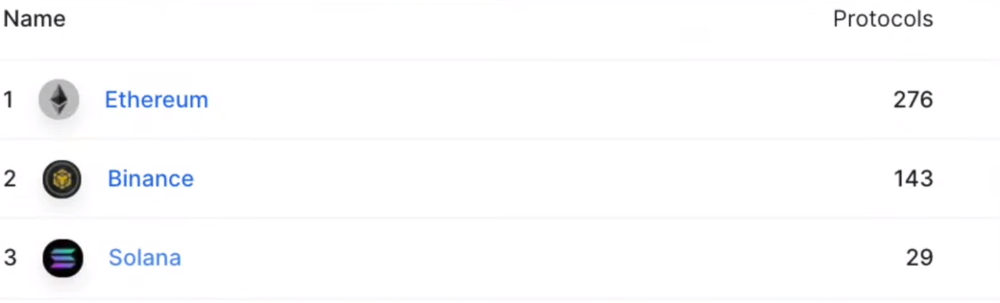

### DEX

- 이더리움 기반, 솔라나
- 유니스왑 V3

명확하지 않음.

**메타버스 상의 뱅킹 시스템** , 블록체인

블록체인팀 => 블록체인 기술, NFT마켓, 지갑, 메인넷 => 껍데기 => 현타

Dapp 서비스

''서비스'' + 블록체인

현재 기술을 살린 사업을

비영구적 손실

- 유동성 풀(Liquidity Pool)

  블록체인 네트워크 상에서 토큰 교환

  유동성 풀 유동성 공급자 

  동일한 가치를 가지는 토큰 쌍을 공급해서 유동성 풀을 만들고

  차액 거래자들이 유동성 풀에 존재하는 토큰을 사고 팔면서 시장이 만들어지는.

  오더북 => DEX AMM => 유동성 풀을 사용

# DeFI

no banks instead there are pieces of code that run and act as a bank. they're open to anyone. they don't require you to trust them because they're literally a piece fo code running a program.

decentralized finance is built on three main things. cryptography, blockchain technology, smart contracts.

one of the reasons we can reliably lend and borrow with banks is because we usually put something down like 20percent collateral so that if we never pay back the full loan our government can come after us and throw us in jail or make us pay that money. in short there are legal consequences for not paying a loan back. well with crypto, this is a problem because one of the pros of crypto is anonymity you could put 20percent down and run away with the rest of the loan never be seen again. so we have to find a way to solve this. in fact with the use of smart contracts we can actually allow others to use our funds while still keeping custody of th m.

```
우리가 은행에서 안정적으로 돈을 빌리고 빌릴 수 있는 이유 중 하나는 우리가 일반적으로 20%의 담보를 담보로 하여 대출 전액을 갚지 않으면 정부가 우리를 뒤쫓아 감옥에 가거나 그 돈을 갚게 할 수 있기 때문입니다. 간단히 말해서 대출금을 상환하지 않으면 법적 결과가 발생합니다. 암호 화폐의 경우 암호 화폐의 장점 중 하나가 익명성이므로 20%를 낮추고 대출의 나머지 부분을 다시는 볼 수 없도록 할 수 있기 때문에 이것은 문제입니다. 그래서 우리는 이것을 해결할 방법을 찾아야 합니다. 실제로 스마트 계약을 사용하면 다른 사람들이 우리 자금을 계속 관리하면서 사용하도록 허용할 수 있습니다.
```

personA wants to earn interest on his coins while personB wants to borrow some coins. so personA goes to compound or ave which are two platforms that allow crypto borrowing and lending. and personA deposits his coins into a smart contract in turn what he gets are called C tokens or A tokens that are a representation of his original coin plus interest whenever he wants to he can just turn his A tokens or C tokens into that smart contract that was created by compounder ave and they spit out his original deposit plus interest. now the smart contract is created this way so that there's no human being that has to do the calculation or have to do the transaction. it's all automatic by code.

```
personA는 자신의 코인에 대한 이자를 얻고자 하고 personB는 코인을 빌리고 싶어합니다. 그래서 personA는 암호화폐 차용 및 대출을 허용하는 두 가지 플랫폼인 복합 또는 아베(AAVE)로 이동합니다. 그리고 personA는 자신의 코인을 스마트 계약에 차례로 예치합니다. 그가 얻는 것은 C 토큰 또는 A 토큰이라고 하며, 이는 그가 원할 때마다 자신의 A 토큰 또는 C 토큰을 스마트 계약으로 전환할 수 있습니다. 복합기 ave가 만들었으며 원래 예금에 이자를 더한 금액을 뱉어냈습니다. 이제 스마트 계약은 이러한 방식으로 생성되므로 계산을 하거나 거래를 해야 하는 사람이 없습니다. 코드에 의해 모두 자동입니다.
```

person B must do something called overcollateralize his loan. this means if he wants to borrow 100$ he must put up 120$ so that way if he runs away and never pays back his loan the smart contract is written in a way that it can pay person A their coins plus interest.

```
사람 B는 자신의 대출을 과잉 담보화(overcollateralize)라고 하는 일을 해야 합니다. 이것은 그가 100$를 빌리고 싶다면 120$를 넣어야 한다는 것을 의미합니다. 그래야 그가 도주하고 대출금을 갚지 않을 경우 스마트 계약이 A 사람에게 동전과 이자를 더한 금액을 지불할 수 있는 방식으로 작성됩니다.
```

## 개요

- 디파이(DeFi)란 탈중앙화 금융(Decentralized Finance)의 약자. 탈중화된 분산금융 혹은 분산재정을 의미

- 서비스 사례 : 체인링크, 에이브, 메이커다오, 컴파운드, 테라 ...

- 활용성 : 시간단축, 금융기관 대체, 자산 및 기금 관리 프로토콜, 교환 프로토콜
  - 금융기관 대체 : ICO, IEO, STO, 암호화폐 지갑, 자산의 토큰화 등 암호화폐로 행하는 거의 모든 행위가 디파이에 해당한다.
  - 교환 프로토콜 : 탈중앙화 분산형 암호화폐 거래소(DEX)를 사용하여 디지털 자산을 P2P 거래하면서도 개인 키를 제어

- DeFi 시장의 거래량 및 시장 점유율을 기반으로 한 상위 DEX(출처: https://coinmarketcap.com/view/defi/)

  

## DEX

- 사용자의 디지털자산을 거래소가 수탁하고 사용자는 거래소가 제공하는 장부 위에서 거래를 하는 구조인 기존의 중앙집권 거래소(예: 업비트, 빗썸, 코인원)는 무허가성(permissionless)이라는 블록체인 특성에 반하는 것.

- 초기 DEX는 과도한 가스비 초래, 확장의 한계성, 부족한 **유동성** 등의 문제로 관심을 갖지 못했다.

- 탈중앙화 거래소로 한국의 올비트, 이오스닥, 중국 홍콩의 바이낸스덱스, 이더파이넥스, 이스라엘의 방코르, 미국 비트셰어에 탑재된 크립토브릿지 등이 있다.

  

### 1. 유니스왑(Uniswap)


- 이더리움(ETH)과 ERC-20 토큰 간의 자동 교환 거래를 용이하게 하도록 설계된 탈중앙화 거래소(DEX). 즉, 이더리움 블록체인상에서 운영되는 컴퓨터 프로그램

- 유동성 문제 등 여러가지 한계성을 보완하여 출시.
  - AMM(유동화된 마켓 메이커) 알고리즘 기반으로 **유동성 풀**(pool, 스마트 컨트랙트 내에 동결되어 있는 자금)을 제공
  - 유동성을 공급하는 자들에게 별도의 보상 지급(유니스왑은 유동성 마이닝이라는 시스템으로 성립되어 있어 토큰을 특정 풀에 맡기면 전용 거버넌스 토큰인 UNI를 보상으로 받을 수 있다)
    - 유동성을 공급한다? 자신의 ERC-20토큰을 스마트 컨트랙트 내에 동결시키는 것

- 투자방법
  1. 지갑 생성 후 지갑에 유니스왑을 연결
  2. 유니스왑은 이더리움 기반 디지털자산에만 적용되기 때문에 이더(ETH)를 구매
  3. 지갑이 설정되면 https://uniswap.org으로 이동하여 'Launch App'을 클릭
  4. 지갑에 있는 이더(ETH)를 원하는 ERC-20토큰과 교환.(ERC-20을 교환하면 유동성 풀로 이더를 보내는 것과 동시에 교환한 ERC-20 토큰을 풀에서 인출하게 됨)
  5. 토큰 교환 전에 *슬리피지 수치*를 주의. 슬리피지는 유동성 풀에서 사용 가능한 양 대비 토큰의 비율. 풀 크기에 비해 대량 주문이 있는 거래는 높은 %의 슬리피지로 거래를 중단하게 됨.
  6. 모든 세부 정보를 확인한 후 스왑을 확인하면 지갑에 팝업이 표시되며 트랜잭션은 이더스캔에서 확인이 가능.

- 특징

  - AMM(Automatic Market Maker)

    기존 거래소에서 볼 수 있는 오더북이 존재하지 않는다.

    암호자산들 사이의 스왑이 이루어지더라도 유니스왑이 거래 수수료를 챙기지 않는다.

  - 자산유동성

    예비금 유동성을 사용하여 계약에서 디지털 자산 거래의 교환을 실현

  - 차익거래

    유니스왑은 분산형 온체인 암호화폐 자산 거래소이지만 중앙화 거래소를 대체할 수는 없다.

    유니스왑의 거래 메커니즘이 왜곡되는 경우 이를 수정할 수 있는 메커니즘이 있어야한다. 이 메커니즘은 **차익 거래의 형태로 존재**한다. 차익 거래는 부동한 거래 시장에 존재하는 가격 차이를 이용하는 거래 전략이다. 거래자는 유니스왑에서 나타날 수 있는 가격 차이를 다른 암호화폐 거래소에 존재하는 환율을 이용할 수 있기 때문에 차익 거래는 유니스왑의 기능에는 필수적이다.

  - 해킹 발생 위험도가 제로(0)가 아니라는 것(스마트 컨트랙트가 문제를 일으킨 경우 해킹 위험성이 높아짐)
  - 거버넌스 토큰 UNI의 가격 변동성 리스크(유동성이 큰 UNI는 일반 통화보다 토큰 페어 가격 변동 위험이 높다.)
  - APY(연간 이자율)는 매번 변경되므로 일정 이자율을 유지한다는 보장이 없다.

---

어떻게 특정 토큰을 다른 토큰으로 전환하는 걸까? 유니스왑을 사용하기 위해서는 무엇이 필요할까?

- 들어가며...

  - 중앙화거래소는 수년간 암호화폐 시장의 중심.

    빠른 정산 시간, 높은 거래량, 지속적으로 증가하는 유동성을 제공

    **그러나**, 신뢰가 필요 없는 프로토콜 형식으로 구축되고 있는 탈중앙화 거래소(DEX)는 거래를 위한 중개자나 관리인이 필요가 없다.

    다만, 블록체인 기술의 내재적인 한계 때문에 중앙화 거래소와 견줄만한 탈중앙화 거래소를 만드는 것은 쉽지 않은 일. => 대부분의 탈중앙화 거래소는 성능과 사용자 경험 측면 모두에서 개선이 필요했다.

  - 유니스왑이란 무엇이며, 어떻게 작동하고 이더리움 지갑을 사용하여 토큰 교환하는 방법을 알아보자.

- 유니스왑이란

  - 이더리움상에 구축된 탈중앙 거래소 프로토콜.

  - *자동화된 유동성 프로토콜*

  - 거래를 위한 오더북이나 중앙화된 주체가 전혀 필요하지 않음

  - 어떻게 오더북없이 거래를 할 수 있을까?

    유니스왑은 유동성 공급자들이 제공하는 유동성 풀 모델을 통해 작동한다. 오더북 깊이를 제거한 탈중앙화된 가격 결정 메커니즘을 제공


### 2. 스시스왑(Sushiswap)

- 유니스왑은 비수탁형 인스턴트 스왑 프로토콜로 이더리움상에서 암호화폐를 쉽게 교환할 수 있는 탈중앙화 거래소(DEX)
- 유니스왑의 문제점(유동성 공급자들이 합당한 보상을 받지 못함, 사용자가 개발 방향에 대한 많은 발언권을 갖지 않음)을 해결하기 위해 유니스왑을 포크(fork)해서 토큰(스시 토큰)을 발행한 것
- 디파이 프로토콜. 기존의 AMM을 이용한 유니스왑 모델에 자체 토큰인 스시(SUSHI)를 도입해 이자 농사를 가능하도록 했다.
- 유니스왑과 다른 2가지 기능
  1. 토큰 보유자들에게 거버넌스 권한을 부여(프로토콜 통제가 가능)
  2. 보유자들에게 프로토콜 수수료의 일부를 제공

### 3. 오르카(Orca)


- 오르카란?

  솔라나 블록체인상의 탈중앙화 거래소(DEX). 공정 가격 지표(Fair Price Indicator) 덕분에 이더리움상의 어떤 다른 DEX보다 더 저렴하고, 빠르고, 쉽게 토큰을 교환할 수 있다라고함.

  LP로써 토큰을 쌍으로 묶어 유동성을 공급하고 이자를 지급 받을 수 도 있다.

  시총 1500억 대비 TVL 1조 3000억 시총 대비 TVL 약 0.113

  

  기존 디파이와의 차별성? 큰 차이점이 있나? 솔라나에는 레이디움, 세럼 등의 자리 잡고있는 디파이 선발주자들이 존재

  단일 스테이킹도 끝나면서 스테이킹도 불가

- 특징

  1. 공정한 가격 지표

     DeFi의 문제점 중 하나는 제공되는 풀이 현재 공정한 가격을 제공하고 있는가임. 현재 DEX는 사용자가 'DEX가 올바른 시장 가격을 제공한다는 맹목적인 신뢰' 혹은 시장 가격은 '트랙커 또는 타 거래소와의 시간 소모적인 비교'를 통해 이뤄지고 있다. 이에 오르카는 이러한 문제를 해결하고 **공정한 가격 지표**를 제공

     오르카를 통해 거래 진행 시 다음 조건을 모두 충족하는지 확인하게 됨

     - 환율이 코인게코에 있는 시장 환율의 1% 이내인지
     - 슬리피지가 허용 오차 설정 범위 값보다 작거나 같은지(기본값: 1%)

     확인이 완료되면 교환을 진행할 수 있다. 그렇지 않은 경우 환율 혹은 슬리피지에 대한 경고가 나타나며 거래 진행 여부에 대한 결정을 선택할 수 있다.

  2. 어그리게이터

     오르카는 AMM뿐만 아닌 어그리게이터 역할을 수행. 거래 진행 시 오르카 혹은 세럼 스왑의 유동성 풀로부터 사용 가능한 최고 환율을 제공.

  3. 토큰 밸런스

     이더리움에서 사용되는 대부분의 AMM은 브라우저 확장 프로그램 없이 잔액을 확인할 수 없다. 이는 ORCA UX와 비교하여 명백한 차이점이라고 볼 수 있다. 오르카는 인터페이스에 유동성 제공 관련 실시간 업데이트를 포함하여 오르카에 상장되어있는 모든 토큰의 잔액을 확인할 수 있다.

- 솔라나에서 이루어지는 이유

  1초당 5만건의 거래, 400ms 블록타임, $0.01의 평균거래 수수료

- 거버넌스 토큰

  오르카 거버넌스 토큰은 2021.08.09 런칭.

- 에어드랍

  21.08.09 유동성 공급자 및 거래자들에게 소급하여 분배.

**ORCA Tokenomics**

- 수수료

  LP에게 고정 0.3%를 지불하는 방식을 사용하지않고 수수료가 더 낮은 풀에 비례하여 조정되는 새로운 풀 구조

  0.25% : LP, 0.04% : Orca Treasure, 0.01% : Orca Impact Fund

  Orca Treasure : ORCA 토큰의 가치를 Orca 자체에 연결하는 DAO. 누적된 수수료는 개발 자금 조달, 환매를 통한 토큰 공급 관리 또는 Orca 프로토콜의 장기적인 상태를 지원하는 기타 새로운 계획에 사용될 수 있다.

  Orca Impact Fund : real-world에 긍정적 영향을 미치기위한 팀의 노력. 적립된 수수룐ㄴ 분기별로 기후변화 대응을 위해 기부.

- 토큰분배

  - 초기 순환 공급

    ORCA 거버넌스 토큰의 초기 유통량은 525만(초기 공급은 전적으로 기존 유동성 공급자 및 거래자에 대한 에어드랍으로 구성)

    LPs, average traders, heavy traders, advisors

- 

---

- 지갑

  Sollet, Phantom, Solflare, Math Wallet, Coin98 사용가능

  

  모바일 기기에서 솔라나 스마트 컨트랙트 실행을 지원하는 지갑 서비스가 아직 존재하지 않음.

- 유동성 풀

  유니스왑에서 일반화되어있는 Constant Product Curve(x * y = k)와 StableCoin 풀(현재 USDC/USDT)을 위해 curve.fi의 stable curve를 사용

- Whirl pool

  표준 풀과 달리 whirl pool 유동성 공급자는 거래 수수료와 토큰 배출량을 놓고 경쟁을 벌이게 된다. 이는 예금 매개변수에 따라 유동성 공급자들 간에 구분된다. 가격대를 촘촘하게 설정하는 이용자 '집중유동성, 레버리지'의 구조상 현재 토큰 가격 전후로 수수료와 인센티브가 더 많이 지급된다. 반면, 다이버전 손실에 더 취약.

  기존 풀에서는 LP가 토큰에 대해 가능한 전체 가격(0~infinity)에 걸쳐 유동성을 제공. 월풀에 참여할 때 각 사용자는 유동성의 상한과 하한을 선택할 수 있다. 한계는 임의적이지 않고, 사용자는 균등하게 분포된 이산형 눈금 집합 중에서 선택.

- 투자방법
  1. ORCA 거래소에 들어간다(https://www.orca.so/)
  2. connect wallet을 클릭하여 솔라나 생태계 DEX 지갑을 만든다.
  3. 지갑 생성시 나오는 팝업창에 PW기입, UNLOCK눌러서 ORCA거래소와 본인의 탈중앙화 지갑을 연동한다.(본인이 사용하는 거래소에서 전환하고자 하는 코인(USDT, USDC, SOL)을 지갑으로 출급하여 자금 이동을 해놓는다.)
  4. 갖고인는 코인으로 ORCA코인을 스왑하여 구입한다.
  5. ORCA-USDC를 최종적으로 Deposit Liquidity하여 Deposit 디파이를 한다.

### 4. 테라(Terra)


블록체인을 활용한 결제 시스템을 다양한 이커머스 플랫폼에 제공하는 글로벌 블록체인 핀테크 기업.

테라 프로토콜에는 가격 변동이 없는 스테이블코인 '테라'와 가격 안정화를 위한 마이닝 토큰 '루나'가 있다.

스테이블코인인 테라의 가격 안정화를 위한 채굴 암호화폐 루나(UST). 테라의 가격이 하락할 때 루나를 추가 발행하고 테라의 유통량을 흡수해 테라의 가격을 올리고자 만들어짐. 

---

- 참고링크 : https://www.youtube.com/watch?v=6KoctWUwxvI

- 블록체인 생태계 디파이 Dapp

  

- 솔라나 밑에 있는 생태계 앱들중 포텐셜있는 앱

  1. 레이디움(Raydium)

     솔라나 생태계 앱의 덱스 + 디파이 대장

     TVL 1.95b

     스왑, 디파이, IDO, NFT 등 이것저것 서비스함

     솔라나 생태계의 종합마트

  2. 오르카(Orca)

     솔라나 디파이 서비스 DEX 중 하나

     TVL 1.2b

     

     

## **용어정리**

- 거버넌스 토큰 : ~~스마트컨트랙트와 투표로 운영되는 DAO가 자금모집, 이익배분, 커뮤티니 구성원의 투표를 진행하기 위해 필요한 것이 거버넌스 토큰~~
- 비영구적 손실 : 비영구적 손실은 유동성 풀에 유동성을 공급했을 때, 즉 자산을 예치시켰을 때 예치된 자산의 가격 변동으로 인해 임시적으로 손실을 보는 것을 의미. 예치된 자산의 가격 변동이 커질수록 비영구적인 손실이 더 크게 발생.
- AMM : Automated Marker Maker. 자동화된 마켓 메이커. 유저간 코인 거래가 자동으로 체결될 수 있도록 하는 알고리즘. 가격 결정 알고리즘, 유동성 공급자, 토큰 페어, 트레이더로 구성
- 아토믹스왑 : 중앙화된 암호화폐 거래소를 거치지 않고, 서로 다른 코인을 직접 교환하는 것. 코인스왑 또는 에어스왑이라고도 한다.

- 오더북 : 자산에 대해 현재 열려 있는 매수 및 매도 주문 목록을 가격별로 정리한 것. 구매자와 판매자의 모든 매수,매도 주문을 기록한 전자 목록. 호가창방식이라고 생각하면 된다.

- 오더북 깊이(마켓 뎁스) : 오더북 내 현재 체결되지 않은 주문을 시각화 한 것. 오더북이 처리할 수 있는 양인 유동성의 정도를 의미할 수 있다. "깊은(deeper)"시장일수록, 오더북내에 더 많은 유동성이 존재.

- 온-체인 : 블록체인 네트워크에 트랜잭션이 기록되는 것. (따라서 온체인 데이터는 블록체인 상에서 이뤄지는 모든 움직임을 데이터화한 지표를 의미한다.)

  온체인의 대표적인 예로 비트코인, 이더리움이 있다.

- TPS : Transaction per Second. 1초당 처리할 수 있는 트랜잭션의 개수

- 레이어2 : 블록체인 확장성을 높이기 위해 블록체인 바깥에 데이터를 처리하는 레이어를 별도로 추가하는 방식. 블록체인에는 데이터를 처리한 결과값만 기록해 블록체인 자체의 연산 부담을 줄일 수 있다.

- 유동성 : 개인 혹은 기업이 특정 자산의 가치를 최대한 변동시키지 않으면서, 해당 자산을 빠르게 구매하거나 팔 수 있게 하는 시장의 특징(market's feature). 유동성이 가장 높은 자산은 '돈'(내가 갖고 있는 1000원은 다른 사람이 갖고 있는 1000원과 어떠한 가치 변동 없이 바로 교환이 가능하기 때문)

- TVL : 체인별 예치 되어 있는 자산 총 액수

- 에어드랍 : 공중(air)에서 떨어뜨린다(drop)는 뜻으로서, 기존 암호화폐 소유자들에게 무상으로 코인을 배분하여 지급하는 행위. 주식에서 '무상증자'와 유사한 개념. 보통 에어드랍을 하기 전 스냅샷이라는 과정을 밟는다.

- 스냅샷 : 개인이 소유한 지갑 또는 거래소 지갑에서 가능한 것으로 어떤 특정한 블록의 각 주소에 얼마의 코인 또는 토큰을 소유했는지 기록하는 것. 예를들어 100,000번 째 블록일 때 이더리움 클래식 스냅샷을 진행한다고 하면, 그 시점에 지갑에 이더리움을 보유하고 있어야 한다. 반면 거래가 100,001번째 블록에서 진행될 경우, 해당 거래는 정상적으로 진행되지만 에어드랍에서는 제외된다. 그래서 대부분 스냅샷 진행 전 암호화폐 가격이 상승하고 스냅샷 진행 후 하락한다.

- DAO : Decentralized Autonomous Organizations. 탈중앙 분산화된 자율적인 조직. 탈중앙화 자율조직이라고 한다. 이더리움 프로젝트를 지원하기 위한 일종의 벤처이기도 하다.

- 슬리피지 : 유동성 풀에서 사용 가능한 양 대비 토큰의 비율. 풀 크기에 비해 대량 주문이 있는 거래는 높은 %의 슬리피지로 거래를 중단하게 됨.

- 샤딩 : sharding은 하나의 거대한 DB나 네트워크 시스템을 여러 개의 작은 조각으로 나누어 분산 저장하여 관리하는 것. 단일 DB에서 저장하기 너무 클 때 사용하여 노드에 무겁게 가지고 있던 데이터를 빠르게 검증할 수 있어 빠른 트랜잭션 속도를 향상시킬 수 있다. 샤딩을 통해 나누어진 블록들의 구간(epoch)을 샤드(shard)라고 부른다.

- 디페깅 : 가치 연동이 끊긴 현상

- 유동성 풀

  Liquidity Pool의 정의는 스마트컨트랙트에 잠겨있는 토큰들의 풀을 의미힌다.

  - 사용성 

    - used to facilitate trading by providing liquidity
    - are used by some of the decentralized exchanges aka DEXES

  - 프로젝트

    - 유동성 풀이 소개된 초반의 프로젝트는 Bancor였는데 유니스왑으로 유명해짐.

  - 작동원리

    - 왜 유동성풀이 필요한가?

      기존(coinbase, 바이낸스)에는 trading이 orderbook모델로 이루어져있었다.

    - 작동원리

  2개의 토큰을 동시에, 한꺼번에 투입. 그때의 가격비율은 1:1. 같은 가치를 갖는 2개의 토큰을 유동성 풀에 제공

  거래소에 있을때는 비영구적 손실이 발생하지 않는다. 유동성풀에 넣었을때 발생하는 손실이 비영구적 손실.

  거래소에 가만히 놔두면 가치가 100$였는데, 유동성 풀에 넣으니 100$ => 95$로 변경될 수 있다는 것.

  2개의 토큰을 다시 가지고올때 손실이 확정이 되는 것.

  사용자가 결정하는 것이 아니라 스마트 컨트랙트상에 올라가있는 코드에 의해서 가격이 결정됨

  - AMM?

