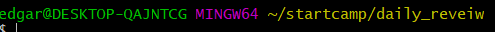

# Basic CLI

## CLI(Command Line Interface)?

> 명령줄로 구성 된 인터페이스로서, 우리에게 익숙한 폴더(내PC > C드라이브 > 사용자 > edgar)에서 발생하는 일들이 명령줄로 구성됨.

## 장,단점

- 장점
  - 한 번에 많은 폴더나 파일들을 생성, 삭제가 가능하다.
- 단점
  - 모든 과정을 일일이 입력해야하는 번거로움

## 폴더(dirctory) 관련 용어정리

- `~`
  - Home 폴더를 의미
  - 위치는 일반적으로 /C/User/[계정명]
  - 로그인 한 계정명과 같다고 생각하자
- `/`
  - Root폴더(최상단)를 의미
  - 폴더 시스템을 거쳐 올라가고 올라가서 나오는 마지막 '근본' 폴더
- `.`
  
- 현재 위치
  
- `..`

  - 나보다 한단계 위의 위치

    ```
    예를들어 
    ~/TIL/CLI에 위치한 상태에서 cd ..를 하게되면
    ~/TIL로 이동하게된다
    ```

    

## 명령어

- `mkdir` : 폴더 생성

- `rm` : 삭제

  ```
  rm -r [폴더명] : 폴더삭제
  rm -r / : 컴퓨터 날리겠다는 의미(매우 위험합니다)
  rm -r -f : 컴퓨터 날리는데 -f(false) 강제로 하겠다. == rm -rf
  rm * : 모든 파일 삭제
  rm *.md : .md확장자를 가진 모든 파일 삭제
  ```

- `ls` : 리스트 보기, 지금 가지고 있는 것들을 보여줘

- `-`  : 옵션을 의미

- `cd` : 이동

- `touch` : 파일 생성

  ```
  touch [파일명] : 백지 상태의 파일생성
  touch [파일명.확장자] : 확장자 형식의 파일생성
  ```

- `clear` or `ctrl + l` : 창 깨끗하게 비우기

```
$ mkdir TIL
$ cd TIL
```

```python
def new
```

- `ctrl + c` : 명령 취소
- `code` : vscode로 폴더, 파일 열기

```
$ code startcamp/
```


## Summary

| 명령어   | 설명             | 상세                |
| -------- | ---------------- | ------------------- |
| mkdir    | make directory   | 폴더생성            |
| rm       | remove           | 삭제                |
| ls       | list             | ls -a 전체 보여주기 |
| cd       | change directory | 이동하기            |
| touch    |                  | 파일생성            |
| ctrl + c | 명령취소         | ~~쓰다가 ctrl + c   |

```
이렇게 블록을 생성합니다.
​```(백틱)을 3번 입력하고 만들어 줍니다.
```

```python
print(list)
​```(백틱)을 3번 입력하고 언어를 입력하면
블록의 형식을 설정합니다!
예를들어 ```(백틱)이후 Python을 입력시
이 블록은 Python언어로 인식됩니다.
```

이탤릭체는 *이탤릭체*

보드체는 ** 혹은 __ 사용 --> __보드체__

취소선은 ~사용 --> ~~취소선~~



여기서 노란색 부분을 '익스플로러'라고 한다.

