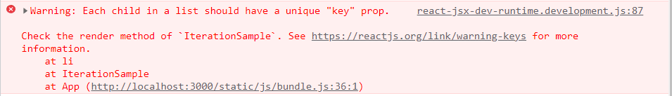

# 리액트를 다루는 기술

이번장에서는 리액트 프로젝트에서 반복적인 내용을 효율적으로 보여 주고 관리하는 방법에 대해서 알아보자.

## 6. 컴포넌트 반복

```react
{...}

const IterationSample = () => {
    return (
    	<ul>
        	<li>막걸리</li>
            <li>소주</li>
            <li>맥주</li>
        </ul>
    )
}

{...}
```

### map() 함수

- map()

  JS 배열 객체의 내장함수 `map()`을 사용하여 반복되는 컴포넌트를 렌더링할 수 있다. map 함수는 파라미터로 전달된 함수를 사용해서 배열 내 각 요소를 원하는 규칙에 따라 변환한 후 그 결과로 **새로운 배열을 생성한다**.

- 문법

  ```js
  arr.map(callback, [thisArg])
  ```

  - `callback` : 새로운 배열의 요소를 생성하는 함수로 파라미터는 아래 세 가지이다.
    - `currentValue` : 현재 처리하고 있는 요소
    - `index` : 현재 처리하고 있는 요소의 index 값
    - `array` : 현재 처리하고 있는 원본 배열
  - `thisArg`(선택 항목) : callback 함수 내부에서 사용할 this 레퍼런스

- 예시

  ```js
  const arr = [1, 2, 3, 4, 5];
  const newArr = arr.map(function(currentValue) {
      return curerntValue * currentValue
  })
  console.log(newArr); // [1, 4, 9, 16 ,25]
  ```

  map 함수는 **기존 배열로 새로운 배열을 만드는 역할**을 한다.

  ```js
  const newArr = arr.map(num => num * num);
  ```

  위와 같이 ES6문법으로도 작성할 수 있다.

### 데이터 배열을 컴포넌트 배열로 변환하기

기존 배열에 있는 값들로 새로운 배열을 생성할 수 있는데, 같은 원리로 기존 배열로 컴포넌트로 구성된 배열을 생성할 수도 있다.

즉, 데이터가 들어가 있는 배열이 있듯이 컴포넌트가 들어간 배열을 만들 수 있다는 것.

- 예시

  ```react
  const IterationSample = () => {
      const drinks = ['막걸리', '소주', '맥주'];
      const drinkList = drinks.map(drink => <li>{drink}</li>);
      return <ul>{drinkList}</ul>
  }
  ```

  문자열로 구성된 배열을 선언한다. 그 배열을 사용하여 JSX 코드로 된 배열을 새로 생성한 후 drinkList에 담는다.

- 문제점

  하지만 콘솔을 확인해보면 이 방식에는 아직 문제가 존재한다.

  

  `Warning : Each child in a list should have a unique 'key' prop.`

- key

  리액트에서 key는 컴포넌트 배열을 렌더링했을 때 어떤 원소에 변동이 있었는지 알아내려고 사용한다. 예를 들어 동적 데이터를 다룰때는 원소를 새로 생성할 수도, 제거할 수도, 수정할 수도있다. **key가 없을 때는 Virtual DOM을 비교하는 과정에서 리스트를 순차적으로 비교하면서 변화를 감지**한다. 하지만 **key가 있다면 이 값을 사용하여 어떤 변화가 일어났는지 더욱 빠르게 알아낼 수 있다.**

  - 설정

    key 값 설정은 map 함수의 인자로 전달되는 함수 내부에서 컴포넌트 props를 설정하듯이 설정하면 된다.

    key값은 언제나 유일해야 한다. 마땅한 고유번호가 없다면 map 함수에 전달되는 콜백 함수의 인수인 index 값을 사용한다.(**index를 key로 사용하면 배열이 변경될 때 효율적으로 리렌더링하지 못한다는 것에 유의하자.**)

### 응용

위에서 배운 개념을 바탕으로 동적인 배열을 렌더링 해보자.

```react
const IterationSample = () => {
    const [names, setNames] = useState(
    	{id: 1, text: '막걸리'},
    );
    const [inputText, setInputText] = useState('');
    const [nextId, setNextId] = useState(2);
	
    const nameList = names.map(name => <li key={name.id}>{name.text}</li>)
                               
	const onChange = e => setInputText(e.target.value);
    const onClick = () => {
        const newNames = names.concat({
            {id: nextId, text: inputText}
        });
		setNames(newNames);
        setNextId(nextId+1);
        setInputText('');
    }
    const onKeyUp = e => {
        if (e.keyCode === 13) { // 엔터누를경우 Click과 동일하게 작동
            onClick();
        }
    }
    return (
    	<>
          	<input value={inputText} onChange={onChange} onKeyUp={onKeyUp} />             <button onClick={onClick}>추가</button>
        	<ul>{nameList}</ul>
        </>                          
    )
}
```

- 데이터 추가

  여기서 배열에 새 항목을 추가할 때 배열의 push 함수를 사용하지 않고 concat을 사용했는데, push 함수는 기존 배열 자체를 변경하는 반면, concat은 새로운 배열을 만들어 준다는 차이점이 있다.

:bulb: **불변성 유지**

리액트에서 상태를 업데이트할 때는 기존 상태를 그대로 두면서 새로운 값을 상태로 설정해야한다. 이를 불변성 유지라고 한다. 불변성 유지를 해주어야 나중에 **리액트 컴포넌트의 성능을 최적화**할 수 있다.

- 데이터 삭제

  불변성을 유지하면서 배열의 특정 항목을 지울 때는 배열의 내장 함수 filter를 사용한다.

  ```js
  const numbers = [1, 2, 3, 4, 5];
  const biggerThanThree = numbers.filter(number => number > 3); // [4, 5]
  ```

  filter함수의 인자에 분류하고 싶은 조건을 반환하는 함수를 넣어주어 분류한다.

  ```js
  // 위 예제에서 3만 없애고 싶은경우
  const withoutThree = numbers.filter(number => number !== 3);
  ```

## 정리

- 반복되는 데이터를 렌더링하는 방법

- 데이터 배열을 활용하여 JSX를 담은 컴포넌트 배열로 변환하기
  - 컴포넌트 배열을 렌더링할 때는 항상 key값 설정에 유의하자.
- 상태 안에서 배열을 변형할 때는 배열에 직접 접근하여 수정하는 것이 아니라 concat, filter 함수를 사용하여 새로운 배열을 만든 후 이를 새로운 상태로 설정해준다.(불변성 유지)

