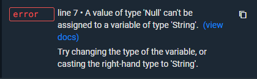
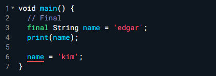
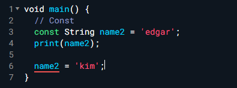
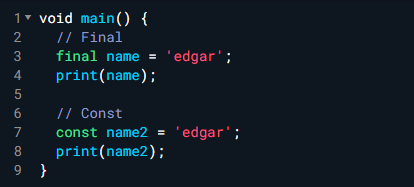
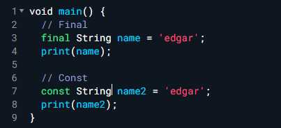
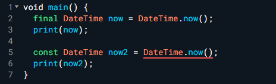

# Dart

> [1시간만에 끝내는 Dart 언어 기본기](https://www.youtube.com/watch?v=3Ck42C2ZCb8) 강의를 보면서 정리한 내용입니다.

- hello world

  세미콜론(;)은 한 줄이 끝날때마다 반드시 작성해준다.

  ```dart
  void main() {
      print('Hello world.');
  }
  ```

## 변수

### 변수선언

코드는 위에서 아래로 순서대로 실행된다.

변수선언은 `var` 키워드를 사용한다.

변수의 값은 변경할 수 있으나, 재선언은 불가능하다.

```dart
void main() {
    var name = 'edgar';
    var name2 = 'edkim';
    name = 'change';
    print(name); // change
    
    var name = '재선언은 불가';
}
```

### 변수타입

- 문자(String)

  ```dart
  // 글자 타입
  // String
  String name2 = '에드';
  String name3 = '김';
  print(name2);
  print(name3);
  ```

- 정수(integer)

  ```dart
  // 정수
  // integer
  int number1 = 10;
  print(number1);
  
  int number2 = -20;
  print(number2);
  
  // 산술연산
  print(number1 + number2);
  print(number1 - number2);
  print(number1 / number2);
  print(number1 * number2);
  ```

- 실수(double)

  ```dart
  // 실수
  // double
  double number3 = 2.5;
  double number4 = 0.5;
  
  print(number3 + number4);
  print(number3 - number4);
  print(number3 / number4);
  print(number3 * number4);
  ```

- 불리언(Boolean)

  ```dart
  // 불리언
  // Boolean
  bool isTrue = true;
  bool isFalse = false;
  print(isTrue);
  print(!isTrue);
  print(isFalse);
  print(!isFalse);
  ```

- var

  ```dart
  // var String
  var name4 = 'name';
  var number5 = 20;
  // 실제 변수값이 실행되는 순간에 어떤타입인지 알려준다.
  print(name4.runtimeType);
  
  // 이런 경우 매번 타입지정이 어렵기에 var 사용하기도 한다.
  Map<String, Map<int, List<double>>> testType = {};
  // var testType = {};
  ```

- 문자열은 덧셈가능

  ```dart
  String name = 'edgar';
  String name2 = 'kim';
  
  // 덧셈가능
  print(name + name2);
  print(name + ' ' + name2);
  
  // 변수사용
  print('${name} ${name2}');
  // 생략가능(변수만 사용할 경우)
  print('$name $name2');
  ```

- dynamic

  ```dart
  dynamic name = 'edkim';
  print(name);
  
  dynamic number = 1;
  print(number);
  
  var name2 = 'john';
  print(name2);
  
  print(name.runtimeType);
  print(name2.runtimeType);
  
  // dynamic string => integer(타입변경가능)
  name = 2;
  
  // var string !=> integer(타입변경불가능)
  // name2 = 5;
  ```

## Nullable vs. Non-nullable

```dart
void main() {
    String name = 'edkim';
    name = null;
}
```

위와 같이 작성하면 아래와 같은 에러가 발생한다.



즉, String 타입은 null이 될 수 없다(`non-nullable`)는 것이다. 그렇다면 null이 될 수 있도록 변수 선언을 하는 방법은 무엇인가?

```dart
void main() {
    String? name = 'edkim';
    name = null;
    print(name!); // name은 null이 아님을 지정해줄 수 있다. 이 경우 바로 윗줄에서 null로 지정해놨는데 이처럼 !로 지정해줄 경우 에러가 발생하게된다.
}
```

위처럼 타입뒤에 `?`를 붙여주면 변수를 null이 될 수 있도록(`nullable`) 만들 수 있다. 추가적으로 null이 들어갈 수 있는 타입에 `!`를 붙여주면 현재 해당하는 값은 null이 아니다 라고 지정해줄 수가 있다.

## Final vs. Const

- Final

  Final은 일반적으로 변수 선언할 때 변수선언 맨 앞코드에 작성해준다.

  Final로 변수 선언을 하게되면, **변수 선언 이후에 변수 값을 변경할 수 없다.**

  

- Const

  Const도 작성방식은 final과 동일하다.

  const또한 final과 마찬가지고 **변수 선언 이후에 변수 값을 변경할 수 없다.**

  

- `var` 키워드 생략이 가능하다.

  타입을 지워버리고 변수 선언이 가능하다.

  

  위 코드는 아래와 동일하다.

  

- DateTime

  시간과 날짜를 저장할 수 있는 데이터타입

  ```dart
  void main() {
      DateTime now = DateTime.now(); // 현재시간을 저장
      print(now); // 2023-01-09 22:36:15.227
  }
  ```

  하지만 여기서 주의해야할 점이 있다. 위에서 `DateTime.now()`에서 의미하는 현재시간은 코드를 실행하는 순간이 아니라 코드를 주욱 실행하다가 **해당 `DateTime.now()`코드가 실행될 때의 현재시간을 의미한다.**

  ```dart
  void main() {
    DateTime now = DateTime.now(); // 시간a
    print(now);
    
    DateTime now2 = DateTime.now(); // 시간b
    print(now2);
  }
  ```

  시간a와 시간b는 코드실행이 매우 빨리되어서 값이 같을 수는 있으나 정확한 의미는 코드가 실행되는 시간이므로 now와 now2값은 다르다.

- 여기서! final과 const를 적용해보면 아래와 같이 에러(Const variables must be initialized with a constant value)가 뜬다.

  

  :star:**const는 build 타임의 값을 알고있어야 하는반면 final은 build 타임의 값을 알고있지 않아도 된다.**

  build time은 뭐임?

  우리가 프로그램 코드를 작성한 후에 build를 하게되면 해당 프로그래밍 언어가 컴퓨터가 이해할 수 있는 언어로(10100010...) 변환이 된다. 이 build가 이루어지는 순간이 build time이다. const가 build time의 값을 알고 있어야 한다는 말인 즉슨, 해당 코드를 작성했을 때 작성하는 순간의 코드의 값을 알고있어야 한다. 하지만 `DateTime.now()`의 경우 해당 코드가 실행될 때의 시간이고, 언제 실행될지는 알 수가 없다. 그렇기에 `const`로 선언한 변수의 경우 `DateTime.now()`값을 할당 받을 수 없다.

## Operator

여러가지 연산자(곱셈, 덧셈, ...)

- 기본 산술연산

```dart
void main() {
  int number = 2;
  print(number);
  print(number + 2);
  print(number - 2);
  print(number * 2);
  print(number / 2);
  
  print('-----------');
  print(number % 2); // 나머지
  print(number % 3);
  
  print('-----------');
  number++; // 1만큼 증가
  print(number);
  number--; // 1만큼 감소
  print(number);
}
```

- 아래와 같이도 가능하다

  ```dart
  void main() {
    double number = 4.0;
    print(number);
    
    number += 1;
    print(number); // 5
    
    number -= 1;
    print(number); // 4
    
    number *= 2;
    print(number); // 8
    
    number /= 2;
    print(number); // 4
  }
  ```

- null조건 operator

  ```dart
  void main() {
    // null
    double? number = 4.0;
    print(number);
    
    // final, const 둘 다 아니라서 변수값변경이 가능하다.
    number = 2.0;
    print(number);
    
    // double뒤에 ?를 넣어줬으므로 null또한 가능하다.
    number = null;
    print(number);
    
    number ??= 3.0;
    print(number); // 3
  }
  ```

  여기에서 `number = null`부분을 생략하면 어떻게 될까?

  ```dart
  void main() {
    ...
        
    // 생략해보면
    // number = null;
    
    number ??= 3.0;
    print(number); // 2
  }
  ```

  2가 된다는 것을 알 수 있다.

  `??=` 을 해석해보면 좌항 변수의 값이 `null`이라면 우항의 값으로 변경해라가 되겠다. `null`이 아니라면 값을 그대로 유지.

- 비교 연산자

  ```dart
  void main() {
    int number1 = 1;
    int number2 = 2;
    
    print(number1 > number2);
    print(number1 < number2);
    print(number1 >= number2);
    print(number1 <= number2);
    print(number1 == number2);
    print(number1 != number2);
  }
  ```

- 타입 비교 연산자

  ```dart
  void main() {
      int number = 1;
      print(number is int); // true
      print(number is String); // false
      print(number is! int); // false
      print(number is! String); // true
  }
  ```

- 논리 연산자

  ```dart
  void main() {
    // && - 두 조건 모두 충족해야 할 때
    // 두 조건 모두 true일 경우 true
    // 둘 중 하나라도 false일 경우 false
    bool result = 12 > 10 && 1 > 0;
    print(result);
    bool result2 = 12 > 10 && 1 < 0;
    print(result2);
    
    // || - 두 조건 중 하나만 충족하면 될 때
    // 둘 중 하나만 true일 경우 true
    // 두 조건 모두 false일 경우 false
    bool result3 = 12 > 10 || 1 < 0;
    print(result3);
    bool result4 = 12 < 10 || 1 < 0;
    print(result4);
  }
  ```

## List

조금은 복잡할 수 있지만 차근차근해보자. 리스트 타입은 말그대로 리스트(List)를 의미한다.

```dart
void main() {
    // List
	List<String> mv1_4 = ['edgar', 'john', 'hyun'];
	List<int> numbers = [1, 2, 4, 5, 3, 7];
	print(mv1_4); // [edgar, john, hyun]
	print(numbers); // [1, 2, 4, 5, 3, 7]
    
    // index
    // 0부터 시작
  	print(mv1_4[0]); // edgar
  	print(mv1_4[1]); // john
    
    // 길이
  	print(mv1_4.length); // 3
    
    // 추가
    mv1_4.add('gong');
    print(mv1_4); // [edgar, john, hyun, gong]
    // 삭제
    mv1_4.remove('gong');
    print(mv1_4); // [edgar, john, hyun]

    // 인덱스가져오기
    print(mv1_4.indexOf('hyun')); // 2
}
```

리스트 타입에는 위에 보이는 꺾쇠(`<>`) 모양의 제너릭(generic)이라는 것을 사용하는데 이 안에 리스트 안에 들어가는 변수들의 타입을 지정해주게 된다.

## Map

List에서는 하나하나의 개별값을 리스트에 넣어줬지만, Map 에서는 꼭 Key, Value 짝을 이루어서 넣어줘야만 한다.

```dart
void main() {
  // Map
  // Key / Value
  Map<String, String> dictionary = {
    'Harry Potter': '해리포터',
    'Ron Weasley': '론 위즐리',
    'Hermione Granger': '헤르미온느 그레인저'
  };
  print(dictionary);
  
  Map<String, bool> isInHarryPotter = {
    'Harry Potter': true,
    'Ron Weasley': true,
    'Ironman': false,
  };
  print(isInHarryPotter);
  
  // 추가1
  isInHarryPotter.addAll({
    'Spiderman': false,
  });
  print(isInHarryPotter);
  
  // 추가2
  isInHarryPotter['Hulk'] = false;
  print(isInHarryPotter);
  
  // 값 가져오기
  print(isInHarryPotter['Ironman']); // false
  
  // 값 변경
  isInHarryPotter['Spiderman'] = true;
  print(isInHarryPotter);
  
  // 삭제
  isInHarryPotter.remove('Harry Potter');
  print(isInHarryPotter);
  
  // key값만 가져오기
  print(isInHarryPotter.keys);
  // value값만 가져오기
  print(isInHarryPotter.values);
}
```

이번에는 List와 다르게 타입을 2개 넣어주어야만 한다. key의 타입, value의 타입 2개를 지정해준다.

## Set

Map과 유사하지만 key-value 짝이아니라 List처럼 하나의 값들만 저장할 수 있는 형태.

List와 Set의 차이는 List는 중복값이 들어갈 수 있지만 Set은 불가능하다.(중복자동처리)

```dart
void main() {
  // Set
  final Set<String> names = {
    'edgar',
    'john',
    'hyun',
    'john',
  };
  print(names); // {edgar, john, hyun}
  
  // 추가
  names.add('kim');
  print(names);
  
  // 삭제
  names.remove('kim');
  print(names);
  
  // 존재확인
  print(names.contains('john'));
}
```

## If문

작성방식은 JavaScript와 유사하다.

```dart
void main() {
  // if 문
  int number = 2;
  
  if (number % 3 == 0) {
    print('나머지가 0');
  } else if (number % 3 == 1) {
    print('나머지가 1');
  } else {
    print('나머지가 2');
  }
}
```

 if문과 유사한 기능을하는 switch문 또한 존재한다.

```dart
void main() {
  // switch 문
  int number = 2;
  
  switch (number % 3) {
    case 0:
      print('나머지가 0');
      // break를 반드시 넣어주어야만 뒤에 코드실행을 하지않는다.
      break;
      
    case 1:
      print('나머지가 1');
      break;
      
    default:
      print('나머지가 2');
      break;
  }
}
```

## Loops

반복작업 실행 시 사용하는 방법.

- for loop

첫 번째 : loop에서 사용할 변수
두 번째 : 언제까지 loop를 실행할 것 인지에대한 조건
세 번째 : 한 번 loop이 실행될 때마다 실행되는 코드

```dart
void main() {
  // for loop
  for(int i = 0; i < 10; i++) {
    print(i);
  }
}
```

여러 계산에 유용하다

```dart
void main() {
  int total = 0;
  List<int> numbers = [1, 2, 3, 4, 5, 6];
  for (int i = 0; i < numbers.length; i++) {
    total += numbers[i];
  };
  print(total);
}
```

- for in loop

  위 경우를 for ... in loop문을 사용하여 보다 간단하게 나타낼 수 있다.

  ```dart
  for (int number in numbers) {
      total += number;
  }
  print(total);
  ```

- while loop

  ```dart
  void main() {
    // while loop
    int total = 0;
    
    while (total < 10) {
      total += 1;
    }
    print(total);
      
    do {
      total += 1;
    } while(total < 10);
    
    print(total);
  }
  ```

  while loop의 경우 total이 10보다 작은지를 먼저 확인후에 실행문을 실행하고, do while loop문의 경우 먼저 do 안에있는 실행문을 실행하고나서 조건문을 확인한다.(순서가 다르다. 다만 do while문은 잘 사용하지 않는다.)

- break

  break는 loop문을 종료하기위한 키워드다.

  break는 while문 뿐만이 아니라 for문에서도 사용가능하다.

  ```dart
  void main() {
    int total = 0;
    
    while (total < 10) {
      total += 1;
      
      if (total == 5) {
        break;
      }
    }
    print(total);
    
    total = 0;
    for(int i = 0; i < 10; i++) {
      total += 1;
      if (total == 5) {
        break;
      }
    }
  }
  ```

- continue

  continue는 현재 loop만을 스킵하라는 것.

  ```dart
  void main() {
    for(int i = 0; i < 10; i++) {
      if(i == 5) {
        continue;
      }
      print(i);
    }
  }
  ```

## Enum

enum의 경우 main의 외부에서 선언 해준다는 특징이있다.

```dart
enum Status{
  approved, // 승인
  pending, // 대기
  rejected, // 거절
}

void main() {
  Status status = Status.pending;
  print(status); // Status.pending
  print(status is String); // false
  print(status is Status); // true
  
  if(status == Status.approved) {
    print('승인');
  } else if(status == Status.pending) {
    print('대기');
  } else {
    print('거절');
  }
}
```

정확히 Status에 해당하는 값만이 존재한다라는 것을 다른 개발자, 미래의 자신에게 알려줄 수 있다. **정확히 몇가지 타입이 있을 때, 그 타입만을 사용할 수 있도록 강제할 수 있다.**

## 함수

함수는 복잡하기는 하지만 어려운 부분에서는 쉬운편(?)에 속한다. Dart 기본편에서는 중요하고 어려운 부분에 속하니 집중해서 살펴보도록하자.

함수의 기능을 잠시 살펴보자면, 반복되는 코드를 한 번만 작성하고 이를 재활용할 수 있다는 것이다.

- positional parameter - 순서가 중요한 파라미터

  ```dart
  void main() {
    var answer = addNumbers(1, 2, 3);
    print(answer);
  }
  
  // 세개의 숫자 (x, y, z)를 더하고 짝수인지 홀수인지 알려주는 함수
  // parameter / arguments - 매개변수
  // positional parameter - 순서가 중요한 파라미터
  addNumbers(int x, int y, int z) {
    print('addNumbers 실행');
    int sum = x + y + z;
    print('sum: $sum');
    
    if (sum % 2 == 0) {
      return '짝수';
    } else {
      return '홀수';
    }
  }
  ```

- optional parameter - 있어도 되고 없어도 되는 파라미터
  반드시 들어가지 않아도 괜찮은 요소를 뜻한다. 대괄호(`[]`)를 사용하여 표현해준다.

  ```dart
  void main() {
      addNumbers(1);
  }
  
  addNumbers(int x, [int y, int z]) {
      ...
  }
  ```

  다만 여기서 y, z값이 null이 되므로 ?를 사용하여 `nullable`하도록 변경을 해주어야 한다.
  이게 끝이 아닌게 함수 내부에서 y, z값을 사용하게 된다면 에러가 다시 발생할 수 있으므로 이 경우에 가장 적합한 방법은 기본값을 설정해주는 것이다.

  ```dart
  void main() {
      addNumbers(1);
  }
  
  addNumbers(int x, [int y = 10, int z = 20]) {
      ...
  }
  ```

- named parameter - 이름이 있는 파라미터(순서가 중요하지 않다.)

  인자에 중괄호(`{}`)를 사용하여 내부에 파라미터를 넣어준다.

  ```dart
  void main() {
    var answer = addNumbers(x: 1, y: 2, z: 3);
    print(answer);
    // 순서가 바뀌어도 상관없다.
    var answer2 = addNumbers(y: 2, x: 1, z: 3);
    print(answer2);
  }
  
  // 세개의 숫자 (x, y, z)를 더하고 짝수인지 홀수인지 알려주는 함수
  // named parameter - 이름이 있는 파라미터(순서가 중요하지 않다.)
  addNumbers({
    required int x,
    required int y,
    required int z,
  }) {
    int sum = x + y + z;
    print('sum: $sum');
  
    if (sum % 2 == 0) {
      return '짝수';
    } else {
      return '홀수';
    }
  }
  ```

  그렇다면 named parameter에서는 optional을 어떻게 지정해줄까? named parameter에서 `required`를 빼면 default가 optional이라서 `required` 키워드를 빼면된다.

  ```dart
  void main() {
    var answer = addNumbers(x: 1, y: 2);
    print(answer);
  }
  
  // required를 빼주면 optional이 된다.
  addNumbers({
    required int x,
    required int y,
    int z = 10,
  }) {
    ...
  }
  ```

- void

  void가 결국 뭔가하면.. return type이 없다는 것. 즉, 결과값을 반환하지 않는다는 것.

  void작성을 해주게되면 해당 함수에서 아무것도 반환하면 안된다.

  반환하는 값이 있을경우, 반환하려는 값의 타입을 함수앞에 지정해주면 된다.

  ```dart
  // void - 공허
  // 반환값이 없다는 뜻
  void main() {
      ...
  }
  
  // 반환값이 정수형이라는 뜻
  int addNumbers {
      ...
      return 20;
  }
  ```

:bulb: main함수

Run을 누르게 될 때 가장먼저 실행이되는 함수가 바로 `main`함수다.

- named parameter와 positional parameter, optional parameter를 같이 쓰고싶은 경우

  ```dart
  addNumbers(10, y: 20);
  
  addNumbers(int x, {
      required y,
      z = 30,
  }) {
      ...
  }
  ```

- arrow function(화살표 함수)

  ```dart
  int addNumbers({
    required int x,
    required int y,
    required int z,
  }) => x + y + z;
  ```

## Typedef

함수를  편리하게 사용할 수 있는 기능중 하나. 함수와 굉장히 유사하지만 함수의 body field가 없다.

typedef를 사용하면 typedef에 선언 된 즉, signature에 부합하는 모든 함수를 집어넣을 수가 있다.

```dart
void main() {
    Operation operation = add;
    int result = operation(10, 20, 30);
    print(result);
    
    operation = subtract;
    int result2 = operation(10, 20, 30);
    print(result2);
}
typedef Operation = int Function(int x, int y, int z);

int add(int x, int y, int z) => x + y + z;
int subtract(int x, int y, int z) => x - y - z;
```

실제 사용은 아래와같이 사용된다.

```dart
void main() {
    int addResult = calculate(10, 20, 30, add);
    int subtractResult = calculate(10, 20, 30, subtract)
}
typedef Operation = int Function(int x, int y, int z);

int add(int x, int y, int z) => x + y + z;
int subtract(int x, int y, int z) => x - y - z;
int calculate(int x, int y, int z, Operation operation) {
    return operation(x, y, z);
}
```