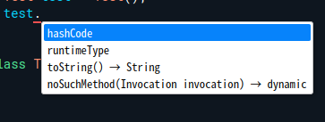

# OOP

- dart 언어 OOP

  OOP(Object Oriented Programming), 객체지향 프로그래밍이라고 불리는 이것은 클래스를 가지고 프로그래밍을 하는 것을 말한다.

  클래스를 정의한 이후에는 해당 클래스로부터 인스턴스를 뽑아올 수가 있다. 인스턴스는 무한하게 생성이 가능하다.

- Class 정의는 설계서를 만드는 것. 이 설계서로 실제로 만들어진 결과물을 인스턴스(Instance)라고 한다.

## 생성자

- 클래스 선언

  클래스 선언은 `Class` 키워드를 사용하여 선언한다.

  ```dart
  class Team {
      String name = 'myTeam';
      List<String> member = ['ed', 'john', 'hyun'];
      
      void sayHello() {
          print('hello myTeam');
      }
      void introduce() {
          print('we are myTeam');
      }
  }
  ```

  클래스를 선언하고나서 인스턴스를 생성하는 방법은 아래와같다. **`new`키워드는 생략가능**하다.

  ```dart
  void main() {
      Team myTeam = new Team();
  }
  ```

  하지만 위의 클래스에서는 각각의 다른 팀 인스턴스를 생성하는데에 한계가 있다.

- 생성자(constructor)

  클래스에서도 함수와 마찬가지로 파라미터를 받아서 사용할 수 있다. 이때 사용하는 것이 생성자(constructor)함수다.

  ```dart
  void main() {
      Team myTeam = new Team('myTeam', ['ed', 'john', 'hyun']);
  }
  
  class Team {
      String name;
      List<String> members;
      // 아래와같은 방식으로 파라미터를 받아오고, 프로퍼티에 값을 할당해준다.
      Team(String name, List<String> members)
          : this.name = name,
      	  this.members = members;
      sayHello() {
          print('hello ${this.name}')
      }
  }
  ```

  여기서 this는 해당 클래스로부터 생성되는 인스턴스를 가리키게된다.

  constructor를 보다 간단하게 작성할 수 있다.

  ```dart
  class Team {
      String name;
      List<String> members;
      
      Team(this.name, this.members);
      ...
  }
  ```

  이렇게 하면 받아온 파라미터값을 클래스의 변수에 바로 할당을 해줄 수가있다. 다만 받아오는 인자값은 클래스 내부에서 정의한 변수의 타입과 동일해야한다.

- named constructor

  named parametor와 비슷한 성격을 갖고있다.

  ```dart
  class Idol {
      // ...
      // basic constructor    
      Idol(this.name, this.members);
      // named constructor
      Idol.fromList(List values)
          : this.members = values[0];
            this.name = values[1];
  }
  ```

  기본 contructor이름에 `.원하는이름(List values)`를 추가하면 인스턴스를 생성할 때 아래와 같이 원하는 순서대로 인자값을 전달해줄 수가 있다.

  ```dart
  Idol idol1 = new Idol([
      ['a','b','c','d'],
      'idol1'
  ])
  ```

  named constructor는 기본 constructor가 존재하고 작동하는 상황에서 하나의 옵션으로 추가를 해주는 것이라고 생각하면 된다.

  정리해보면 클래스를 선언할 때는 basic constructor를 통해 외부에서 파라미터를 받을 수 있고, named constructor를 통해서도 파라미터를 받을 수 있다. 둘 중 마음에 드는 어떠한 constructor를 사용해서 인스턴스를 생성하면 된다.

- :star2:**immutable 프로그래밍**

  요즘에는 한 번 값들을 선언하면 변경할 수 없도록 해주는 방식으로 코딩을 한다. 예를들어 위의 인스턴스에서 `myTeam.name`을 하면 myTeam 인스턴스의 name 프로퍼티 값을 확인할 수 있다. 그런데 여기서 **문제는 `myTeam.name`의 값을 손쉽게 변경할 수 있다**는데에 있다. 이는 개발자가 원하는 프로그래밍 방향이 아니다.

  ```dart
  void main() {
      Team myTeam = new Team('myTeam', [...]);
      myTeam.name = 'changedTeam';
      print(myTeam.name); // changedTeam
  }
  ```

  우리는 처음에 선언하면 이후에 값을 바꿀 수 없고, 바꿔야한다면 새롭게 인스턴스를 생성하는 방식을 선호한다. 따라서 값을 바꾸지 못하게 클래스를 정의할 때 **변수들앞에 `final`키워드를 넣어준다. **한 번 선언이 되면 (인스턴스를 만들 때) 이후에 값을 변경할 수 없는 특성을 가진 final을 사용하여 인스턴스 생성 이후에 값을 변경하는 상황을 피할 수 있다.

  ```dart
  class Team{
      final String name;
      final List<String> members;
      ...
  }
  ```

  거의 대부분의 상황에서 클래스의 변수에 `final`키워드를 넣는 습관을 갖도록 하자.

:bulb: 그렇다면 `const`는??

`const`의 경우 생성자함수 앞에서 주로 사용한다. 기본 생성자 `const`로 선언할 수 있는 변수들로 구성된 constructor의 파라미터들은 const constructor로 인스턴스를 생성할 수 있다.

```dart
void main() {
    // const로 선언할 수 있는 변수들로 인자가 구성되어있는 경우
    Idol idol1 = const Idol('idol1', [...]);
}
class Idol {
    // const constructor
    const Idol(this.name, this.members);
    ...
}
```

:star2:**이 부분은 Flutter에서 약간의 효율을 높여주는데 사용될 수 있는 부분이다.**

- const 키워드를 썼을 때 인스턴스 비교

  ```dart
  void main() {
    Idol blackPink = Idol(
    	'idol1', ['a','b','c','d']
    );
    Idol blackPink2 = Idol(
    	'idol1', ['a','b','c','d']
    );
    print(blackPink == blackPink2); // false
  }
  ```

  일반적으로 인스턴스가 생성되면 인스턴스가 컴퓨터의 메모리에 저장되는데, 생성을 할때마다 메모리에 올라가게된다. 따라서 아무리 인자가 동일한 인스턴스일지언정 다르다.

  그런데 여기서 재미있는 부분은 `const` 키워드를 사용했을 때이다.

  ```dart
  void main() {
    Idol blackPink = const Idol(
    	'idol1', ['a','b','c','d']
    );
    Idol blackPink2 = const Idol(
    	'idol1', ['a','b','c','d']
    );
    print(blackPink == blackPink2); // true
  }
  ```

  ??? **`const`를 사용하니 두 인스턴스가 같은 인스턴스가 되었다.**

  `const`를 사용하고 모든 멤버들을 똑같이 작성하면 같은 인스턴스가 되고, `const`를 넣지않고 인스턴스를 생성하면 다른 인스턴스로 구분된다.

## Getter and Setter

- getter 와 setter

  getter는 데이터를 가져올 때, setter는 데이터를 설정할 때 사용한다.
  getter는 `get`이라는 키워드를 사용한다.

  ```dart
  String get firstMember {
      return this.members[0];
  }
  ```

  setter는 `set`이라는 키워드를 사용한다. setter의 파라미터에는 **반드시 하나의 파라미터**만 들어간다. 이유는 setter를 사용할 때 할당하려는 값에 하나만 들어갈 수 있기 때문

  ```dart
  void main() {
      // changedMember가 setter의 파라미터로 들어가게 된다.
      myTeam.firstMember = 'changedMember'
  }
  set firstMember(String name) {
      this.members[0] = name;
  }
  ```

- 왜 getter를 사용하는가?

  왜 굳이 `get`이라는 키워드를 사용해서까지 getter를 사용하는지 의문이들 수 있다.

  ```dart
  String getFirstMember() {
      return this.members[0];
  }
  
  get firstMember {
      return this.members[0];
  }
  ```

  위 두 함수의 기능은 동일하다. 하지만 **뉘앙스의 차이**가 존재한다. getter의 경우 데이터를 간단히 가공할 때 사용하고, 함수는 말 그대로 로직이 많이 들어가는 상황에서 사용한다.

- class의 변수값을 변경한다?
  class를 사용할 때 immutable programming을 지향하기 때문에 변수 앞에 `final`키워드를 넣는다고 했다. 근데 `final`로 지정을 해놓으면 클래스 내의 값을 변경할 수 가 없다.(setter가 쓸모없어지는 것) 이 때문에 setter는 현재 잘 쓰이지 않는 기능중 하나다.

## Private 속성

- private 변수

  `private`변수는 **파일 외부에서 사용할 수 없는 값**들을 private 값이라고 한다. 파일 내에서 우리는 원하는 값들을 `private`하게 만들어 줄 수 있다. 사용방법은 간단하다. 외부에서 사용되지 않길 원하는 변수의 앞에 언더스코어(`_`)를 달아주는 것.

  ```dart
  class _Idol {
      String _name;
          
      _Idol(this._name, this.members);
  }
  ```

  이렇게 하면 현재 파일에서만 해당 클래스를 사용할 수 있고, 외부에서 현재 파일을 불러오더라도 해당 클래스를 사용할 수 없다.

  다만 파일을 불러올 때 `private`속성도 같이 불러오게 하는 방법도 존재하기는 하다.(추후에 다룰 예정)

## 상속(inheritance)

OOP의 꽃이라 할 수 있는 가장 유용한 기능인 상속

- 상속

  우리가 일반적으로 이해하는 상속과 동일하다. 상속을 받으면 부모 클래스의 모든 속성을 자식 클래스가 부여받는다. 

  조금 헷갈릴 수 있지만 굉장히 중요한 부분 중 하나고, 상속을 잘 이해하느냐에 따라서 OOP코드를 작성하는 퀄리티가 매우 달라진다.

  ```dart
  void main() {
    print('-------- Idol --------');
    Idol apink = Idol(name: '에이핑크', membersCount:5);
    
    apink.sayName();
    apink.sayMembersCount();
  }
  
  // 상속 - inheritance
  // 상속을 받으면 부모 클래스의 모든 속성을
  // 자식 클래스가 부여받는다.
  class Idol{
    String name;
    int membersCount;
    
    Idol({required this.name, required this.membersCount});
    
    void sayName() {
      print('저는 ${this.name} 입니다.');
    }
    
    void sayMembersCount() {
      print('${this.name}은 ${this.membersCount}명의 멤버가 있습니다.');
    }
  }
  ```

- 상속은 `extends` 키워드를 사용한다.

  부모 클래스의 생성자 함수에 필요한 파라미터를 넘겨주기위해서 `super`함수를 활용한다. 파라미터를 넘겨주는 방식은 클래스를 생성할 때 인자를 넣는 방식과 동일하다.

  ```dart
  class BoyGroup extends Idol {
    BoyGroup(
      String name,
      int membersCount,
    ) : super(
              // 부모 클래스의 constructor를 나타낸다
              name: name,
              membersCount: membersCount);
    
    void sayMale() {
      print('저는 남자 아이돌입니다.');
    }
  }
  
  class GirlGroup extends Idol {
    GirlGroup(
      String name,
      int membersCount,
    ): super(
      name: name,
      membersCount: membersCount
    );
    void sayFemale() {
      print('저는 여자 아이돌입니다.');
    }
  }
  ```

- :star2: 부모 클래스에서 자식클래스로 속성을 넘겨준다. 자식클래스에서 부모 클래스로 속성을 넘겨주지않는다.

  같은 자식 클래스끼리도 속성을 공유하지 않는다.

- 타입비교

  자식 클래스는 자식 클래스도 될 수 있고 부모 클래스도 될 수 있다.

  ```dart
  print(bts is Idol); // true
  print(bts is BoyGroup); // true
  print(bts is GirlGroup); // false
  
  print(redVelvet is Idol); // true
  print(redVelvet is BoyGroup); // false
  print(redVelvet is GirlGroup); // true
  ```

## Override

method overriding이라는 주제.

- method

  함수. 클래스 내부에 있는 함수를 메소드라고 말한다.

- override

  ~을 덮어쓰다, 우선시하다(사전적)라는 의미를 갖는다.

- override라는 개념은 일단 '상속'이 일어났을 때 나올 수 있는 기능이다. 부모 속성을 자식 클래스가 덮어씌우는 것처럼.

- 방법은 간단하다 `@override` 키워드를 사용한다.

  ```dart
  class TimesTwo {
    final int number;
  
    TimesTwo(this.number);
  
    int calculate() {
      // this 생략이 가능하다.
      return number * 2;
    }
  }
  ```

  위 클래스의 `calculate` 메서드를 덮어씌운다고 한다면

  ```dart
  class TimesFour extends TimesTwo {
    TimesFour(int number) : super(number);
    int calculator() {
      return number * 4;
    }
    
    @override
    int calculate() {
      return super.number * 4;
      // return this.number * 4;
      // return number * 4;
    }
  }
  ```

  부모 클래스에 존재하는 변수 number를 사용하는 것이라서 `super.number`를 사용하는데 사실상, 상속을 하게되면 `this` 또한 사용할 수 있다. 이렇게 되면 this 는 생략도 가능하다는 것. 다만 정석적인 방식은 `super`를 사용하는 것이 맞다.

- 그렇다면 부모 calculate의 기능을 가져와서 이를 조금만 수정하려고 할 경우 어떻게 해야할까? `super`를 활용하여 부모 클래스의 메서드 기능을 그대로 가져와서 활용할 수 있다.

  ```dart
  @override
  int calculate() {
      return super.calculate() * 2;
  }
  ```

  다만! 여기서는 `this.calculate`를 하면 안된다 여기서는 자식 클래스의 calculate를 계속 호출하게 되면서 무한루프를 돌게된다.

## Static

- static

  static은 instance에 귀속되지 않고 class에 귀속된다.

- instance에 귀속된다??

  아래 예제를 봐보자.

  ```dart
  void main() {
    Employee seulgi = Employee('슬기');
    Employee chorong = Employee('초롱');
    
    // 이러한 경우를 instance에 귀속된다고 말한다.
    seulgi.name = 'edkim';
    print(seulgi.name); // edkim
    print(chorong.name); // 초롱
  }
  
  class Employee{
    static String? building;
    // final 키워드가 없는 경우 name 변경이 가능하다.
    String name; 
    
    Employee(this.name,);
  }
  ```

  같은 클래스에서 인스턴스를 만들었는데 함수를 실행하거나 값을 가져오면 그 값은 각각 우리가 인스턴스를 생성할 때 정한 변수에 따라서 달라지는 것.(위를 보면 edkim, 초롱이 다르듯이)

  인스턴스에 귀속되는 값이라면 그 값이 인스턴스 마다 다르다.

- class에 귀속이 된다?

  ```dart
  Employee.building = 'Tmax Tower';
  ```

  클래스에 값이 귀속되면 인스턴스들이 공통적으로 그 값을 갖는다. 이러한 값을 지정해줄 때 `static`을 사용하는 것.

- static 메소드는 아래와 같이 사용할 수 있다.

  ```dart
  Employee.printBuilding();
  ```

  인스턴스에 귀속된다는 것은 인스턴스를 만들고 실행하고 바꿀 수 있는 것이고, 클래스에 귀속된다는 것은 클래스에 바로 다이렉트하게 . 접근자로 실행하거나 바꿀수 있다.

## Interface

- 상속과 유사하지만 사용성이 다르다. 다른 프로그래밍 언어에서는 `interface` 키워드를 사용하여 선언하곤 하지만, 다트에서는 `class`키워드를 그대로 사용한다.

  ```dart
  // interface
  class IdolInterface{
    String name;
    IdolInterface(this.name);
    void sayName() {}
  }
  ```

  현재 위 함수 `sayName` 내부에는 아무것도 작성하지 않는다. 필요가 없다. 해당 클래스는 인스턴스를 만들기위해서 사용되는 것이 아니라 다른 클래스를 생성할 때 해당 클래스가 인터페이스에 선언되어있는 형태를 지키는 것을 강제할 때 사용된다.

- 상속에서는 `extends` 키워드를 사용했지만 인터페이스를 사용할 경우 `implements`라는 키워드를 사용한다.

  ```dart
  class BoyGroup implements IdolInterface{
    String name;
    BoyGroup(this.name);
    void sayName() {}
  }
  ```

  인터페이스를 사용할 경우 우리가 정의해놓은 인터페이스 형태(시그니처)를 맞춰주어야만 에러가 발생하지 않는다.

  인터페이스를 정의해놓으면 다른 개발자들과 크게 소통없이 클래스의 형태를 쉽게 이해하고 어떤 값들을 넣어야하는지 알 수 있으므로 유용하다.

- 상속의 경우 속성과 기능을 물려주기 위해서 사용한다면, 인터페이스는 어떤 특수한 구조를 강제할 때 사용된다고 이해하자.

- :star2: **abstract**

  abstract로 선언되면 인스턴스로 사용하지마라.

  인터페이스를 인스턴스화하라고 만들어 놓은 것이 아니다. 이럴 경우 클래스로 사용할 때 누군가가 인스턴스를 만들수가 있다. 이러한 상황에서 인스턴스화를 막아놓을 수가 있다. `abstract` 키워드를 사용한다.

  ```dart
  abstract class IdolInterface{
      String name;
      IdolInterface(this.name);
      // abstract를 사용하면 함수의 body도 생략하능하다.
      void sayName();
  }
  
  class BoyGroup implements IdolInterface{
      ...
  }
  class GirlGroup implements IdolInterface{
      ...
  }
  ```

  `abstract` 키워드를 앞에 작성해 놓으면 인스턴스 생성시 아래와 같은에러가 발생한다.

  

- 타입비교

  ```dart
  print(bts is IdolInterface); // true
  print(redVelvet is IdolInterface); // true
  ```

## Generic

- 타입을 외부에서 받을 때 사용

  지금까지 클래스 외부에서 값을 받을 때 아래와 같이 constructor로부터 값을 받아왔다.

  ```dart
  class Lecture {
    final int id;
    final String name;
    
    Lecture(this.id, this.name);
  }
  ```

  그런데 여기서 id, name의 값과 타입을 외부에서 받고싶다면? 이럴때 generic을 사용한다.

- List에서와 마찬가지로 클래스의 이름 옆에 `<>`를 사용하는 것이 generic이다.

  ```dart
  void main() {
      Lecture<int> lecture1 = Lecture(123, 'lec1')
  }
  // T : 원하는 타입이름을 넣어준다.(뭐든상관없음)
  class Lecture<T> {
      final T id; // id의 타입은 외부에서 받아오게된다.
      final String name;
      ...
  }
  ```

- 여러개를 받고 싶은 경우

  ```dart
  class Lecture<T, X> {
    final T id;
    final X name;
      ...
  }
  ```

---

- Obejct Oriented Programming

  왜 OOP. 객체지향프로그래밍인가?

  

  Test클래스의 인스턴스에 아무것도 만들지 않았지만 위처럼 4개의 기능이 보인다. 사실 클래스는 선언하자마자  Object를 extends, 상속하고 있다.(extends Object를 한 것과 하지않은것은 완전히 동일하다)

  모든 클래스의 최상위 부모는 Object를 최상위 부모로 갖고있다. 그리고 Object 클래스에서 제공하는 기능이 위 사진에서 보이는 4가지 기능이다.

  모든 클래스들이 **최상위에서 Object를 상속받고있어서 객체지향프로그래밍**이라고 불리게 된다.