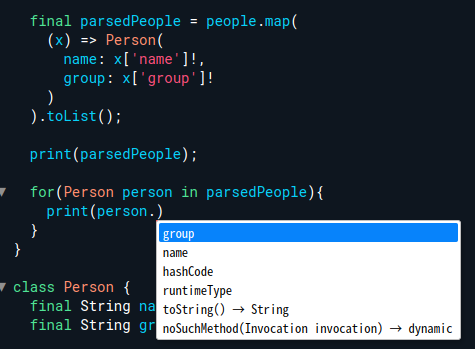

# 함수형 프로그래밍

## 형변환

```dart
void main() {
  List<String> blackPink = ['지수', '리사', '로제', '로제'];
  
  print(blackPink); // [지수, 리사, 로제, 로제]
  print(blackPink.asMap()); // {0: 지수, 1: 리사, 2: 로제, 3: 로제}
  print(blackPink.toSet()); // {지수, 리사, 로제}
  
  Map blackPinkMap = blackPink.asMap(); 
  
  print(blackPinkMap.keys.toList()); // [0, 1, 2, 3]
  print(blackPinkMap.values.toList()); // [지수, 리사, 로제, 로제]
  
  Set blackPinkSet = blackPink.toSet();
  print(blackPinkSet.toList()); // [지수, 리사, 로제]
}
```

## List

```dart
void main() {
  List<String> blackPink = ['지수', '리사', '로제', '제니'];
  
  final newBlackPink = blackPink.map((x){
    return '블랙핑크 $x';
  });
  
  final newBlackPink2 = blackPink.map((x) => '블랙핑크 $x');
  print(newBlackPink == newBlackPink2); // false
    
  // [1.jpg, 2.jpg, 3.jpg, 4.jpg, 5.jpg]
  String number = '12345';
  final parsed = number.split('').map((x) => '$x.jpg').toList();
  print(parsed);
}
```

## Map

- map자체를 mapping하여 새로운 map으로 만드는 경우
- key값, value값만 따로 List 형태로 바꾸어 사용하는 경우

```dart
void main() {
  Map<String, String> harryPotter = {
    'Harry Potter': '해리 포터',
    'Ron Weasley': '론 위즐리',
    'Hermione Granger': '헤르미온느 그레인저'
  };
  
  // 자주 사용되는 방법은 아니다.
  final result = harryPotter.map(
    // MapEntry클래스를 사용하여 Map형태로 돌려준다
    (key, value) => MapEntry(
      'HPC $key',
      '해리포터 캐릭터 $value'
    )
  );
  
  // {Harry Potter: 해리 포터 ...}
  print(harryPotter);
  // {HPC Harry Potter: 해리포터 캐릭터 해리 포터 ...}
  print(result);
    
  // key값을 list로 변경할 경우
  final keys = harryPotter.keys.map((x) => 'HPC $x').toList();
  print(keys);
}
```

## Set

set또한 List, Map과 마찬가지로 `map`을 통해서 데이터 값을 변경할 수 있다.

```dart
void main() {
  Set blackPinkSet = {
    '로제',
    '제니',
    '지수',
    '리사'
  };
  
  final newSet = blackPinkSet.map((x) => '블랙핑크 $x').toSet();
  print(newSet);
}
```

## Where

작동방식은 map과 동일하다. 첫 번째 파라미터로 함수를 받는다. true, false값을 돌려준다. true를 돌려줄 경우 값을 유지, false를 돌려줄 경우 삭제한다.

아래의 경우 순환하면서 보는 아이템의 group이 블랙핑크인 경우에만 true를 돌려주기때문에 group이 BTS인 경우false를 돌려주어 삭제된다.

```dart
void main() {
  List<Map<String, String>> people = [
    {
      'name': '로제',
      'group': '블랙핑크'
    },
    {
      'name': '리사',
      'group': '블랙핑크'
    },
    {
      'name': 'RM',
      'group': 'BTS'
    },
  ];
  
  final blackPink = people.where((x) => x['group'] == '블랙핑크');
    // ({name: 로제, group: 블랙핑크}, {name: 리사, group: 블랙핑크})
  print(blackPink);
}
```

## Reduce

- 첫번째 인자로 함수를 받는다. 인자로 들어가는 함수는 두개의 파라미터를 받게된다. 첫 번째 루프에서만 prev는 리스트의 첫 번째 요소, next는 두 번째 요소를 받게되고,

  두 번째 루프부터는 prev는 첫 번째 함수에서 반환하는 값, next는 세 번째 요소를 받게된다.

  마지막으로 반환한 값을 결과로 받게된다.

  ```dart
  void main() {
    List<int> numbers = [1, 3, 5, 7, 9];
    final result = numbers.reduce((prev, next){
      print('------------');
      print('prev: $prev');
      print('next: $next');
      print('result: ${prev + next}');
      return prev + next;
    });
    print(result); // 25
  }
  ```

- 다른 타입의 요소가 들어가 있는 리스트에서도 활용가능하다.

  ```dart
  void main() {
    List<String> words = ['안녕하세요 ', '저는 ', 'Edkim입니다.'];
    final sentence = words.reduce((prev, next) => prev+next);
    print(sentence);
  }
  ```

- :star2: 주의할점이 있다.

  `reduce`의 경우 reduce를 실행한 리스트가 구성한 요소들의 타입을 반드시 반환해야한다. 반환하는 값의 타입이 리스트 요소들의 타입과 다른경우 에러가 발생하게된다.

## Fold

- 리스트의 타입과 반환하는 값의 타입을 맞춰야하는 `reduce`의 특성을 보완한 함수. 반환값의 타입이 리스트 요소의 타입과 동일하지 않아도 된다.

- 방법은 reduce와 유사하다. fold의 경우 파라미터를 2개를 받는다. 첫번째 파라미터는 prev에 처음으로 넣을 초기값, 두번째 파라미터는 prev, next를 인자로받는 함수가 들어간다.

  ```dart
  void main() {
    List<int> numbers = [1, 3, 5, 7, 9];
    final sum = numbers.fold(0, (prev, next) => prev + next);
  }
  ```

- fold의 경우 리스트 요소의 타입과 달라도 괜찮으므로 fold옆에 제너릭(`<>`)을 활용하여 반환하려는 값의 타입을 지정해주자.

  ```dart
  void main() {
    List<int> numbers = [1, 3, 5, 7, 9];
    final sum = numbers.fold<int>(0, (prev, next) => prev + next);
  }
  ```

- 반환값이 리스트 요소의 타입과 다른경우

  ```dart
  void main() {
      List<String> words = ['안녕하세요 ', '저는 ', 'Edkim입니다.'];
    final count = words.fold<int>(0, (prev, next) => prev + next.length);
    print(count);
  }
  ```

## Cascading Operator

여러개의 리스트를 하나로 합칠 때 많이 사용한다.

```dart
void main() {
  List<int> even = [2, 4, 6, 8];
  List<int> odd = [1, 3, 5, 7];
  
  // cascading operator
  // ...
  print([...even, ...odd]);
  print(even); // [2, 4, 6, 8]
  print([...even]); // [2, 4, 6, 8]
  print(even == [...even]); // false
}
```

## 실전

실제 상황에서 사용되는 함수형 프로그래밍을 살펴보자.

어떤 데이터던 프론트에서 데이터를 다루면 구조화를 하여 데이터를 다루게 된다.

```dart
List<Map<String, String>> people = [
    {
      'name': '로제',
      'group': '블랙핑크'
    },
    {
      'name': 'RM',
      'group': 'BTS'
    },
  ];
```

이러한 데이터는 중간에 프로퍼티가 추가되어 값이 변경될 수 있다. 즉, 구조화되지 않았다고 볼 수 있다.

```dart
void main() {
  List<Map<String, String>> people = [
    {
      'name': '로제',
      'group': '블랙핑크'
    },
    {
      'name': '리사',
      'group': '블랙핑크'
    },
    {
      'name': 'RM',
      'group': 'BTS'
    },
    {
      'name': '뷔',
      'group': 'BTS'
    },
  ];
  
  final parsedPeople = people.map(
    (x) => Person(
      // !를 활용하여 무조건 그 값이 존재한다고 지정해줄 수 있다.
      name: x['name']!,
      group: x['group']!
    )
  );
}
```

데이터를 담은 인스턴스를 만들어서 활용하면 여러가지 이점이 있다. looping을 할때 하나의 인스턴스가 갖고있고 어떤것을 사용할 수 있는지 한 눈에 확인할 수 있다. 



따라서 `x['name']`과 같이 불확실성이 존재하면서 값들을 불러오는 것이 아니라 `x.name`과 같이 직접 인스턴스내에 존재하는 속성들을 확인하면서 데이터를 활용할 수 있다.

- 함수형 프로그래밍

  여러개의 함수들을 연결하여 사용할 수 있다. 즉, 반환된 새로운 값들을 활용하여 바로 다른 함수를 사용할 수 있다는 것.

  ```dart
  final result = people
        .map((x) => Person(name: x['name']!, group: x['group']!))
        .where((x) => x.group == 'BTS')
        .fold<int>(0, (prev, next) => prev + next.name.length);
  
    print(result);
  ```

  코드가 굉장히 간결해졌다. 다만 우리가 주의해야할 점은 너무 많이 chaining하여 작성하다보면 협업적인 측면, 그리고 본인 스스로 코드를 돌아볼 때 헷갈릴 수 있다.

- OOP, functional programming 둘의 장점을 잘 활용하여 코드를 작성하면된다.

  - List, Set, Map 을활용하여 새로운 값들을 만들어 낼 수있다.

  - 여러개 함수를 chaining하여 새로운 형태의 값을 만들어 낼 수 있다.