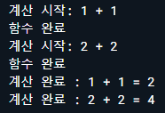

# 비동기 프로그래밍

> [코드팩토리 비동기 프로그래밍 강의](https://www.youtube.com/watch?v=rk41rBXq3zQ&t=4s)를 정리한 내용입니다.

## Synchronous, Asynchronous

 스레드(thread)는 작업을 하는 가장 작은 유닛. CPU는 기본적으로 작업을 시작하면 그 작업이 완료될 때까지 CPU를 사용할 수 없다. 작업이 완료가 되면 그 작업을 시작하고, 그 작업이 진행되는 동안은 다시 CPU를 사용할 수 없다. 이것은 문제가 아니다.

하지만 이것이 '서버요청'이라고한다면 문제가 될 수 있다. CPU 스레드에서 한 서버에 네트워크 요청을 보내게되면 응답을 받기전까지 CPU를 사용할 수 없다. 여기서 사용할 수 없는것은 리소스를 낭비하는 것. 이는 굉장히 비효율적이므로 Asynchronous 프로그래밍이 나오게된다.

이는 병렬적으로 작업을 수행하여 서버에 요청을 보내는 여러가지 작업을 동시에 진행할 수 있다. CPU를 보다 효율적으로 사용하고, 리소스를 낭비하는 시간이 줄어들기에 각각의 CPU의 스레드를 사용하는데 훨씬 더 효율적인 설계를 가져갈 수 있다.

## Synchronous programming

```dart
void main() {
  addNumbers(1, 1);
  addNumbers(2, 2);
}

// 1 + 1 = 2
// 2 + 2 = 4
void addNumbers(int number1, int number2){
  print('계산중: $number1 + $number2');
  print('계산 완료: ${number1 + number2}');
}
```

위 코딩의 출력결과는 addNumbers(1, 1)을 실행하여 나오는 '계산중: 1 + 1', '계산 완료: 2' 그리고 나서 addNumbers(2, 2)를 실행하여 나오는 '계산중: 2 + 2', '계산 완료: 4' 순으로 나오게 된다. 이 결과는 synchronous하게 실행되는 프로그래밍 언어의 특징이기 때문에 기본적으로 바뀔 수가 없다. 순차적으로 코드가 실행되는 것이 정상이다.

## Future

- Future

  Future는 미래에 받아올 값을 의미한다. 우리가 지금까지 알아온 타입을 모두 `Future`로 변경할 수 있다. 아직 무슨소린지 모르겠지만 일단 봐보자.

  `Future`를 사용하게 되면 async로 프로그래밍을 할 수 있다. 이 async 프로그래밍을 할 수 있게 해주는 것이 Future클래스의 `delayed` 메소드.

  delayed메소드는 두 개의 파라미터를 받는다.
  1번 파라미터 - 지연될 기간(얼마나 지연이 될 것인지. Duration
  2번 파라미터 - 지연 시간이 지난 후 실행할 함수

  ```dart
  void main() {
      Future<String> name = Future.value('edgar');
      Future<int> number = Future.value(1);
      Future<bool> isTrue = Future.value(true);
      
      Future.delayed(Duration(seconds: 2),() {
          print( 'Delay 끝')
      })
  }
  ```

- delayed 예시

  아래 코드의 출력결과를 예상해보자.

  ```dart
  void main() {
    addNumbers(1, 1);
  }
  
  void addNumbers(int number1, int number2) {
    print('계산 시작: $number1 + $number2');
    
    // 서버 시뮬레이션
    Future.delayed(Duration(seconds: 2), (){
      print('계산 완료 : $number1 + $number2 = ${number1 + number2}');
    });
    
    print('함수 완료');
  }
  ```

  

  왜 위와같은 결과가 나올까?

  Future를 쓰면 async 프로그래밍이 가능하다고 했다. 만약 async programming이 아니었다면 Duration에서 설정한 2초를 기다기까지 CPU가 아무것도 하지 않았을 것이다. 하지만 async 프로그래밍이 가능했기에 CPU는 2초를 기다리라고 하는 순간 해당 코드는 실행하되 병렬적으로 다음 코드를 실행하게 된다.

  그렇다면 위 코드에서 코드 하나를 추가하면 출력결과가 어떻게 될까?

  ```dart
  void main() {
    addNumbers(1, 1);
    addNumbers(2, 2);
  }
  ```

  

- CPU가 일을 하지 않는 동안에, 일을 하지 않는 것이아니라 병렬적으로 다른 코드를 실행할 수 있도록해준다. 즉, asynchronous 프로그래밍이 가능하게 해준다.

## Await

`await`는 굉장히 중요하다. 집중해서 살펴보자. 잠깐 앞에 부분을 보고 넘어가보자. `Future`덕분에 우리는 CPU를 쉬지않게 하면서 비동기적으로 작업을 처리할 수 있었다. 그래서 출력결과는 보이는 것처럼 기본적인 print()가 실행되고, Duration이 지난 이후 계산 완료라는 출력결과를 얻게된다.

하지만 이것은 우리가 보통 생각하는 자연스러운 흐름(?)은 아니다. 우리가 생각하는 순서는 `계산시작 ➱ 계산완료 ➱ 함수완료` 순으로 진행되는 것이 자연스럽다. 이러한 작업을 위해서 필요한 것이 `await`다.

- await

  `await`를 사용하기 위해서는 반드시 `await`가 사용되는 **함수의 파라미터와 바디 사이에 `async`를 작성**해주어야만 한다.

  `await`는 async로 동작하는 함수 앞에서 사용해줄 수 있다. async로 동작하는 함수는 아래와 같이 Future와 관련된 함수들, Future를 반환해주는 함수들에 사용된다.

  

  위의 코드의 Future 함수에 `await`를 추가해보자.

  ```dart
  void main() {
    addNumbers(1, 1);
  }
  
  void addNumbers(int number1, int number2) async {
    print('계산 시작: $number1 + $number2');
    
    await Future.delayed(Duration(seconds: 2), (){
      print('계산 완료 : $number1 + $number2 = ${number1 + number2}');
    });
    
    print('함수 완료 : $number1 + $number2');
  }
  ```

  

  우리가 의도한대로 출력결과가 나오는것을 확인할 수 있다. 이제는 async 함수를 실행해도 코드 실행을 논리적으로, 순서대로 진행시킬 수 있다. 

- 그렇다면 awiat를 사용하면 위의 문제와 동일하게 다시 CPU가 아무일도 안하는거 아님??

  그렇지 않다. 위의 addNumber 하나를 더 추가해서 확인해보면 재밌는 결과를 확인할 수 있다.

  ```dart
  void main() {
    addNumbers(1, 1);
    addNumbers(2, 2);
  }
  
  void addNumbers(int number1, int number2) async {
    ...
    await Future.delayed(Duration(seconds: 2), (){
      print('계산 완료 : $number1 + $number2 = ${number1 + number2}');
    });
    ...
  }
  ```

  

  `await`키워드를 사용해도 CPU를 효율적으로 사용할 수 있다.

- `await` 코드를 사용하여 async 코드를 논리적으로 기다릴 수 있다. 다만 기다리는동안 CPU가 노는것이 아니라 다른 작업또한 할 수 있다.

- 추가적으로 addNumbers자체도 순차적으로 실행시킬 수 있다. addNumbers 앞에 `await`를 붙여주면 된다.

  ```dart
  void main() async {
    await addNumbers(1, 1, 3);
    await addNumbers(2, 2, 1);
  }
  
  void addNumbers(int number1, int number2, int time) async {
      ...
  }
  ```

  그런데 여기서 에러가 발생한다.

  

  이유는 `await` 키워드는 Future를 반환하는 함수의 앞에서 사용해야하는데 현재 addNumbers함수는 void를 반환한다고 명시해놨기 때문이다.

  따라서 앞에서 배운것처럼 Future를 사용하여 Future를 반환해주자.

  ```dart
  void main() async {
    await addNumbers(1, 1, 3);
    await addNumbers(2, 2, 1);
  }
  // 아무런 값도 반환하지않는 Future라는 것을 명시해준다.
  Future<void> addNumbers(int number1, int number2, int time) async {
      ...
  }
  ```

## Returning Future

`Future<void>`말고 실제 값을 리턴해주는 경우를 살펴보자.

- 제네릭을 활용

  미래에 받을 값의 타입을 제네릭에 넣어서 원하는 값들을 받을수 있다.

  ```dart
  void main() {
      Future<String> name = Future.value('string');
      Future<int> number = Future.value(1);
      Future<bool> isTrue = Future.value(true);
  }
  ```

- 그렇다면 Future로 부터 해당함수 내에서 나온 결과값을 받고싶다면 어떻게 할까

  기존에 함수에서 반환하는것과 동일하다. 다만 함수 앞에 반환하는 것을 명시해줄 때 `Future<반환 값의 타입>`을  사용하자.

  ```dart
  Future<int> addNumbers(...) {
      await ...
      return(number1 + number2);
  }
  ```

## Stream

stream도 async 프로그래밍에서 사용하는 기술 중 하나이다. 굉장히 어렵다. 어렵지만 Flutter에서는 굉장히 많이 사용되는 개념이기 때문에 개념을 잘 익혀두는 것이 중요하다.

- Future

  `await` 키워드로 값을 기다리고, 반환값을 받는다.

  

  한 함수에서 하나의 반환 값. 여러 순간에 여러번 값을 받아내는 것은 함수를 여러번 실행하는 것 외에는 딱히 방법이 없다. 이게 단점(?)이라고 할 수 있을지 모르겠지만 이를 보완하기 위해서 나온 방법이 존재한다.

- Stream

  위의 한 함수에서 하나의 반환 값만 받는 경우를 보안하기위해서 나온 방법이다.

  

  Future의 경우 함수내의 코드가 끝나는 순간이 완료순간이지만, Stream의 경우 직접적으로 함수를 닫아주는 순간이 완료순간이다.

  Stream에서는 계속 데이터가 '흐른다(stream)'. `yield`라는 키워드를 사용해서 원하는 만큼 계속 값을 반환시킬 수 있다. 보이는 것처럼 값을 한번만 받는 것이 아니고, 지속적으로 값을 받아낼 수 있다.

  다만 그만큼 복잡하다...

  우선 Stream을 사용하기위해서는 패키지를 불러와야하는데, Stream은 Dart언어에서 기본적으로 제공하지 않는 기능이다. 따라서 Dart언어에서 제공하는 패키지를 불러옴으로써 사용이가능하다. 가장 기본적으로 stream을 사용하는 방법은 아래와같다.

  ```dart
  import 'dart:async';
  
  void main() {
    // StreamController - dart:async 패키지를 불러옴으로써 사용할 수 있는 클래스
    final controller = StreamController();
    final stream = controller.stream;
    
    // listen함수는 controller에 값이 들어올 경우 첫번째 함수의 파라미터로 그 값을 받게된다.
    final streamListener = stream.listen((val){
      print('Listener 1 : $val');
    });
    
    // add를 통해 listener에게 값을 전달해준다.
    // stream은 여러개의 값을 돌려줄수있다. 즉, add를 통해 여러개의 값들을 받아낼 수 있다.
    controller.sink.add(1);
    controller.sink.add(2);
    controller.sink.add(3);
    controller.sink.add(4);
    controller.sink.add(5);
  }
  ```

  

- broadcastStream

  이번에는 stream을 여러번 listening해보자.

  기본적으로 `controller.stream`을 통해 stream을 가져오면 기본적으로 한번만 listening 할 수 있는 리소스가 생긴다. 여러번, 계속 listening을 하고싶다면 `controller.stream.asBroadcastStream()`을 붙여줘야한다.

  ```dart
  import 'dart:async';
  
  void main() {
      final controller = StreamController();
      final stream = controller.stream.asBroadcastStream();
      
      final streamListener = stream.listen((val){
      	print('Listener 1 : $val');
    	});
    
    	final streamListener2 = stream.listen((val){
      	print('Listener 2 : $val');
      });
    
    	controller.sink.add(1);
    	controller.sink.add(2);
    	controller.sink.add(3);
    	controller.sink.add(4);
    	controller.sink.add(5);
  }
  ```

  

  위 처럼 여러번 listening하는 것을 확인할 수 있다.

- :star2: 즉석에서 stream을 변경할 수 있는 방법에대해 알아보자. 약간 functional programming과 비슷. 함수형 프로그래밍과 유사하게 변경된 데이터값을 받아서 변형을 주거나 다룰 수 있다.

  ```dart
  ...
  final streamListener = stream.where((val) => val % 2 == 0).listen((val){
      print('Listener 1 : $val');
  })
  final streamListener2 = stream.where((val) => val % 2 == 0).listen((val){
      print('Listener 2 : $val');
  })
  ...
  ```

  

## Stream 함수

함수로 stream을 제공해주는 방법

```dart
import 'dart:async';

void main() {
  calculate(1).listen((val){
    print('calculate(1) : $val');
  });
}

Stream<int> calculate(int number) async* {
  for(int i=0; i<5; i++){
    yield i * number;
  }
}
```


값이 생길때마다(yield 될 때마다) 해당 함수를 listening하고 있는 listener에게 값을 뿌려줄 수가 있다.

## Stream에서의 async 프로그래밍

- 이번에는 일반적인 `async`함수를 `async*` 함수에서 사용하는 방법

  그냥 await 하면된다.

  ```dart
  import 'dart:async';
  
  void main() {
    calculate(1).listen((val){
      print('calculate(1) : $val');
    });
  }
  
  Stream<int> calculate(int number) async* {
    for(int i=0; i<5; i++){
      yield i * number;
      await Future.delayed(Duration(seconds: 1));
    }
  }
  ```

  

  결과가 Duration을 기다리면서 순차적으로 출력됨을 확인할 수 있다. 여기서도 앞과 마찬가지로 await사용한다고해서 CPU가 노는것이아니라 효율적으로 작업이 진행된다.

  ```dart
  import 'dart:async';
  
  void main() {
    calculate(1).listen((val){
      print('calculate(1) : $val');
    });
    calculate(2).listen((val){
      print('calculate(2) : $val');
    });
  }
  
  Stream<int> calculate(int number) async* {
      for(int i=0; i<5; i++) {
          yield i * number;
          await Future.delayed(Duration(seconds: 1));
      }
  }
  ```

  

  await를 사용하면 Stream에서도 순차적으로 asynchronous programming을 하고있다는 것을 알 수 있다.

##  Yield

- yield

  그렇다면 위에서 calculate(1)을 끝내고나서  calculate(2)를 진행시키고 싶다면 어떻게 해야할까

  ```dart
  import 'dart:async';
  
  void main() {
    playAllStream().listen((val){
      print(val);
    });
  }
  
  Stream<int> playAllStream() async* {
    yield* calculate(1);
    yield* calculate(1000);
  }
  
  Stream<int> calculate(int number) async* {
    for(int i=0; i<5; i++){
      yield i * number;
      await Future.delayed(Duration(seconds: 1));
    }
  }
  ```

  

  `yield` 는 값을 하나하나 순서대로 가져올 때 사용됐지만, `yield*`의 경우 해당되는, 뒤에 따라오는 Stream의 모든 값을 가져올때까지 기다린다.(값이 모두 return될 때 까지) Future의 await기능과 유사하다고 볼 수 있다.

- 보통 `dart:async` 패키지에서 제공하는 `StreamController`를 사용할 일이 크게 없다. 왜냐면 기본적으로 훨씬 괜찮은 라이브러리 오픈소스를 사용하기 때문. 따라서 완전 raw상태의 패키지를 잘 사용하지는 않는다. 다만 raw상태의 개념을 잘 알아둬야만 다른 오픈소스 패키지를 사용하더라도 훨씬 잘 이해할 수 있다.

