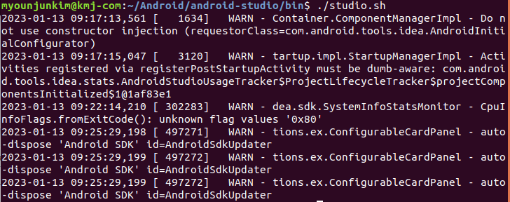
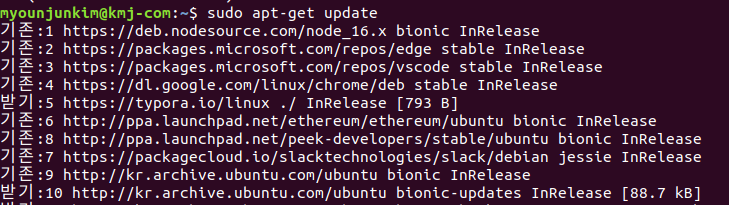

# Flutter 설치 

## linux

- 터미널 `sudo apt install curl`

  

- git 설치 `sudo apt install git`

  

- Flutter sdk 설치

  터미널을 사용하여 설치하거나 `.tar`파일을 다운로드한다.

  공식링크 : https://docs.flutter.dev/get-started/install/linux

  

- document 폴더에 새로운 폴더생성

  

- 다운로드 받은 .tar 파일을 위에 새롭게 생성한 폴더에 extract한다.

  extract하고 폴더 내부에 있는 `Flutter`폴더는 flutterdev로 옮겨주자.

  

- 새로운 홈 폴더를 열고 숨긴 파일 표시, `.bashrc` 파일을 실행한다.

  

- `.bashrc`파일을 실행하고 가장 아래 줄에 공식문서에서 말하는 PATH를 지정

  ```bash
  $ export PATH="$PATH:`pwd`/flutter/bin"
  ```

  

  아직 저장하는 것이 아니라 flutterdev > flutter > bin 폴더로 이동하여 우클릭, 속성(properties) 클릭하여 경로를 복사한다.

  

  복사한 경로를 위에 붙여넣기한 코드의 PATH에 덮어씌워준다. 그리고 뒤에 반드시 `/bin`을 추가해준다.

  ```bash
  $ export PATH="PATH:/home/myounjunkim/문서/flutterdev/flutter/bin"
  ```

- 터미널에 `flutter`입력 후 엔터(rc를 수정했으므로 터미널 종료후 재실행한다.)

  

- 터미널에 `flutter precache`설치

  

  

- Android Studio 설치

  공식링크 : https://developer.android.com/studio

  

  흐름에 따라서 잘 설치하고

  (설명하길 extract한 android-studio를 flutterdev에 설치하라고하지만 일단 나는 RN 사용하면서 이미 설치를 해놔서 위치가 조금 다름.)

- android-studio > bin 에서 우클릭, Open in Terminal 클릭. `./studio.sh` 입력하여 안드로이드 스튜디오 설정 마법사를 연다.(설정을 한 경우 안드로이드 스튜디오가 실행됨.)

  

- Tools > sdk manager > SDK Tools에서 `Android SDK Command-line Tools`를 설치한다.

  

  

- Settings > Plugins에서 `Flutter`를 검색. 설치한다.

  

  다트도 설치하라고 나오는데 설치해준다.

  

  설치가 완료되면 IDE를 재실행 해준다.

  

- 이제 File > New를 보면 New Flutter Project를 확인할 수 있다.

- 다시 공식문서로 돌아가서 `flutter config --android-studio-dir`를 복사 터미널에 붙여넣는다(경로를 집어넣어야 하므로 아직 엔터 ㄴㄴ)

  

  그리고 android-studio의 bin 폴더로 들어가 속성창을 킨다. 경로를 복사하고 이를 위의 코드에 추가로 붙여넣는다.(경로에 android-studio가 들어가있는지 확인)

  

  

- 이제 Android 라이센스를 수락해야한다. 아래 명령어를 터미널에 복사

  ```bash
  $ flutter doctor --android-licenses
  ```

  

  

  y를 입력하면서 모든 라이센스에 동의한다.

  

- 추가 리눅스 요구 사항을 업데이트한다.

  ```bash
  $ sudo apt-get install clang cmake ninja-build pkg-config libgtk-3-dev liblzma-dev
  ```

  

  해당 명령어를 복사하여 터미널 내부에 붙여넣는다.

  - ~~이상한게 뜨는디?~~

- 터미널에 `flutter doctor`입력하여 플러터가 우분투 컴퓨터에 성공적으로 설치되었음을 확인한다.

  

### 오류

- `$ sudo apt-get install clang cmake ninja-build pkg-config libgtk-3-dev liblzma-dev` 터미널 입력시 설치가 제대로 되지 않았다.

  

  

  

  말하는대로 `apt-get update`해보자.

  

  업데이트후 확인했지만 아직 설치가 되지 않은 듯 하다.

  

  위에 있는 것을 다시 하나하나 설치해보려고하는데

  

  위에 필요하지 않는 것이 있다고 나와서 `sudo apt autoremove`를 실행했다.

  삭제후 다시 설치 ㄱㄱ

  

  뭐지...

  

- 오류에 대해서 찾아보니(https://omnil.tistory.com/156) Ubuntu를 한글로 변경하게 되면 패키지 다운로드 서버가 자동으로 http://kr.archive.ubuntu.com/ubuntu/로 설정이 되는데, 이 서버가 속도 이슈도 존재하고, 몇몇 패키지의 경우에는 설치가 안되는 에러가 있다고한다.

- 따라서 해결책은 이 기본 패키지 서버를 변경하면 에러가 없어진다.

  위의 사이트를 참고하면 되는데

  - 먼저 터미널에 `sudo vi /etc/apt/sources.list` 입력하여 `source.list`파일을 연다.
  - `:`을 입력하여 명령모드를 실행하고, `%s/kr.archive.ubuntu.com/ftp.daumkakao.com`을 입력하여 엔터를 하면 `4 substitutions on 14 lines` 라는 글이 명령줄에 나타난다.
  - `:wq`를 입력하고 엔터를 쳐서 커멘트창으로 나온다.
  - `sudo apt-get update; sudo apt-get upgrade -y`을 실행

- 문제 혹은 에러

  간혹 아래 나와 있는 문제들처럼 설치할 수 없다고 오류가 뜰 때가 있는데 저장소에서 해당패키지에 대한 정보를 가지고 있지 않거나 일시적으로 서버가 작동하지 않을 수도 있다.

  - `E: 아카이브를 받을 수 없습니다. 아마도 apt-get update를 실행해야 하거나 --fix-missing 옵션을 줘서 실행해야 할 것입니다.`
  - `E: Unable to fetch some archives, maybe run apt-get update or try with --fix-missing?`

  위와 같은 상황일 때 apt-get의 패키지 서버를 다른 주소로 해서 다시 실행하면 제대로 설치되는 경우도 있다.

- 

  