# Flutter 기초

## 기본세팅

- `analysis_options.yaml`

  프로젝트에 들어가기 앞서서 아래와 같이 rultes에 4줄을 추가해줌으로써 Lint를 잠깐 꺼두도록하자.(초보일때는 Lint 맞추면서 하기 어려움. 코드 작성에 대한 이해가 되었다면 굳이 작성할 필요는 없다.)

  ```yaml
  rules:
      prefer_typing_uninitialized_variables : false
      prefer_const_constructors_in_immutables : false
      prefer_const_constructors : false
      avoid_print : false
  ```

- `main.dart`

  `lib > main.dart` 에 앞으로 만들 서비스코드를 작성하게된다.

  ```dart
  // stless + tab - 자동으로 아래 템플릿 생성
  class MyApp extends StatelessWidget {
    const MyApp({Key? key}) : super(key: key);
  
    @override
    Widget build(BuildContext context) {
      return Container();
    }
  }
  ```

- `pubspec.yaml`

  플러터에서 이미지를 사용하기위해서는 이미지를 사용하기전에 먼저 `pubspec.yaml`파일이라는 곳에서 이미지 등륵을 먼저 해주어야만 한다.

  ```yaml
  flutter:
    # 사용할 이미지가 들어갈 경로지정
    assets:
      - assets/
  ```

## 위젯

- 위젯

  **플러터에서는 앱 디자인을 위젯**으로한다. 위젯을 꾸미는 것.

  위젯은 안드로이드에서 홈화면 편집하고그러는데 그걸 모두 위젯이라고한다. 이 위젯과 유사하다. 앞으로 플러터 코드짤때 글자 넣고싶다면 글자위젯을 넣고, 박스를 넣고싶으면 박스 위젯을 넣는 방식으로 진행이 된다.

  위젯은 보통 대문자로 시작함.

  아래  네 개 정도면 앱에 필요한 모든 구성요소 만들어낼 수 있음ㅇㅇ.

- 주요위젯

  글자(Text), 이미지(Image), 아이콘(Icon), 박스(Container, SizedBox)

- **글자위젯(Text)** 

  ```
  Text('텍스트')
  ```

- **이미지위젯(Image)**

  ```
  Image.asset('경로')
  ```

  - 이미지 보관용 폴더생성

    이미지를 보관하기 위한 `assets` 폴더를 만들고 해당 폴더 내에 사용하고자하는 이미지를 저장한다.

  - `pubspec.yaml`

    이미지를 사용하기전에 먼저 `pubspec.yaml`파일이라는 곳에서 이미지 등륵을 먼저 해주어야만 한다.

    `pubspec.yaml`은 앱 만들때필요한 모든 자료들(외부패키지, 라이브러리...)을 정리한 파일로 보면된다.

    

- **아이콘위젯(Icon)**

  아이콘은 플러터 홈페이지에서 확인(https://api.flutter.dev/flutter/material/Icons-class.html)

  ```
  Icon(Icons.shop)
  ```

- **박스위젯(Container)**

  Container 혹은 SizedBox를 활용한다.

  ```dart
  class MyApp extends StatelessWidget {
    const MyApp({Key? key}) : super(key: key);
    @override
    Widget build(BuildContext context) {
      // 메인페이지 디자인
      return MaterialApp(
        // Center: 내 자식 위젯의 기준점을 중앙으로 설정
        home: Center(
          child: Container( width: 50, height: 50, color: Colors.amber,),
        )
      );
    }
  }
  ```

  Flutter에서 숫자의 단위는 픽셀이 아니라 **LP**(Logical Pixel)라는 단위다.(38LP == 1cm, 50LP == 1.2cm)

  > :bulb: LP(Logical Pixel)
  >
  > px을 사용하지 않는 이유는 기기마다 픽셀의 절대적인 크기가 다르기 때문

- 위젯안에 위젯넣기

  `child` 파라미터를 사용하면 위젯 안에 위젯을 넣을 수 있다. 다만 `child`파라미터를 사용할 수 있는 위젯이 정해져있으므로 자동완성을 잘 확인해서 사용해야한다.

## 레이아웃

- `MaterialApp()`

  프로젝트 만들 때 반환되는 `MaterialApp()`은 구글에서 제공하는 materail theme을 이용하여 앱을 간편하게 만들 수가있다.(구글 스타일이라는 점)

  아이폰 기본앱 스타일의 앱을 만들고싶다면 `Cupertino()` 관련앱을 사용하면된다.

  그렇다면 그냥 커스터마이징을 하고싶은경우에는 어떻게 해야할까?

  그래도 MaterialApp()을 사용해서 코드를 작성하면된다.(디자인뿐만 아니라 기본적인 세팅도 제공하기 때문에 그대로 사용하는 것이 좋다. 사용하지않을경우 세팅관련 코드를 직접 작성해야하므로 코드양이 증가하게된다.)

  - `Scaffold()`위젯

    앱을 자동으로 상중하로 나누어주는 위젯.

    ```dart
    // ...
    return MaterialApp(
    	home: Scaffold(
        	appBar: AppBar(), // 상단에 들어갈 위젯
            body: Container(), // 내용영역
            bottomNavigationBar: BottomAppBar(), // 하단에 들어갈 위젯
        )
    )
    ```

- 가로세로배치

  - 여러 위젯 **가로 배치**(Row)

    여러가지 위젯을 가로로 배치하기위해서는 `Container`위젯 대신에 `Row`라는 위젯을 사용한다.

    Row는 `children` 파라미터를 받는다.

    ```dart
    // ...
    return MaterialApp(
    	home: Scaffold(
        	body: Row(
            	children: [
                    Icon(Icons.star),
                    Icon(Icons.star),
                    ...
                ]
            )
        )
    )
    ```

  - 위젯 **세로 배치**(Column)

    위젯을 세로로 배치해주고 싶다면 `Row`위젯을 `Column`으로만 변경해주면 된다.

  - Row, Column **요소 정렬**

    가운데 정렬을 하고싶은 경우, `Center`를 사용할 수도 있지만 `mainAxisAlignment`라는 프로퍼티를 사용할 수 있다.

    CSS의 display : flex와 매우 유사하다.

    ```dart
    // ...
    body: Row(
    	mainAxisAlignment: MainAxisAlignment.center,
        clidren: [ ... ]
    )
    ```

    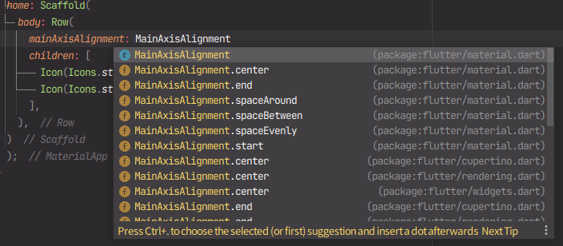

    여기서 알아둬야 할 점은 Row()의 mainAxis는 **가로**축이다. 즉, 그 반대축은 **세로**축이 되는데 반대축에대한 정렬은 `crossAxisAlignment` 프로퍼티를 사용한다.

    ```dart
    // ...
    body: Row(
    	mainAxisAlignment: MainAxisAlignment.center,
        crossAxisAlignment: CrossAxisAlignment.center,
        clidren: [ ... ]
    )
    ```

    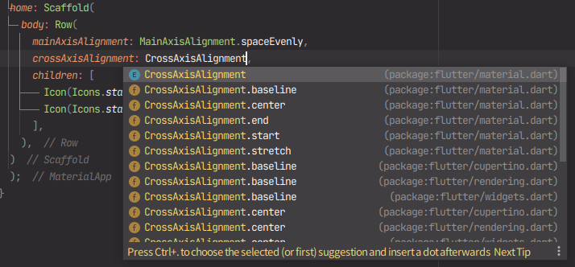

    반대로 Column()의 mainAxis는 **세로**축, 반대축은 **가로**축이 되겠다.

> :bulb: ctrl + space를 활용하자
>
> 프로퍼티가 잘 생각나지 않는다면 ctrl + space를 활용하여 프로퍼티를 확인하자.(Mac은 Preference > keymap중 completion을 바꿔야함)
>
> 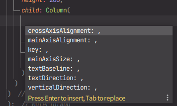
>
> :bulb: 파라미터 우측에 뭐 넣을지 까먹은 경우
>
> 1. 왼쪽에 있는걸 대문자로 써보기
>
> 2. 파라미터에 마우스올려보기(Type을 적으면된다.)
>
>    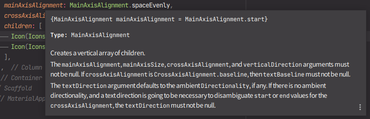
>
> 3. 검색 ㄱㄱ
>
> :bulb: 위젯을 다른 위젯으로 감싸는 경우
>
> 감싸고싶은 위젯을 잘라내기를 하고 새로운 위젯안에 넣는 방식은 번거로울수 있기에.. 해당 위젯에 마우스 커서를 올리면 전구 표시가 뜬다. 해당 전구를 누르면 `Wrap with ...`이 뜨는데 감싸고 싶은 위젯을 선택하여 간편하게 작업을 진행할 수 있다.
>
> 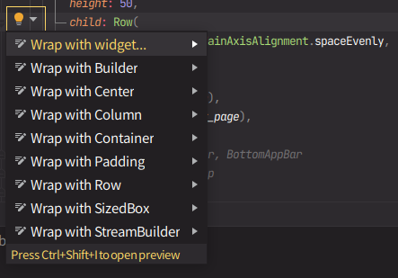

- 연습

  

  ```dart
  return MaterialApp(
      home: Scaffold(
          appBar: AppBar(
              backgroundColor: Colors.blueAccent,
              title: Text('앱임'),
          ),
          body: Container(
              child: Text('안녕')
          ),
          bottomNavigationBar: BottomAppBar(
              child: Container(
                  height: 50,
                  child: Row(
                      mainAxisAlignment: MainAxisAlignment.spaceEvenly,
                      children: [
                          Icon(Icons.call),
                          Icon(Icons.message),
                          Icon(Icons.contact_page)
                      ],
                  )
              )
          ),
      )
  );
  ```

- Container vs. SizedBox

  Container를 남발하게되면 안드로이드 스튜디오에서 밑줄로 경고를 준다.(앱이 무거워 질 수 있음)

  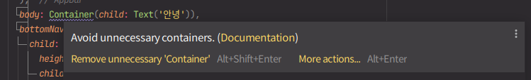

  따라서 width, height, child 정도만 필요한 간단한 박스는 SizedBox로 만들어주는것이 성능상 이점이있다.

### 박스만들기

- 간격(`margin`, `padding`)

  외부 간격을 주기위해서 마진을 주는데, 아래와 같은 방식으로 margin을 준다.

  ```dart
  // ...
  return MaterailApp(
  	home: Scaffold(
      	appBar: ...,
          body: Container(
          	margin: EdgeInsets.all(20)
          )
      )
  )
  ```

  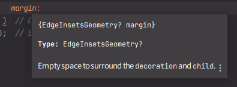

  padding도 margin과 같은 방식으로 적용해준다.

  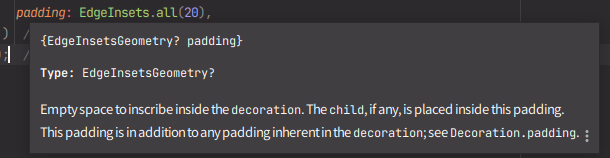

  - `EdgeInsets`
    - `.all` : 모든 부분에 적용
    - `.fromLTRB(left, top, right, bottom)` : 각각의 부분에 적용

- 테두리(decoration)

  나머지 박스 스타일들은 `decoration`안에 넣어야한다.

  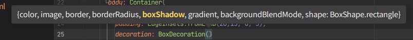

- 박스위치정렬

  - 가운데정렬(Center)

  - 사이드정렬(Align)

    ```dart
    // ...
    body: Align(
    	alignment: Alignment.bottomCenter,
        ...
    )
    ```

    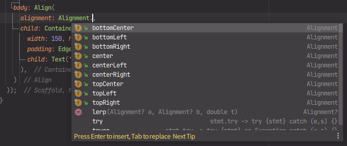

- 박스 width

  - 박스 width 가로로 꽉차게

    width의 값을 `double.infinity`를 준다. (부모박스를 넘어가지 않는 선에서 가로를 꽉 채워준다.)

## Typography, button

### 글자와 아이콘 스타일

- 글자디자인

  상세한 내용은 

  Text()는 style안에 스타일을 넣을 수 있다.

  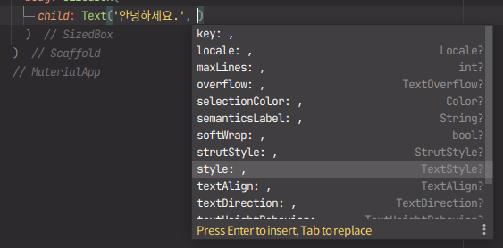

  style은 TextStyle 프로퍼티를 사용하여 적용한다.

  ```dart
  style: TextStyle( color: ...)
  ```

  - 색주는 법

    1. `Colors.색상`
    2. `Color(0xffaaa)`
    3. `Color.fromRGBO(r, g, b, opacity)`

  - 폰트사이즈(fontSize)

  - 폰트강조(fontWeight)

    ```dart
    fontWeight: FontWeight.w700
    ```

  - 자간(letterSpading)

- 아이콘디자인

  아이콘은 size, color가 끝이다.

  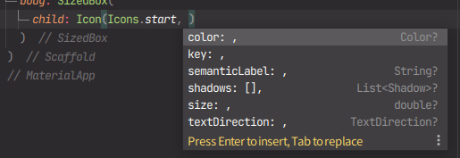

### 버튼

- 버튼

  아래의 버튼중 하나를 사용한다.

  1. `TextButton()`
  2. `IconButton()`
  3. `ElevatedButton()`

- 2개의 파라미터

  버튼에는 2개의 파라미터가 들어간다. `child`와 `onPressed`

  ```dart
  TextButton(
  	child: Text('버튼'),
      onPressded: (){},
      style: ButtonStyle(...)
  )
      
  IconButton(
  	icon: Icon(Icons.star),
      onPressde: (){},
      style: ButtonStyle(...)
  )
  ```

### AppBar

- `title` : 왼쪽제목

- `leading` : 왼쪽에 넣을 아이콘

  ``` dart
  appBar: AppBar(
  	leading: Icon(Icons.star)
  )
  ```

- `actions: [Icon(Icons.star)]` : 우측에 넣을 아이콘들

  ```dart
  appBar: AppBar(
      title: Text('제목'),
  	leading: Icon(Icons.star),
      actions: [Icon.Icons.star]
  )
  ```

### 레이아웃 잘 짜는법

- 스텝을 잘 따라가면 된다.

  1. 예시디자인 준비(명확한 원본 디자인을 준비한다, 없으면 다른 앱 배끼기)

  2. 예시화면에 네모그리기

     빈 공간 없게 네모그리기

     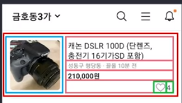

  3. 바깥 네모부터 하나하나 위젯으로 만들기

     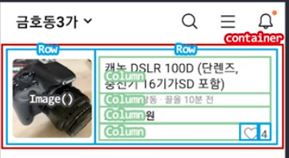

  4. 마무리 디자인

- 연습

  