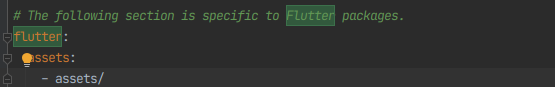

# Flutter 기초

## 위젯

- 위젯

  플러터에서는 앱 디자인을 위젯으로한다. 위젯을 꾸미는 것.

  위젯은 안드로이드에서 홈화면 편집하고그러는데 그걸 모두 위젯이라고한다. 이 위젯과 유사하다. 앞으로 플러터 코드짤때 글자 넣고싶다면 글자위젯을 넣고, 박스를 넣고싶으면 박스 위젯을 넣는 방식으로 진행이 된다.

  위젯은 보통 대문자로 시작함.

  아래  네 개 정도면 앱에 필요한 모든 구성요소 만들어낼 수 있음ㅇㅇ.

- 글자위젯

  ```
  Text('텍스트')
  ```

- 이미지위젯

  ```
  Image.asset('경로')
  ```

  - pubspec.yaml

    이미지를 사용하기전에 먼저 `pubspec.yaml`파일이라는 곳에서 이미지 등륵을 먼저 해주어야만 한다.

    앱 만들때필요한 모든 자료들(외부패키지, 라이브러리...)을 정리한 파일

    

- 아이콘위젯

  아이콘은 플러터 홈페이지에서 확인

  ```
  Icon(Icons.shop)
  ```

- 박스위젯

  Container 혹은 SizedBox를 활용한다.

  ```dart
  class MyApp extends StatelessWidget {
    const MyApp({Key? key}) : super(key: key);
    @override
    Widget build(BuildContext context) {
      // 메인페이지 디자인
      return MaterialApp(
        home: Center(
          child: Container( width: 50, height: 50, color: Colors.amber,),
        )
      );
    }
  }
  ```

  Flutter에서 숫자의 단위는 픽셀이 아니라 **LP**라는 단위다.(50LP == 1.2cm)