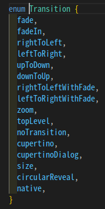
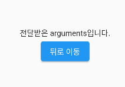
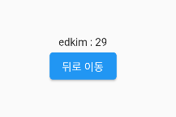
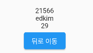
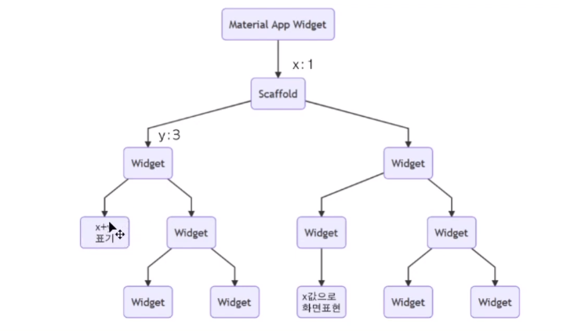
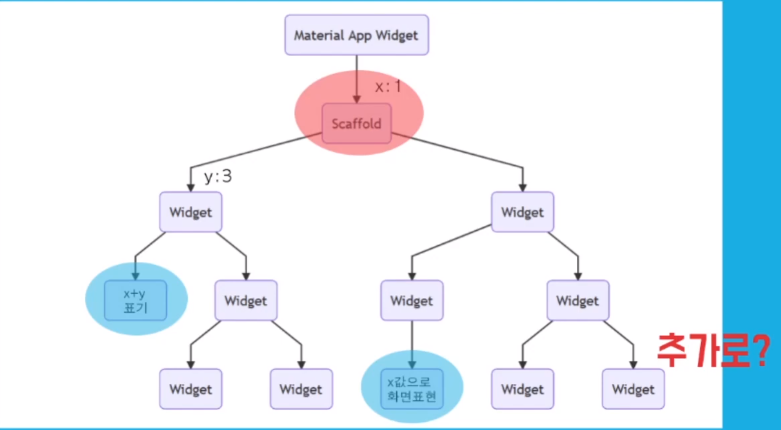
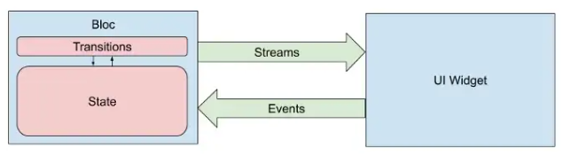
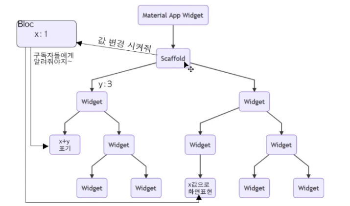
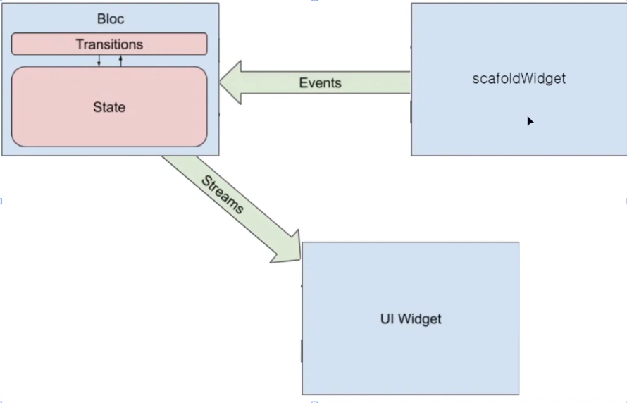

# GetX

## 00. 플러터에서의 상태관리 라이브러리

- 플러터에서는 상태관리를위한 다양한 상태관리 라이브러리가 존재한다.(좀 더 살펴보려면... [참고사이트](https://velog.io/@kywho0915/flutter%EC%9D%98-%EB%8B%A4%EC%96%91%ED%95%9C-%EC%83%81%ED%83%9C%EA%B4%80%EB%A6%AC-%EB%9D%BC%EC%9D%B4%EB%B8%8C%EB%9F%AC%EB%A6%AC))

  - Plain(Stateful Widget)
  - Bloc(with Cubit)
  - Provider
  - **GetX**
  - riverpod

- 여기서 사용할건?

  GetX. Provider를 쓰면서 Bloc에서의 불필요한 코드를 줄였다고는 하지만 GetX와는 비교할 수가 없다. 너무 편리하기때문에 GetX를 사용할 예정.

## 01. GetX


- GetX

  페이스북에서 추천하는 상태관리 끝판왕(?), 플러터에서 상태관리를 위해 필요한 프레임워크. Flutter 개발을 위한 매우 가볍고, 강력한 라이브러리(상태관리뿐 아니라 여러가지 모듈도 제공하기 때문에 미니 프레임워크라고도 불림. 플러터를 보다 효과적으로 관리할 수 있도록 여러가지 기능제공)

- 3가지 기본 원칙
  
- **생산성, 성능, 조직화**
  
- 기본세팅

  - `pub.dev`로 이동하여 'getx'를 검색. `get`으로 들어간다.

  - installing탭으로 이동하여 dependencies를 `pubspec.yaml`파일에 추가

    

  - 사용방법은 간단하다

    기존의 코드가 아래와 같았다면

    ```dart
    void main() => runApp(MaterialApp(home: Home()));
    ```

    위젯이름 앞에 `Get`만 붙여주면된다.

    ```dart
    void main() => runApp(GetMaterialApp(home: Home()));
    ```

    `Get`을 붙여주지 않아도 상태관리는 가능하지만 붙여줌으로써 추가적인 기능들(라우트관리, 종속성관리)을 사용할 수 있기에 붙여주도록 하자.

- 주요기능 :star2:

  - **상태관리**

  - **라우트관리**

    Flutter에서도 기본적으로 라우트를 네비게이터를 사용해서 기능을 제공하지만 GetX로 보다 간결하게 동일한 효과를 누릴 수 있다.

  - **종속성관리**

    View단에서 사용되는 controller들을 주입하고, 사용하고, 더 이상 사용되지않을때 controller리소스를 관리하는 종속성관리가 가능

## 02. 라우트관리

### Todo

- 기본 페이지 라우팅(기존 Navigator와 GetX route 차이)
- Route선언(기존 방식과 GetX route 차이)
- Named 페이지 라우팅(기존 Navigator와 GetX route 차이)
- 페이지 전환 효과 적용
- arguments 전달
- 동적 링크 사용

---

### 일반적인 라우팅 방식

기존 Navigator를 이용한 라우팅 방식은 위젯이 파라미터로 받은 `context`를 활용하여 해당 컨텍스트를 읽으면서 페이지 이동을 하지만(해당 코드를 모두 작성해야 함) GetX의 경우 이러한 코드를 축약하여 동일한 기능을 사용할 수 있다. `Navigator.of(context).push(MaterialPageRoute(builder: (_) => Page()))` 와 같이 코드를 작성해주어야 기존 방식대로 페이지 이동이 가능한데 단순한 작업이지만서도 번거로울 수 있다...

#### 페이지이동

- 기존 Navigator

  ```dart
  ElevatedButton(
  	child: Text('일반적인 라우트'),
      onPressed: () {
  		Navigator.of(context).push(MaterialPageRoute(builder: (_) => FirstPage()));
      }
  )
  ```

- GetX route(`Get.to(Page())`)

  ```dart
  Get.to(FirstPage());
  ```

#### 뒤로가기

- 기존 Navigator

  ```dart
  ElevatedButton(
  	child: Text('뒤로가기'),
      onPressed: () {
  		Navigator.of(context).pop();
      }
  )
  ```

- GetX route(`Get.back()`)

  ```dart
  Get.back();
  ```

#### 이전 히스토리를 지우면서(초기화하면서) 뒤로가기

> 회원가입완료 후 로그인페이지로 이동, 스플래시페이지에서 다음페이지로 이동과 같이 한번 접근했다가 다시 돌아갈 일이 없는 페이지에 적용할 수 있다.

- 기존 Navigator

  ```dart
  ElevatedButton(
  	child: Text('홈으로 이동'),
      onPressed: () {
  		Navigator.of(context).pushAndRemoveUntil(
          	MaterialPageRoute(builder: (_) => Home()),
              (route) => false
          );
      }
  )
  ```

- GetX route(`Get.offAll(Page())`)

  ```dart
  Get.offAll(Home());
  ```

### Named 라우팅 방식

naming을 하기위해서는 사전에 라우트 세팅을 해줘야만 한다.

#### 라우트세팅

- 기존 Named 페이지 라우팅 세팅

  ```dart
  return MaterialApp(
      // routes에 초기경로를 지정해주면서 생략이 가능해진다.
      // home: Home(),
  	initialRoute: '/',
      routes: {
          '/': (context) => Home(),
          '/first' : (context) => FirstNamedPage(),
          '/second' : (context) => SecondNamedPage(),
      }
  )
  ```

- GetX route

  getPages에서 배열로 관리하고, `GetPage`라는 객체로 감싸서 관리한다.

  ```dart
  return MaterialApp(
      // routes에 초기경로를 지정해주면서 생략이 가능해진다.
      // home: Home(),
  	initialRoute: '/',
      getPages: [
          GetPage(name: '/', page: () => Home()),
      ]
  )
  ```

  기존의 Named 페이지 라이팅 세팅과 유사하지만 부가적인 기능들을 사용할 수 있다.

#### 페이지이동

- 기존 Navigator

  ```dart
  ElevatedButton(
  	child: Text('뒤로가기'),
      onPressed: () {
  		Navigator.of(context).pushNamed('/first');
      }
  )
  ```

- GetX route(`Get.toNamed('route')`)

  ```dart
  Get.toNamed('/first');
  ```

- `Get.offNamed('page경로')`

  다만 GetX에서는 `offNamed`라는 기능이 존재한다. 다음페이지로 이동하는데 **현재페이지를 히스토리에서 삭제하고 이동**하는 기능이다.

  예를들어 홈 => first => second 순서인데 first에서 second페이지로 이동할 때 `Get.offNamed('/seond')`를 사용하여 이동하였을 경우, second페이지에서 뒤로가기를 하면 first페이지로 이동하는 것이 아니라 Home으로 이동하게된다.

#### 뒤로가기

뒤로가기는 위의 방식과 동일하다.

#### 이전 히스토리를 지우면서(초기화하면서) 뒤로가기

- 기존 Navigator

  ```dart
  ElevatedButton(
  	child: Text('홈으로 이동'),
      onPressed: () {
  		Navigator.of(context).pushNamedAndRemoveUntil(
          	'/',
              (route) => false
          );
      }
  )
  ```

- GetX route(`Get.offAllNamed('page')`)

  ```dart
  Get.offAllNamed('/');
  ```

### 페이지 Transition 효과

기본적으로 페이지를 이동하면 아래에서 위로 페이지가 올라오는 transition이 적용된다. GetX에서 제공하는 여러가지 transition 효과를 페이지 이동시 적용시킬 수 있다. 



- 적용방법

  적용은 getPages부분에 적용시켜줄 수 있다.(transition을 적용하고 나서는 새로고침을 해줘야 적용이된다.)

  ```dart
  getPages: [
      GetPage(name: '/', page: Home(), transition: Transition.원하는효과)
  ]
  ```

### Arguments전달

- 전달하기

  전달하는 arguments는 다양한 타입(string, integer, 등등)이 가능하다.

  ```dart
  Get.toNamed('/first', arguments: 'arguments');
  Get.to(FirstPage(), arguments: 3);
  Get.to(FirstPage(), arguments: { "name": "edkim", "age": "29"})
  ```

- 전달받기`Get.arguments`

  arguments를 넘겨받은 다음페이지에서 `Get.arguments`를 활용하여 전달받을 수 있다.

  ```dart
  // ...
  Text('${Get.arguments}'),
  Text('${Get.arguments.toString()}'),
  Text('${Get.arguments['name']} : ${Get.arguments['age']}'),
  ```

  

- 인스턴스 전달하기

  ```dart
  Get.toNamed('/next', arguments: User('edkim', '30'))
  ```

- 인스턴스 전달받기

  arguments 형변환을하여 전달받는다.

  ```dart
  Text('${(Get.arguments as User).name} : ${(Get.arguments as User).age}')
  ```

### 동적URL적용

url로 파라미터를 넘겨줄 수 있다.

- 넘겨주기

  - GetPage설정

    ```dart
    GetPage(name: '/user/:uid', page: UserPage());
    ```

  - 페이지 이동시 넘겨준다

    ```dart
    Get.toNamed('/user/21566?name=edkim&age=28');
    ```

- 전달받기

  ```dart
  Text('${Get.arguments['uid']}'),
  Text('${Get.arguments['name']}'),
  Text('${Get.arguments['age']}'),
  ```

  

## 03. 단순상태관리

구조가 기존의 Provider와 유사하다.

### Provider(pattern)

business logic과 UI를 떨어뜨려놓고, 필요에 따라서 원하는 부분만 업데이트하기위해서 만들어진 패턴

### Bloc(pattern)

플러터 개발에 있어서 화면 표현에는 정적표현과 동적표현이 있다. 정적표현은 보통 stateless widget, 동적표현은 보통 stateful widget을 사용한다.

동적표현(동적화면제어)를 위해서는 상태에 따라서 화면을 다시 그리게 되는데, 보통 stateful widget을 사용하면 해당 위젯내의 상태값을 손쉽게 setState를 활용하여 상태를 변경할 수 있다. 하지만 이러한 방법은 단순한 위젯구조일때만 해당되고, 보통 앱을만들고 사용자들에게 배포를 했을 때는 유틸리티성이 아닌 보통 서버로부터 데이터를 받아오거나, 아니면 로컬에 있는 파일이나 등 비즈니스로직을 통해서 복잡한 위젯트리구조가 만들어지게된다. 이러한 상태에서 setState를 통한 상태변경구조는 조금 복잡할 수 있다.

한 가지 위젯구조예를 들어본다면





1. 데이터를 관리하는 위젯과 해당 데이터를 보여주는 하위 위젯들이 있다면 데이터가 변할 때마다 하위 모든 위젯들이 다시 build함수를 실행하여 빌드되는 현상이 일어난다.
2. 위의 데이터를 사용하는 하위 위젯을 만든다고하면 데이터를 전달해주는 코드를 관련 위젯에 모두 작성해야하는 번거로움이 발생한다.
3. 혹여나 하위 위젯에서 상위 위젯으로 변경된 것을 알리고싶다고하면 타고타고 콜백함수를 계속해서 사용해야한다.

이러한 부분을 깔끔히 해결, 처리할 수 있도록 구글 개발자가 만든 패턴이 Bloc패턴이다.

- BlocPattern

  **B**usiness **Lo**gic **C**omponent Pattern

  말그대로 비즈니스로직을 분리한 컴포넌트. UI는 더이상 비즈니스로직에 관여하지않고, 데이터값을 가공할 필요도없고 받은 데이터를 보여주기만 하면 되는, 그리고 모든 비즈니스 로직은 Bloc 컴포넌트에서 처리를해주면 된다.

  

  UI Widget에서는 Events만 넘겨주고, 모든 상태(State)의 변경(Transitions)은 Bloc에서 처리를하고, 이 Bloc을 구독하고있는 UI Widget에게 Streams로 내려주는 것.  

- Bloc을 사용하게 된다면

  

  - 데이터가 변경되더라도 모든 하위 위젯이 다시 빌드되는 것이 아니라 Bloc을 구독하고있는 위젯들만 갱신된다.
  - 또한 위 그림에서 Scaffold뿐만 아니라 다른 하위 Widget에서도 Bloc에 존재하는 State의 값을 변경할 수 있다는 점 또한 콜백함수로 타고타고를 안해도 된다는 점에서 강력하다.

  

  Bloc pattern 개념도에 적용시켜보면 위와같은 그림이 될 수 있다.(Scaffold Widget과 다른 UI Widget의 연관성이 없이 데이터를 변경하고, 화면을 업로드시킬 수 있다는 점)

- 단점

  그렇다고해서 Bloc Pattern이 단점이 없는 것은 아니다. **불편한점은 관리되는 파일이 많아진다는 점**이다.(유용하지만 사용이 불편하다)

  - 서비스가 복잡해지면 하나의 Bloc만 있는것이아니라 다수의 Bloc이 존재하게 되는데(어떤 Bloc은 숫자 더하기빼기 어떤것은 회원관리 Bloc ...) , 이러한 파일들이 늘어나게 된다. 
  - Bloc에 대한 개념을 이해하고, Bloc 파일을 관리하는 방법들을 이해하고 사용하기에 진입장벽이 있다는것이 setState를 사용하는 것에 비해서 조금 복잡하다는 점

  이를 보완하기 위해서 나온것이 Provider다.

### GetX

사용방법은 Provider와 동일하다.

- 컨트롤러

  ```dart
  // import ...
  class CountControllerWithGetx extends GetxController {
      int count = 0;
      void increase() {
          count++;
          update();
      }
  }
  ```

- 인스턴스화(선언) `Get.put(컨트롤러)`

  Provider와 거의 유사한 위치에서 인스턴스를 선언해준다.

  ```dart
  // ...
  class SimpleStateManagePage extends StatelessWidget {
      // 이렇게하면 선언이 끝난것. 이제부터 어디에서든지 사용이가능하다.
      Get.put(CountControllerWithGetx());
   	return Scaffold(...)   
  }
  ```

- 사용하기 `GetBuilder<컨트롤러>(builder: (controller) {return ...})`

  Provider에서 Consumer가 존재하듯 GetX에서는 `GetBuilder`가 존재한다.

  ```dart
  return Center(
      child: Column(mainAxisAlignment: MainAxisAlignment.center, children: [
          Text('GetX', style: TextStyle(fontSize: 30)),
          // CountControllerWithGetx 컨트롤러를 사용하는
          GetBuilder<CountControllerWithGetx>(builder: (controller) {
              return Text(
                  "${controller.count}",
                  style: TextStyle(fontSize: 30),
              );
          }),
          TextButton(
              onPressed: () {}, child: Text('+', style: TextStyle(fontSize: 30))),
      ]),
  );
  ```

- 컨트롤러 찾기 `Get.find<컨트롤러>.method()`

  Provider에서는 context로부터 컨트롤러를 찾았다. GetX에서는 간단하게 `find()`로 찾을 수 있다.

  

  ```dart
  return Center(
  	child: Column(
      	children: [
              Text(...),
              GetBuilder<CountControllerWithGetx>(builder: (controller) {
                  return Text(...)
              }),
              TextButton(
              	child: Text(...),
                  onPressed: () {
                      Get.find<CountControllerWithGetx>().increase();
                  }
              )
          ]
      )
  )
  ```

  차이는 context가 없다는 것. 이렇게되면 버튼을 별도의 따른 function으로 따로 빼서 사용이 가능하다.

  ```dart
  Widget _button() {
      return TextButton(
          child: Text(...),
          onPressed: () {
              Get.find<CountControllerWithGetx>().increase();
          }
      )
  }
  ```

- GetX는 추가적으로 여러가지 컨트롤러가 있을때 `id`를 활용하여 각각의 컨트롤러를 따로따로 핸들링이 가능하다. 

  ```dart
  // 컨트롤러 파일(count_controller_with_getx.dart)
  class CountControllerWithGetx extends GetController {
      int count = 0;
      void increase(id) {
          count++;
          // 3. id에 해당하는 컨트롤러를 업데이트
          update([id]);
      }
  }
  
  // 컨트롤러 사용하는 곳(with_getx.dart)
  Widget build(BuildContext context) {
      return Center(
          child: Column(children: [
              GetBuilder<CountControllerWithGetx>(
                  // 1. id지정
                  id: 'first',
                  builder: (controller) {
                      return Text(
                          "${controller.count}",
                          style: TextStyle(fontSize: 30),
                      );
                  }),
              // 2. 핸들링하고자하는 컨트롤러의 id입력
              TextButton(
              	onPressed: () {
                      Get.find<CountControllerWithGetx>().increase('first');
                  },
                  child: Text('+')
              ),
          ]),
      );
  }
  ```

## 04. 반응형 상태관리

반응형 상태관리는 GetxController가 필요없다. 넣지않고 하나하나의 요소에 stream해서 observer를 넣어서 ovserver를 만들 수 있다.

## 05. 종속성 관리

### 바인딩

앱이 켜질 때 가장 앞단에 설정하는 창에서 바인딩을 해줄 수 있다.

- page

  ```dart
  GetPage(
  	name: '/binding',
      page: () => BindingPage(),
      binding : BindingBuilder(() {
          Get.put(CountControllerWithGetx());
      })
  )
  ```

- BindingPage

  ```dart
  class BindingPage extends StatelessWidget {
      const BindingPage({key: key} : super(key: key));
      
      @override
      Widget build(BuildContext context) {
          return Scaffold(
          	appBar: AppBar()
          )
      }
  }
  ```

- 바인딩 분리

  위에서 binding에 들어갈 값을 따로 분리해줄 수 있따.

  ```dart
  import 'package:get/get.dart';
  
  // binding_page.dart
  class BindingPageBinding implements Bindings {
      @override
      void dependencies() {
          Get.put(CountControllerWithGetx());
      }
  }
  ```

  ```dart
  GetPage(
  	name: '/binding',
      page: () => BindingPage(),
      binding : BindingPageBinding(),
  )
  ```

- 인스턴스로 올린 컨트롤러나 클래스를 페이지에서 사용할 때

  ```dart
  // 컨트롤러 사용하기위한 과정
  Get.find<CountControllerWithGetx>().increase();
  
  // 컨트롤러내의 값 사용
  GetBuilder<CountControllerWithGetx>(builder: (_) {
      return Text(_.count.toString());
  })
  ```
  - 간략화

    ```dart
    class CountCtrollerWithGetx extends GetxControlelr {
        static CountControllerWithGetx get to => Get.find();
    }
    ```

    위와같이 컨트롤러에서 정의해줄 경우, 우리는 간략하게 컨트롤러를 사용할 수 있다.

    ```dart
    // 이러한 방식이 아니라
    Get.find<CountControllerWithGetx>().increase();
    // 이와같이 접근이 가능하다.
    CountControllerWithGetx.to.increase();
    ```

    이렇게 하게되면 소괄호나 꺾쇠를 사용하지않아서 너무 편리하다.

    혹은 클래스 선언시에 `GetView`를 사용하여 해당위젯에서 사용될 컨트롤러를 넣어주면 더 이상 위젯 안에서 컨트롤러를 찾을 필요없이 `controller`로 바로 사용이 가능하다.

    ```dart
    class BindingPage extends GetView<CountControllerWithGetx> { 
    	return Scffold(
        	...
            RaisedButton(
            	onPresse: () {
                    controller.increase();
                }
            )
        )
    }
    ```

    