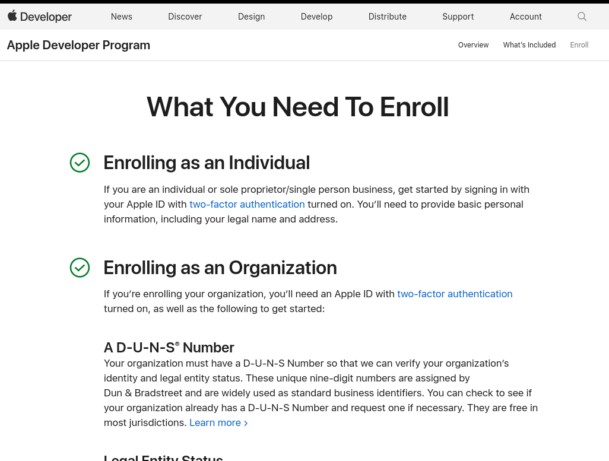
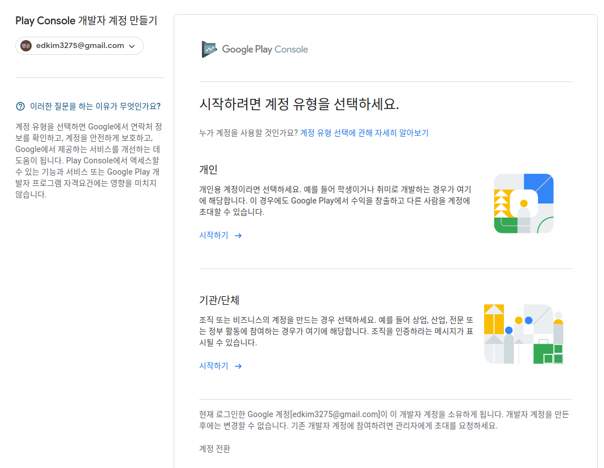

# Flutter for Beginners

> what we will learn in this course is not only the basics but also go from a complete beginner to being able to release our applications in apple's app store and google's play store.
>
> software engineers do not know all the answers you have to go and read documentation you have to practice practice practice and put time into it. countless countless hours you need to put into learning.

- vs code(IDE), firebase(backend), figma(design)

## 1. Developer Accounts

- developer account for apple and google. 기본적으로 개발한 앱을 애플스토어 혹은 구글플레이 스토어에 올리기위해서는 해당 플랫폼의 Developer account가 필요하다.

- every application needs to have an identifier(reverse domain identifier)

### iOS

- iOS - What is a dev account?

  what is a developer account and why we need it?

  - 애플, 구글에 등록하고 스토어에 deploy하기위한 리소스들을 얻기위함

-  iOS - Different dev accounts

  Individual / company (liability,책임)

  - 개인, 회사 계정 차이는 서비스에 대한 책임관련한 부분이 크다. 예를들어 어떤 사용자가 우리 서비스가 데이터를 부당한 곳에 사용하고, 불안전한 방식으로 보관한다고 생각할 경우, 혹은 데이터 저장 관련한 약관을 공개하지않고 저장을 하는 경우 사법문제가 발생할 수 있다.

  - 회사 계정의 경우 사용자에게 발생할 수 있는 손해에 대해 개인이 책임을 지거나 지지 않을 수 있다.(이번 course의 목표는 go through an application and create an application that can store users notes can be quiet personal)

  - personal company account

    you are personally liable for that company and you can also create a company that it's like an umbrella basically sits on top and then there are people who are directors of the company and etc. so you're not personally liable and that is the same structure that you can find it many other countries

  - How to register

    https://developer.apple.com/programs/enroll/

    

- iOS - D.U.N.S Number for organizations

  https://developer.apple.com/support/D-U-N-S/

  - organization account 생성할 경우 D.U.N.S라는 걸 세팅해야한다.
  - 기업신용정보 제공기관인 dun&bradstreet(D&B)로 부터 인증된 기관이여야만 organization account생성이 가능하다. 따라서 D&B로 부터 먼저 D.U.N.S number를 받아야함.

  - identifier for your company that you either have been assigned to already
  - 없을 경우 D&B 웹사이트에서 해당 기업이 DUNS number를 요청하여 그것을 받고 진행을 해야한다.

  - iOS의 경우

    organiazation account 생성시 본인 웹사이트가 없을 경우(혹은 웹사이트 도메인이 있더라도 콘텐츠가 없을 경우) 요청이 거절될 수 있다.

    you will need a hosting service or a domain provider(website) because they're not the same thing if you have a host and you have a domain provider it still doesn't mean that you have content on your web page.

- iOS - Long Process and not free

  This process sometimes can take weeks for organizations

  account 생성하기 까지 process 속도가 오래걸린다는 점을 유의하자.

- iOS - selling

  if you're registering and you want to well applications then you will have to provide some banking and tax information so they need to ensure that the stuff that you're selling in different countries the money that is then being sent to you bank account will be accounted for when you're paying your taxes

  so if you're trying to sell apps on the app store then you will have to fill in some forms with the u.s tax offices(Internal Revenue Service, IRS). have to send the forms to them then they will come back with some sort of identifier to you and then you will need to use that identifier on apple's website in order to basically say that yeah i know I'm selling stuff in the u.s I'm selling stuff in japan ... but I'm gonna pay taxes for them here in my country and that's what the forms says.

  

### Android

- playstore의 경우 apple보다는 간단하다.

  similar to App Store Connect for releasing Android apps

- Android - Sign up for dev account

  https://play.google.com/console/u/O/signup

  

  - when we actually submit our apps to app store and play store. there are a few key data points that you have to provide to both stores. one is a **privacy policy url** and the other one is a **support url**. and there are also two other emails you have to provide. the emails the first one is the **support email** and the other one is a **contact email**. and if you're if you're setting up a business account then i really suggest that you actually set up a website
  - developer account를 생성하기위해서 웬만하면 자신(회사)만의 웹사이트를 보유한 상태에서 생성하는 것이 좋다.

- flutter

  flutter can be deployed on a windows machine, macintosh or collectively called as desktop, web, android, ios five platforms.

  window환경에서는 iOS 서비스는 개발불가. it's just apple's fault for locking down their build systems and all their tools to macintosh so they haven't made the conscious decision to bring their tool system and tooling to windows or linux.

## 2. Setup

- install flutter

  Flutter is a rich **UI framework** developed by Google

- framework

  set of tools provided to you as a sortware developer so you can use to produce some output

- What is Dart

  Dart is the language that powers Flutter

- DartPad

  DartPad allows you to test your Dart code right in the browser

  https://dartpad.dev/?

- add path

  we need to expose flutter's binary files to our system

  flutter as an sdk or a toolkit or a framework it has a lot of bits and pieces of software in it and some of these bits are more important in that sense that they're actually executable in that on you computer.

  these are programs and flutter comes also with its own built-in programs.

- install xcode

- install Android Studio and Android SDK

  ios and android also provide you with sdk in order to write native applications. so we need to download android studio so we get acceess to the sdk manager and we can install an android sdk.

- extensions
  - Error Lens
  - Bracket Pair Colorizer
  - Flutter + Dart
  - bloc

## 3. Introduction to Dart

- Getting started

  ```bash
   $ flutter create project_name
  ```

- keywords

  https://dart.dev/guides/language/language-tour#keywords

- data types

  https://api.dart.dev/stable/2.14.4/dart-core/dart-core-library.html

- constants

  constant is value cannot be changed

  - compile-time constatnts vs. run-time constants

    writing program or running program. 

    compile is where you take the program that 

- functions

  hold your logic

## 4. Dart control statements and collections

- if & else

  ```dart
  const name = 'foo';
  if (name == 'foo') {
      print('yes this is foo');
  } else if (name == 'boo') {
      print('this is boo');
  } else {
      print('I don\'t know what this is');
      print("I don't know what this is");
  }
  ```

- operators

  prefix, infix,, suffix operators

  ```dart
  var age = 20;
  // infix : need two parameteres
  final halfOfAge = age / 2;
  final doubleTheAge = age * 2;
  // prefix : comes before whatever it has to do its work on
  // in this case it takes the value that comes after it. it decreases that value by one and then it return its result back to the left-hand side
  final ageMinusage = --age;
  ```

- Lists in Dart

  List of homogenous "things" lists are zero based.

  ```dart
  List<String> list1 = ['foo', 'bar', 'baz'];
  String foo = list1[0];
  final length = list1.length;
  list1.add('boo');
  ```

- Sets in Dart

  List of unique "things"

  ```dart
  final names = {'foo', 'bar', 'baz'};
  names.add('foo');
  print(names); // {foo, bar, baz}
  ```

- Maps in Dart

  Maps are used to hold key-value pairs of information

  ```dart
  const person = {
      'age': 20,
      'gender': 'male',
      'name': 'foo',
  };
  person['lastName'] = 'Kim';
  ```
## 5. Null-safety

concept that is available in most modern languages such as dart, rust, swift ... it is better to try to utilize it so that we can write better code.

- null value

  https://dart.dev/null-safety

  the concept of the absence of a value. variable can sometimes during its lifetime contain nothing. this nothingness is the concept that is know as null.

- nullable

  use the question mark after the data type such as `String?`

  ```dart
  const String? name = null;
  String? name = null;
  // only nullable list
  List<String>? names = ['foo', 'bar'];
  // nullable list & nullable values
  List<String?>? names = ['foo', 'bar', null];
  ```

  it means that variable can sometimes contain null

- cherry-picking non-null values

  use the `??`(null aware operator) mark

  ```dart
  const String? firstName = null;
  const String? middleName = 'bar';
  const String? lastName = 'baz';
  
  // old way
  if (firstName != null) {
      print("first name is the first non-null value")
  } else if (middleName != null) {
      ...
  } else if (lastName != null) {
      ...
  }
  
  const firstNonNullValue = firstName ?? middleName ?? lastName;
  ```

  `??` : if the value on my left side is null I'm gonna pick the value on my right. but the left one is not null I'll pick you. 

- null-aware assignment operator

  use `??=` mark

  ```dart
  double number = 2.0;
  number = null;
  number = 3.0;
  print(number); // 3.0
  ```

  if the value on the left side is null then change the value by the right side

- conditional invocation

  use the `?.` syntax to conditionally invoke a method or property

  ```dart
  List<String>? names = null;
  final lengthOfNames = names.length;
  ```

  

  ```dart
  List<String>? names = null;
  // old way
  final int lengthOfNames;
  if (names != null) {
      final lengthOfNames = names.length;
  } else {
      lengthOfNames = 0;
  }
  
  // better way(?.)
  // if the names List is present then grab its length. otherwise take the value of zero.
  final lengthOfNames = names?.length ?? 0;
  ```

## 6. Dart enumeration and objects

- Enumerations

  Named list of related items

- switch statement

- classes

  grouping of various functionalities into one packageable piece of data. grouping of related things is done with a class.

  ```dart
  class PascalCasePerson {
      void run() {
          print('running');
      }
      void breathe() {
          print('breathing');
      }
  }
  
  final person = PascalCasePerson();
  person.run();
  ```

  - instantiation

    instances are objects and objects are created from classes. every class can be instantiated meaning that the dart compiler will create a copy of that exact class with its data its functions its properties and give that copy to you
    
- Inheritance and subclassing

- abstract classes

  use the `abstract` modifier to define an abstract class - a class that can't be instantiated. Abstract classes are **useful for defining interfaces**, often with some implementation.

  ```dart
  abstract class ... {
      
  }
  ```

- factory constructors

  can return instances that are not of the same class

  it's the speed at which you can create an instance of a class that the factory constructor shines at

  ```dart
  class Cat {
      final String name;
      Cat(this.name);
      factory Cat.meow() {
          return Cat('meow');
      }
  }
  
  final cat = Cat.meow();
  ```

- custom operators

  you can define custom operators on your own classes in Dart. you can override particular operator at the language level only for your class.

  an object internally already defines an operator called `==` that returns boolean.

  ```dart
  class Cat {
      @override 
      bool operator ==(covariant Cat other) => other.name == name;
  
      @override
      int get hashCode => name.hashCode;
  }
  ```

  covariant tells dart that forget what the super class which is object defines as the parameter type for this parameter.

  :bulb: hashcode

  hashcode is a special number or a special identifier that you assign to your instance of classes 

## 7. Advanced Dart

- extensions

  adding logic to existing classes. extend or add functionality to an existing class.

  ```dart
  class Person {
      final String firstName;
      final String lastName;
      Person(this.firstName, this.lastName);
  }
  
  extension FullName on Person {
      String get fullName => '$firstName $lastName';
  }
  ```

  you're extending class `Cat` with a new functionality that is called `Run`. this is not the name of the function itself it's just the name of your extension. and you don't have to really know about the name right now so much it's just when you can go and become more advanced in dart and you for instance create libraries for yourself and people who use your libraries then they can in basically include specific extensions that you've included in your library in their code or they can exclude them.

  just know that it's just a name on the extensions so it doesn't mean so much right now. extensions are great tool for you to use if you believe that there is a functionality that you're adding to an existing class which it doesn't really belong in that class itself but it may for instance belong in the current source file that you're working with.

- Future

  Data to be returned in the future, as its name suggets.

  :bulb: synchronous vs. asynchronous

  synchronous task is a task that happens when you ask for it and it returns with the data that you ask for immediately. asynchronous task is basically a task that whose result are not returned immediately. 

- async / await

  mechanism for controlling asynchronous flow of data

- Stream

  an asynchronous "pipe" of data

  ```dart
  Stream<String> getName() {
    return Stream.value('foo');
  }
  
  void test() async {
    await for (final value in getName()) {
        print(value);
    }
  }
  ```

- generator

  for generating "iterables", marked with sync* and async*

  ```dart
  Iterable<int> getOneTwoThree() sync* {
      yield 1;
      yield 2;
      yield 3;
  }
  for (final value in getOneTwoThree()) {
      print(value); // 1 2
      if (value == 2) break;
  }
  ```

  `sync*` it is a generator function that returns a list of things but it calculates that list of things asynchronously. `async*` is equivalent of the `sync*` it does the same thing but it returns Stream which means it's asynchronously calculating its result.

  :bulb: List vs. Iterable(lazy collection)

  list in dart is an already packaged list it means that it's as if like you go to a supermarket and then you buy ready to go food that's already packaged 30 packs of that. however Iterable is like restaurant. it listens to orders of its customers and then it generates the food based on the orders.

  Iterable is a list of like things that gets calculated on the go on the fly.

- generics

  to avoid re-writing similar code

  ```dart
  class PairOfIntegers {
      final int value1;
      final int value2;
      PairOfIntegers(this.value1, this.value2);
  }
  
  class Pair<A, B> {
      final A value1;
      final B value2;
      Pair(this.value1, this.value2);
  }
  
  final names = Pari('foo', 'bar');
  ```

  
  
  
