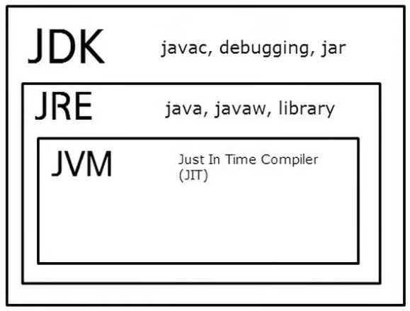

# Java

## Java의 역사

- 1995년 제임스 고슬링과 그의 동료들에 의해서 시작된 프로젝트. 
- 원래 가전제품을 제어하기 위한 언어로 고안되었지만 웹의 등장으로 엄청난 성공을 거두면서 주류 언어가 됨

## Java의 현재

- 한국에서는 정부나 기업의 **시스템 통합 프로젝트**가 대부분 자바로 구현되기 때문에 자바는 기업용 시장에서 두각을 나타냄

- 시스템 통합
  - System Integration의 약자
  - 기관이나 기업의 업무 관리를 소프트웨어화하는 것
  - 예를들어 병원에 대한 SI라고 한다면 환자의 상태와 의료진의 상태에 따라서 효율적으로 진료가 이루어지게 한다거나, 제조 공정이라고 한다면 생산설비의 상태를 시스템적으로 관리하는 것

- 모바일 플랫폼인 안드로이드가 대성공을 거두면서 자바의 수요가 급증했다.

## Java의 특징

- 가상머신
  - 가상머신의 핵심 가치라고 할 수 있는 '동일한 프로그램이 운영체제 가리지 않고 실행된다'는 특성
  - 하지만 이는 C나 C++ 같은 기존의 언어에서는 혁명적인 발상이지만
  - 오늘날 대세가 되고 있는 고급언어들(Python, Ruby, PHP, JavaScript)의 관점에서는 그리 대단한 일이 아닐 수 있다.

## 학습방법

> 숲을 빠르게 먼저보고 나무를 하나하나 조금씩 심어갑시다.

- 자바라는 언어가 어떻게 다가올 수 있는지를 소개하는 것이 좋을 듯
- **객체지향**을 필수적으로 가지고있는 프로그래밍언어
- 안드로이드 프로그래밍을 하고 싶다거나, 합류한 직장이 자바를 쓰고 있다면 자바를 해야 한다.
- 이런 경우는 이를 악물고 도전하는 수 밖에 없다.

## 자바에 대한 자료들

- [난 정말 JAVA를 공부한 적이 없다구요](http://www.kyobobook.co.kr/product/detailViewKor.laf?mallGb=KOR&ejkGb=KOR&barcode=9788996094029)
  - 자바를 처음 시작한다면 열혈 C 프로그래밍
- 소설자바
- 점프 투 자바

## Java의 설치

### 자바 프로그램의 동작

- 프로그래밍을 한다는 것은
  - 코드를 작성한다.
    - code = source = 설계도
  - 컴퓨터가 실행할 수 있는 형태로 코드를 컴파일
  - 컴파일된 프로그램을 실행

### 용어

Java를 처음 접하면 혼란스러운 경험을 하게 된다. 다양하고 복잡한 버전들 때문. 이것들에 대한 정리를 좀 하고 설치를 진행하자

> Java SE, JDK, JRE

- Java SE(Java Platform Standard Edition)는 자바의 표준안이다. 자바라는 언어가 어떠한 문법적인 구성을 가졌는지와 같은 것들을 정의.
  - 이것은 구체적인 소프트웨어가 아니고 그 소프트웨어의 설계도라고 할 수 있다.
  - 소프트웨어에서는 설계도라는 표현 대신에 명세서(spec: specification)이라는 말을 사용
  - 이 명세서는 JCP(Java Community Process)라는 조직을 통해서 만들어진다.
  - 여러가지 벤더들(IBM, oracle, open jdk ...) 다양한 주체들이 Java 표준안에 기술되어있는 규칙에 따라서
  - Java가 실행될 수 있는 환경인 JVM을 만들게 되는 것

- JDK(Java Development Kit)는 Java SE의 표준안에 따라서 만들어진 구체적인 소프트웨어
  - **Java 개발에 필요한 여러가지 도구**들을 모아서 제공하는 것
  - Java 코드를 컴파일하는 컴파일러 등 개발에 필요한 각종 도구들 그리고 JRE가 포함되어 있다.
  - Java 개발하겠다고 한다면 JDK를 반드시 다운받아야 한다.

- JRE(Java Runtime Environment)는 **자바가 실제로 동작하는데 필요**한 JVM, 라이브러리, 각종 파일들이 포함되어 있다.
  - Java로 만들어진 프로그램이 구동되기 위한 실행 환경을 제공
  - Java개발자가 아닌 Java를 사용하는 일반 사용자가 Java가 동작할 수 있도록 자신의 컴퓨터에 설치하는 프로그램

- JVM(Java Virtual Machine)은 **자바가 실제로 구동하는 환경**이다.
  - Java로 만들어진 소프트웨어는 JVM이라는 가상화된 환경에서 구동
  - 하드웨어나 운영체제에 따라서 달라질 수 있는 호환성의 문제는 운영체제 버전에 따라서 만들어진 JVM이 알아서 해결한다.
  - 즉, 하나의 자바 프로그램을 만들면 어떤 환경에서도 실행할 수 있는 것이 바로 JVM의 역할

### 버전

- 역사적인 이유로 좀 복잡하다.
- 2013년 12월 기준
  - Java SE 7 = JDK 1.7 = JDK 7
- JDK의 분류
  - Java SE
  - Java EE(기업용 시장에서 사용하는 자바 개발환경)
  - Java Me(모바일 개발을 위해서 사용하는 자바 버전)

### 윈도우에 설치하기

- `java jdk download`로 검색

- Java Platfrom (JDK) 클릭

  

- 약관에 동의(Accept 클릭)

  

- 운영체제에 맞는 jdk설치

- `윈도우 + r` 눌러서 cmd창 켜본 후 `java`를 검색해서 설치가 잘 되었는지 확인

  

  `java`의 경우 java 프로그램을 실행하는 명령어

  `javac`의 경우 java 프로그램의 소스코드를 컴파일하는 명령어

- javac의 경우 아직 어느 디렉토리에서나 실행할 때 실행되지 않도록 되어있음 PATH설정을 해주어야 한다.

  

- 윈도우 탐색기 => C => Program Files => Java => jdk(version) => bin 으로 이동

  

  - Java 프로그램을 위한 여러가지 도구들
  - 이를 어느 디렉토리에서건 실행하도록 하려면

  - 운영체제의 PATH라는 환경변수에 등록해야 한다

- 경로를 복사

  

- 컴퓨터 우클릭 => 속성 => 고급 시스템 설정 => 환경변수로 이동

  

- 시스템 변수에서 Path확인

  

- 변수 값 가장 끝에 세미콜론(;)찍는다

  

- 아까 복사헀던 주소를 붙여넣기

- 새로만들기를 해서 변수이름을 `JAVA_HOME`, 변수값에 복사했던 주소를 넣어서 확인(나중에 편리합니다.)

  

- 다시한번 cmd를 껐다가 켜서 `javac`를 쳐서 확인

  ****

