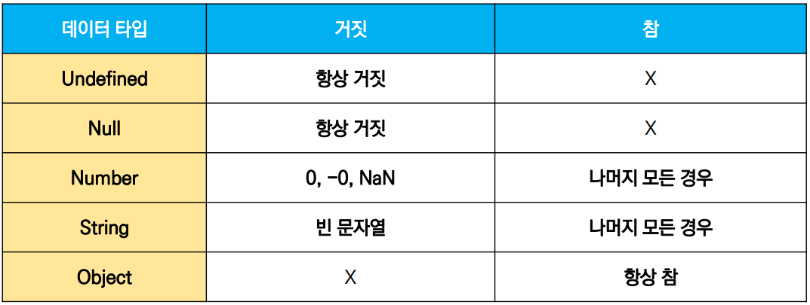
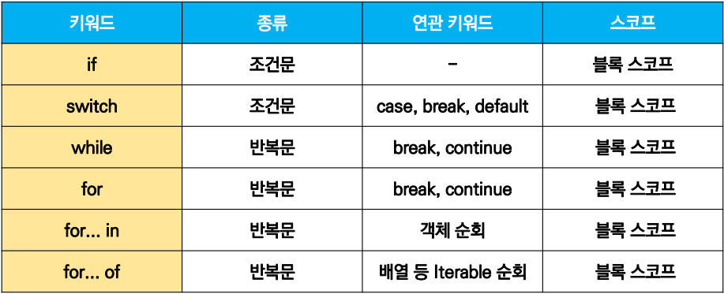
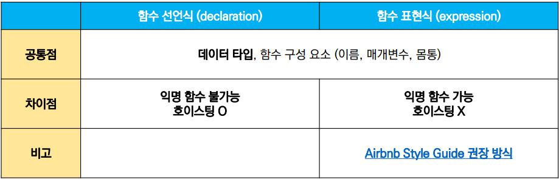

# Javascript_문법

## 타입

### 원시타입(Primitive type)

#### 숫자(Number) 타입

```js
const a = 13  // 양의 정수
const b = -5  // 음의 정수
const c = 3.14  // 실수
const d = 2.993e8  // 거듭제곱
const e = Infinity  // 양의 무한대
const f = -Infinity  // 음의 무한대
const g = NaN  // 산술 연산 불가
```

- Nan(Not-A-Number) : 계산이 불가능한 경우 반환되는 값

  ex) 'Angel' / 1004 => NaN

#### 문자열( String) 타입

```js
const firstName = 'Brendan'
const lastName = 'Eich'
const fullName = firstName + lastName

console.log(fullName)  // BrendanEich

const fullName = `${firstName} ${lastName}`
console.log(fullName)  // Brendan Eich
```

- 템플릿 리터럴(Template Literal)
  - backtick(``)으로 표현
  - `${expression}` 형태로 표현식 삽입 가능

#### undefined

```js
let firstName
console.log(firstName)  // undefined
```

- 변수의 값이 없음을 나타내는 데이터 타입
- 변수 선언 이후 직접 값을 할당하지 않으면 **자동으로** undefinded가 할당됨

#### null

```js
let firstName = null
console.log(firstName) // null

typeof null // object
```

- 변수의 값이 없음을 의도적으로 표현할 때 사용하는 데이터 타입
- typeof : 자료형 평가를 위한 연산자

- null 타입은 원시 타입에 속하지만, typeof 연산자의 결과는 객체(object)로 표현됨.

| undefined                                                | null                                 |
| -------------------------------------------------------- | ------------------------------------ |
| 빈 값을 표현하기 위한 데이터 타입                        | 빈 값을 표현하기 위한 데이터 타입    |
| 변수 선언시 아무 값도 할당하지 않으면 JS가 자동으로 할당 | 개발자가 의도적으로 필요에 의해 할당 |
| typeof 연산자의 결과는 undefined                         | typeof 연산자의 결과는 object        |

#### 불리언(Boolean)  타입

```js
let isAdmin = true
console.log(isAdmin)  // true

isAdmin = false
console.log(isAdmin)  // false
```

- 논리적 참, 거짓

- 조건, 반복문에서 유용하게 사용 (조건, 반복문에서 불리언이 아닌 데이터 타입은 자동 형변환 규칙에 따라 true 또는 false로 변환됨.)

  

### 참조타입(Reference type)

- 함수
- 배열
- 객체

## 연산자

### 할당 연산자

```js
let x = 0

x += 10
console.log(x)  // 10
x -= 3
console.log(x)  // 7
x *= 10
console.log(x)  // 70
x /= 10
console.log(x)  // 7
x++				// += 연산자와 동일
console.log(x)  // 8
x--				// -= 연산자와 동일
console.log(x)  // 7
```

- 오른쪽에 있는 피연산자의 평가 결과를 왼쪽 피연산자에 할당하는 연산자
- Increment, Decrement 연산자
  - Increment(++) : 피연산자의 값을 1 증가
  - Decrement(--) : 피연산자의 값을 1 감소
  - Airbnb Style Guide에서는 '+=' 또는 '-='같이 더 분명한 표현으로 적을 것을 권장

### 비교 연산자

```js
const numOne = 1
const numTwo = 2
console.log(numOne < numTwo)  // true

const charOne = 'a'
const charTwo = 'z'
console.log(charOne > charTwo)  // false
```

- 피연산자들을 비교하고 결과값을 불리언으로 반환

- 문자열은 유니코드 값을 사용하며 표준 사전순서를 기반으로 비교

  ex) 알파벳끼리 비교할 경우 : 알파벳 오름차순으로 우선순위를 지님, 소문자가 대문자보다 우선순위를 지님

### 동등 비교 연산자(==)

```js
const a = 1004
const b = '1004'
console.log(a == b)  // true

const c = 1
const d = true
console.log(c == d) // true

console.log(a + b)  // 10041004
console.log(c + d)  // 2
```

- 두 피연산자가 같은 값으로 평가되는지 비교후 불리언 값을 반환
- 비교할 때 암묵적 타입 변환을 통해 타입을 일치시킨 후 같은 값인지 비교
- 두 피연산자가 모두 객체일 경우 메모리의 같은 객체를 바라보는지를 판별

### 일치 비교 연산자(===)

```js
const a = 1004
const b = '1004'
console.log(a === b)  // false

const c = 1
const d = true
console.log(c === d) // false
```

- 두 피연산자가 같은 값으로 평가되는지 비교 후 불리언 값을 반환

- **엄격한 비교**가 이뤄지며 **암묵적 타입 변환이 발생하지 않음**

  엄격한 비교 : 두 비교 대상의 **타입과 값 모두** 같은지 비교하는 방식

### 논리 연산자

```js
/* and */
console.log(true && false)  // false
console.log(true && true)   // true
console.log(1 && 0) 		// 0   
console.log(4 && 7)			// 7
console.log('' && 5)		// ''

/* or */
console.log(true || false)	// true
console.log(false || false) // false
console.log(1 || 0)			// 1
console.log(4 || 7)			// 4
console.log('' || 5)		// 5

/* not */
console.log(!true)			// false
console.log(!'Bonjour!')	// false
```

- `&&`, `||`, `!`연산자를 이용
- 단축 평가 지원

### 삼항 연산자(Ternary Operator)

```js
console.log(true ? 1 : 2)  // 1
console.log(false ? 1 : 2) // 2

const result = Math.PI > 4 ? 'Yes' : 'No'
console.log(result)  // No
```

- 세 개의 피연산자를 사용하여 조건에 따라 값을 반환하는 연산자
- 가장 왼쪽의 조건식이 참이면 콜론 앞의 값, 그렇지 않으면 콜론 뒤의 값을 사용
- 삼항 연산자의 결과는 변수에 할당 가능
- 한 줄에 표기하는 것을 권장

## 조건문

- if statement

  - 조건 표현식의 결과값을 Boolean 타입으로 변환 후 참/거짓판단

  ```js
  if (condition) {
      // do st
  } else if (condition) {
      // do st
  } else {
      // do st
  }
  ```

  - 조건은 소괄호안에 작성
  - 실행할 코드는 중괄호안에 작성
  - 블록 스코프 생성

- switch statement

  - 조건 표현식의 결과값이 어느 값(case)에 해당하는지 판별
  - 주로 특정 변수의 값에 따라 조건을 분기할 떄 활용
  - 조건이 많아질 경우 if문보다 가독성이 나을 수 있음

  ```js
  switch(expression) {
      case 'first value': {
          // do st
          [break]
      }
      case 'second value': {
          // do st
          [break]
      }
      [default: {
       	// do st
      }]
  }
  ```

  - 표현식(expression)의 결과값과 case문의 오른쪽 값을 비교
  - break, default는 [선택적]으로 사용가능
  - break문이 없는 경우 break문을 만나거나 default문을 실행할 때까지 다음 조건문 실행

  - 블록 스코프생성

## 반복문

- while

  ```js
  while (condition) {
      // do st
  }
  ```

  - 조건문이 참인 동안 반복 실행
  - 조건은 소괄호 안에, 실행할 코드는 중괄호안에 작성
  - 블록 스코프 생성

- for

  ```js
  for (initialization; condition; expression) {
      // do st
  }
  ```

  - 세미콜론으로 세 부분으로 구성
  - `initialization` : **최초 반복문 진입시 1회만 실행**되는 부분
  - `condition` : **매 반복 시행 전 평가**되는 부분
  - `expression` : **매 반복 시행 이후 평가**되는 부분
  - 블록 스코프 생성

- for... in

  - **주로 객체(object)의 속성들을 순회**할 때 사용
  - 배열도 순회 가능하지만 인덱스 순으로 순회한다는 보장이 없으므로 권장하지 않음

  ```js
  for (variable in object) {
      // do st
  }
  ```

  ```js
  const capitals = {
      Korea: '서울',
      France: '파리',
  }
  
  for (let capital in capitals) {
      console.log(capital)  // Korea, France
  }
  ```

  

- for... of

  - **반복 가능한(iterable) 객체를 순회**하며 값을 꺼낼 때 사용

    반복 가능한 객체 : Array, Map, Set, String 등

  ```js
  for (variable of iterables) {
      // do st
  }
  ```

  ```js
  const fruits = ['딸기', '바나나', '메론']
  
  for (let fruit of fruits) {
      console.log(fruit)  // 딸기, 바나나, 메론
  }
  ```



## 함수

- JS에서 함수를 정의하는 방법은 주로 2가지로 구분

  - 함수 선언식(function declaration)
  - 함수 표현식(function expression)

- JS의 함수는 일급객체(First-class citizens)에 해당

  일급객체 : 다음의 조건들을 만족하는 객체를 의미함

  - 변수에 할당 가능
  - 함수의 매개변수로 전달 가능
  - 함수의 반환 값으로 사용 가능

- 함수 선언식

  ```js
  function name(args) {
      // do st
  }
  ```

  ```js
  function add(numOne, numTwo) {
      return numOne + numTwo
  }
  
  const result = add(1, 2)
  console.log(result)  // 3
  ```

  - 함수의 이름과 함께 정의하는 방식
  - 3가지 부분으로 구성
    - 함수의 이름(name)
    - 매개변수(args)
    - 몸통(중괄호 내부)

- 함수 표현식

  ```js
  const myFunction = function (args) {
      // do st
  }
  ```

  ```js
  const add = function (numOne, numTwo) {
      return numOne + numTwo
  }
  const result = add(1, 2)
  console.log(result)  // 3
  ```

  - 함수를 표현식 내에서 정의하는 방식

    표현식 : 어떤 하나의 값으로 결정되는 코드의 단위

  - 함수의 이름을 생략하고 익명 함수로 정의 가능
  - 3가지 부분으로 구성
    - 함수의 이름(생략 가능)
    - 매개변수(args)
    - 몸통(중괄호 내부)

- 기본인자(default arguments)

  - 인자 작성 시 '=' 문자 뒤 기본 인자 선언 가능



- 함수의 타입

  선언식 함수와 표현식 함수 모두 타입은 function으로 동일