# Javascript_심화

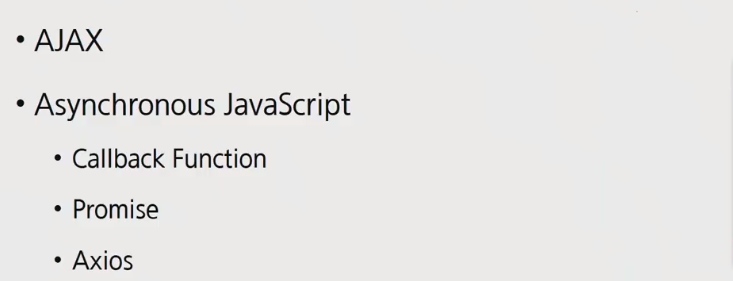

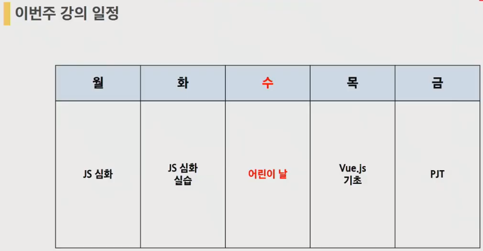

- Review

  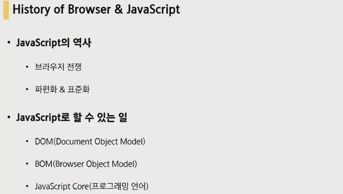

  - 문서, 브라우저를 조작하는 javascript
  - 프로그래밍 언어로써의 javascript

- DOM

  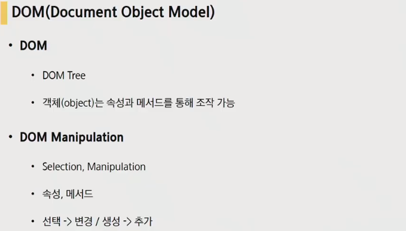

  - 선택과 변경

- Event

  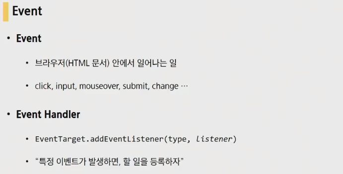

  - 브라우저가 동적으로 움직이기 위해서는 event 라는 것이 발생
  - evnet객체를 통해서 다음 행동을 결정 
  - 특정 이벤트가 발생하면,  할 일을 등록하자

- ECMAScript

  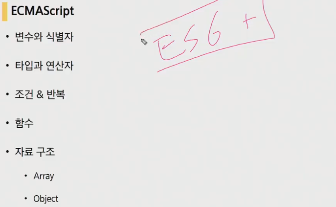

  - 양이 좀 많지만 천천히 따라오면서 복습해보세요 ㅎㅎ

## AJAX

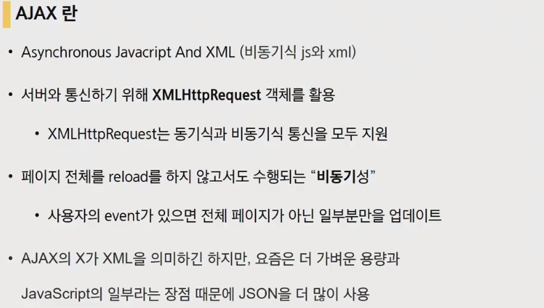

- 일부분만의 업데이트를 위해서 XMLHttpRequest객체를 활용    
- JSON을 요즘엔 더 많이 사용(XML대신 JSON을 사용할겁니다.)


- AJAX는 특정 기술이 아닌 기존의 여러 기술을 사용하는 새로운 접근법을 설명하는 용어
- 전송 버튼을 눌러 놓고 다른 페이지로 넘어가고, 메일은 알아서 전송 처리됨
- 스크롤하는 행위 하나하나가 모두 요청이지만 페이지는 갱신되지 않음

### XMLHttpRequest object

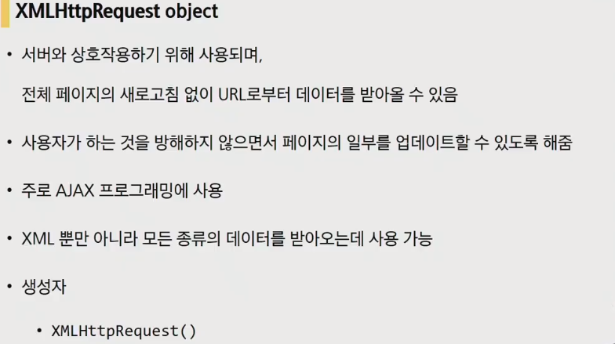

- **전체 페이지의 새로고침없이** 데이터를 받아올 수 있음

- 사용자가 하는 것을 방해하지 않으면서 페이지의 일부를 업데이트할 수 있도록 해줌
- 주로 AJAX프로그래밍에 사용
- 생성자 : XMLHttpRequest()

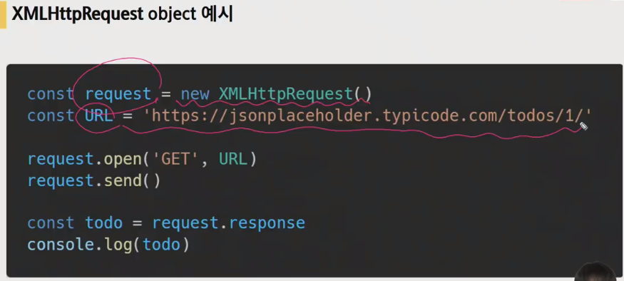

## Asynchronous JS

비동기식 JS


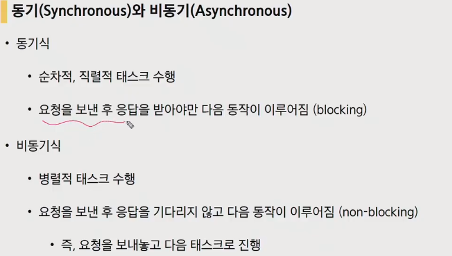

- 동기식

  - 위의 코드가 끝나야만 아래 코드가 실행(blocking)

- 비동기식

  - 요청을 보낸 후 응답을 기다리지 않고 다음 동작이 이루어짐(non-blocking)

  - 즉, 요청을 보내놓고 다음 태스크로 진행

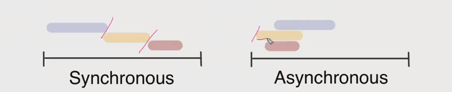

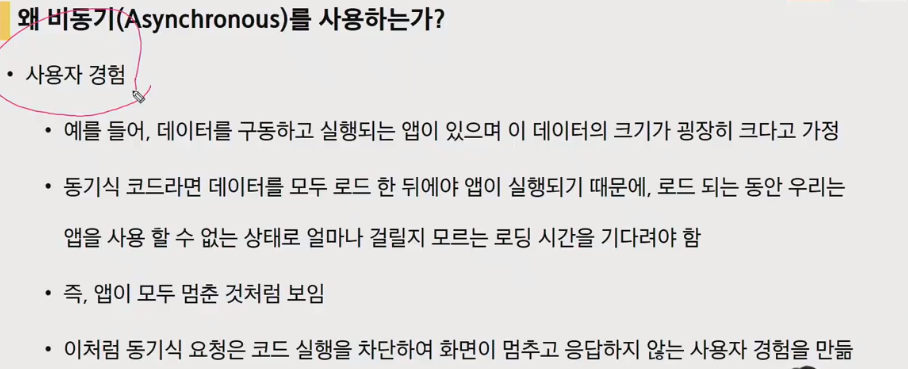


- 비동기를 사용하는 궁극적인 이유는 사용자 경험
- 동기식 요청은 코드 실행을 차단하여 화면이 멈추고 응답하지 않는 사용자 경험을 만듦

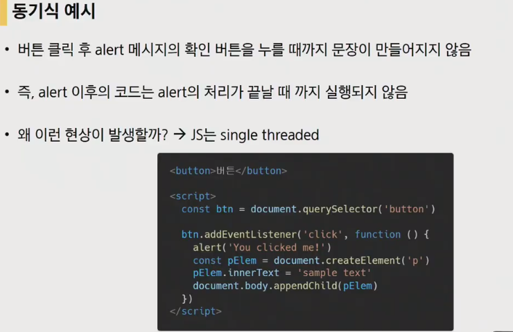

- alert 이후의 코드는 코드는 alert의 처리가 끊날 때 까지 실행되지 않음
- why?? JS는 heread가 하나다


- 빈문자열이 오는 이유?? 요청을 보내고 응답을 기다리지 않기 때문      
- 요청을 보내고 다음 응답으로 넘어간다 request.response에 응답이 없는 것. 이에대한 이유 또한 JS는 single threaded이기 때문.
- Blocking

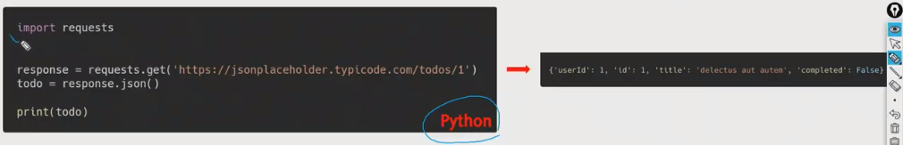

- NonBlocking

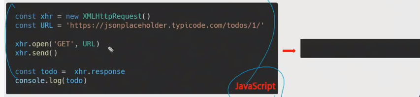

### Threads

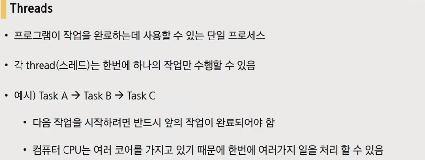

- 프로그램이 작업을 완료하는데 사용할 수 있는 단일 프로세스
- 다음작업을 시작하려면 반드시 앞의 작업이 완료되어야 함
- 이러한 Thread가 JS는 1개

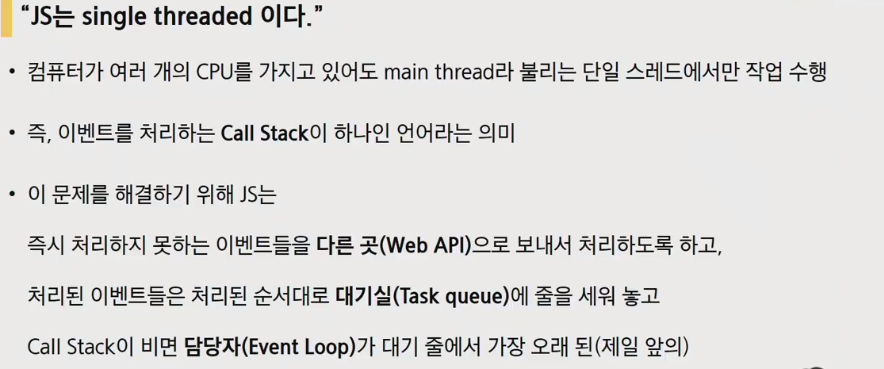


Call Stack - 다른곳(Wev API) - 대기실(Task queue) - 담당자(Event Loop)

### Concurrency model(동시성 모델)

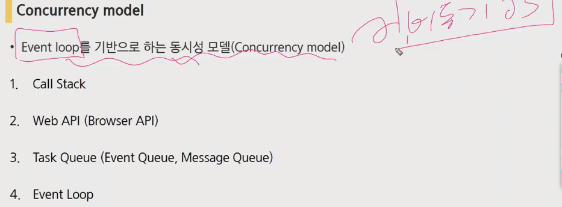

- single thread를 보완하기위해서 위와같은 구조를 구축

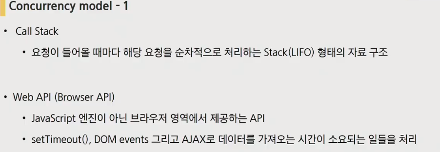

- Call Stack

  요청이 들어올 때마다 해당 요청을 순차적으로 처리하는 Stack(LIFO)형태의 자료 구조

- Web API(Browser API)
  - JS는 스레드가 한개이기 때문에 브라우저의 힘을 빌리는 것 
  - 브라우저영역에서 처리하고있음

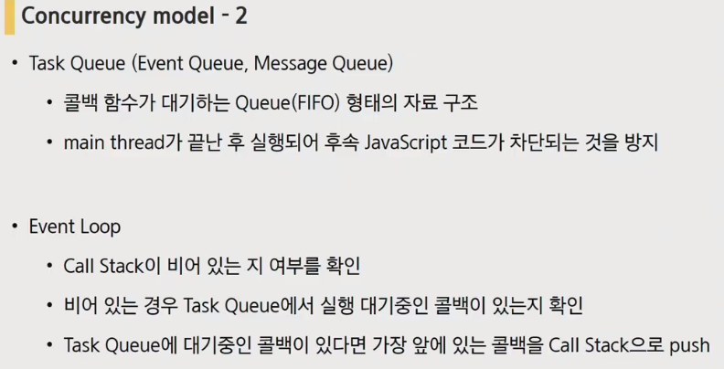

- 일처리 끝나면 Call Stack으로 돌아와야하는데 대기실이 있습니다. Task Queue

- main thread가 끝난 후(Call Stack이 비어진 후) 실행되어 후속 JS코드가 차단되는 것을 방지
- Call Stack으로 넣어주는 담당자(Event Loop)\
  - main thread가 끝났는지 계속 확인
  - 비어있는 경우 Task Queue에서 실행 대기중이 콜백이 있는지 확인
  - 따라서 사용자가 봤을때 멈추지 않고 계속해서 이어지는 것처럼 보인다.

- 예시

  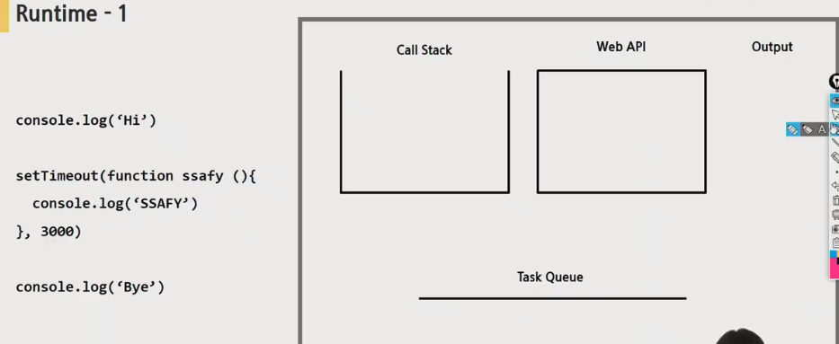

  비동기식 코드중 대표적인 setTiemout

  포인트는 기다려 주지 않는다는 것

  setTimeout은 대표적인 기다려야하는 코드인데, JS는 기다려 주지않는다. 이 부분은 바로 처리가 되지 않기 때문에 Web API로보낸다 

  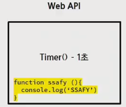

    출력 순서 : Hi Bye SSAFY

  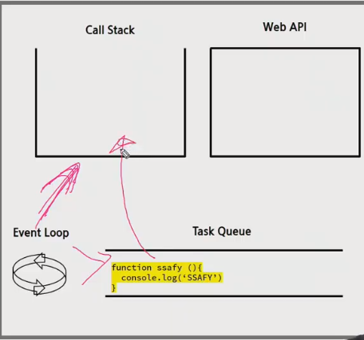

  Event Loop가 계속 Call Stack을 확인하고 비어있다면 Task Queue에서 작업을 꺼내서 실행

  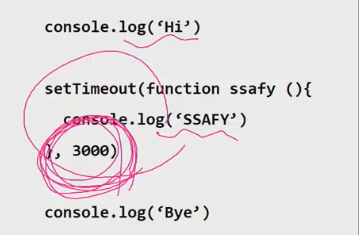

  그렇다면 저 3000이 3초후에 출력한다는 의미일까요 ? ㄴㄴ

  Web API에서 3초후에 Task Queue에 들어간다는 의미(따라서 언제 Call Stack이 들어오는지는 보장할 수없다.)

- Zero delays : 3초가 아니라 0이라고한다면 다를까?

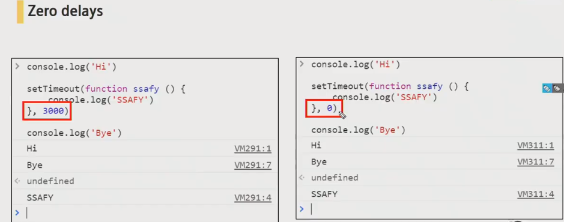

- 콜백함수가 실행되면 일단 Web API로 보내는 것이기 때문에 출력이 이전과 동일하다

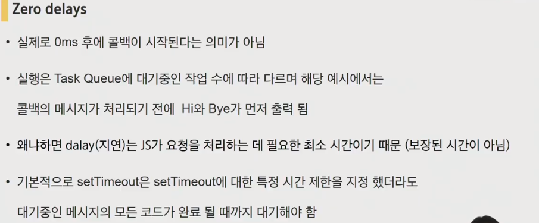

- 처리 된 순서대로 Queue에 들어가기때문에 시간이 보장되지 않는다.
- Web API가 JS요청을 처리하는데 필요한 최소 시간이지 보장된 시간이 아님.
- 문제점 : 순차적인 비동기 처리가 되지 않는다는 문제점
- 순차적인 비동기 처리하기위해서 JS의 방식(대기중이 call back에 대해서 순차적으로 처리하기 위한 Async callback)

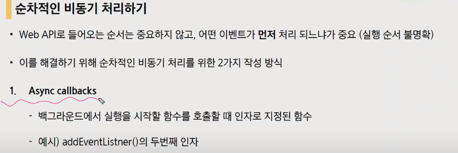

- ~하면 ~하겠다라는 순서가 보장이 된다.


- 순서를 정할 수 없는 비동기 형태가 존재한다(시간, 요청) => 순차적인 시간을 주겠다는 것! => Callback Function

## Callback Function

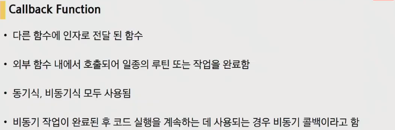

- 다른 함수에 인자로 전달 된 함수
- 외부 함수 내에서 호출되어 일종의 루틴 또는 작업을 완료함
- 동기식, 비동기식 모두 사용됨
- 비동기 작업이 완료된 후 코드 실행을 계속하는 데 사용되는 경우 비동기 콜백이라고 함.

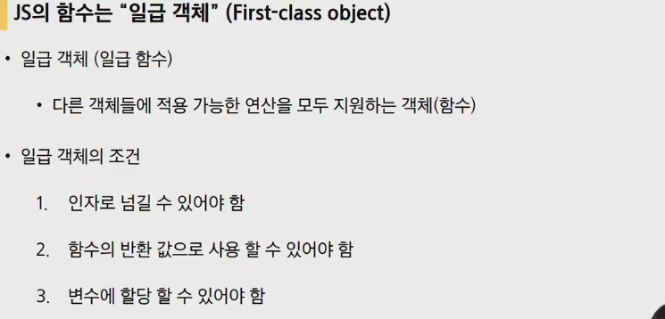

- JS함수는 "일급객체"

  - 인자로 넘길 수 있어야 함
  - 함수의 반환 값으로 사용 할 수 있어함(함수의 리턴이 함수인 경우)
  - 변수에 할당 할 수 있어야함

- 따라서 일급객체여야만 콜백함수로 사용될 수 있는 것.

- 예시

  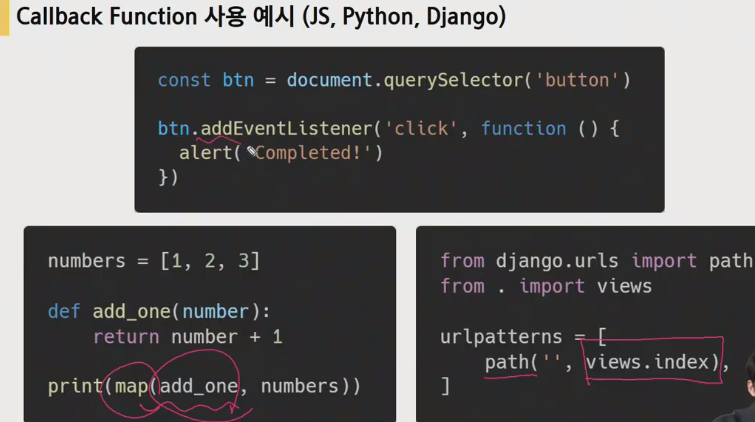

- Callback function은 비동기인가?? 아니다.
- 일반적인 동시성모델과는 다르게 명확한 순서가 생김(클릭하면..)

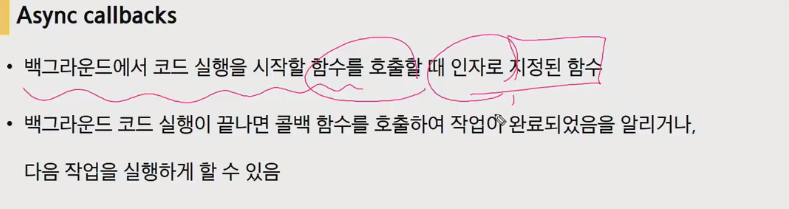

- 비동기 콜백
- 백그라운드에서 코드 실행을 시작할 함수를 호출할 때 인자로 지정된 함수

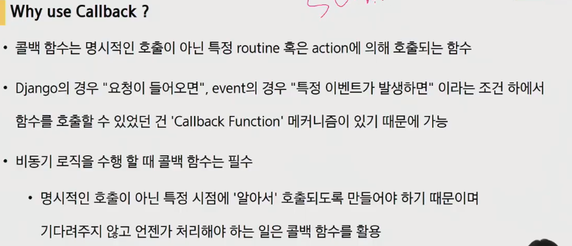

- 언젠가(특정시점은 우리가 지정할 수 있다) 처리해야 하는 일은 콜백 함수를 활용

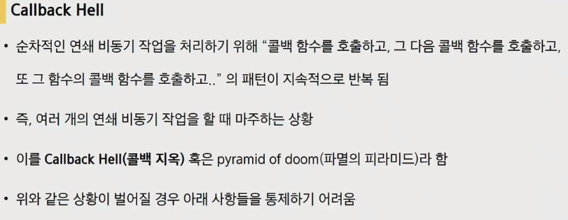


- 순차적인 연쇄 비동기 작업의 패턴이 지속적으로 반복 되는 일이 발생.(Callback Hell)

  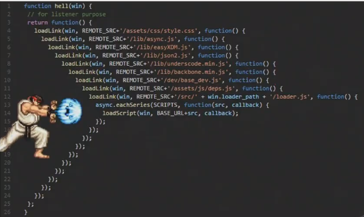

- Callback Functiion

  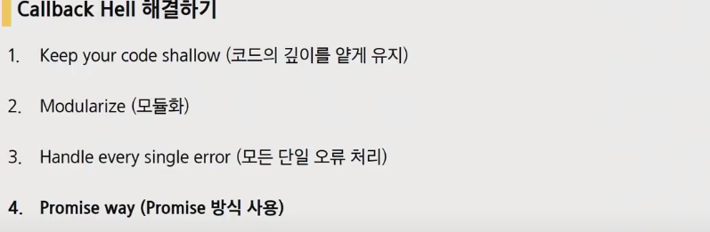

  - 새로운 문법구조의 등장.

### Promise

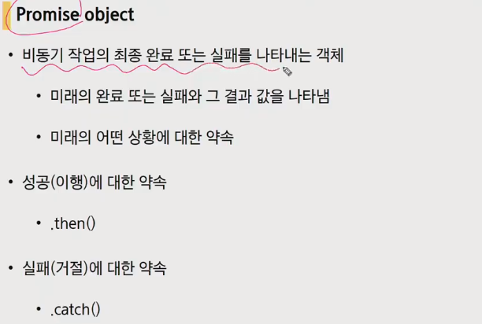

- 앞에서 이루어진 보덩기 객체의 작업을 .than .catch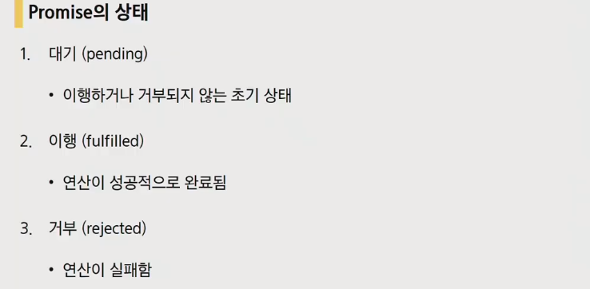

   대기 : 데이터의 선공

  실패 : 

​	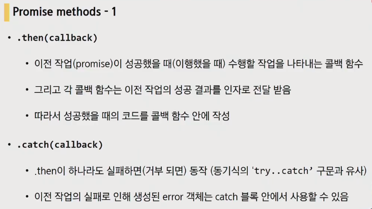

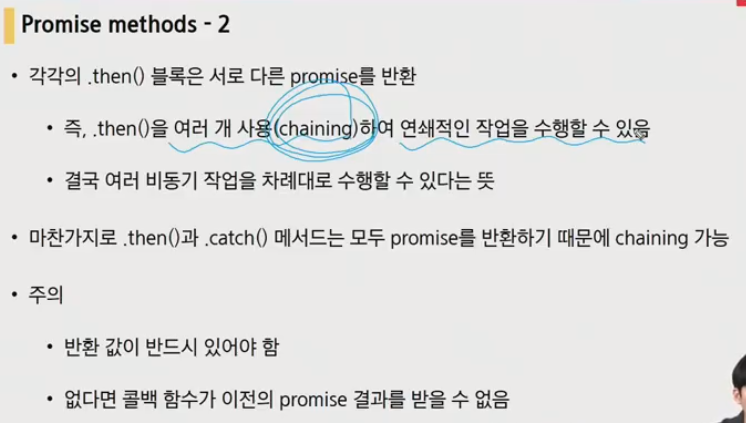

- chaining을 통해서 깊이가 깊어지지 않도록 방지.

- 여러 비동기 작업을 callback hell없이 수행할 수있다.

- 주의
  - 반환 값이 반드시 있어야 함
  - 없다면 콜백 함수가 이전의 promise결과를 받을 수 없음

- callback지옥을 나오기 위한 방법중 Promise 를 보고있습니다.

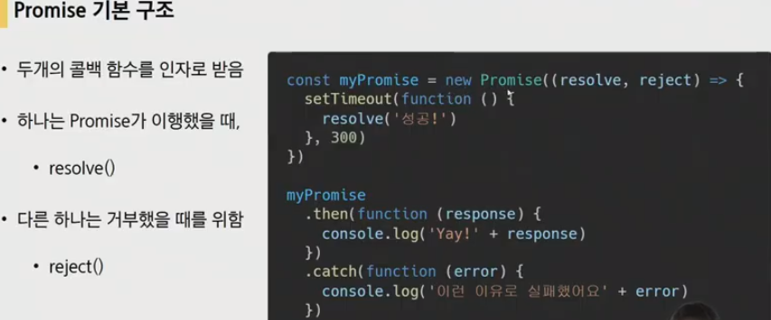

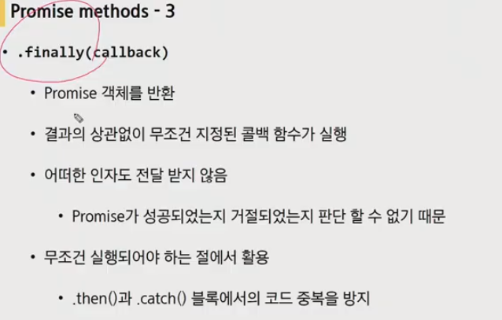

- 결과 상관없이 무조건 지정된 콜백 함수가 실행

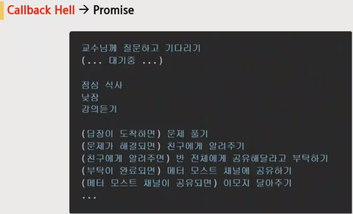

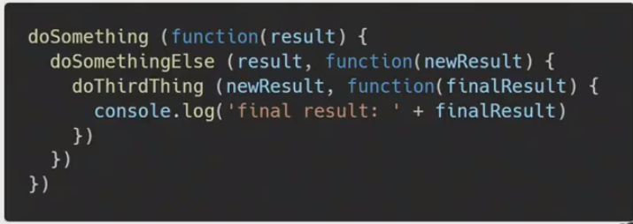

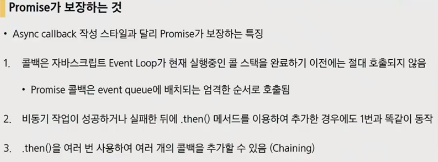


- promise  콜백은 event queue에 배치되는 엄격한 순서로 호출됨
- Chaining이 가능(promise의 가장 뛰어난 장점)

## Axios

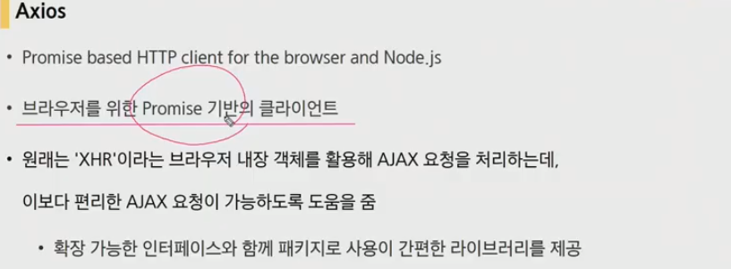

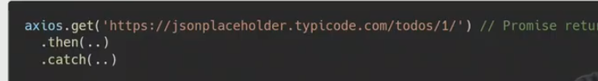

- url 로 요청을 보내면 promise 객체가 나옵니다.(리턴한다) => .then() .catch()를 쓸 수 있다.

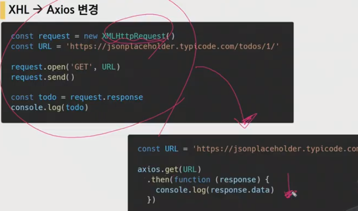

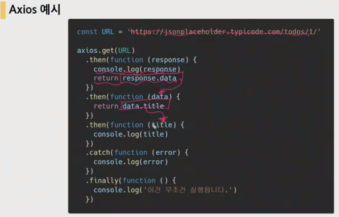

- 앞의 promise가 뒤로 넘어가고 넘어가고하는 구조를 생각하면 된다.

- finally는 인자가 없고, 마지막에 무조건 수행되는 메서드다.

- Axios는 CDN을 제공합니다.

  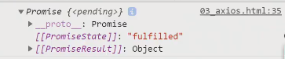

  - pending : 대기상태

  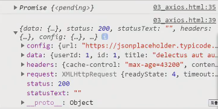

  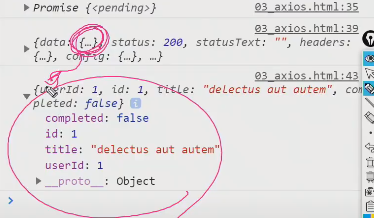

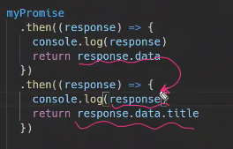

- 순차적 진행 
- 비동기 자바스크립트를 표현하는 두번째 방법 Axios

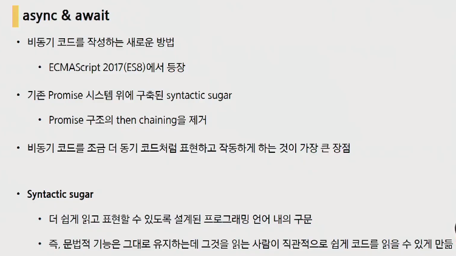

- 동작하는 문법적기능은 동일하지만 .then에대한 표현방법을 프로그램상에서 제거한 것
- 새로운 '문법적 표현'
- 문법적 기능은 그대로 유지, 읽는 사람들이 서로  집에 있니 않으니.

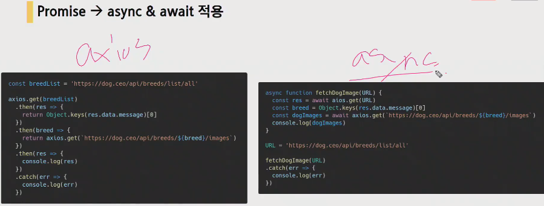

- then으로 이루어졌던 것이 async의 await로 대체됨

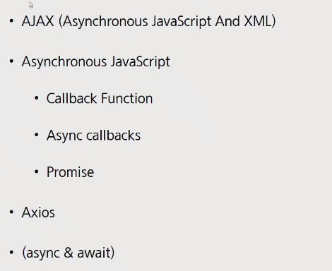

- 이름은 XML이지만 JS를 많이 쓴다.
- 비동기식 요청을 보내주는 것이 axios 
- 비동기 자바스크립트에 대한 내용
  - callback function(비동기 함수자체기 바동기 적인것x)
- 비동기식 콜백
- call back hell벗어나기 위한 promise

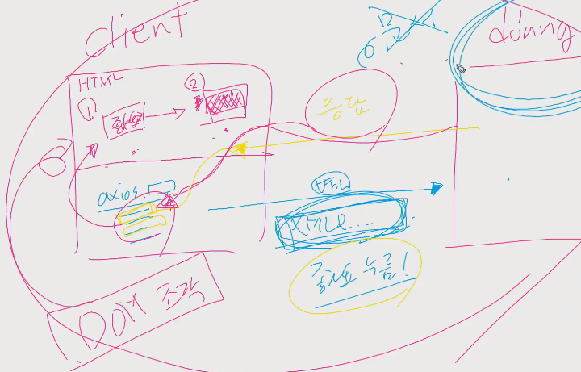


## 웹엑스               

- 대부분의 언어는 blocking

- 이전줄이 종료되기 전까지 다음줄은 실행되지 않는다.

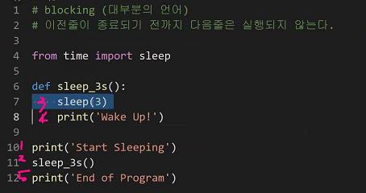

```python
from time import sleep

def sleep_3s():
    sleep(3)
    print('Wake Up!')
    
print('Start Sleeping')
sleep_3s()
print('End of Program')
```

- 우리의 프로그램을 실행하기 위해서 몇명이 일을 하고 있었을까? => 1

  ```javascript
  function sleep3s() {
      setTimeout(() => console.log('Wake Up!'), 3000)
  }
  
  console.log('Start Sleeping')
  sleep3s()
  console.log('End of Programing')
  ```

  

  - setTimeout이 진행을 막지않는다(non-blocking한 요소가있음)

  - 몇몇 작업(시간, 요청)은, 이전줄이 완료되기 전에 다음줄이 실행되는 것처럼 보인다.

  - 몇몇 작업(시간/요청) => 언제 끝날지 모르는 일들

- 요청또한 언제 끝날지 모르는 대표적인 일중 하나.

  ```python
  import requests
  
  requests.get('http://localhost:8000')
  ```

  예를들어

  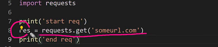

  이런 일이있다면 blocking한 요소가 있기때문에 end req가 실행되지 않는다.

- 요청, 시간과 관련된 일은 언제 끝날지 보장할 수 없는 작업이니까.

- JS 는 기본적으로 브라우저 안에 있다보니까 Web API라는 애가 내가 지금 당장 끝내지 않을 일들은 모두 토스를 하게 된다.

- Web API는 시간/요청 관련된 일을 처리하는데 , 나머지는 내가 다 할 수 있다고 생각하는데 가끔 그러지 않을 떄도 존재한다.

  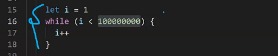

  이 코드는 non-blocking한 요소가 아니기 때문에 실제로 Web API로 보내는 것이 아니라 스레드에서 실행이 된다.(block당한 것)

- 왜 ! 이렇게 짰을까??

  대리(스레드)가 회사를 대표하는 업무자. window == tab이라고했는데 window에서 일어나는 모든일이 대리가 해야하는 일. 근데 이렇게 업무가 많은대리에게 시간, 요청관련된 업무까지 맡게 된다면 뻗어버리게되는 것.

  내부 document, event ... 모든것을 다 관리하고있는데, 갑자기 부장이라는 사람이 끝말이기 한번합세라고하게되면? 아예 브라우저가 뻗어버린다.(클릭, 드래그.. 아무것도 안됨)

  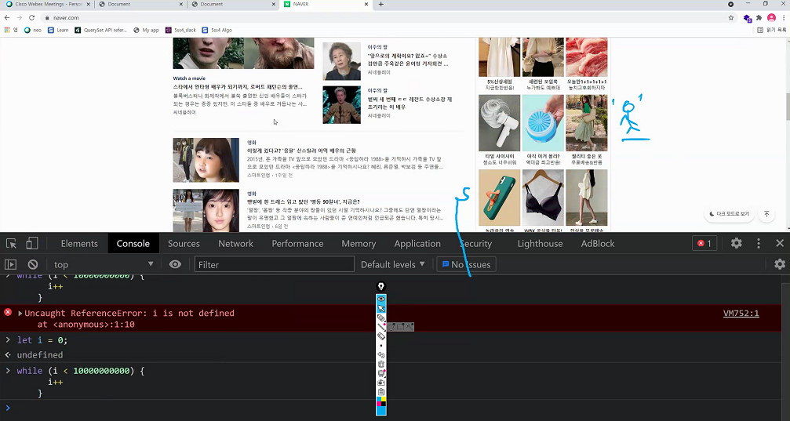

- Blocking의 경우추가적으로 이 대리를 추가할 수가 있다.(멀티 스레드) 하지만 Non-Blocking은 절대로 스레드를 추가할 수가 없다. 

  

- cpu 알통문

  Hz 초당 1번, GHz 초당 1000번(자체 파워가 높은 것)

  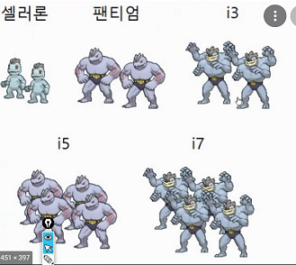

- SW적으로 스레드 프로그래밍을 한다는 것은 굳이 여러개의 스레드가 필요한 것은 아닙니다. 스레드를 나누어서 프로그래밍을 하게 된다면 생각보다 고려해야할 부분이 많아집니다.

- cpu멀티코어(관련된 짤 참고)

- JS는 SW중에서도 브라우저 안에서 행동을 하게 되는데, 스레드의 영역은 API Kernal CPU와 관련된 영역

   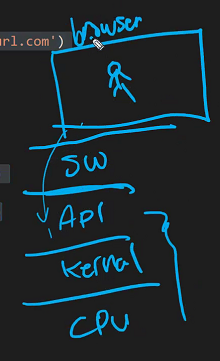

- 브라우저는 사용자 측면에서 내부에서 나가지 못하도록 되어있습니다. 그래서 저 브라우저속의 대리가 하는 일이 너무많아서... 언제 끝날지 모르는일들을 기다리다보면 아까의 경우처럼 브라우저가 멈춰버릴수가있기 때문에 계속 작업을 해야하므로 몇몇 요소(시간/요청)만 non-blocking한 요소만 Web API에 미루어주는 것.

- setTimeout() : non blocking

  setTimeout자체는 실행되지만 setTimeout의 실행결과는 web API(브라우저 사이드킥) API에 일을 넘김

  실행이 되지만 미뤄지는 것처럼 보이기 때문에 non blocking하다고 하는 것.

- 콜백을 쓰면 non-blocking한 것인가? 아니다.  django만 해도 non-blocking하지않고 blocking하다. 하지만 Web API가 non-blocking한 요소를 갖고 있고 non-blocking한 요소를 갖기 위해서 콜백요소를 활용하게 된 것.이라고 이해하면 됩니다.

```javascript
const xhr = new XMLHttpRequest()
// 준비단계
xhr.open('GET', 'http://google.com',)
// 요청보냄
xhr.send()
console.log('hi')
xhr.response
```

- send가 보내지기 전까지 hi는 보내지지 않아야한다. send를 보내서 error가 작동해도 마찬가지고 hi가 출력되면 안되지만 출력이 된다. hi또한 Web API에 보내는 것.

  요청역시도  request에는 안찍혀야하는게 Web API에 보내게 된다는 것을 캐치하면 됩니다.

- 한줄정리 : **blocking와 non-blocking에 대한 정리. JS는 몇몇요소가 마치 non-blocking하게 흘러간다. 이전줄이 완료되기 전에 당므줄이 실행 되는 것 처럼 보인다. **

---

```python
class Article():
    pass

article = new Article()
```

- 클래스기반 오브젝트가 아니라 JS는 오브젝트 기반의 오브젝트를 만듭니다.

- {} 오브젝트는 우리가 지금까지 알고있던 객체와 똑같이 작용할 겁니다.

```python
class Article:
    def __init(self, name):
        self.name = name
    def greeting(self):
        return f'hi, my name is {self.name}'
    
p = Person()
p.name
p.greeting()
```

 ```javascript
const  p = {
    name: 'neo',
    // 3가지 방법
    greeting: functino () {},
    greeting () {},
    greeting: () => {},
    p.name
	p.greeting()
}
 ```

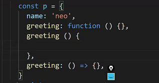

- class를 만들었지만 본질은 여전히 object로 나옴. 그때 object를 만들때 new라는 명령어를 사용하자고 한 것.

- JS는 object기반의 언어. object가 key value

- AJAX 왜배우는가. UX(사용자 경험)
  - 현재까지는 화면전환없는 요청이 우리에게는 지금 없습니다.
  - 화면전환없는 요청이 바로 AJAX

---

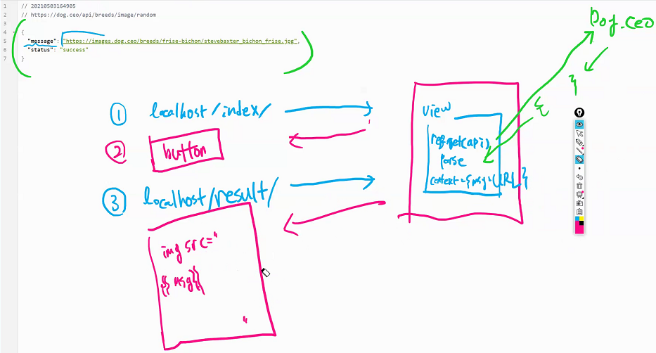

- 엄창나게 복잡합니다.

- 중간에 서버가 껴버리니까 복잡해진 상황

  

---

res의 결과

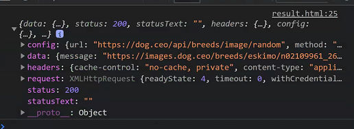

- 요청에 대한 응답이 왔다. 누가보낸응답임? 

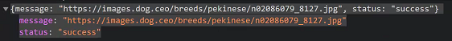

이게 사실응답인데 핸들링하는 입장에서는 이것만 있어서는 안된다.

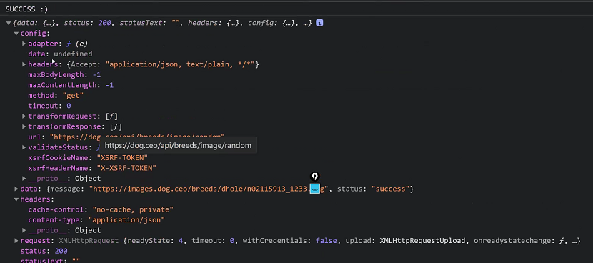

data만 보면 됨

근데 응답은 분명 JSON으로 왔는데 data를 보면 JSON이 아니라 object로 파씽이 되어있다. string까지 파씽하는 것 까지 axios가 data key의 object로 넣어서 준다. 

- res는 요청응답 전체
- 실행순서

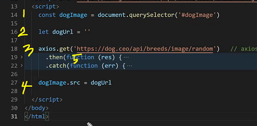

- 비동기 JS요청(AJAX)

## 보충수업

 ```python
response = requests.get('url')
todo = response.json()
print(todo)
 ```

- 언제 url 에대한 응답을 받을지 알 수 없다는 점

---

- 비동기, 동기에서 중요한 것은 내가 작성한 코드가 실제로 어떤 결과를 낳는지
- 용어자체에 매몰되지 마세요.

 ```javascript
// 1. setTimeout
const sleep3Seconds = function () {
    console.log('잘잤다')
}

console.log('일어나자')
setTimeout(sleep3Seconds, 3000)
console.log('학교간다')
// 2. XMLHttpRequest
const URL = 'https://jsonplaceholder.typicode.com/todos/1/'
 ```

- `setTimeout` : 3초있다가 sleep3Seconds를 실행하라고 알려줘라! o

- `axios.get(url)` : promise 객체를 리턴한다

  그렇다면 axios.get()에 .then() .catch() .finally() ... 을 붙일 수가 있다.

  axios를 통해서 get요청을 보내면 제대로된 응답(200)이 돌아온다면 올바를때 실행할 일을 `.then(할일)`에 작성하고 잘못되었을때 할 일을 `.catch(잘못되었을때할일)` 작성해준다.

---

- callback이라고해서(함수를 인자로 전달했다고해서) 모두 비동기인것은 아니다.

  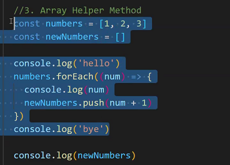

- hello - 1 2 3 - bye

- 이경우 forEach는 동적으로 작동을 합니다.

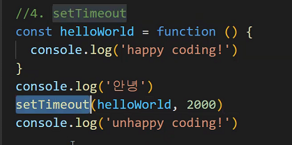

- setTimeout의 경우 비동기적으로 작동합니다.

---

- axios를 만든사람이 서버에서 주는 JSON(string)을 쉽게 접근할 수 있게끔 변환을 해서 response에 담아서 만들어 준 것 response는  object

  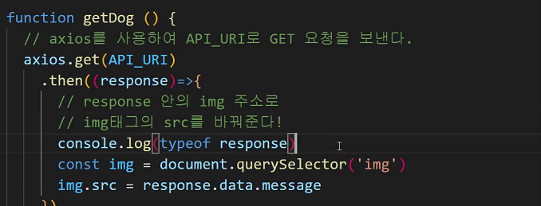

---

### workshop

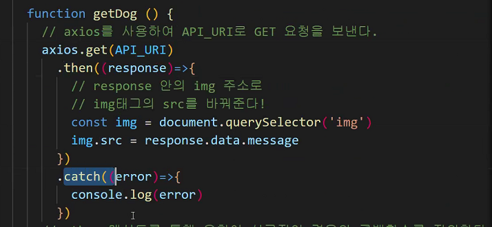

css query selector

---

promise

- 모르고 넘겨도 지금은 전혀 상관없는 이야기

```javascript
  setTimeout(() => {
      console.log('after 3s!')
  }, 3000)
```

이걸 promise로 구현하려면??

```javascript
// 어떤 Promise객체를 만든 것
const threeSecondsPromise = new Promise((resolve, reject)=>{
    setTimeout(() => {
        resolve()
    }, 3000);
})

threeSecondsPromise
  .then(()=>{
    console.log('after 3s!')
  })
  .catch(()=>{})
```

- 파이선에서 인스턴스 만들 때  article = Article()을 했는데 JS에서는 new를 붙여준다.
- resolve - then, reject -catch

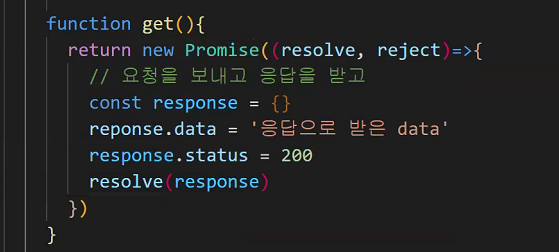

-  콜백방식으로 되어있는애들을 distacne로 바꾸어야하는 일이 생길수도 있다.