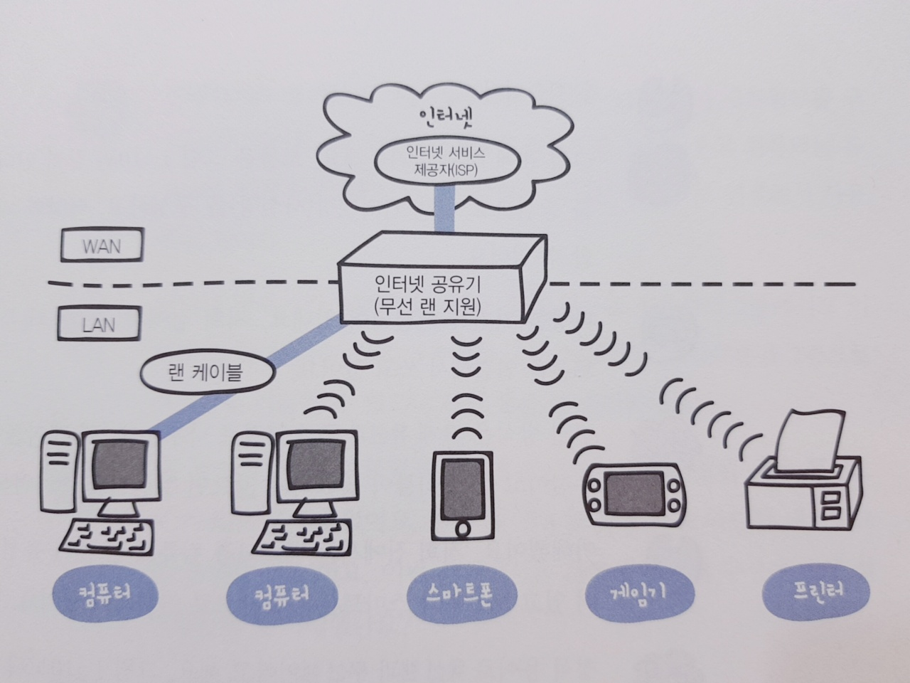
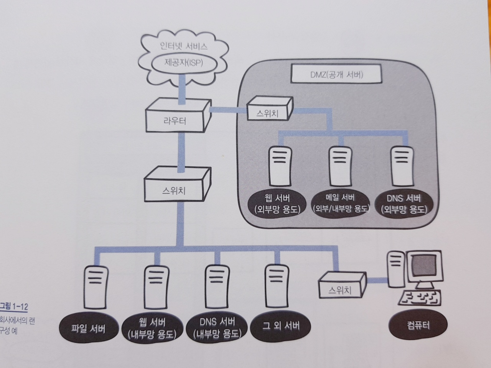

# 네트워크

> 「모두의 네트워크」(미즈구치 카츠야, 길벗)를 기반으로한 네트워크 기본개념 정리

[TOC]

## 1. 네트워크 기본지식

### 1.1. 네트워크의 구조

- 컴퓨터 네트워크
  - 네트워크(Network)자체는 어떠한 관계, 연결을 의미하는 광범위한 단어
  - 두 대이상의 컴퓨터가 연결되어있는 통신망을 **`컴퓨터 네트워크`**라고한다.
  - 컴퓨터 간에 필요한 데이터(정보)를 서로 주고 받을 수 있다.
  - 데이터 송,수신, 웹 사이트 열람과 같은 일을 할 수 있다.
  - **`인터넷`**은 전세계의 큰 네트워크부터 작은 네트워크까지를 연결하는 거대한 네트워크를 말한다.
- 패킷
  - 네트워크 통신에는 **규칙**이 존재하는데, 통신에 사용되는 기본 단위를 **`패킷(packet)`**이라고 한다.
  - 네트워크를 통해 전송되는 데이터의 작은 조각
  - 큰 데이터가 있더라도 작게 나누어서 보내는 것이 규칙(데이터 자체를 보내는 것이 편리하겠으나, 네트워크의 대역폭을 넘게된다면 다른 패킷들을 흐름을 막을 위험이 있을 수 있다.)
  - 따라서 용량이 큰 데이터는 패킷을 분할하여 전송한다.
  - 이 때, 분할된 패킷은 순서대로 도달하지 않을 수 있다. 송출 시 패킷에 번호를 붙여서 전송하게되고, 수신할 때 번호에 맞춰 정렬을 하여 송출한 데이터를 올바르게 수신할 수 있다.

### 1.2. 정보와 양을 나타내는 단위

> 비트(bit)와 바이트(byte)

- 디지털 데이터(digital data)
  - 모든 컴퓨터는 0과 1만 이해할 수 있는데, 0과 1로만 이루어진 집합을 `디지털 데이터`라고 한다.
- 비트와 바이트
  - 비트(bit) : 0과 1의 정보를 나타내는 최소 단위
  - 바이트(byte) : 8비트. 일반적으로 컴퓨터는 바이트 단위로 데이터를 읽고, 쓰는 작업을 한다.
- 문자코드(character code)
  - 0과 1만을 다룰 수 있는 컴퓨터가 문자를 어떻게 다루는가?
  - 문자와 숫자의 대응표를 미리 만들어 놓았기 때문
- ASCII(American Standard Code for Information Interchange)
  - 문자 코드의 한 종류
  - 알파벳, 기호, 숫자 등을 다룰 수 있는 기본적인 문자코드
  - 예를들어 C를 누르게되면 C에 대응하는 문자코드인 67을 확인하고 화면에 C를 표시하게 된다. 

### 1.3. 랜과 왠

> 좁은 범위의 네트워크 랜(LAN)과 넓은 범위의 왠(WAN)

- 랜(LAN)
  - Local Area Network. 근거리 통신망
  - 건물 안이나 특정 지역을 범위로하는 네트워크. 지리적으로 제한된 공간에서의 네트워크
- 왠(WAN)
  - Wide Area Network. 광역 통신망
  - 인터넷 서비스 제공자(ISP)가 제공하는 서비스를 사용하여 구축된 네트워크
  - 랜과 랜을 연결하는 네트워크
- 인터넷 서비스 제공자(ISP)
  - Internet Service Provider
  - 인터넷 상용 서비스 사업을 하고있는 사업자(KT, SK브로드밴드, U+와 같은 통신회사)

|      | 랜                      | 왠                   |
| ---- | ----------------------- | -------------------- |
| 범위 | 좁다(건물이나 특정지역) | 넓다(랜과 랜을 연결) |
| 속도 | 빠르다                  | 느리다               |
| 오류 | 적다                    | 많다                 |

### 1.4. 가정에서 하는 랜 구성

- 인터넷을 사용하기 위해서는...
  - **인터넷 서비스 제공자(ISP)와 인터넷 회선**을 결정해야만 한다.
  - ISP와 네트워크르 연결하기 위해 **인터넷 공유기**가 필요하다.
  - ISP와 인터넷 공유기를 통해 접속한다
  - 접속 방식에는 유선 랜 방식과 무선 랜 방식이 있다.

### 1.5. 회사에서 하는 랜 구성

- 소규모 회사(Small Office/Home Office)에서의 네트워크 구성
  - DMZ라는 네트워크 영역이 존재(Demilitarized Zone)
  - 외부에 공개하기 위한 네트워크(웹, 메일, DNS서버...)
    - 웹 사이트를 불특정 다수의외부 사용자에게 공개하려면 웹 서버를 외부에 공개
    - 외부 사용자와 메일을 주고받으려면 메일 서버를 외부에 공개
    - 외부에서 도메인 이름을 사용하여 회사의 서버에 접속하려면 DNS 서버를 외부에 공개
- 서버운영
  - 온프레미스(on-premise) : 사내에 설치(서버 장비실을 두고 그곳에 랙 설치) or 데이터 센터
  - 클라우드(cloud)

### 용어정리

| 용어                      | 의미                                                         |
| ------------------------- | ------------------------------------------------------------ |
| 컴퓨터 네트워크(Network)  | 컴퓨터를 두 대 이상 연결하여 서로 데이터를 전송할 수 있는 통신망 |
| 인터넷(Internet)          | TCP/IP 프로토콜을 사용하는 세계 최대 규모의 네트워크.        |
| 패킷(Packet)              | 네트워크 통신을 할 때 사용되는 작게 분할된 데이터 조각. 네트워크에서 전송하는 데이터의 기본 단위 |
| 비트(bit)                 | 정보의 최소 단위                                             |
| 바이트(byte)              | 컴퓨터의 정보량 단위로 8비트를 1바이트라고 한다              |
| 랜(LAN)                   | 비교적 가까운 거리에 위치한 장치들을 서로 연결한 네트워크    |
| 왠(WAN)                   | 랜을 다시 하나로 묶는 거대한 네트워크. 매우 넓은 범위를 연결하는 네트워크 |
| 인터넷 서비스 제공자(ISP) | 인터넷에 접속하는 수단을 제공하는 주체.                      |
| 서버(server)              | 컴퓨터 네트워크에서 다른 컴퓨터에 서비스를 제공하기 위한 컴퓨터 또는 프로그램 |
| DMZ                       | 외부 네트워크와 내부 네트워크 사이에 위치한 중간 지대(서브넷). 네트워크의 보안영역으로 외부 공격자가 내부 네트워크에 침투하는 것을 막는 역할 |

## 2. 네트워크의 기본 규칙

### 2.1. 네트워크의 규칙

- 프로토콜(protocol)

  - 네트워크에서 문제없이 통신하기 위한 규칙(약속)

  - 편지를 보낼 때, 주소를 적고 우표를 붙이는 작업

### 2.2. OSI모델과 TCP/IP모델

- 통신규격
  - 네트워크에는 데이터를 주고받기 위한 통신규격이 정해져 있다.

- OSI모델
  - 표준규격의 필요성이 두각
  - ISO(International Organization for Standardization)라는 국제표준화기구에서 제정한 표준규격 `OSI모델`
  - 데이터 송,수신시에 컴퓨터 내부에서 일어나는 7계층 작업(응표세전네데물)
    - 응용 계층 : 애플리케이션에 대한 서비스 제공
    - 표현 계층 : 데이터 변환
    - 세션 계층 : 세션 체결, 통신 방식을 결정
    - 전송 계층 : 신뢰할 수 있는 통신을 구현
    - 네트워크 계층 : 다른 네트워크와 통신하기 위한 경로 설정
    - 데이터 링크 계층 : 네트워크 기기 간의 데이터 전송 및 물리 주소 결정
    - 물리 계층 : 시스템 간의 물리적인 연결과 전기 신호를 변환 및 제어

- TCP/IP모델

  - Transmission Control Protocol/Internet Protocol model
  - 4계층으로 구성
    - 응용 계층(응,표,세)
    - 전송 계층(전)
    - 인터넷 계층(네)
    - 네트워크 접속 계층(데, 물)

  - 각각 계층에는 다양한 프로토콜이 존재

### 2.3. 캡슐화와 역캡슐화

- 캡슐화(encapsulation)
  - 데이터를 전송할 때 필요한 정보를 붙여서 다음 계층으로 보내게 되는데 이 정보를 **헤더**라고 한다.
  - 헤더에는 데이터를 전달받을 상대방에 대한 정보도 포함
  - 이처럼 데이터를 전송할 때 필요한 데이터(헤더)를 붙여나가는 과정을 **캡슐화**라고 한다.
- 역캡슐화(decapsulation)
  - 수신 측에서 데이터를 받기 위해 각 계층에서 해당하는 헤더를 제거하는 과정

### 용어정리

| 용어               | 의미                                                         |
| ------------------ | ------------------------------------------------------------ |
| 프로토콜(protocol) | 컴퓨터 간에 정보를 주고받을 때의 통신 방법에 대한 규칙이나 표준 |
| OSI 모델           | 국제표준화기구(ISO)가 제정한 국제 통신 표준 규약. 네트워크의 기본 구조를 7개 계층으로 나눠서 표준화한 통신 규약 |
| TCP/IP 모델        | OSI 모델 7계층의 네트워크에서 데이터를 전송하는 과정을 4계층으로 단순화시켜 사용하는 모델. 인터넷 모델이라고도 한다. |
| 캘슐화/역캡슐화    | 캡슐화는 컴퓨터 통신에서 상위 계층의 통신 프로토콜 정보를 데이터에 추가하여 하위 게층으로 전송하는 기술. 반대로 역캡슐화는 상위 계층의 통신 프로토콜에서 하위 계층에서 추가한 정보와 데이터를 분리하는 기술 |
| 헤더(header)       | 저장되거나 전송되는 데이터의 맨 앞에 위치하는 추가적인 정보 데이터. 데이터의 내용이나 성격을 식별 또는 제어하는 데 사용 |

## 3. 물리 계층 : 데이터를 전기 신호로 변환하기

### 3.1. 물리계층의 역할과 랜 카드의 구조

> 데이터는 전기 신호로 변환되어 네트워크를 통해 전송되는데, 이 과정에서 물리 계층(1계층)의 기술이 필요

- 전기신호

  - 네트워크를 통해 상대방에게 데이터를 전송할 때 0과 1의 비트열 데이터는 전기 신호로 변환되어 전송된다. 상대방이 받은 전기 신호는 다시 0과 1의 비트열 데이터로 복원된다.
  - 아날로그신호 : 전화 회선이나 라디오 방송에 사용되는 신호. 물결 모양의 파선
  - 디지털 신호 : 막대 모양의 파선

- 랜카드

  - 컴퓨터가 네트워크를 통해 데이터를 송수신할 수 있도록해주는 기능
  - 내장형 랜카드 또는 별도의 랜 카드가 메인보드에 포함되어 있다.

  - 0과 1의 정보가 컴퓨터 내부에 있는 랜카드로 전송되고 랜 카드는 0과 1을 전기신호로 변환

- 물리계층
  - 컴퓨터와 네트워크 장비를 연결하고 컴퓨터와 네트워크 장비 간에 전송되는 데이터를 전기 신호로 변환하는 계층

### 3.2. 케이블의 종류와 구조

> 네트워크 전송 매체의 종류에는 유선과 무선이 존재

- 전송매체
  - 데이터가 흐르는 물리적인 선로
  - 유선과 무선으로 분류
  - 유선 : 트위스트 페어 케이블, 광 케이블 등
  - 무선: 적외선, 마이크로파, 라디오파 등

- 트위스트 페어 케이블(twisted pair cable)

  - UTP케이블 : 비차폐연선. 실드로 보호x, 노이즈에 노출, 가격이 저렴
    - 데이터 전송 품질에 따라 분류가 가능(규격, 속도의 차이)
  - STP케이블 : 차폐연선, 실드로 보호o, 노이즈 차단, 가격이 비쌈
  - 일반적으로 **랜 케이블(LAN cable)**이라고 한다.

  - 양쪽 끝에는 **RJ-45**라고 부르는 커넥터가 붙어있다.

- 랜 케이블
  - 다이렉트 케이블
    - 구리 선 8개가 같은 순서로 커넥터에 연결
    - 컴퓨터와 스위치를 연결할 때 사용
  - 크로스 케이블
    - 한쪽 커넥터의 1,2번에 연결되는 구리 선을 다른 쪽 커넥터의 3, 6번에 연결한 케이블
    - 컴퓨터 간에 직접 랜 케이블로 연결할 때

### 3.3. 리피터와 허브의 구조

> 물리계층의 네트워크 장비인 리피터와 허브

- 리피터(repeater)

  - 전기 신호를 정형(일그러진 전기 신호를 복원)하고 증폭하는 기능을 가진 네트워크 중계 장비
  - 요즘은 다른 네트워크 장비가 리피터 기능을 지원하기 때문에 쓸 필요가 없다.

- 허브(hub)

  - 포트(실제로 통신하는 통로)를 여러 개 가지고 있고, 리피터 허브라고도 불린다.
  - 포트를 여러 개 가지고 있어서 컴퓨터 여러 대와도 통신이 가능

  - 컴퓨터 여러 대가 데이터를 주고받을 떄 유용한 장비
  - 더미 허브(dummy hub)
    - 특정 포트로부터 데이터를 받는다면 해당 포트를 제외한 나머지 모든 포트로도 받은 데이터를 전송하는 특징(특정 컴퓨터에만 데이터를 전달하지 못하는 비효율적인 문제)

### 용어정리

| 용어        |                             의미                             |
| ----------- | :----------------------------------------------------------: |
| 물리 계층   | OSI 모델의 최하위 계층. 전송 매체를 통해 데이터를 통신할 수 있는 전기적인 신호로 바꾸어 전송하는 일을 한다. |
| 전기 신호   | 전압이 일정 패턴으로 변하여 생기는 일련의 흐름으로 전압의 변화가 모여서 만들어진 신호 |
| 디지털 신호 | 아날로그 신호를 컴퓨터가 인식하는 0또는 1의 2진수에 대응시켜 나타내는 신호 |
| 랜 카드     |         컴퓨터의 네트워크 연결 및 데이터 전송을 담당         |
| 케이블      | 네트워크를 연결하는 케이블을 랜 케이블 또는 랜선이라고 한다. |
| 리피터      | 감쇠된 전송 신호를 새롭게 재생하여 다시 전달하는 신호 중계 장치 |
| 허브        | 랜을 구성할 때 가까운 거리에 있는 장비들을 케이블을 사용하여 연결하는 장치 |
| 노이즈      |         전송 매체에서 생기는 데이터의 왜곡이나 분해          |

