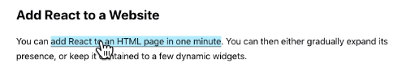
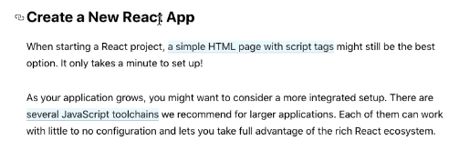
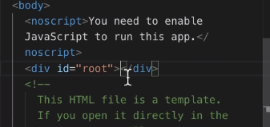
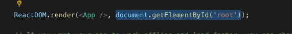
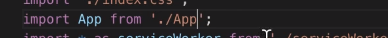
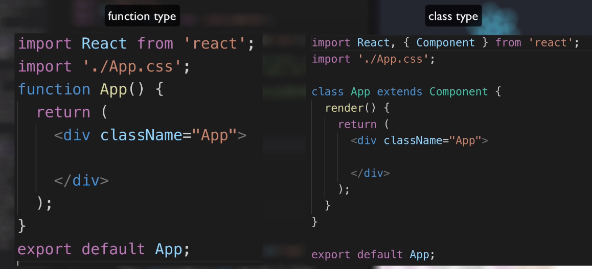

# React학습

- React : web. JavaScript 라이브러리
  - 라이브러리 : 다양한 콘텐츠를 한 데 모아놓은 가상 폴더

- React Native : Mobile Web
  - 모바일 기기에 최적화된 언어(모바일 앱을 만들 수 있다)
- 장점
  - 가독성 : 복잡한 html코드를 컴포넌트화 시키면 가독성이 증가
  - 재사용성 : 하나의 컴포넌트를 여러 페이지에 사용이 가능
  - 유지보수 : 컴포넌트 하나를 수정하면 해당 컴포넌트가 적용되어있는 페이지 전체가 수정 됨

## 전제 조건

- HTML 및 CSS에 대한 기본 지식
- JavaScript 및 프로그래밍에 대한 기본 지식
- DOM에 대한 기본 이해
- ES6 구문 및 기능에 대한 이해
- Node.js and npm installed globally

---

## 개발환경 세팅

- node.js설치

  설치가 되었다면 cmd창에서 `npm -v`써볼 때 숫자나옵니다.

- create-react-app

  공식적으로는 npx를 사용하라고 하지만 일단 npm 을 사용해보겠습니다.

  `npm install -g create-react-app`

  npm이 프로그램을 설치하는 프로그램이라면 npx 는 create-react-app이라는 프로그램을 임시로 설치해서 딱 한번만 실행시키고 지우는 애라고 보면 될 것 같습니다.

- 버전확인

  `create-react-app -V`

- 실행

  `npm run start`

- 부분적으로 페이지에 React를 추가(초급 사용자에게는 조금 까다롭다)

  

- 새 React앱 만들기

  

  Toolchain 개발환경이 묶여져있는 것을 제공해주는 것

- npm : node.js 기술을 이용해서 만들어진 여러 앱들이 있는데 그러한 앱들을 명령어 환경에서 손쉽게 사용할 수 있도록 도와주는 도구

---

- public > index.html

  화면에 보이는 html파일

  

  id가 root인 태그 안쪽에 react에서 만든 모든 컴포넌트들이 들어가게 됩니다.

- root div안에 들어가는 컴포넌트는 src에서 만들게 됩니다.

- src > index.js

  엔트리, 진입 파일

  

  App : react를 통해서 만든 사용자 정의 태그 즉, 컴포넌트 입니다.

  그러면 이 App은 어떻게 사용하느냐?

  

  App.js를 가져와서 사용하는 것

  

- 배포

  `npm run build`

- 웹 서버를 한번 다운로드 받아서 실행시킬 때 build라는 디렉토리를 document root로 하겠다.

  `npx serve -s build`

- React Developer Tools