# 보충수업

## DFS(깊이우선탐색)

DFS와 길찾기

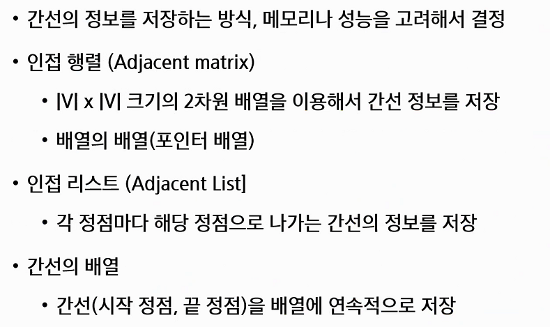

그래프 표현에는 3가지가 있는데 2가지를 배웠다. 인접행렬 / 인접 리스트

2가지는 각각의 장,단점이 존재한다. 그래프에서 활용하는 dfs를 보는중

### 인접행렬

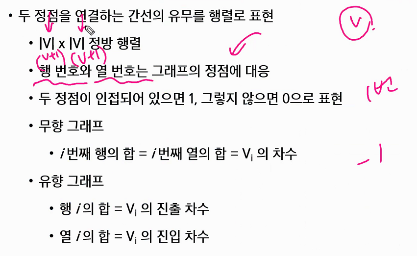

v+1 * v+1로 만드는 것을 추천

두 정점이 인접되어 있으면 1, 그렇지 않으면 0으로 표현

무향, 유향은 문제그림 또는 문제지문에서 파악합니다.

무향그래프의 경우는 대칭의 모습을 이루고있고, 유향그래프의 경우는 그렇지 않습니다.

정점이 무수히 많은데 간선이 한개밖에없다면 불필요한 정보가 너무 많이 저장됩니다. 

### 인접리스트

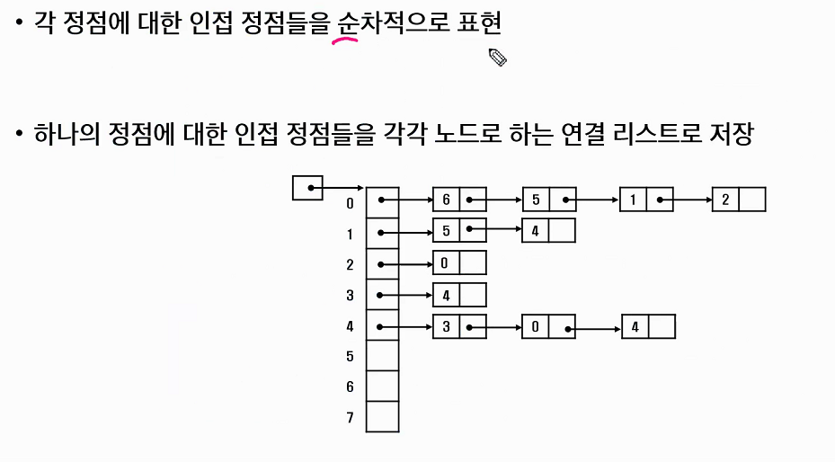

한쪽방향으로 쭉 연결되어있는 이 모습이 정석인 연결리스트의 모습. 돌아오는 것 없고 무조건 한방향으로만 쭉 가면서 탐색. 안나와도 쭉 간다.

a와 b가 연결되어있을때, 무향의 경우 `adj_list[a].append(b)`, `adj_list[b].append(a)` 둘다 해주어야만 합니다.

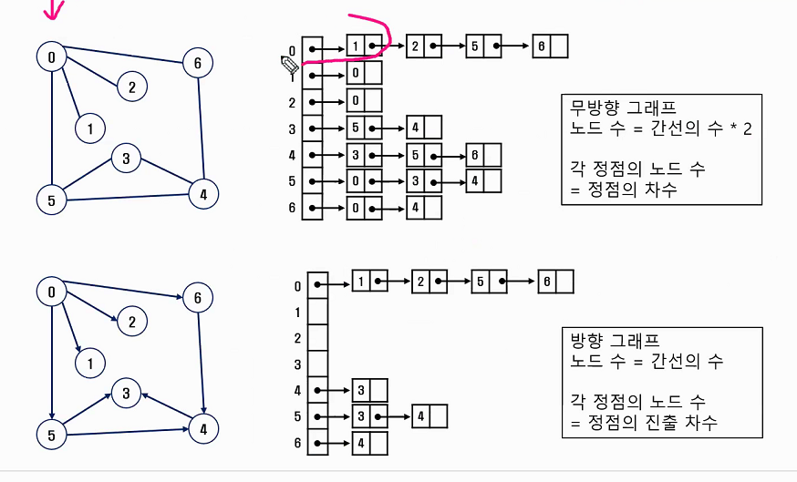

### 그래프 순회(탐색)

#### 깊이우선 탐색(DFS)

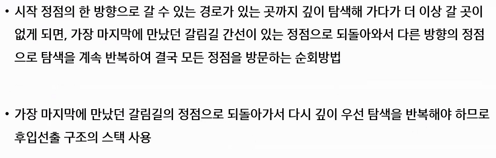

LIFO(후입선출)구조인 Stack을 사용하게된다. 재귀를 이용하면 조금 더 편리

한번씩만 방문하기 위한 visited리스트

이제는 슈도코드를 보면서 내가 사용하는 언어로 바꾸는 능력을 길러야합니다.

실무적으로는 문제가 될 수 있지만, 알고리즘을 풀면서 재귀를 잘 활용할 줄 알아야합니다. 이제는 재귀와 친해져야만 합니다.

### 예시

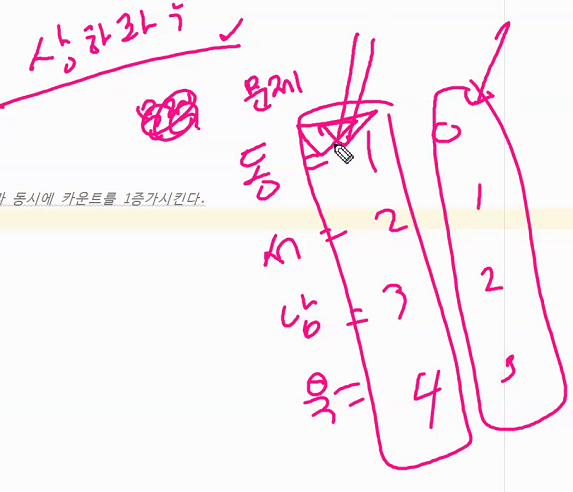

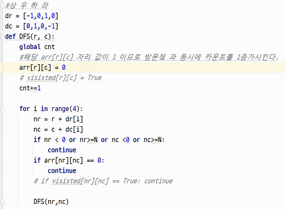

## SWEA_1219_길찾기 review

- 인접행렬 사용

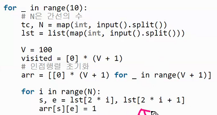

- 길찾기

  

- 다른방법

  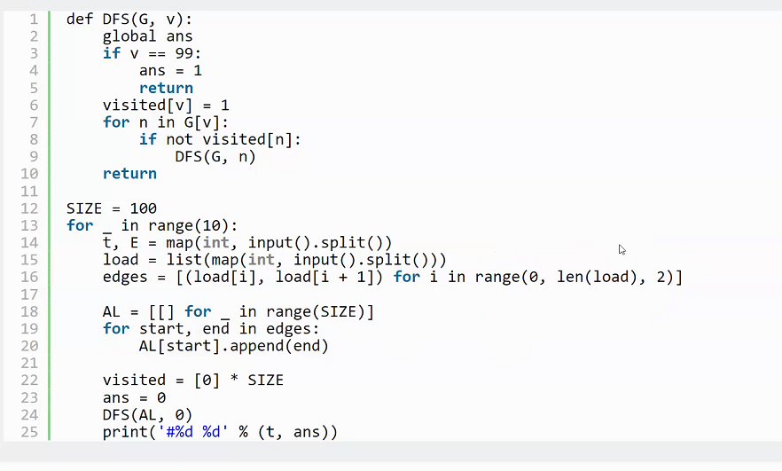

- 다른방법2

  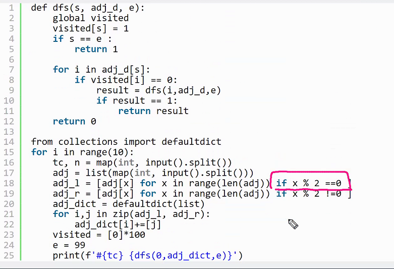

- dfs스택을 활용한 풀이

  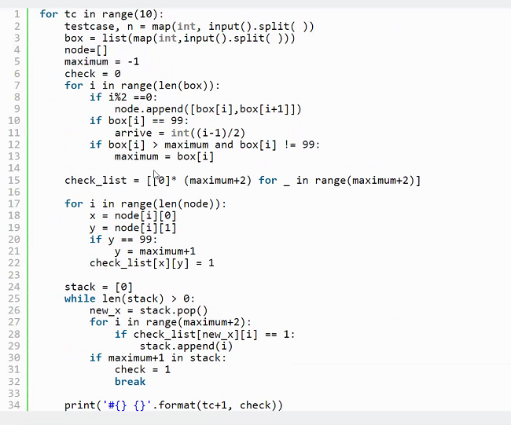

## BFS(너비우선탐색)

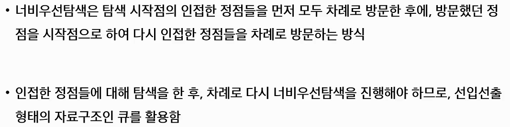

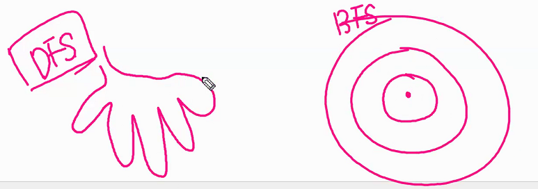

Q에 넣기전에 방문체크를 하고 넣는 것이 더 유리하다.

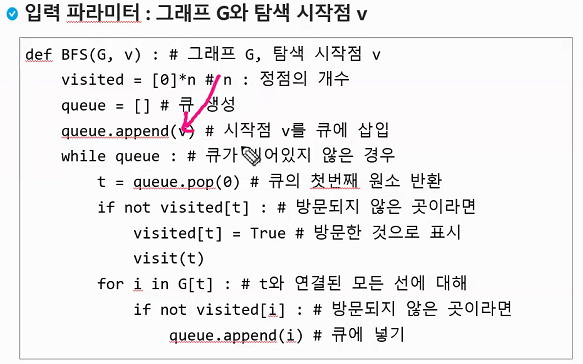

기본파트에서는 큐에 넣은걸 꺼내면서 방문쳌

응용파트에서는 큐에 넣으면서 방문쳌

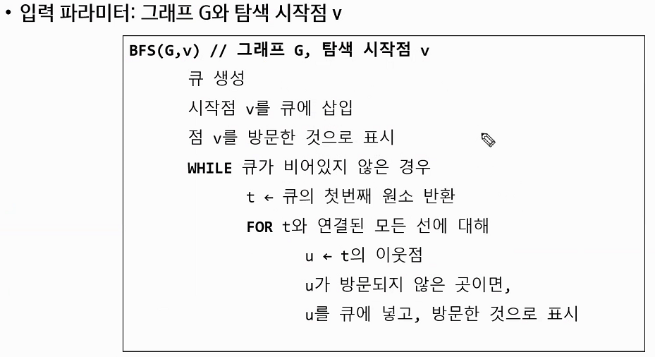

- Q사용법

  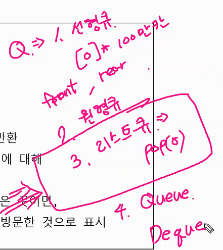

  deque와 선형큐가 빠른편

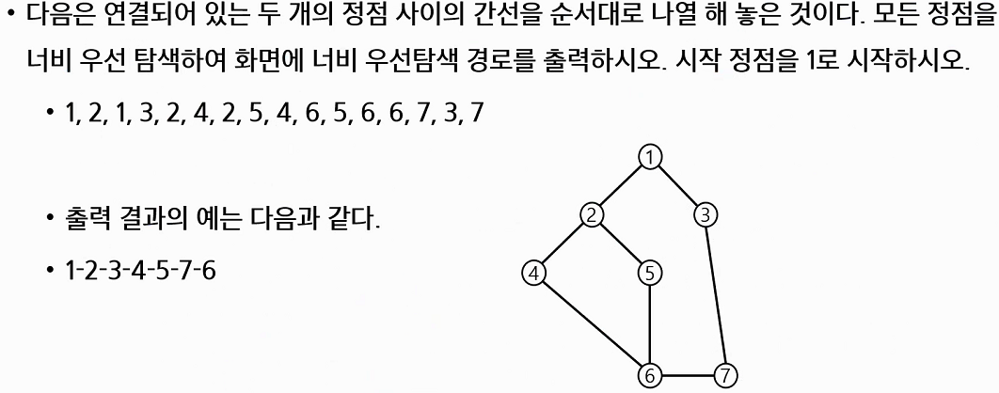

- 예시

  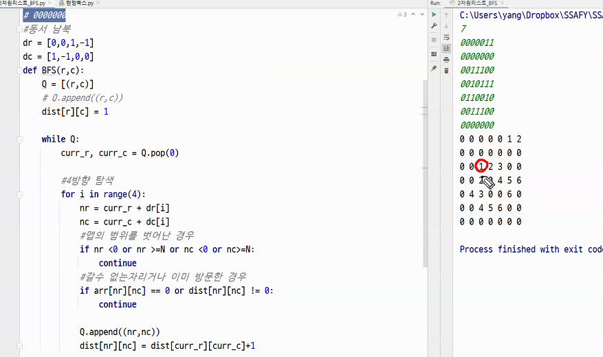

  qsize의 활용

  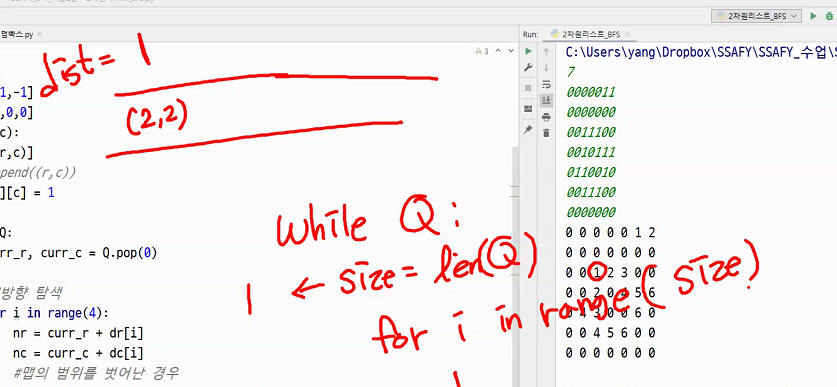

  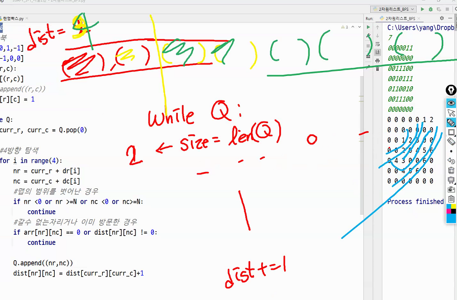

  언어 자료형에 따라서 자료형 크기가 다르다. 

  

