# start

- 일정 수준이 되지않으면 쓸모없는 프로그래밍이 될 수 있기 때문에 일정 수준까지 올라올 필요가 있다.
- 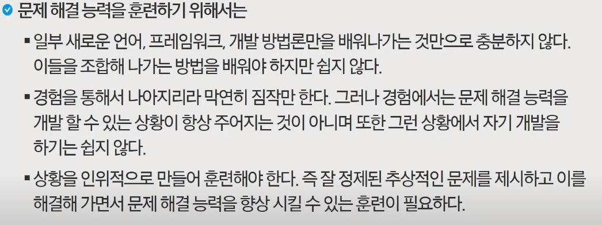
- 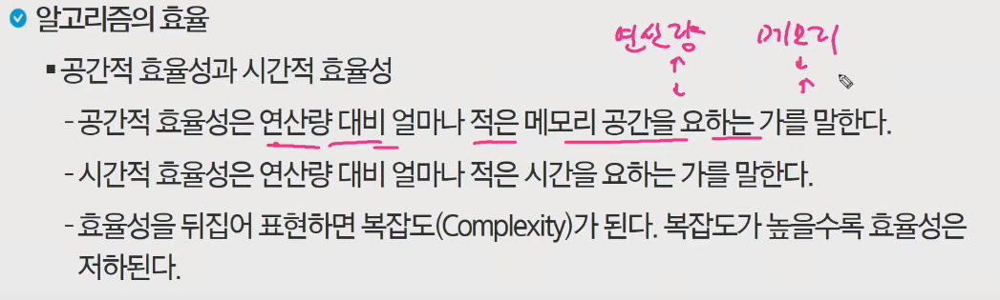

- 빅오, 빅오메가, 빅쎄타(빅오, 빅오메가 표기가 같은 경우)

- 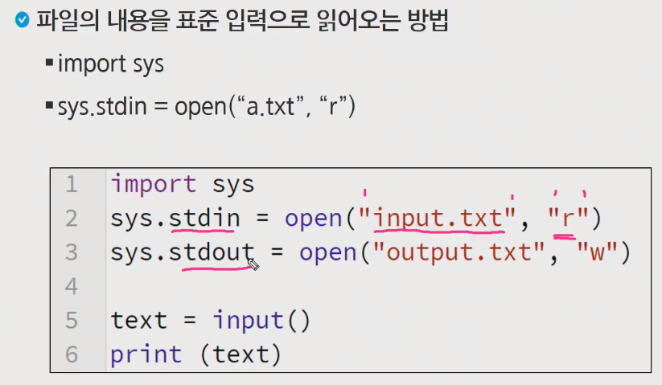

- 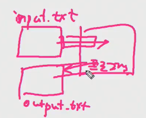

  ```python
  import sys
  sys.stdin = open("input.txt", "r")
  sys.stdout = open("output.txt", "w")
  
  text = input()
  print(text)
  ```

- 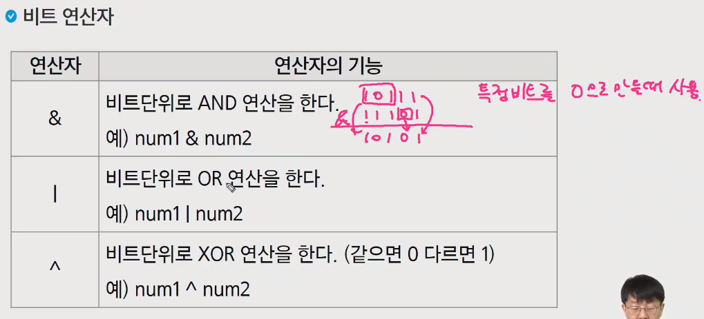

  - `&` : 특정 비트를 0으로 만들 때 사용
  - `|` : 특정 비트를 1로 만들 때 사용
  - `^` : 비트 반전, 검사에 사용

- 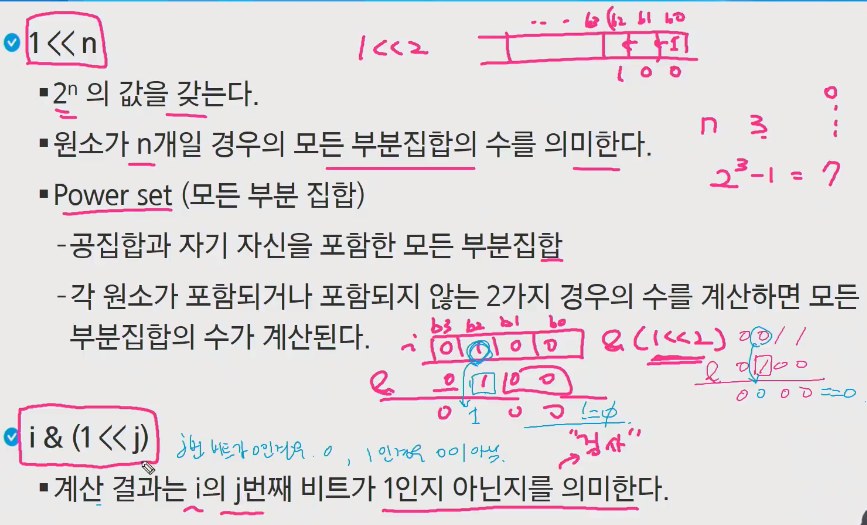

- 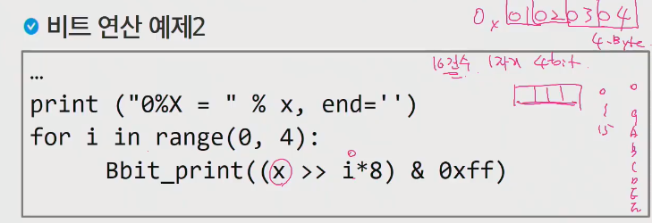

- 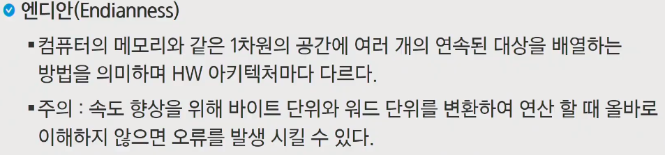

- 메모리 주소는 한 바이트마다 저장이 된다.

- 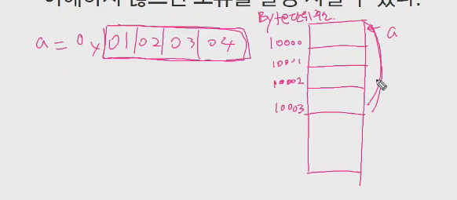

- 4개의 비트를 a가 사용하는 건데

- 

- 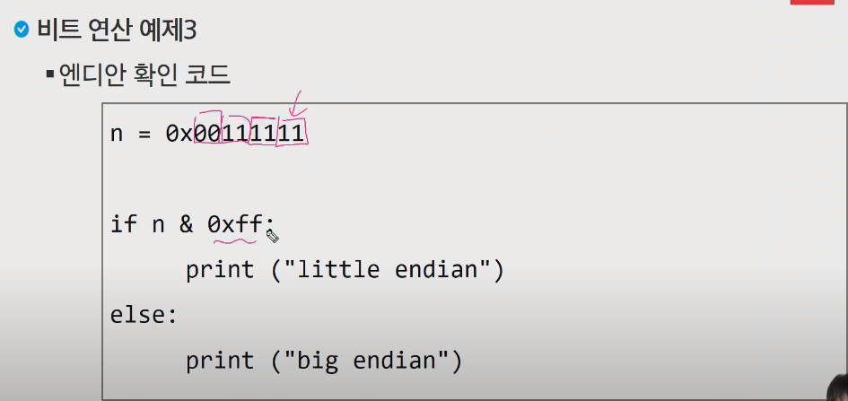

  낮은 자리 검사했을때, 

  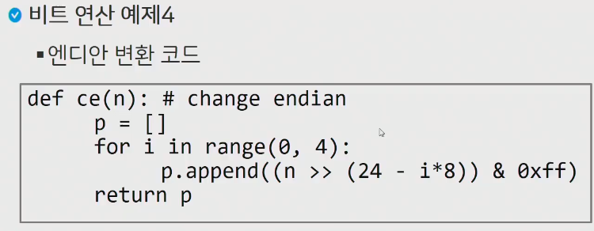

  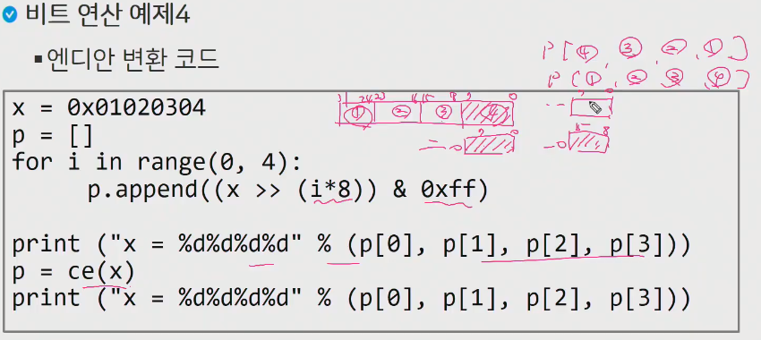

  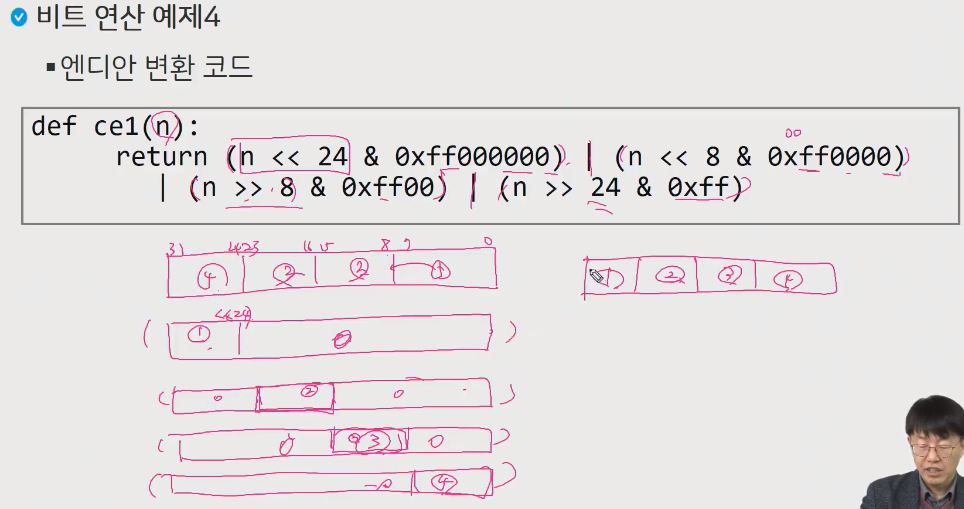

- 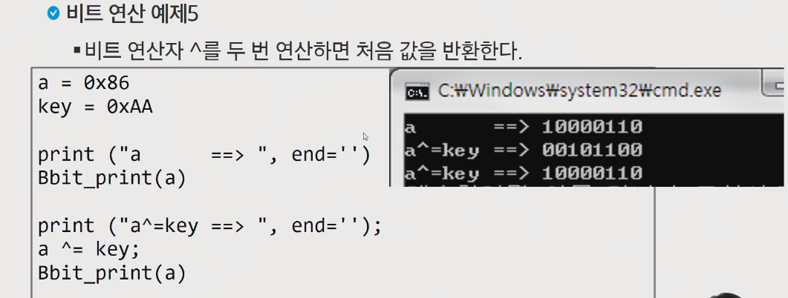

- 

- 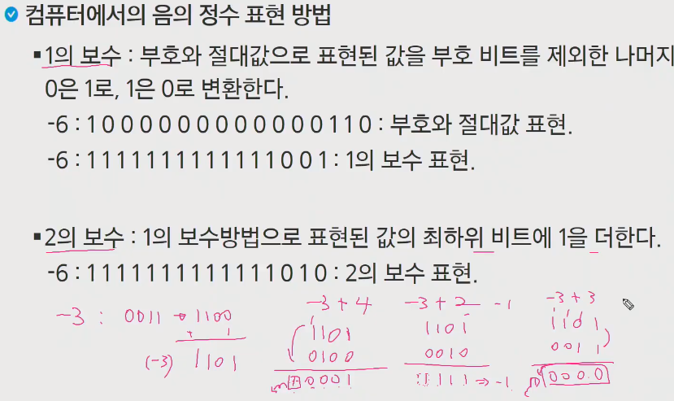

  1111 의 경우 다 뒤집고 나서 1을 더하고 -를 붙이면 -1이 된다.

- 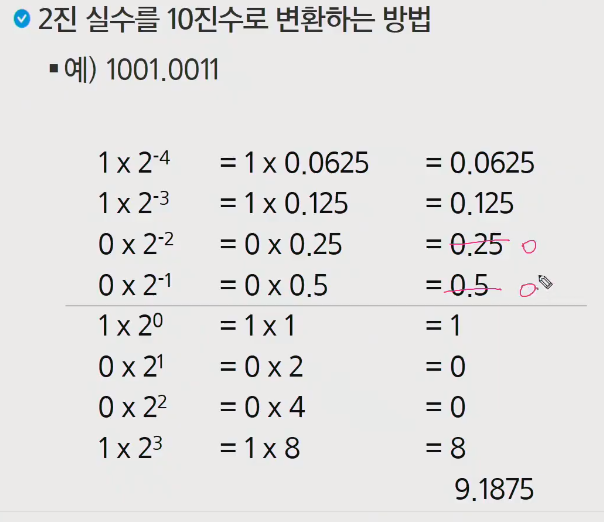
- 


## 웹엑스 시간

- 문제 해결 과정

  

  ​	처음 접근 할때 이해하고 잘 기획하는 것이 중요

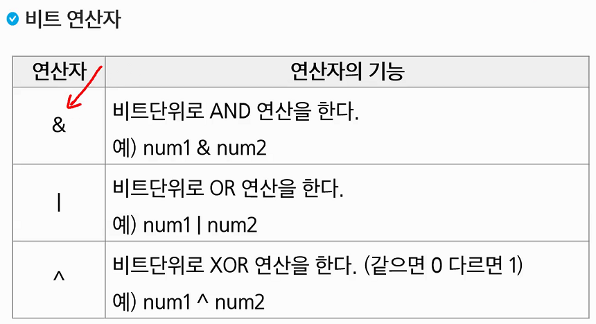

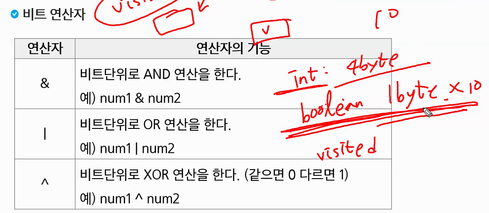

```python
print(27&6)  # 2
```


`<<`  : 배수

`>>` : 나누기


`>>>` : 오른쪽으로 옮겨도 1이 유지되는


- 2의 보수법

  컴퓨터 음수를 표현하는데 2의 보수법 방식을 사용

  맨 앞에있는 비트를 부호비트로 사용

- 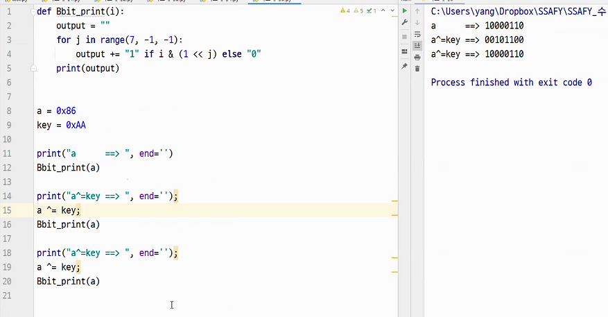

### 연습문제 1

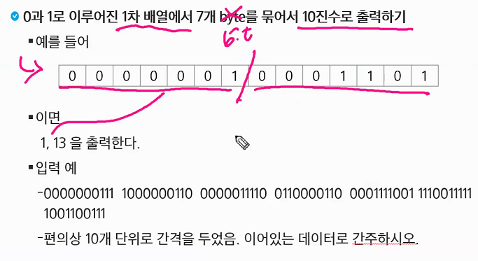


### 연습문제2

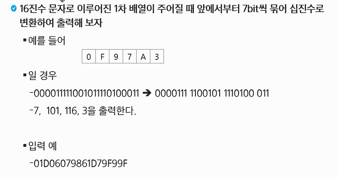

0F97A3 => 2진법 => 7자리씩 묶어서 출력

A : 1010, B : 1011 이렇게 정의해도되고, 정의하지 않아도 되고. 여러가지 방법으로 시도해 보시길

### 연습문제3

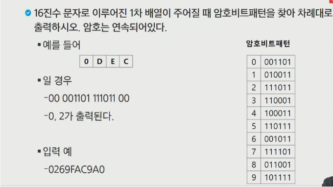

### Reviews

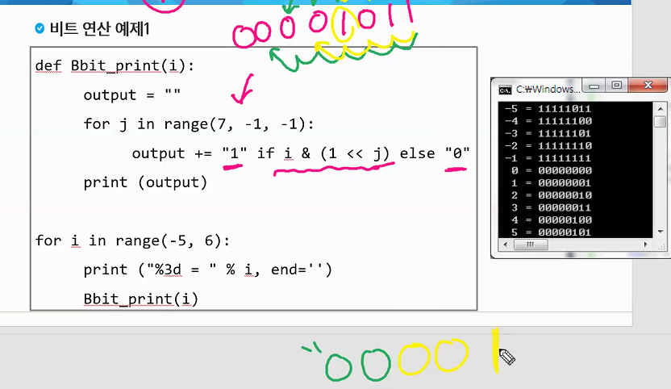

일반적으로 32자리의 비트를 가지고 수를 표현을 합니다. 근데 우리는 8자리만 떼와서 보는 것

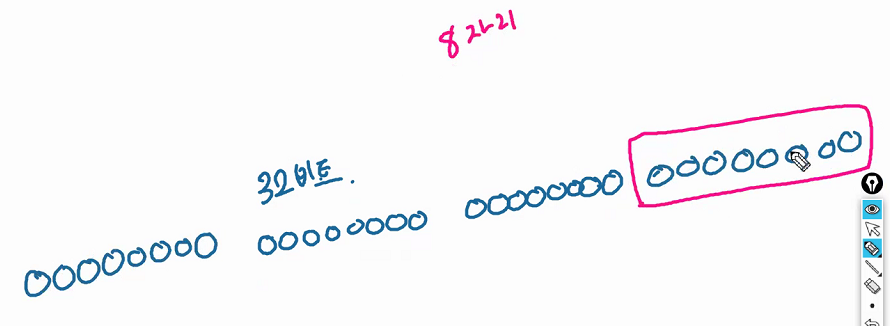

이렇게 다 표현하면 더러우니까 16진수로 8자리로 표현하게 됩니다.


- 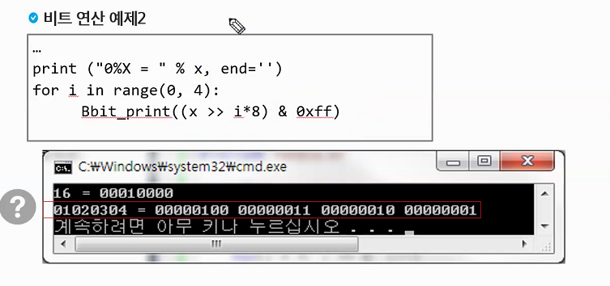

16진수로 2칸씩이니까 각각 8칸씩이다.

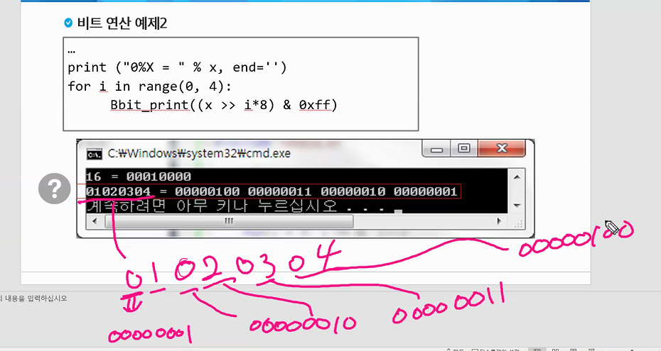

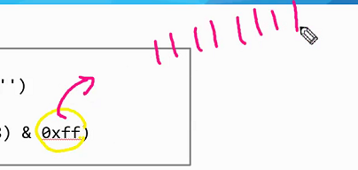

- 엔디안은 지금 중요한 것은 아니지만 한번 찾아보시길
  - 엔디안에대해서 공부를 해오고 내일 같이 공부해봅시다
- 음수표현방법

## 210413

### 오늘할꺼

- programming advanced

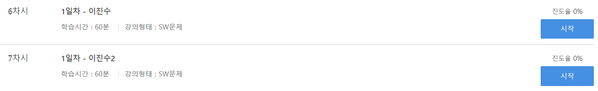

- 과제(단순 2진 암호코드)


### 연습문제1

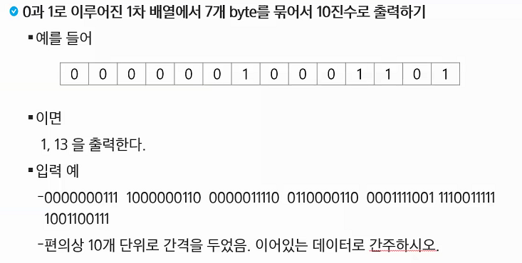

### 연습문제2

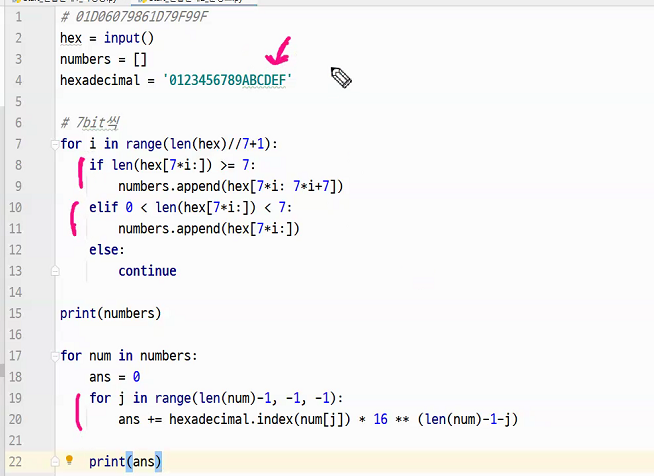