#   tree🌴

박영준 교수님

## 1. 개요

### 1.1. 목차

- 트리
- 이진 트리
- 이진탐색 트리
- 힙

---

### 1.2. 개념

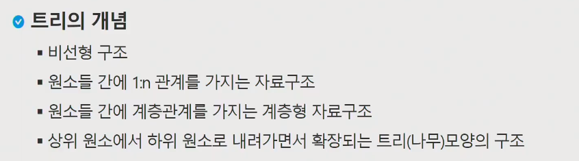


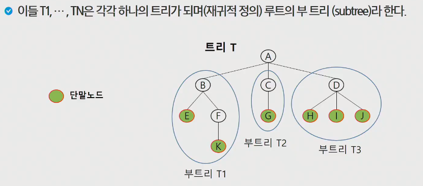

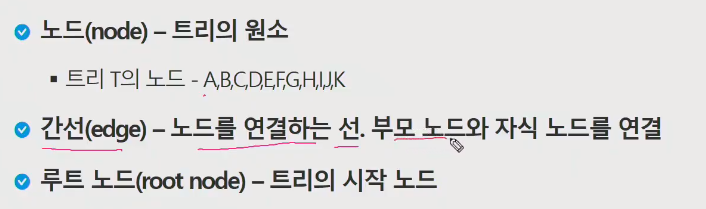

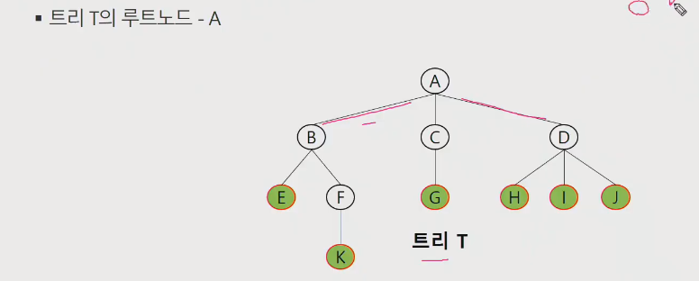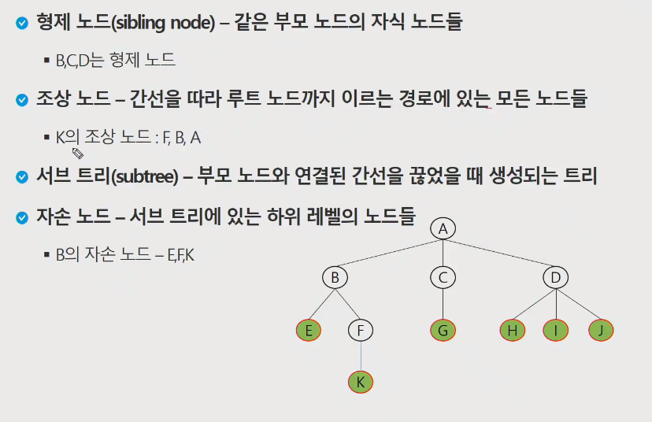

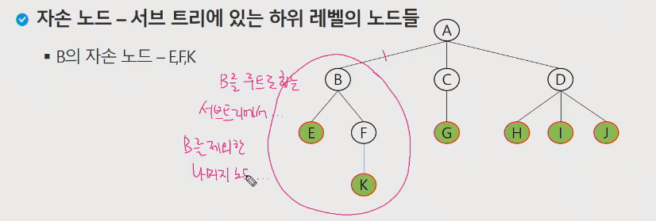

- 차수

  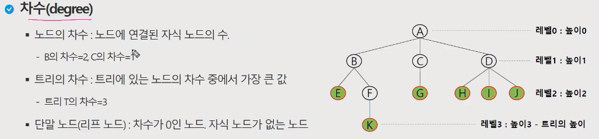

  - 노드의 차수 : 노드에 연결된 자식 노드의 수
  - 트리의 차수 : 트리에 있는 노드의 차수 중에서 가장 큰 값
  - 단말 노드 : 차수가 0인 노드

- 높이

  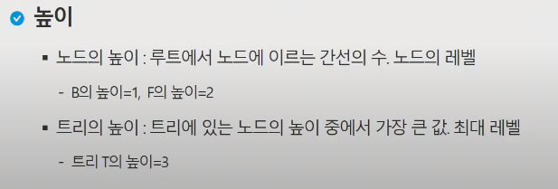

  - 노드의 높이 : 루트에서 노드에 이르는 간선의 수, 노드의 레벨
    - B의 높이  = 1, F의 높이 = 2
  - 트리의 높이 : 트리에 있는 노드의 높이 중에서 가장 큰 값. 최대 레벨

**Q : 차수랑 높이가 다른건가요? 똑같은 느낌인데**

---

## 2. 이진트리

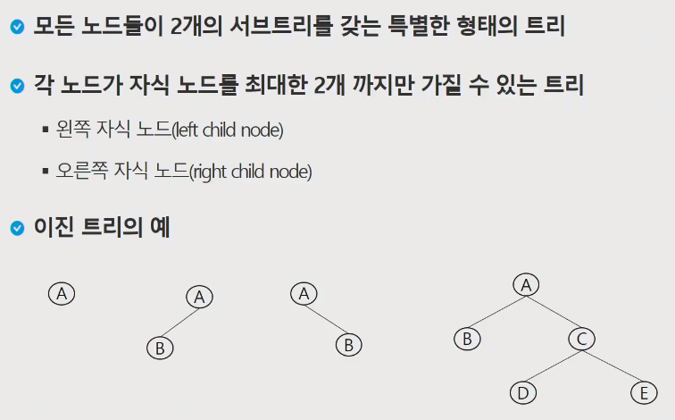

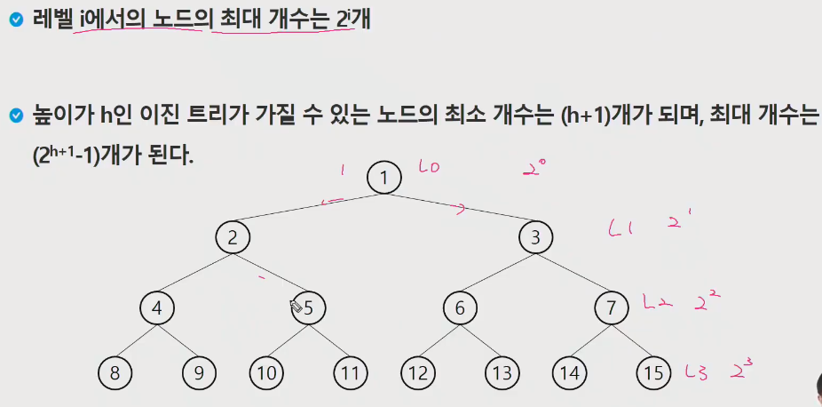

2진수로 생각하는게 좀 더 쉽습니다. h = 3 일때 -> 2^0 + 2^1 + 2^2 + 2^3 --> 1111 = 10000 - 1

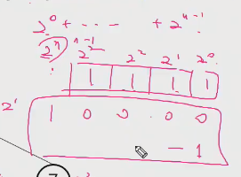

- 포화 이진 트리

  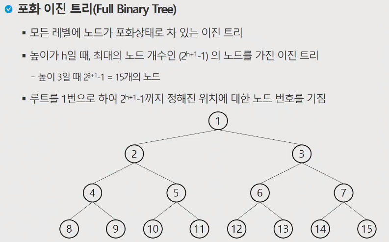

  - 모든 레벨에 노드가 포화상태로 차 있는 이진 트리(꽉 차있는 경우)
  - 따로 구분하는 이유는 이진트리중에서 노드번호를 붙이는, 항상 2개의 자식을 가지는 경우를 따로 취급하기 위해서

- 완전 이진 트리

  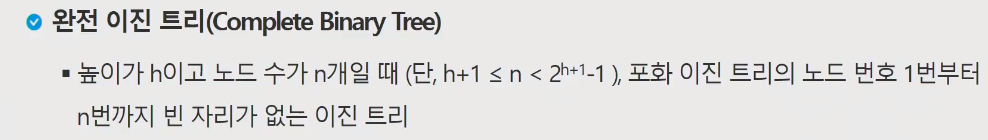

  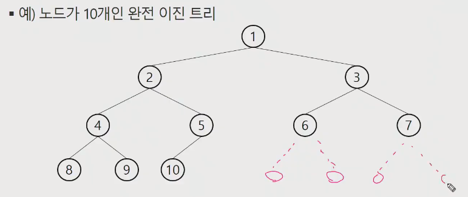

  - 꽉 차있을수도있고 아니기도 하지만, 중간에 빈자리가 없어야만 합니다.(예를들어 이경우 9번이 없으면 완전 이진트리가 아닙니다)

- 편향 이진 트리

  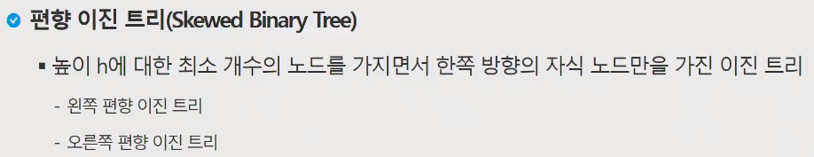

  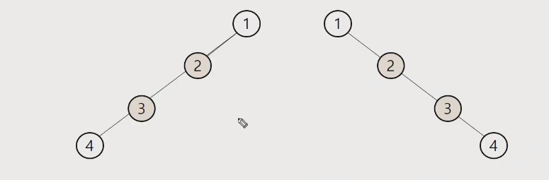

  - 높이 h에 대한 최소 개수의 노드를 가지면서 한쪽 방향의 자식 노드만을 가진 이진 트리
    - 왼쪽 편향 이진 트리
    - 오른쪽 편향 이진 트리
  - 비선형자료구조의 장점을 잃어버린 선형자료구조와 마찬가지

### 2.1. 이진트리 순회(traversal)

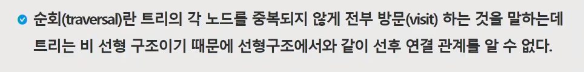

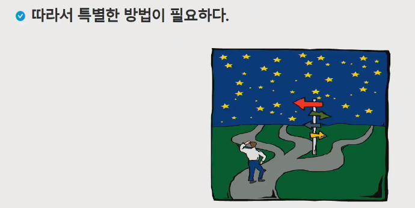

- 3가지 순회방법 : 용도, 상황에 맞게 활용하면 됩니다.

  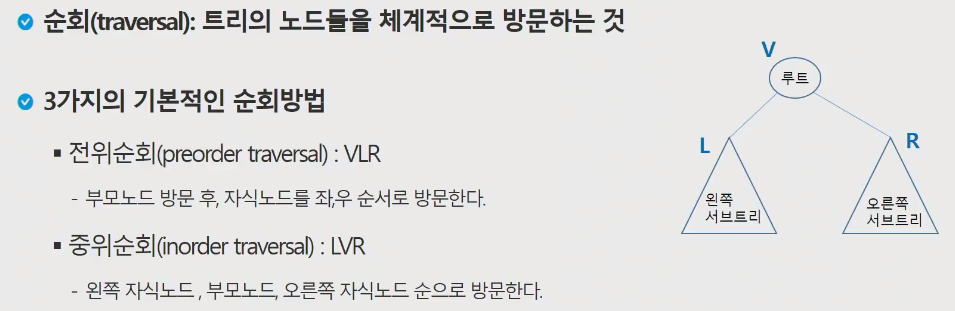

  

  - 전위순회 : 부모노드 방문 후, 자식노드를 좌, 우 순서로 방문
  - 중위순회 : (부모노드 접근은하지만) 왼쪽 자식노드, 부모노드, 오른쪽 자식노드 순으로 방문
  - 후위순회 : 자식노드를 좌우 순서로 방문한 후, 부모노드로 방문

  하나의 상황에서 전위, 중위순회 둘 다 사용되기도 합니다.(섞어서 사용되는 경우도 존재합니다.)
  
  이거 진짜 쉽게 설명하는 방법을 고안해 냈습니다  
  
  1. 전위 => 노드에 도착하자 마자 찍는다
  2. 중위 => 왼쪽으로 내려보낸 친구가 나한테 '돌아올'때 찍는다
  3. 후위 -> 양옆으로 내려보낸 친구가 둘다 나한테  '돌아올때' 찍는다

#### 2.1.1. 전위순회(preorder traversal)

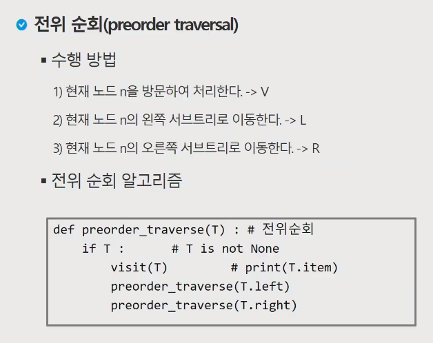

- 현재 노드를 방문하여 처리 -> 왼쪽 서브트리로 이동 -> 오른쪽 서브트리로 이동

- 유효한 노드 ?  존재여부에 통과한 노드

  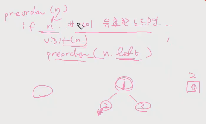

- 전위순회 예

  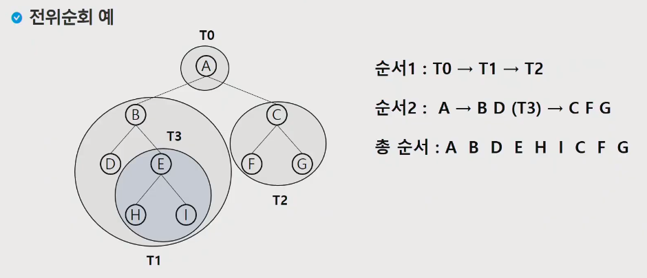

  굳이 root부터 시작할 필요는 없습니다. 원하는 노드에서 시작하면 됨

  dfs와 같은경우지만 트리를 따로 사용하는 경우가 있습니다.

#### 2.1.2. 중위순회(inorder traversal)

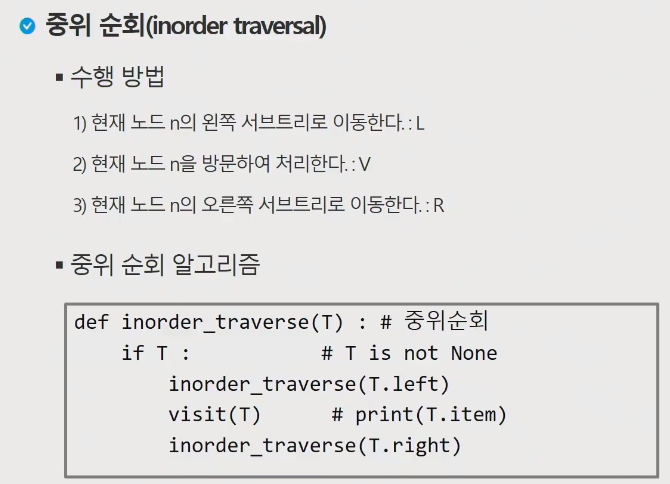

왼쪽 -> 현재노드 -> 오른쪽

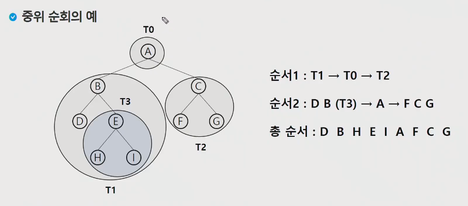

진입하면 일단 왼쪽으로 쭉 간다.

#### 2.1.3. 후위순회(postorder traversal)


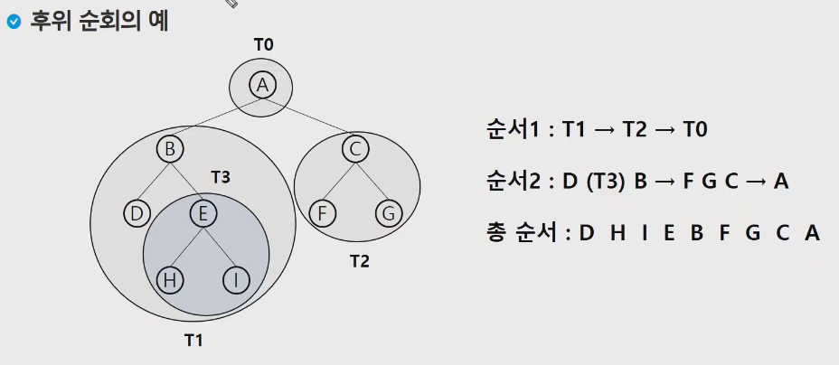

마찬가지로 왼쪽으로 쭉 가다가 오른쪽 

D 가고 B처리하기 전에 오른쪽(T3)로 가서 H I B 그리고 A처리하기 전에 다시 왼쪽으로 쭉 가서 F G C A

후위 순위의 경우 root가 마지막으로 처리가 됩니다.

---

#### 2.1.4. 연습문제

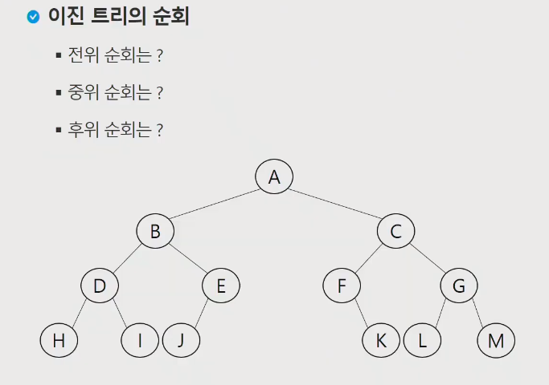

- 전위순회 : A  B  D  H  I  E  J  C  F  K  G  L  M

  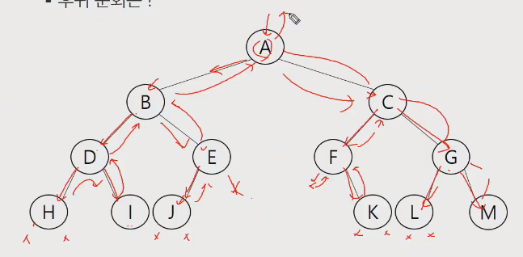

- 중위순회 : H  D  I  B  J  E  A  F  K  C  L  G  M

  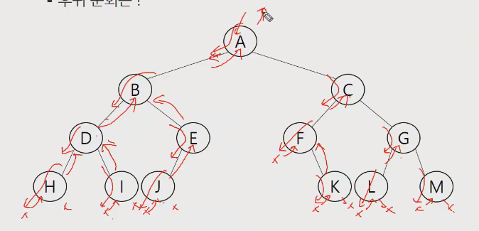

- 후위순회 : H  I  D  J  E  B  K  F  L  M  G  C  A

  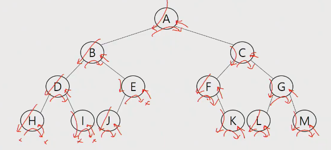

### 2.2. 이진트리의 표현

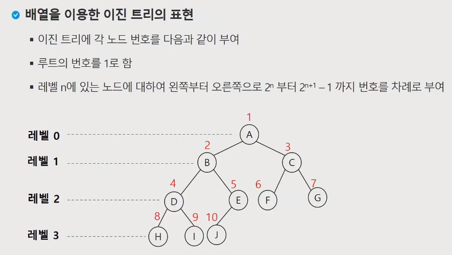

- 노드 번호의 성질

  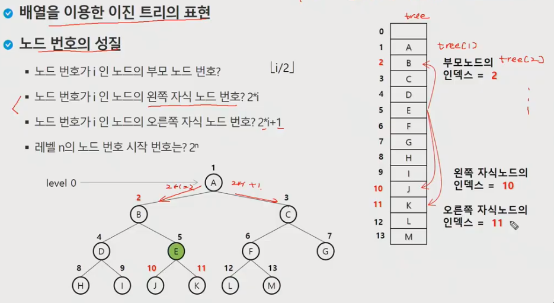

  - 노드 번호를 배열의 인덱스로 활용. 포화이진트리에서 0번은 사용하지 않는다.

  - 노드 번호가 i인 노드의 부모 노드 번호 : i/2(내림)  이것을 floor연산이라 함

    - 첫번째는 -1.5가 나오면 소수점 밑의 수를 다 버리게 되고 두번째는 floor연산과 같이 -1.5보다 작은 정수값이 나오게 됩니다.
    - 알고리즘 문제에서 음수 나누기 할 때는 int(-3/2) 로 해야합니다. 왜냐면, 파이썬으로만 문제를 푸는게 아니라서. 다른 언어와 동일한 계산결과를 얻기 위해서..int()를 사용해서 소수점 이하를 버려야 합니다.

    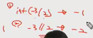

  - 노드 번호가 i인 노드의 왼쪽 자식 노드 번호 : 2*i

  - 노드 번호가 i인 노드의 오른쪽 자식 노드 번호 : 2*i+1

  - 레벨 n의 노드 번호 시작 번호 : 2^n

- 배열을 이용한 이진 트리표현

  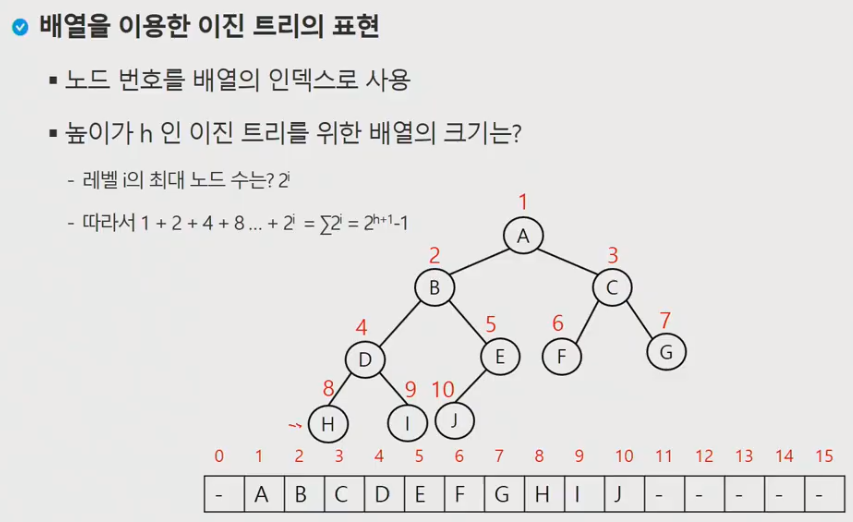

  편향 이진트리의 경우 빈공간이 너무많이 생겨난다.

  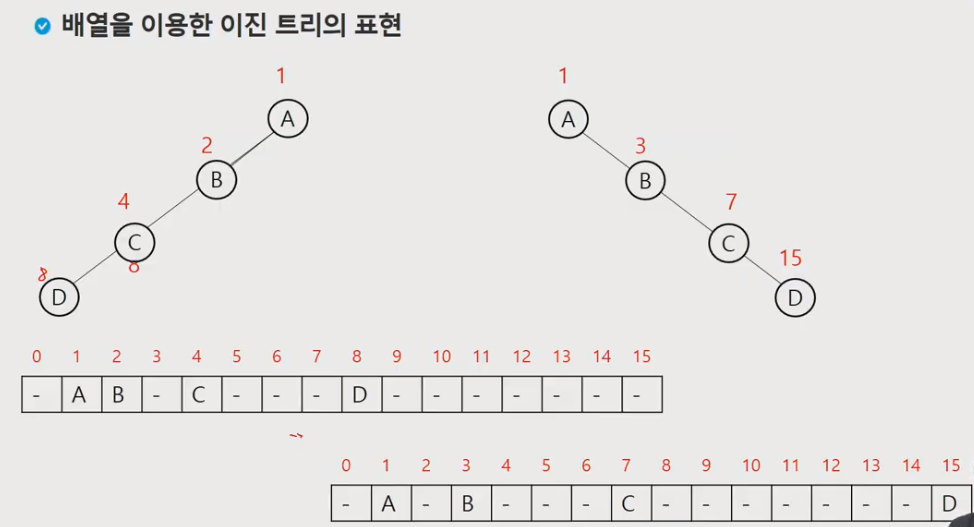

  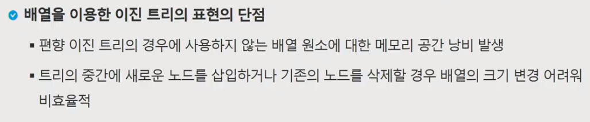

  단순히 읽어와서 쓰는 것을 가능하나 전체 연결자체를 바꿀경우 이 방법은 조금 어렵다.

- 연결리스트

  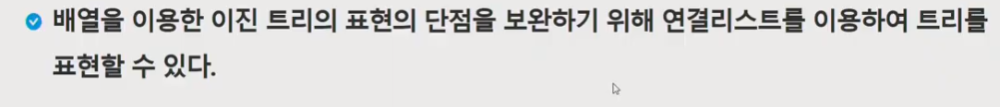

  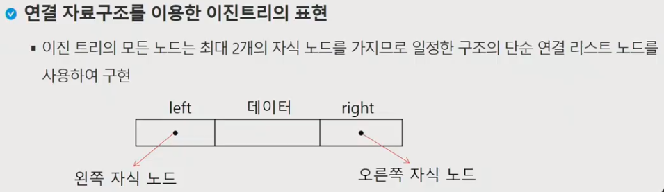

  왼쪽, 오른쪽 노드에대한 주소 2개를 가지고 있어야만 한다.

  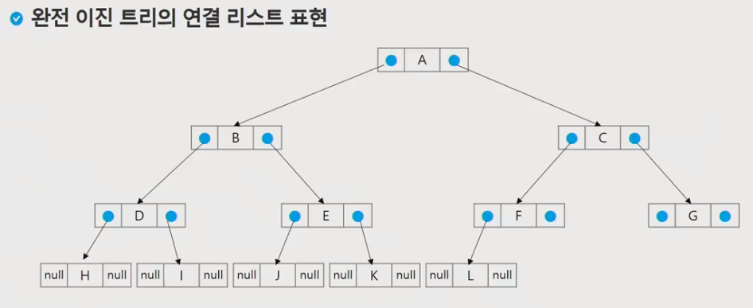

  - 리프노드는 더이상 주소가 필요없기 때문에 null로 표현

#### 연습문제

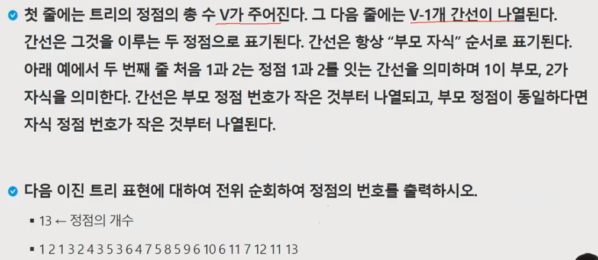

V = 간선수 + 1

- 정점의 개수 13개라는 말은 간선 + 1개 = 13이라는 의미

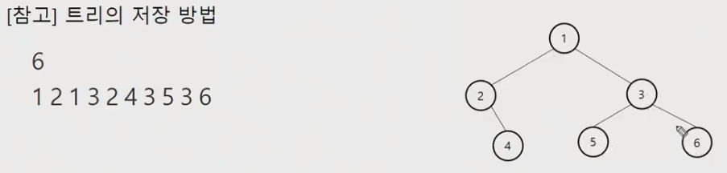

- 완전, 포화이진트리 아니고, 특별한 규칙이 없다. 보통의 트리는 위와 같이 주어진다.

- 1~6까지 노드가 존재한다.

- 5개 간선이 존재한다.

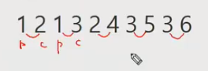

- root는 아무 번호나 가능하다(1번이 반드시 root는 아니다.)

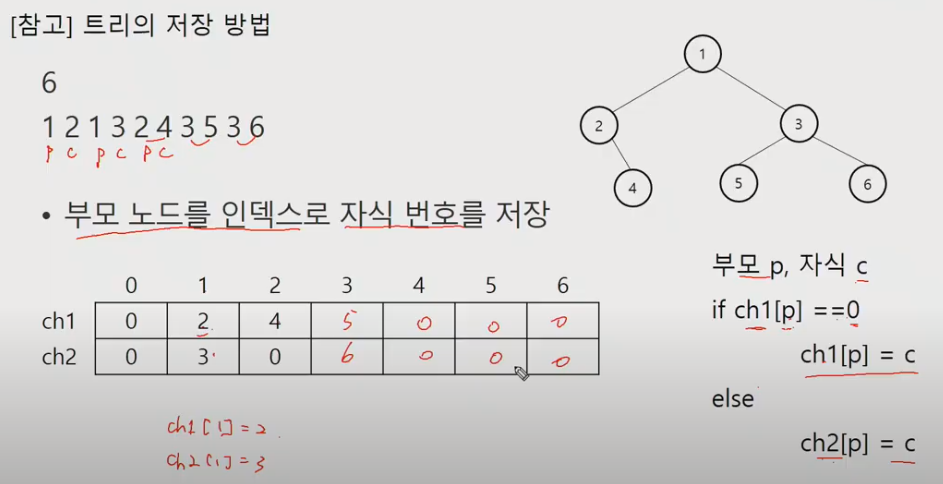

순회는 굳이 root부터 할 필요없습니다. 탐색을 시작한 노드가 root가 됩니다. 나만 그래프 탐색과 다른점은 원래 시작점으로 돌아올 경우 상위트리로 올라가는 것이 아니라 탐색이 종료됩니다.

- 주의점

  포화이진트리 특징 가지고있느냐 아니냐

  부모와 자식에대한 예를 들면서 부모가 번호가 더 작은경우가 많은데, 더 클 수 도있다.

  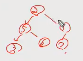

- 자식 노드를 인덱스로 부모 번호를 저장

  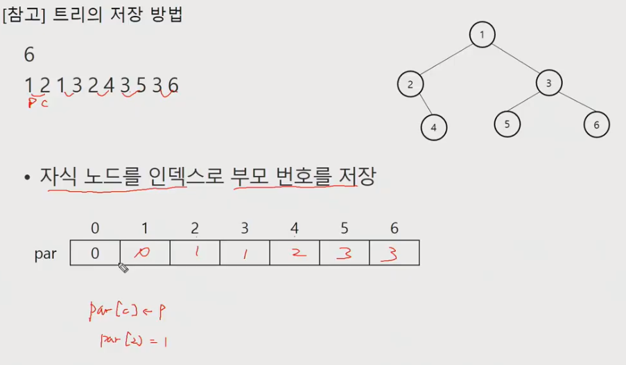

- 활용

  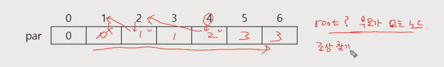

  - 부모가 없는 노드

  - 조상 찾기

- 3번부터 순회를 할경우(전위순회)

  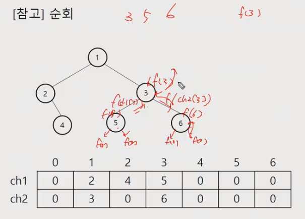

  3의 자손의 개수는 2개

#### 연습문제

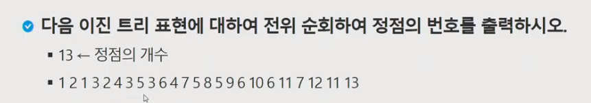

---

### 2.3. 수식트리

- 수식을 표현하는 이진트리

- 수식 이진 트리라고 부르기도 함

- 연산자(operator)는 루트 노드이거나 가지 노드

- 피연산자(operand)는 모두 잎 노드

  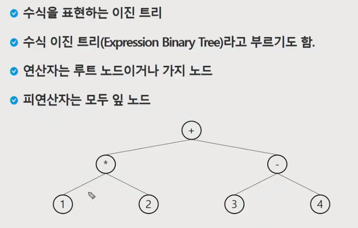

- 중위 순회 : A / B * C * D + E

- 후위 순회 : A B / C * D * E +

- 전위 순회 : + * * / A B C D E

  

---

## 3. 이진 탐색 트리

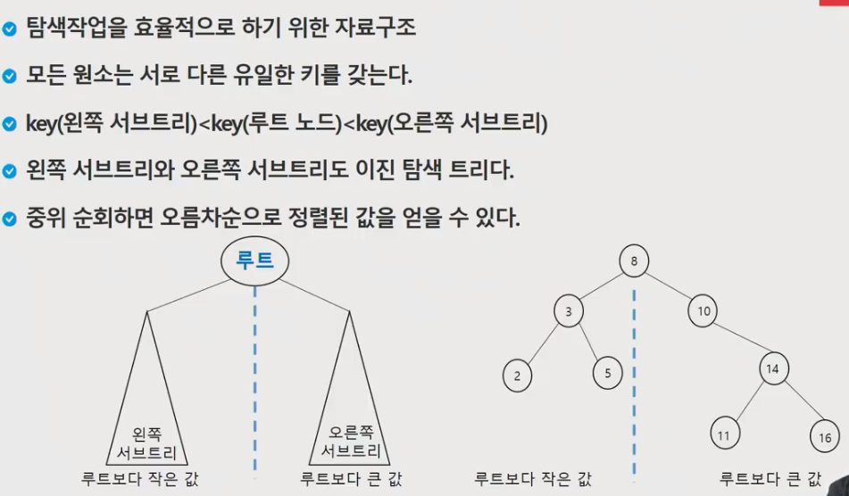

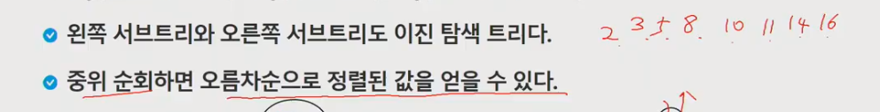

빠른속도로 추가 삭제가 가능

- 탐색연산

  

  

  탐색깊이, 횟수를 줄일 수 있다.

- 삽입연산

  

  

- 성능

  

- 검색 알고리즘의 비교

  

- 삭제연산

  

  해당 노드의 자식이 있다면 연결을 끊고 그 자식과 연결

  양쪽에 자식이 있으면?? 그 자리에 있어야하는 애들 찾아서 삽입해줘야함. 9의 경우 9보다 가장가까운애(오른쪽으로가서 가장 가까운 애 왼쪽자식이 없는 최초의 애 이 경우 15)

  고려할 상황이 많아진다.(이거 하고싶으면 연결리스트부터 시작해서 올라와야됨)

---

## 4. 힙(heap)


부모자식간의 관계가 최대힙의 경우 부모가 자식보다 크면되고, 최소힙의 경우 부모가 자식보다 작으면 됩니다.


- 완전이진트리 x
- 대소비교하면 크고작은게 뒤죽박죽

### 힙 연산 - 삽입

- 힙의 동작


노드추가해서 완전이진트리를 만들려면

마지막 노드 확장, 거기에 숫자를 삽입.

최대힙 조건은 부모 > 자식이므로 방금 전 삽입한 녀석과 부모 대소비교해서 옳으면 삽입완료, 그렇지 않으면 자리 change


### 힙 연산 - 삭제


- 힙을 이용하여 우선순위 큐 구현 가능

### 연습문제


```python
def preorder(n):
    if n>0:
        print(n, end=' ')
		preorder(left[n])
        preorder(right[n])

# 1번부터V까지 노드
V, E = map(int, input().split())
edge = list(map(int, input().split()))

left = [0]*(V+1) # 부모를 인덱스로 왼쪽 자식번호 저장
right = [0]*(V+1) # 부모를 인덱스로 오른쪽 자식번호 저장

pa = [0]*(V+1)  # 자식을 인덱스로 부모번호 저장

for i in range(E):
    n1, n2 = edge[i*2], edge[i*2+1] # n1부모 n2 자식노드
    if left[n1] == 0:  # 왼쪽자식이 없으면
        left[n1] = n2  # 부모를 인덱스로 자식번호 저장
    else:  # 왼쪽 자식있으면
        right[n1] = n2  # 부모를 인덱스로 자식번호 저장
        
        pa[n2] = n1 # 자식을 인덱스로 부모를 저장
        
root = 0
for i in range(1, V+1):
    if pa[i] == 0:
        root = i
        break
        
preorder(4)
```


포화이진트리, 완전이지트리 번호, 저장방식

## 웹엑스시간

### 용어정리

- 트리는 비선형 구조
- 원소들 간에 1:N관계를 가지는 자료구조
- 뒤집어진 나무모양


- 다대다 n:m => 그래프. 결국 트리도 그래프의 일종

- 큐, 스택과 같은 자료구조중 하나

- 노드 : DATA, 정보, 어떻게 연결되어있는지에 대한 주소

  

  - 데이터엔 무수히 많은 테이터가 들어가 있고

- 노드하나를 새롭게 루트로 정해서 서브트리로 볼 수 있다.

  

- 간선 : 노드를 연결하는 선
- 형제노드 : 같은 부모 노드의 자식 노드들
- 서브트리(subtree) : 부모 노드와 연결된 간선을 끊었을 때 생성되는 트리
- 단말/리프/잎 노드 : 자식이 하나도 없는 노드들
- 차수(degree) : 노드에서 퍼져나간 자식의 수, 그중에서 가장 큰값이 트리의 차수
- 높이=레벨

### 이진트리

- 모든 노드들이 **'최대 2개'**의 서브트리를 갖는 특별한 형태의 트리

- 레벨 i 에서의 노드 최대 개수는 2^i개

- 높의가 h인 이진 트리가 가질 수 있는 노드 개수는 h+1개, 최대개수는 2^h+1-1

- 포화이진트리(Full Binary Tree)

  

  - 모든 레벨에 노드가 포화상태로 차 있는 이진 트리
  - 높이가 h일 때, 최대의 노드 개수인(2^h+1-1)의 노드를 가진 이진 트리
  - 루트를 1번으로하여 2^h+1-1까지 정해진 위치에 대한 노드 번호를 가짐

  - 왜 1번부터 시작?? 배열에 저장할 때 계산편리를 위해서

    

    왼쪽자식은 *2, 오른쪽자식은 *2+1을 하면 구할 수 가있다.

    자식이 부모를 구할때는 반대로 하면 되기때문에 계산이 편리해진다.

- 완전 이진트리(Complete Binary Tree)

  

  - 높이가 h이고 노드 수가 n개일 때(단 h+1 <= n < 2^h+1-1), 포화 이진 트리의 노드 번호 1번부터 n번까지 빈 자리가 없는 이진 트리

- 편향 이진트리(Skewed Binary Tree)
  
  - 높이 h에 대한 최소 개수의 노드를 가지는 이진 트리

### 순회

각 노드를 중복되지 않게 전부 방문하는 것.


V는 방문한자리(Visited)

- 전위(VLR) 순회(preorder traversal)

  현재노드 -> 왼쪽 서브트리 -> 오른쪽 서브트리

  

  전위순회 예

  

  A - B - D - E - H - I - C - F - G

- 중위(LVR) 순회(inorder traversal)

  현재 노드의 왼쪽 서브트리 -> 현재 노드 방문 -> 현재 노드의 오른쪽 서브트리

  

  중위 순회의 예

  

  D - B - H - E - I - A - F - C - G

- 후위(LRV) 순회

  왼쪽 ->  오른쪽 -> 현재노드

  

### 이진트리의 표현

- 배열을 이용한 이진 트리의 표현

  

  - 이진 트리에 각 노드 번호를 위와 같이 부여합니다

- 

  - 내림표시

  

- 배열로 저장하면 단점이 하나 있습니다

  

  편향 이진트리의 경우 배열로 저장시 빈 공간을 만들어놔야한다는 단점

  

  보통 노드의 수가 엄청많을경우에는 배열로 표현할 수가 없기때문에 다른 표현방식을 사용

  

---

연결리스트를 이용한 트리표현은 연결리스트 안배웠으니까 패스함

### 연습문제


전위순회, 중위순회, 후위순회 정점 번호 출력

### 트리저장방법

이진트리는 자식이 최대 2개니까 배열을 2개로 만들어 버렸음


라이브에서는 left, right로 이름 정해줌


- 부모 노드를 인덱스로 자식 번호를 저장


- 자식 노드를 인덱스로 부모 번호를 저장


### 이진탐색트리

Binary Search Tree

중위순회하면 오름차순 가능

- 탐색연산

  

- 삽입연산

  

- 성능

  

  ​	

- 삭제연산

  

  자식이 없다면 바로 연결을 끊어버리면 됨

  자식이 한개가 있다면 부모와의 연결을 끊고 그 자식과 연결을 이어주면 된다.(여기서는 순서가 중요한데 )

### 힙

heapq라는 라이브러리가 존재하긴 합니다.


- 삽입

  

- 삭제

  


### 정리

트리 자료구조

다대다관계 => 비선형구조

노드에는 데이터, 주소가 들어있다. (일반적으로 연결리스트로 구현했을때)

트리정보 저장, 배열로 저장하는 법, 전위/중위/후위순회하는 법, 리스트로 저장하는 법

## 보충수업(DFS)

DFS와 길찾기


그래프 표현에는 3가지가 있는데 2가지를 배웠다. 인접행렬 / 인접 리스트

2가지는 각각의 장,단점이 존재한다. 그래프에서 활용하는 dfs를 보는중

### 인접행렬


v+1 * v+1로 만드는 것을 추천

두 정점이 인접되어 있으면 1, 그렇지 않으면 0으로 표현

무향, 유향은 문제그림 또는 문제지문에서 파악합니다.


무향그래프의 경우는 대칭의 모습을 이루고있고, 유향그래프의 경우는 그렇지 않습니다.


정점이 무수히 많은데 간선이 한개밖에없다면 불필요한 정보가 너무 많이 저장됩니다. 

### 인접리스트


한쪽방향으로 쭉 연결되어있는 이 모습이 정석인 연결리스트의 모습. 돌아오는 것 없고 무조건 한방향으로만 쭉 가면서 탐색. 안나와도 쭉 간다.

a와 b가 연결되어있을때, 무향의 경우 `adj_list[a].append(b)`, `adj_list[b].append(a)` 둘다 해주어야만 합니다.


### 그래프 순회(탐색)


#### 깊이우선 탐색(DFS)


LIFO(후입선출)구조인 Stack을 사용하게된다. 재귀를 이용하면 조금 더 편리


한번씩만 방문하기 위한 visited리스트

이제는 슈도코드를 보면서 내가 사용하는 언어로 바꾸는 능력을 길러야합니다.

실무적으로는 문제가 될 수 있지만, 알고리즘을 풀면서 재귀를 잘 활용할 줄 알아야합니다. 이제는 재귀와 친해져야만 합니다.


### 예시


## 0406 실습

### 연습문제


### 1231_중위순회

저장을 어떻게 할 것인지에 대한 문제

### 5176_이진탐색


### 재귀


return을 하는 경우와 하지 않는 경우

