# 문제풀이

## 5247_연산

- 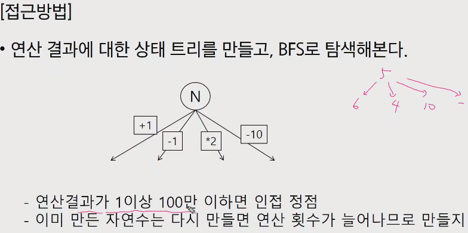

- dfs를하면 너무 깊이 들어가게 될 수 있다.
- 따라서 탐색의 거리 순서로 찾아보도록 해보자(bfs)

- 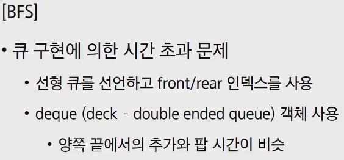

- 그냥 list로 할 경우에 시간초과가 납니다.
  - front / rear인덱스를 사용해서 풀어야합니다.
  - deque(deck - double ended queue) 사용도 가능.

- 이쯤되면 bfs의 수도코드가 머릿속에 떠올라야만 합니다.

- 선형큐를 사용하는 방법

  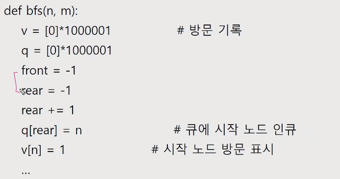

  

## 5248_그룹나누기

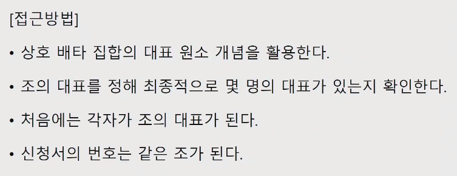

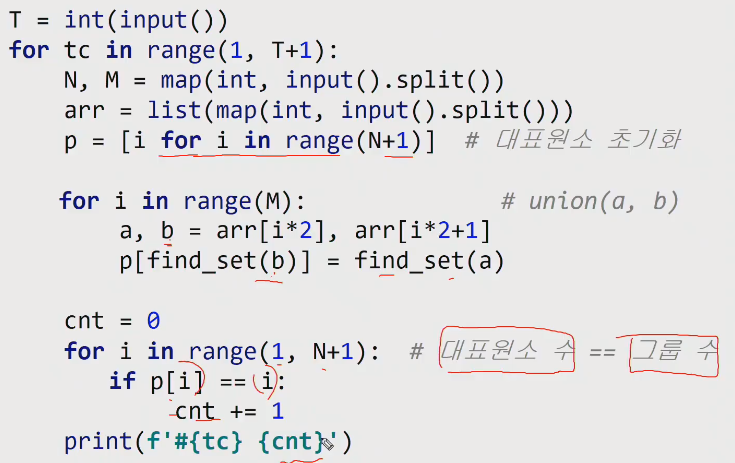

## 5248_최소신장트리

- Prim 또는 Kruskal 알고리즘으로 문제를 해결한다.

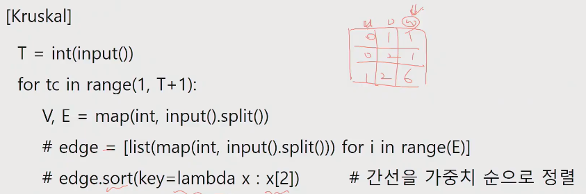

- 여기서 sort는 quick_sort로 이용해서 풀어보는 것도 도전해보는것이 복습도 하고 좋습니다.

- 만약 나는 조금 단순하게 정렬을 하고싶다면?

  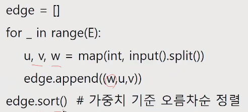

- 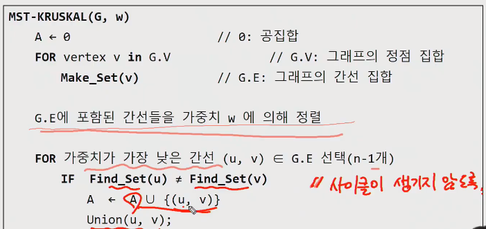

  

- 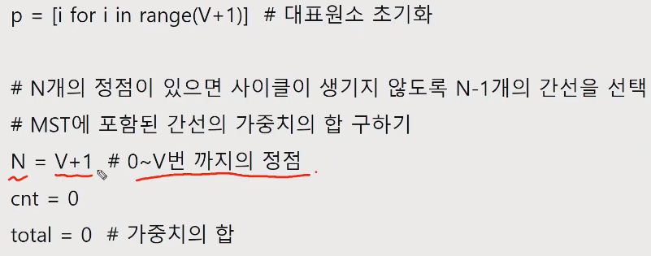

  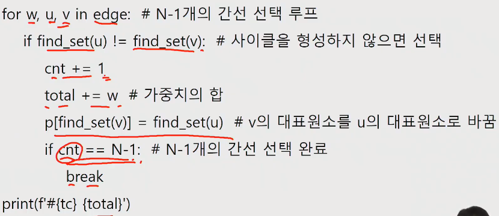

- Prim 알고리즘

  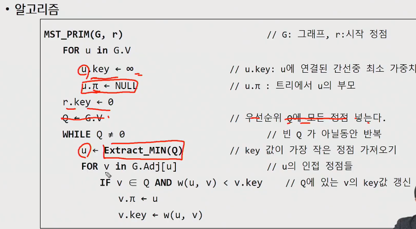

- 입력받기

  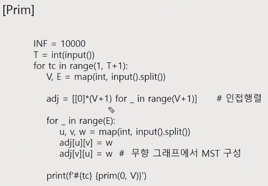

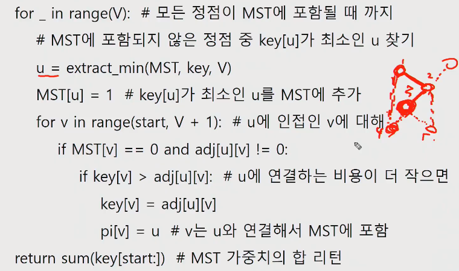

## 5250_최소비용

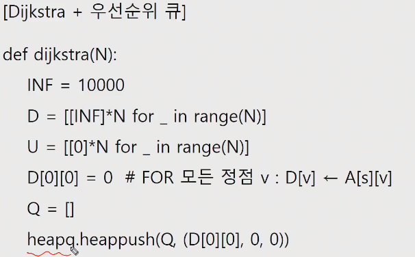

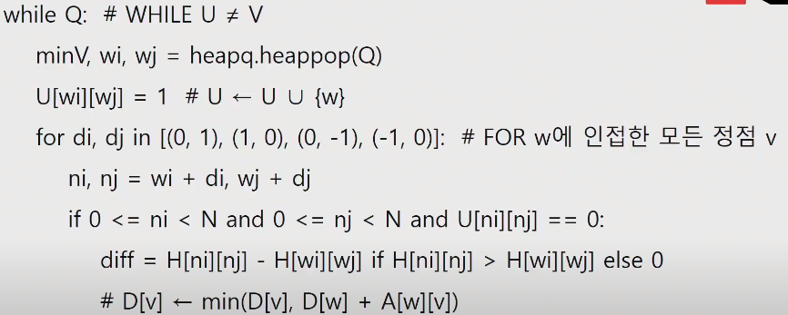

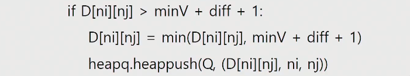

## 7465_창용 마을 무리의 개수

- 그룹나누기와 유사

## 1795_인수의 생일파티

- 못가는 경우는 없고 다 갈수는 있지만 화살표를 따라서 이동해야함

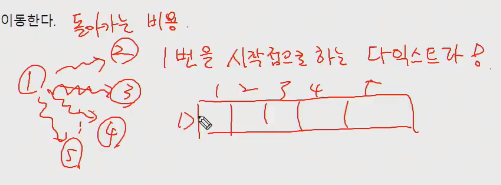

다익스트라를 N번 돌리는 방법이 있지만 이 방법은 생각보다 시간이 오래걸립니다.

다익스트라는 그리디한 접근

출발점을 고르면 그 출발점에서 가장 최단거리를 고르는 것이 다익스트라인데, 

다른데서 출발을 해서 1번에 도착하는 비용을 만들어 본다면??

- 1번에서 다른 정점으로 가는데 최단거리

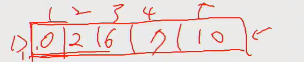

- 전치행렬을 만들어서 행이 도착이고 열이 출발로 만들면?

  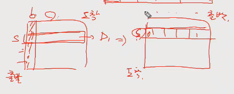

  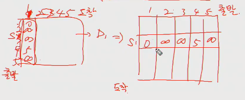