# 그래프

## 개념

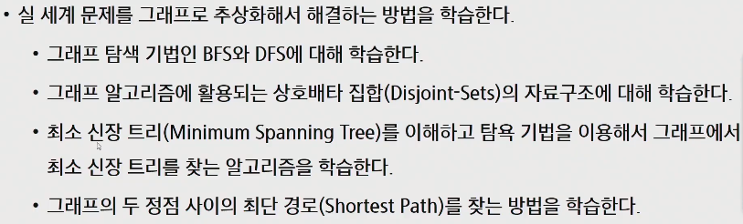

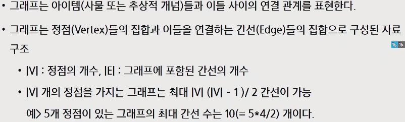


v개의 정점을 가지는 그래프는 최대 `|v|*(|v|-1)/2`  (1부터 v-1까지의 합)간선이 가능

- 그래프 유형

  - 무향 그래프(Undirected Graph)

    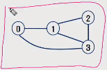

  - 유향 그래프(Directed Graph)

    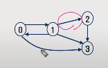

  - 가중치 그래프(Weighted Graph) : Edge에 비용, weight가 적혀있는 그래프

    

  - 사이클 없는 방향 그래프(DAG, Directed Acyclic Graph)

    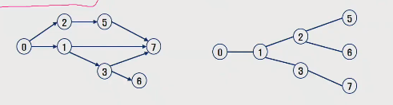

  - 완전 그래프 : 정점들에 대해 가능한 모든 간선들을 가진 그래프

    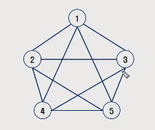

  - 부분 그래프 : 원래 그래프에서 일부의 정점이나 간선을 제외한 그래프

### 인접 정접

- 인접(Adjacency)

  - 두 개의 정점에 간선이 존재하면 서로 인접해 있다고 한다.
  - 완전 그래프에 속한 임의의 두 정점들은 모두 인접해 있다.

  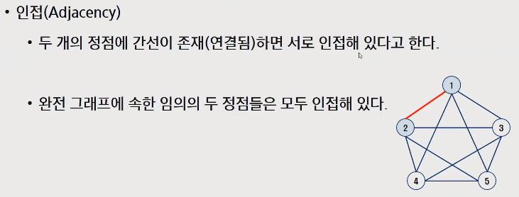

### 그래프 경로

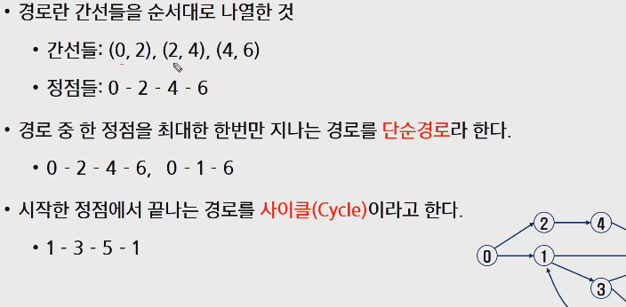

### 그래프 표현

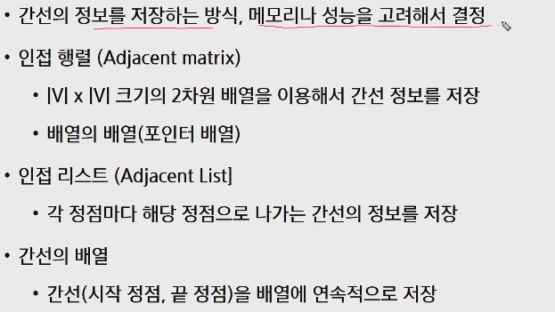

- 배열의 배열(C에서의 리스트)?
- 인접 리스트
- 간선의 배열

### 인접행렬

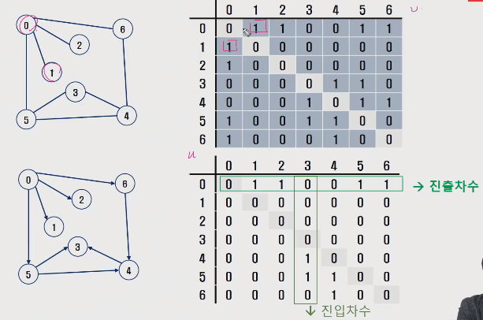

- 보통은 행이 출발, 열이 도착
- 무향 그래프 : i번째 행의 합 = i번째 열의 합 = Vi의 차수
- 유향 그래프 : 행의합(진출차수), 열의합(진입차수)

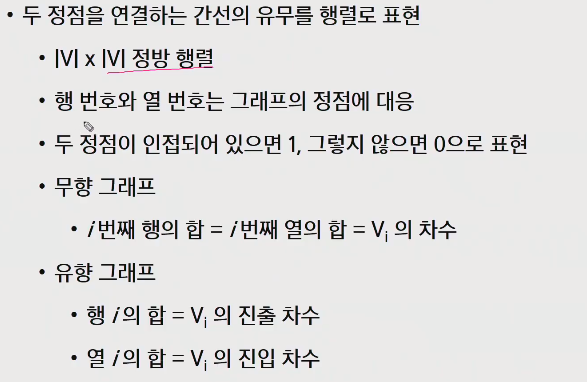

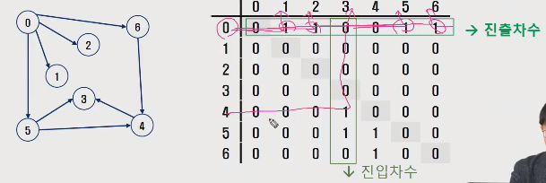

- 단점

  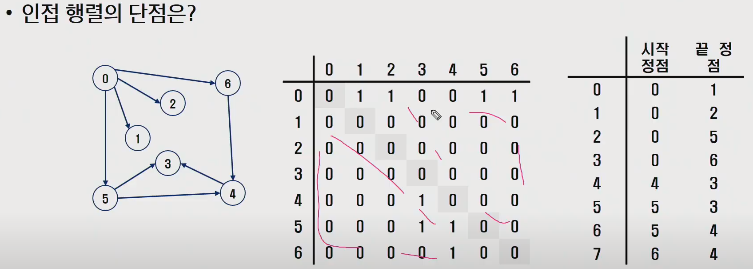

  빈공간이 많이 생긴다는 단점(메모리낭비), 이를 보완하기위해서 우측과 같이 간선번호에 시작정점, 끝정점을 저장하는 방법도 있기는 하다.

### 인접리스트

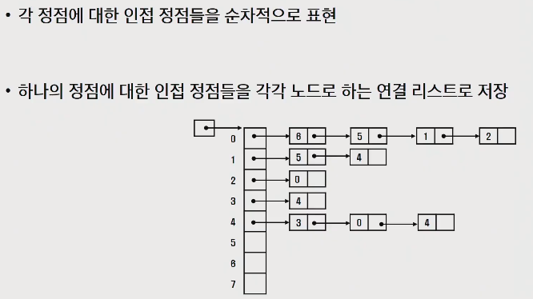

  - 이게 경로가 0 - 6 - 5 - 1- 2 이런 경로가 아니라 0에서 갈 수 있는 경로를 표현한 것임

    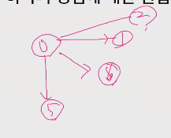

- 단점
  
- A랑 B가 연결 됐는지 확인하려면 전부 확인해야 해요
  
- 무방향그래프(양방향과 무향은 좀 다르다)

  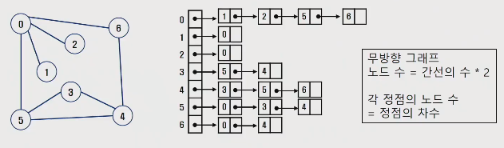

- 유향 그래프

  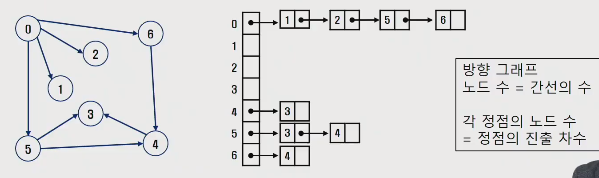

- 탐색에 들어가기전 정리를 해봅시다. 간단한 그래프 표현을 해볼게요

- 그래프를 어떻게 표현하는지에대한 판단이 중요합니다. (무향인지, 유향인지, 양방인지... 이것을 행렬, 리스트 어떻게 표현할 것인지)

- 

  

  ```python
  '''
  vertax의 개수 : 5 (정점번호인지 개수인지 확인이 필요)
  edge의 개수 : 6
  5 6
  1 2 1 3 2 3 2 5 3 4 4 5(줄을 바꾸어서 주어지는 경우도 있다.)
  '''
  v, e = map(int, input().split())
  info = list(map(int, input().split()))
  adj_arr = [[0]*v+1 for _ in range(v+1)]  # v번까지 번호가 필요
  adj_lst = [[] for _ in range(v+1)]
  
  for i in range(e):
      if i % 2 == 0:
          # 인접행렬
          # 서로 대각선을 기준으로 대칭
          adj_arr[info[i]][info[i+1]] = 1
          adj_arr[info[i+1]][info[i]] = 1  # 무향그래프인 경우
          
          # 인접 리스트
          adj_lst[info[i]].append(info[i+1])
          adj_lst[info[i+1]].append(info[i])  # 무향인 경우
  ```

  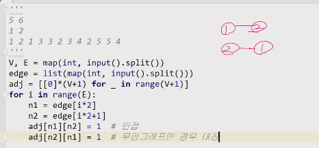

  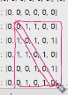

  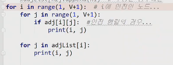

### 그래프 탐색

- 친구관계

- 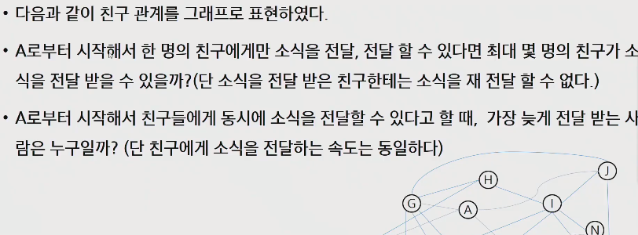

  이러한 문제를 그래프 문제로 잘 전달해야만 합니다.

- 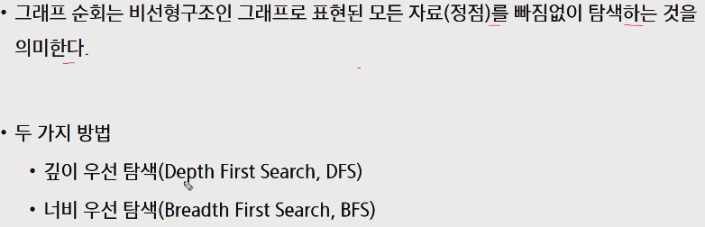

- DFS(깊이 우선 탐색)

  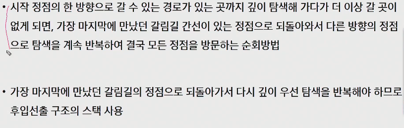

  내가 지나온 갈림길을 저장하는 방법들이 여러가지가 있습니다. => 재귀(호출반복), 반복(스택), 비트, 

  내가 실제로 지나갈 곳을 번호를 저장할 수가있고, 지나갔던 곳의 번호를 저장할 수가 있다. 이것은 방법의 차이

- BFS(너비 우선 탐색)

  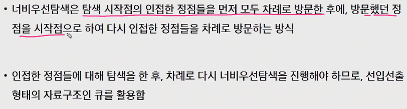

## 스택

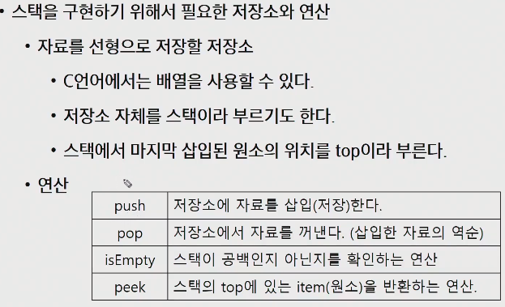

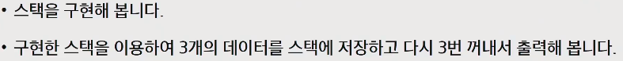

### DFS알고리즘(재귀)

- 중복없이, 빠짐없이 방문하는 경우

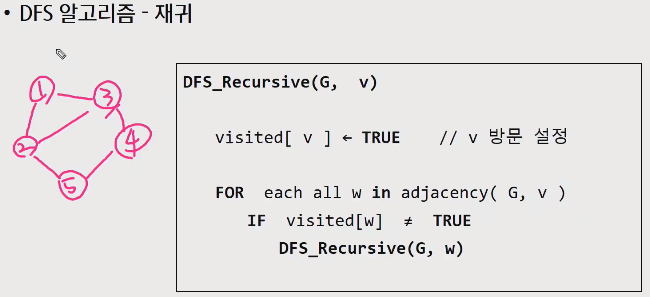

### DFS알고리즘(반복)

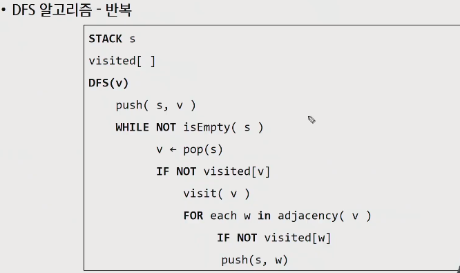

## 큐

### BFS


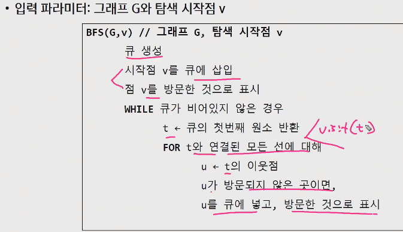

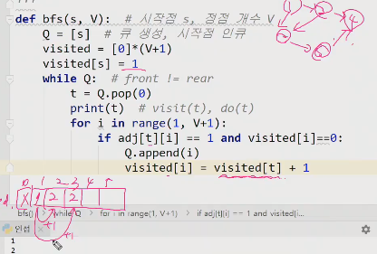

## 서로소 집합

- 크루스칼 하기전 준비

- 상호배타 집합을 표현하는 방법

  - 연결 리스트
  - 트리

- 상호배타집합의 연산

  - Make-Set(x)

  - Find-Set(x)

    Find-Set을 하게되면 해당 원소의 대표자를 찾게되므로 x는 return x가 된다.

  - Union(x, y)

  rank라는 것을 이용해서 연결가능하나 보통 앞에꺼를 연결해준다

  

  x의 대표는 x, y의 대표도 x

  - Union(x, a)

  

  b의 대표자는 누구인가? 결과적으로 탐색하게 되면 x가 된다 

- 트리를 이용한 상호 배타 집합 표현

  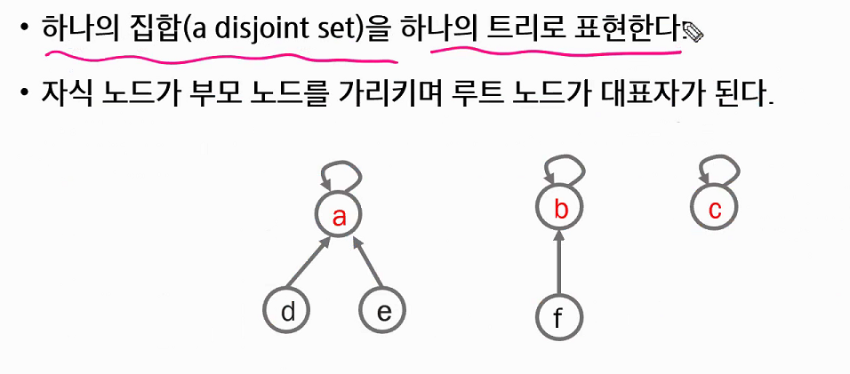

  d에서 find-set하면 부모를 찾아가므로 a가 될 것

- 자기 자신을 가리키는 배열을 하나 만듭니다.

  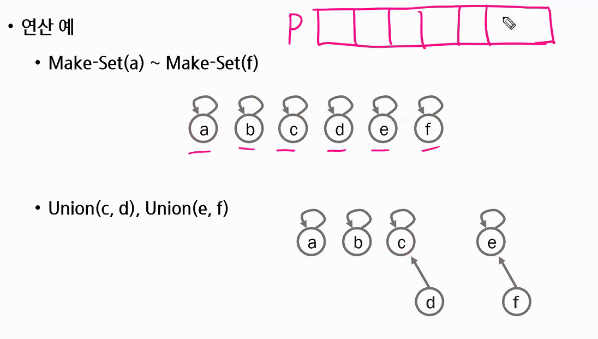

  a = 0이라고 생각해보면

  

  각각의 인덱스에 0, 1, 2, 3, 4, 5라 적으면서 각 인덱스의 대표를 지정해준다(P라는 리스트는 대표자를 가지고 있는 리스트인 것. 0의 대표는 0, 1으 대표는 1)

  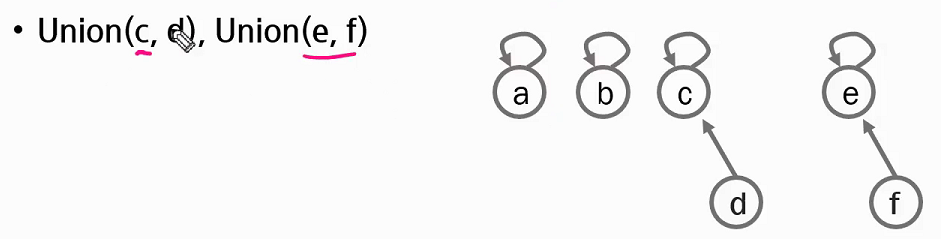

  union을 하게되면 c를 d에 d를 c에 연결방식은 내가 정하면 됨

  

  위를 보면 그룹이 4개가 생성된 것을 확인할 수 있다.

  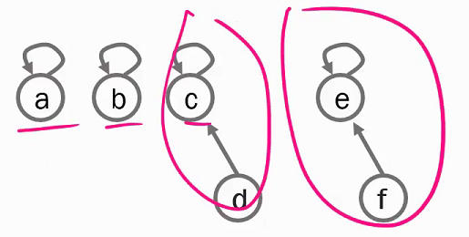

  그렇다면 Union(d, f)는 어떻게 될까

  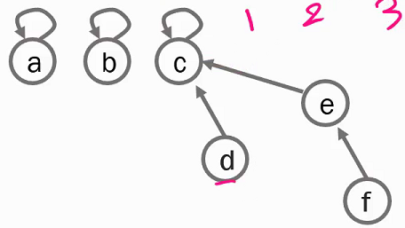

  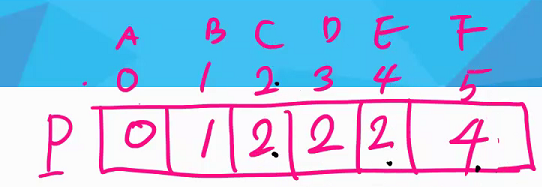

  f의 대표가 e였는데 Union(d, f)를 하면 f의 대표자인 e의 대표가 d(의 대표)가 되어버린다.

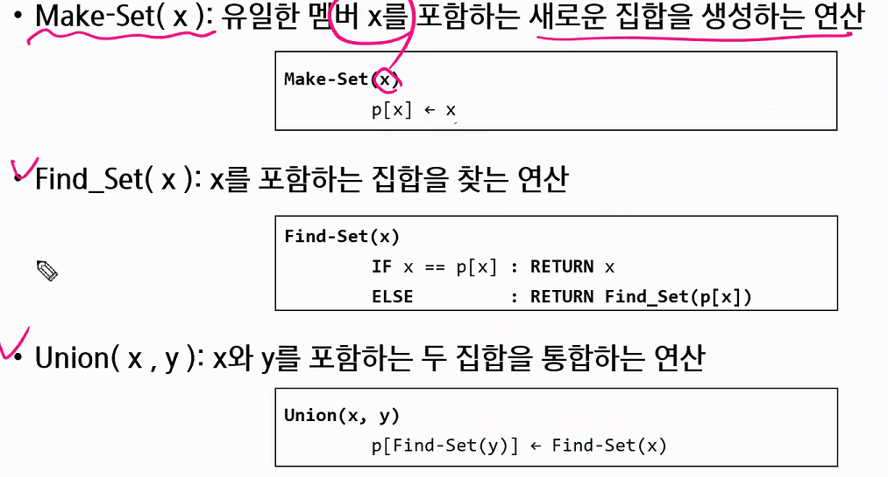

`Find_Set(x)` : 대표자 찾기

`Union(x, y)` : y의 대표를 x에 연결시킨다. y가 가리키는 대표의 값을 x가 가리키는 대표로 바꾼다

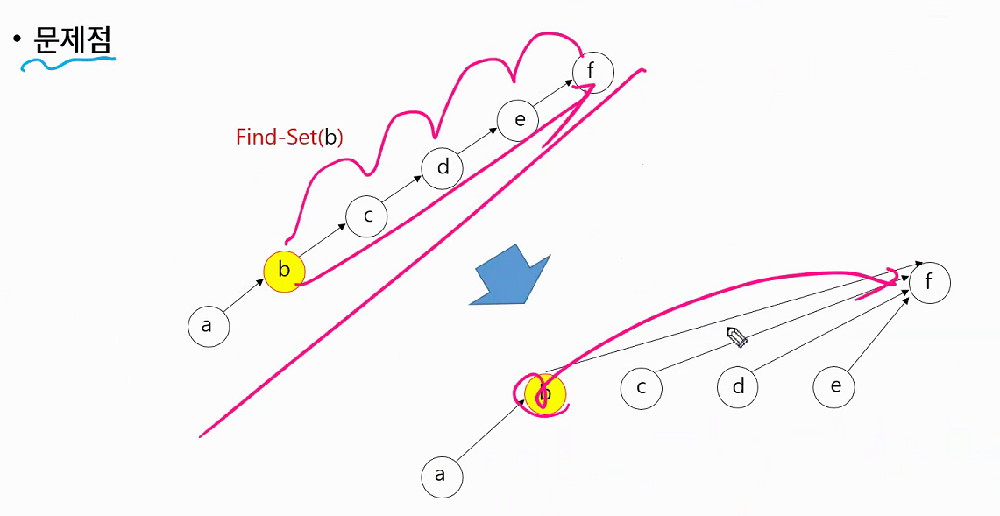

b의 대표를 찾으려면 올라가고올라가서 f로 가야하지만 조금 생각을 바꿔서 f에서 모두 한뎁스만 내려가면 찾을 수 있게 하려면?? (연산의 효율을 높이려면??)

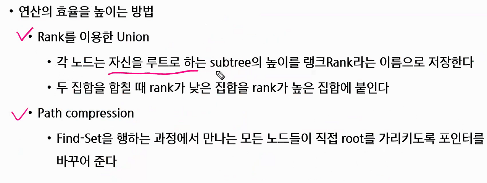

1. 균형있게 union을 해서 대표자를 찾는 연산을 줄여보자는 방법

   rank라는 리스트를 하나 더 만들어서 관리를 해주어야만 한다.

2. Path compression

- Rank를 이용한 Union

  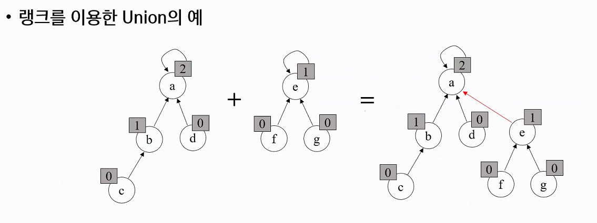

  더 작은녀석을 큰 녀석에 붙이도록

  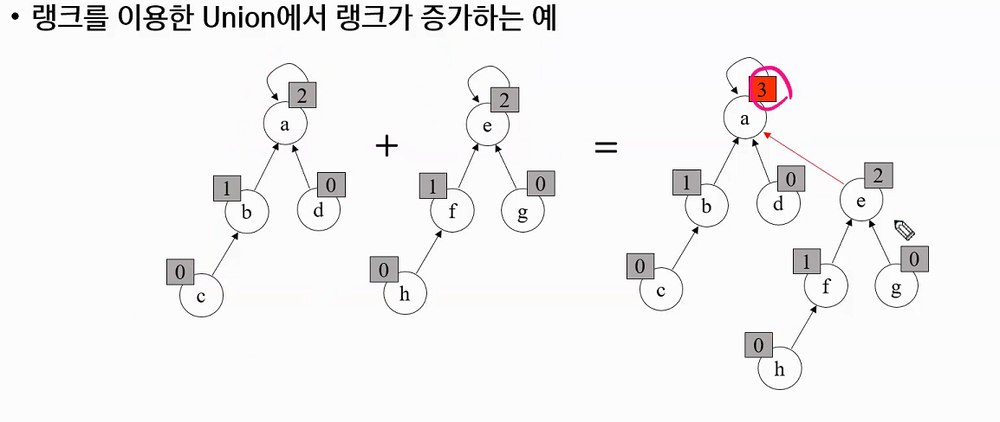

  a만 증가하고 나머지는 영향을 받지 않는다.

  랭크가 곧 밑의 자식수

- Path Compression

  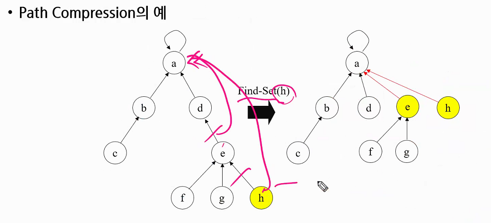

  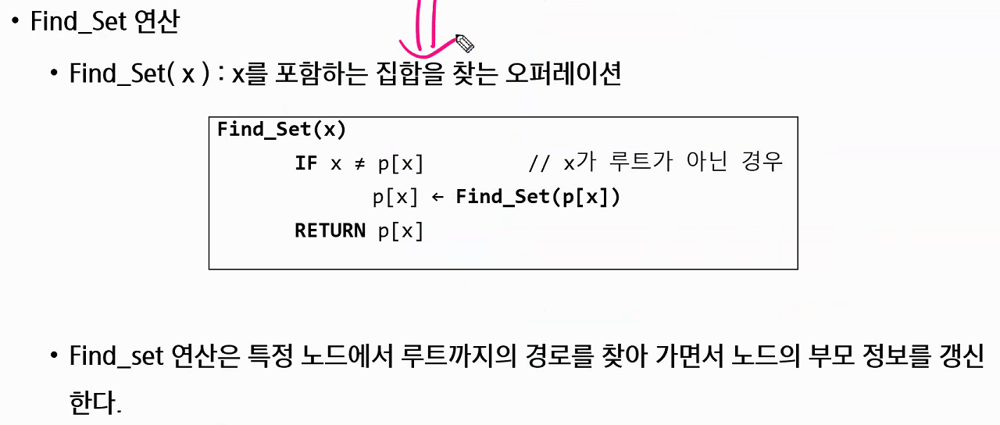

  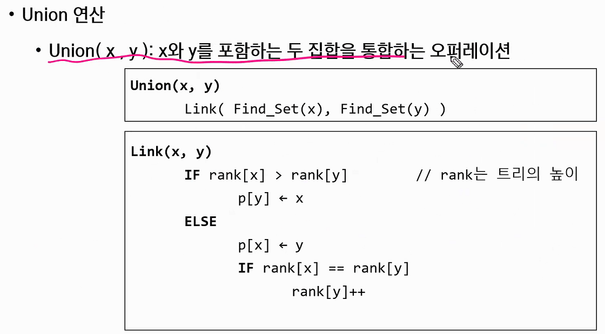

  Link함수에 x, y의 대표값들을 넘겨서 대표들의 랭크 값들을 비교

  그리고나서 작은 랭크를 갱신

## 최소신장트리(MST)

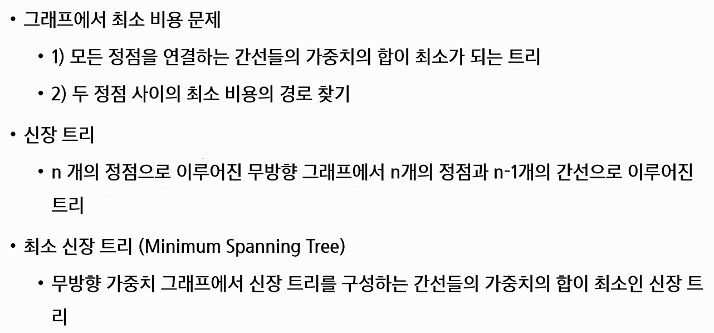

- 신장트리

  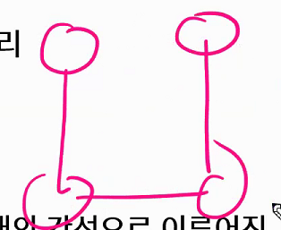

- 최소신장트리

  신장트리중 간선들의 가중치의 합이 최소

  간선들에 가중치를 앞으로 줄 건데 이 가중치의 합이 최소인 간선을 확인하고 싶은 것

  최소신장트리를 만드는 알고리즘이 프림과 크루스칼 알고리즘 2가지

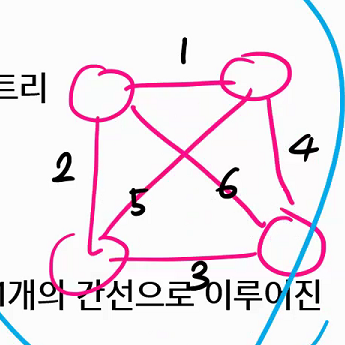

이러한 그러프들을 프림, 크루스칼 알고리즘을 통해 숙숙숙 잘라서 가중시가 최소인 그래프를 만들어 줍니다.

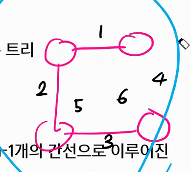

### KRUSKAL 알고리즘

disjoint set사용할수있는 kruskal먼저 해보자

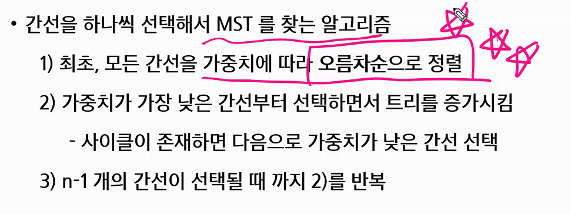

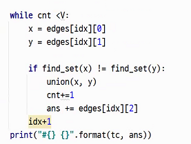

### Prim 알고리즘

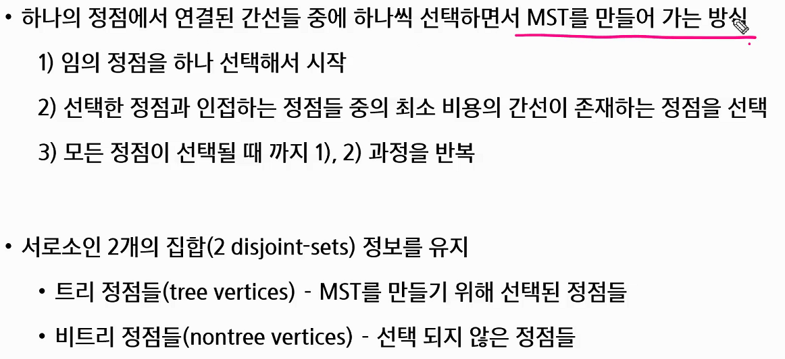

kruskal은 내가 어떤 걸 선택하던지 상관이 없었지만 prim의 경우 정점을 선택하면서 mst를 만들어 가는 방식

어떠한 점을 시작으로해도상관이 없습니다.

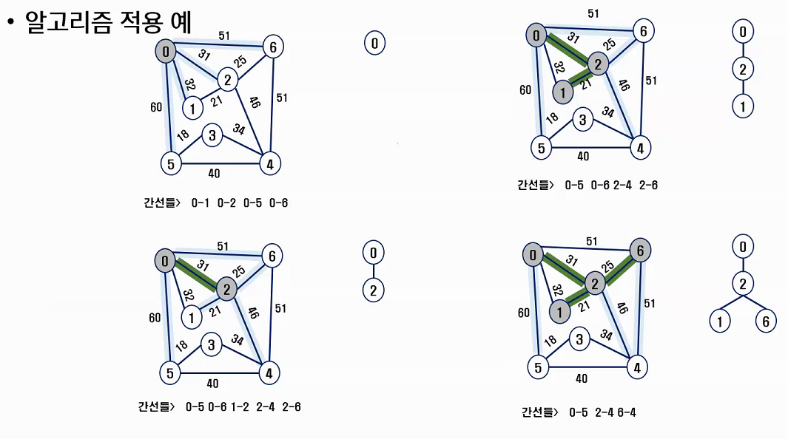

내가 관여할수있는 간선을 살펴보는데 그 중에 가장 작은 가중치인 간선을 연결 합니다. 그러면 새로운 후보들이 추가되는데, 그중에 가중치가 작은 간선을 다시 연결합니다.

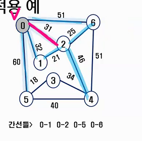

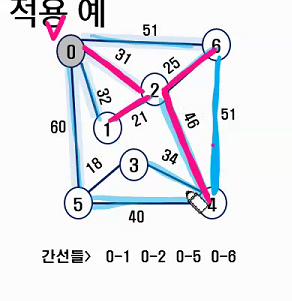

이런식으로진행되면서 kruskal과 같은 간선연결이 되는 것을 확인할 수 있습니다.

여기서 주목할 점은 dist라는 리스트를 활용하는 것


최소스패닝트리는 유일해서 한가지 모습으로만 나오나

## 오후유튜브

- Make_Set(x) : 유일한 멤버x를 포함하는 새로운 집합을 생성하는 연산

  ```python
  def Make_Set(x):
      p[x] = x
  ```

  원소 개수에 해당하는 배열을 생성하고 해당 인덱스의 대표값들이 자기자신인 배열을 생성

- Find_Set(x) : x를 포함하는 집합을 찾는 연산(대표원소를 찾는 연산)

  - 재귀

    ```python
    def Find_Set(x):
        if x == p[x]:
            return x
        else:
            return Find_Set(p[x])
    ```

  - 반복

    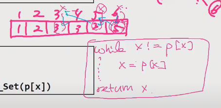

- Union(x, y) : x와 y를 포함하는 두 집합을 통합하는 연산

  ```python
  def Union(x, y):
  	p[Find_Set(y)] = Find_Set(x)
  ```

- 연산의 효율을 높이는 방법
  - Rank를 이용한 Union
  - Path compression

- Prim알고리즘

  - 하나의 정점에서 연결된 간선들 중에 하나씩 선택하면서 MST를 만들어 가는 방식
  - MST에 포함되지 않은 집합을 MST에 포함되어있는 집합으로 하나씩 옮겨갈 것 입니다.

  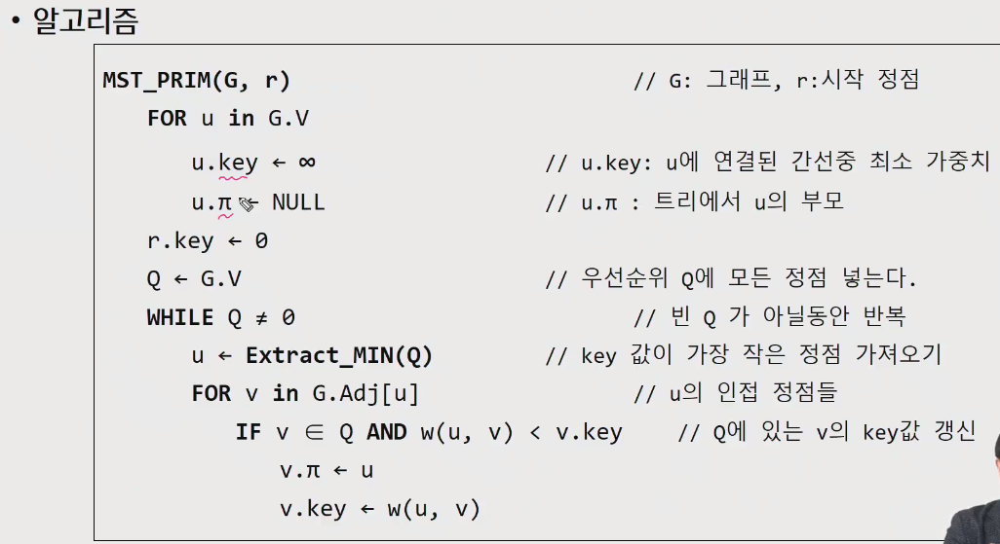
  - 구현해보면

    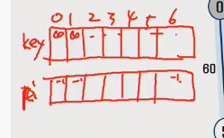

    시작정점의 키값은 0으로 임의의 정점으로부터 시작

## 다익스트라

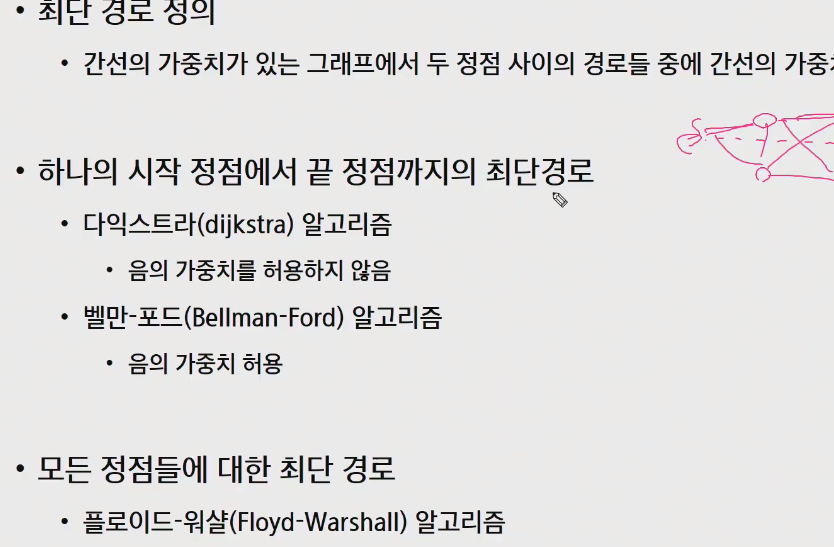

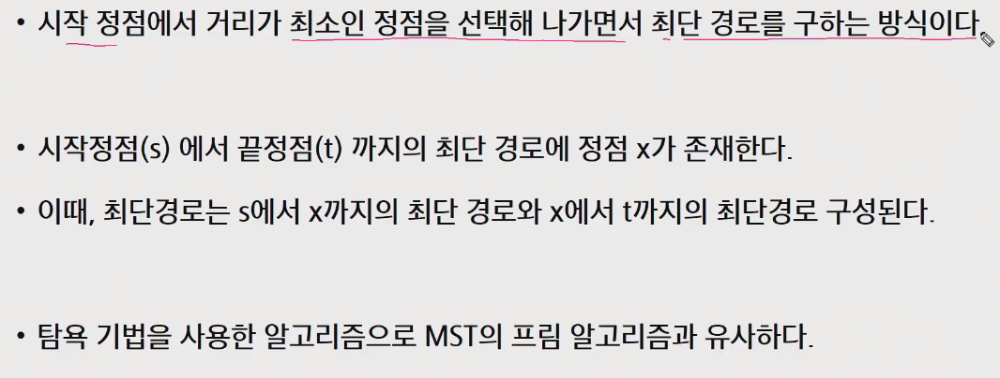

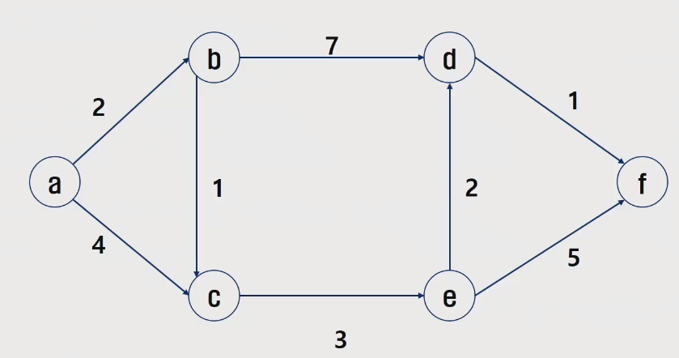

a -> f까지가는 최소비용을 구해보려고 합니다.

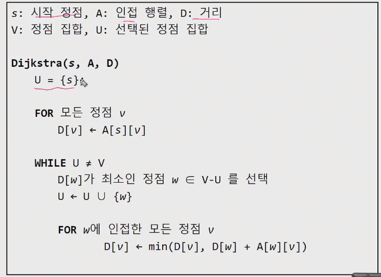

U : 최소비용이 확정 된 정점의 집합

D : 각 정점으로 가는 비용을 담은 집합

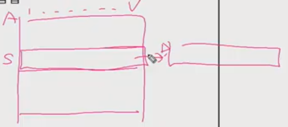

### 연습문제

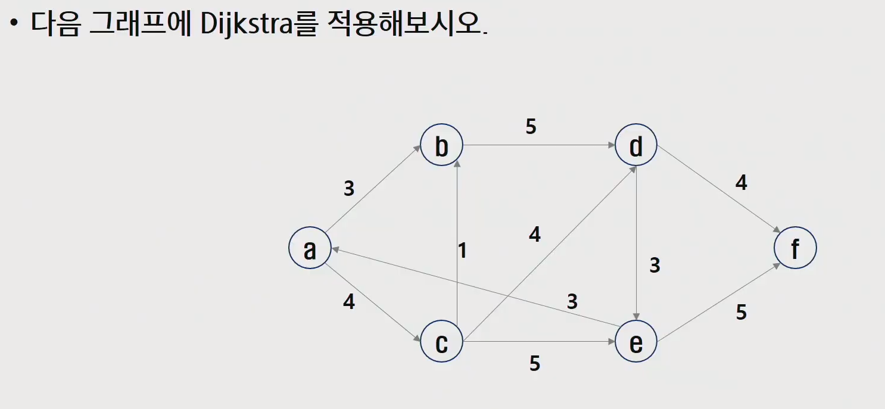

## 오후 웹엑스

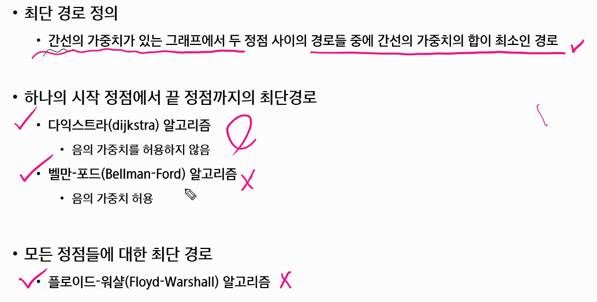

플로이드워샬은 음의 가중치도 허용한다.(이해하기는 어렵지만 코드는 쉽다 => 3중 for문)

### 다익스트라(dijkstra)

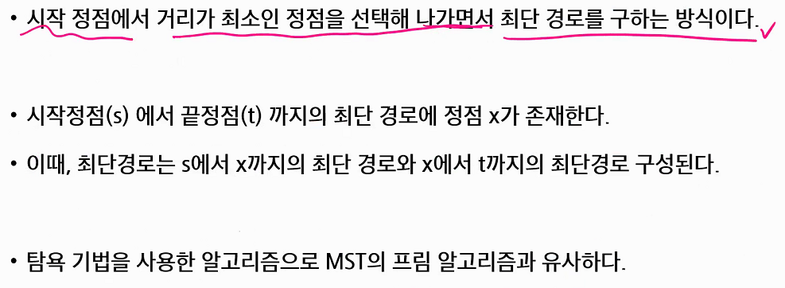

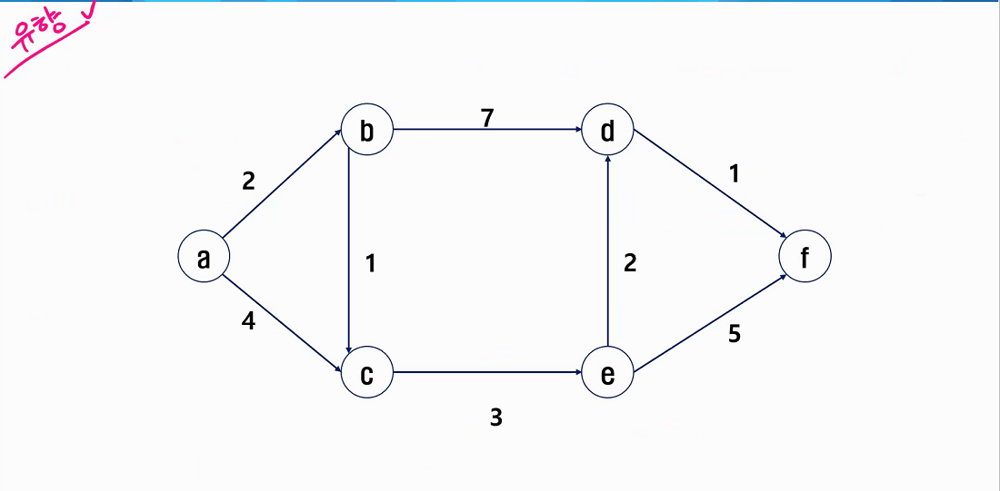

a -> c가는 거보다 a -> b -> c로 가는 경로가 더 짧다

## 보충수업

- 상호배타집합 => 트리(구조)로 표현

- 상호배타집합연산 : make-set, find-set, union
  - make-set : 배열
  - find-set : 대표자 찾기
  - union : 대표인수자 고르기
    - rank
    - path-compression
- 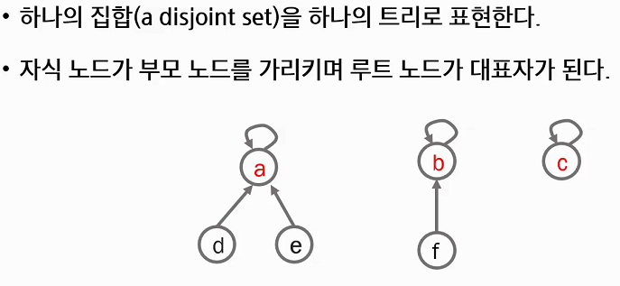

- 상호배타집합에 대한 연산

  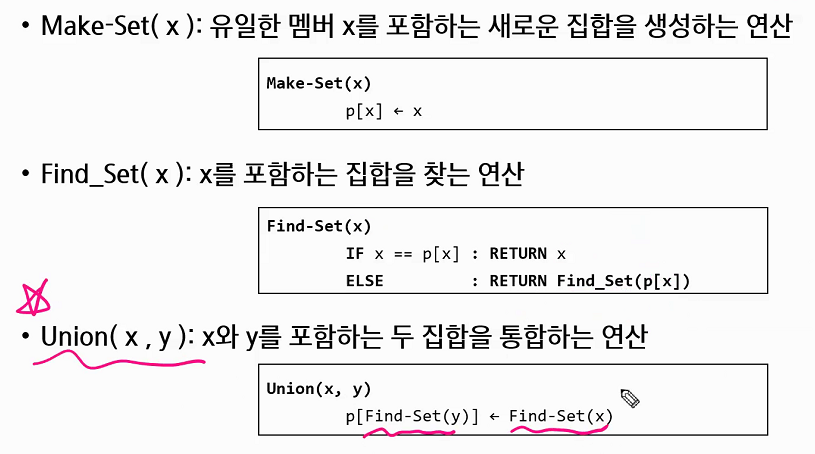

- 여기서 문제점이 발생

  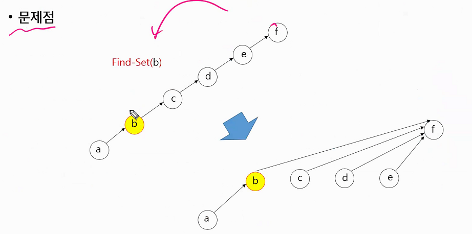

- 연산의 효율을 높이는 방법

  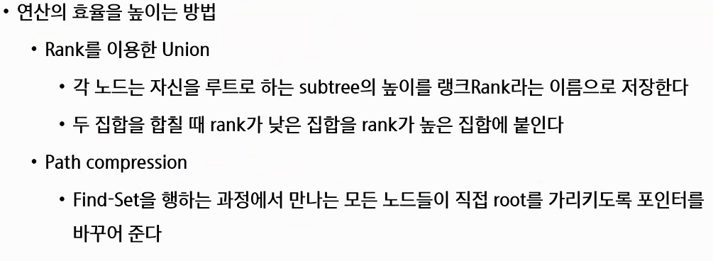

  - rank를 이용한 Union

    - 두 집합을 합칠 때 rank가 낮은 집합을 rank가 높은 집합에 붙인다
    - 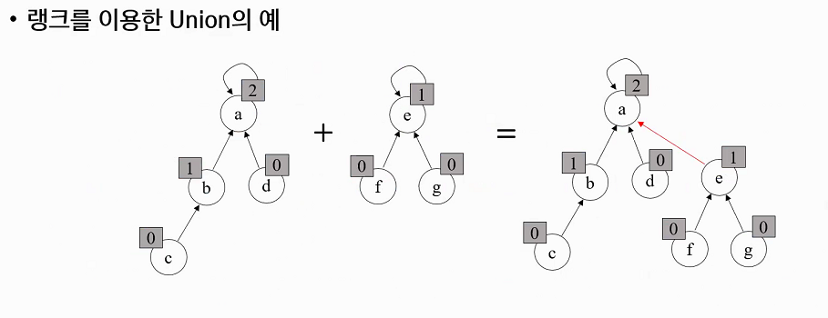
    - 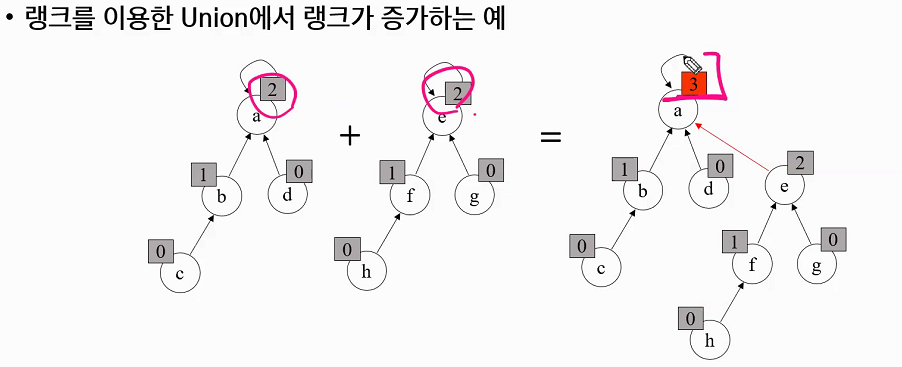

  - Path compression

    - find-set행하는 과정에서 만나는 모든 노드들이 root를 가리키도록 포인터를 바꾸어준다
    - 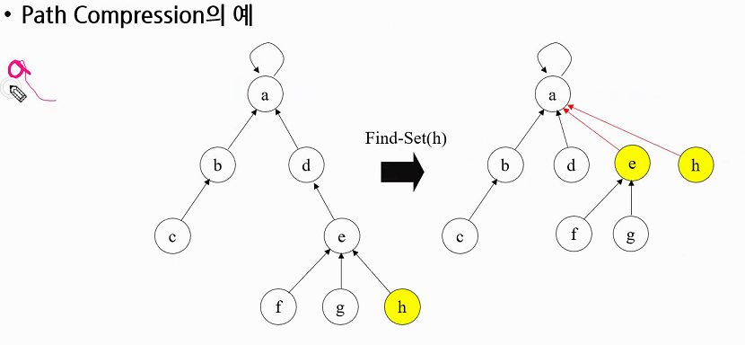

    - 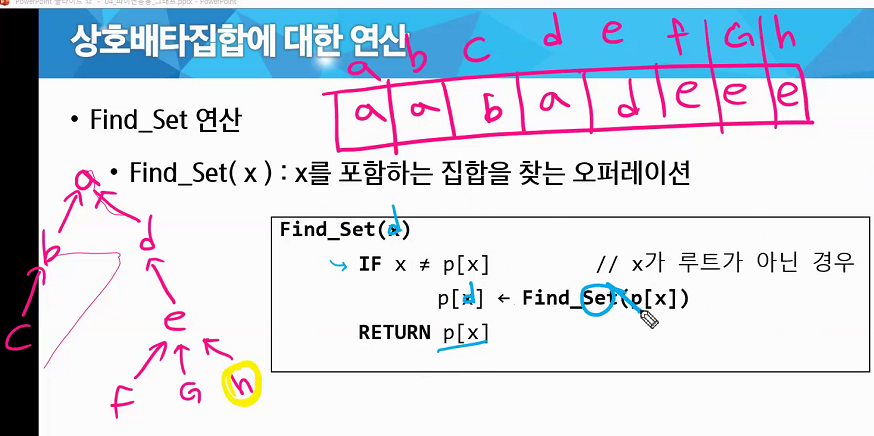

      여기서 h를 찾으려고 할때

      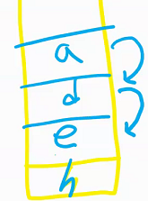

      

    - Union연산

    - 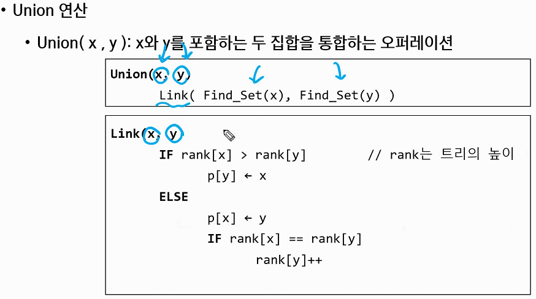

### 최소신장트리(MST)

- 신장트리 : n개의 정점으로 이루어진 무방향 그래프에서 n개의 정점과 n-1개의 간선으로 이루어진 트리(트리라는 말은 싸이클이 없다는 말)
  - 신장트리는 하나의 모습으로만 존재하지 않는다.
  - 모든 정점이 이어져있으면서 간선의 개수가 n-1이면 신장트리
- 최소신장트리(Minimum Spanning Tree) : 무방향 가중치 그래프에서 가중치 가장 작은 간선끼리 연결되어있는 트리

### Prim 알고리즘

- 임의 정점을 하나 선택해서 시작

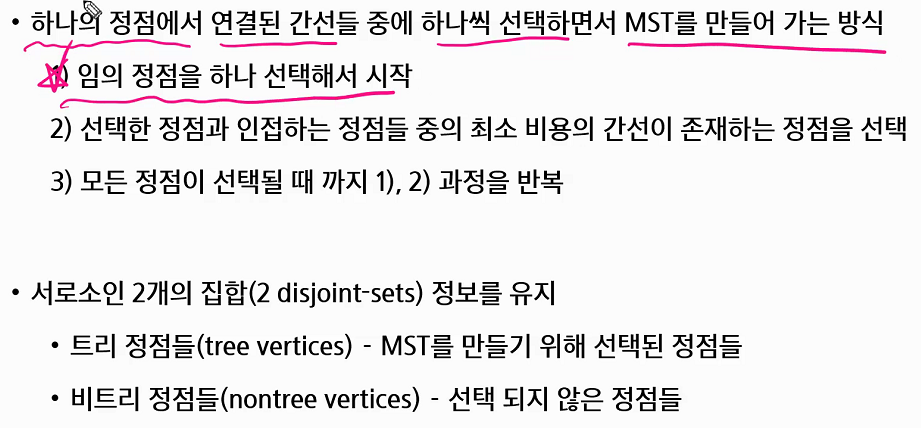

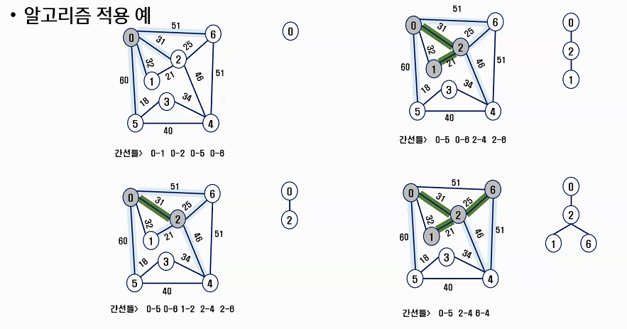

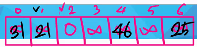

### Kruskal 알고리즘

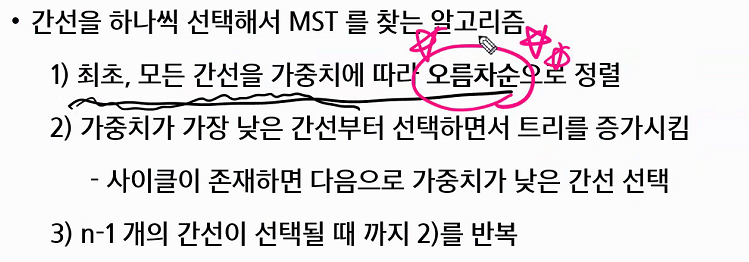

사이클이 존재하면(find_set해서 두개의 대표가 같다면) 트리가 아니게 되므로 다음 가중치가 낮은 간선을 선택한다(union을 통해서 대표를 일치시킨다)

### 최단경로


### Dijkstra 알고리즘

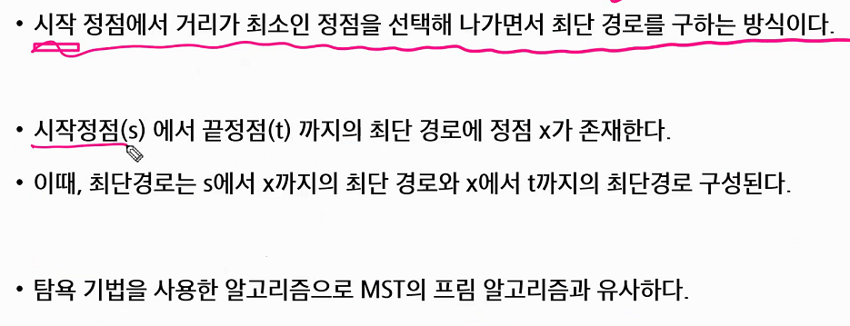

이러한 알고리즘을 이용하게되면..

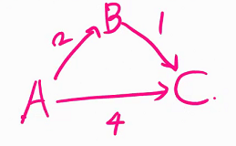

경로는 모르겠지만 C까지 가는데 3이면 갈 수 있다는 것을 알 수 있다.(이처럼 비용만 알고싶은경우 활용이 가능하다. 경로를 알고 싶다면 따로 지정해주어야함)

