# 분할정복

## 병합정렬(Merge Sort)

쪼갤 때 꼭 왼쪽 오른쪽 나누는게 아니라 인덱스로 쪼갤 수 있다.

- 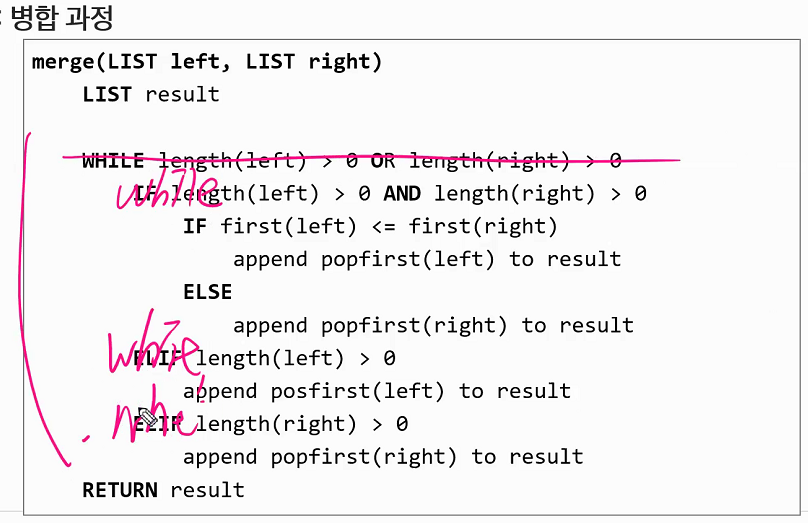

## 퀵 정렬(Quick Sort)

- 피벗의 기준을 나눌때 호어파티션과 로무토파티션 두 가지 방법으로 나눈다.
- 호어 파티션은 다시 피벗을 왼쪽, 가운데, 오른쪽에 두는것에따라 조금씩 다시 달라진다. 기준을 어디 두느냐에 따라서 조건이 달라진다.

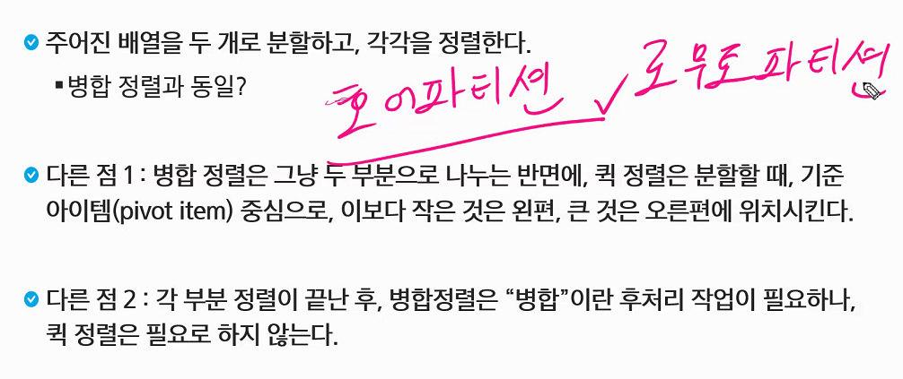

- 퀵정렬을 쭉 내려가면서 원본을 바꾸기 때문에 병합과정이 필요하지 않다.
- 퀵정렬 최악의 경우 O(n^2)시간이 걸린다.(정렬되어있는 상태를 다시 정렬시키려고 할 때)
- 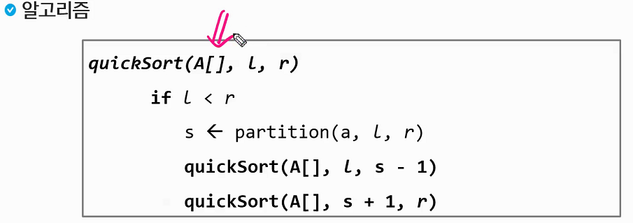
  - A[] : 원본
  - partition함수 s라는 피벗(위치)를 보내준다.

### Hoare Partiton 알고리즘

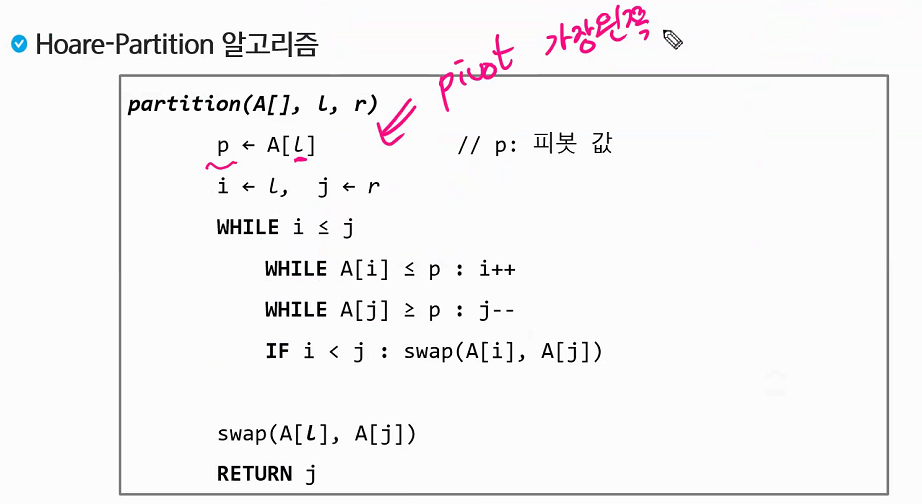

- 가장 중간값을 기준으로 잡았을 때

  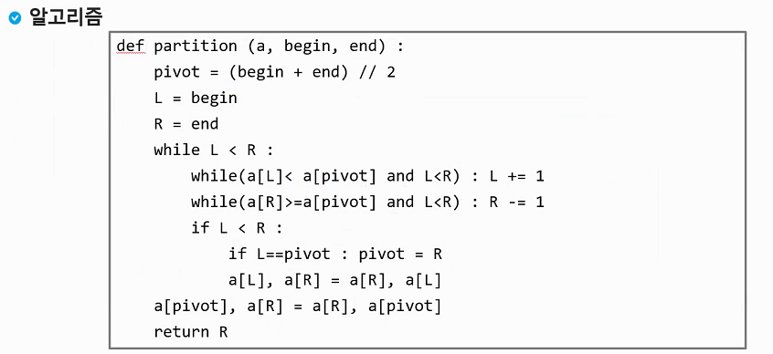

- 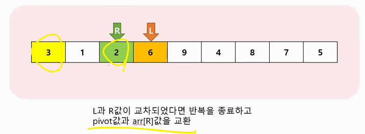

- 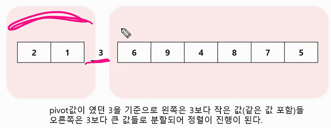

### Lomuto partition 알고리즘

- 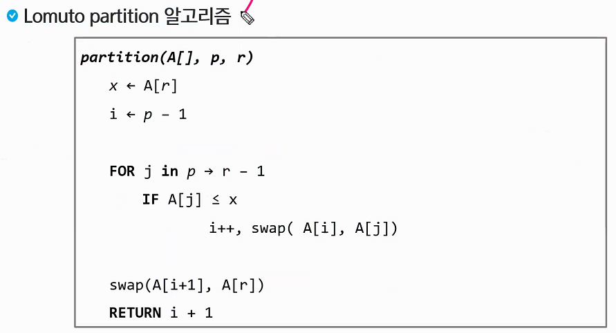
  
- x 를 기준으로 i는 p-1
  
- 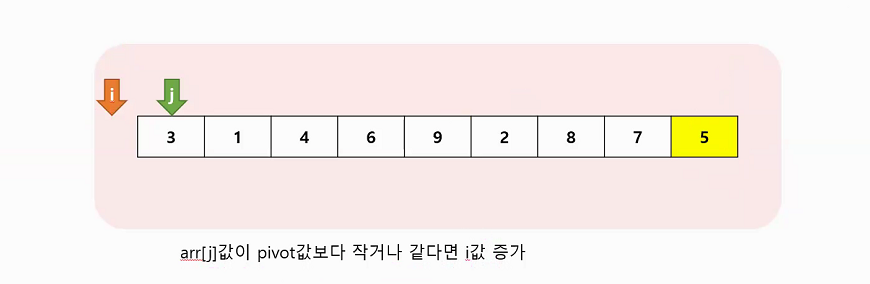

  j는 쭉증가, i는 나중에 기준을 잡기 위한 것

  i는 피벗기준으로 왼쪽에 위치한 인덱스(i를 통해서 경계를 알 수 있다) 작거나 같은 애들의 인덱스

  i+1는 피벗보다 큰 애들의 위치

  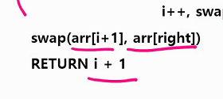

  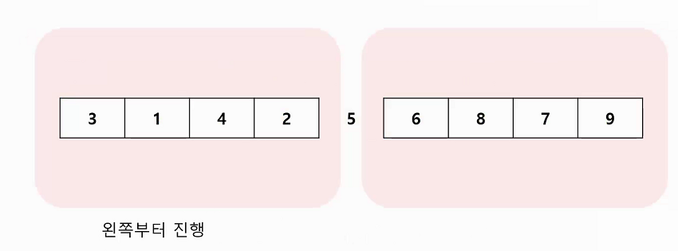

## 이진검색

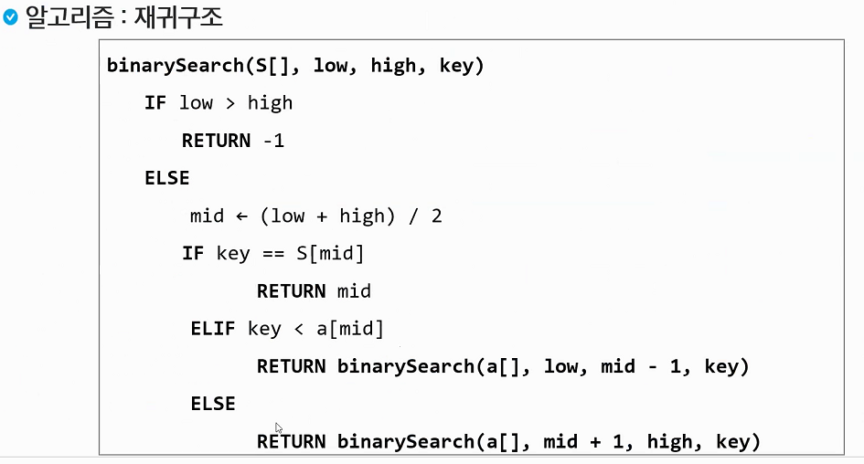

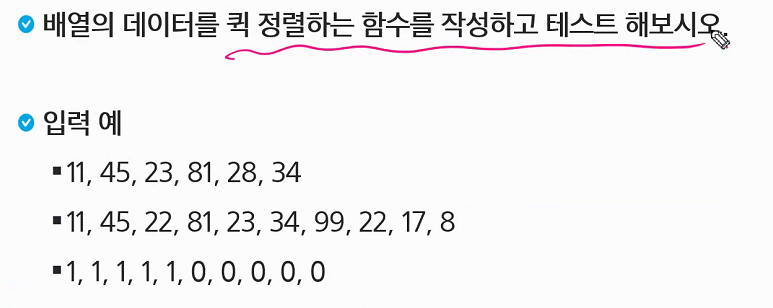

### 백트래킹

- 파워셋
- 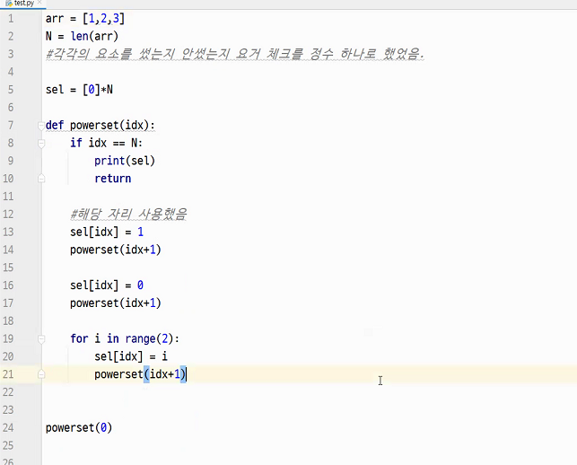
- 백트래킹 순열
- 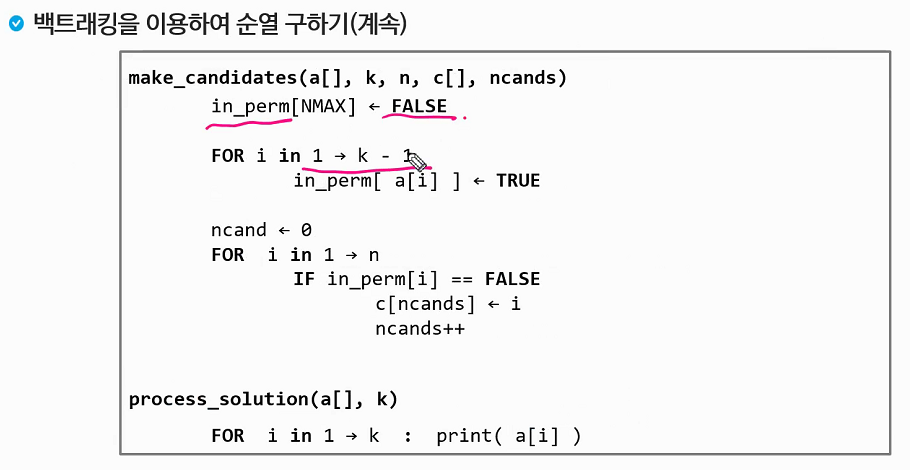

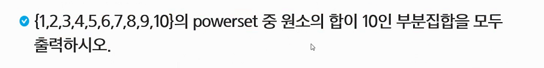

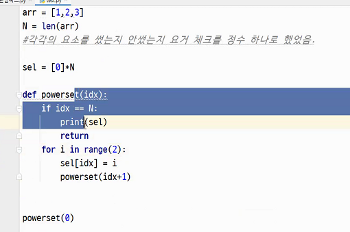

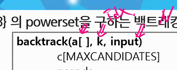


## 힙

### 힙 푸시 / 팝

```python
# 힙 푸시 - 넣고자 하는 값
def heap_push(item):
    global heap_count
    # 완전이진트리 유지하면서 값 넣기
    heap_count += 1
    heap[heap_count] = item
    
    cur = heap_count
    parent = cur // 2
    # 최소힙 만족하지 못한다면 자리교환, 루트이면 stop
    while parent and heap[parent] > heap[cur]: 
    	heap[parent], heap[cur] = heap[cur], heap[parent]
        cur = parent
        parent = cur // 2
        
        
# 힙팝
def heap_pop():
	global heap_count
    item = heap[1]
    # 마지막 노드에있는 숫자를 루트에 덮어씌운다
    heap[1] = heap[heap_count]
    heap_count -= 1
    
    # 부모와 자식 선언
    parent = 1
    child = parent * 2
    if child + 1 <= heap_count:
        if heap[child] > heap[child+1]:
            child = chlid + 1
	
    while child <= heap_count and heap[parent] > heap[child]:
        heap[parent], heap[child] = heap[child], heap[parent]
        parent = child
        child = parent * 2
        if child + 1 <= heap_count:
            if heap[child] > heap[child+1]:
                child = child + 1
                
    return item
    
    
arr = [1,8,3,9,10,2]

N = len(arr)

heap = [0] * (N+1)
heap_count = 0
```

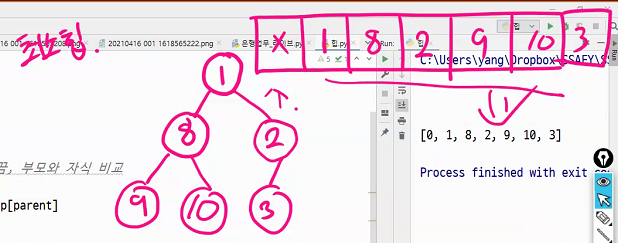

## 비트를 이용한 부분집합

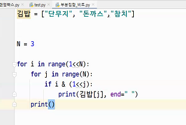