# 문제풀이

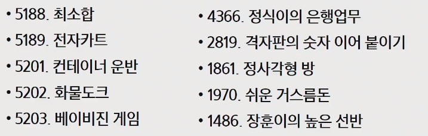

## 5188_최소합

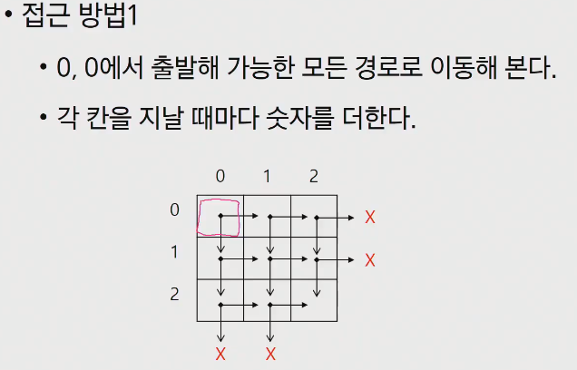

- 칸에 진입하는 상황 `f(i, j)`
- 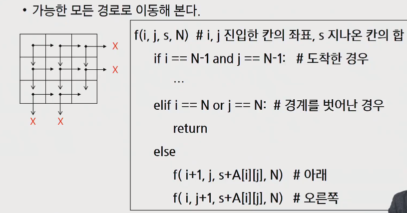

- 
- 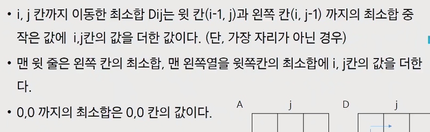
  - 부분 최소합을 만드는 접근
  - 이건 우리의 범위를 벗어나긴 하지만 참고로 알아보자

- 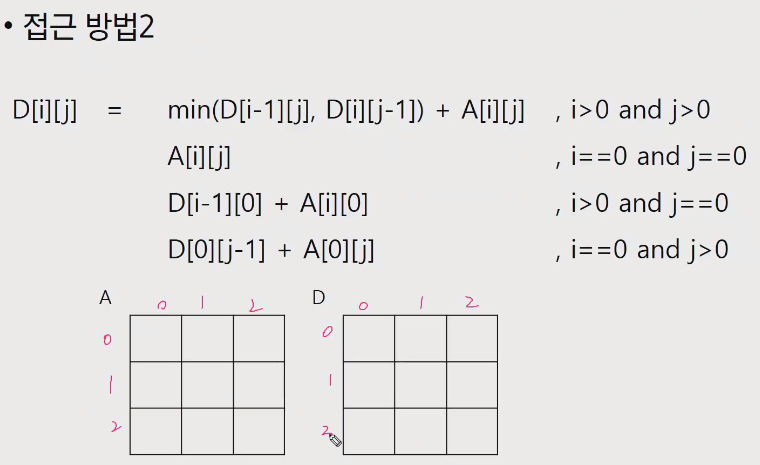

- 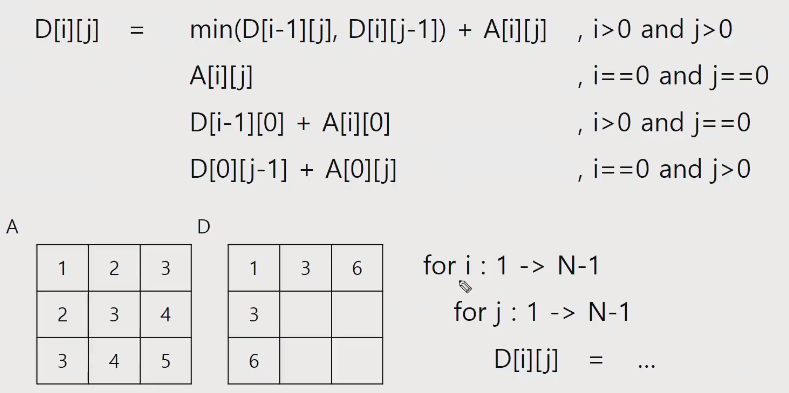

## 5189_전자카트

- 가능한 방문순서 만들기
- 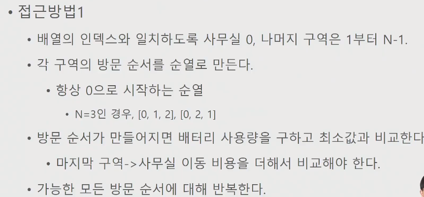

- 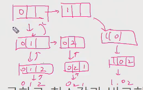

- 순열은 만들꺼지만 처음수가 0인경우에서 만들어지는 순열만 필요하다
  - 0번칸이 결정되어있으니 f(0)하던것을 f(1)로해서 1번칸(다음칸)부터 시작하도록 할 수 있다
- 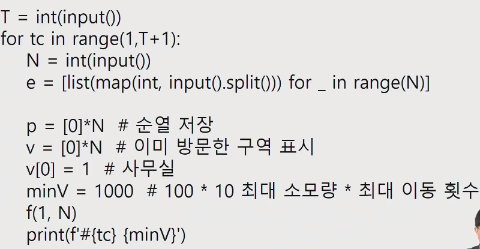

- 
  - 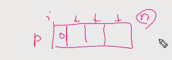

- 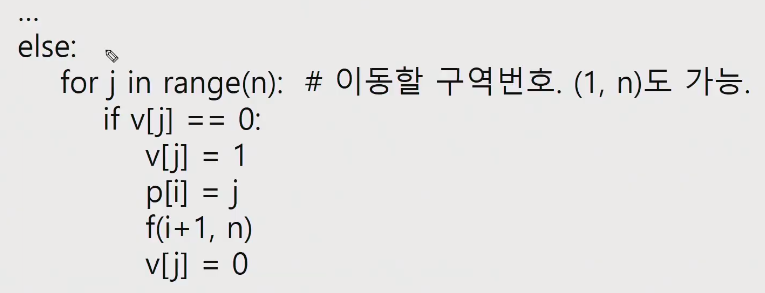

- 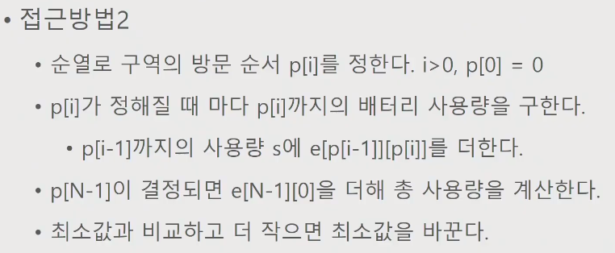

- 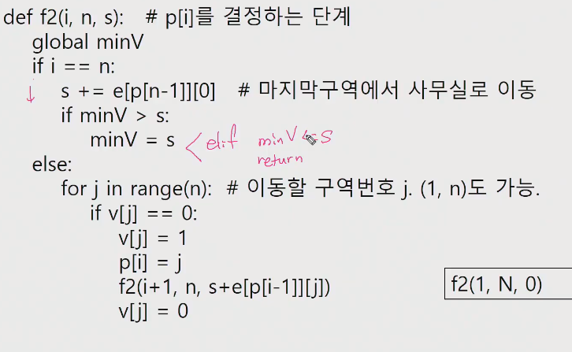
  - 이전 방문까지의 비용(s)을 같이 가져온다

## 5201_컨테이너 운반

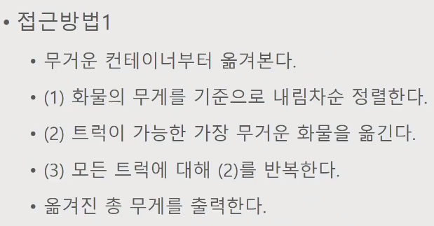

- 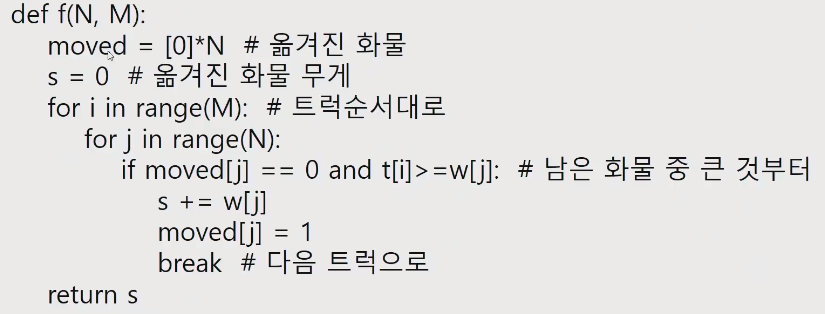

- 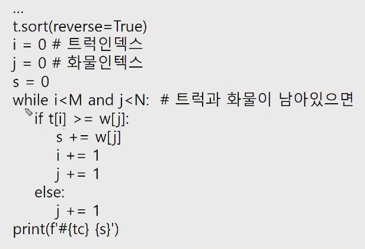

## 5202_화물도크

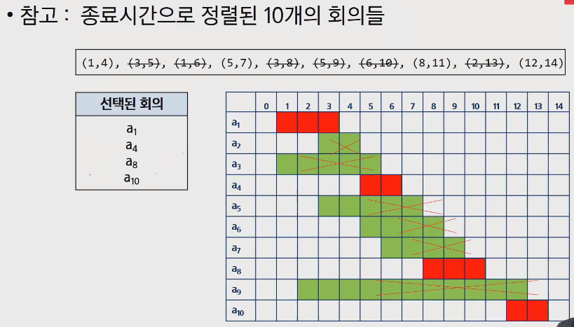

- 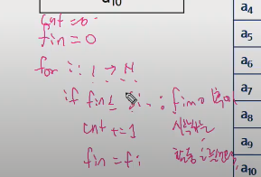

- 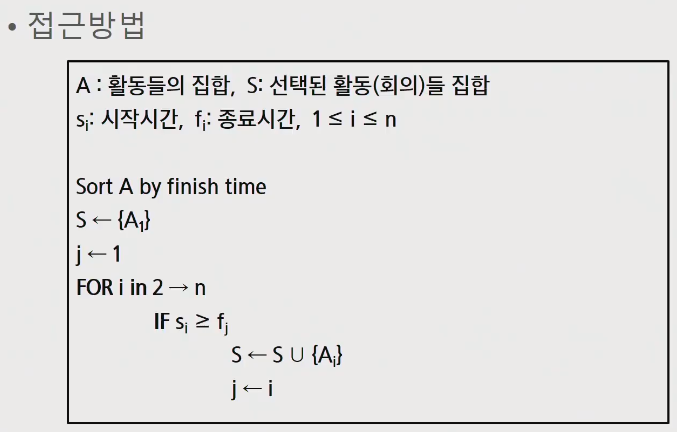

- 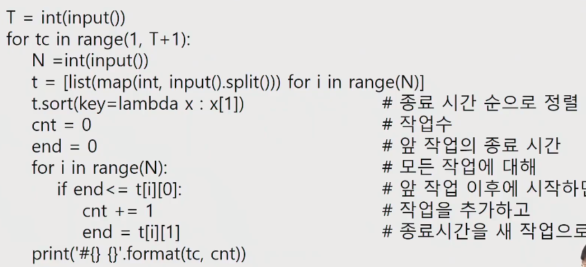
  - 종료시간 기준 오름차순 정렬

## 5203_베이비진

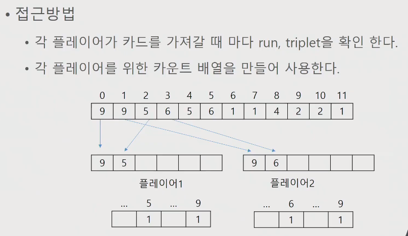

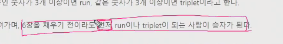

- 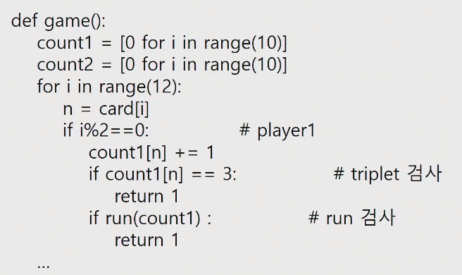

- 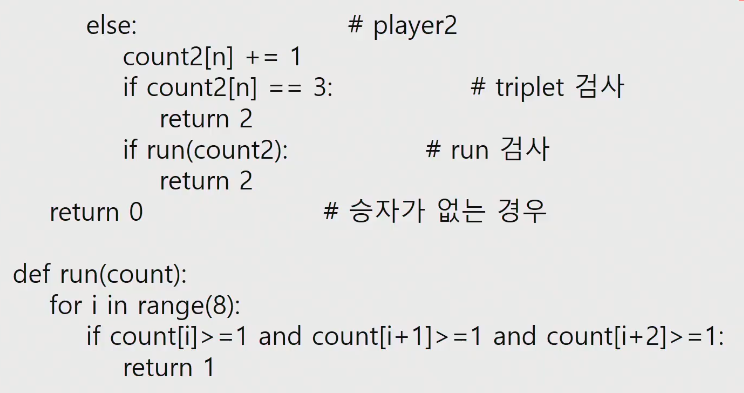

## 정식이

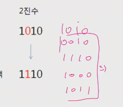

2진수의 경우 각 자리를 다른 수로 바꿔보기

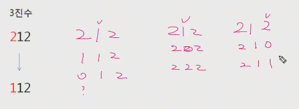

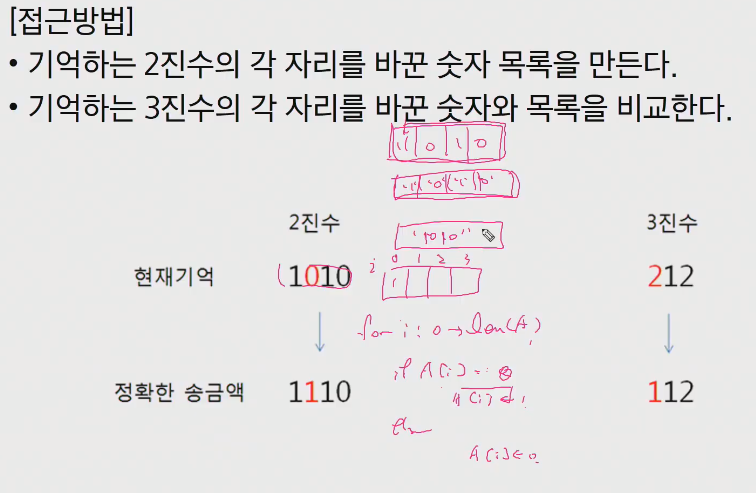

## 격자판의 숫자이어붙이기

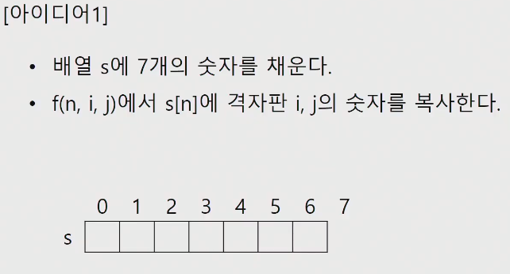

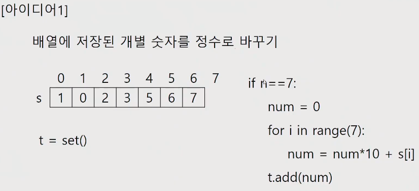

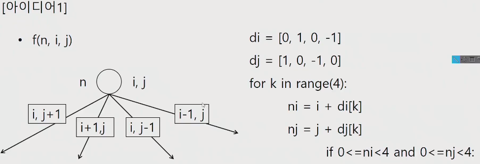

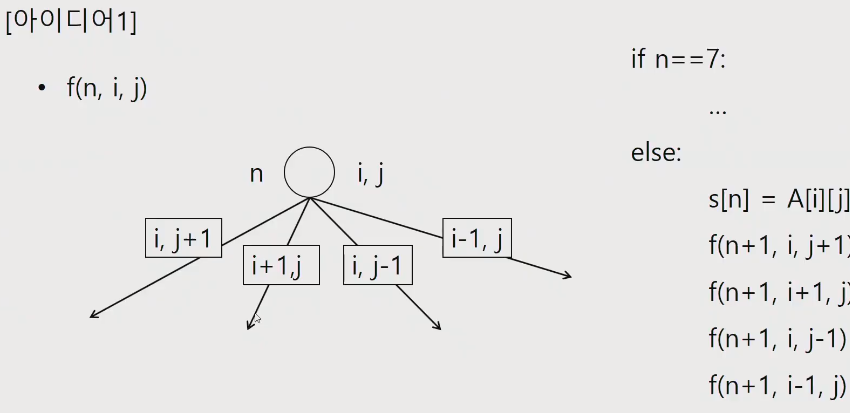

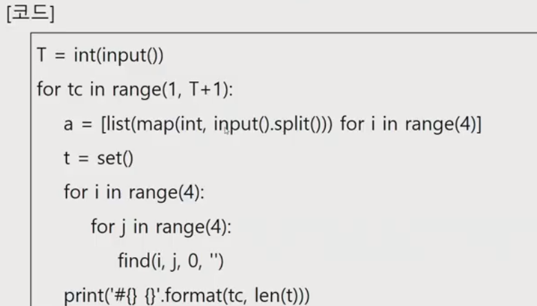