# 완전검색, 그리디

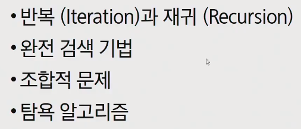

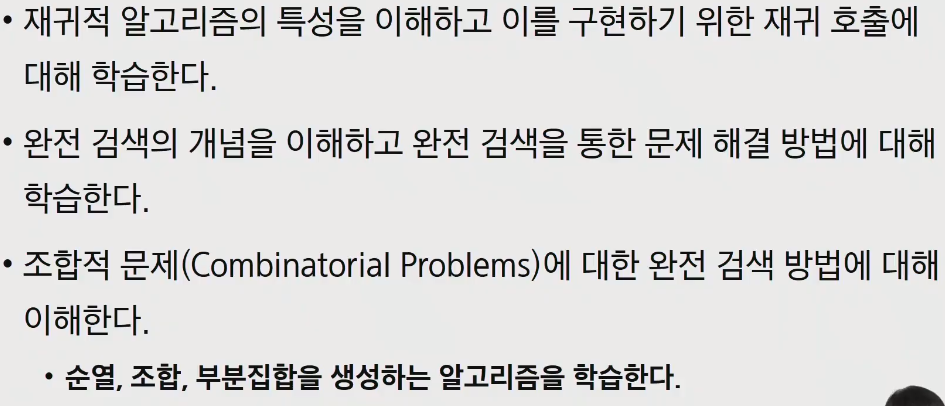

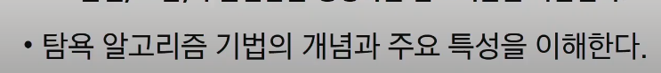

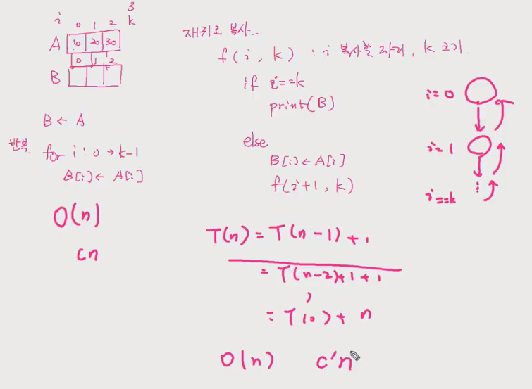

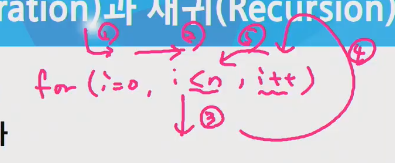

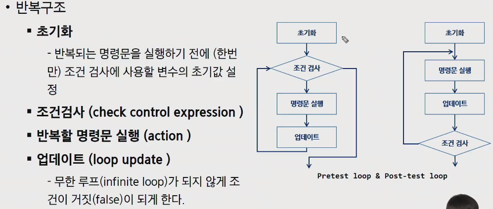

- `while 1:` 을 하고 나중에 조건문을 붙이는 것이 초기화 - 명령문 - 업데이트 - 조건검사 와 유사하다
-  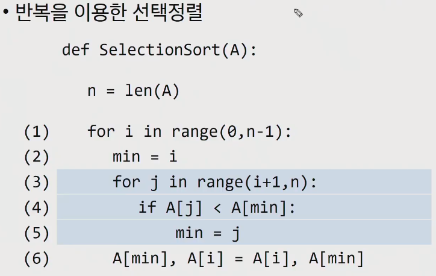

## 재귀함수

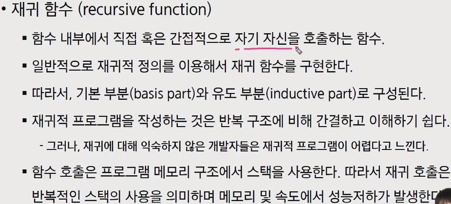

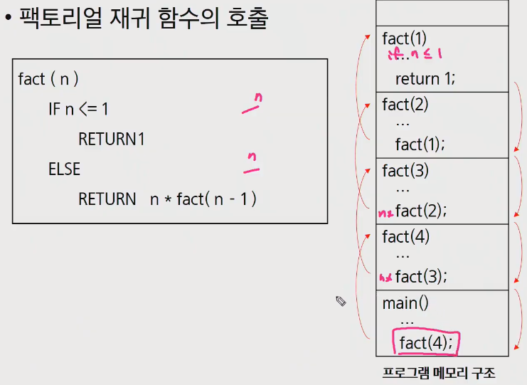

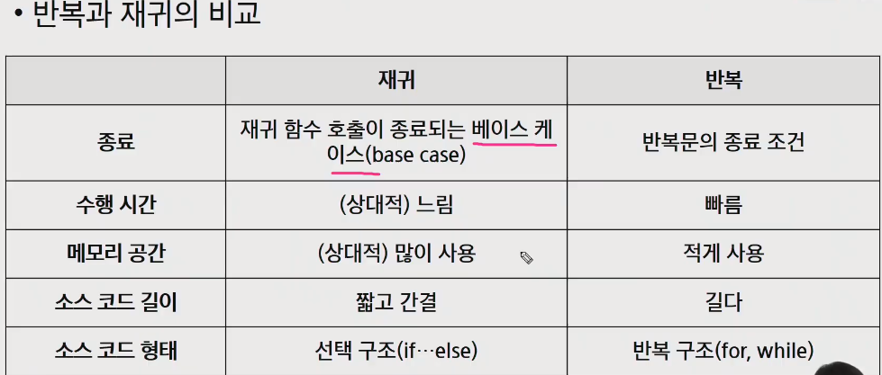

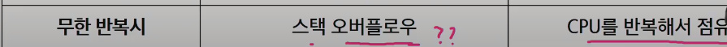

### 연습문제1

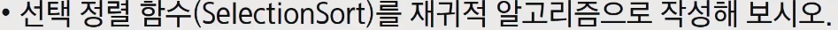

### 연습문제2

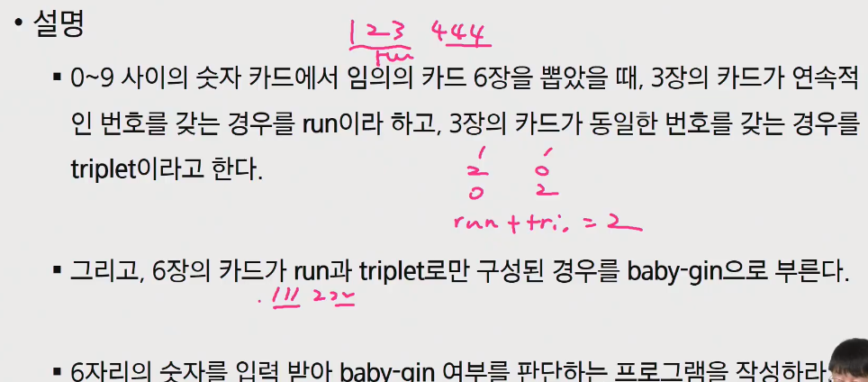

## brute-force

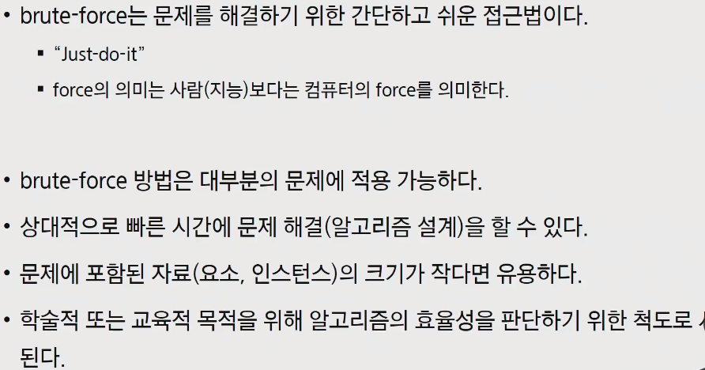

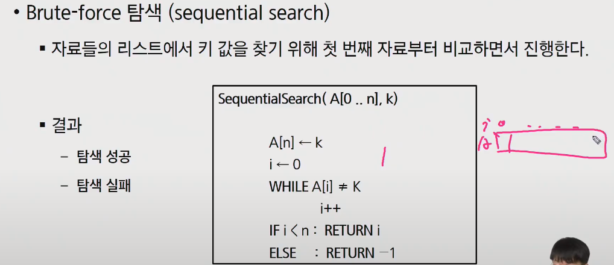

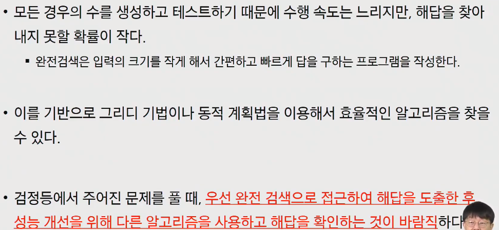

### 여행사문제

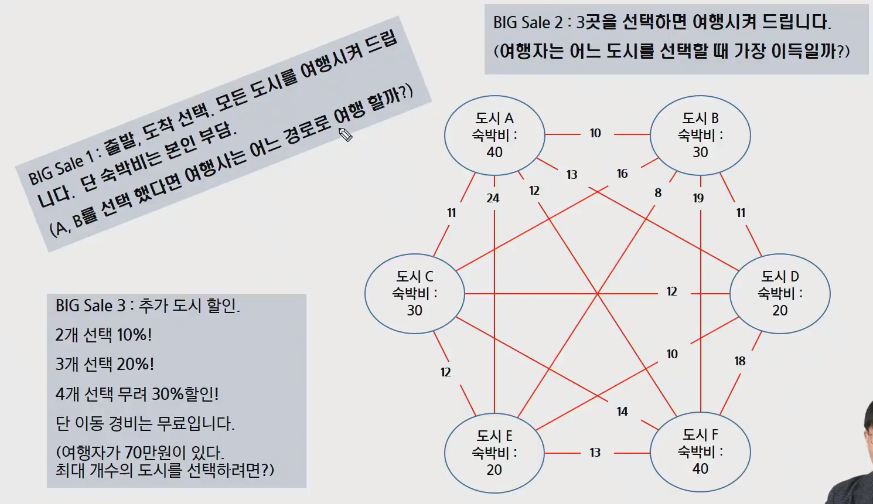

가능한 모든경우를 만들어서 제일 유리한 경우를 선택

## 순열(Permutation)

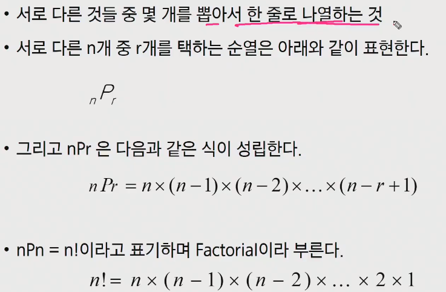

- 좀 다르게 생각해보면 아래와 같이 표현하기도 한다

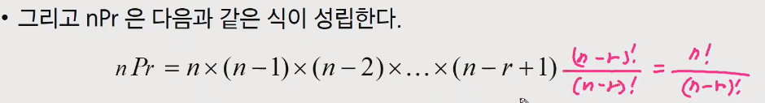

- 도시를 방문하는 순서를 정하면 비용을 줄일 수가 있는데 이와 관련된 문제가 TSP

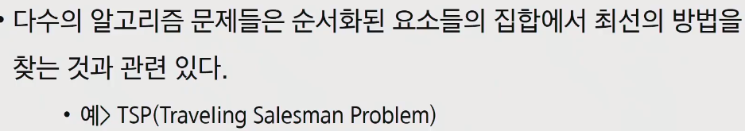

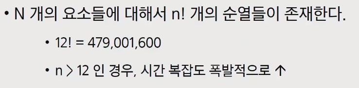

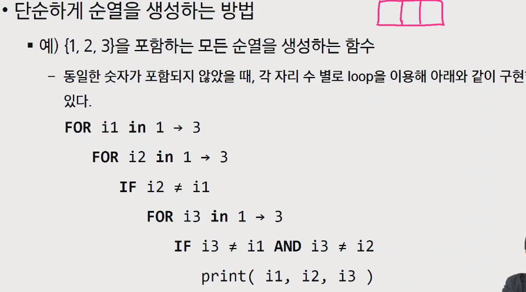

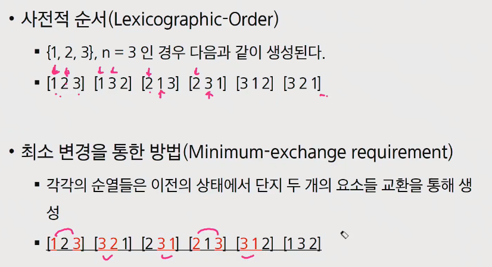

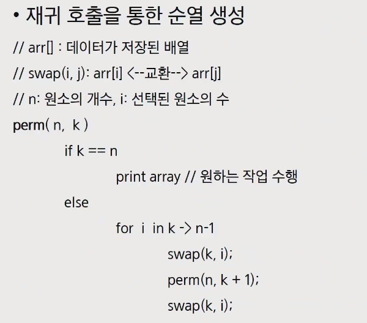

## 조합(Combination)

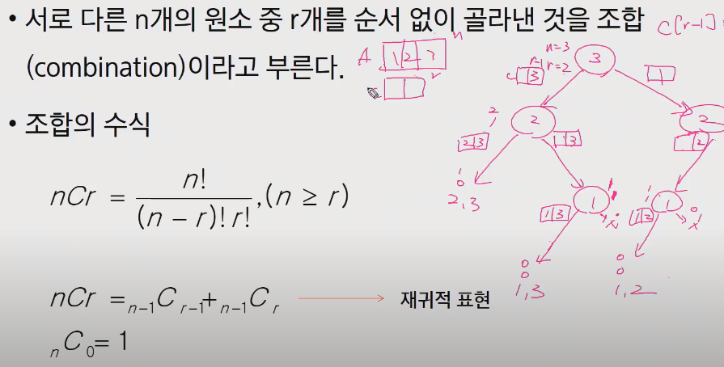

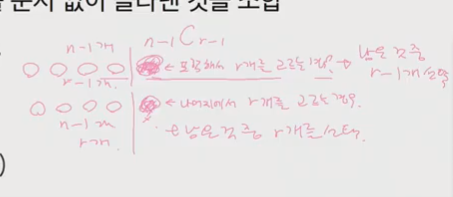

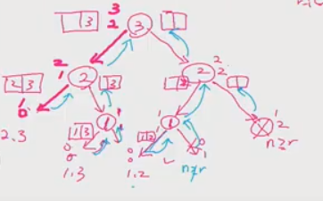

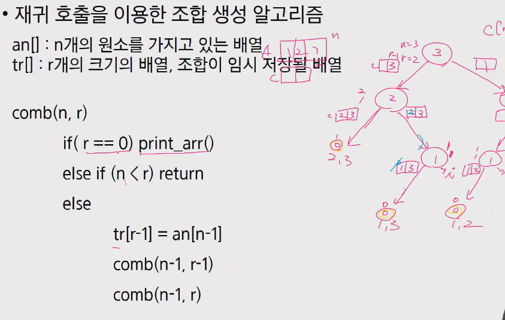

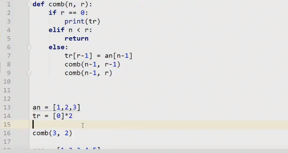

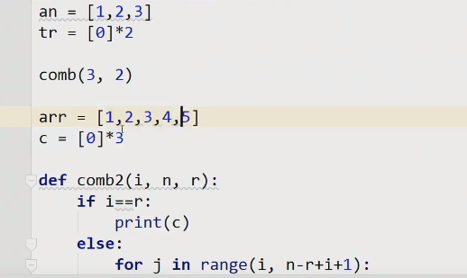

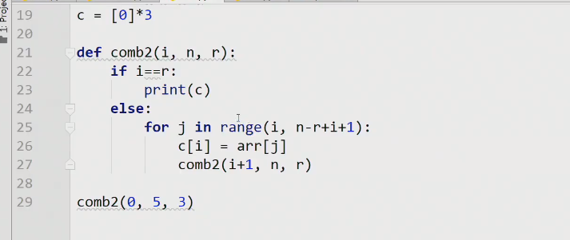

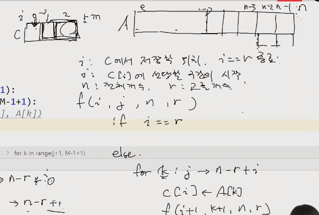

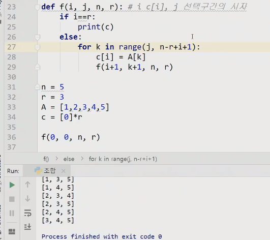

## 보충수업

### 순열(반복)

