# django 인증시스템


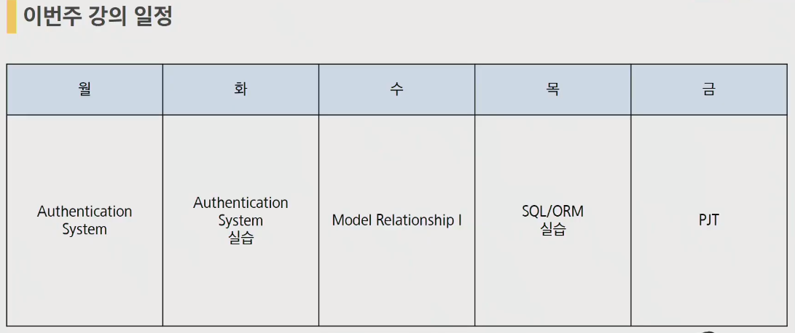

## Authentication


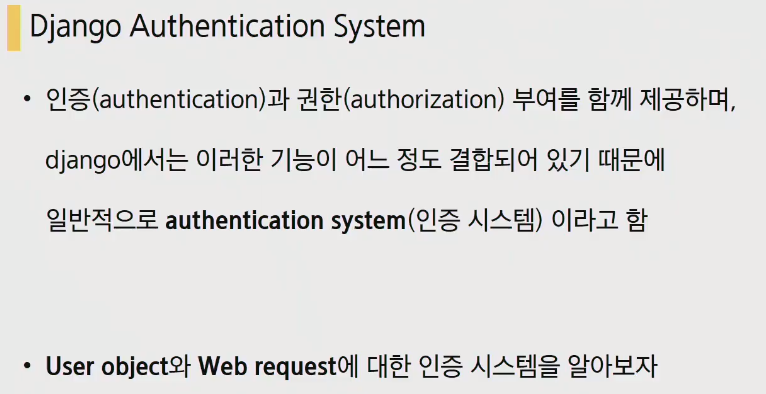

인증, 권한이 어느정도 연결되어 있기 때문에 통용해서 사용된다.

Key point는 **User object와 Web request** 먼저 web request를 살펴보겠습니다.

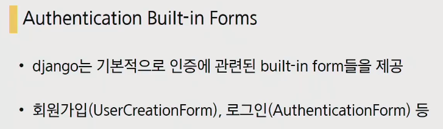

인증 시스템 사용시에는 인증에 관련된 built-in-form을 적극 활용하겠습니다.

- 오늘 필요한 것들(requirements.txt)

  

  django form까지 했을때의 프로젝트를 받아 온 겁니다.

  불필요한 주석 제거되어있고 CRUD구현되어있는 상태

### 실습

유저 관련된 앱을 만들겠습니다. 앱의 이름은 `accounts`

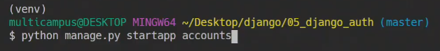

settings.py에 등록!

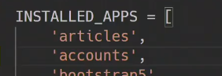

accounts앱에 urls.py를 만들어 줍니다. 프로젝트에서도 url와 이어줄 경로를 만들어줍니다.


DB가 없기 때문에 migrate를 한번 해주어야 합니다. 그리고나서 서버를 켜줍니다. 기본적인 부트스트랩은 적용되어 CRUD는 작동되는 상태.


## Web request


로그인 한경우라면 User클래스의 인스턴스, 로그인 하지 않은 경우 Anonymoususer 클래스의 인스턴스로 설정(인증되지 않은 사용자에 대해서 나타내는 클래스 Anonymoususer가 존재)

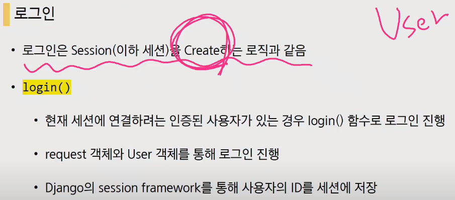

결국 User에 관한 것도 CRUD와 같은 흐름으로 진행이 됩니다.


로그아웃은 세션을 지우는 행위와 같다.

쿠키와 세션을 들어가기전에 HTTP의 특성을 확인해볼 필요가 있습니다.

HTTP는 약속. 웹상엣 이루어지는 모든 데이터 교환의 기초. 서버간의 프로토콜(요청과 응답)


왜 쿠키를 배우기 전에 HTTP를 배우는가

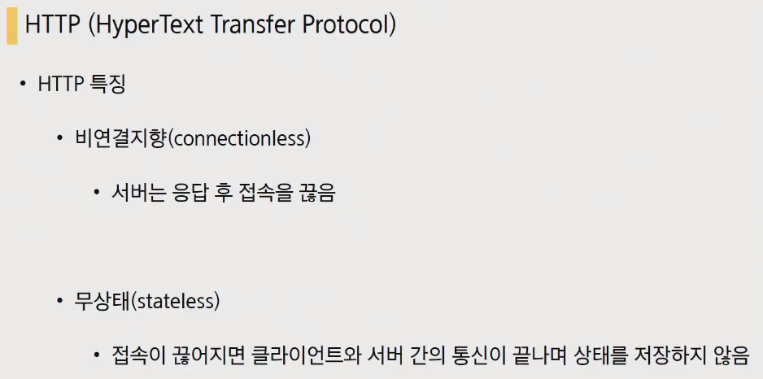

- **비연결지향(connectionless)**
  - 서버는 응답 후 접속을 끊음
  - 우리는 받은 문서를 볼 뿐, 계속 서버와 연결되어 있는 것이 아니다
- **무상태(stateless)**
  - 접속이 끊어지면 클라이언트와 서버간의 통신이 끝나며 상태를 저장하지 않는다.
  - 메인페이지에서 로그인을 했는데 뉴스탭으로 이동을 하면 로그인이 없어지나?? 로그인은 풀리지 않습니다. 무상태의 특징을 생각해보면 로그인이 풀려야합니다. 웹페이지 상에서만 로그인이 되어야하고 다른 페이지로 갈 경우 로그인의 상태는 풀려야합니다.
  - 우리는 이 상태를 계속 유지해야할 필요가 있고, 그렇기 때문에 **쿠키**라는 개념이 등장하게 됩니다.

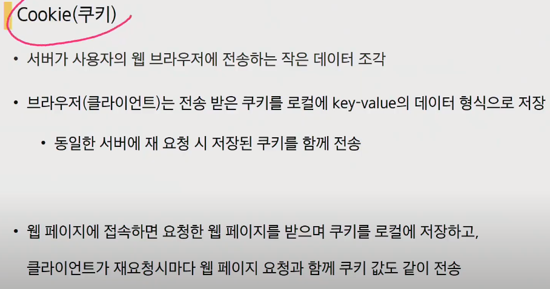

key-value형태로 쿠키를 저장. 같은 서버에 재 요청할 때 저장된 쿠키를 함께 전송.(요청을 할때 매번 쿠키와 함께 보냄)

웹 페이지에 접속하면 요청한 웹 페이지를 받으며 쿠키를 로컬에 저장하고, 클라가 재요처시마다 웹페이지 요청과 함께 쿠키 값도 같이 전송

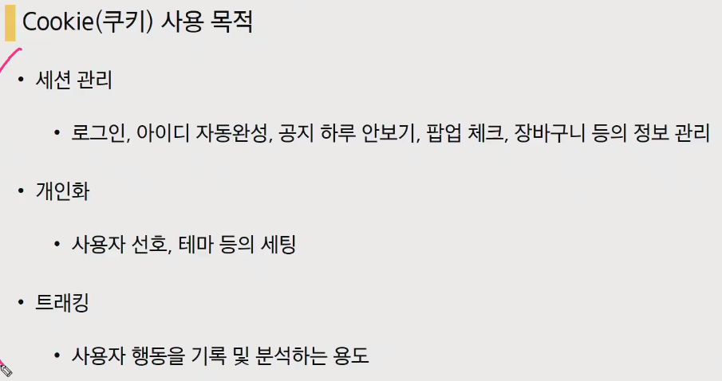

- 쿠키의 사용목적
  - **세션관리(상태저장)** : 로그인, 아이디 자동완성, 공지 하루 안보기, 팝업체크, 장바구니 등의 정보관리
  - 개인화 : 사용자 선호, 테마 등의 세팅
    - 직접 구현하지는 않고, 이런 용도가 있다는 것만 알고있으면 됩니다 
  - 트래킹 : 사용자 행동을 기록 및 분석하는 용도
    - 직접 구현하지는 않고, 이런 용도가 있다는 것만 알고있으면 됩니다 

### 세션(Session)


쿠키안에 session id가 저장되어있음.

처음 문서를 받을때 쿠키를 함께 받았는데 세션id와 함께 받습니다. 그리고 나서 뉴스페이지에 들어갈때 방금 받았던 쿠키를 함께 보냅니다(세션id와 같이있는). 


실제적으로는 계속해서 로그인을 유지되고 있는 것처럼 보이는 겁니다.

계속해서 매 요청마다 쿠키(+세션id)를 보내면서 다시 로그인을 하는 것.

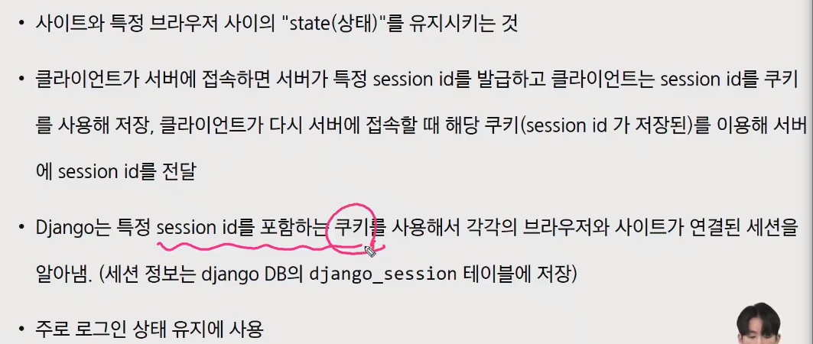

session정보는 django_session이라는 테이블에 저장된다. 테이블이라는 것은 앱에 존재하고 이 앱은 이미 settings.py에 등록되어있다.

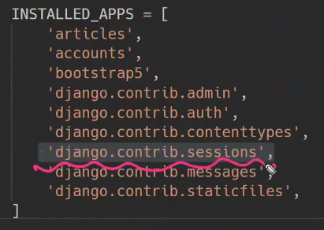

쿠키가 영원히 유지되지는 않을 겁니다 


Session cookie : 세션이 종료되면 삭제


Permanent cookie(영구적인 쿠키) : Expires 속성에 지정된 날짜 혹은 Max-Age 속성에 지정된 기간이 지나면 삭제

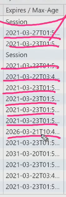

#### 동작확인


쿠키를 어디서 확인 할 수 있는가?

f12누르면 네트워크 탭에 쭈욱 뜨는데


application tab의 storage부분의 cookies를 확인해보면

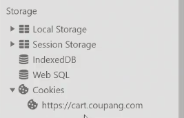

쿠키는 key-value값이라고 했는데 여기에 sid라는 것이 있습니다.

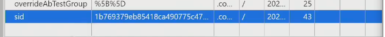

이 쿠키를 삭제하고 나서 새로고침을 해보면 기존의 장바구니에 담고있던 정보가


사라지고 장바구니가 비어있게 됩니다 .

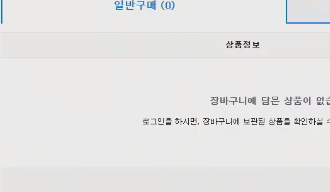

요청을 보내는 쿠키(session id)와 응답을 받을 때 쿠키(session id)와 동일하다는 것을 알 수 있습니다.

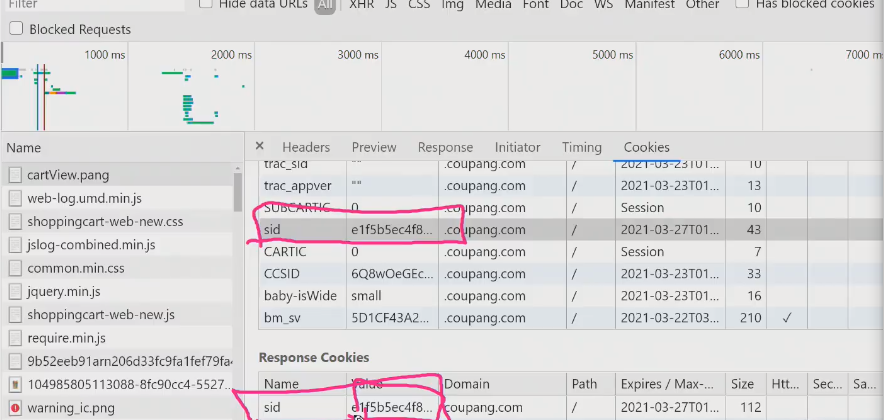


보통 f12를 눌러서 네트워크 탭을 확인해보면

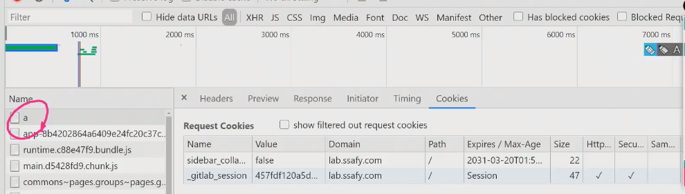

제일 위에 있는 파일을 확인해보면 , gitlab_session부분이 로그인 키를 담당하는 쿠키입니다. 이것을 지우고 나서 새로고침을 해보면 다시 로그인을 해야하는 창이 열리게 됩니다.


돌아와서 다시 로그인 부분을 보면


세션은 상태를 유지해주고 상태를 없애는 것이 바로 로그아웃

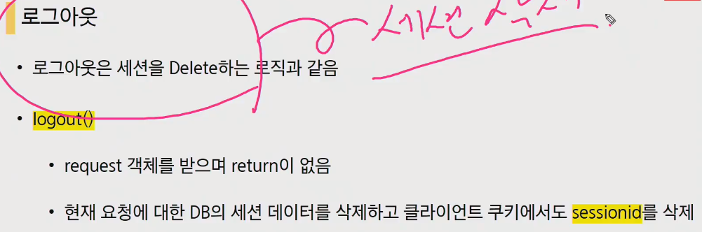

쿠키는 서버로 부터 받아서 브라우저에 키밸루값으로 저장됩니다. 세션은 서버, 쿠키, 캐시 등 설계에 따라서 저장되고(django에서는 서버에 저장됨) 실제 사용되기 위해서 session id를 발급받는다.

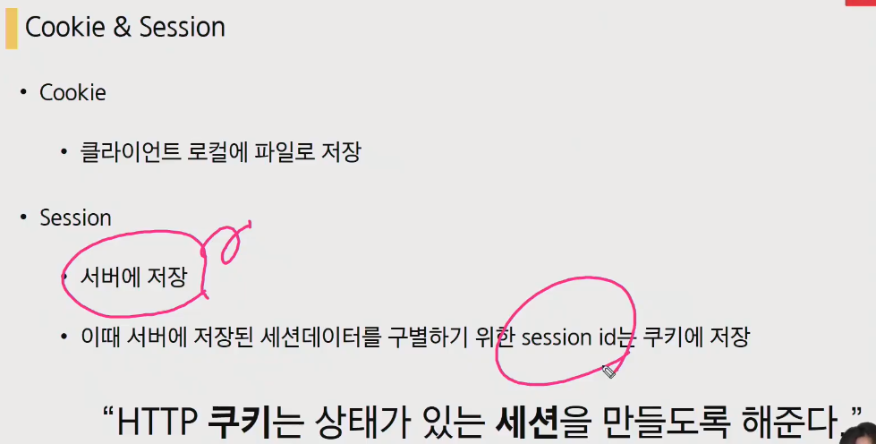

**상태가 있는 세션을 만들기 위해서 쿠키가 존재한다.**

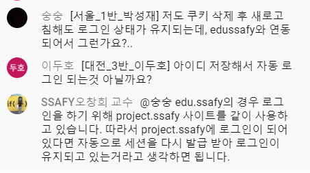

---

accounts에 있는 urls.py에서 경로지정

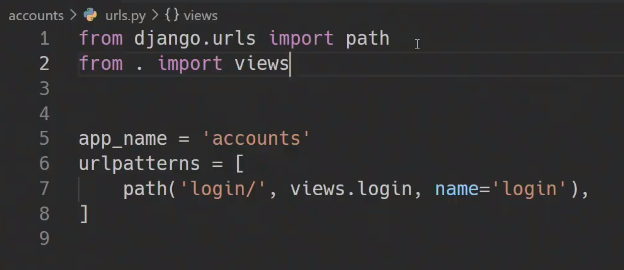

views.py로 와서 함수작성

new, create는 method로 구분했는데 로그인은 세션을 create하는 것이라고 했습니다. 따라서 GET일때와 POST일때 하나씩 작동해야함

GET - 로그인 문서주기

POST - 로그인 진행하기

```python
from django.shortcuts import render

def login(request):
    if request.method == 'POST':
        pass
    else:
        pass
```

django는 로그인에 관련된 내장함수가 존재한다고 했습니다 .따라서 따로 form만들지는 않고 가져 올 것입니다.(우리가 form을 만들지 않고 가져오는 중입니다.)

```python
from django.shortcuts import render
# from django.contrib.auth import
from django.contrib.auth.forms import AuthenticationForm

def login(request):
    if request.method == 'POST':
        pass
    else:
        form = AuthenticationForm()
    context = {
        'form': form
    }
    return render(request, 'accounts/login.html', context)
```

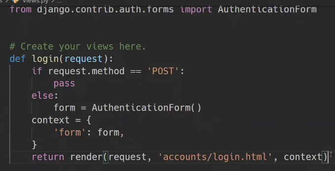

accounts form에 templates와 accounts만들어주고 html을 만들어줍니다.

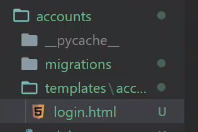

바로 상속을 받고, (현재 내장폼을 사용하기 때문에 따로 forms.py를 사용하지 않습니다.)

```html



<h1>
    로그인
</h1>
<form action="" method="POST">
    
    {{ form.as_p }}
    <input type="submit">
</form>
```


이제 폼을 작성해서 제출을 하게되면 폼 내용을 실제로 받아서 저장을 해야하니, POST부분을 작성해줍니다.

```python
from django.shortcuts import render
from django.contrib.auth import login
from django.contrib.auth.forms import AuthenticationForm

def login(request):
    if request.method == 'POST':
        form = AuthenticationForm(request, request.POST)
        if form.is_valid():
            # 우리는 저장을 했는데 우리는 뭘하느냐??
            # 세션 CREATE되어야합니다. => login함수
            
    else:
        form = AuthenticationForm()
    context = {
        'form': form
    }
    return render(request, 'accounts/login.html', context)
```


특이하게 첫번째 인자가 request고 두번째가 데이터입니다

로그인 함수는 request와 user객체를 받습니다.

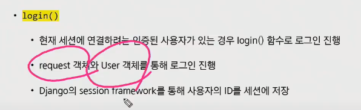

```python
from django.shortcuts import render
from django.contrib.auth import login
from django.contrib.auth.forms import AuthenticationForm

def login(request):
    if request.method == 'POST':
        form = AuthenticationForm(request, request.POST)
        if form.is_valid():
            # 우리는 저장을 했는데 우리는 뭘하느냐??
            # 세션 CREATE되어야합니다. => login함수
            # 지금 login이름이 겹치기 때문에 바꿔줍니다.
            login(request, form.get_user())
    else:
        form = AuthenticationForm()
    context = {
        'form': form
    }
    return render(request, 'accounts/login.html', context
```

지금 login이름이 겹치기 때문에 바꿔줍니다.

```python
from django.shortcuts import render
from django.contrib.auth import login as auth_login
from django.contrib.auth.forms import AuthenticationForm

def login(request):
    if request.method == 'POST':
        form = AuthenticationForm(request, request.POST)
        if form.is_valid():
            # 우리는 저장을 했는데 우리는 뭘하느냐??
            # 세션 CREATE되어야합니다. => login함수
            # 지금 login이름이 겹치기 때문에 바꿔줍니다.
            auth_login(request, form.get_user())
    else:
        form = AuthenticationForm()
    context = {
        'form': form
    }
    return render(request, 'accounts/login.html', context
```

자 이제 의문점 해결해 봅시다


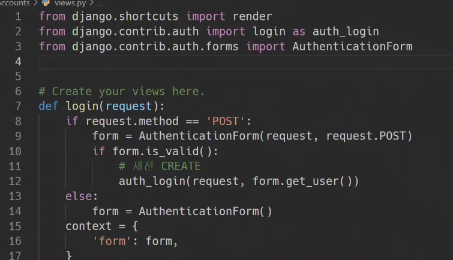

django git hub에 들어와서 django.contrib.auth.forms로 들어가서 AuthenticationForm을 살펴봅시다.


AuthenticationForm도 사실 Form을 상속받은 클래스였습니다. 첫번째인자로 무조건 request가 들어간다는 것을 확인할 수 있습니다.

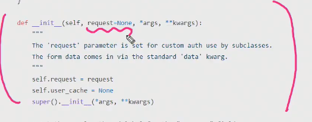

모든 Form의 최상위 BaseForm확인해보면

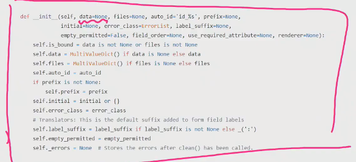

data가 마침 첫번째라서 이를 상속받는 클래스의 첫번째 인자는 request, 두번째인자는 data가 들어가게 되는것.

```python
from django.shortcuts import render
from django.contrib.auth import login as auth_login
from django.contrib.auth.forms import AuthenticationForm

def login(request):
    if request.method == 'POST':
        # form = AuthenticationForm(request, request.POST)
        form = AuthenticationForm(request, data=request.POST)
        if form.is_valid():
            # 우리는 저장을 했는데 우리는 뭘하느냐??
            # 세션 CREATE되어야합니다. => login함수
            # 지금 login이름이 겹치기 때문에 바꿔줍니다.
            auth_login(request, form.get_user())
            return redirect('articles:index')
    else:
        form = AuthenticationForm()
    context = {
        'form': form
    }
    return render(request, 'accounts/login.html', context
```

모델폼들은 데이터가 첫번째 인자로 왔는데 AuthenticationForm은 request가 첫번째 인자로 오는 것을보니 모델폼은 아니라는것을 확인할 수 있다.

form.get_user는 user를 준다.


현재 우리는 로그인할 유저가 없습니다. 회원가입 구조가 안짜여져 있기때문에 superuser를 한번 만들어 보겠습니다.

```bash
$python manage.py createsuperuser
```

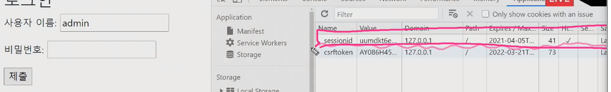

runserver후 로그인을 해보면 네트워크에 위와같이 sessionid가 저장되어 있다. 이는 django에서 DB에 저장된다고 했으니. 아래와 같이 확인이 가능하다.


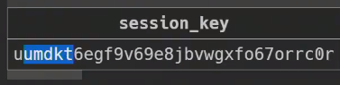


django DB에 저장되어있는 session_key와 네트워크에서 확인한 쿠키의 value가 같은값인 것을 확인할 수가 있습니다.

Expires/ Max-Age를 보면 permanent cookie인 것을 확인할 수있습니다.


base.html에서 django는 기본적으로 내장함수로 user를 주고 있다고 했습니다. 따라서 {{ request.user }}를 해보면 우리가 지정했던 user id가 나오게 됩니다.

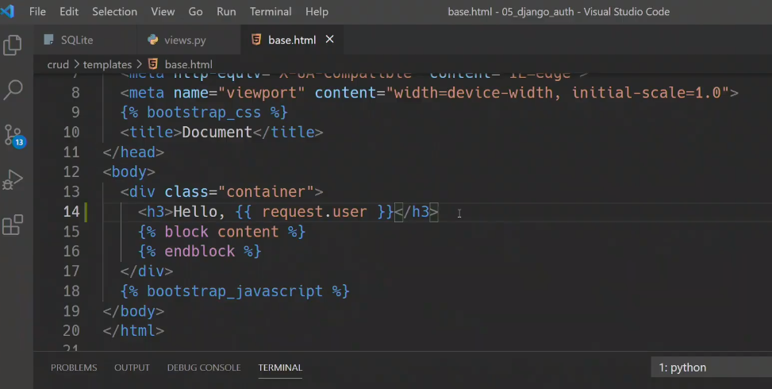

로그인 상태라면 Hello, Admin(지정해준 사용자 id) 로그인 상태가 아니라면, 기본값인 AnonymousUser를 확인할 수 있습니다 


## 웹엑스시간

로그인 : 나를 식별해 주세요!

라는 것인데 어떻게.. 식별을 할 것인가? 현실에서 


임시영업중 상황이라고 생각하고

1. 소수의 몇몇 사용자에게 수동 계정을 발급(직접발급만 가능)

2. 정식으로 회원가입 가능하게 하기

권한이 있는사람만 수정, 삭제가능하게 하려면 현재에서는 불가능 따라서

3. 작성자와 소유게시물
4. 팔로우, 좋아요

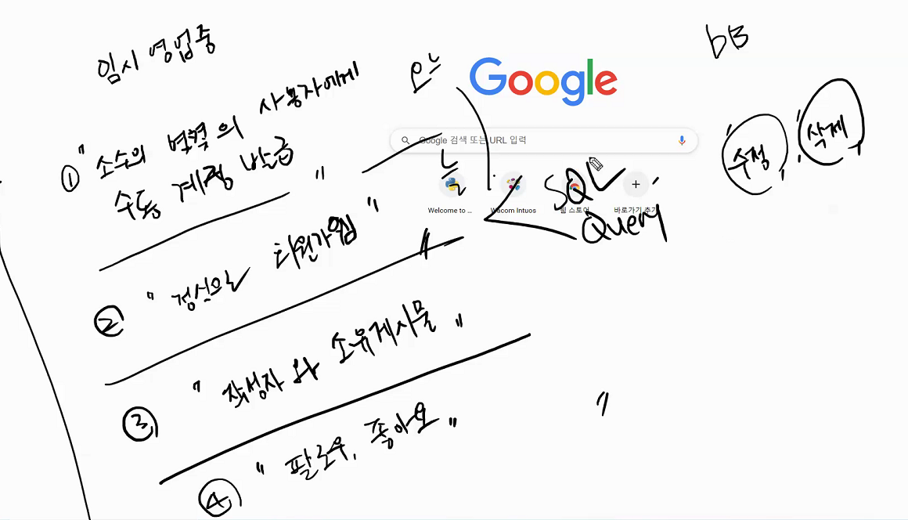


오전시간에는 1(수정계정발급)번까지만 배운 것.

## HTTP

게임같은 것을 할때 우리는 계속해서 연결이 되어있다고 생각을 합니다. 그렇다면 몇초 단위로 도대체 요청을 보내야 하는 겁니까? 0.000001초마다 위치값을 보내고 이런식으로 게임이 진행이 될까요? 너무 비효율적이고 이상합니다. 말이 안됩니다.

채팅구현만 하더라도 말이 안됩니다. 내용이 계속해서 갱신되도록 몇초마다 지속적으로 요청을 보내야 할까요?? 이것도 이상합니다. 이렇게 내가 요청하지 않아도(request - response세상없이도) response를 받아오는 상황이 가능한것인가?? 게임에 대해서 얘기를 할때는 **Socket통신(구독경제)**이라는 말이 나오게 됩니다.

또 다른 방법으로는 다른 사용자의것을 빌려서 통신?(남의컴퓨터에서 요청을 보내기)(socket과는 또 다른 방법)

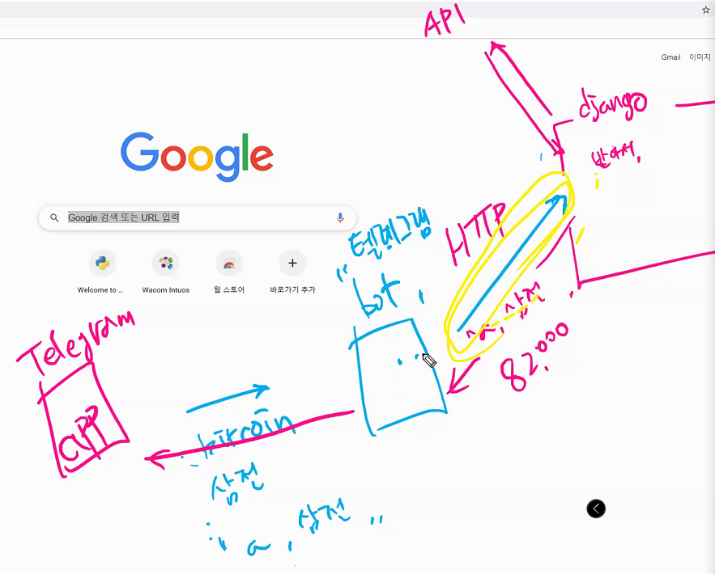

- Socket통신

채팅. 채팅이 없다면 이 프로그램이 안돌아가나요? 그런게 아니라면 채팅은 마지막에 합시다이기 때문에 지금 배우는 것.


실시간으로 서버와 클라이언트간에 양방향 통신이 가능합니다. 

---


지금까지 우리는 로그인은 계속 유지 된다고 알고있었습니다. 하지만 사실은 아닙니다. f12 -> application -> Cookies확인

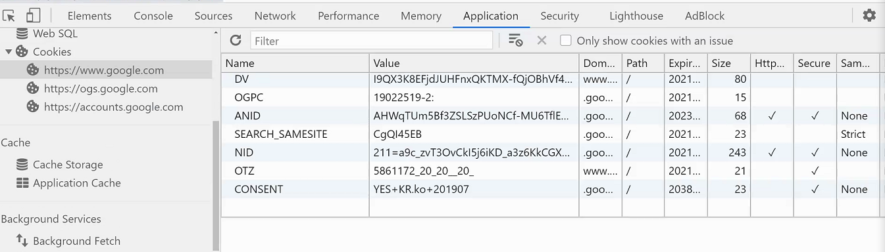

이 중에는 내가 어떠한 계정으로 로그인 해있다는 정보가 담겨져있다.

결론. 다른 페이지를 갈때마다 우리의 손목에 있는 입장태그를 보여줘서 유지가 되었던 것.

---

게시판 관련된 내용은 articles에 존재, 그렇다면 사용자 관련된 내용은??? accounts라는 앱에 존재하는 것이 django의 국룰

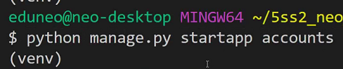

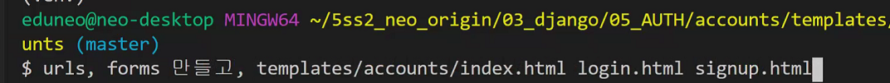

superuser또한 user이기 때문에 user를 적어놓은 table이 필요하다. accounts의 models의 User클래스(models은 여기서 사용되지는 않음)

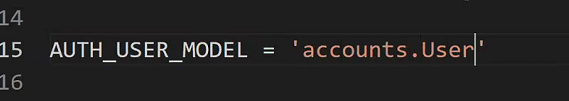

테이블이있다? => 모델이있다 => 어디에 있는가?


이 User때문에 우리가 form을 만들지 않아도 사용할 수가 있는 것임. 내부를 잠시 까보면

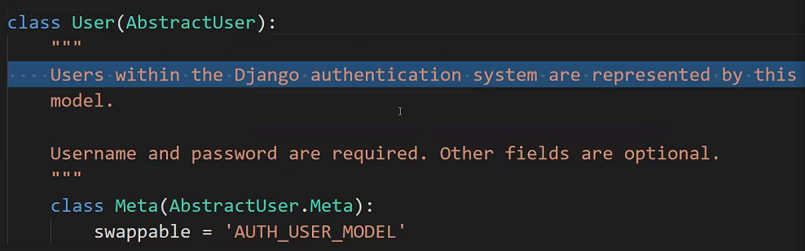

AUTH_USER_MODEL이라는 스트링이 들어가있는데 이게 무엇이냐 AUTH_USER_MODEL이라는 상수로

AbstarctUser가 핵심인데, 이것의 껍데기가 바로 User임. 근데 닉네임, 생일, 주소 등 더많은 정보를 저장하고 싶다면 패키지는 건드는 것이 아니므로


Abstract라는 애를 상속받아서 추가를 해줘야만한다.

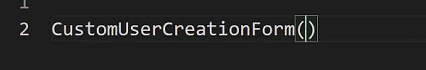

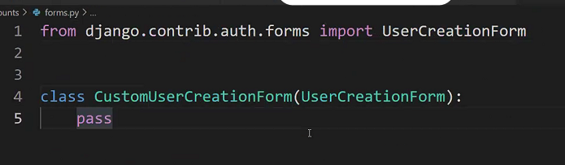


---

오늘은 큰 그림만 봅시다..

로그인, 로그아웃, 사인업을 봅시다!

settings.py에는 생각보다 많은 것들이 받아져 있습니다. settings에서 무언가를 가져올게 많다.

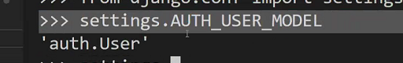

기존에 많은 것들이 저장되어있고 이를 덮어 씌우는 것이

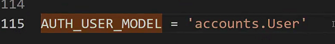


스트링을 읽어서 클래스를 읽어오는 것이 get_user_model() => 실행하면 클래스를 리턴하는 함수


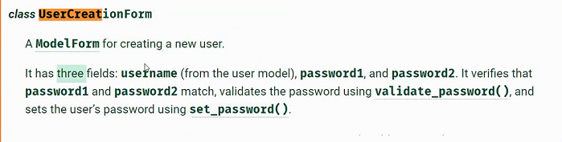

UserCreationForm은 ModelForm


로그아웃 : 팔찌떼기, DB에서의 데이터 삭제

유튜브 : 세션, 쿠키설명 참고


## 오후수업


debug, request, auth, messages =>{{ request.user }} 처럼 request를 바로 사용할 수 있었던 이유


login 링크를 추가

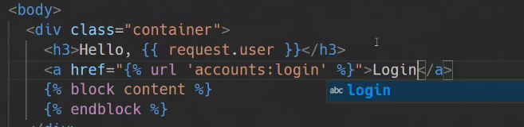


django settings를 보면 sessions에 대한 설명이 되어있는 부분이 있다.


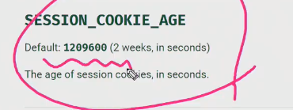

기본값이 2주로 되어있는것을 확인할 수 있다. => session cookie의 life time설정이 가능하다.(따로 부여하지 않을 경우에는 2주가 되는 것)

따로 설정을 하고 싶다면??? settings.py에 들어가서

```python
DAY_IN_SECONDS = 86400
SESSION_COOKIE_AGE = DAY_IN_SECONDS
```

urls,py

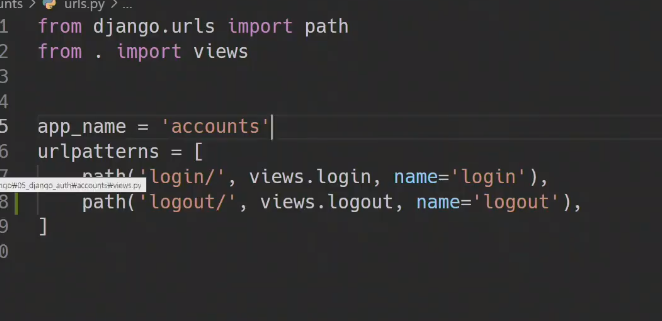

views.py

```python
from django.contrib.auth import logout as auth_logout
```

logout이름이 겹치기 때문에 auth_logout으로 이름변경


```python
def logout(request):
    auth_logout(request)
    return redirect('articles:index')
```

decorators를 사용해서 단단하게 해주자

```python
from django.views.decorators.http import require_POST

@require_POST
def logout(request):
    auth_logout(request)
    return redirect('articles:index')
```


logout 은 cookie에서도 지우고 session data에서도 삭제한다.

로그인이 되면 로그인 창이 보여질 필요가 없다. => 로그인 사용자와 비로그인사용자의접근권한을 나눌 겁니다.


1. 속성을 사용한 방법 : is_authenticated
2. 데코레이터를 사용한 방법 : login_required


return이 boolean값이다. user에 대해서는 True, anonymous에 대해서는 False.

로그인 했는지 안했는지만판단


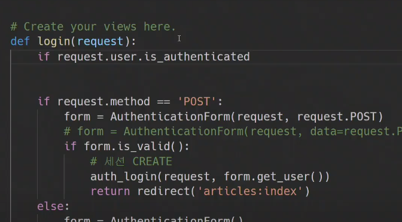

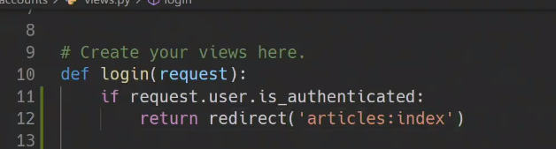

---

졸다가..

3시수업


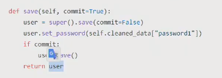


User에 관해서 C를 했습니다. 이제 R U D가 남았습니다. R은 패스하고(admin site에서도 확인가능함) Delete가 간단하니 D 먼저보자면

Delete는 로그아웃이 아닌 '회원탈퇴'를 의미합니다. 경로를 지정하고,


views.py로 갑니다

```python
@require_POSt
def delete(request):
    if request.user.is_authenticated:
        request.user.delete()
    return redirect('articles:index')
```

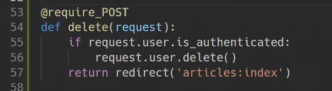

base.html

logout 아래쪽에


- 이제 Update

urls.py에 경로추가


views.py

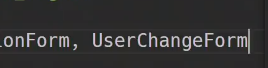

```python
def update(request):
    if request.method == 'POST':
        pass
    else:
		form = UserChangeForm()
    context = {
        'form':form
    }
    return render(request, 'accounts/update.html', context)
```

templates로 넘어가서 update.html


base.html


forms.py

```python
from django.contrib.auth.forms import UserChangeForm

class CustomUserChangeForm(UserChangeForm):
    class Meta:
        model = ??
        fields = ???
```

User class???


오늘의 마지막 내용


좌측은 accounts의 update, 우측은 articles의 update

## 보충수업

- 


save에 return 값이있다

- 

  authentication(인증)은 서버가 너 누구야하는 과정

  authorization(권한)은 누군지는 아는데 그사람이 맞는지 확인하는 과정

  

- createsuperuser하기전에 반드시 migrate가 필요하다

- 

  user라는 것은 로그인하지 않아도 anonymoususer로 존재했었다.

  

  따라서 인증을 받은사람만 새글 쓰기를 해주겠다라고 해주는 `is_authenticate`를 사용 불리언값.

- 하나의 함수에 여러개의 decorators 사용이 가능하다.

- 

  next 파라미터

  

  GET주머니에 들어가있지만 실제 동작은 POST

- user change 정보가 너무 많다.

  어느정도 바꿔야됨 accounts내부에 forms.py만들고

  

  

  userchageform은 ModelForm과 연결되어있어서Meta와 연결가능

- 


