# DB

DB modeling이라는 것이 있다고했습니다. 우리가 사용하는 DB2개가있는데 하나는 

1. RDBMS

   관계형

   ex ) Oracle, Postgres, MySQL, **SQLite**, MariaDB ...

   SQLite는 파일하나에 담겨져 있는 것처럼 사용이 되는 DB

2. No SQL

   firebase db

   MongoDB, 

RDBMS는 가장 큰 특징은 ''스키마'' . 모델이 설계도라고하지만 이건 파이썬에서 그린거고 일단은 콜롬구조라고 하겠습니다.

AQUERY TOOL이라는 곳에 들어와서

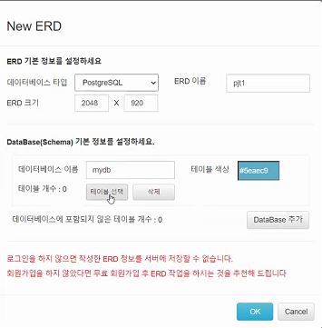

physical name(등록된 이름), logical name(사용자에게 보여지는 이름)

아래와 같이 우리는 articles라는 이름을 지은적이 없지만 admin으로 로그인해서 확인해보면 이런 이름이 사용자에게 보여진다. 이것을 logical name이라고 한다. 

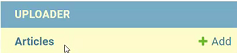

테이블 컬럼의 자료형인데 이것이 DB마다 다르다(SQLite에서는 CharField였던것이 PostgreSQL에서는 varchar라고하는 자료형이 된다.)

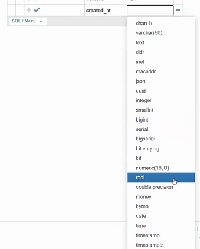

---

이제 Null부분을 볼 건데, django는 기본값이 not Null로 되어있다.

---

이제 2번째 테이블을 만들어봅시다.

여기서 어떻게 되야함 ? 연결

을이 아쉬운 사람이기 때문에 column이 더 있어야만 한다.

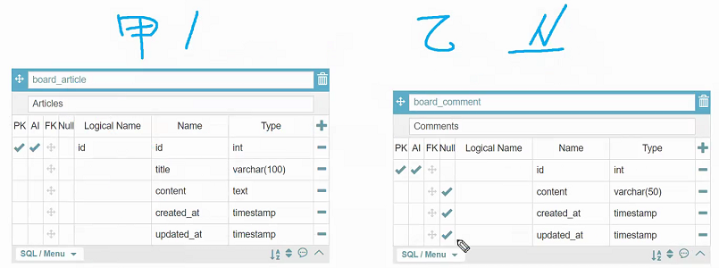

그럼 column을 하나 추가하는데 뭐라 추가하느냐 article_id로 해줘야만 한다. 이건 DB에 저장시켜지는 것과 같으니까

int도 사실 integer와 좀 다른데 쨌든 일단 integer로 해놓음

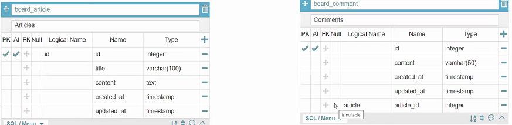

이러한 과정이 스키마를 그리는 과정, DB 모델링

이렇게 그려진 도표를 ERD(Entity Relation **Diagram**) 라고합니다. Entitiy는 CS에서는 개체. 여기서는 게시글 하나 혹은 게시글 레코드 하나

근데 여기서 Entity간에 관계가 형성되어있으니 ERD라고 하는 것

---

이제 여기에서 User까지 포함시켜서 해보겠습니다.

User는 field가 많았는데 필요한 것들만 우선 사용해 보겠음.

이제 관계설정을 해줘야 합니다. 1:N의 N에 해당하는 곳에 User를 추가

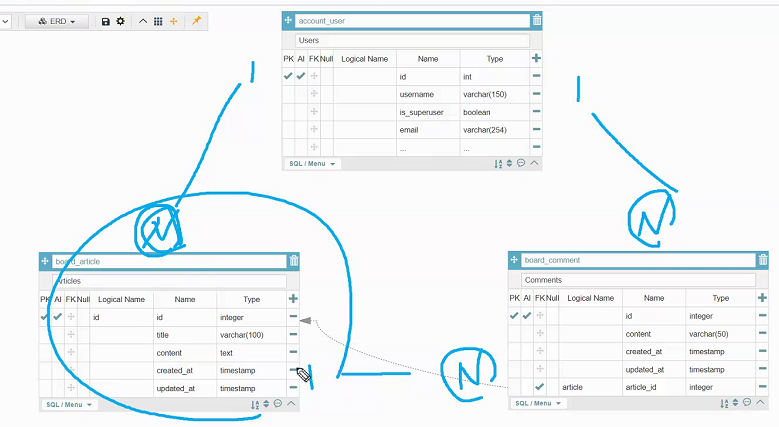

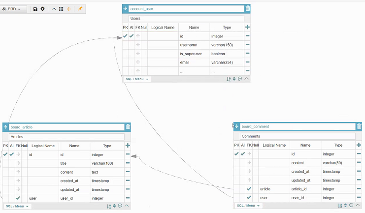

위 처럼 화살표 그리기가 조금 어렵기때문에  아래와 같이 그렸으나 

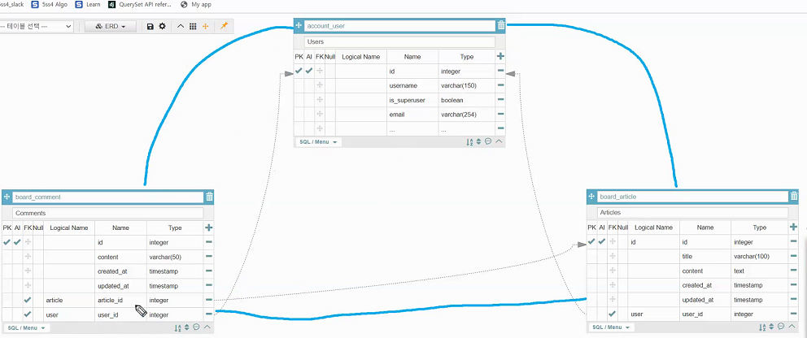

종속관계가 안보이니 아래와같은식으로 그리게 되는데 이 그림방식은crow foot방식이라고들 한다. N에 해당하는 애쪽에 까마귀 발같이 생긴것을 표시하게 됨

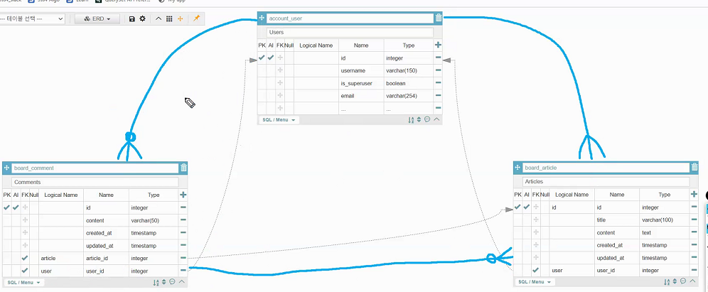

표기법을 다 알아라보다는 ERM이 복잡해질수록 테이블이 많아지게 됩니다.

다행히 ORM이 파이썬코드로 구성할수있도록 도와주고있었다는 것을 이해하고있으면 될 듯.

---

최종플젝에 10일이 있다면 5일을 투자해라라고 추천하고싶다 (그렇다고 7일을 한다고해서 완전해지는 것도 아니다) 따라서 연습을 좀 해보길 추천드리고 싶다.

https://app.diagrams.net/ 또는 https://aquerytool.com/들어가서 편한방식으로 스키마를 짜는 연습을 해보시는 걸 추천드립니다.

아직 N:M관계가 남아있기는 하니까 그걸 배우고 위연습을 좀 해보는걸로..! 우선을 진도를 좀 나갑시다

---

## database

관계형 데이터베이스의 핵심! 테이블을 사용합니다.

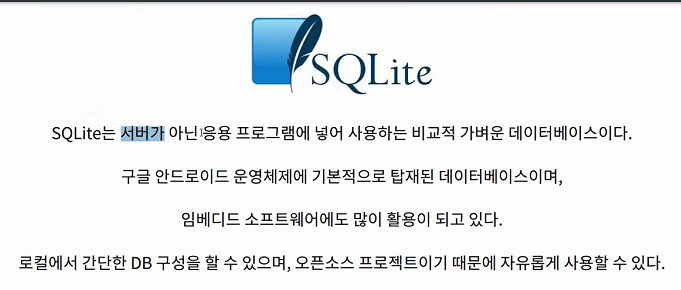

SQLite 

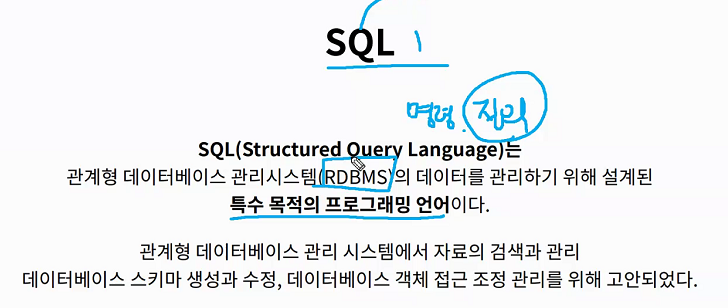

- DDL : 테이블 정의 언어

  models.py에서 하는일 그것이 바로 table 생성, 수정, 삭제

  데이터가 저장 될 테이블을 정의하기 위한 언어

  DROP : 삭제 / ALTER : 수정

- DML :데이터 조작 언어

  views에서 하는거

  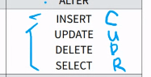

- DCL : 데이터 제어 언어

  데이터베이스 사용자의 권한 제어를 위해 사용되는 언어

  

이것들을 django에서 쓰고있나?? ORM이 알아서 제어하면서 쓰고있는 중인데 우리가 모르는 것

---

sqlite 다운로드하고, 시스템환경변수에서 path에서 경로지정 해줌

010101.. 파일이 있고 이것을 대필을 해주는 것이 SQLite인 것이고, 파일을 읽어와서 우리에게 보여주는 역할을 하는 것 또한 SQLite인 것.

그럼 이제 대필작가 불러봅시다

- database생성

  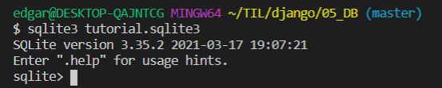

  세미콜론을 찍어야 명령을 알아듣는다

  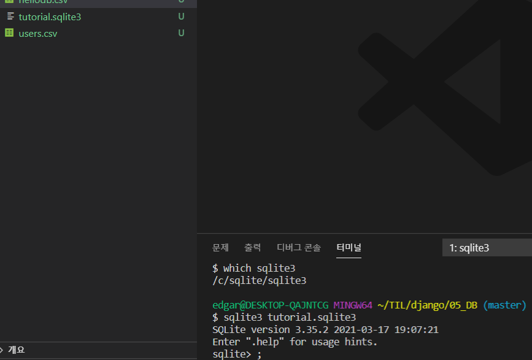

  .으로 시작하는 명령어는 SQLite는 아닙니다. SQL문에 집중하고 싶은건데 .으로 시작하는 거는 sqlite의 전용 명령어. SQL의 공용 명령문은 ;(세미콜론) 입니다. 

  

  hellodb.csv라는 데이터를 examples라는 테이블에 담겠다는 것

  

  여기서 중요한건 django ORM도움없이 DB 테이블을 만들어 냈다는것.

  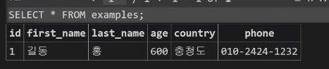

  

  그대로 써보면 데이터를 그대로 가져왔다는 것을 알 수 있습니다 

  보기좋게 좀바꿔보면

  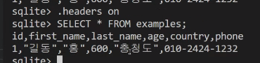

  

  

---

이번에는 Table생성을 한 번 해보겠습니다.

변수명같은애들(id, col)은 소문자, 정해진 자료형(SQL)은 대문자

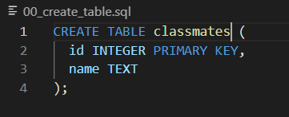

그리고 나서 sqlite를 실행해서 아래와 같이해보면

---

DB는 R이 핵심

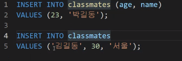

순서를 맞출거면 밑에다가, 안맞출꺼면 위에처럼

id를 껴서 테이블 확인하는 방법

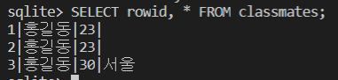

삭제 : DROP TABLE classmates;

한번에 데이터를 넣는 것도 가능

---

- Read

  

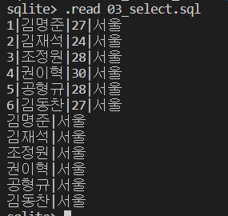

- 개수제한

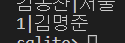

​	보통 게시글에서 내가 보고싶은 게시물의 개수설정할때 사용된다

- 범위지정

1번 뒤 부터 1개

2번 뒤 부터 2개

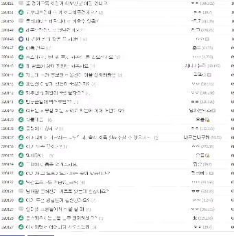

---

 

이제부터 본격적인 시작 파일하나 더 만들고

classmates중에서 특정한 조건인 사람을 가지고오려면???

---

이번에는 특정 조건값을 중복없이 가져오기

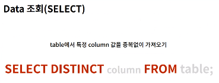

어따씀? 엑셀에서 filter를 써본사람 있겠죠

where는 이따가 다시 해야하기때문에 잠시 멈추고

---

삭제 끝내고 update끝내고 올게요

- DELETE

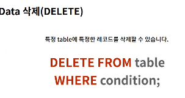

삭제합니다 classmates에서 id가 1인 친구를

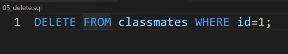

where조건없이 delete from을 하게 될 경우 table이 삭제된다

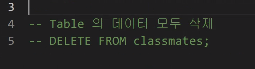

---

- Update

  

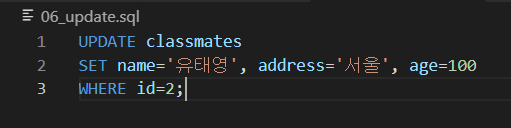

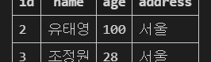

직접 한 번 해봅시다

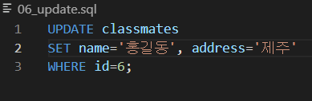

---

먼저 data를 받을 table을 만들어주고

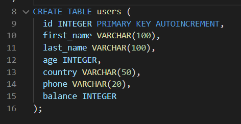

---

- WHERE문 심화

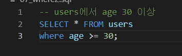

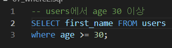

---

---

이타이밍에 슬쩍 얘기해보자면

여태까지 대문자, 소문자를 같이 했는데 사실 소문자로 해도된다. 근데 예약어는 대문자로하고 나머지를 소문자로 하는게 국룰임 ㅇㅇ

---

- 표현식

  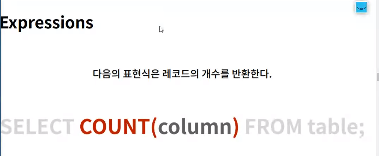

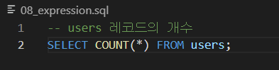

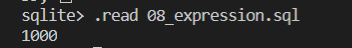

---

조건을 좀 줘봅시다

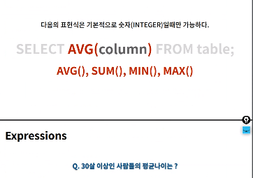

---

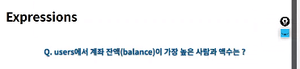

이렇게 하면 max(balance)앞에 전체 데이터가 나오게 된다

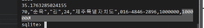

따라서 원하는 데이터를 하고싶다면

---

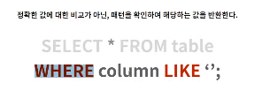

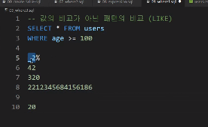

---

가장 재산이 많은 사람의 이름만 출력은 어떻게 할까요??

SELECT first_name FROM users ORDER BY balance DESC LIMIT 1; 으로 하면 거의 오늘 배운걸로도 되요!

---

SQL  결국 조회

---

- Order

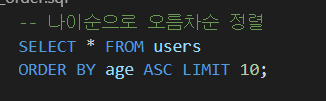

---

- Group by

첫번째 : ㄱㄴㄷ 순서

두번째 : 등장하는 순서, 발견한 순서대로

---

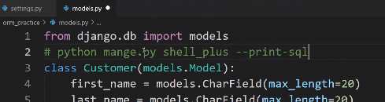

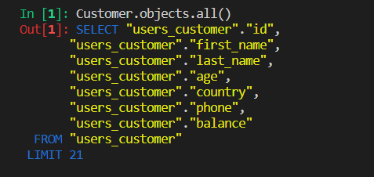

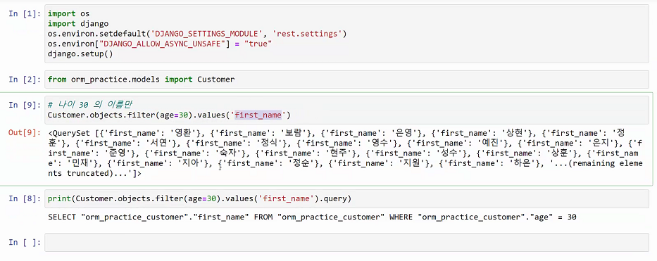

and는 ,로했는데 그렇다면 or는???

https://docs.djangoproject.com/en/3.1/ref/models/querysets/

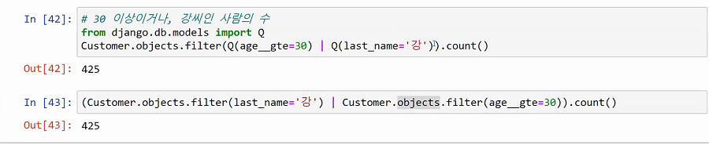

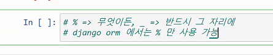

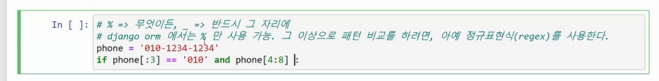

알아서 특정패턴 매칭하는 애들 데리고 오는 것이 regex레겍쓰

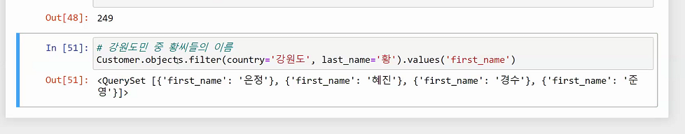

의 balance를 보고싶다면

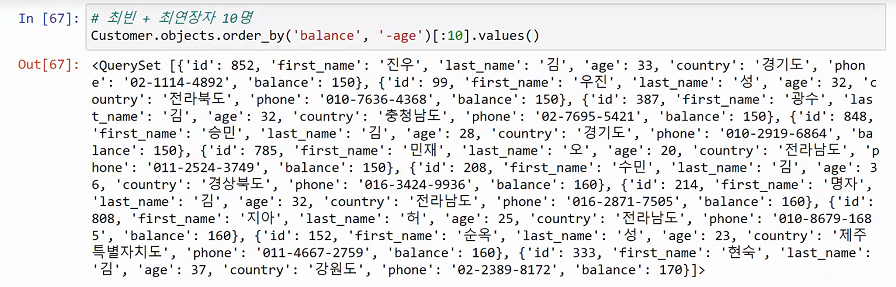

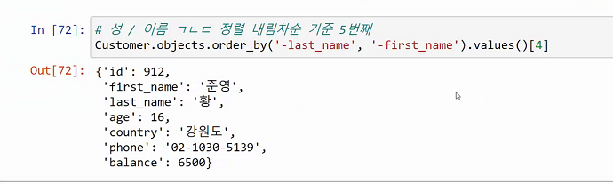

---

 

expressions, groupby

- annotate() : 주석을 다는 것 => 없는 테이블을 더 만든다

현재 firstname , lastname은 있지만 fullname은 없는상황 근데 또 fullname을 만들자니 공간낭비인것같고, 만들자기 매번연산하는거는 아닌것 같은 상황

넘겨줄 수 있으면 왜 이거 배우는 걸까요?

빈값이 있거나 여러개 있을때?

다수의 데이터를 하나의 요소가 가지고 있을 때?

## 구문정리

실행 : `$sqlite3 tutorial.sqlite`

실행종료 : `ctrl + z + enter`