DB : 데이터베이스 관계

- 잠시복습

  

  anonymoususer -> False 그게 아니라면 True

---

## 1. Model Relationship

오늘의 주제는 **Model Relationship1**

- Relationship fields

  모델 간 관계를 나타내는 필드

  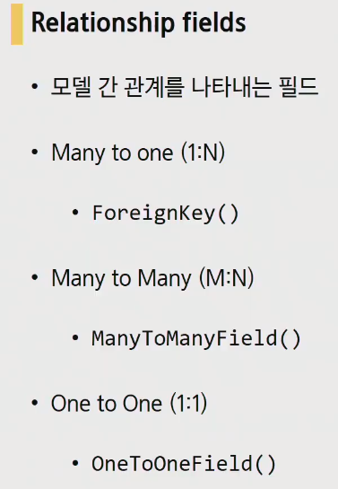

들어가기 앞서서 고민을 좀 해봅시다. 

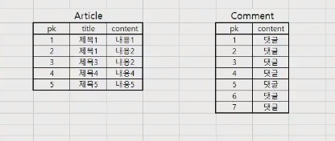

여기서 둘의 관계가 1:N일때 Article모델은  1:N중 어느 역할이고 Comment모델은 어느 역할일까요. 하나의 게시글에는 여러개의 댓글이 작성될 수 있기 때문에 Article : Comment = 1 : N 이 될 겁니다.

결국, 둘중 누군가가 서로의 데이터를 가지고 있어야만 합니다. 그러면 Article에 여러개의 Comment가 작성되어있으니까


Comment column이 추가되어 이런식으로 저장되는게 맞을까? 이렇게 할 경우에 1번 Article의 comment를 조회해보면 '1, 2, 3'이 조회될 것이고 이것을 다시 int로 처리해서 과정들을 거쳐야한다. 아마도 이방식은 아닐듯하죠?


그렇다면 Comment가 Article의 데이터를 가지고있다고해보자.


여기에는 내용에 무엇을 채워야 하는 걸까. 유일한 값을 참조하게 해주어야만 할 것이다. => 바로 Article의 pk값


1번 게시글에는 댓글이 3개, 3번에는 3개, 4번에 1개의 댓글이 달렸다는것을 확인할 수 있다.

결국, **1에는 원본이 유지되고 추가적인 Column은 N쪽의 모델이 가지고 가는 것이 맞겠다는 것을 확인하게됐다.**

### 1.1. A many-to-one(1:N)

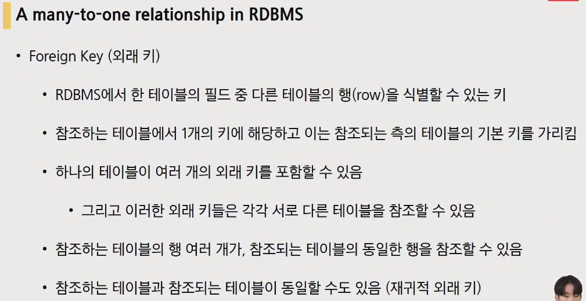

- Foreign Key(외래키) : 한 테이블의 필드 중(아까의 Comment의 Article 필드) **다른 테이블의 행(row)을 식별할 수 있는 키**

**하나의 테이블에는 여러 개의 외래 키를 포함할 수 있음.** 그리고 이러한 **외래 키들은 각각 서로 다른 테이블을 참조할 수 있음.**

참조하는 테이블의 행 여러개가, 참조되는 테이블의 동일한 행을 참조할 수 있음

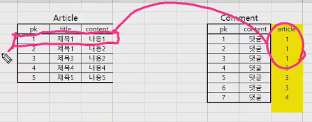

참조하는 테이블과 참조되는 테이블이 동일할 수도 있음(재귀적 외래 키) ㅡ> 대댓글에 관련된 부분

- 외래 키 특징

  

  키를 사용하여 부모 테이블의 유일한 값을 참조(참조 무결성)

  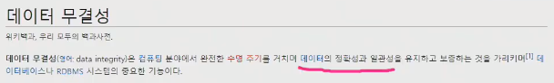

  반드시 부모 테이블의 기본 키일 필요는 없지만 유일해야 함 => pk가 가장 적당할 것

- 1:N 관계에서 Django에서의 외래키(ForeignKey)활용

  

  외래키가 참고해야하는 model의 이름, on_delete라는 옵션필요

  작성 방법은 다음과 같다

  

  첫번째 : 참조할 model의 이름

  두번째 : on_delete옵션

- on_delete옵션이 왜있음?

  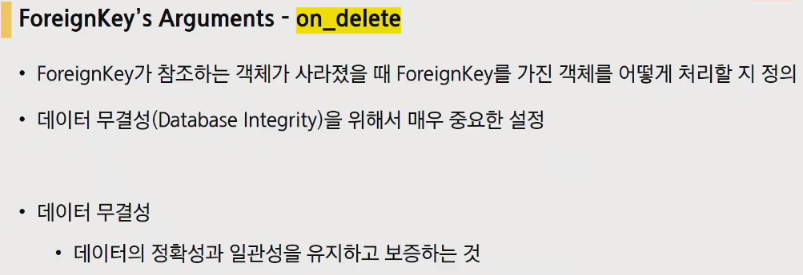

  작성자가 게시글을 삭제했다 . 게시글에 여러 댓글이 있었다. 참조하는 테이블을 삭제했는데 그 테이블을 어떻게 처리할건지 결정하는 것을 on_delete가 한다. => 데이터 무결성을 지키기 위해서 사용하는 옵션

- 7가지정도의 on_delete옵션의 종류

  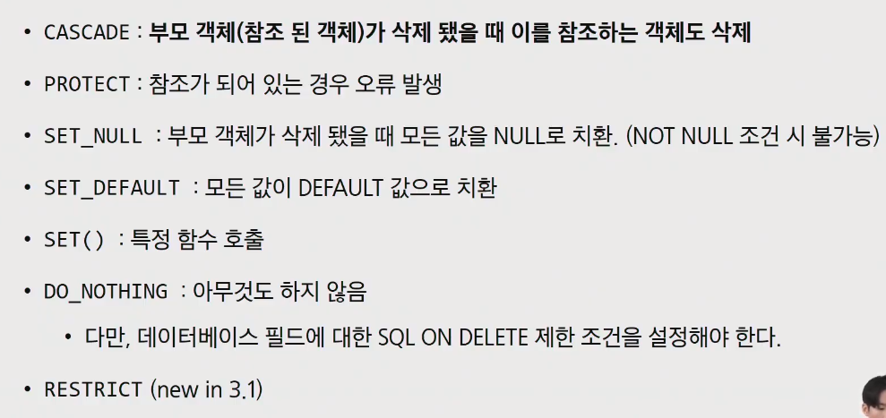

  CASCADE : 부모 객체가 삭제 됐을 때 이를 참조하는 객체도 삭제(Article이 지워지면 Comment도 지워지는 옵션)

  우리는 CASCADE만 사용할 겁니다.

---

git pull 땡겨오시고, 06번 pjt가져옵니다(05번 플젝 그대로 가져왔습니다)


venv설정해주고,


django django-bootstrap-v5 django-extensions ipython 받아줬습니다. `$pip install -r requirments.txt`로 받아옴

이제 뭐부터 할꺼냐면 댓글 모델구현을 할꺼임. 지금 앱이 2개인데 어디다가 해야할까요?


어디다가해도 사실 상관은 없습니다. 근데 articles와 accounts라는 앱을 보면 articles는 게시글관리, accounts는 인증, 유저관리를 하고있으므로 articles가 좀 더 적당할 듯합니다.


이제 articles models.py에서 두번째 모델을 만들어봅시다.

```python
class Comment(models.Model):
    content = models.CharField(max_length=200)
    created_at = models.DateTimeField(auto_now_add = True)
    updated_at = models.DateTimeField(auto_now = True)
```

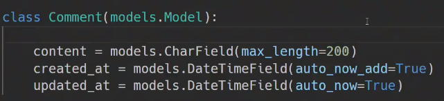

웬만한 댓글에는 길이제한이 있으니 content = CharField

그리고, 작성일과 수정일이 들어가면 좋겠네요(created_at, updated_at)

그럼이제 이런식으로 만들어 질겁니다(시간필드 포함해서)

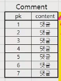

근데 외래키를 지금 N쪽에서 갖고 있어야 한다고 했으니 추가적으로 column이 추가되어야합니다. Foreign Key작성을 해주겠습니다.

```python
class Comment(models.Model):
    article = models.ForeignKey(Article, on_delete=models.CASCADE)
```

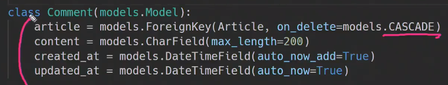

첫번째 : 얘가 참조할 모델의 이름

두번째 : on_delete(우리는 CASCADE만 할거라고했음)

이러면 pk까지 해서 5개의 col이 만들어 질겁니다. 추가적으로 몇번댓글이 보여질 건지 보여지도록 보여지기 좀 편하게 설정해줍니다.

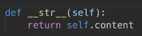

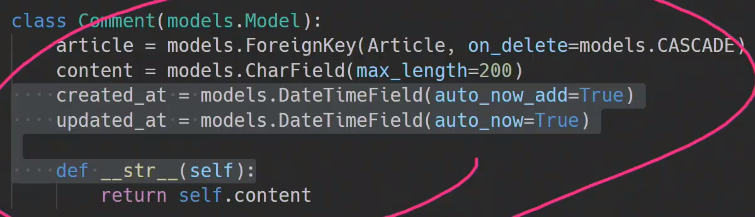

이제 모델을 만들었으니 makemigrations, migrate를 해줍니다.


현재 article을 확인해보면 댓글에대한 어떠한 정보도 확인할 수 없습니다.

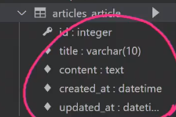

comment를 보면 외래키부분을 보면 article_id로 만들어진 것을 확인 가능한데,

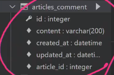

아래와 같이 만들어졌다고 볼 수 있습니다


외래키 작성되는 방법이 우리가 변수로 지정해준 article(참조하는 모델의 소문자)에서 `_id`가 붙어서 이름이 지어진다는 것을 알 수있습니다.

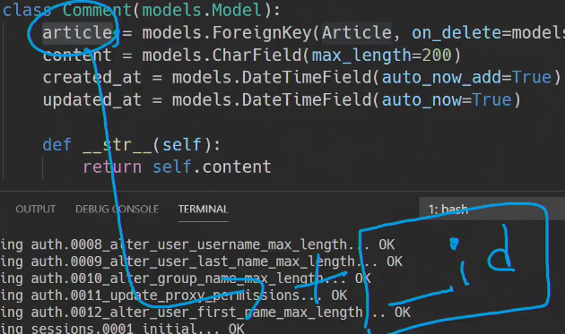

이제 table도 됐고 article도만들어졌으니 실제로 댓글을 작성해볼겁니다(DB API활용해서 해보겠슴다 ㅎㅎ shell_plus 무느알?)

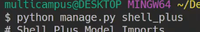

댓글작성 연습부터 해보겠습니다.

우선 인스턴스를 생성하면 빈 객체라는 것을 확인가능합니다. 


comment에 들어갈 값은 바로 댓글의 내용(content)입니다. 내용을 하나 채워줍시다.


댓글완료했으니 이제 save해줍니다. 그런데... 읭?


NULL값 들어갈 수 없는데, articles라는 Comment에 article_id가 없다라는 오류가 발생합니다.

우리에게 지금 필요한 것은

1. 댓글내용
2. 몇 번 게시글에 작성이 되는지?

이렇게 2가지입니다.

따라서 우선 참조를 하게될 Article에서 인스턴스 하나(게시글하나)를 만들어주고(쿼리셋 하나 있는 것을 확인가능)

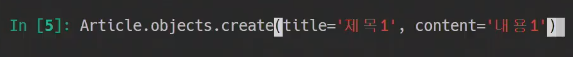


이제 comment에 article_id에 참조할 Article의 pk를 넣어줘야한다.

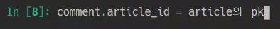

근데 이렇게 하면 article의 pk를 또 가져와야하는 상황이 일어나기 때문에. django는 이를 한번에 가져올 수있도록 해줍니다.

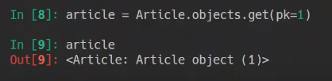

django에서는 article이라는 객체를 그냥 한번에 넣어주면 됩니다.


확인해보면 객체가 생겼다는 것을 확인가능하고 저장을 해줍니다.

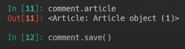

이제 pk도 생겼을 꺼니. 1번 게시물의 1번 댓글이 만들어졌습니다.


작성된 댓글에 대한 속성값을 확인해보면


참조하고있는 객체의 pk를 찾고자한다면 아래와 같이 접근이 가능하고. 이것은 참고하고있는 객체의 pk이기 때문에 article.pk와 동일하다

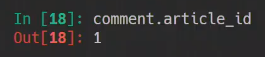

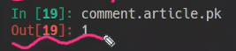

그렇다고해서 article_pk로 조회를 하게되면 article_pk는 존재하지않는 field이기 때문에 오류가 난다.

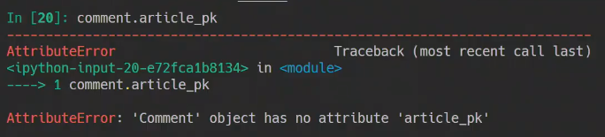

이제 두번째 댓글 작성해봅시다. 1번 게시글에 또 다시 댓글을 만드는 것

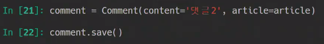

상태확인해보면

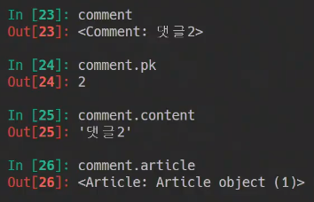

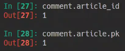

comment의 DB를 확인해보면 2개의 댓글이 작성되어있는것을 확인할 수 있습니다.

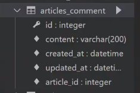


이제 shell_plus밖으로 나와서 admin등록을 해주겠습니다.


우리지금 superuser가없어서 만들어줍니다.


그리고 서버키고, 로그인까지 해줍니다. 그러면 ARTICLES라는 앱에 Comments라는 모델이 추가되어있는 것을 확인할 수 있습니다.


---

N에 입장에서 1을 참조하는 것은 수월했는데 문제는 1의 입장입니다. 1의 입장에서 N을 참조하는 것이 문제인데....(역참조, 예를들어 이 게시글에는 어떤 댓글이 달려있는지 확인하는 상황)


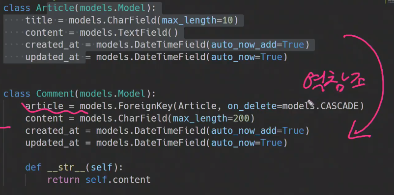

코드상으로는 불가능해보이는데 **django가 ORM이 동작할 수 있도록 해주는 manager가 존재합니다. 바로 `comment_set`이라는 녀석.** 뒤쪽에 쿼리셋은 all()로 동일하지만 manager는 '모델_set'형식으로 생성되게 됩니다.


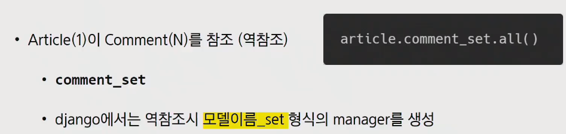

그러면 shell_plus에서 역참조를 해보겠습니다.(현재 게시글 1, 댓글 2인 상황)

1번게시글을 일단 가져와서

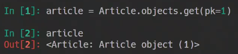

조회를 좀 해보겠습니다. 댓글 2개가 comment set으로 가져와 지는 것을 확인할 수 있습니다. => 이 Query set을 변수에담아서 templates에 담아서 for문으로 출력하면 가능할 듯


실제로 해볼까요

변수에 담아서 확인

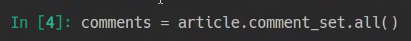


---

Article이랑 on_delete라고했는데 argument가 하나 더 남았습니다 


related_name='comments'라고 해준다면 `article.comment_set.all()`이 `article.**comments**.all()`로 바뀌게 됩니다.(모델 manager이름을 바꿔주는 것. 그러면 이제 comment_set은 사용이 불가하기때문에 makemigrations, migrate를 새로 다시 해주어야만 합니다.)

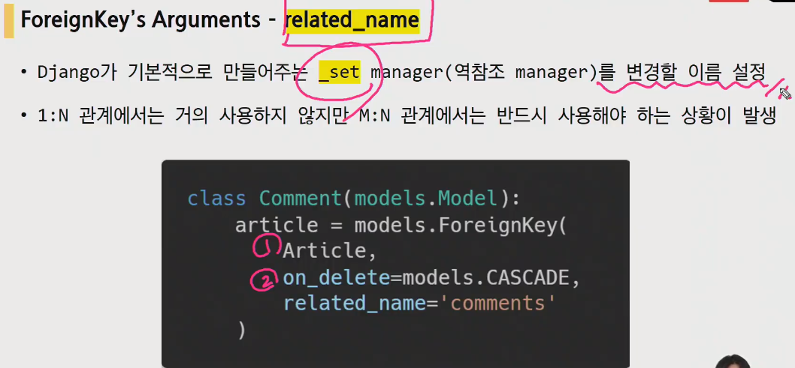

1:N 관계에서는 거의 사용하지 않지만, M:N 관계에서는 반드시 사용해야 하는 상황이 발생하게 됩니다.

---

댓글도 연습이 좀 됐으니, model로 올라가봅니다. 이 모델을 받기위한 forms.py로 이동합니다. ArticleForm과 같이 마찬가지로 modelform을 만들어 봅니다. 일단 뭐가 나올지 모르니 다가져와본다.

```python
from .models import Comment
class CommentForm(models.ModelForm):
    class Meta:
        model = Comment
        fields = '__all__'
```


댓글작성을 어디다가 하는게 좋을까요? 특정 게시글의 아래부분(상세페이지)에 보통 존재했습니다. => detail로 가볼까요

이곳에 comment를 출력해주면 됩니다.


forms.py에서 만들었던CommentForm 가져와주고


```python

def detail(request, pk):
    article = get_object_or_404(Article, pk=pk)
    comment_form = CommentForm()
    context = {
        'article': article
        'comment_form': comment_form
    }
    return render(request, 'articles/detail.html', context)
```

그렇다면 이제 detail.html에 form을 작성해줍니다.

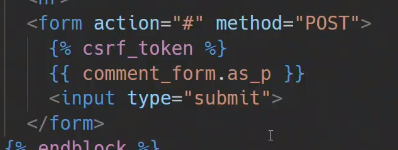

요거 한번 확인해봅시다.


자 근데 여기서 문제가 있습니다. 지금 위 사진은 admin(관리자)페이지에서 보던것과 같습니다. Article부분은 사실 지금 필요가 없습니다. 저게 있다면 사용자가 1번 게시글에서 작성하고 다른 게시글의 댓글로 적용을 할 수 있다는 것이므로 출력을 빼주어야만 합니다.

이것은 이제 forms.py에서 수정해주어야만합니다. fields = '__ all __'로 했기때문에 article을 제외시켜주면

exclude내에 전체에서 제외할 내용만 적어주면 됩니다. 지금 필요없는 article을 제외항목에 추가시킨다면 처리되는 것을 확인 할 수 있습니다

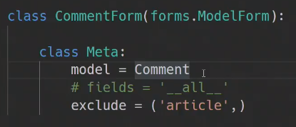

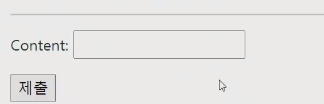

articles urls.py로 와서 경로추가

이제 comment부터는 생각할 것들이 좀더 있습니다. 댓글이 작성되기 위해서 필요한 것이 무엇이 있을까요

1. 댓글내용 => form통해서 넘어옴
2. **몇번글 => form 통해서 못받는데 어케받음 ?? url을 통해서만 받을수 있습니다.**

```python
path('<int:pk>/comments/, views.comments_create, name='comments_create'),
```


이제 detail.html에 작성하지 못했던 action을 작성

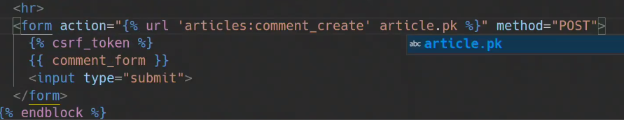

그다음은 views.py 근데 이건 기존의 CRUD와는 좀 다른게 댓글작성을 위한 문서를 따로 처리할 필요가 없습니다. 이 역할을 detail page가 이미 하고있습니다. 그렇다면 분기할때 if else부분이 나오지 않는다는 것이고 POST만 처리하면 됩니다. 

```python
from django.views.decorators.http import require_POST

@require_POST
def comments_create(request, pk):
    article = get_object_or_404(Article,pk=pk)
    comment_form = CommentForm(request.POST)
    if comment_form.is_valid():
        comment_form.save()
        return redirect('articles:detail', article.pk)
    context = {
        'comment_form': comment_form,
        'article': article,
    }
    return render(request, 'articles/detail.html', context)
```

서버에서 댓글을 하나 작성해보면... 난 Null값 안넣을건데 너는 왜 빈값을 넣는거야라는 아까발생했던 오류가 발생한다.


url로부터 특정객체의 article을만들고 게시글을 만들어주어야만 합니다.

save()메서드가 호출되면서 에러가 나게되는데(저장을 하려는데 article이 존재하지 않기때문)

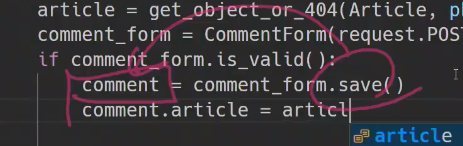

여기서 django가 한가지 옵션을 제공하게 되는데 바로 **commit**


인스턴스를 만들어주고, 리턴을 해주는데, DB에는 입력을 하지 않은 상태로 리턴을 해주는 것(즉, 우리가 추가적으로 DB에 작성할 시간을 주는 것) **인스턴스를 Create는 하지만 Save는 하지않는다.**

django modelform 공식문서를 들어가보면 The save() method라는 부분이 있습니다.


드래그 까지는 기존에 우리가 배웠던 C와 같다.


아래쪽은 Update


이제 인스턴스를 만들고 나서 해야할 게 있습니다. 

**인스턴스를 만들기는 하는데 save는 하지않는다는 것**

그리고, 추가적으로 입력할 것을 입력하고 그리고 다시 save를 하면 비로소 save가 되는 것.


이제 인스턴스가 save는 되지 않았으니 추가적인 작업(추가 데이터 넣기)을 해주고,

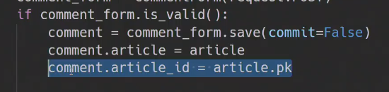

save를 해줍니다.


근데 궁금증이 생기는데 왜 위에는 redirect고 아래는 render인가?

redirect => 유효성 검사를 통과한 경우 => 새로 완성된 detail 페이지를 봐야함

render => 유효성 검사를 통과하지 못했을 때 => 에러메시지를 포함한 내용을 확인하면서 create하지 못했다는 것을 확인해야함

우리가 두가지 form을 얘기를 했었는데


아래는 빈 form 위에는 비어있는 form은 아니지만 수정하려고했던 내용이 들어있고 is_valid()를 지나가려고 하면서 에러메시지가 같이 포함 된 내용이 form에 들어간다

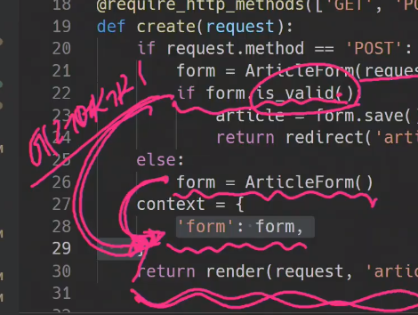

근데 여기서 redirect를 하게되면 에러메시지를 포함한 templates을 받아서 그에 해당하는 페이지를 만들어야하는데 그럴 수 가없다. 

---

CRUD에서 C를 끝냈고 R을 할건데 마찬가지로 detail페이지에서 할 겁니다.

작성하는 윗부분에 Read가 나올 수 있도록 만들어 보겟습니다.

댓글 참조는 누가하나요? article. 근데 article은 직접 참조가 불가능함. 따라서 django가 역참조할 manager를 제공한다고 했습니다. 바로 '모델이름_set'(해당 게시글에 달린것을 가져와야함)

article이 가지고있는 모든 댓글을 가지고 와야하므로 `article.comment_set.all()`을 하게 됩니다.

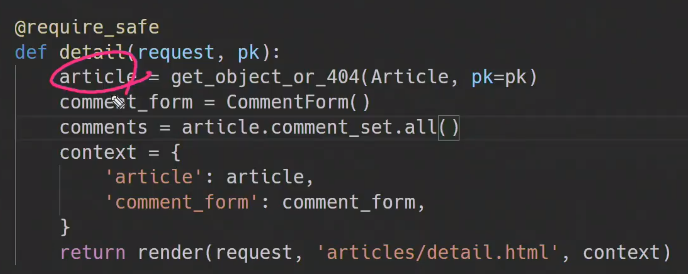

detail.html 로와서 모든 댓글을 가져와야하므로 for문을 돌린다.


여기서 태그만 좀 씌워줘서 서로 떨어질 수 있도록 해줍니다.

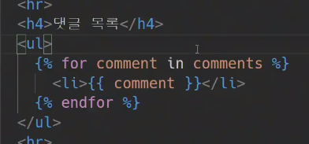


댓글 추가를 하면 또 바로 추가가 되면서 redirect되는 것을 확인 할 수 있다.

---

이번에는 댓글 삭제

urls.py에서 경로를 뚫어줍니다. comments에 대해서만 pk를 받아서 삭제를 해줍시다

이 pk는 article의 pk들이었는데


이번에는 댓글에서의 pk를 받아서 해당 댓글을 지워주면 되기 때문에 comment_pk라는 이름으로 작성해줍니다.


```python
path('<int:comment_pk>/commenets/delete/', views.comments_delete, name='comments_delete')
```


views.py로와서

```python
@require_POST
def comment_delete(request, comment_pk):
    pass
```

댓글이 삭제되고나서 현재 댓글은 detail페이지에있는데 우선 댓글 삭제를 해보고

```python
@require_POST
def comment_delete(request, comment_pk):
    comment = get_object_or_404(Comment, pk=comment_pk)
    comment.delete()
    pass
```

Comment모델 import

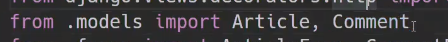

이제 redirect할건데 문제가 있다 detail page로 돌아가려면 article의 pk가 필요합니다 

```python
@require_POST
def comment_delete(request, comment_pk):
    comment = get_object_or_404(Comment, pk=comment_pk)
    comment.delete()
    return redirect('articles:detail')
    pass
```

따라서 우리가 만들어 주었던 url을 약간 수정해야만 합니다.

```python
path('<int:pk>/comments/<int:comments_pk>.../')
```

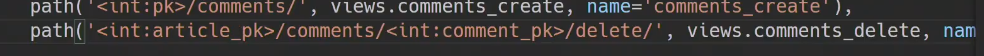

다시 views.py로 와서

```python
@require_POST
def comment_delete(request, article_pk, comment_pk):
    comment = get_object_or_404(Comment, pk=comment_pk)
    comment.delete()
    return redirect('articles:detail')
```

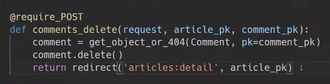

- 궁금증 : 아래 그림처럼 지우기 전에 article.pk가져와서 갖다 쓰면되지않나요?? 그러면 인자로 article.pk 받을 필요없자나요. 맞습니다. 맞는데 django

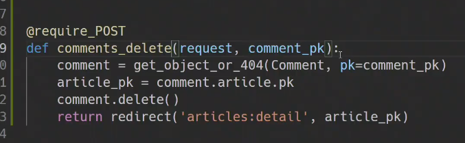

django서버 통해서 front, back 다 만들고 있는데 나중에는 사용자에게 JSON을 던져주는 사이트를 만들겁니다.

예전에 TMDB사이트에서 API를 쓸때 URL의 약속들이 있었습니다.


GET방식의 경우 아래와 같은 구조로 보내라는 약속이 있었는데 이것이 **REST API**라는 것이었습니다.

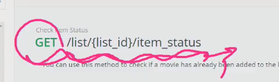

따라서 이러한 약속들 때문에 나중에 url상에 REST정신에 부합하기 위해서(url만 보고 어떤 게시글의 몇번 댓글인지 확인할 수 있도록 인자를 받아와서 사용하게 됩니다. 더 궁금한 부분은 REST API검색) 궁금증처럼 하지 않고 아래처럼 진행하게됩니다.

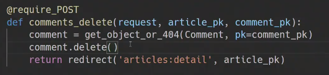

POST요청 받고, 메서드 따로 확인할 필요없고

어떤 댓글인지 몇번댓글인지 찾고 -> 지우고 -> 그 댓글이 속해있던 게시글(detail)로 돌아가게 됨

댓글내용 옆에 삭제버튼이있어야 하므로  detail.html로 가서 아래와 같이 작성해준다. url태그가 기니까 잘 생각해야됨. 첫번째 인자로 article.pk, 두번째 인자로 comment.pk


서버로 가서 액션을 보게되면 REST정신에 부합하게 url만 봐도 몇번 게시물의 몇번 댓글을 지우게 되는지 유추 할 수 있게된다.

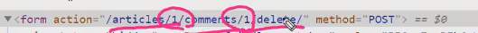

---

CRD까지 끝났는데 이제 U만 남았는데 U는 안할겁니다.

왜 why? 일반적인 사이트에서 댓글 수정은 댓글 수정을 위한 사이트로 이동하는 것이 아니라 해당 부분만 삭제할 수있도록 하게되는데 지금까지 배운것으로는 아직 불가능합니다. 즉 위에는 그대로 유지하되 아래 부분만 수정하는 페이지(?)로 바꾸어 주어야만 하는데 이 부분은 JavaScript영역이기때문에 나중으로 넘겨주겠습니다..

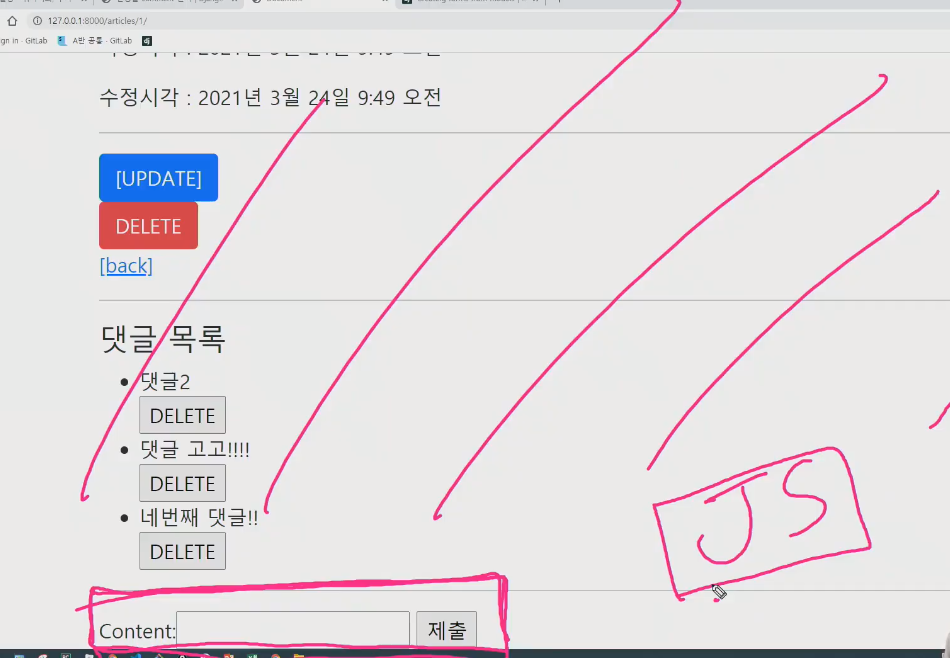

---

**오후수업**

아까하던 views.py로 와서

create를 로그인 되어있는 경우에 한해서 댓글작성을 하도록 만들어주고, 아니라면 로그인 하도록 유도하기


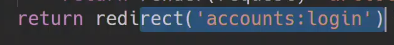

삭제도 마찬가지로 로그인되어있는 사용자여야만 삭제가 가능하도록 유도


안되어있다면 로그인 페이지로 보내줘도 됨


방법3 => 405에러가 나게됨. 이 방법은 GET method처리할수 있는 함수라면 같이써도 되지만 그렇지않다면 불가능


---

- 보충설명(수업진도는 아님)

좀 더 나아가서 튕겨져 나갔을때, client에게 올바른 상태코드, 올바른 html을 제공하고 싶을 수 있습니다.


잠시 http status 문서보면 401(비인증상태 임을 알려줌)_Unauthorized 응답코드가 있습니다


적용해보면

```python
from django.http import h...
```

h정도만 치면 엄청 여러가지 응답코드가 있습니다.(모든 status code를 제공하는 것은 아닙니다.) 좀 더 상세한 내용은 django response request검색해서 찹고하시면 됩니다


그러면 없는 경우는 어케하냐? HttpResponse를 추가해줘서

```python
from django.http import HttpResponse
```

다시 comment_create로 내려와서 사용자 인증에서 튕겨져 나간경우 401 statuscode를 client에게 주도록 설정해줄 수 있습니다.


그러면 실제로 로그인하지 않은 사용자가 댓글을 작성하려고 할때 401응답을 받게 됩니다.


---

이번에는 댓글 목록아래쪽에 댓글이 얼마나 있는지 알려주는 댓글 개수 출력해봅시다.

detail.html로가서


일반적으로 세개만 보자면 위 2개가 세번째것보다는 낫습니다. 왜냐 comments라는함수에서 count함수를 다시 호출하는 것이기 때문입니다.

**주의할점은 DTL에서는 all()이런식으로 소괄호를 작성하면 안됩니다.**


좀 더 꾸미고 싶다면(댓글이 없는 상황에서 사용자에게 보여줄 부분을 만들어줄수있습니다.)


---

<br>

이제 user를 개입시킬겁니다. 기존의 user모델을 custom user model로 대체해야합니다.


- 왜 커스텀을 하라고 하느냐

  일부 프로젝트에서는 built-in-User model이 제공하는 인증 요구사항이 적절하지 않을 수 있음

  django는 custom model을 참조하는 AUTH_USER_MODEL 설정을 제공하여 기본 user model을 재정의 할 수 있도록 함

  새 프로젝트를 시작하는 경우 기본 사용자 모델이 충분하더라도, **커스텀 유저 모델을 설정하는 것을 강력하게 권장(그냥 하라는 거임)**

  

  커스텀 유저 모델은 기본 사용자 모델과 동일하게 작동하면서도(상속을 받으니까) 필요한 경우 나중에 맞춤 설정할 수 있기 때문

  **단, 프로젝트의 모든 migrations 혹은 첫 migrate를 실행하기 전에 이 작업을 마쳐야 함**(커스터마이징 이전에 실행해버리면 override하기 이전의 user가 db에 저장되기 때문)

- 인증에 관해서 custom하는 여러 방식이 있는데

  

  여기서 우리가 볼것은

  


작성방식은? settings.py에 `AUTH_USER_MODEL = 앱이름.User`


대체할 내용을 입력하거나 아니면 그대로 유지하거나하고


Admin에 등록


---

이제 배운거 적용하러 가봅시다.

1. settings.py로 가서 젤 밑에

`AUTH_USER_MODEL = 앱이름.유저모델이름`


2. accounts의 models.py로 가서

```python
from django.contrib.auth.models import AbstractUser

class User(AbstractUser):
    pass
```

AbstractUser와 AbstarctBaseUser가 있는데 왜 우리는 하필 AbstractUser를 사용하는걸까요?? AbstarctBaseUser구현된 정보가 너무 부족합니다.


django github가서 직접 확인해볼까요 => 완전한 기능을 갖춘 사용자 모델을 구현하도록 제공을 해주는 기본 클래스가 바로 AbstractUser라는 것


위 내용들 직접 구현할꺼면 커스텀안해도 되지만 우린 그러지 않을꺼니깐 ㅎㅎ


우리는 알게모르게 기본 빌트인 user를 사용하고 있었던 것...

무조건 프로젝트의 전체 첫 makemigrations, migrate과정 이전에 이루어져야만 한다.

프로젝트 시작 시 설정하기 위한 것이며, 참조하는 모델은 첫번째 마이그레이션에서 사용할 수 있어야 함 => 첫 마이그레이션할때 새로운 마이그레이션 모델로 대체가 되어야한다는 의미(모든 마이그레이션에 대체가 되어야만 한다는 것)


AbstractBaseUser : 자신은 테이블이 없고 반복적인 기능만을 만들어 두고 sub class에게 기능을 제공해주는 역할(중요한 것은 **테이블을 만드는 데 사용되지 않는다는 것**)


abstract라고 붙은 애들이 미리 기능을 구현을 해주고 아래 class애들에게 기능을 제공을 해주는 class라고 생각하면 됩니다.


---

자 이상황이 이제 대체가 끝난 상황(여기서 기본 내용이 맘에안들면 바꾸거나 추가하거나 하면 된다는 것)


이제 경로를 지정해줘야합니다 . settings.py로가서 경로를 추가해주면서 앞으로 우리가 사용할 유저는 auth.user가 아니라 accounts.user로 사용하게 된다는 것


하지만 지금은 프로젝트 중간이기 때문에 초기화를 시켜줘야합니다.

---

### 초기화

이제 초기화시켜줄겁니다

1. migrations 설계도 지우기

   **migrations폴더를 지우면안됩니다!** 번호 붙어져있는 파일만 지워줍니다.

   

2. 설계도를 기반으로 해서 만들어진 DB지우기

   

3. 다시 처음부터 makemigrations, migrate하기

   

   설계도를살펴보면 User class가 가지고있는 field확인이 가능하다

   

   이제 migrate

   

   우리가 만든 것 2개가 확인되네요잉

   

밑에 있는 것이 이제 우리가 사용하게 될 user가 됩니다.


user table이 정상작동하는지 확인하기 위한 제일 적절한 방법은 바로 회원가입


읭? 안되네?

auth.User가 account.User로 바뀌었데~ 근데 이게 오류의 원인이라고하네? 이건 우리가 의도한 건데... 근데 왜 이것때문에 UserCreationForm이 작동을 안했느냐 UserCreationForm을 잠시 봐보면


이 모델은 User라는 모델을 참고하는데 이것이 우리가 지금 대체한 accounts.User일까?? 아니다. auth.User입니다. 우리가 대체한 것이 적용이 안된 상태인 것

자동으로 바뀌면 좋겠는데 코드 자체가 저렇게 되어있으니까 어떻게 할 수가 없다. 그럼 어떡함? **커스텀을 해야합니다.**

django문서에서 잠시 살펴보면 


크게 3등분 되어있습니다. 첫번째는 AbstractBaseUser에 들어가있는 Form

두번째는 첫번째에서 받아오는 것

**세번째는 User에 묶여있어서 재정의 해야합니다**


이와같은 이유 때문에 UserChangeForm에서도 커스텀을 해주었던 것입니다.


결국 **`get_user_model`이 현재 활성화 되어있는, 대체 되어있는 user를 데리고 와주는 겁니다.**


forms.py로 와서이제 재정의(커스텀)를 해줍니다.


위에부분은 너무 많은 정보가나와서 커스텀을 해준건데 밑에는 이제 회원가입을 해야할때 보여지는 폼입니다. 따라서 기존의 fields들(username,pw1,pw2....)을 가져오고 거기에 추가적인 fields들(fields에 속해있는 것들중 추가적으로 더해줄 내용, usermodel에 들어가 있는내용입니다. )을 추가해주는 식으로 만들어 주는겁니다.

```python
class CustomUserCreationForm(UserCreationForm):
    class Meta:
        model = get_user_model()
        fields = UserCreationForm.Meta.fields + ('email', )
```


- 궁금증 : 튜플에 email을 추가해 주신거는 임의로 만드는게 아니라면 어디에 들어있는 내용인가요??

user가 가지고있는 field들에 email이 존재합니다(더 정확한 정보는 AbstractUser에 존재합니다)


---

결론 accoutns를 만들면 프로젝트 시작과 동시에 이걸 해주어야만 한다.


---

<br>

이제 준비가 끝났습니다. 어떤준비가 끝났느냐 기존에 Article : Comment = 1 : N관계였는데 이제 이곳에 User가 끼어드는 겁니다. User는 다른 테이블과 무슨관계일까요?? 1 : N관계가 되는 겁니다.


Comment는 이제 Article과 1:N 관계인거고 User와도 1:N 관계가 이루어 지게 되는겁니다.


---

먼저 User와 Article을 하겠습니다.

이제 User : Article = 1 : N 관계가 되었습니다.

그렇다면 Foreign Key는 누가 들고 있어야 할까요? N쪽이 들고있으므로 Article의 models.py로 이동합니다


ForeignKey 필드 이름은 참조할 모델,테이블의 이름(소문자)을 가져옵니다. 근데 아래처럼 User를 가져오는 것이아니라 우리가 배웠던 get_user_model()방식이 있습니다. 근데 models.py에서는 또다른 방법이 있습니다. 


우리가 아까 settings.py에서 썼던 AUTH_USER_MODEL부분을 가져오는 겁니다. 이거는 MEDIA URL추가할때 썼던 내용인데... 일단 두번째 인자는 뭐였죠? on_delete입니다(종류는 CASCADE).


- 유저 모델 참조하기

  

  

  models.py 외에서 사용자를 가져오는 모든 경우에는 get_user_model()

  왜요왜요왜요 ? return값이 다름

  settings.AUTH_USER_MODEL은 문자열

  get_user_model()은 User객체

  

  그런데요?? 이걸이해하기위해 앱이 구동될때 Installed apps에서 articles, accounts .. 이런식으로 아래로 내려가면서 읽어오는데(articles다음에 accounts가 두번째로 구동이 되어야만 한다는 의미) 근데 articles앱을 구동을 하다가 갑자기 get_user_model()이 오게되면 찾을 수가 없다. 따라서 settings.py에 존재하는 문자열을 제공해서 찾을 수 있도록 해주는 것 => **앱의 구동순서때문이 이유**

  articles를 보는데 articles앱에 하필 get_user_model을 해버리니까 문제인겁니다!!!!!!!

  앱 순서 때문에 꼬일 가능성을 아예 없애기 위해 저렇게 하는 거군요

  

아 다까먹어도 되고 밑줄친 이거만 기억하셈


자 그럼 이쯤에서 공식문서 Time(홀리 공식문서....)


여기에 User모델 참조하는 방법에 대한 설명이 나와있는 Referencing the User model 부분을 들어가봅시다


get_user_model에 대한 설명인데도 예외사항으로 settings.AUTH_USER_MODEL을 사용하는 경우를 얘기해주고있습니다.

foreign key를 정의하는 과정이기때문에 이번에는 auth_user_model을 사용하게 되는겁니다.


하던대로 User-Article관계설정으로 돌아와서 models.py로


- 궁금점


---

모델변경사항이 생겼다??? 3단계

1. 모델변경(Article모델에 foreignkey가 만들어 졌따)

2. 새로운 설계도를 작성해준다

   

   뭐임 이거 여러개 중에 foreignkey추가할건데 그 내용 부분 어쩔꺼냐는 거. 어떻게 할지는 우리맘대로 하면됩니다(default도 되고 1도 되고 ...)

   

   1로 해버리면 이제 foreign key에 1이 들어가면서 makemigrations가 됩니다

   

3. 마이그레이트해주기

   

   DB를 확인해보면 foreign key이름이 뭐로 형성이 되었느냐.. `user_id(참조하는모델의 소문자_id)`로 만들어지게 됩니다.

   

---

이제 서버로 가서 구동해주면 comment_form 할때 보던 form과 비슷한 것을 확인할 수있따.


따라서 아까처럼 fields에 전부다 보여주고 있는 것을 바꿔줘야합니다


그렇다면 이제 사용자에게 title과 content만 받아오게 됩니다.

---

<br>

다음시간....


## 웹엑스 시간

내일 SQL파트 기능적으로 살펴보겠습니다

오늘의 핵심 키워드는 뭘까요? **realation 과 외래키**

**이제부터는 유튜브 라이브를 들으면서 모르겠는 부분은 바로바로 mattermost에 남기십쇼**

- 영구적으로 특정 게시글은 누가 달았다는 것을 가능하게 됐습니다.(게시글에 유저달기)

게시글 / 사용자 / 댓글

잠시 생각해보세요 테이블에 column추가 해보려면 어케할까요 


이런식으로 고민한 것이 DB 모델링이라고 합니다

- 옛날 그리스 아고라 처럼 뭔가 이야기에대한 기록을 남길때 아래와 같은 방식 또한 구조적으로 기록을 남긴 것입니다


이것은 나누었던 얘기를 최대한 시스템적으로 구조적으로 기록을 남기려고 한건데.. 처음에 어떤식으로 틀을짤지를 고민하는 것이 database modeling이라고합니다.

DB modeling은 즉, 데이터를 저장을 할건데 어떤 테이블에, 어떤 콜럼으로 가지고 올것이냐입니다. 근데 또 아래처럼 광범위한 콜럼들을 가지고온다고해서 좋다고 할 수는 없다.


users, articles, comments 테이블이 있다고하자


이렇게만 해도 틀린것은 아니다.

다만, 누군가 어떤 기록을 썼느냐에대한 기록이 안남겨져있는 상황인 것. 이렇게 해야 유의미한 테이블이 되는 겁니다.


이렇게 하는 이유는 현실에서 너네 대표 데리고와 하면 대표를 데리고오면 되는데 DB에서는 대표를 대표하는 data(숫자)를 저장하는 수 밖에없다.

나는 분명 model code에다가

```python
class Article:
    user = ForeignKey(User, on_delete)
```

이렇게 했는데 아래와 같이 나오는 이유는


user를 넣고싶지만 그럴수는없기 때문에 automatically하게 user_id로 넣어주는 것. 근데 많은 분들이 클래스 만들때 아래와같은 오류를 범하게 되는데


그렇게 되면 테이블에서 이런식으로 만들어 지게 되는 것.


comments도 봅시다


첫번째는 첫번째 게시글에 나도라는 댓글이 써져있다는 것을 알 수 있는데 여기서 누가쓴건지 어케 알건데? 유저도 외래키로 붙여주면됨 즉, user_id를 field로 붙여주면됨 ㅇㅇ


### workshop


이거 만드세요

왜 이전에 배울때는 profile에 update와 detail을 따로했는데, 오늘 배운거는 article detail에 comment의 Create, Read, Delete기능이 한번에 가능한건가??


제일먼저 하는것은 models.py완성하기(이 내용을 만들기 위해서 고민해보세요. 기획을 해보세요.)

- 보통 외주를 뛸때 '커뮤니티 기능이 있으면 좋겠습니다'  이런식으로 요청을 받게됩니다(관통플젝처럼 친절하게 말해주지 않음)

---

궁금증 : 왜 클래스이름에서 id만 붙어서 컬럼이 되는걸까??????

내입에서 나왔으니 내꺼지 라고 인식할건데 

DB에 들어가기 위해서는 칼럼화가 되어야만 하는데 그걸 누가 했는지 남길때 방법이 article_id 즉, id밖에 없다는 겁니다. 만약에 아래와 같이 칼럼에 아무런 이름이 오게된다면


내용이 어떤 글에 달려있는건지를 저장할수가 없게되버린다.


을쪽이 갑에대한 정보를 저장하는데 갑에대한 어떤정보를 저장하느냐 할때 저장할수 있는 내용이 id밖에 없는 것

저장할때는 아래와 같이 객체 그 자체를 저장을 해주는 겁니다.


나는 article객체자체를 저장하고 싶었으나(저장할때는 객체의 본질 자체를 담고싶었다는 의미) 저장할 수있는 방법이(그 객체를 대표하는 의미하는 도장,사인같은 역할을 하는 내용이) id밖에 없겠더라 였기 때문에 아래와 같은 상황이 일어나게  된겁니다.


---

현직에서 html을 짤때 스토리보드


---

<br>

오후시간

30분동안 일단 짤수있는대로 짜보고 5시부터 시작하겠습니다 

---

왜 모델을 먼저만드냐면... 모델로 폼만들고.. 그거로 views 그거로 templates만들기 때문.

모델 -> forms -> views -> templates

**models.py**

```python
class Article(models.Model):
    title = models.CharField(max_length=100)
    content = models.TextField()
    created_at = models.DateTimeField(auto_now_add=True)
    updated_at = models.DateTimeField(auto_now=True)

class Comment(models.Model):
    article = models.ForeignKey(Article, on_delete=models.CASCADE)
    content = models.CharField(max_length=200)
    created_at = models.DateTimeField(auto_now_add=True)
    updated_at = models.DateTimeField(auto_now=True)
```

첫번째 인자가 to 인데, Model 또는 str이 들어가는데 우리는 일단 Model을 넣은거임


**makemigrations -> migrate**

- 만약에 이런 error message가 보인다면?? url 경로지정!


설계도에서는 article이라고 되어있지만..


DB에서 확인해본다면 article_id로 저장이 된다.(왜? django가 그렇게 해주는걸?)


**forms.py**

```python
from django import forms
from .models import Article, Comment

class ArticleForm(forms.ModelForm):
    class Meta:
        model = Article
        fields = '__all__'
        
class CommentForm(forms.ModelForm):
    class Meta:
        model = Comment
        fields = '__all__'
```


validation을 주고싶다면?


**urls.py**

```python
from django.urls import path
from . import views

app_name = 'board'

urlpatterns = [
    path('create/', views.create_article, name='create_article'),
    path('', views.article_index, name='article_index'),
    path('<int:article_pk>/', views.article_detail, name='article_detail'),
   path('<int:article_pk>/update', views.update_article, name='update_article'),
   path('<int:article_pk>/delete', views.delete_article, name='delete_article'),
    
    path('', views.create, name='create'),
  path('<int:article_pk>/comments/<int:comment_pk>/update/'),
   
]
```

이제 그냥 index, create이런식으로 쓸수 없다. 같은 기능인데 속은 다른게 생겼기 때문


따라서 앞으로 create_article같은 식으로 만들어준다


comment는 article없이 존재할 수가 없음. 따라서 /board/1/이 접두사가 되고나서 시작하게 됩니다. 


**views.py**

뼈대잡기


- create_article

```python
from django.shortcuts import render, redirect, get_object_or_404
from .models import Article, Comment
from .forms import ArticleForm, CommentForm

def create_article(request):
    if request.method == 'POST':
        article_form = ArticleForm(request.POST)
        if article_form.is_valid():
            article = article_form.save()
            return redirect('articles:detail', article.pk)
    else:
        article_form = ArticleForm()
    context = {'article_form': article_form,}
    return render(request, 'board/create_article.html', context)
```

이제 그냥 form안할꺼임 겹치니까


- update_article


- article_index


- article_detail(중요)


- html 생성


아니 이러지말고 그냥 form.html로 퉁칩시다


detail.html


여기에서 이제 댓글창을 만들고 싶어짐


서버에서 이제 확인해보면


여기까지가 이제 FrontEnd가 하는 mock up이라고 볼 수 있다.

이번에는 form 태그를 만들어주는데 개별게시글의 pk를 넘겨준다


form 있어야하는데 from이없네?

돌아가서 


CommentForm()을해야 비어있는거를 넘깁니다

'__ all __'에서 ('content')로 바꾼다면원하는 부분만 나오게 됩니다


---

여기서 부터는 이제 초반에 new, create역할 나누는듯이 역할을 분할 시킵니다. 왜그러지는 한번 생각해보시길..


- create_comment


?? 이거맞음 ? 댓글쓰고 어디봐야됨? detail을 봐야 뭔가 맞는느낌 익숙함에 의거해서 detail로 보내기로 했습니다


- 주석에 달아놓은거 생각해보세요


계속 진행해보면


마지막. 여기서 에러가 났는데요?


이거 DB에서 난 에러입니다

NOT NULL 비어있을 수 없는 제약조건을 시패했습니다. board_comment테이블에 article_id가 없습니다.

현재 comment_form 상태가 article_pk를 가지고 있지 않은 상태


아니 근데 왜 valid는 통과한거임?? 우리가 폼의 fields에  content만 검사하게 만들었기때문(form의 역할이 validation, html)


그럼 이제 어떡해.. 아래는 아님


form은 save할때 그 역할이 끝나고, 진짜 객체가 나설차례. 본질이 나왓는데 본질에 추가를 해줘서 save를 해줘야한다


아래줄은 윗줄이 해주는데


save가 진짜 save는 아니라는 것


이것이 바로 커밋


관계를 형성했다는 것은 주인입장에서 article입장헤서 comment찾지 않아도 밑에 딸려있는 애들이 있으니 context에 넣지 않아도 아래와 같은 방식으로도 가능하다 


## 보충수업

- 오늘 기억할 4가지


DB에 관계형을 접목시킨것이


django에서는 SQLite라는 file을 사용


RDBMS와 반대를 형성하는 애들(이건 나중에 하셈.. )


- RDB

  스프레드 시트의 집합

  

  여러사람들이 DB에 동시에 접근할때


Row(Tuple, Record)

Column(Field, Attribute)

- 스키마

  

  

  

- 관계(형 데이터베이스)


RDB에서는 테이블에서의 연결이 중요


왜 이걸 사용하냐면..


DB스키마를 통해서 관계를 구성하는 것이 DB모델링


이것은 약속을 어기게 된다


그럼 이방법은?


이건 이 약속을 어기게 된다


그러면 마지막으로 이 방법은 될까?


ㄴㄴ 안됨


우리는 pk를 하나로 유지하면서 댓글을 가져오고싶다 따라서 테이블을 쪼개고 가져오자(1:N)


따라서 게시글은 1 댓글은 N 관계가 형성이 됩니다. 다른경우(M:N또한 존재합니다)


이 사이에서 사용되는 ForeignKey


보통 1쪽이 부모, N쪽이 자식

생각할때 N쪽에서 1을 참조한다고 생각하면 됩니다. 다만 Django에서는 역참조도 가능합니다.


이 모든걸 포함해서 ERD라고합니다


N쪽이 까마귀발이라고 생각하면 됨. 위 사진보고 아 1:N 관계구나 라고 생각하면 됨


---

이제 코드로서 확인해봅시다

- 버튼 클래스사용

  

  뱃지라는것도 있음

- 위젯(부트스트랩 적용하는 것) 사용시

  보통 django 공식문서보면서 사용

  forms.py에서 하면됨

  

  