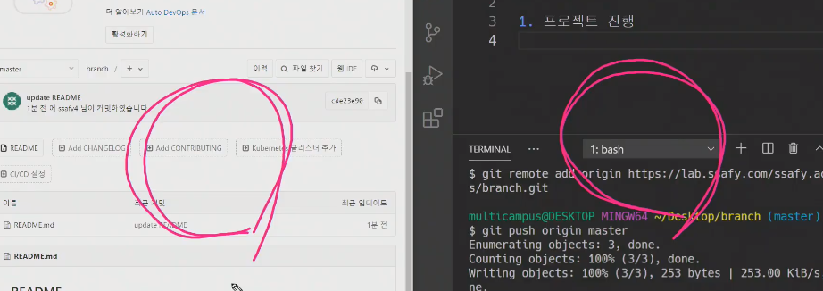
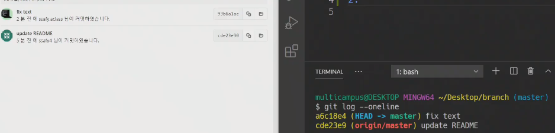
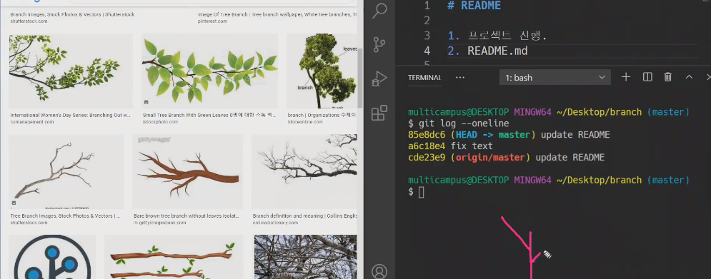
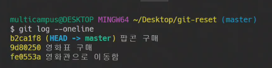
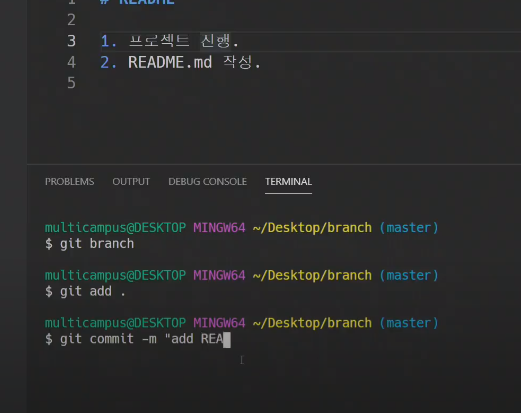
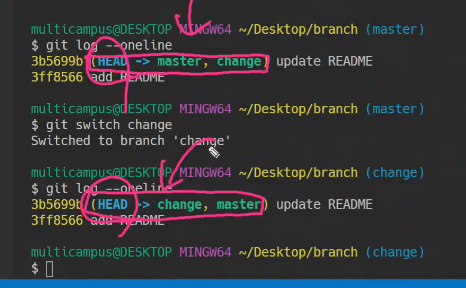
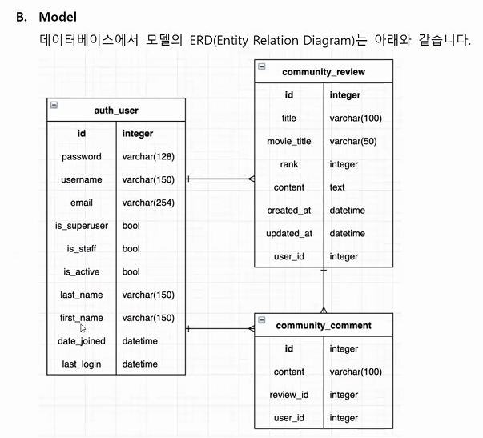

# 관통PJT

- GIT을 사용하는 2가지 이유

  버전관리, 협업

좌 : 원격저장소, 우 : 로컬저장소

git push, pull 서로하기전에 양쪽에서 수정한 경우

양쪽에서 둘다 . 만 써서 양쪽둘다 커밋을 한다면??

`$git log --oneline`해보면 양측간의 history가 달라짐을 알 수 있다

`$git push origin master`를 해보면

이 상황을 git pull해서 해결해보려고하는데 `git pull`을 해보면

<<와 >> 그리고 == 으로 구분이 되어있는 상태

이번에는 revert를 해보겠스빈다

과거돌이가기 reset, 실제 내용만 과거의 내용으로 고치는 것이 revert

---

스위치라는 결국 head가 가리키는 방향을 변경해주는 것

---

웹엑스 시간

AUTH

signup login logout

review - article

comment - 댓글

---

