# DB

## 1. 지난시간

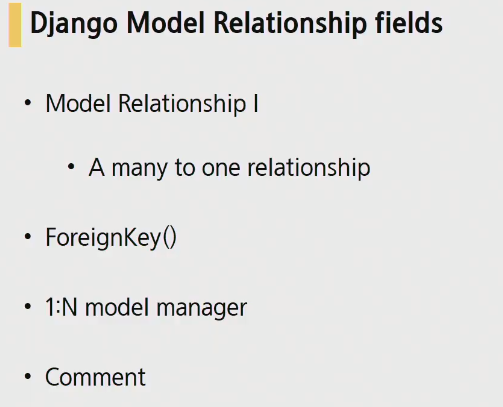

built-in User model의 경우 pjt 중간에 조정하기가 굉장히 까다롭기 때문에 custom user model을 사용하는 것을 강력권장.

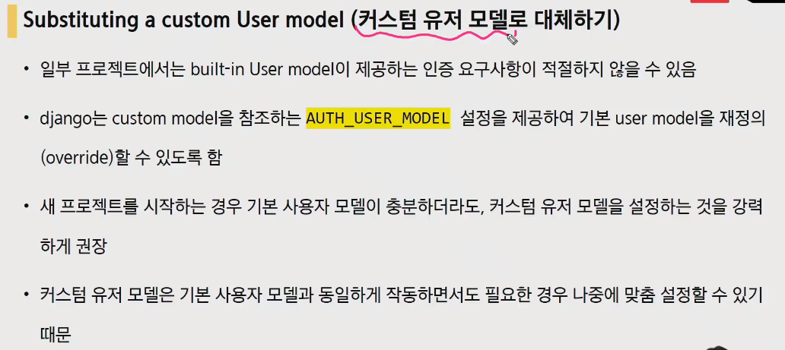


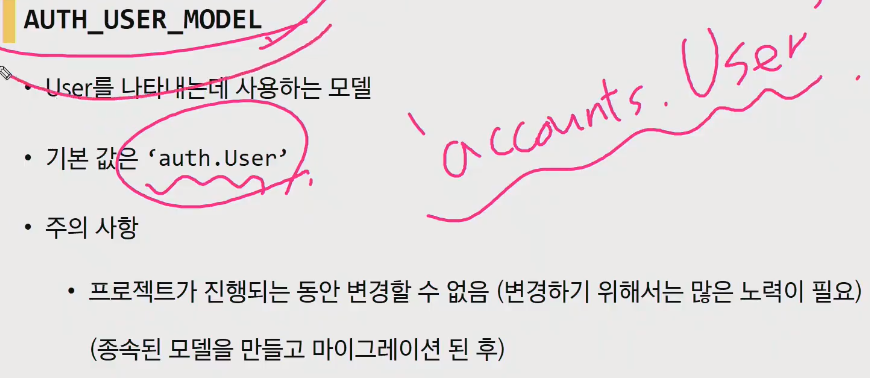


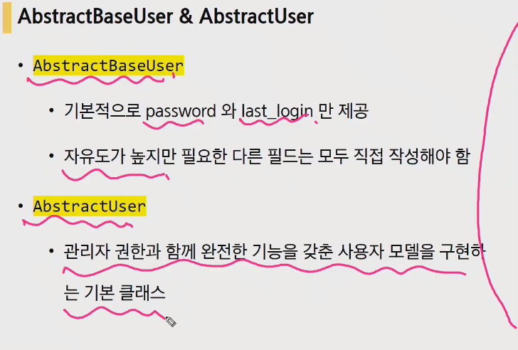


클래스만드는데 도움되지 않는다. 다만다른 모델의 기본 클래스로 사용되는 경우 해당 필드가 하위 클래스의필드에 추가된다

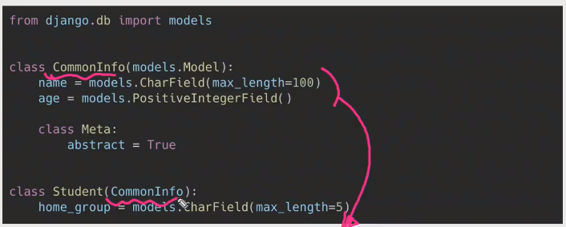


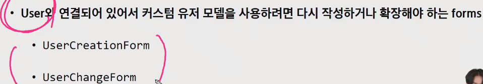

---

<br>

- settings.py

  

- models.py

  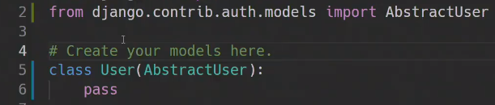

- admin.py

  

- `makemigrations`, `migrate` 이후 runserver

- 현재 모델에서 사용하고 있는 user를 반환하는 함수 `get_user_model()`

  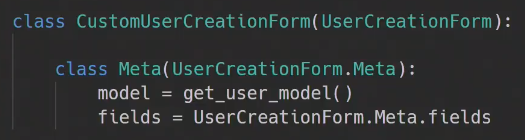

---

<br>

## 2. User참조방식(1:N with User)

settings.AUTH_USER_MODEL은 문자열을 반환

get_user_model()은 객체를 반환

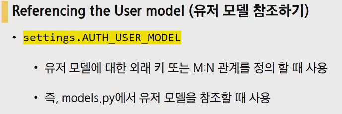


### 2.1. User - Article (1 : N)

유저는 여러개의 게시물을 작성할 수 있다.

- models.py

  ```python
  from django.conf import settings
  
  class Article(models.Model):
      user = models.ForeignKey(settings.AUTH_USER_MODEL, on_delete=models.CASCADE)
      title = models.CharField(max_lenght=50)
      content = modles.TextField()
      created_at = models.DateTimeField(auto_now_add=True)
  ```

  참조하는 모델의 소문자 단수형으로 변수명지정(실제 외래키 만들어질때 변수명을 사용하기 때문!)

- ERD(Entity Relation Diagram) : 객체간의 관계를 다이어그램으로 표현한 것

- model에 변경사항이 생기면 다시한번 `makemigrations`가 필요한데 default설정을 해주어야만 한다

  

  1로 들어가서 기본값을 1로 해주겠습니다.

  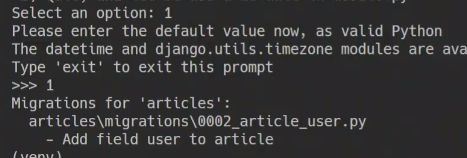

- 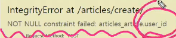

  user_id(외래키)가 들어오지 않았다는 오류. 현재 title과 content 2개의 인자만 받기 때문. user관련 pk정보 또한 얻어야하는데 이것은 `request.user`로 부터 받아 옵니다.

  DB에는 저장되지않도록 하는 commit이라는 설정을 사용

  ```python
  article = form.save(commit=False)
  article.user = request.user
  article.save()
  ```

- 게시글 수정

  게시글 작성자 본인만 게시글을 수정할 수 있도록 설정해주기

  

  ```python
  @login_required
  @require_http_method(['GET', 'POST'])
  def update(request, pk):
      article = get_object_or_404(Article, pk=pk)
      if request.user == article.user: # 요청하는 유저가, 게시글 작성한 유저라면?
          if request.method == 'POST':
              form = ArticleForm(request.POST, instance=article)
              if form.is_valid():
                  form.save()
                  return redirect('article:detail', article.pk)
          else:
              form = ArticleForm(instance=article)
      else:
          redirect('article:index')
      context = {
          'form':form,
          'article': article,
      }
      return render(request, 'articles/update.html', context)
  ```

- delete

  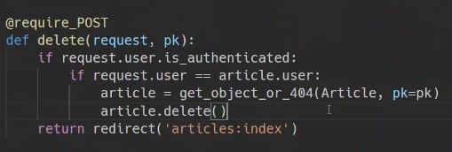

  마찬가지로 게시물의 작성자와 삭제요청을 하는 유저가 같은지 확인하는 조건을 걸어준다

  ```python
  if request.user == article.user:
  ```

---

### 2.2. User - Comment

- models.py

  

- model이 변경되었으니 다시 `makemigrations`, `migrate`

  현 데이터 기준으로 user.pk 1번값을 넣어준다

  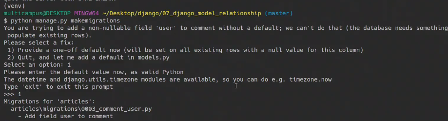

- views.py를 가보면 먼저 create부분

  

- 

  user가 보이지 않도록 form을 수정합니다

  

---

### 2.3. 꿀팁(커스터마이즈)

- 수정시간의 경우 현재시간기준으로 언제 수정이 되었는지 표현하고싶다. 꼭 이런 방식이 아니더라도 human touch의 느낌이 나도록 해주는 app이 있습니다.

  django humanize라는 기능

  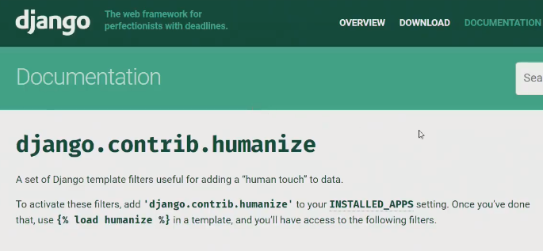

  1 -> ONE, 화폐단위 콤마,  intword, naturalday, naturaltime ...

  생성날짜, 시간만 변경해보면

  - 사용법이 따로 내장되어있지 않다

  - 필터들을 사용하려면 INSTALLED_APPS에 추가해야하고, templates에서 load를 활용해서 사용가능하다

    

    

    

---

- 마무리
- Relation fields
- Customizing Authentication
  - 기본 유저 모델 대체
  - 대체작업이 끝나면 사용할수 없는 모델

- User

- User - Article / User - Comment

---

<br>

## 3. M:N관계

- like와 follow기능

  like는 어떤 모델 간의 관계? article - user (한 명의 유저가 여러개의 게시물에 좋아요 누르기가 가능)

  follow는? user - user(user안에서 재귀적으로 관계를 맺게 되겠습니다 ex. 대댓글 )

- 다대다 관계가 필요한 상황을생각해봅시다

  pjt하나를 부여받았다고 가정해봅시다. 어떤 pjt였느냐

  ```
  병원 진료 시스템
  - 내원하는 환자 / 의사간의 예약 시스템
  - 무엇부터 고민해야 할까?
  - 가장 핵심 모델 -> 환자 / 의사
  ```

  

  harry처럼 data를 입력할 수가 없는 상황. 다른 의사에게 방문한 기록은 어떻게 해야할까? **모델을 빼버리자.**

  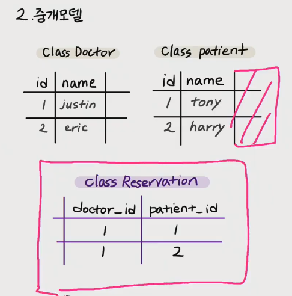

  이렇게 하면 1번의사 - 1번환자, 1번의사 - 2번환자에 대해서 연결이 되어있는 관계를 만들어 낼 수 있다.

  이렇게 중간에 생기는 모델을 `'중개모델'`이라고 합니다.

  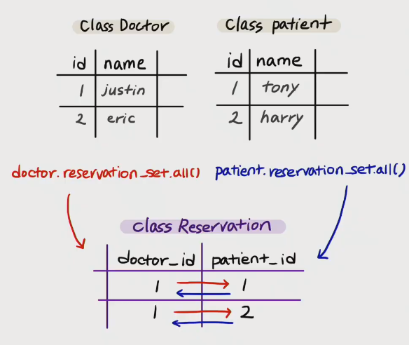

  

  ​	class reservation 모델은 나머지 모델들과 1:N관계를 만든다.

  django가 제공하는 Through

  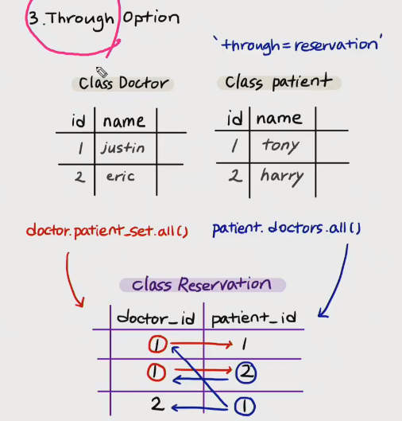

  doctor가 patient를 참조하는 역참조(1:N에서 필드를 N이 가지고 있는데, 필드가 없는 측에서 필드가 있는 측을 참조하는 것)를 하기위해서 **related_name**

  M:N도 마찬가지로 누군가에게 필드를 가지고 있게 할건데 필드가 없는 측에서 필드가 있는 측을 참조하는 것이 역참조

  

  through옵션을 주게되면 _set이 아니라 필드명을 사용할 수 있게 됩니다.

  결국 M:N관계는 중개table을 사용해서(doctor.patients.all(), patient.doctors.all()명령어를 만들어서) 직접 사용할 수 있게 됩니다 

  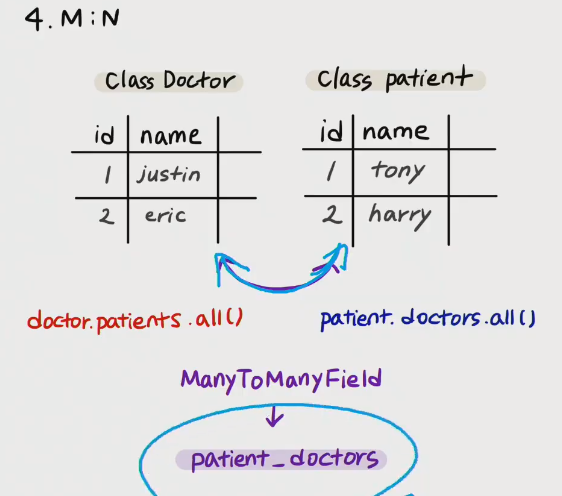

---

## 월말평가

- 월말평가 대해서

  url view templates 

  model - form - admin - url - view - templates

  MTV 방식 관계에 대한 이해가 필요합니당

- 과정

  python -m venv venv

  명세표와 서버 그리고 vscode만 볼 수 있다.

- 디버깅은 무조건 오류가 나게 되어있는데

  나중에 디버깅 시험을 보게된다면 어려울 수도 있습니다. (이제 이해가 필요한 때. 이건 혼자 넘어야만 하는 산입니다. 이해가 안된상태에서는 힘듭니다. 못 풀어요 왜 틀렸지? 어디가 틀렸지? 하는 원인은 발견하고 파악하는 능력이 필요합니다.)

  요즘 실제 코딩테스트에서 작성되다가 멈춘 코드를 받게되는데 심지어 FW을 안받습니다. 상속받은 것을 읽어내고 분석을 하는 능력 또한 필요하고, 실제적으로 필요한 능력을 필요로 합니다. 기존에 쓰던 코드에 녹아들어가서 실무적으로 업무를 할 수 있는지가 결국 필요합니다.

  백지에서 쓰는 내용도 이해가 안된다면 나중에 디버깅에서도 힘들겠으니 화이팅 입니다

- 월말평가 압축해서 제출(venv삭제 후 제출)

---

## 연습

## accounts

**Model**

```python
from django.db import models
from django.contrib.auth.models import AbstarctUser

class User(AbstarctUser):
    pass
```

**form**

```python
from django import forms
from django.contrib.auth.forms import UserCreationForm
from django.contrib.auth import get_user_model


class CustomUserCreationForm(UserCreationForm):
	class Meta:
        model = get_user_model()
        fields = '__all__'
```

**views.signup**

```python
def signup(request):
    if request.method == 'POST':
        form = CustomUserCreationForm(request.POST)
        if form.is_valid():
            user = form.save()
            auth_login(request, user) ############################
            return redirect('accounts:index')
    else:
        form = CustomUserCreationForm()
    context = {'form': form,}
    return render(request, 'accounts/signup.html', context)
```

**views.login**

```python
from django.contrib.auth import login as auth_login

def login(request):
    if request.method == 'POST':
        form = AuthenticationForm(request, request.POST)
        if form.is_valid():
            auth_login(request, form.get_user()) #################
            return redirect('accounts:index')
    else:
        form = AuthenticationForm(request)
    context = {'form': form,}
    return render(request, 'accounts/login.html', context)
```

**views.logout**

```python
@login_required
def logout(request):
    auth_logout(request)
    return redirect('accounts:index')
```

**views.changepw**

```python
from django.contrib.auth.forms import PasswordChangeForm
from django.contrib.auth import update_session_auth_hash

def changepw(request):
    if request.method == 'POST':
        form = PasswordChangeForm(request.user, request.POST)
        if form.is_valid():
            form.save()
            update_session_auth_hash(request, request.user)
            return redirect('accounts:index')
    else:
        form = PasswordChangeForm(request.user)
    context = {'form': form}
    return render(request, 'accounts/changepw.html', context)
```

**views.edit**

```python
def user_edit(request):
    user = User.objects.get(pk=request.user.pk)
    if request.method == 'POST':
        form = UserChangeForm(request.POST, instance=user)
        if form.is_valid():
            form.save()
            return render('accouns:index')
    else:
        form = UserChangeForm(instance=user)
    context = {'form':form}
    return render(request, 'accounts/edit.html', context)
```

**withdraw**

```python
def delete(request):
    if request.method == 'POST':
        user = User.obejcts.get(username=request.user)
        user.delete()
        auth_logout(request)
        return redirect('accounts:index')
```

## :black_nib:보충수업

대전1반 송빈산 교수님

오늘할꺼는 1:N관계

1. User - Article
2. User - Commnet

---

- User사용하지 않고 내가 만든 유저 accounts.User를 앞으로 내가 만든 user로 사용할 것 => settings.py 에서 `AUTH_USER_MODEL = accounts.User`하면 내가 만든 User를 가져오게 됨


- Article CRUD / Comment CRD

  - Article CRUD : 한 사람이 여러개의 글을 쓸 수 있다.

    django에서는 user모델을 가져올때 user를 그대로 가져오는 것이아니라 django만의 방식으로 가져온다.

    get_user_model을 사용해도 괜찮지만 django에서는 **models.py에서는 무조건AUTH_USER_MODEL을 사용하는 것을 권장**

    ```python
    from django.conf import settings # 1
    from django.contrib.auth.models import get_user_model # 2
    from .models import User # 3
    
    class Article(models.Model):
        # django에서는 models.py 에서 1번방식 사용
        user = models.ForeignKey(settings.AUTH_USER_MODEL, on_delete=models.CASCADE)
    ```

  - Comment CRD :

    on_delete는 외래키가 참조하는 값이 삭제되었을 때의 행동을 설정(article이 삭제되었을 때 comment는 어떻게 될 것인가? 정해주는 설정)

    to는 써도 되고 안써도 ㄱㅊ

    ```python
    class Comment(models.Model):
        user = models.ForeignKey(to=settings.AUTH_USER_MODEL, on_delete=models.CASCADE)
    ```

- makemigrations, migrate

  새로운 칼럼이 추가 됐지만, 디폴트값이 주어지지 않았다.  따라서  1. default값을 알려주세요 2. 이 모드를 닫고 직접 models.py를 수정하세요

  

  null=True를 해서 빈칸으로 비어놔둬 괜찮다고 할 것인지, default = ??해서 default값을 마들어 줄 것인지

  빈테이터에서 출발하는 것이라면 위의 걱저은해도 된다. 

- 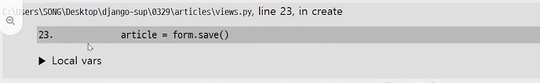

  진한 회색칸이 믿을 만한 정보는 아니다.

  디버깅을할때 어디를 봐야할 까?

  

  create화면을 보여주는 것 => create url, view(GET), template은 ok

  - create를 실행하는 로직(POST)

  url은 사용자가 주소방식으로 요청을 보내는 것.  클라이언트의 urls.py를 분석

  ```python
  @login_required
  @require_http_methods(['GET', 'POST'])
  def create(request):
      if request.method == 'POST':
          form = ArticleForm(request.POST)
          if form.is_valid():
              article = form.save(commit=False)
              article.user = request.user
              article.save()
              return redirect('articles:detail', article.pk)
  ```

- 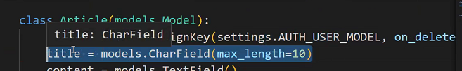

  일반적오 문자열 끼리를 너서 양보를 하지 않는다 

- 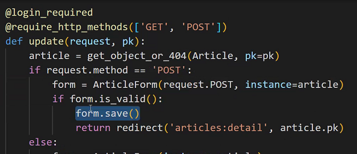

  form.save()밑에 뭔가 추가할것이 있을까??

  위 쪽에 이미 user정보가 들어있기 때문에 따로 추가해줄 부분은 없다.

  근데 만약 내가 쓴 글만 수정가능하도록 하려면??

  1. update버튼이 작성자한테만 보이게끔

     ```html
     <- detail.html ->
     
         <a href="" class="btn btn-primary">[UPDATE]</a>
     
     ```

     

  2. update버튼이 보여도 작성자가 아니라면 다시 detail로 돌아가게끔

     ```python
     # views.py
     
     @login_required
     @require_http_methods(['GET', 'POST'])
     def update(request, pk):
         article = get_object_or_404(Article, pk=pk)
         if article.user != request.user:
             return redirect('articles:detail', article.pk)   
     ```

- comments_create

- 


역참조 시 article.comment_set.all()

근데 이 이름을 바꾸고 싶다 그게 바로 related_name을 사용하면 가능하다


