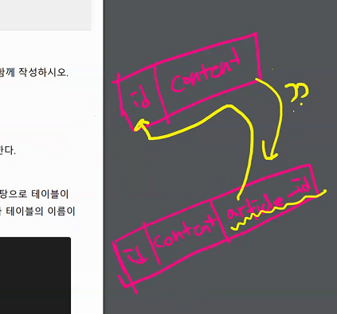
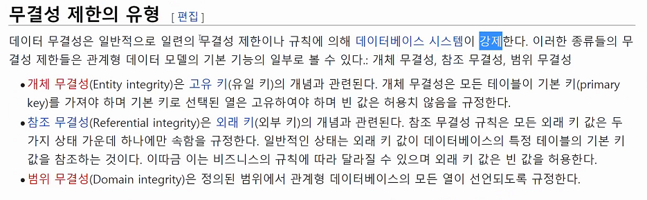
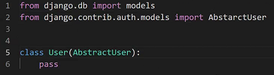
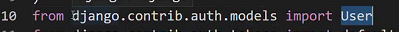
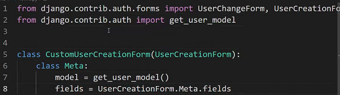
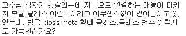
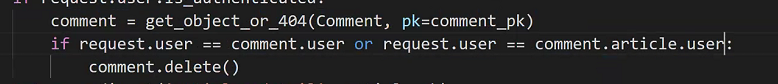
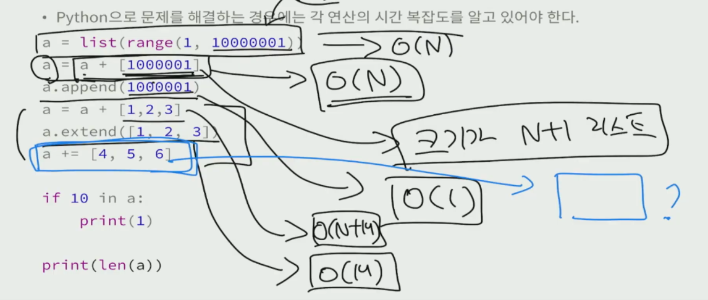

# 웹엑스

- 금일 시간에 DB관련해서 공부해보고, 오늘 질문거리들을 찾아보는 것이 좋습니다

## hw12

### 1. 1:N True or False

> 각 문항을 읽고 맞으면 T, 틀리면 F를 작성하고 틀렸다면 그 이유도 함께 작성하시오.

1) ForeignKey는 부모 테이블의 데이터를 참조하기 위한 키이다.

**True**

2) 1:N 관계에서 1은 N의 데이터를 직접 참조 할 수 있다.

**False** 불가능하다. 1은 N의 데이터를 직접 참조할 수 없다. 

왜 why?? comment.objects.filter(article_id=a.pk)이런식으로 가져와야만 한다

반대의경우는 article.objects.get(pk=article_pk)로 가능



반대는 가능하다. 역참조가능. article.commend_set.all() 과 같은 방식으로 '모델이름_set' 형식의 manager를 생성

3) on_delete 속성은 ForeignKey 필드의 필수 인자이다.

**True**



데이터 RDBMS는 참조 무결성 원칙을 제한한다. on_delete속성은 참조하는 객체가 사라졌을 때 어떻게 행동할지를 설정한 것

4) 1:N 관계에서 외래 키는 반드시 부모 테이블의 PrimaryKey여야 한다.

**True**

PrimaryKey가 유니크한 값이기 때문에 여기서는 True로 보는 것이 적당하다. 

username처럼 유티크하기만 하면되지만 유니크하기위해서 만들어 낸것이 pk이기 때문에 여기서는 적당한 것

---

### 4. next prameter

> 다음과 같이 게시글을 삭제하는 delete 함수와 로그인을 위한 login 함수가 작성되어 있다.  만약 비로그인 사용자가 삭제를 시도한다면 django는 해당 사용자를 url에 next 파라미터가 붙은 login 페이지로 redirect 한다. 
>
> ▪ /accounts/login/?next=/articles/1/delete/

1) redirect된 로그인 페이지에서 로그인에 성공했을 때 발생하는 HTTP response status  code를 작성하고 발생한 원인과 해결을 위해 코드를 수정하시오. 

▪ 게시글 삭제는 HTTP POST method로만 가능하다. 

▪ 인증되지 않은 사용자는 메인페이지로 redirect 되어야 한다


- app url view model의 유기적 관계를 이해하고 있는지에 대한 문제

Method Not Allowed(405) 오류 발생

맨 처음 @login_required 데코로 인해 /accounts/login/?next=/articles/1/delete/ 라는최종 url형식과 포스트잇을 하나 붙여서 로그인으로 보낸다(로그인이 끝나고 가야할곳을 포스트잇으로 붙여놓은 느낌)


redirect는 결국 요청을 보내는 건데 무슨요청이냐면 GET요청이다.


## M:N

## workshop12

- ONE_TO_MANY 플젝 생성

- 

  회원가입할때 생긴문제

  내가 사용할 User를 settings.py AUTH_USER_MODEL을 정해줬기에 CustomUserCreationForm을 만들어줘야만 한다.

- 실제로 백지에서 코드를 짜는 일은 정말 드뭅니다. 남이 짜놓은 코드를 분석해서 그것을 읽어내고, 보완점을 찾아서 수정하는 능력이 중요합니다. 

1. 대체한 User model을 사용한다

   

   settings.py에 선언 accounts앱에 User라는 모델로 사용하겠다는 선언이 필요

   

   `python manage.py makemigrations`, `python manage.py migrate`, `python manage.py runserver`

2. 회원가입이 정상적으로 동작한다

   

   form.is_valid()에서 문제라는 것은 form이 문제인데 지금 UserCreationForm을 사용하고있다. 이것은 내장 User를 현재 사용하고 있다.(확인시, Meta에 User를 사용하고 있다는 것을 확인하고 있다.)

   

   

   우리는 이 내장 User가 아니라 forms.py에서 CustomUserCreationForm을 만들어줘야만 한다. 

   

   

---

- 막간을이용해서 import에 관해서




아래와 같은 방식은 불가능


영역을 달리하는 것이 함수

파일 패키지 모듈 클래스 클래스의 속성, 클래스의 내용까지는 타고 들어갈 수 있다.

함수도 괜찮지만 함수 내의 b는 함수의 속성값이 아니므로 불가능하다

---

3.  메인 페이지에서 각 게시글의 작성자 정보가 출력된다.

   request.user == user 요청을 보내는 사용자

   글을 쓴 작성자를 원하면 article.user.username

   => 서버를 실행하면 아직 보이질 않지만 오류는 나지않는다. DTL에서는 에러가 보이질 않는다는 것을 유의하자

   

   이후 바로 makemigrations를 하면 막 dafault설정하라고 뜨는데 번거로우니

   `$ python manage.py migrate acocunts zero`

   

   특정 DB는 drop해서 저장하는 방식

4. 게시글 작성자 본인만 게시글을 수정 및 삭제할 수 있다.

   

   기능은 살아있지만 사용자에게 보이지 않도록 하는 '눈가리고 아웅방법'

   로직으로도 막아야만한다. 

   ```python
   @require_POST
   def delete(request, pk):
       if request.user.is_authenticated:
           article = get_object_or_404(Article, pk=pk)
           if article.user == request.user:
               article.delete()
       return redirect('articles:index')
   
   @login_required
   @require_http_methods(['GET', 'POST'])
   def update(request, pk):
       article = get_object_or_404(Article, pk=pk)
       if request.user == article.user:
           if request.method == 'POST':
               form = ArticleForm(request.POST, instance=article)
               if form.is_valid():
                   form.save()
                   return redirect('articles:detail', article.pk)
           else:
               form = ArticleForm(instance=article)
           context = {
               'form': form,
               'article': article,
           }
           return render(request, 'articles/update.html', context)
       else:
           return redirect('articles:detail', article.pk)
   ```

- 

- 

## 페어프로그래밍

- user

  

## 백준




파이썬의경우 시간복잡도를 꼭 알아야만 한다.


