# Last Django

## 1. 지난시간

1:1 관계의 연장선에서 User를 사용했다.

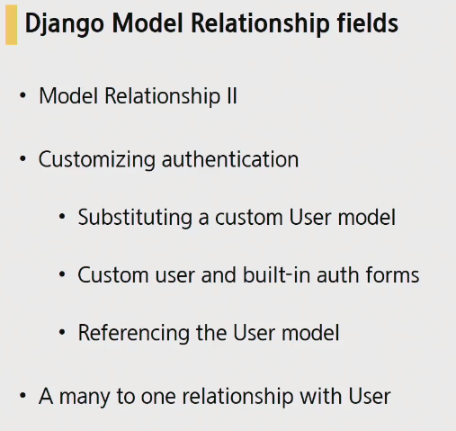

## 2. many-to-many relationship

### 2.1 Basic

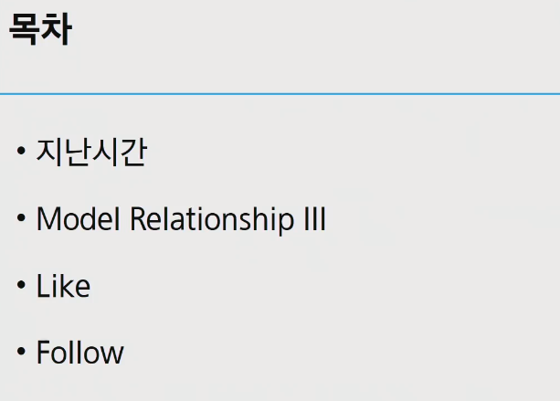


실제 병원에서 진료를 받는다고 했을때 필요한 DB를 설계

핵심이 되는 모델 => 환자 & 의사

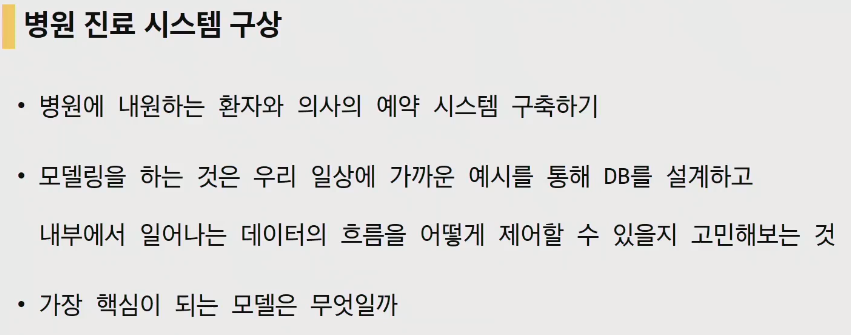

#### 2.1.1. 실습

crud pjt에서 hospitals app을 만들어 준 후 models.py에서 스키마를 짜준다.

환자모델이 의사모델을 참조하도록 1:N관계를 우선 형성

```python
from django.db import models

class Doctor(model.Model):
    name = models.TextField()
    
    def __str__(self):
        return f'{self.pk}번 의사 {self.name}'
    
class Patient(model.Model):
    doctor = models.ForeignKey(Doctor, on_delete=models.CASCADE)
    name = models.TextField()
    
    def __str__(self):
        return f'{self.pk}번 환자 {self.name}'
```


shell_plus작동 의사2명과 환자2만들기

1번환자는 1번의사에게, 2번환자는 2번의사에게 진료를 받도록 1:N관계를 설정.

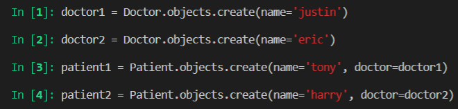

1번환자가 1번의사에게 진료를 받았지만 마음에 안들어서 의사를 바꾸려고한다. 기존객체를 지우고 새로운 정보를 넣을 수가 없으니 새로운 객체를 생성해서 다른 의사에게 예약을해야만합니다.(객체를 하나 더 생성해서 예약을 변경해만 하는 상황. 1:N관계의 한계)

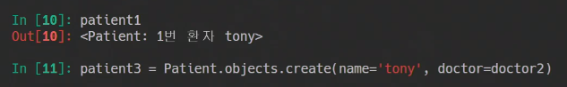

harry라는 사람이 만약 의사 1,2 두명에게 예약이 되어있다면 아래와 같이 표현을 하려고 하지만 아래와 같은 방식은 불가능 => **하나의 콜럼에는 하나의 정보만 들어갈 수있습니다.**


예약될 정보를 저장할 새로운 테이블을 생성해 보겠습니다.

환자쪽에서 의사fk를 가지고 있는것이 아니라, 환자, 의사의 fk를 가지고있는 또 하나의 새로운 테이블을 생성하겠습니다.


```python
class Reservation(models.Model):
    doctor = models.ForeignKey(Doctor, on_delete=models.CASCADE)
    patient = models.ForeignKey(Patient, on_delete=models.CASCADE)
    
    def __str__(self):
        return f'{self.doctor_id}번 의사 {self.patient_id}번 환자'
```


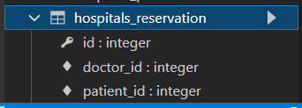

이 상태로 의사 환자 생성해보겠습니다. 다시 한 번 shell_plus들어가서


그렇다면 justin의사의 입장(외래키가 없는 모델)에서 예약된 환자를 확인해보겠습니다.(역참조) doctor의 입장에서 예약조회 하기. `doctor1.reservation_set.all()`


환자도 마찬가지로 환자클래스에서 예약 클래스를 참조할 수 있다. `patient1.reservation_set.all()`

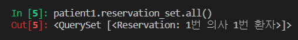

결국, **하나의 테이블을 여러개의 테이블이 참조하고 있는 상황이 온 것**

이번에는 2번환자가 1번의사를 예약한 상황을 만들었습니다. (1번의사에게 2개의예약이 생긴것)


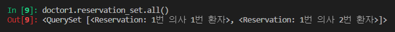

아래와 같은 방식으로 확인이 가능하다


M:N관계는 즉 중개모델을 사이에 두고 서로를 참조하는 관계를 의미한다. 서로 각각을 역참조하게되는 관계가 만들어지는 것이 M:N관계를 이룬다고 할 수 있다.


이번에는 django에서 제공하는 M:N관계를 지정해주는 field가 존재하는데 그것이 ManyToManyField다.

특징은 두 모델중에 어느곳에 둬도 상관이 없다. 일단 patient쪽에서 참조를 해보겠습니다.

참조하는 모델의 복수형으로 작성해줍니다. 

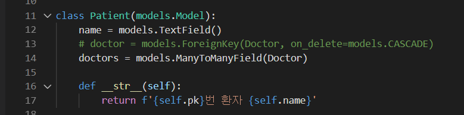


이제 다시 makemigrations, migrate를 만들어 줍니다. 이번엔 다시 2개의 모델만 만들어졌음

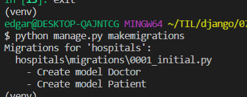

근데 dbsqlite를 살펴보면 3개의 테이블이 만들어져 있는 것을 확인 가능하다 hospitals_patient_doctors는 중개모델을 자동적으로 만들어 준다.

`앱이름 _ ManyToManyField생성된 클래스이름 _ 인스턴스명`


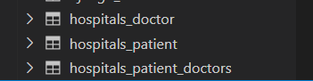


현재 ManyToManyField는 Patient에 있는 상황

아까는 반드시 reservation이라는 클래스 중심으로 참조를 했는데, 이번에는 **서로서로 바로 직접참조가 가능해졌다.**


shell_plus에서 만들어보면

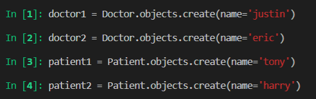

tony가 justin에게 예약을 하고 싶을때 아까전에는 Reservation.objects.create(doctor=doctor1, patient=patient1) .. 이런식이었다면 이번에는 환자입장에서 생각해보면 1번환자가 1번의사에게 진료를 받고싶은경우 `patient1.doctors.add(doctor1)`


예약이 되었는지 확인해보면 예약된 것 확인이 가능하다(환자가 직접 예약을 추가한 것)


patient환자가 예약한 의사를 전부 확인이 가능하다

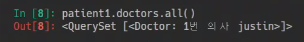


- 이번에는 의사입장에서 환자를 확인해보기. 의사입장에서 나에게 예약된 모든환자를 확인하는 것은 역참조가 됩니다. 역참조는 자신을 참조하고있는 필드를 가진 모델을 참조하는 것(현재 patient가 필드를 가지고있다.)

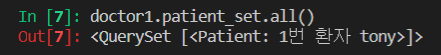

​		M2M필드는 결국 우리가 편한 곳에다가 두면 됩니다.


​		의사가 환자를 직접 예약을 해봅시다.


​		그리고 환자정보를 확인해보면 이제 예약된 정보가 2개가 된 것을 확인가능하다.


---

- 이번에는 취소를 해보겠습니다. 예약취소는 `remove()`

  의사의입장에서 환자를삭제했습니다. `doctor1.patient_set.remove(patient1)`


​		이번에는 환자의입장에서 예약을취소하겠습니다. `patient2.doctors.remove(doctor1)`


​		중개테이블은 그럼 필요가없나? 아니다. **중개테이블에 추가적인 데이터를 사용해야하는 경우 직접 		작성을 해주어야만 한다.** 만약 추가적인 중개테이블을 만들경우에는 ManyToManyField의 옵션으로  		`through`라는 옵션을 추가적으로 사용해주어야만 합니다.

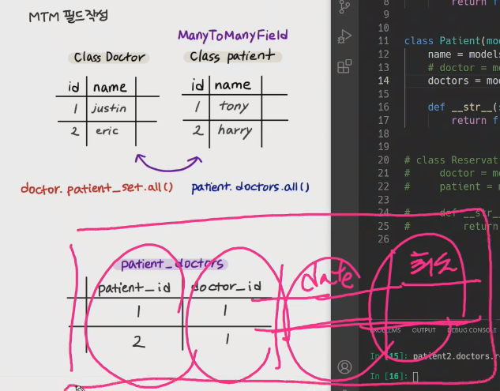


---

현재 참조할때 정참조, 역참조 모델이름이 서로 다른상황인데 이를 같게 해주고 싶다..


- 역참조를 할때 이름을 정해주는 방법 related_name

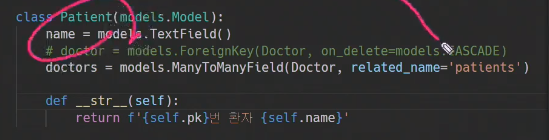

model manager만 바뀌었을 경우에는 DB를 새로 지울 필요는 없습니다.

이후로는 기존에 사용했던 model manager는 사용이 불가능해진다

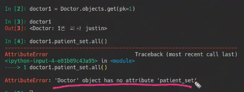

related_name으로 지정해준 patients를 사용가능함. `doctor1.patients.all()`

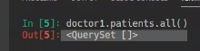

---

<br>

#### 2.1.2. related manager

의사에게 진찰 받는 환자, 환자에게 진찰 해주는 의사 => M:N

추가 : add, 제거 : remove

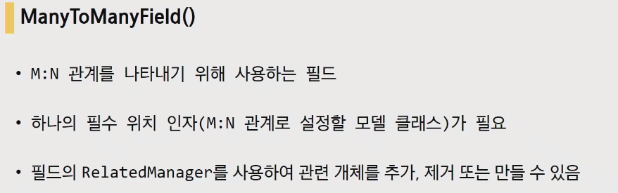

- Related manager : 컨텍스트에서 사용되는 매니저

  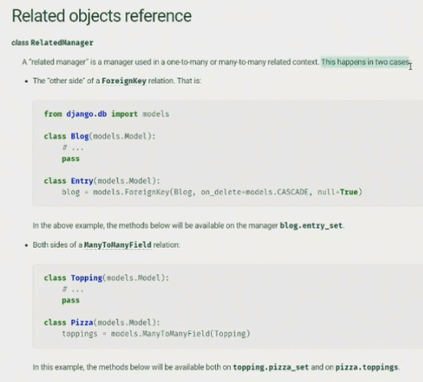

- **1:N 관계에서는 target모델 객체만 methods(add, remove...)를 사용가능**

  Article - Comment 사이에서는 Article만 methods를 사용가능하다는 의미

- **M:N관계에서는 두 객체 모두 동일하게 methods를 사용가능**


- 아까 사용했던 doctors , patinet_set과 같은 중간의 매니져를 related manager라고 합니다.


- 1:N관계에서 fk를 가지고 있는 모델이 source모델, source모델이 참조하고 있는애는 target 모델(Article이 target모델, Comment가 source모델)


---

#### 2.1.3. Arguments

- Arguments

  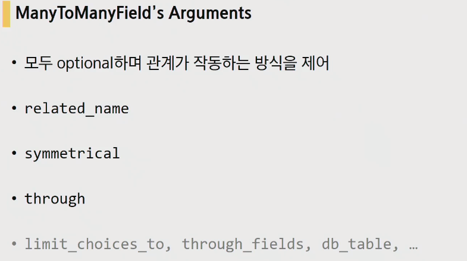

  - `related_name`

    

  - `symmetrical`

    m2m가 재귀적으로 이루어질때 사용하는 optional 인자. `friends = models.ManyToManyField('self')`는 자기 자신을 참조하고있다. 이러한 경우 역참조에 관련된 매니저가 추가되지않고, 대칭적으로 간주하며. source 인스턴스가 target인스턴스를 참조하면 target인스턴스도 source인스턴스를 참조하게 됨

    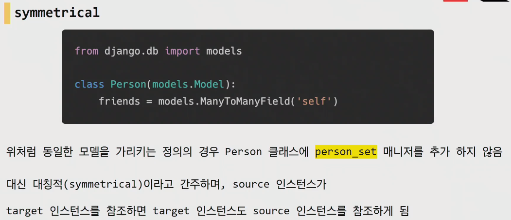

    symmetricla은 기본적으로 True(대칭) 한 번 생각해보면, 1번이 2번에게 친구신청을하면 2번과 1번이 친구가 되는 상황 '너가 내 친구라면 나도 내 친구야'의  관계가 생성되는 것
  
    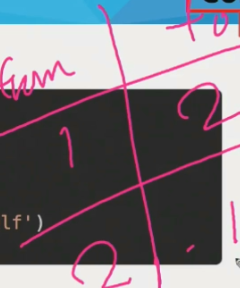
  
    대칭적인 관계를 원하지 않을경우에는 False로 설정해줍니다.
  
    
  
  - `through` : 추가적인 정보를 담은 중개모델을 만드는 경우
  
    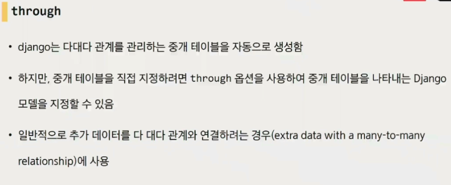
  
  ---
  
  - `add()` : 
  
    - 지정된 객체를 관련 객체 집합에 추가, 
  
    - 이미 존재하는 관계에 다시 사용하면 관계가 복제되지 않음
  
      
  
  - `remove()` : 관련 객체 집합에서 지정된 모델 객체를 제거
  
    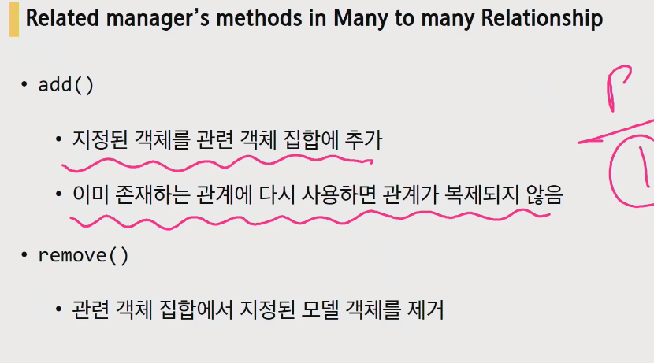

---

<br>

### 2.2. LIKE

- Article과 User의 관계

- Article에는 여러개의 유저의 좋아요가 작성될 수있고, user또한 여러 게시글에 좋아요를 누를 수 있다.(어느 하나에 묶여있지 않다. )

- Article이 manytomanyfield가진다고 생각하고 진행

  ```python
  class Article(models.model):
      # article의 입장에서 related manager의 이름 : 이 게시글에 좋아요를 누른 사람
      like_users = models.ManyToManyField(settings.AUTH_USER_MODEL)
  ```

  모델의 변경사항이 생겼으니 makemigrations를 하면 error가 발생한다. Reverse accessor 역참조. 기존의 어떤의 필드 사이에서 충돌이 일어났다는 건데 뭘까

  User입장에서 역참조 매니저 호출명이 article_set으로 중복된다

  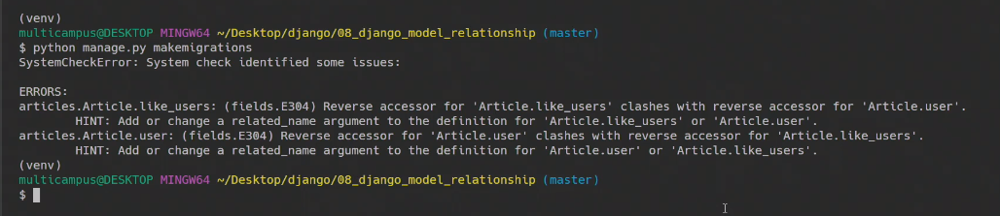

  다시 살펴보면

  1:N 관계에서 User에서 역참조시의 related manager명은 article_set(유저가 작성한 모든 게시글)

  M:N 관계에서도 마찬가지로 역참조시 related manager명은 article_set(좋아요한 모든 게시글)

  하고자 하는 역할은 다르지만 related manager의 이름이 같아진 것. 그래서 migrate를 안해주고 있는 건데 따라서 둘중하나를 바꿔야만 한다. => **related_name을 정해주거나 변경해아합니다.**


```python
class Article(models.model):
    # user.like_aritlces.all()처럼 불러올 수 있다.
    like_users = models.ManyToManyField(settings.AUTH_USER_MODEL, related_name='like_articles')
```

이제 migrate해보면 테이블이 생긴것 확인이 가능하다 `app - class - instance`

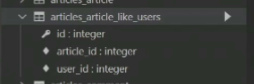

---

- urls.py

  like구현은 어디다가 해야 적당할지 => article이 좀 덜 헷갈리 것

  ```python
  # 좋아요 누르는 게시물이 몇번 게시물인지알아야하니
  path('<int:article_pk>/likes/', views.likes, name='likes'),
  ```

- views.py

  ```python
  # 좋아요는 GET방식으로는 작성되면 안되니까(DB에 변경사항이 생기니까) POST방식을 받는다
  @require_POST
  def likes(request, aritlce_pk):
      if request.user.is_authenticated:
          # 몇 번 게시글에 좋아요가 눌러야하는지 알아야지
          article = get_object_or_404(Article, pk=article_pk)
          # 내가 지금 article에 좋아요를 누른 모든 유저리스트 안에 있는지 판단
          if request.user in article.like_users.all():
          if article.like_users.filter(pk=request.user.pk).exists():
              # 없다면 좋아요 취소. 잘 못눌렀을 경우 취소
              article.like_users.remove(request.user)
          else:
              # article관련객체에 user객체를 추가 == 좋아요
              article.like_users.add(request.user)
          # 좋아요가 끝났다면 index페이지로 이동
          return redirect('articles:index')
      return redirect('accounts:login')
  ```

  - 좋아요를 누르고 안누르고하는 상황에 대한 구분이 중요

    좋아요를 누르는 건 나. **''내''가 ''저 게시물에 좋아요를 누른 모든 유저리스트'' 안에 있는지 없는지를 판단해야한다.**

    `if request.user in article.like_users.all():`

  - django가 특정 레코드에서 적어도 하나만 판단을 해야한다고 하면 권장하고있는 메서드가 있습니다. QuerySet에 filter를 걸어보는 방법. **현재 like_users에서 요청하는 user.pk와 같은게 있는지 없는지 확인하는 filter에서 적어도 하나 이상 존재하는지를 판단**할 때 DB의 쿼리를 최적화 할 수 있는 방안을 권장하기 때문에 `exists()`라는 메서드를 권장하고있습니다.

    `if article.like_users.filter(pk=request.user.pk).exists():`

- index.html

  

  + 몇 명이 좋아요를 눌렀을까? django template language의 filter중 하나를 사용

    `{{ article.like_users.all|length }}`

- exists()가 하는일이 뭐야??

  django queryset api를 검색해서 한번 보자

  

  exists를 검색해서 보면. **QuerySet에 결과가 포함되어 있으면 True를 반환하고, 그렇지 않으면 False를 반환** 이것은 가능한 가장 간단하고 빠른 방법으로 일반QuerySet 쿼리와 거의 동일한 쿼리를 실행합니다. 특히 큰 QuerySet에 특정 검색에 유용합니다.

  

  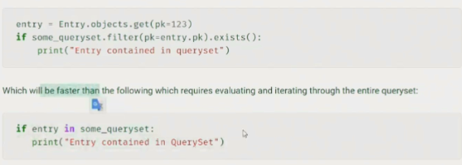

  - 왜 더 빠른가?

    if 문이 평가가 이루어질 때 (DB로 쿼리가 날아가는 시점) 평가를 메모리에 캐시라는 것으로 저장을 해둡니다.(나중에 다시 사용할 경우 대비)

    exist는 아래보다 속도가 빠르다 if문에 의해서 평가가 이루어지는데(DB로 쿼리가 날아간다는 의미), 근데 평가가 되면 django는 이 평가는 메모리 어딘가에 저장을 해둡니다(다음에 평가될때 같은 것이라면 기존에 있던 것을 사용하기 위해)이것을 캐시라고합니다. 캐시로 올리는 것은 좋은데 쿼리셋 자체가 너무 크다면..? 심지어 너무 큰 쿼리셋 안에서 in이 작동해서 탐색을 하게된다면 시간이 오래걸린다.

    exists()는 **평가가 될 때 저장하지 않기 때문에 캐시를 만들지 않고, 특정 쿼리를 DB로 보냅니다.**

    Qeryset이 너무 클때, 그리고 전체조회가 굳이 필요하지 않다면 => .exists()가 더 유용하다

### 2.2 FOLLOW

#### 2.2.1. profile생성

- 일반적으로 팔로우는 그 유저의 정보페이지(user의 detail.html)에 존재하기 때문에 먼저 profile페이지를 만들고 진행하겠습니다.

- 프로필 페이지에는 뭐가 있으면 좋을까? 좋아요한 게시물, 작성한 게시글 등등

- 어디가 적당할까? user의 profile이니까 accounts앱에 작성

- urls.py

  보통 프로필페이지는 url주소를 pk보다는 user의 id로 받습니다.

  ```python
  path('<username>/', views.profile, name='profile'),
  ```

- views.py

  단순 프로필페이지라서 GET요청을 받는다. 따로 POST는 안해도 됩니다.

  user는 굳이 안넘겨주는 것을 권장. 기본적으로 request, user는 context로 보내지 않아도 사용가능하기 때문

  ```python
  def profile(request, username):
      person = get_object_or_404(get_user_model(), username=username)
      context = {'person': person}
      return render(request, 'accounts/profile.html', context)
  ```

- profile.html

  - 유저의 이름

    

  - 유저가 작성한 게시글

    

  - 유저가 작성한 댓글

    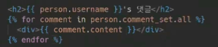

  - 유저가 좋아요를 누른 게시물들의  제목

    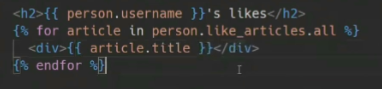

  - 뒤로가기

    

  ```html
  <- profile.html -></->
  
  
  
  <h1>{{ person.username }}님의 프로필</h1>
  
  <hr>
  
  <h2>{{ person.username }}'s 게시글</h2>
  
  	<div>{{ article.title }}</div>
  
  <hr>
  
  <h2>{{ person.username }}'s 댓글</h2>
  
  	<div>{{ comment.content }}</div>
  
  <hr>
  
  <h2>{{ person.username }}'s likes</h2>
  
  	<div>{{ article.title }}</div>
  
  
  <a href="">[back]</a>
  
  ```

- runserver

  

- base.html

  로그인 한 상태라면 프로필로 갈 수 있는 창이 뜨도록

  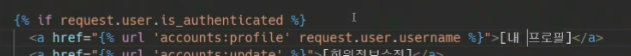

- articles/index.html

  작성자를 눌렀을 때도 작성자의 프로필로 갈 수 있도록

  request.user.username으로 하게 되면 로그인 한 유저의 프로필로 이동하기 때문에 조심

  

  

---

#### 2.2.2. follow

- LIKE와 마찬가지로 m2mField사용. 한 명의 유저는 여러명 팔로우 할 수도 있고,  여러명의 유저로부터 팔로잉을 받을 수있다.

- 차이점은 2개의 모델이 아니라 자기 자신을 재귀적으로 참조를 합니다.

- follow는 어떤앱이 좋을까?? follow는 user - user간의 관계 => accounts가 적당할 듯

- models.py를 수정

  ```python
  from django.db import models
  from django.contrib.auth.models import AbstarctUser
  
  class User(AbstractUser):
      # 재귀참조는 'self', symmetrical=False로 하여 대칭 못하도록 설정.
      followings = models.ManyToManyField('self', symmetrical=False, related_name='followers')
  ```

  - 정참조의 경우 followings

    

  - 역참조의 경우 followers

    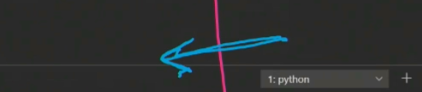

  - 팔로우, 팔로잉을 간단히 설명해보자면

  

  

  근데 여기서 고려해볼점은 m2mfield사용시 자동적으로 서로가 팔로우를 하게 되버린다(바로 맞팔이 되버리는 것. 앞에서 배운 symmetrical 옵션이 True로 되어있기 때문) 근데 보통은 대칭을 사용하지 않는다.

  따라서 symmetrical옵션을 False로 변경해준다. 근데 또 False로 설정할 경우 대칭이 무너지고, 역참조가 발생을 하기 때문에 related_name이 다시 필요하게 됨

  나를 기준으로 누군가를 팔로잉할때는 user.following.~~ 이런식이 어울리니까 인스턴스 명은 following으로 하고, 역참조를 받을경우에는 나는 다른사람의 팔로워가 되는 것이니까 follwers라고 정해주자

  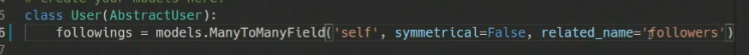

- 모델 변경사항이 생겼으니 makemigrations, migrate

  

- m2mfield이기 때문에 중개테이블이 생성된다. `accounts_user_followings`

  

  from_user_id : 만약 m2mfield가 참조를 하는 것이 자기 자신이라면 from _ model이름 _ id

  to_user_id : to_model이름_id

  1번 유저가 2번을 팔로우한 상태가 아래와 같이 된다.

  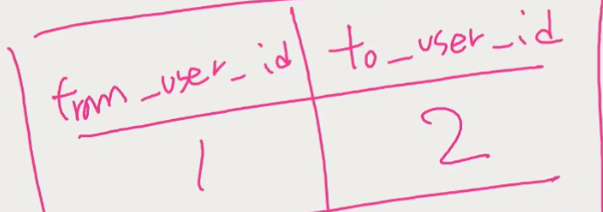

- urls.py

  팔로우에 필요한건 뭘까 : user의 pk가 정확할 것

  ```python
  path('<int:user_pk>/follow/', views.follow, name='follow')
  ```

- views.py

  ```python
  # follow도 중개테이블에 데이터가 들어가는 방식이라서 POST로 받는다.
  @require_POST
  def follow(request, user_pk):
      # 인증이 되어있는 사람만 가능하도록
      if request.user.is_authenticated:
          # 팔로우 받는 사람
          person = get_object_or_404(get_user_model(), pk=user_pk)
          # 팔로우하는 사람(나)
          # me = request.user
          # 나 자신은 팔로우 할 수 없다.
          if person != request.user:
              # in => 현재 요청을 한 유저가 followers들 중에 있는지 없는지
              if request.user in person.followers.all():
              # exists() => 상대방의 팔로워들 중에서 pk가 내pk가 같은사람이 있는지 없는지
              if person.followers.filter(pk=request.user.pk).exists():
                  # 팔로우 끊음
                  person.followers.remove(request.user)
              else:
                  # 팔로우 신청
                  person.followers.add(request.user)
              # 팔로우가 끝나면 상대방 profile로 들어간다
          return redirect('accounts:profile', person.username)
      return redirect('accounts:login')
  ```

  - 두명의 user가 필요 : 로그인된 user, 상대방 => 2개의 인스턴스가 필요하다

  - like또한 현재 게시글에 좋아요를 누른 사람들중 내가 있는지 없는지 판단했다. follow도 마찬가지

  - get이 아닌 filter를 사용하는 이유?? get은 우리에게 쿼리셋을 주는 메서드가 아니라서 값이 없으면 does not exist에러를 발생한다. 근데 지금 상황은 값이 없을 수도 있는 상황. 즉 에러가 발생할 수 있는 상황. filter는 값이 있던 없던 쿼리셋을 반환한다(없으면 빈쿼리셋, 있으면 채워진 쿼리셋). 따라서 filter를 사용한다.

  - 주의사항 : 팔로우는 반드시 남을 팔로우해야하지, 나 자신을 팔로우하면 안된다.

    따라서 me와 you가 다른지 판단해야한다.

- profile.html

  - 제목

    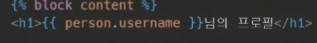

  - 팔로잉, 팔로워 수

    

  - 이미 팔로우 하고있다면 unfollow버튼, 팔로우안하고있다면 follow버튼(토글버튼)

    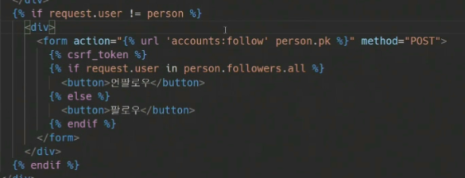

- runserver

  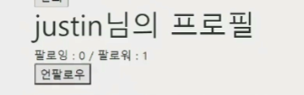

  from_id, to_id중 어디로 들어가게 될 것인가.

  1번 유저가 2번유저를 팔로우한다라는 정보가 담기게 됩니다.

  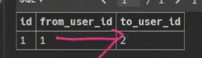

---

공식진도는여기까지 수고했다리 수고했다리 수고했다리 수고했다리 수고했다리 수고했다리 수고했다리

---

### 2.3. +a

#### 2.3.1. html 깔끔히 정리하기

- DB API문법이 중복되게 사용되는 중입니다. 아래 사진의경우는 `person.followers.all`같이 말이죠

  

  DTL 중에서 반복되는 복잡한 변수들을 간단한 변수로 바꿀수가 있습니다. 그것이 바로 `with`

  ``

  이러면 with구문 아래부터는 대체된 변수로 사용이 가능해집니다.

  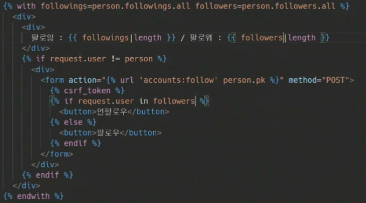

#### 2.3.2. QuerySet은 lazy(게으르다)?

실제 쿼리셋을 만드는 것에는 DB작업이 포함되지 않습니다.

django queryset lazy를 검색해보면 making queries문서가 나옵니다.


```python
# 실제 쿼리셋 만드는 작업에는 DB 작업에 포함되지 않음
q = Entry.objects.filter(headline__startswith="What")
>>> q = q.filter(pub_date__lte=datetime.date.today())
>>> q = q.exclude(body_text__icontains="food")
>>> print(q)  # 여기서 평가
```

쿼리셋 3개가 이루어지는 동안 DB는 아무런 일도 하지 않습니다. 

즉, orm이 DB에 요청을 보내지 않은 것. 그렇다면 언제 보내는가?? 평가를 할때!

- 평가는 두가지 일을 합니다.
  1. 쿼리를 DB로 날린다.
  2. 쿼리셋 캐시
- 평가가 되어야 비로소 DB에 날리는거고 그전까지 DB가 관여하지 않습니다. 왜냐면 DB가 관여하는 것 자체가 굉장히 큰 일이기 때문


- 그렇다면 DB로 평가를 날리는 시점이 도대체 언제인가? 여러가지 시점이 있습니다.

  

  왜 이때 평가가 안되냐면 조회할때 굉장히 조건이 길어지는 경우가 있습니다.

  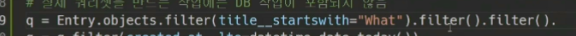

  이렇게 filter를 걸때마다 쿼리를 날린다면 너무 많은 쿼리가 날라가게 되버립니다. 따라서 이러한 상황에서는 쿼리셋을 날리지 않는 것

- 평가는 언제되는가 ? 평가는 쿼리셋에 해당하는 DB의 레코드들을 실제로 가져오는 것을 평가라고 합니다. hit the DB, access the DB, queries the DB라고 하는데, 결국 평가가 되어야 실제로 DB에 orm이 SQL문을 보내는 것.

  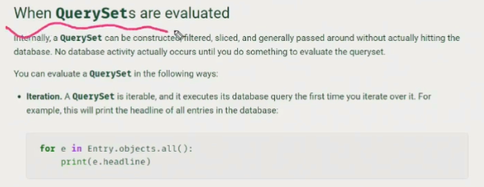

  여러가지가 있다고했습니다.

  **반복될때**, slicing, **repr(객체표현,print될때)**, len, list, **bool(if문일때)** ...  이럴때 평가가 됩니다.

  - Iteration(반복될떄)

    쿼리셋은 반복 가능하며 처음 반복할 때 데이터베이스 쿼리를 실행(평가)

    ```python
    for e in Entry.objects.all():
        pass
    ```

  - bool()

    ```python
    if Entry.objects.filter(title__'test'):
        print('hello')
    ```

- 평가가되면 어떤일들이 벌어지는가? (평가이후)

  쿼리셋의 내장 캐시에 저장됩니다 => 우리가 쿼리셋을 다시 순회할때 또 평가를 하는것이 아니라 이미 평가된 내장 캐시에 있는 그 Data값을 사용하게 됩니다.

- cashing

  각 쿼리셋에는 DB의 access, DB접근을 최소화할 수 있는 캐시값들이 존재합니다. 처음 쿼리 만들때는 캐시 만들어지지도않고 평가될 때 캐시에 저장이 됩니다.

  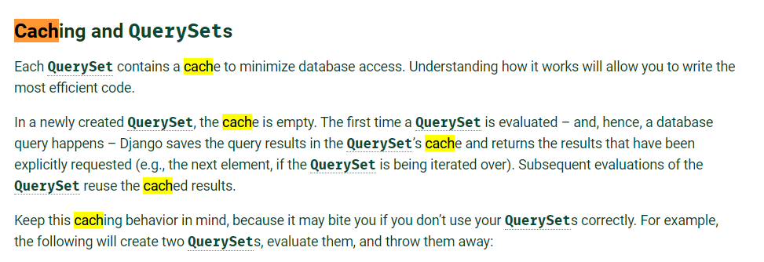

  -  안좋은 예

    ```python
    >>> print([e.headline for e in Entry.objects.all()]) # 평가
    >>> print([e.pub_date for e in Entry.objects.all()]) # 평가
    ```

  - 좋은 예

    ```python
    >>> queryset = Entry.objects.all() # 미리 쿼리셋 부분을 변수화
    >>> print([p.headline for p in queryset]) # Evaluate the query set.(평가)
    >>> print([p.pub_date for p in queryset]) # Re-use the cache from the evaluation.(캐시에서 재사용)
    ```

  - 캐시되지 않는 경우 : 쿼리셋의 특정 인덱스에 접근하는 경우

    ```python
    >>> queryset = Entry.objects.all()
    >>> print(queryset[5]) # Queries the database
    >>> print(queryset[5]) # Queries the database again
    ```

    위 상황을 방지하고자 할 때, 반복문으로 평가를 미리 시켜버리는 것

    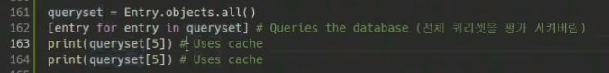

  - DB는 SQL을 씁니다. 쿼리셋만드는 것 자체는 파이썬으로 조작합니다.

    최종적으로 실제 데이터를 받으려면 만든 쿼리셋을 중간에 orm이 SQL로 보내는 것 그러면 최종 결과를 받을 때 그때 평가가 되는 것

  

- '최적화'라는 것은 보다 적은 쿼리로 원하는 데이터를 얻는 과정

- 정리

```python
# 게시글에좋아요를 누른 유저들의 전체를 가져오는 쿼리셋을 사용하고 이를 like_set이라는 쿼리셋으로 만들었습니다. => 아직 DB는 놀고있는 상황
like_set = article.like_users.filter(pk=request.user.pk)
if like_set: # 평가
    # 쿼리셋의 전체 결과가 필요하지 않은 상황임에도
    # ORM은 전체 결과를 가져옴(if like_set에서 전체를 평가했기 때문)
    article.like_users.remove(request.user)
    
# 개선 1
# exists()는 쿼리셋 캐시를 만들지 않으면서 특정 레코드가 있는지 검사
if like_set.exists():
    # DB에서 가져온 레코드가 없다면
    # 메모리를 절약할 수 있다.
    article.like_users.remove(request.user)
    
# 만약 if문 안에 반복문이 있다면?
# if에서 평가 후 캐싱
if like_set:
    # 순회할때는 이미 위에서 캐싱된 쿼리셋을 사용
    for user in like_set:
        print(user.username)
        
# 만약 쿼리셋 자체가 너무 크다면? (정말 큰 레코드를 다루어야 하는 경우에 Data를 한번에 다 가져와서 메모리에 올리는 것은 힘들다, 너무 비효율적)
# iterator
# 데이터를 적은 덩어리로 쪼개서 가져오고, 이미 사용한 레코드는 메모리에서 지움
# 전체 레코드의 일부씩만 DB에서 가져오므로 메모리를 절약한다.
if like_set:
	for user in like_set.iterator():
        
# 그런데 쿼리셋이 너무너무 크다면 if 평가에서도 버거움
if like_set.exists():
    for user in like_set.iterator():
```

- 안일한 최적화의 함정

  최적화를 안일하게 한다는 함정에 빠질 수 있습니다.

  마지막 구문 exists는 캐싱을 하지 않기때문에 메모리 자체는 아낄 수 있지만 아래쪽에서 같은 쿼리가반복 될 가능성이 있습니다.

  


## 3. 웹엑스시간

환자예약, 게시글좋아요, 재고관리

데이터가 들어갔을때 어떻게 저장이 될 지를 상상해보면 좋습니다


add()는 중복 불가

위처럼 중개모델을 정의하는 방법이 있고, 처음부터 ManyToManyField로 만드는 방법이 있다.

모델클래스는 무조건 단수로 짓습니다.

아티스트와 노래의 관계는 어떨까요? M:N 입니다. 합작이 일어난  경우가 있으니


1:N이 2개가 된 것이 M:N관계라고 볼 수 있습니다.

그렇다면 차단은 어떻게 구현할까요?? user article m:n


같은 테이블 형태이지만 내가 어떻게 부르느냐에 따라서 기능이 달라지는 것입니다 . 

---

- 게시판을 만들고

  

- 모델을 만들고

  

  

- pip install faker

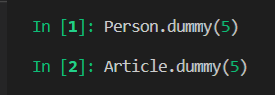


- p1이 a1을 좋아요 표시했다 == a1에 p1이 좋아요 표시함

  

- a2에 p1이 좋아요 표시했다

  

- p1이 a1, a2에 표시한 좋아요를 취소할게요

  

- a1게시물을 좋아하는 3명의 사람

  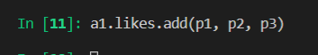

- a1게시물에 좋아요 표시를 한 사람, 사람 수

  

- a1 게시물 좋아한 사람중 이름이 마이클인 사람

  


- 새롭게 scraps라는 걸 추가할때, Person에서 Article을 어떻게 부르나? .article_set으로 불러야하지만 문제가 생긴다

  

  

- 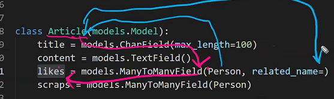

  **Article입장에서 Person을 부를때 likes라는 이름으로 부르겠다.**

  **Person에서 Article을 부를때 related_name이라는 이름으로 부르겠다.**

- 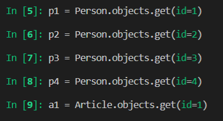

  

- Person이 작성자

- 더미

  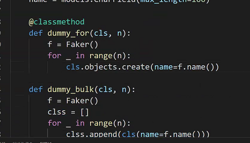

  

---

모델링이 우선 -> 그다음이 UI, UX

---

내일 인스타 클론코딩


## 4. 보충수업

### 4.1. venv사용이유

같은 환경에서 설치한 패키지를 사용하기 위해서

### 4.2. M:N관계

- 좋아요 표시를 한다?? => DB에 좋다고 했던 기록을 남긴다
  
- 유저 - 게시글, 유저 - 댓글
  
- 어떠한 모델을 형성할 때 그 관계를 모르겠다면

  - 하나의 유저가 여러 포스트를 좋아할 수 있는가?

  - 한 포스트를 여러 유저가 좋아할 수 있는가?

  이 두가지 질문을 따졌을 때 둘다 허용이 된다면 => 유저 - 게시글 => many-to-many관계

  유저 - 댓글 => 하나의 유저가하나의 댓글을작성 o , 하나의댓글에 여러 작성자가 작성?? x => 1:N 관계

- 어떤 기능을 추가한다? => url view tempate + model, form

  우리는 기능을 알고있기에 model먼저 하겠습니다.

- 복수형으로 인스턴스명을 작성

  ```python
  like_users = models.ManyToManyField(to, related_name)
  ```

  - to : m2m관계를 누구와 맺을건지

  - related_name : 필수는 아니지만 역참조를 할때 이름이 겹치게 되는 경우가 있기때문에 필요하다.

    post.user, post.like_users 정참조할때는 상관없다. 다만 user.post_set처럼 역참조를 할때 like_users에 관한 정보인지 어떤 정보인지 구분을 할 수 없기 때문에

  - 여기서는 on_delete속성을 사용할 수 없다.

    on_delete속성은 데이터간에 글과 댓글처럼 주종관계가 있을때(1:N), 

    

    기록은 또 다른 부분입니다. 탈퇴한다고 해서 게시글이나 좋아요 표시가 사라져야하나요? 이 부분은 유저 - 게시글의 관계인데,  이 둘의 관계에 한해서는 종속관계가 존재하지 않는다. 따라서 on_delete속성을 받을 필요가 없다.

- 자 이제 model을 변경했는데 form도 바꿔줘야하나??? => 없다.

  

  실제 모델폼에서 관리하고 있는 것은 post테이블에 실제로 작성된 필드만 관리를 합니다. 근데 like_users를 추가를했습니다. 그러면 실제로 DB에 like_users라는 필드가 추가되는 걸까요??

  

  추가되지 않습니다. M2M관계에서 실제로 post테이블에 추가하는 것이 아니라 

  

  1:N관계에서는 user생기는 것이 맞는데

  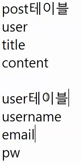

  m2m관계에서는 ManyToManyField를 사용할 시에 중개테이블이  생성됩니다.

  

  => 필드가 실질적으로 추가되는 것이 아니기 때문에 form을 수정할 필요가 없습니다.

---

- 새로운테이블이 필요한 이유

  새로운 필드를 만들어서 m2m관계를 만들 수 없다.

  우선 대 전제가 있다 : **하나의 필드에는 하나의 값만 들어간다.** 이것이 DB필드의 대 전제.

  

  아래와 같이 만드는 것이 불가능하다는 것

  

  이러한 점을 보완하기 위해서 할 수 있는 방법은 필드를 하나 추가하는 것

  

  이렇게 상황이 일어날때마다 필드를 추가해야만 하는가? 이는 모델을 계속 변경한다는 건데 그럴 수가 없다.

  따라서 중개테이블을 사용하게 됩니다. 하나의 필드에 데이터가 하나씩 들어가고 한사람이 여러가지를 좋아할 수 있고 여러가지 정보를 담을 수 있게 됩니다.

  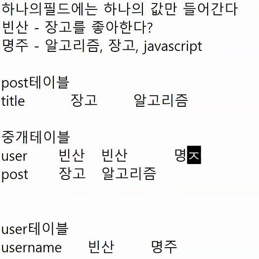

  이게 또 장고가 저런 중개테이블을 직접만들지 말고 도와주는 것이 manytomanyfield인 것 

---

- urls.py

  버튼을 눌렀을 때 좋아요를 표시할 수 있게, 실제 기록이 될 수 있게 해주는 url이 필요하다

  ```python
  path('<int:post_pk>/like/', views.like, name='like'),
  ```

---

- views.py

  view에서 처리해주어야 하는 일 : 로그인한 유저가 post_pk의 글을 좋아요 했다고 기록한다

  1. 로그인한 유저만 접근 가능하도록
  2. 포스트를 가져온다
  3. 실제기록. 중개테이블에 저장
  4. index페이지로 redirection한다

  ```python
  @require_POST
  def like(request, post_pk):
      if requeset.user.is_authenticated:
          post = get_object_or_404(Post, pk=post_pk)
          # 이미 좋아요를 했는지 안했는지
          # if request.user in post.like_users.all():
          if post.like_users.filter(pk=request.user.pk).exists():
              # 좋아요 취소
              post.like_users.remove(request.user)
          else:   
          	# 내 글에 좋아요한 사람들의 목록에 현재 유저를 추가하겠다.
          	post.like_users.add(request.user)
      return redirect('posts:index')
  ```

  좋아요를 한 사람이면 추가 못하고, 안한 사람이면 추가 할 수 있도록 => in, filter

  .exists() 를 붙이면 True or Flase가 됩니다.

  `if request.user in post.like_users.all():` DB에서 전부다 가져와서 python이 검사

  `if post.like_users.filter(pk=request.user.pk).exists():` 중개테이블에서 id가 post랑 같은 것을 DB에게 물어보고 결과만 python이 받아서 exists()를 수행

- 이게 tempate에 좋아요버튼 + 좋아요 수

  - 좋아요 버튼, 좋아요 취소버튼 => 좋아요 했으면 취소버튼, 안했으면 좋아요 버튼이 나오도록

  

  ​	만약 in사용이 아니라 views에서 사용했던 filter를 사용하고 싶다면 detail의 context에 담아서 보내줍니다.

  - 좋아요 수

    