# django 유교수님 수업

- ERP(전사적 자원관리)

  대학교 포털 사이트 또한 ERP로 작동된다

  SAP라는 회사

  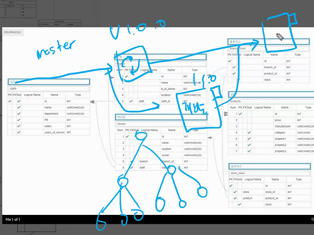

  System Integration에서 개선하는데 이러한 비용이 많이드는데 개선해서 이득보는 것보다 개선하는 비용이 더 크기 때문에 수정하지 않는 것.

- font-awesome

  

---

## insta

- 원래는 user - article 사이에 관계에서는 아래와 같았지만


- follow의 경우에는 재귀적참조로 인해서 방법이 좀 달라진다

  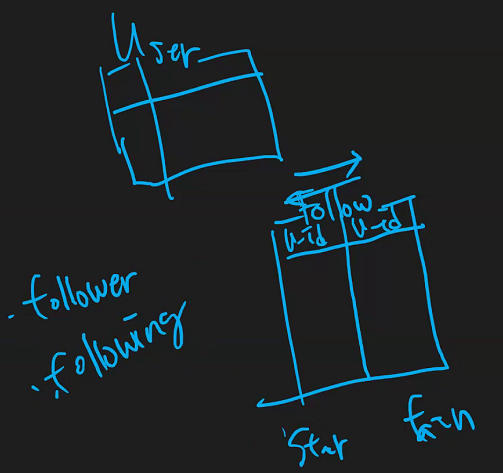

---

- shell_plus

  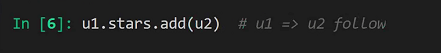

  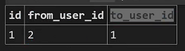

  나를 따르는사람을 fans, 내가 따르는 사람을 stars로 정함

  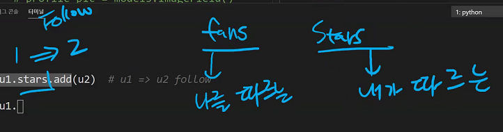

---

- follow기능을 위한 model을 만드는데

  ```python
  class User(AbstractUser):
      # 완전히 같은 코드
      # fans = models.ManyToManyField('self', symmetric=False, related_name='stars')
      stars = models.ManyToManyField(settings.AUTH_USER_MODEL, related_name='fans')
      
      def __str__(self):
          return f'{self.pk}: {self:username}'
  ```

  - from to는 중요치 x **어떻게 해석될 것인가**를 정하는 것이 중요한 부분.

  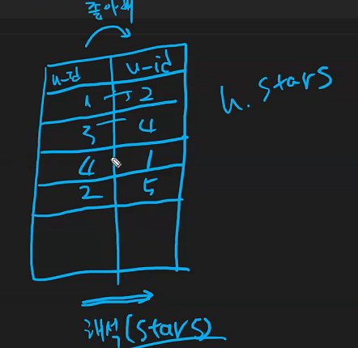

  - 준다 : u1.준다.(u2) => u1.give.(u2)
  - 받는다 : u2.받는다.(u1) => u2.recieve.(u1)
  - 정해져 있어야만 하는 것은 오늘 쓰던 방식을 내일도 같은 방식으로 써야만 한다는 것

- 친구가 된지 4년째 ,.. 기능만들기

  ```python
  class User(AbstractUser):
      relationships = models.ManyToManyField(settings.AUTH_USER_MODEL, related_name='fans', through='Relationship')
      
      def __str__(self):
          return f'{self.pk}: {self:username}'
  
  class Relationship(models.Model):
      fan = models.ForeignKey(settings.AUTH_USER_MODEL, on_delete=models.CASCADE)
      star = models.ForeignKey(settings.AUTH_USER_MODEL, on_delete=models.CASCADE)
      created_at = models.DateTimeField(auto_now_add = True)
  ```

  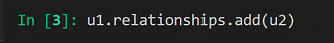

  

  relationship이 헷갈려서 이름을 바꿔주면

  

  

  u1이 u2를 좋아하게 된 날

  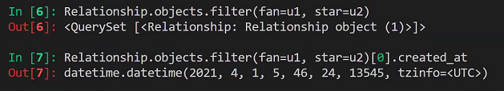

  아마 대략 사용할 수 있는 건 다음과 같을 것이다.

  

- u1이 팔로잉한 목록을 보고싶다

  `Relationship.objects.fileter(fan=u1)`

  

  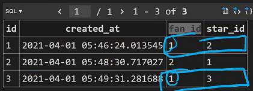

- `for i in Relation.objects.filter(fan=u1):`

  `print(r.star.pk)`

  

- 

- `Relationship.objects.get(fan=u1, start=u2).ceated_at`

  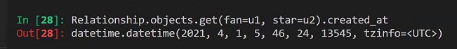

- MTM 필드를 쓰는 이유가 중계테이블 안하려고 하는건줄알았는데 (쟝고가 자동으로 중계테이블 넣어주니까) 이러면 왜 중계테이블을 둘건데, MTM 필드를 또 만들고 쓰루옵션도 주는건가요 ㅠㅠ

  중개테이블에 직접 조작하는 것보다는 연결되어 있는 객체를 기준으로 조작하는 것이 나아서 그런거 아닐까 생각해봅니다

  

  결국 관계조작의 차이때문에 

  

- through에 대해서...

  

  

  through를 사용한 경우와 사용하지 않은경우

  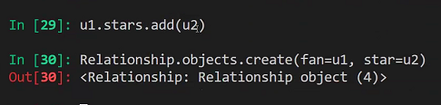

- 

---

- 삭제용

  ```python
  for r in Relationship.objects.all():
      r.delete()
  ```

- User중심 vs Relationship 중심(주어가 되는 객체 / 모델)

  ```python
  u1, u2, u3, u4, u5 = User.objects.all()
  
  # u1이 u2를 팔로우 합니다.
  u1.stars.add(u2)
  Relationship.objects.get_or_create(fan=u1, star=u2)[0]
  ```

  

  ```python
  # u1이 u2, u3를 팔로우합니다.
  u1.stars.add(u2)
  u1.stars.add(u3)
  Relationship.objects.get_or_create(fan=u1, star=u2)
  Relationship.objects.get_or_create(fan=u1, star=u3)
  ```

  ```python
  # u1의 팔로잉 목록을 조회
  u1.stars.all()
  ```

  

  

  ```python
  stars = []
  for r in Relationship.objects.filter(fan=u1):
      stars.append(r.star)
  stars
  ```

  

  ```python
  # u3의 팔로워 목록을 조회
  u3.fans.all()
  
  fans = []
  for r in Relationship.objects.filter(star=u3):
      fans.append(r.fan)
  fans
  ```

  

  ```python
  # u1의 팔로잉 목록중 2021년 이후에 팔로우 한 사람들
  from datetime import datetime
  u1.stars.filter(username__contains='n')
  ```

  

---


최종적으로 fans의 결과는 user stars의 결과또한 언제나 user

- Relationship이 메인이 되어야 하는 시점

```python
# u1이 팔로잉한 사람들 목록을 '최근 순으로'
Relationship.objects.filter(fan=u1).order_by('created_at')
```

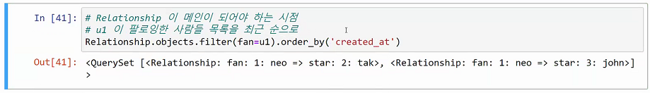

=> 결국 through를 사용해서 중개테이블을 만드는 것은 추가 데이터가 필요하지 않다면, Relationship 모델을 만들 필요가 없어진다.

- u1.fans.add(u2) 라고 하면 relationship 테이블의 첫 외래키 컬럼(이름 상관 없이)에 u1이 들어가고 두번째 외래키 컬럼에 u2가 들어간다고 이해했는데 맞나요?

  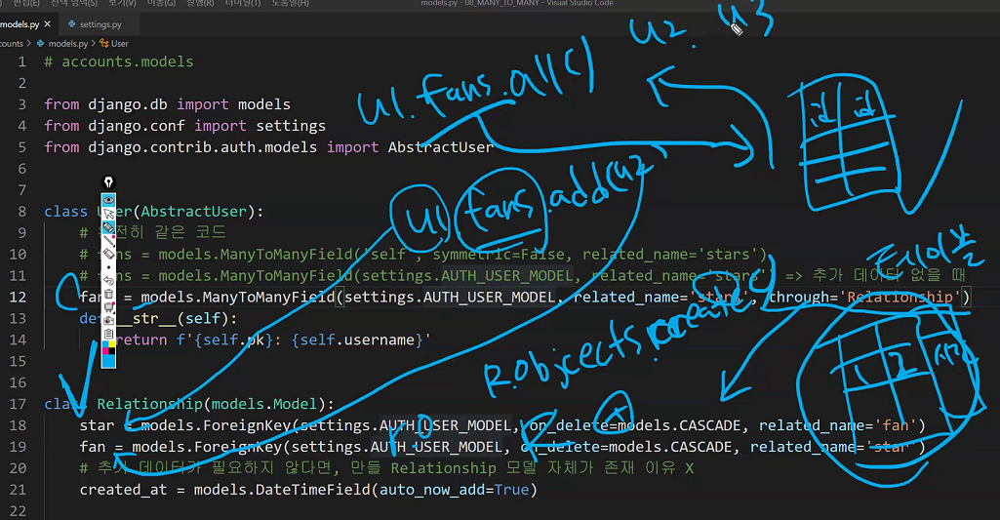

- 

  

- 

  

  

- 

---

추가데이터가 필요하다면 => through로 직접 중개테이블을 만들어줘야합니다.


---

- 추가 필드 작성하기

  ```python
  # 1. u2가 u3를 팔로우. 이유는 좋아서
  u2.stars.add(u3, through_defaults={'follow_reason': '좋아서..'})
  ```

  through모델에 default값을 줄건데 뭐라 줄것이냐 {'follow_reason': '좋아서..'}

  ```python
  # 2. relation입장에서 접근하기
  r = Relationship.objects.get_or_create(fan=u2, star=u3)[0]
  r.follow_reason = '좋아해..'
  r.save()
  ```

  get_or_create는 튜플이라서 뽑을때 [0] 인덱스 붙여서 뽑아주어야만 한다.

  ```python
  # 삭제
  u2.stars.remove(u3)
  Relationship.objects.get(fan=u2, star=u3).delete()
  ```

---

- 좋아요, 팔로우는 결국 C와 D

- insta/views.py 처음엔 좋아요

  ```python
  from django.shortcuts import render, get_object_or_404
  from .forms import ArticleForm, CommentForm
  from .models import Article, Comment
  
  def like(request, article_pk):
      # user_id, article_id
      # Create
      user = request.user
      artiicle = get_object_or_404(Article, pk=article_pk)
      article.like_users.add(user)
      return redirect('')
  
  def cancel_like(request, article_pk):
      # Delete
      user = request.user
      artiicle = get_object_or_404(Article, pk=article_pk)
      
      article.like_users.remove(user)
      return redirect('')
  ```

  근데 여기서 보면 add, remove빼고 다 똑같다. 따라서 이걸 합쳐버릴 수도있을 것

  ```python
  # /insta/<int:article_pk>/like/
  def like(request, article_pk):
      user = request.user
      article = get_object_or_404(Article, pk=article_pk)
      if user.is_authenticated:
          # 인증된 사용자가, 좋아요를 눌렀다면,
      	if article.like_users.filter(pk=user.pk).exists():
              # Delete
              article.like_users.remove(user)
          else:
              # Create
              article.like_users.add(user)
      return redirect('insta:article_detail', article.pk)
  ```

- /accounts/views.py follow

  ```python
  from django.shortcuts import render, get_object_or_404
  from django.contrib.auth import get_user_model
  
  user = get_user_model()
  
  # /accounts/<int:article_pk>/follow/
  def follow(request, username):
      user1(fan) = request.user # follow요청을 보낸 사람
      user2(star) = get_object_or_404(User, username=username)
      if user.is_authenticated:
          # 인증된 사용자가, 좋아요를 눌렀다면,
      	if fan.stars.filter(pk=star.pk).exists():
              # Delete
              fan.stars.remove(star)
          else:
              # Create
              fan.stars.add(star)
      return redirect('accounts:detail', star.pk)
  ```


- 

## homework살펴보기


UsercreationForm 그대로 import해서썼습니다

유저모델 바뀌었는데 signup에서 기존 모델 사용


user에서 역참조시 manager이름이 동일해버리기 때문에

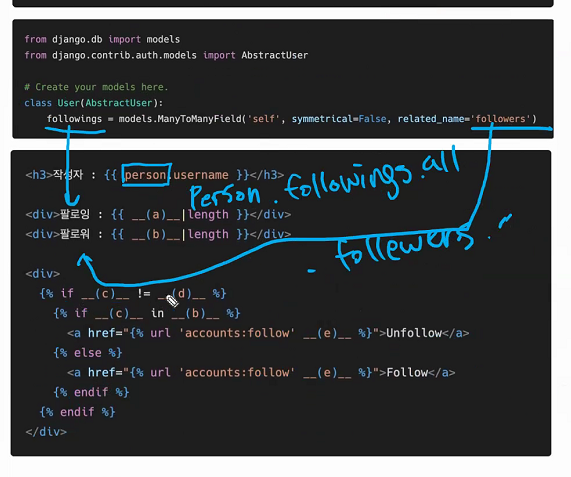

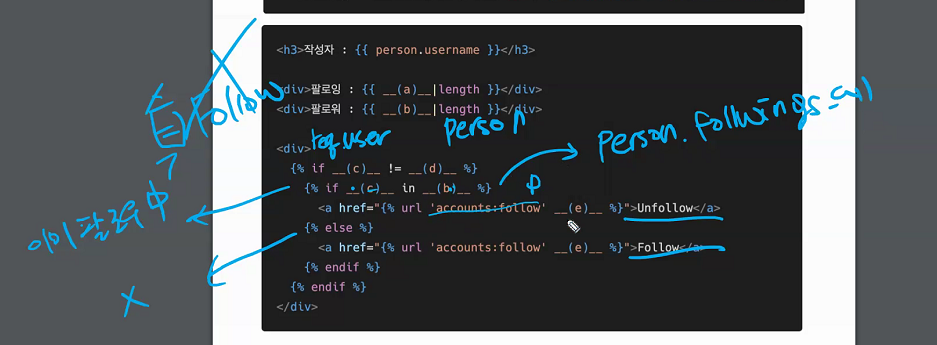

## 과제

킹시보기 views, templates 다시보세유

## 앞으로 남은 내용..

현재까지 배운 내용으로 follow 누르면 DB에 한줄이 써집니다.

follow의 끝은 redirect되는데,


상태에 따라서 유기적으로 반응하는웹을 짜기위해서 react, vue를 사용하게 됩니다.

Single Page Application 사용이유 1. UX(사용자 경험)의 향상 2. 유기적으로 연결된 요소들을 각각 조종하는 것이 아니라 한번에 모두가 동시에 움직이게(reactive)하는 것

참고 : 애플 키노트 2017 (물흐르듯 이어지는 UX)