# django_GIT

- 깃은 이것저것 삽질을 많이 해봐야합니다.
- 보통 기능에 따라서 브랜치를 따오게 됩니다.

- 브랜치 파기 : git branch change
- 브랜치 옮기기 : git switch change

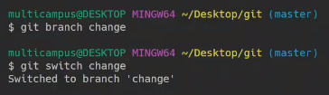

- 원하는 내용 수정 후 커밋

  

  

  보통 하나의 기능이 완성될 때마다 커밋을 하는 것이 확인하기에 더 편리합니다.

  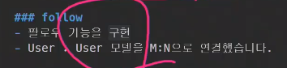

  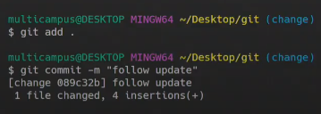

- 팀원이 새로운 브랜치를 파고 브랜치를 옮김 git branch aclass, git switch aclass

- 현재 목표는 서로 다른 브랜치를 만들어서 master에서 합치는 것

  

- 각각 깃 푸시를 해보면 git push origin change

- 세개의 브랜치 확인이 가능해진다.

  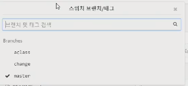

- 어떤것을(source) 어디로(target) 합칠 것인지 첫번째는 change를 master로

  

  이후에 소스 브랜치를 삭제하면

  

  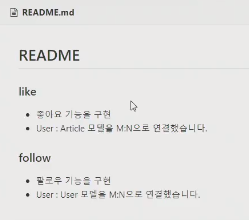

- 이번에는 aclass를 master로 merger request를 보내보면 '머지 충돌이 있습니다' 메시지 확인이 됩니다.

  

  충돌해결 눌러보면 충돌이 일어난 부분을 보여줍니다.

  해결방법 1. gitlab에서 해결 2. local에서 해결 웬만하면 local에서 작업합니다 

  

- git switch master하면 무슨상태가 될까?

  

  아직 git pull을 하지않아서 master내용이 gitlab에만 있는상태

  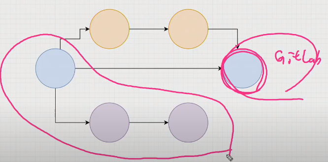

  git pull origin master해서

  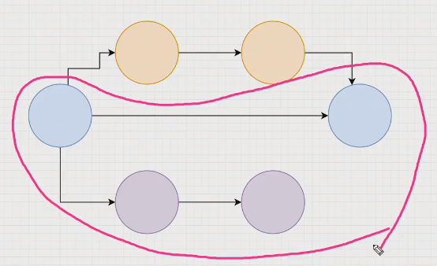

  만약 aclass브랜치에서 git pull을 하게된다면 aclass를 기준으로 merge를 진행하려고 하게 됨(조심하자)

  

- aclass로 merge해보면 local에서 수정이 가능해진다

  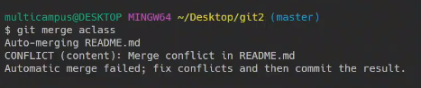

  

- git add, commit하면 MERGING단계가 사라지게 됨

  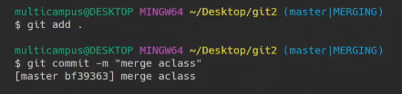

- 이것을 다시한번 푸시

  

- 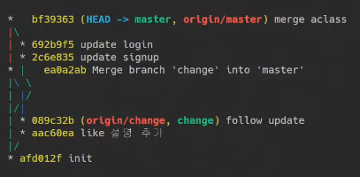

## 오늘플젝

follow, like => M:N

지난주 프로젝트 그대로 유지

## 다음주 시험

- SQL개념

- django 99_SQL markdown중심으로 보세요

- SQL, django ORM 다 DB

- 우리가 사용하는 SQL는 결국 RDBMS시스템중 하나입니다.

  SQL문법을 알면 어떤 RDBMS를 사용하더라고 조금씩만 바뀔 것.

- 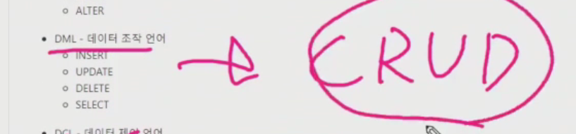

  - **CRUD를 ORM에서는 어떻게 하고, SQL에서는 어떻게 했는지**

- .으로 시작하는 명령어는 pass

- CREATE : 데이터 정의하는 명령어

  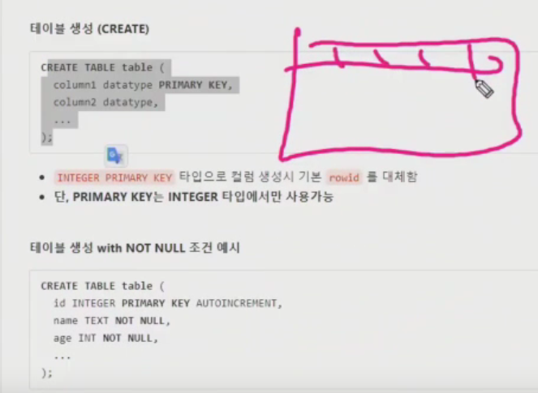

- AUTOINCREAMENT : 자동으로 증가하는 숫자 확인

- 제일 중요한 부분 : 데이터 추가, 읽기, 수정, 삭제

  

  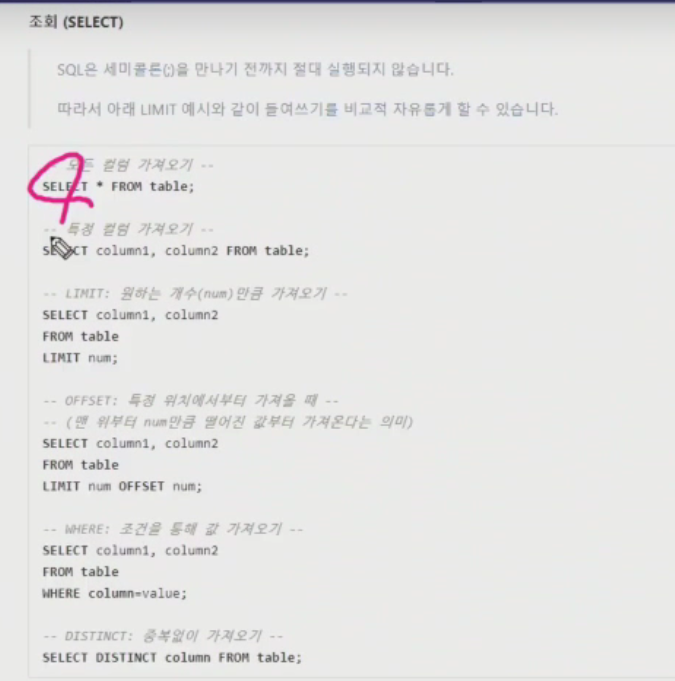

  - 이러한 SQL구문들을 어떻게 ORM으로 바꿀지도 확인해 보는 것이 중요합니다.

    예를들어

    

- 

- where절(조건)의 연속

  

- 정렬(ORDER BY)

  

-  GROUP BY

  

- ALTER

---

+ 장고에서 1:N과 M:N의 개념 익히기

  + 1:N => fk, on_delete

    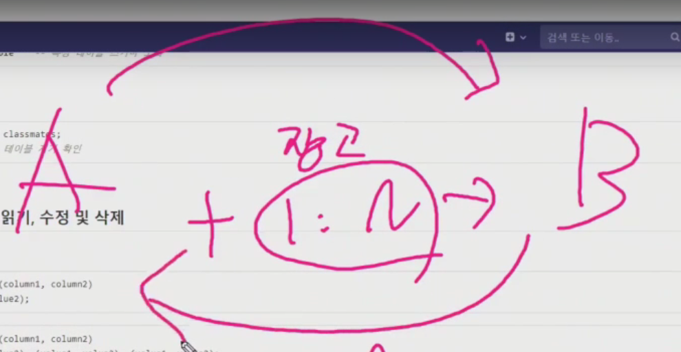

  - M:N => 모델어케 선언, 역참조

+ homework와 workshop다시보세요

  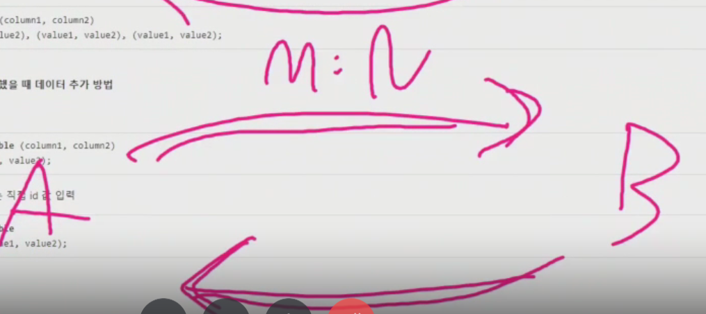

---

우선순위

1. SQL - ORM 비교
2. 1:N 관계 (user, article, comment)
3. M:N 관계(like, follow)

## 유교수님 시간

### filter관련된 질문의 확장..

- grep : global regular expression & print

- grep --help : 사용할 수 있는 정보

  

  

- 함수이름 첫번째 인자 두번째 인자

  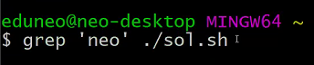

- 출력된 함수의 결과값들. 이것들을 표준 출력이라고 합니다. print해서 내 뱉는 것들 standard input & output => 이것이 바로 stdio.h

  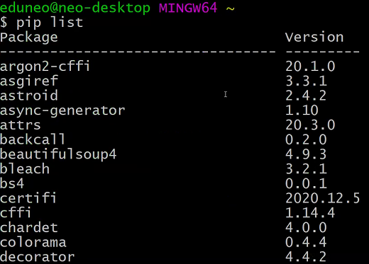

- pip list이 표준출력에 파이프(|)를 만나면 맨 뒤에 붙여서
- 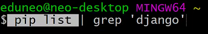

- 

- 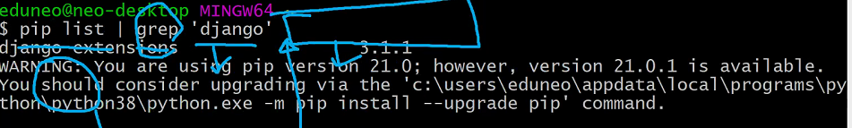

- 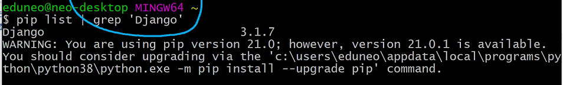

- case inten뭐시기 대소문자 가리지 않으면 다음과 같이 나온다

  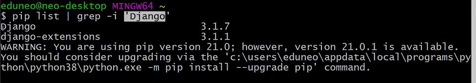

- 이게 ctrl alt delete해서 작업종료하는 것

  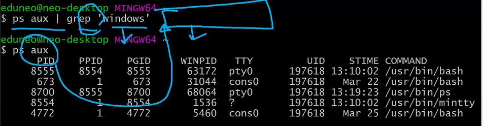

- 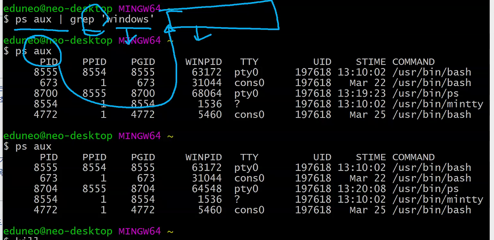

- 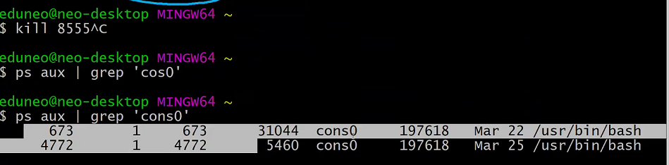

- jupyter 관련된 애들만 뽑아주는 것

  

- 프로젝트

, f9f7e8

252 251 242

---

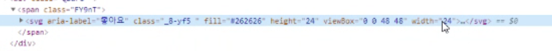

- git push origin master절대로 x

  master는 프로젝트 

- git push