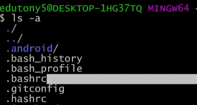
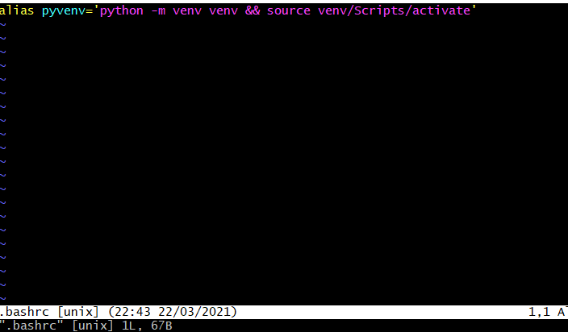
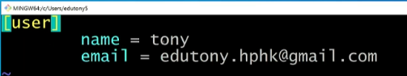
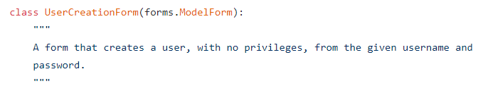
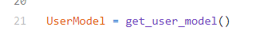
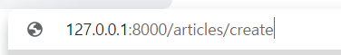
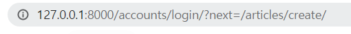

# Authentication

- bash

  

  ```bash
  $vim .bashrc
  ```

  

  원하는 작업을 한 후에 `:wq!`를 누르면 저장후 나가기

  ```bash
   $vim .gitconfig
  ```

  

  

  ```bash
  $git config --global user.name
  $git config --global user.email
  ```

  여기서 설정해준것이 gitconfig에 들어가 있다.

---

```bash
$python manage.py startapp accounts
```

내부적으로 django가 account라는 이름을 참고를 하기 때문에 accounts로 통일한다. 

settings.py에 출생신고 후 마스터앱에서 경로 지정


가장 처음 배운것은 login에 관한 것. 거꾸로 생각해보는 방식으로 배워봅시다.

서비스 구성을할 건데 회원을 관리하고 싶은 상황

1. 회원목록관리 DB에서 관리 => model 에서 관리를 했었습니다 => user의 경우에는 조금 특별했습니다. model을 따로 만드는 것이 아니라 django가 제공하는 model을 사용.

   DB => model => django가 제공

2. 페이지 - 회원가입, 로그인페이지가 필요한데 그 과정에서 사용자로부터 입력을 받아야해! => forms.py ModelForm => django가 제공하는 것을 쓰겠다.

## views.py

### login(GET)

```python
from django.shortcuts import render
from django.contrib.auth.forms import AuthenticationForm

def login(request):
    """
    POST : 실제 로그인을 진행
    GET : 로그인 페이지를 랜더
    """
    if request.method == 'POST':
        pass
    else:
        form = 
        context = {
            'form': form
        }
        return render(request, 'accounts/login.html', context)
```


authentication에 관련된 form들이 모여있는 공간

- **`UserCreationForm`**

  


django 내부의 User라는 Model이 존재하는데 우리는 이 User라는 모델을 그대로 가져오는 것이 아니라



`get_user_model()`을 사용해서 가져오게 될 것입니다.


**usercreation과정에서 save()를 사용할 것이고 return값(user)가 있다.**

- **`AuthenticationForm`**

  

  forms.Form을 받고있고, ModelForm이 아니기 때문에 class Meta부분(Model과의 연결부분)이 없다.

  

  authentication과정에서 get_user()를 사용할 것이고 return값이 있다.

  함수 내부적으로 사용하고 있는 user_cache라는 곳에 user내용이 담기게 되고 그 것을 return하게 된다.

- `Authentication` vs `Authorization`

  Authentication(**인증**) : 서버가 봤을 때 누군지 모르는 상태이기 때문에 너 누구야? 하는과정

  Authorization(권한) : 서버가 누구인지는 알지만 너가 권한있는지 체크해봐야해 하는 과정

- cratesuperuser를 하기전에  반드시 migrate가 필요하다

  django가 사용하고있는 user모델이 migration파일은 있으나 migrate에 되고있지 않아서, migrate해야 user모델이 DB에 저장이 되고 superuser생성이 가능하다

### login(POST)

```python
from django.shortcuts import render
from django.contrib.auth.forms import AuthenticationForm
from django.contrib.auth import login as auth_login

# DB에 유저 세션 생성(CREATE)
def login(request):
    if request.method == 'POST':
        # 첫번째는 무조건 request,  두번째는 담겨져있는 Data
        form = AuthenticationForm(request, request.POST)
        if form.is_valid():
            # 로그인
            auth_login(request, form.get_user())

```


### logout

```python
from django.contrib.auth import logout as auth_logout

def logout(request):
    auth_logout(request)
    return redirect('accounts:login')
```

### signup

```python
# DB 유저 정보 생성(CREATE)
def signup(request):
    if request.method == 'POST':
        form = UserCreationForm(request.POST)
        if form.is_valid():
            user = form.save()
            # 알잘딱깔센 => 로그인(받아온 유저로)
            auth_login(request, user)
            return redirect('articles:index')
    else:
        form = UserCreationForm()
    context = {
        'form': form
    }
    return render(request, 'accounts/signup.html',context)
```

### delete

회원탈퇴

```python
from django.views.decorators.http import require_POST
# DB 유저 정보 삭제
@require_POST
def delete(request):
    # 로그인 한 사람이면 삭제
    if request.user.is_authenticated:
        request.user.delete()
    return redirect('articles:index')
```

### update

```python
# DB 유저 정보 수정(UPDATE)
@login_required
def update(request):
    if request.method == 'POST':
        form = CustomUserChangeForm(request.POST, instance=request.user)
        if form.is_valid():
            form.save()
            return redirect('articles:index')
    else:
        # 유저 정보수정이기 때문에 이전 내용이 필요
        form = CustomUserChangeForm(instance=request.user)
    context = {
        'form': form,
    }
    return render(request, 'accounts/update.html', context)
```

update.html

```html


<form>
  {{ form }}
  <button>정보</button>
</form>

```

너무 많은 정보가 나와버리게 된다.


UserChangeForm을 그대로 쓰니 너무 많은 정보가 한번에 나오게 된다. 따라서 

### accounts/forms.py

```python
from django.contrib.auth.forms import UserChangeForm
from django.contrib.auth import get_user_model

class CustomUserChangeForm(UserChangeForm):
    class Meta:
        model = get_user_model()
        fields = ('email', 'first_name', 'last_name')
```

fields = '__ all __'하게되면 많은 정보가 나온것 그대로 나오게 되므로 원하는 정보만 작성한다.

## accounts/login.html

```html


<form>
  {{ form }}
  <button>로그인</button>
</form>

```

action이 생략되는이유 : 동작은 잘 되지만, action의 url로 바로 이동하기 때문에 login require했을 때, 자동으로 생성되는 **name parameter를 사용할 수가 없다.**

## articles/index.html

```html



{{ request.user }}
{{ articles }}

```

{{ request.user }}의 경우 많이 참조되기 때문에 django가 그냥 user로 사용하게 해놓음 따라서

{{ user }}로 사용이 가능

## base.html

로그아웃 된 상태여도 user는 anonymoususer로 존재한다. 따라서 로그인한상태일 때의 조건을 걸어주기 위해서는 ``를 써준다 is_authenticated는 불리언값.

인증받은사람만 새글쓰기를 하겠다. 인증받지 못하면 로그인 창으로 유도

```html

    <li class="nav-item">
        <a class="nav-link" href="">새 글 쓰기</a>
    </li>
    <li class="nav-item">
        <a class="nav-link" href="">로그아웃</a>
    </li>

    <li class="nav-item">
        <a class="nav-link" href="">회원가입</a>
    </li>
    <li class="nav-item">
        <a class="nav-link" href="">로그인</a>
    </li>

```

## articles/views.py

### create

우리의 회원들만 작성 => 인증

```python
from django.contrib.auth.decorators import login_required

# ~/accounts/login/?next=/articles/create/
# => login_required가 만들어준 url
# 우리의 회원들만 작성 => 인증
@login_required
def create(request):
```

URL에 



다음과 같이 url이 변하게 된다



이 url을 만들어주면서 어디로 이동을 했느냐?? login페이지로 이동한 상태.

따라서 next parameter를 사용하기 위해서는 action을 생략해야함. 생략하지 않을경우 action이 자동적으로 지정된 url로 동작하고, next가 동작하지 않는다. 

### login

```python
def login(request):
    """
    POST : 실제 로그인을 진행
    GET : 로그인 페이지를 랜더
    """
    if request.method == 'POST':
        form = AuthenticationForm(request, request.POST)
        if form.is_valid():
            auth_login(request, form.get_user())

            # next 파라미터를 여기서 활용!
            # A or B
            # A : request.GET.get('next')가 존재한다면 B를 확인하지 않고 A를 사용
            # A가 존재하지 않는다면 B를 사용
            return redirect(request.GET.get('next') or 'articles:index')
```

