# 210323_django_auth_실습

- 들어가기에 앞서서 전체로그아웃 하는 코드

  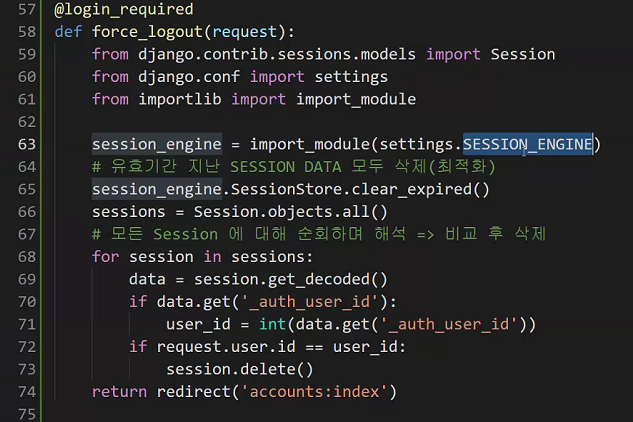

- shell_plus에서

  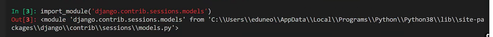

  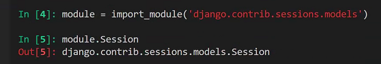

- 수명이 끝난 애들은 DB에서 자동적으로 사라지지 않습니다. 신기하죠?

  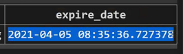

  이 수명이 끝나도 남아있습니다. 다만 효용이 없을뿐. 에버렌드 이용권이 만료되었다고해서 불타 없어지지 않는 것처럼 DB에는 남아 있습니다.

- `python manage.py clearsessions`를 하게되면 한 번 쫙~ 순회하면서 필요없는 DB가 날라가게 됩니다.

- Session이 객체화가되었을때

  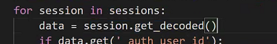

  get_decoded()라는 메서드를 통해서

  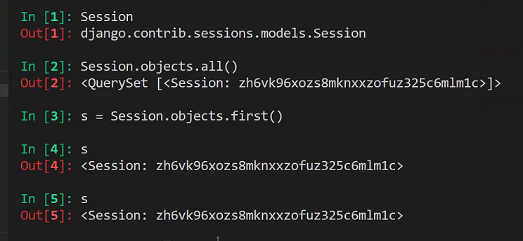

  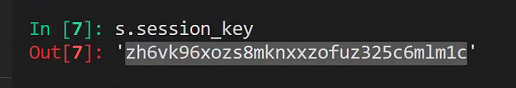

  이게 팔찌에 써져있는 말

  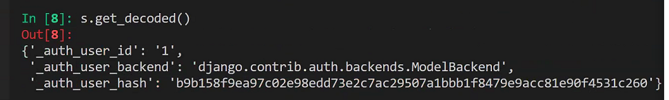

  '_auth_user_id' :이 세션을 가져온 사용자는 1이라는 것

- 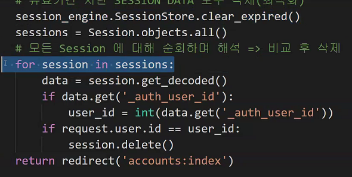

  만료된 애들은 지우고

  전체를 순회하면서 모든 브라우저 로그아웃

- 그림으로 정리해보자면

  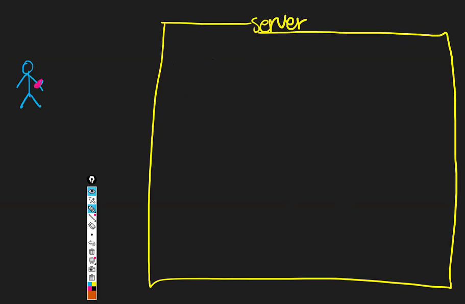

  팔찌를 한 애가 서버를 돌아다닐껀데

  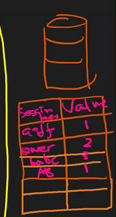

  DB에 정보가 저장이 되어있다. asdf라는 애는 1번이야(왼쪽이 session key, 오른쪽이 value)

  

  팔찌를 두르고 있는 본인은 사실 asdf인지 모르고 있고, DB에서만 asdf를 저장해둔 상태라서 3자가 나타나서 adsf를 사용해버린다면 

  

  이때도 마찬가지로 서버에 접근할 수 있다는 문제점이 생김.

  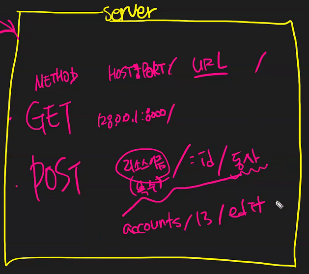

  메서드가 있었고, PORT/URL/ 방식들을 배웠습니다.

  예를들어 articles/2/delete는 articles의 2번 게시물을 POST방식으로 삭제요청을 보낸다라는 말이 된다.

  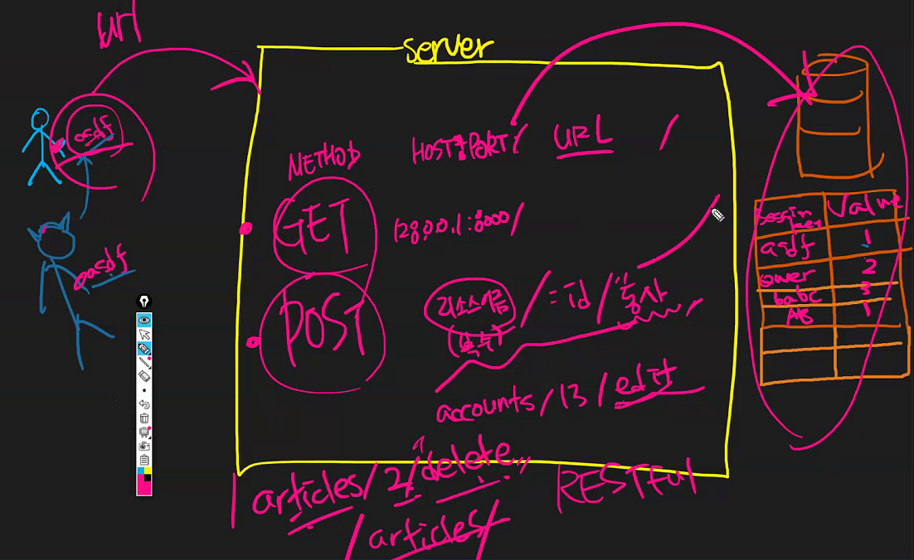

  결국 사용자의 저 ''팔찌''와 DB의 정보로서 서버에 접근해서 노는 것.

- 정리하자면 asdf라는 팔찌를 찬 사용자가 URL을 보내는데

  form에 넣어서 보내는 것을 body데이터라고하는데 이것과 별개로 cookie는 돈다.

- 어쨌든 이 asdf가 서버에 도착을 하게 되면은

  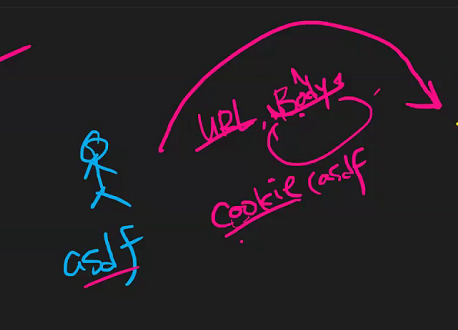

  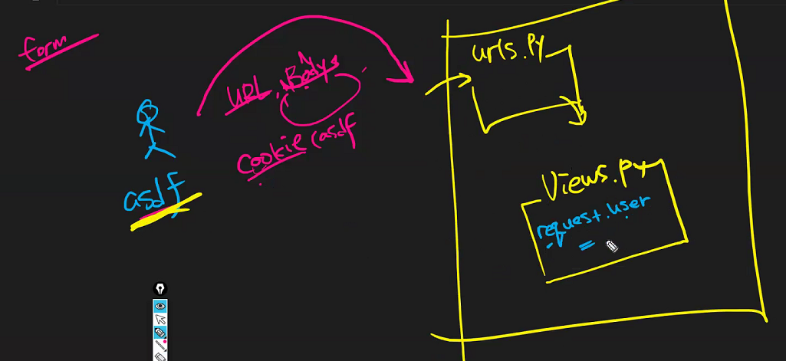

  어느 시점에 asdf decode가 완성 되었는가??? 

  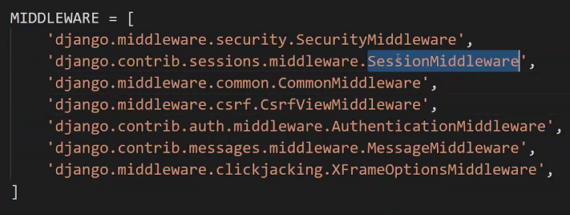

  서버에 도착하기전에 이미 미들웨어에 도착해서 디코드가 되어 서버에 접글 할수 있게 되는 것.	

  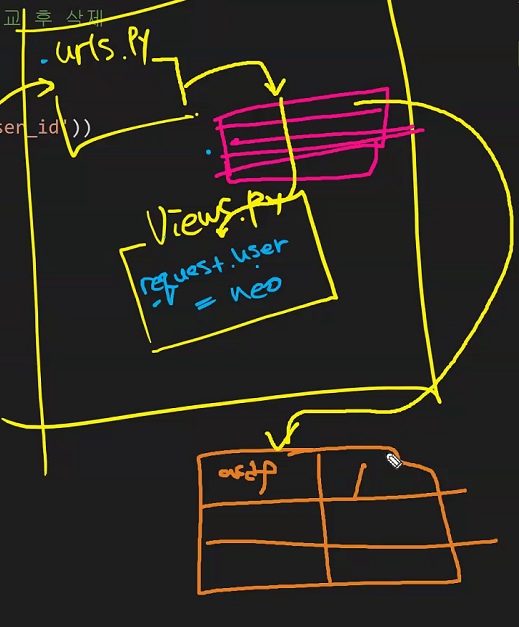

  urls.py -> views.py로 가는 와중에 미들웨어를 거치게되고, 미들웨어 부분에서 DB에서 정보를 확인하는 과정을 지나게 됩니다. 

---

- 회원이 어떻게 동작하는지 코드 옮겨보는 것을 할건데
- 지금 먼저 할려고하는 것은 Practice
- 오늘은 빡세게 bootstrap적용해서 해봅시다! 그럴싸하게 만들어보는 것을 목표로!

- bootstrap docs들어가서 nav 찾아봅시다

- 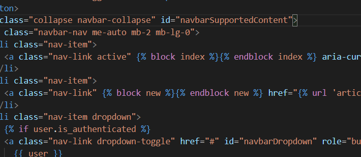

  이거는 base.html에 직접 때려박아야만 적용가능

  부품에서 사용하려면 인자를 사용해야하는데 좀 복잡함.

- 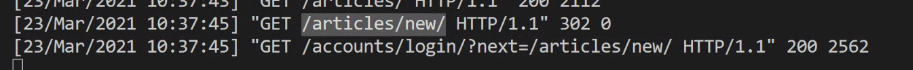

  login_required라는 애가 login을 하고나서 어디로 보내줄지 next를 만들어서 보내준다.

  이거 어디서 해주는거임??? login

  왜? **들어온 url이 login이 메인이기 때문**

- articles/new/라는 string을 받아오기 위해서는 auth_login이 끝나고나서
- 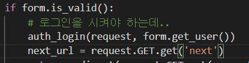

- 근데 이게 말이됨? 일단 request의 method는 POST임. ok이건 맞고.

- 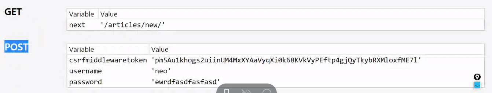

이제는 말할 수 있다.

이것이 중요한 실제 요청인거고 그 이외의method는 공개해놓은 데이터인 것. POST는 여기서 밀봉을 해놓은 데이터이고.

그래서

이런 정보들을 Payload 혹은 request바디라고 부른다.

결국 둘다 key, value로 이루어진 data set이고

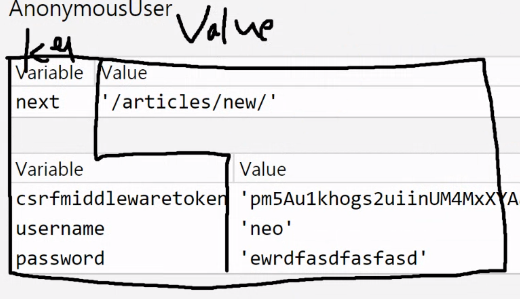

request는 GET아님 POST인데 공개된 데이터는 꺼낼때 

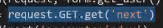

이렇게 꺼내는 거고 밀봉된 데이터는

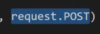

여기서 꺼내는 것

- 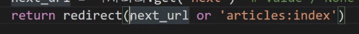

단축평가를 이용하여 next_url이 True라면 next_url로 보내고, 아니라면 항상 True인 articles:index로 이동

- 

  이렇기 때문에 not login_in 경우에, 무조건 /accounts/login으로 redirect한다.

- 11시10분에 프로필페이지 만드는것
- 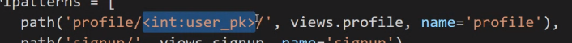

url 뚫어주려고하는데 < int:user_pk >가 필요한 경우는?? 다른 사람이 내꺼를 좋아요를 누르거나 뭔가의 행동을 한다고 할 때, 근데 이것이 좋은 방법은 아닌것 같다. pk가 백만 천만이 된다면 힘들어진다. 따라서 username으로 받는 것이 어떨까라는 접근

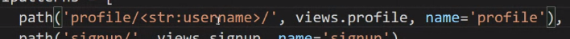

지금까지 pk를 사용했던 이유는 겹치지 않았기 때문인데 username도 마찬가지인 것

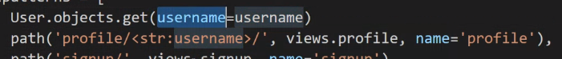

---

## 오후

- 요즘 개발 트렌드

우리가 아래처럼 실제로 html한장짜리 문서를 짠적은 없다.

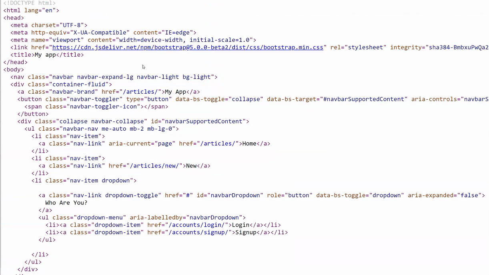

include하고 DTL을 사용했더니 문서가 만들어진 것.

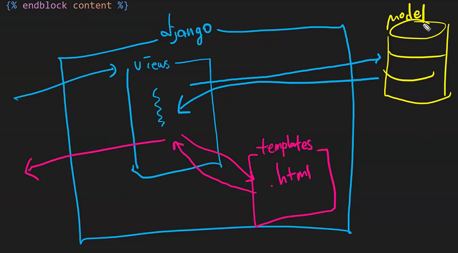

우리가 지금 배운 전체적인 과정이 위와 같은데, 이렇게한다면 .html문서만 응답으로보낸다(즉, 브라우저에서 요청을 보내야만 응답을 받을 수 있다. 브라우저가 필수적이라는 의미)

- 빨간 부분을 잠깐 제끼고 생각해본다고 생각한다면 html을 주고받는 과정없이 DB에서 거의 날 것 그대로 바로 보내는 것은 어떨까하는 접근은 어떨까 그렇다면 이런 느낌이지 않을까 싶다

  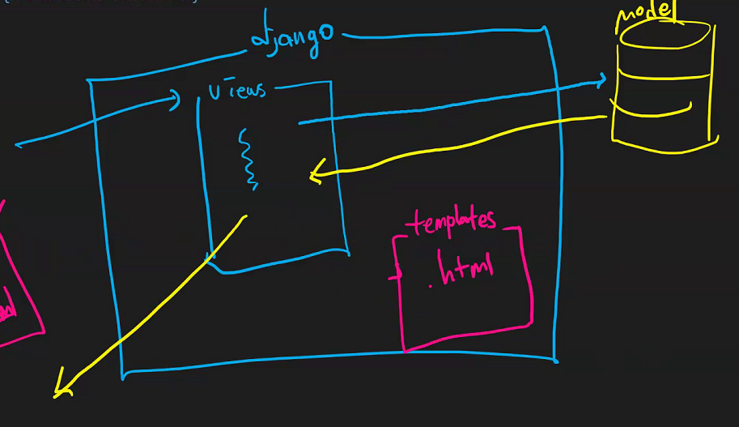

  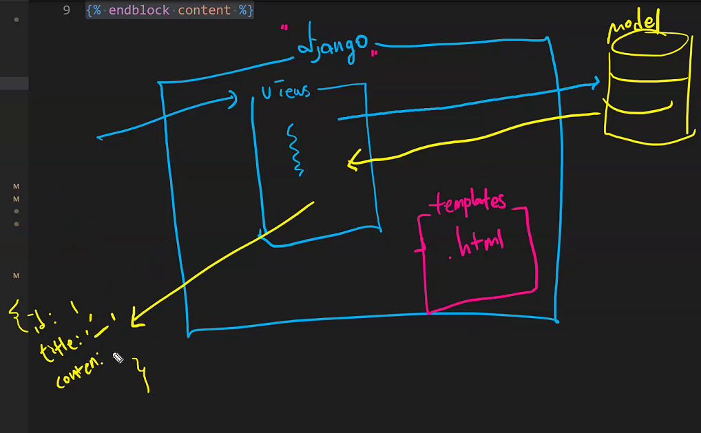

  이렇게 딕셔너리 형태로 보내는 것은 **JSON**이라고 한다.

- 이것은 기존의 .html과는 엄청난 차이가 있음
- 사용자가 보게되는 최종적인 화면의 완성을 서버가하는 것이 아니라 사용자가 하게 되는 것.

조립을 해서 html을 보내는 render함수. 근데 html보내는게 끝이아니라 html을 완성시키고, 서버에서 html을 만지는 부분

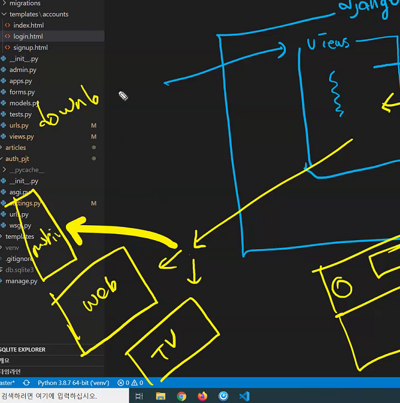

mobile, web, tv 이렇게 배포를 하는데 이 안의 실제내용(코드)는 무엇이 들어있을까 => 

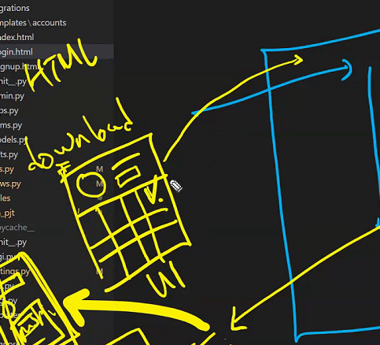

이코드 UI요소가 다운받는 내용의 핵심일 것이고 => 누르게 되면 사진데이터에 요청

리스트 안에 딕셔너리가 들어있는 이러한 자료를 클라프로그램이 해석을 해서 풀어주는 것.

- Meal Kit느낌으로 재료는 다 준비해서 보낼테니 요리는 너네가해!라는 느낌 => 서버의 부하가 낮아짐

  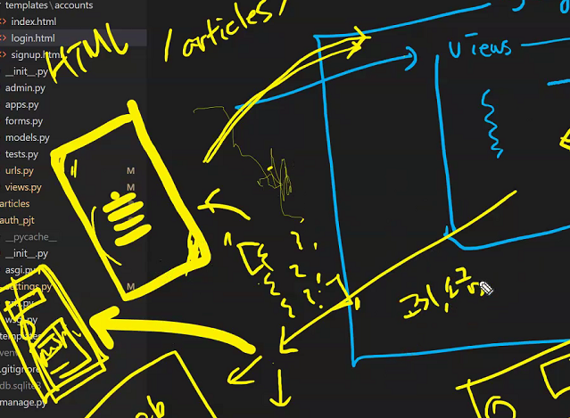

- 이게 요즘 추세. Why?? HTML(클라이언트 컴퓨터)이 너무 좋아짐.

- 100, 1000, 10000명이 요청을 보낸다면? 엄청난 효과적인 차이를 볼 수 있을 것

- 그럼 views도 사실상 model에 요청을 보내는 역할이 되고(중개자역할), 진짜 중요한 것은 Model의 data가 된다. 이렇게 되면 내가 만든 서버의 역할이 너무 줄어들었다. MVC중에 V가 사라지니 MC만 남게되었다.  그러다보니 상대적으로 뭔가 MC는 하는일이 없어보인다.

- 여기서 '서버리스'라는 말이 나오게된다. 서버가 필요없는거 아니냐??? 라는 얘기.

- DB는 대체가 어려웠지만 Blockchain이 나오면서 대체가 가능해지긴 했다. 원래 DB를 들고있는 사람이 table을 가지고 있었다면 block chain은 다같이 소유하고 있는 것.(소유에 대한 보상이 바로 코인) => 전원 수정이 불가능해진다.

  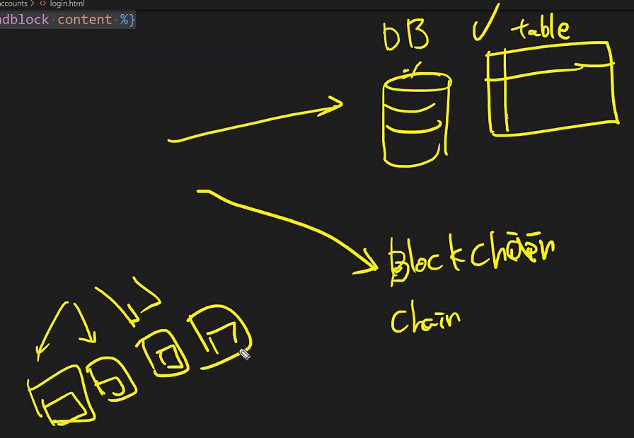

  결국 Blockchain은 DB 대체용. 거래장부를 한명이 독점하지 못하게 하자.

- firebase

- DB는 SQL만 받을 수 있는데 아 잠시 , DB에 두종류 있다고했는데 RDBMS는 SQL만 받을 수있다. 또 하나는 NoSQL가 있다. 일단은 둘다 중앙집권화 되어있는 DB로 알고있자.

- 다시 firebase로 돌아와서 firebase 지들이 다 운영하겠다고한 것

  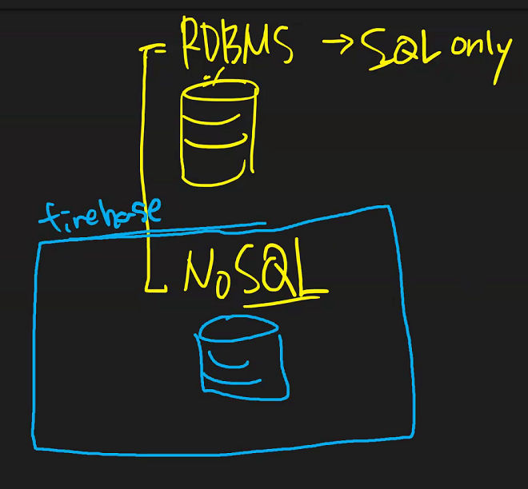

  URL로 요청을 보내면 DB가 긁어서 적절하게 보내주는 것

  

  

  결국 이부분은 알아서 해줄거니까 우리가 해주는 것은 모바일APP, 모바일(개발)개발능력 + 돈(신용카드)만 있으면 되는 것이다.

  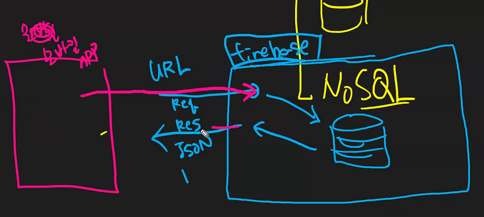

  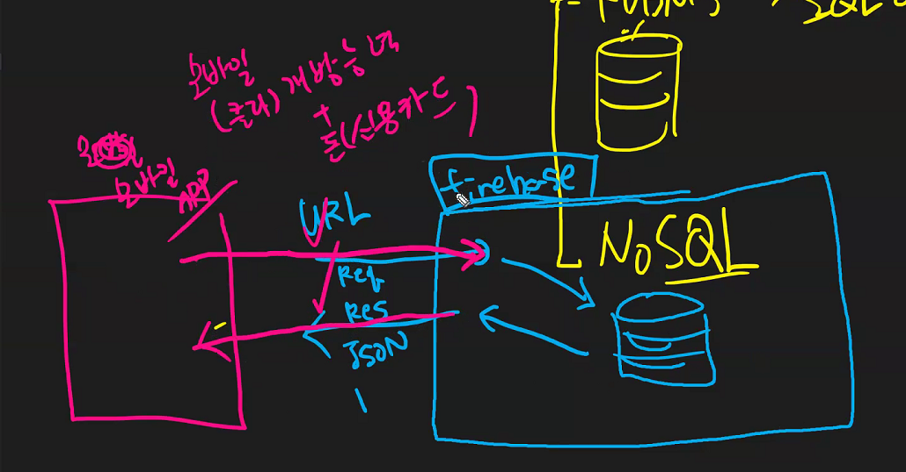

  이것의 단점 : 자유도는 낮다. 다만 지금처럼 규모가 작을경우에는 오히려 자유도가 높을 수 있다.

- 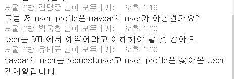

- 앞으로 User는 화면을 보고있는 User를 뜻함

  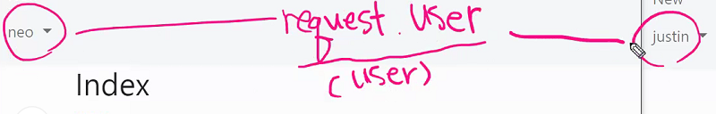

  세션 key값을 읽어서 주는 것이 지금 위의 사진

- 

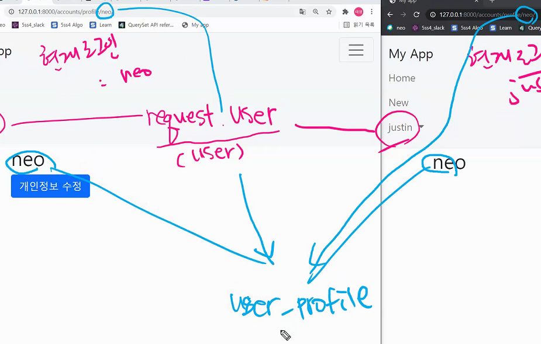

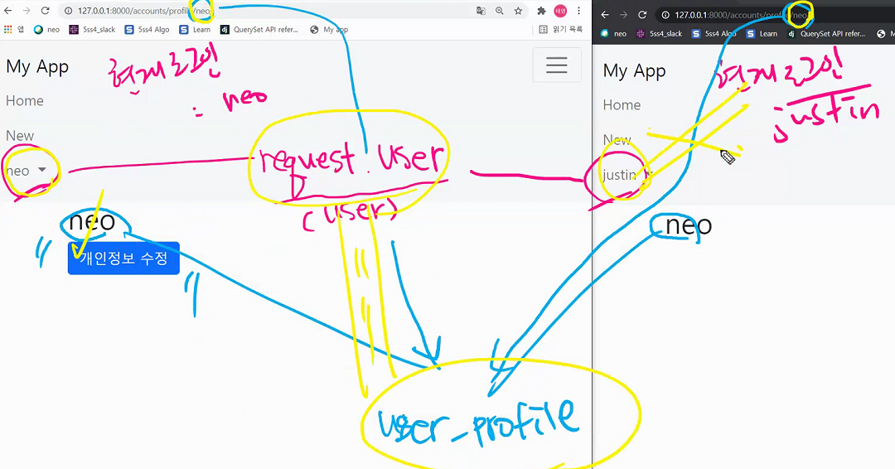

- 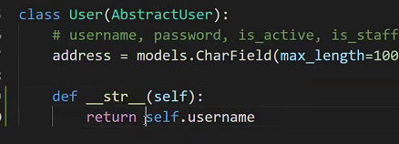

- 질문취합

  

  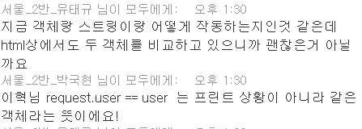

- 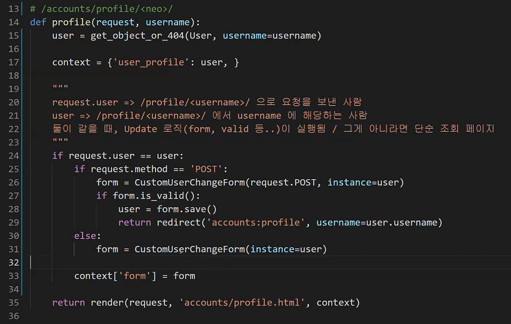

- 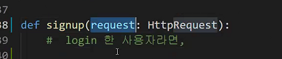

signup이라는 함수는 request라는 인자를 받는데 이 인자의 타입이 HttpRequest. 이 함수는 return값이 HttpResponse.

- 오늘 알아야할꺼
- request 요청보내는 user와 찾아온 user의 구분
- user.email ...
- forms.py에서 쓴것들이 무엇을 의미하는지
- 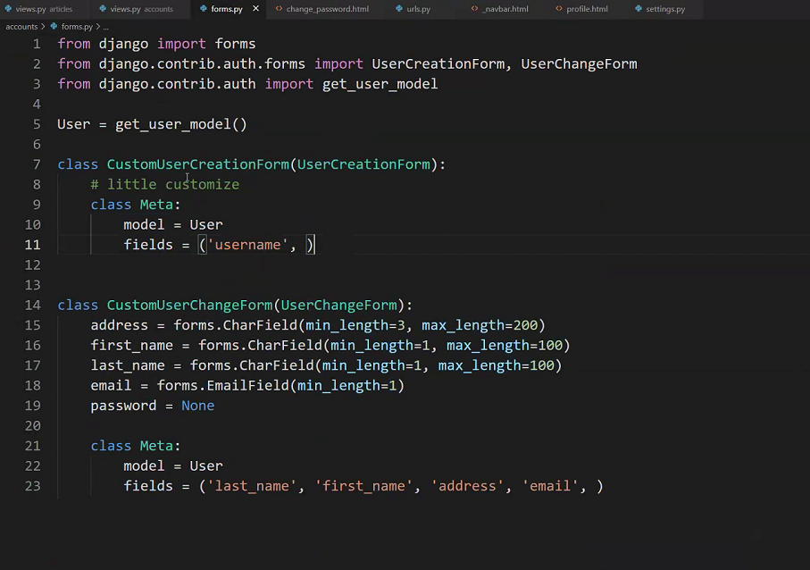

- 세션, 쿠키의 개념

---

## 실습시간

settings 젤 밑에다가 써주는 행위

---

- 