# django

## 프로젝트 만드는 순서

1. 프로젝
2. 빈폴더(프로젝트 Root)를 만든다.
   1. `.gitignore` 생성
   2. `$ git init` 으로 REPO 초기화
   3. `README.md` 생성
   4. 원격 저장소 생성 후 연결
   5. `add` => `commit` => `push` 
3. 해당 폴더로 이동해서 `$ python -m venv venv` 명령어를 통해 가상독립환경 폴더를 만든다.
4. 가상독립환경을 활성화(`activate`)한다. (or vscode로 열기)
5. `$ pip install django (+ a)` 를 통해 필요한 패키지들을 설치 한다.
6. `$ django admin startproject <PROJECT NAME> .` 명령어를 통해 프로젝트 초기화
7. 프로젝트 진행

## Rule

1. 프로젝트 이름은 헷갈리지 않도록 앞으로 capital로 바꿀것

   

2. 반드시 프로젝트 Root폴더 => 우클릭 => code로 열기

## 프로젝트 독립환경 설정

1. `ctrl` + `shift` +`p`
2. `>python: Select Interpreter`입력
3. 자동으로 가상환경 폴더(`venv/`)안의 python을 잡지 못한다면
4. `Enter

view함수 http리턴

- url(uniformed resource locator) 는 기본적으로 의미가 있어야함

---

- 흐름 : urls.py => views.py


- 모든 로직은 views.py에서 표현은 template에서

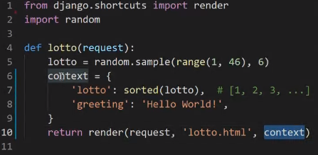


- `{{ }}`는 html의 print와 같다고 보자!

---

django는 html을 찾을때 templates를 찾는다.

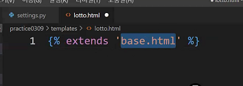

조건이 있는데 특정 앱의 안에있는 특정한 templates 즉, INSTALLED_APPS 내에 써져있는 앱을 기준으로 찾는다. 

---


각 앱의 안에 모든 templates를 복붙할건데 


이렇게 하면 겹칠일이 없을 것.

이것이 templates namespacing입니다.

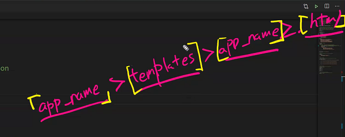

이것이 정식적인 구분방법

---

## practice0309

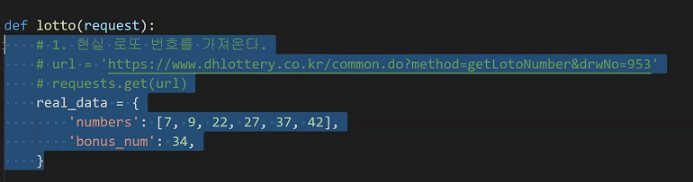

로또

1등 : 내번호 == 당첨번호

2등 :  내번호랑 5개가 같은거 + 내번호에서 나머지가 보너스

3등 : 내번호 == 당첨번호 5개

4등 : 내번호 == 당첨번호 4개

5등 : 내번호 == 당첨번호 3개

```python
from django.shortcuts import render
import requests

# Create your views here.
def lotto(request):
    # 1. 현실 로또 번호를 가져온다.
    
    res = requests.get(url)
    my_num = [1,2,13,32,26,29]
    # 2. 1000번
    for i in range(1, 953):
        url = f'https://www.dhlottery.co.kr/common.do?method=getLottoNumber&drwNo={i}'
        res = requests.get(url)
        # 3. 현실 번호와 내가 추첨한 번호를 비교한다
        drw_no = []
        
        for i in range(1,7):
            drw_no.append(res[f'drwtno{i}'])
        bnus_no = res['bnusNo']
        # 4. 등수 결과를 어딘가에 저장한다

        cnt = 0
        for num in my_num:
            if num in drw_no:
                cnt += 1
                
        context = {
            '1등': 0
            '2등': 0
            '3등': 0
            '4등': 0
            '5등': 0
            '꽝':0
        }

        if cnt == 6:
            context['1등'] += 1
        elif cnt == 5 and (bnus_no in drw_no):
            context['2등'] += 1
        elif cnt == 5:
            context['3등'] += 1
        elif cnt == 5:
            context['4등'] += 1
        elif cnt == 5:
            context['5등'] += 1
        else:
            context['꽝'] += 1
    # 5. context에 잘 비벼서 내보낸다
        
    
    return render(request, 'practice0309/lotto.html', context)

    # {
    #     "drwtNo1":7
    #     "drwtNo2":9,
    #     "drwtNo3":22,
    #     "drwtNo4":27,
    #     "drwtNo5":37,
    #     "drwtNo6":42,
    #     "bnusNo":34,

    #     "drwNo":953,
    # }
```

---

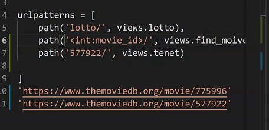

일일히 나누어 작성한 것이 아니라 사용자가 뭔가를 쓰면 그것에 맞추어서(변수로 지정) 그것에 맞는 view함수를 실행하는 것. 이것을 **variable routing**이라고 한다.


---

workshop 0309는 오늘 해보기


dinner.html 우리가 만들어야하고

---

practice0309

입력페이지(html)와 결과페이지(html)


intro unrl.py

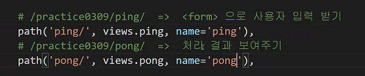

url에 별명을 지어 줬음

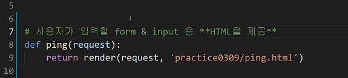

ping의 의무

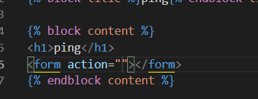

form을 이야기 해보자면 이런느낌입니다. form은 양식(수신인, 공개/비공개) 이것에 해당하는 것이 action과 method

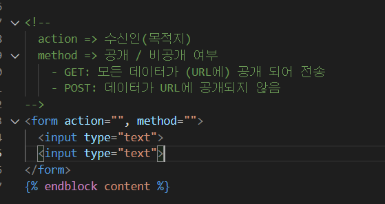

input은 form태그 안에 있어야만 의미가 있어진다.

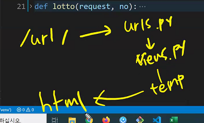

지금까지 배워온 요청방식은 이랬었지만 이제는 url에 추가적으로 data를 묶어서 보낸다

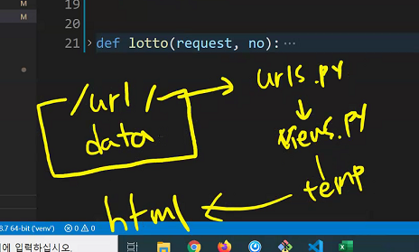

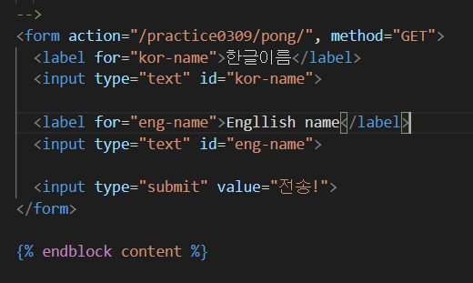

과정


달라진거는 ? 뿐인데 왜그럴까? 정보가 사용되지않은게 아니라 아예 정보가 넘어오질 않은 것


세상은 키밸류로 이루어져있지만 지금은 밸류만 넘어와서 ?? 상황이 일어난 것 따라서 key에 대ㅐ한 내용이 들어가야함


1단계 주소가 바뀌고


2단계 pong을 찾고

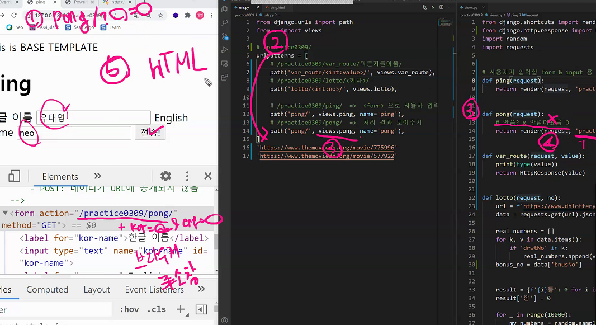

GET : 사용자가 데이터를 넘길때 ping.html이 GET 방식으로 바꾸는 것  GET요청으로 들어온것에 

별명지어놨다 왜 별명 지었느냐? 


액션 부분에 하드 타이핑 하는것을 하지 않으려고


******************시험에서는 django extension 못쓴다 ***************

---

html 포탈만들어지는 부분


## 정리

- url 받는다 

- html
  - extends base.html
  - block
  - {{}}

- views

  - variable routing : 어느부분 구멍뚫어주기 => <>꺾쇠로 표현

- 사용자로부터 입력받는 2가지방법

  - variable routing

  - ping, pong

    - 사용자 입력 데이터를 받아오는 ping

      - 이 주는 html내용물을 구성하는 것이 중요

      - 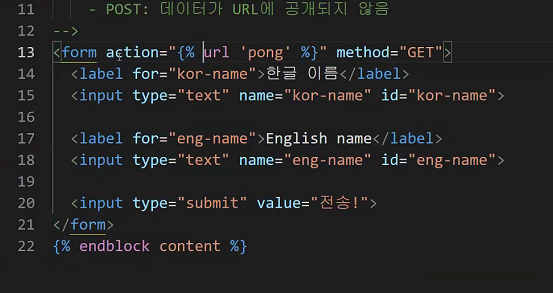

      - action 수신인 method 공개/비공개

      - label tag를 좀 더 의미있게 하기 위한 방법

      - input 태그에 반드시 name이 표시가 되어야만 한다. name이 없다면 서버에 데이터를 넘겨줄 수 가없기때문에 반드시 필요한 attribute라고 볼 수 있다.

        모든 input태그는 제출용을 제외하면 모두 name이 있어야만 한다.

    - 사용자 입력 데이터를 활용하는 pong함수

- action 유지보수관점에서 좀 더 편리할 방법

---

## 왜 web을 쓰는가

우선 편리하다. 많은 사람들이 접근하기가 용이하다.

127.0.0.1:8000 은 모든 사람들이 접근이 가능한가?? 아니다. '127.0.0.1'은 IP를 의미한다. 모든 컴퓨터는 이러한 주소값을 가진다.

컴퓨터에서 컴퓨터에서 요청을 보내게 된다. `URL 주소:port /path`방식으로 다른 컴퓨터에게 요청을하게된다.

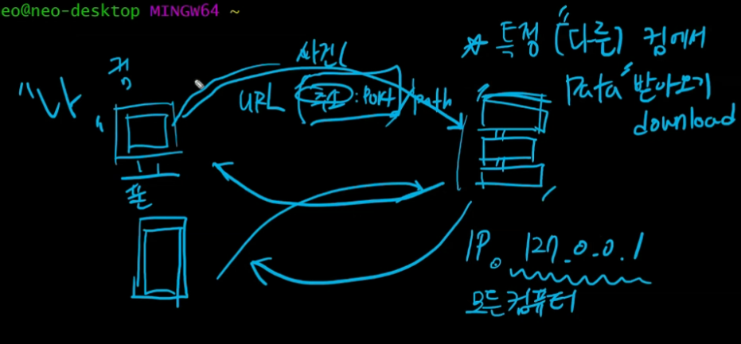

127.0.0.1은 '나'를 의미하고 나의 주소를 말한다. 그렇다면 127.0.0.1:8000은 자문자답과 같은 느낌인거임. IP주소는 자연스럽게 노출이 된다. 문제는 현관문이 열리면 안되는 것(다른사람의 요청을 컷해야 한다는 것)


다시 돌아와서 다른 서버에서 정보를 가지고 오려면 생각해보다 해야할 일이 많다. 그래서 내 컴퓨터가 서버의 역할을 할 수있는지 확인을 하기 위해서 로켓홈페이지처럼 확인을 해본 거임. 즉, 같은 컴퓨터 안에서 내가 클라이언트면서 내가 서버인 상황으로 확인을 해보는 것임.


응? 그러면 google.com은 IP가 아닌데 뭐지? 이것은 '도메인'이라고 하는데 IP는 필요하나 사용하기 너무 까다롭다. 따라서 사람들의 사용성에 따라서 만들어진 것이 도메인. 하지만 필수적인 요소는 IP인거지 도메인은 IP에대한 접근성을 높여준 방식이라고 생각하면 됨. bash에서 확인해보면 google.com 도메인은 결국 216.58.197.14:443과 같은 것이다.


**모든 것은 서버에 접근하기위해서는 `IP:port`형식으로 접근을 해야한다.** IP, port 두가지가 있어야만 요청이 가능하다. port는 기본적으로 기본값이 적용되어있다.(https는 443, http는 80)

port는 무엇인가. 사용자가 접근하는 여러가지 항구(기능에 따라 나뉘어져있는 접근점).


127.0.0.1은 IP 8000은 port(항구)를 의미한다. 여기서 8000 django 서버프로그램이 기본적으로 8000으로 접근하도록 설계가 되어있는 것(수정이 가능) 

