# django

## 지난시간

- url에서의 이름공간은 app name을 줘서 url이름이 겹치더라도 올바르게 작동할 수 있도록

## django Model

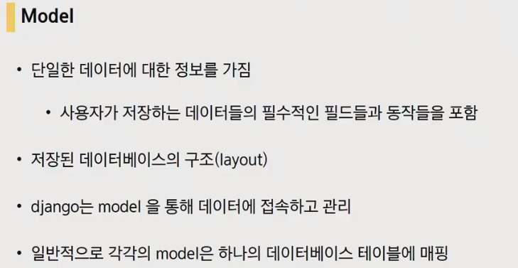

모델은 저장된 데이터베이스의 구조를 뜻한다. 모델은 하나의 도구로 사용된다.

model != DB

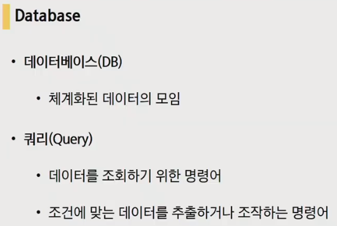

쿼리 : 데이터를 조작하는 명령어를 날린다

DB에서 행과열은 조금 다른 용어를 사용.  필드(열), 레코드(행)

스키마 : 각 column이 어떠한 정보를 가지고있는지 확인이 가능

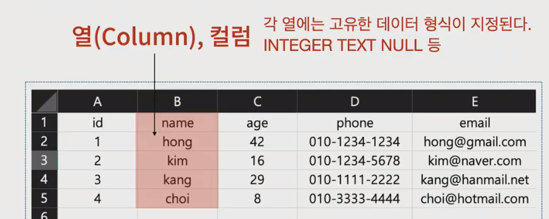

여기서 행은 4개

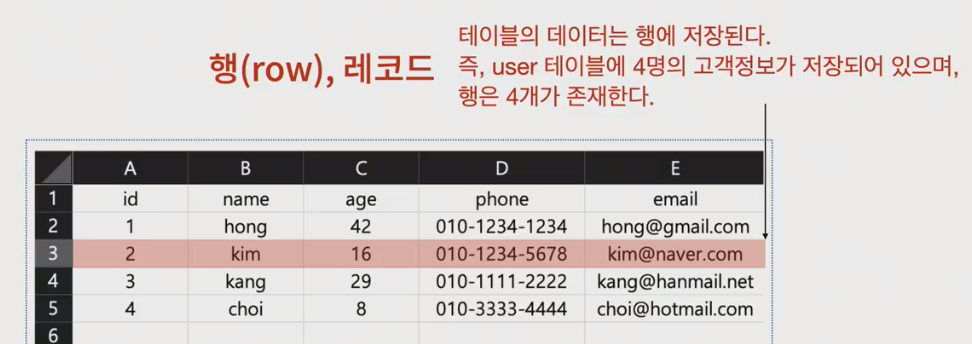

PK(Primary Key) : 레코드의 고유값, DB관리나 관계 설정시 활용

### Model이란..

데이터조작을 할건데 어떤 방식으로 조작을 할 것이냐를 배워보자

- ORM

  

  호환되지 않은 유형의 시스템간에 데이터를 변환하는 프로그래밍 기술. 객체(django) - 관계(DB) - 매핑

  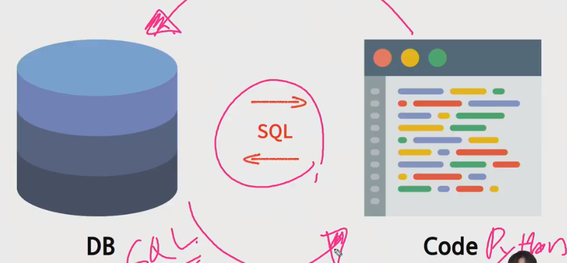

  서로 호환이 안되는 언어를 사용하기 때문에 중간다리 역할로 ORM을 사용해서 다른 시스템을 가진 DB를 관리한다.

  

  - 장, 단점

  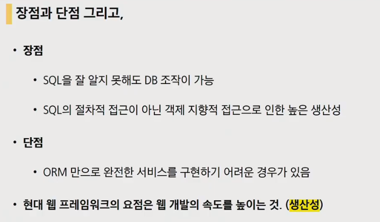

  ORM만으로 완전한 서비스 구현 어려운 경우가 있음(이럴때는 SQL로 직접 구현해야 하기도 하다)

  하지만 무엇보다도 사용되는 이유는 바로 단점을 아우르는 **생산성**

서로다른 시스템간의 호환성을 위해서 ORM을 사용한다. 즉, 우리는 계속 파이썬을 사용하면서 객체를 조작할 겁니다. 

---

## 실습

> 실습 진행하면서 중간중간 ppt개념 내용들이 들어가면서 수업이 진행

프로젝트를 만들고 먼저 확인해야 할 것은 로켓확인(`python manage.py runserver`) 후 앱생성

앱생성 후에는 앱 출생신고!(master app의 settings.py의 INSTALLED_APPS에서 출생신고)

모델을 작성해볼건데 모델은 app폴더 안에 있습니다. `models.py`입니다. 

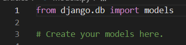

뭔진 모르겠지만 무엇인가 import가 되어있는상태. 우리는 model을 객체를 사용합니다.(OOP개념 필요). 일단 클래스를 하나 만들어 볼겁니다. 테이블은 하나하나의 데이터를 담는 그릇이 될 것

파이썬에서 클래스 이름은 대문자로 시작. DB에 관여하는 모델을 만들기에 너무 많은 코드가 필요하다. 하지만 framework는 이부분을 서포팅해준다. 우리가 코드 완벽히 구현하기 어려우니 framework을 무언가로부터 상속을 받을거임. 그게 위에있는 models 모듈이 가지고있는 class를 **상속**을 받아오는 것 상속받아오면 subclass입장에서는 상위 class의 기능들을 모두 사용할 수 있습니다. 따라서 우리는 지금부터 column을 만드는데 집중을 하면 됩니다.

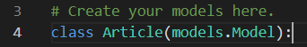

 앞으로 어떤 클래스를 사용하던 Model이 상속받은 상태에서 시작할 것입니다. 지금부터 3개의 정보를 가진 table을 작성해 볼 것입니다.

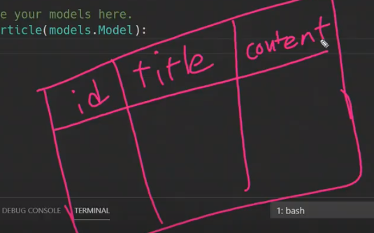

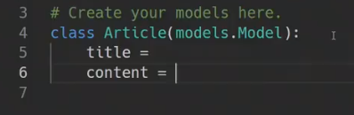

?? 왜 id는 안만드나?? 장고는 id는 미리 만들어 줍니다. title, content는 모델필드(컬럼)

각각의 필드는 각각의 형식을 가지고있기때문에 이것을 미리 지정을 해주어야 합니다. 이것을 '모델필드'라고 합니다. 이것은 models 모듈안에 저장이 되어있습니다.

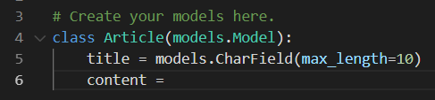

지금은 설계도를 작성하는 느낌이라고 생각하고 접근해보자. 게시글의 제목과 내용을 받는 설계를 한것

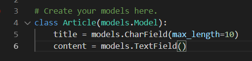

Model은 models모듈의 하위 클래스. 

왜 필드 이름이 다른가(CharField, TextField). `CharField`는 길이에 제한이 있는 필드(따라서 제한을 걸어주는 필수 인자를 받는다. 이 경우 제한 글자를 10자 까지로 제한해주는 것(10글자보다 크면 에러메세지가 나옴), 게시판의 제목) `TextField`는 글자수, 길이에 제한이 없을 때 사용을 하게 됩니다.(게시판의 내용)

자, 이제 모델 작성을 했다

## * Migrations *

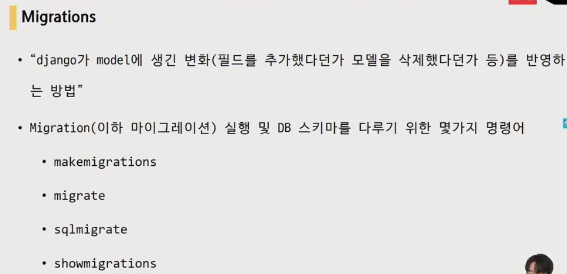

django가 모델에서 생긴 변화를 DB에 전달해주는 명령어(오늘의 핵심)

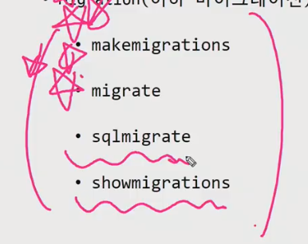

- `makemigrations`

  

  우리는 지금 설계도를 작성했지만 DB입장에서는 알아 볼 수가 없다. 따라서 이것을 ORM이 해석할 수 있도록 만들어주는 과정을 거쳐야한다.

  변경사항을 저장해주는 마이그레이션을 만들 때 사용한다

- `migrate`

  

  위에서 만들어진 것(migration, 설계도)을 DB에 전달해 주는 명령어

  migrate를 한 이후에 모델에서의 변경 사항들과 DB의 스키마가 동기화를 이룬다. 그 이전에 DB는 비워져있습니다.

  

  

- `sqlmigrate`

  

---

## 다시 실습

우리는 모델을 만들었다. 이제 migration파일을 만들어 줘야한다. `python manage.py makemigrations`

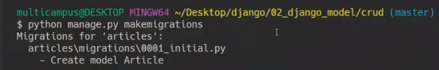

articles의 migrations 폴더에 0001_initial이라는 파일이 생겨났다. **이것이 바로 ORM이 실제로 사용하는 파이썬 파일**

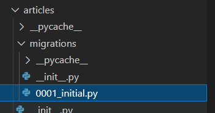

id는 자동적으로 만들어 졌고, title과 content는 우리가 작성한대로 만들어져 있다.

그럼이제 table이 만들어졌나? ㄴㄴ 아직 table은 만들어 지지 않았기 때문에 두번째 과정인 `migrate`를 해주어야한다. `python manage.py migrate`

아 근데 table만들어졌는지 모르겠다 . 파이썬 확장프로그램 하나 받아보자 sqlite를 받아봅시다.

옆을보면 사실 확장자 명이 sqllite3이고 이름이 db인 파일이 존재했었다. 다운받기 전에는 칙칙한 색이었는데 이제 색이 들어왔음. 우클릭 Open Database를 누르면 하단에 `SQLITE EXPLORER`라는 것이 생기고 그 것을 클릭해보면 table이 만들어 진것을 확인할 수가 있다.

이처럼 테이블이 만들어진 상태가 됩니다.

## 잠시 복습

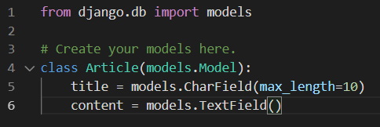

이렇게 모델을 만들었는데 다시 설명해 보자면

django github 구글링해서 확인해보면django.db -> models -> Model을 확인해보면..

정말 엄청 긴 코드들이 미리 만들어져 있다. 이러한 클래스를 상속받아 오는 것이고, 우리는 이제 column만 만들어 줄 것.

title과 content

자 이제 파이썬 파일을 DB에 동기화 시켜주는 과정이 필요

1. 설계도를 만드는 과정(migrations) : 0001_intial.py(마이그레이션 파일)가 만들어짐

   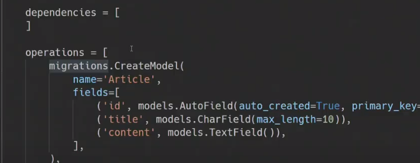

2. 설계도를 DB로 넘기는 과정(migrate) : `python manage.py migrate`

   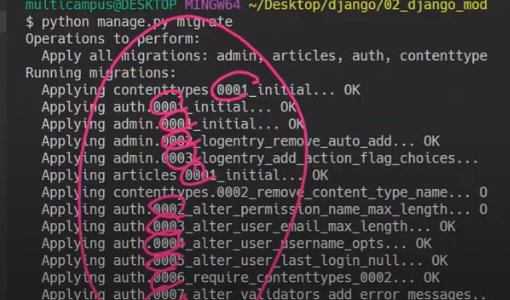

   이거 뭐가 계속 ok되고 있는거임???? 이미 작성된 django의 내장 앱들

   

   얘네들도 각각의 마이그레이션 파일이 있을것이고 그것이 첫 마이그레이션을 만들때 적용이 되는 것.(이미 설계되어있는 앱들의 마이그레이션 파일들또한 업데이트가 되는 것)

   이 중에서 우리가 만든 테이블은

   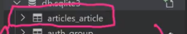

   이거 하나임 근데 이름이 좀 다르다??? 이름은 '`앱이름_모델이름`' 으로 만들어지게 된다.

   확인해보면 스키마를 확인할 수 있다.

   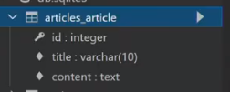

이제 테이블이 만들어 졌을건데 이를 확인하기 위해서 sqlite를 받아서 확인해본 것.

---

## 다시 실습

## * Migrations *

(sub-command)로 볼 수 있는 것들

- `sqlmigrate` : 어떻게 해석될지 미리 확인

  

- `showmigrations`

  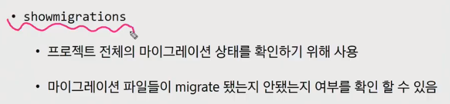

## 다시 실습

`python manage.py sqlmigrate articles 0001`

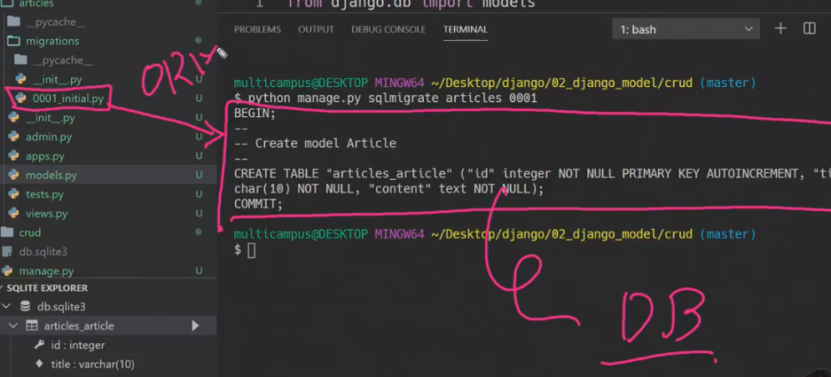

0001_initial.py라는 마이그레이션 파일이 ORM을 통해 어떻게 해석되어 DB에 전달될지를 확인할 수 있다.

`python manage.py showmigrations`

[X]는 체크표시(확인이 되었다.)

한번더 변경사항을 만들어 보겠습니다. 모델을 만들어놨더니 수정을 해야하는 부분이 생겼음. 작성일과 수정일이 있다면 작성일 기준으로 뭔가를 할 수 있을것이고 할건데 지금은 어떤글이 최신글인지 알수가 없다(현재는 제목과 내용뿐) 따라서 필드를 좀 더 추가해 봅시다.

작성일(created_at), 수정일(updated_at)를 만들건데 이 또한 만들어진 클래스를 가져다 씁니다.

DB에서 저장되는 순간의 시간을 사용자가 넣어줄 수는 없기때문에 조금 더 부가적인 인자가 들어가게 됩니다.  created_at(작성일)의 경우에는 시간을 자동적으로 저장해주기 위해서 `auto_now_add=True`를 넣어준다(기본적으로 False로 되어있음), updated_at(수정일)의 경우에는 `auto_now=True`를 넣어준다.

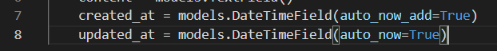

이를 확인해보기위해서 다시한번 검색해보자. django modelfield 들어가보면

아까 잠시 id가 사용했던 `AutoField`도 있고

- `CharField`도 있다. CharField는 필수인자가 하나 있는데 그것이 max_length다.

- `TextField`도 나온다.

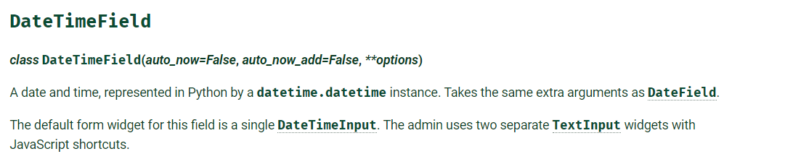

- `DateTimeField`가 있는데 인자들을 보니까 기본적으로 False로 되어있다. datetime.datetime 모듈이 사용되고 나머지는 `DateField`와 같다(DateField의 상속을 받는다)

`DateField.auto_now` : 객체가 저장 될때마다 매번 field를 set한다는 말(수정시간), 최종수정시간에 적합

`DateField.auto_now_add` : 객체가 처음 저장될때만 저장(작성시간)

자 이제 설계도가 변경되었으니(모델이 변경되었으니) 다시 `makemigrations`를 해야한다. 그냥 `migrate`해버리면 

migrate할 것이 없기 때문에 메시지가 나온다. 따라서 변경된 사항을 저장해주기위해 `python manage.py makemigrations`를 해준다. 해주게 되면 2가지 선택지가 뜸.

생각해보면 기존의 테이블에

이상태에서 새로운 테이블을 만드려고하는데 그 내용이 지금 비어있다라는 의미. 그 비어있어서 무엇을 할건지 선택지를 준다.

1. 너가 커맨드 상으로 입력할 건지
2. 여기서 나가서 직접 코드로 작성할 건지

1번을 하기로해서 1누르고 엔터누르면

그냥 enter누르면 timezone.now을 통해서 값을 넣어준다는 것. 그냥 enter누른다. 그렇게 되면 default값으로 timezone.now값이 들어가게 된다. 그러면 비로소 모델의 변경사항이 저장 된 것

migrations 폴더를 보면 새로운 마이그레이션 파일(0002_auto_202110...)이 만들어져있다.

이렇게 축적되면(0001,2,3...) 만약 2번에서 잘못 되었다면 1번 설계도로 돌아가서 다시 사용할수 있는 장점이 있다. 각각 시점이 누적으로 기록되기 때문에 뭔가 잘 못 수정되었다면 이전 기록으로 돌아가면 된다.

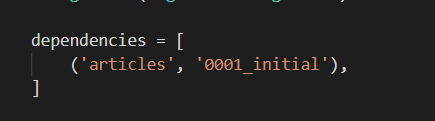

articles의 0001_initial을 기반으로 만들어진 마이그레이션이라는 의미

이제 설계도가 만들어졌으니 실제로 다시 적용을 해준다. `python manage.py migrate`

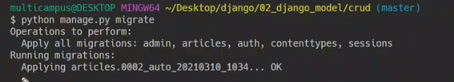

그러면 비로소 변경사항이 적용

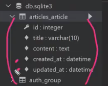

## 잠시 복습

## Database API

DB와 우리는 대화를 해야하는데 예를들어, ''작성자가 김싸피인 모든 게시글을 조회해줘''라고 DB에 명령, 부탁을 하고싶다 근데 우리가 사용하는 언어는 Python. 파이썬 만으로는 소통이 불가. 따라서 ORM을 사용하게 되는데 따라서 특수한 문법에 따라서 ORM 사용해야한다.

파이썬으로 DB와 소통하기 위해서 DB API를 사용하게 된다.

우리가 DB와 대화,명령,조작을 하기위한 도구로서 사용을 할 것임. 여전히 우리는 SQL문법은 사용하지 않은 상태

### 문법

이 세개를 포함해서 API구문이라고 한다.

Class.뭐시기.뭐시기() 를 보니 파이썬 언어기는 하다. 

all() : 핵심 명령어부분, Article모델한테 명령

- Article

  이것은 아까 우리가 만들었던 모델

- Manager

  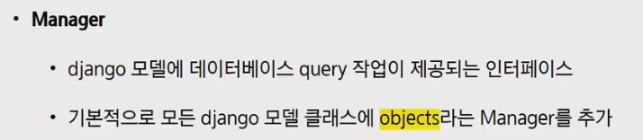

  기본적으로 DB를 조작하기위한 정보를 가지는 애. 인터페이서 역할을 한다. Manager없이 Article과 QuerySet을 연결시킬수가 없다.

- QuerySet

  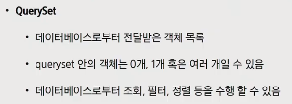

  DB로부터 받은 객체의 목록. 0개일수도 1개일수도 복수일수도있다. 하나의 리스트[] 처럼 오는데 리스트가 비어있을수도 있고, 채워져 있을수도 있다는 말이다.

## 잠시 복습

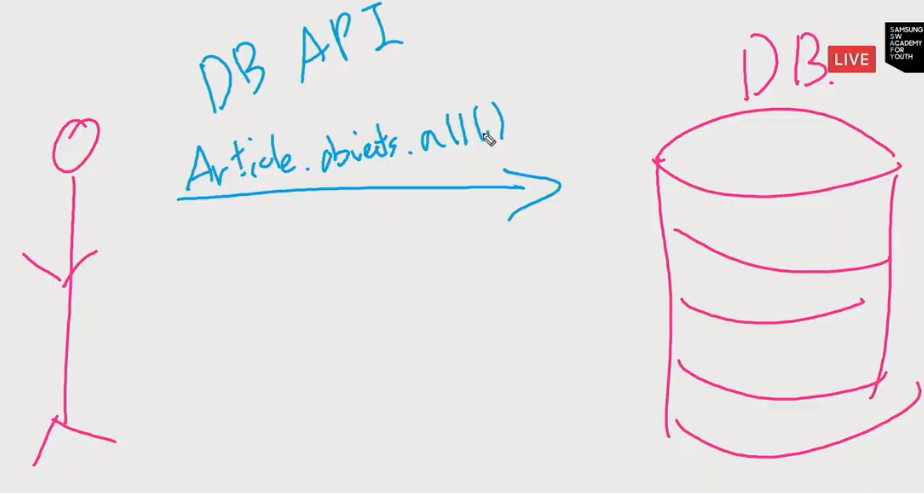

Article아 너가 가지고 있는 정보(objects) 모두를 줘(all()) 이것을 ORM이 SQL로 해석을 해서 DB로 가고 DB에서 다시 SQL로 ORM으로 보내서 이는 다시 Query Set으로 내게 돌아오게 된다.

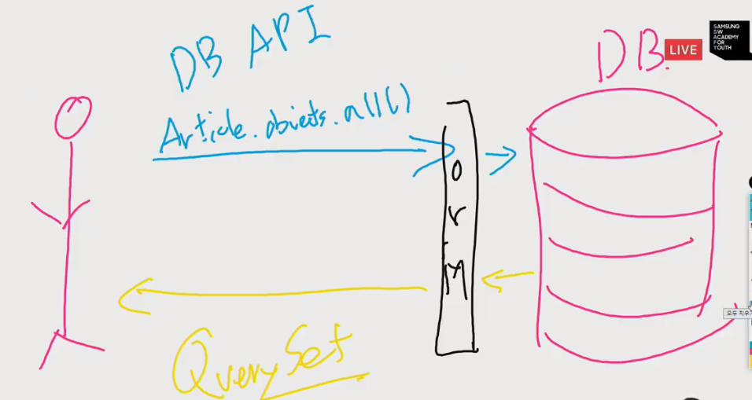

## 다시실습

Objects는 바뀌지 않을것이고 Article을 조작하기위한 QuerySet API의 종류가 정말 다양하다.

- QuerySet API

  클래스를 조작 하기 위한 이 종류가 정말 다양할 것

이 종류들을 확인해보기 위해서 django queryset reference를 검색해보면

우리에게 QuerySet을 주는 객체인지 or QuerySet이 아닌 단일 객체를 주는 것인지 나뉘어져 있다.

단일객체로 전달되는 것

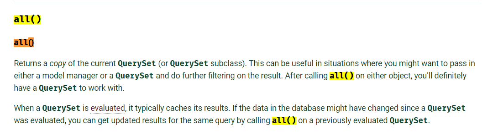

데이터에 대한 전체 정보를 전달한다라는 Queryset API

쉘 스크립트에서 bash에서  `python -i` 하면 파이썬 쉘 스크립트가 켜지게 되고

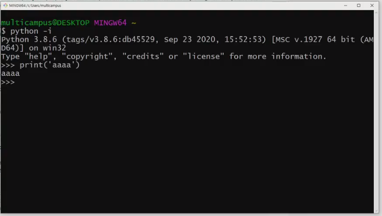

여기에서 API 사용하기위해서 Article.objects.all()해도 못알아 듣는다.

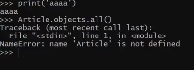

django라는 환경 안에서 사용을 해야한다. 이를 위해서 뭔가 설치를 해야한다. 구글에 django extensions를 검색

3rd-party-library들은 복사해서 처음에는 설치해야만 합니다 

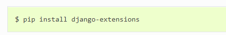

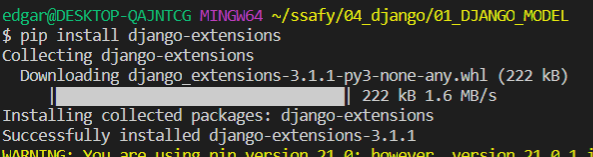

한단계가 더 있습니다. 아래쪽 installing 문서의 Configuration를 보면

이걸 다시 복붙해서 master app의 settings.py의 INSTALLED_APPS에 붙여넣어야만 한다.

기본 파이썬 쉘에서 Django 관련 조작을 할려면 추가 설정이 필요합니다. 그 작업을 Django shell이 기본으로 해줍니다. django가 가지고있는 기능인 shell-plus(장고에서 키는 파이썬 쉘이라고 생각하면 됨)

기본적인 파이썬에서의 쉘 `python manage.py shell` 로 키고, exit로 나올수 있고

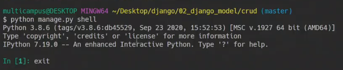

장고에서 shell_plus를 하기위해 `python manage.py shell_plus`, `exit`로 나올 수 있음. 

밑에 초록색 안보이면 `pip install ipython`을 통해서 ipython설치해줘야합니다.

장고에서 사용할만한 것들을 기본적으로 모두 import해주고 우리가 작성한 모델 또한 import해준다.

그러면 이제 import가 다 되어있기 때문에 바로 클래스들을 사용할 수 있게 된다.

자 이제 무엇을 할 것이냐

## CRUD

예를들어 인스타그램을 봅시다. 사진을 올릴 수있고(Create생성) ,타임피드에서 볼 수 있고(Read읽기), 게시글 수정(Update갱신), 게시글 삭제(Delete삭제).

DB의 조작은 결국 이 C, R, U, D 네가지를 하기위해서, 뭐를통해? DB API를 통해서 아까 봤던 all()은 이중에서 Read(읽기)에 해당하는 친구였음.

## 다시 실습

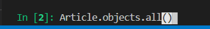

너가 가지고있는 객체 다줘. 그러면 ORM이 QuerySet으로 우리에게 돌려줌.

어 근데 이는 대괄호[]로 만들어져있다. 이말은 QuerySet목록을 받았으면 이를 리스트로 사용할 수 있다는 말(for, 인덱스접근)이다. 정확히 list는 아니지만 Querydict와 같이 유사 리스트로 볼 수 있다. 소통할 때쓰는 타입인데 리스트로 되어있는 것을보니 리스트와같이 사용할 수 있다는 것.현재는 게시글이 없기 때문에 빈 리스트.

이제 Create먼저해보자 세가지 방법이 있는데,

첫번째,  오랜만에 인스턴스를 생성해보자 article이라는 인스턴스를 생성해볼 것 이를 통해 무언가를 할 것

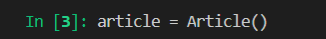

article이 뭔지 확인해보면 None은 PK(기본키)값인데 아직 사용이안되어있다는 말

현재 우리가 직접 넣어야하는 값은 몇 개 일까. 2개. title과 content값을 넣어주어야한다.

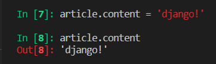

이제 제목과 내용을 적어준 겁니다. 다시 인스턴스를 확인해보면 아직 None이 나옵니다 . 이는 아직까지 DB에 저장은 되지않았다는 것. (실제로 작성버튼을 아직 누르지않았다는 것) 작성버튼을 누른다는 것은 `save()`라는 메서드가 존재. 이렇게 함으로써 비로소 번호가 생긴다.

우측의 화살표(show table)을 눌러보면 현재 만들어진 table을 확인가능하게 된다.

포인트는 Python Object 언어를 통해서 DB에 접근한 것입니다.

## 웹엑스

그대로 다시 진행해보겠습니다.

`$ mkdir 02_MODEL`

`$ python -m venv venv`

`$ source venv/Scripts/activate`

`$ pip install django django_extensions ipython`

## 여기서 잠깐

algorithms

러시아 국기같은 것은 IQ테스트 같은것

데이터 100만개 1000만개 1억개의 데이터 중에서 가장 빠르게 탐색해서

알고리즘이 필요한 구간이 결국에 현직에 필요하다면?? Sort 라는 것이 아무 것도 없었다면 bubble, quick, selection .. 이렇게 만들어 졌다. 결국 필요한 곳은 **''탐색과 정렬''**

1. 탐색 : quick -> binary search이런 과정이 아니라 이건 우리가 할 일이 아님. 이전에 우리가 해야할 일은 **data는 어디에 있는가?**다. 답은 DB데이터베이스에 있다.
2. 정렬(sort) : bubble, quick을 하든 모든 올바른 알고리즘. 근데 왜이렇게 많은 종류를 배우느냐?? 효율때문.(시간/공간(memory))

DB는 프로그램이다. 데이터 관리용 프로그램. 어떠한 소프트웨어다. DB를 표현할때는 이런식으로 보통 표현함

DB라는 프로그램이 우리가 사용하는 정보,내용들을 대신 저장을 해주는 것

데이터 관리용 이라는 같은 목적으로 만들어진 data관리 프로그램이 종류는 많다. (Oracle, MySQL, PostgrSQL, MariaDB.... 그중에 하나가 SQllite)

아무리 달라도 기본적으로 비슷한 커맨드가 있는 것처럼

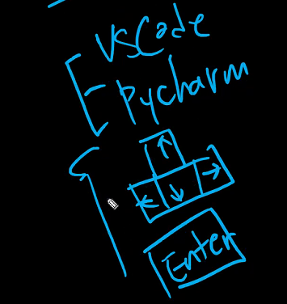

DB관리 프로그램들도 교집합처럼 공통적으로 사용하는 부분이 있다.

DB라는 프로그램은 기본적으로 GUI로 이루어진것이아니라 CLI로 이루어져있다. database를 사용하기 위해서는 이를 사용하기 위한 전용언어가 있다. 이것이 바로 **SQL(Structure Query Language)**라는 활용언어. 즉, SQL은 **DB조작언어**인것. 

요즘 많이 사용하는 DB프로그램은 Oracle, MySQL, PostgreSQL 인데 우리는 왜 안쓰냐? 설치부터 일이다.

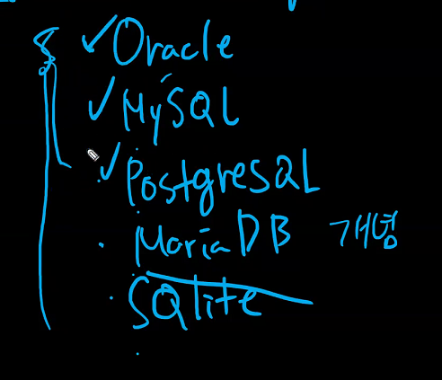

왜 안쓰냐면 우리가 넘을수 없는 차원의 벽(파이썬같은 언어가 뚫을 수 없는 장벽)이란 것이 있고 이것을 ORM(Object Relational Mapping)이 뚫어서 서버에 전달해준다. ORM이 서버가 알아먹을 수 있게 해주는 통역기 같은건데 이게 없으면 실제로 SQL쉘에 작성해야하는데 이것이 에바이기 때문에 ORM을 사용하는 것.

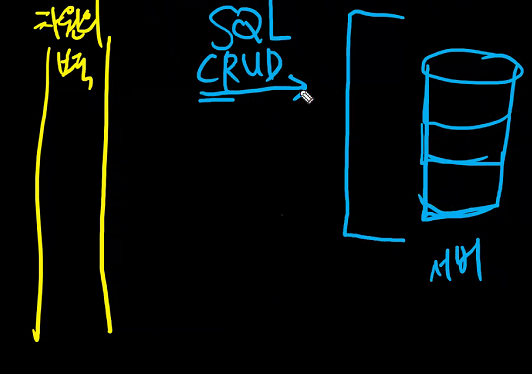

django 서버를 켜서한다. 왜 서버를 켜야할까? 왜냐면 계속 돌고있어야 언제 올지 모르는 Request(요청)을 받을 수가 있다. 언제 서버에 SQL로 CRUD를 하라는 요청이 들어올지 모르기때문에 서버를 켜놓고 있어야만한다. 이 서버를 키는것부터 문제라서 어렵다는것이다.

DB 프로그램은 Oracle, MySQL.. 여러가지가 존재하는데 이것만 하더라도 깊게 공부해야하는 언어다. 그렇다면 지금 SQL을 지금배워야 하는가? 지금은 DB를 직접 사용해보고 나중에 SQL을 배워보자라는 접근. 

- 잠깐 외적으로 data를 '       ' 한다. 에서 '    '에 들어갈 수 있는것은 딱 네가지만 가능하다. **생성 / 조회 / 수정 / 삭제**만 가능하다. 물론 별개로 테이블생성,삭제가 있지만 이건 따로생각하고 위의 네가지만 가능하다.

정리하자면, 데이터를 저장하지 않는 경우는 거의 없다. 데이터의 저장(조회,수정)은 DB빼고 할 수 있는 것이 없다. 그렇다면 django서버프로그램과 서버가 연결, 협력이 되어야만 한다.

view파트에서 업무를 작성을 하고나서 서버에 요청을 보내려고하는데 차원의 벽을 넘을수가 없다. 원래는 실제로 코드 어딘가에 SQL을 작성을 해야만한다. 근데 우리는 그러고 싶지가 않다. 

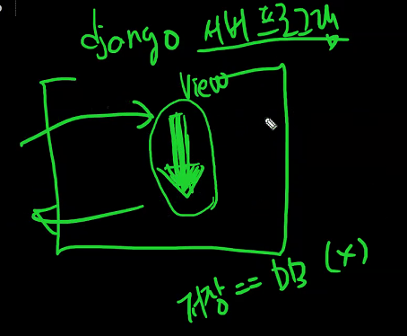

그래서 중간에 대리인, 인터프리터와 같은 녀석을 두고(예를들어 ''줘''라는 요청을 보내면 'give me'로 서버에 요청을 보내는 느낌)

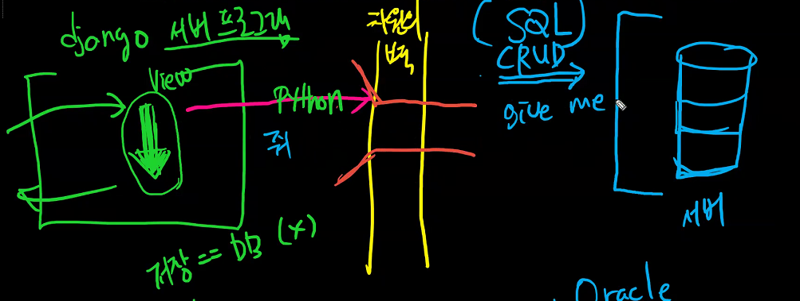

서버에서는 그럼 $, 상평통보를 주고 이것은 다시 우리는 원화,비트코인을 받아와야만 한다

여기서 $, 상평통보 같은것은 스트링에 불과하다. (테이블이라면 "1 ㅎㅇ Model", "1 김명준 학생"과 같은 느낌)

실제 DB에 데이터는 표처럼 정보가 저장되어있지않고 단순한 문자로 저장이 되어있다.

따라서 이러한 스트링덩어리를 우리가 사용하는 언어(파이썬...)로 받을때 객체(Object)로 받아서 파이썬에서 사용할 수 있는 형태로 받아오게 된다.

이렇게 중간에서 변형을 도와 중간다리역할을 해주는 것이 ORM이다.

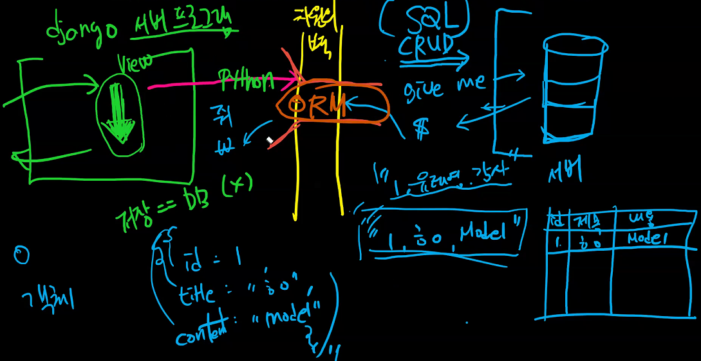

그림은 이렇지만 ORM이라는 것은 실제로 django의 기능중 하나입니다(django ORM). django는 framework이고 실제로 사용하고있는 언어는 python이고. OOP라는 세상에서 사용되는 중입니다.

db는 저장하는 두가지 방법이 있는데 1. Rdbms 2. NoSQL인데 

Rdbms(Relational db Management System)이라고해서 ''**관계형** 데이터베이스 관리 시스템''

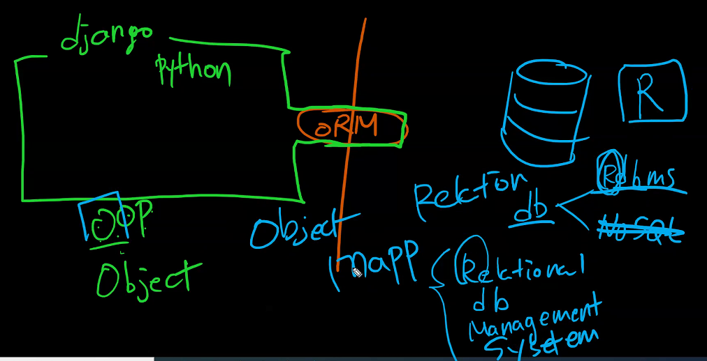

왼쪽세상에 O를 따오고 오른쪽세상에 R을 따와서 Mapping을 한다고해서 ORM이 된 것.

결론 : 파이썬만 써서 CRUD할 수 있다.

SQL 현재는 몰라도 괜찮다. 그렇다고해서 DB개념이 없어야 된다는 것은 아니다.

시트가 DB에서는 table이라고 표현을 한다. 따라서 처음에 해야하는 것은 table생성. 엑셀은 자동적으로 생성이 되지만 몇개의 데이터가 들어올지(column)는 정해져야만 한다.

즉, 무엇을 이야기 할지를 정해주어야만 한다. == column을 지정해주는 것이 시작

그러면 이러한 table을 만들어준 상태

이것은 현재 가치가 없다. 구조가 되어있지를 않다 완전 중구난방

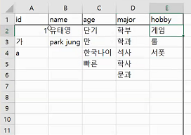

따라서 어느정도 맞추어주자라는 규범을 정해놓는다. 이렇게 구성하는 것을 **스키마 구성**이라고 한다.

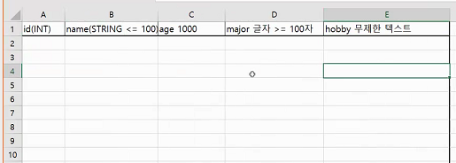

오전에 한것이 이거임. 근데 파이썬으로 한 것.

## 다시 돌아와서

sqlite3부분 다르게 바꿔주면 그 DB 프로그램 사용이 가능하다. 근데 왜 sqlite3를 사용하는 것인가?

일반적인 DB의 과정은 사용자의 정보(id, pw..)를 받아서 그것이 맞다면 원하는 정보를 주어야만 한다. DB또한 파일로 이루어져있지 않다. 이것이 보통인데 sqlite는 조금 특별하다

id, pw관련된거 없고, DB도 파일로 이루어져있다. 엄청 경량화 되어있는 DB라는 것. 자취방에서 제일 작은 냉장고만 있으면 되는데 김치냉장고, 큰 냉장고 다 사버리면 좀 그러니까 적당한 걸 사용한다는 느낌.

모델링이 뭔데요? 클래스는 왜써요? 이질문이 먼저겠지만 일단 해보자

이것이 아까 엑설에서의 한 줄을 의미한다고 볼 수 있다.

이 상속 하나(models모듈의 Model 클래스를 상속받음)만으로 DB와 소통할 수 있는 초능력을 얻게된다. DB에 table을 만들 수 있는 초능력을 얻게된다.

아까 엑셀에서와는 달리 모델에서는 필드에 대한 특성을 써줘야함

클래스는 객체(인스턴스)를 만들어주면서그 의미를 갖게 되었었다. 이번에도 마찬가지 근데 조금 다르게 

DB세상과 Python세상 사이의 중개자가 존재하여 Student만으로 class가 의미를 가질 수 있다. 

특정 앱에 대해서만 `makemigrations 앱이름`, `migrate 앱이름` 하면 특정 앱에 대해서만 적용시켜줄수가 있다.

이것이 곧 스키마

아직까진 정보가 들어있지않아서 아무것도 없다.

근데 나는 지금 그냥 어떻게 view중간의 어딘가에서 어떤 상황인지 확인만 해보고싶은데

뭔가 해야될 일이 너무많다. 그래서 간략히 확인만 하기위해서 사용하는 것이 바로 쉘

view에다가 쓸 코드만 뽑아서 진행을 하겠다라는 느낌 `python manage.py shell_plus`

여기까지는 기본 파이썬에서 하던거라서 아무 변화가 없다. 그런데 `s.save()`라는 것을 하게되면?

데이터를 뽑아서 DB에 저장하는 것

## 오후 실습

앞에서 우리랑 DB가 소통을 할 건데 DB API를 통해서 소통을 할 거다. 우리가 생각할 것은 **어떤 모델에서(Article) 어떤 동작을 할 것인지(all())**를 생각해주면 된다. 그 중에서도 집중해서 잘 활용해야 할 부분은 QuerySet API부분

여기서  `.save()`는 인스턴스/ 클래스 / 스태틱 메서트중에서 뭘까?? 인스턴스 메서드. Model클래스에서 상속을 받은 메서드. ( **OOP jupyter notebook 두바퀴돌고오기**)

pk나 id조회는 같은 겁니다. 하지만 주로 pk를 사용할 겁니다. 지금 이 상태에서의 article은 새로 만들어준 2번째 인스턴스(2번째 열)에 대한 내용을 포함하고있다.

이번에는 인스턴스를 거치지 않고 바로 만드는 세번째 방법

## 잠시 정리

- Create의 세가지 방법

1. 첫번째 방법 : 인스턴스 생성후 넣는 방법

2. 두번째 : 생성하면서 넣는 방법

3. 마지막 : 클래스로 접근해서 오브젝트를 만드는 방법 

## 다시 실습

쉘을 다시 시작하면 이전의 인스턴스는 확인할 수 없다

두 가지로 정렬이 되어 

1. 대표적으로 all()
2. 대표적으로 get()

### get()

- 객체가 없으면 DoesNotExist 에러 발생
- 객체가 여러개일 경우 MultipleObjectsReturned 에러 발생
- 위와 같은 특징을 가지고 있기 때문에 unique 혹은 NOT NULL 특징을 가지고 있는 경우에만 사용 가능(**즉, pk조회할때만 사용하라는 의미**)

현재 4개의 글이 저장되어 있다는 것

article의 4번째 정보를 가져오고싶다

100번째를 찾고싶다면??? 에러가 나온다

내용이 첫번째 글과 똑같은 경우는??? 첫번쨰 글과 똑같은걸 하나만들어서

확인해보면 에러가 난다

### filter()

쿼리셋을 주는 메서드. 찾는 내용이 있는 자료들을 모두 찾아서 알려준다. 하나의 쿼리셋 안에 데이터 2개가 담겨져서 온것

그러면 찾는 데이터가 만약 한개라면?? 하나의 쿼리셋 안에 하나의 데이터가 담겨져서오게 된다.

## Field lookups

get, filter, exclude메서드를 사용할때 키워드 인수로 사용이 된다. 예를들어 하나만 써보자면 django field lookups를 검색해보면

여기를 보면 Field lookups가있다.

lte : larger than equal

`field__lookups=value`형식으로 사용된다. 즉 ''field__조건=비교할값'' 느낌으로 사용되는 것

실습에서

!를 가지고 있는 것들을 찾아본다고 하면 !가 모두 잇으므로 모두 가져오게된다

키값이 1??

## 다시 실습

이번에는 수정을 해봅시다 먼저 위치를 변경해주고

수정을 해준다

근데 이러면 바뀌지 않는다. save()를 하지 않았기때문

따라서 save()를 해준다. 이렇게 되면 수정을 했기때문에 updated_at 시간도 변경이 된다.

자 이제 삭제를 해봅시다. `delete()`하면 첫번째 article이 지워진다.

이 상태에서 다시 작성을 해보면 1?? 6??  6번이 생성된다. DB에서 삭제가 된다면 DB는 해당 pk값을 사용하지 않는 것으로 판단해서 그 이후의 pk의 값으로 시작하게 된다.

이제 url을 만들건데 django에서 프로젝트를 만들때 이미 만들어져있는 url이 있었다. 바로 master app의 url

## Admin site

articles의 admin.py에 우리가 작성한 모델을 등록해볼 겁니다.

현재 디렉토리의 models안의 Article을 가져올 겁니다

admin site에 register하겠다. 무엇을? Article class를

자 이제 또 새로운 명령어를 해봅시다 `python manage.py createsuperuser`

어떤 이름 쓸꺼냐가 나오는데 지금은 admin으로 해볼거임

이메일은 패스하고 pw도 설정하면(이건 화면에는 안보이지만 커서가 있는거임)

근데 너무 짧고 흔한데 그대로 만들거냐?? y응 만들게

이렇게 되면 SQLITE확인해보면 auth_user라는게 만들어져있는것을 확인가능하다

이것은 내장되어있는 앱에의해서 만들어져있는 거임.

이제 서버를켜서 admin/ 으로 들어가서 로그인을 해보면 이런화면이 나오고

articles에 들어가서 확인하면 이렇게 나오는데

이것은 def __ str __():에서 return을 title로 해줬기 때문

지금은 하나의 column으로 되어잇는데 이를 나누고싶다면 articles의 admin.py로가서 

이렇게 해주면 아래와 같이 커스텀 또한 가능하다. 더 많은 것은 django admin site를 검색해서 알아보자!

tempate상속을하는 basetemplate을 빠르게 만들어 볼것

ctrl + l이 터미널 창 정리

## 정리

모델로 Database를 관리

django는 파이썬 언어를 쓰고 DB는 SQL언어를 쓰는데 어떡하느냐

ORM이 도와줄 것임

최종적으로 CRUD를 하고자 한것

## 웹엑스

테이블 설계에서.. CRUD operation에서 CUD(생성,수정,삭제)는 따로 두고 R은 따로 설명하고싶다. 왜그럴까?

1. CUD는 데이터의 변화가 있을 수 있지만 R은 데이터의 변화가 없다. (위험도가 낮다)

2. CUD는 크게 다양하지 않다. (C 생성시 받아오는 데이터를 받아오면 되고 U,D도 마찬가지) 근데 R같은경우는 filter를 걸어주는 조건에 따라서 정말 다양해진다(SQL이 무궁무진해진다). 전문성이 드러나는지의 차이

쿼리문에 대해 얘기를 한다면 검색에 django queryset api를쳐서 확인해보면 조회를 할때 사용되는 메서드가 정말많다.

다시 돌아와서

이것은 휘발성 메모리를 가지고 있는 것이기때문에 이를 저장해주어야만한다. s.save()

들어가기 직전의 약간 활성화 시켜놓은 듯한 느낌이라는 것. 여기서 이제 save를 하게 된다면 비로소 저장이 된다고 생각하면 된다.

객체는 죽었지만 실행이 되어 저장이 되었다.

또다른 방법은

지금알아야하는 것은 전체조회와 단일조회

- 전체조회

- 단일조회

  1. get() -> 이것은 중복되는것이있거나 찾는내용이 없다면 DB가 뻗어버려서 오류를내보낸다.

     get은 id검색인것

2. fillter()

   

개별 사용자 보여주는 html

## 보충수업

Django Database API

♦ Migrations 순서!

1. 모델설계 => models.py 수정(변경사항이 발생)
2. `python manage.py makemigrations` => migrations 파일을 생성

3. `python manage.py migrate` => 실제 migrate 동작!

`python manage.py createsuperuser` 

모델을 추가해줘야 사이트에서 사용이 가능하게 된다.

브라우저에 보이는 table변형이 가능하다.

