# Django_Webex

오늘 할건 UD파트. U파트가 약간의 고통을 가져다 줍니다. 일단 UD우선 해봅시다.

바로해야할건 가상환경설정을 해야한다. `source venv/Scripts/activate`

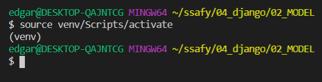

근데 보통은 가상환경이 자연스럽게 설정 되어야만 한다. 자동으로 이전에 했던 내용들이 저장되기 때문. 근데 이게 안되는 건 우리가 .gitignore에 vscode부분을 해줬기 때문.

그러므로 `ctrl+shift+p`눌러서 interpreter를 잡아준다.

습관적으로 서버 한번 켜주는 것으로 시작 `python manage.py runserver`

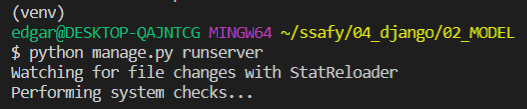

shell_plus를 켜서 DB업데이트 해봅시다

전체조회

단일조회

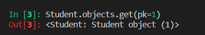

업데이트(Update)는 수정한다. 딜리트(Delete)는 삭제한다. 라는 의미인데 어제 했던 내용중 ''위험도''얘기를 잠깐 했었다. 

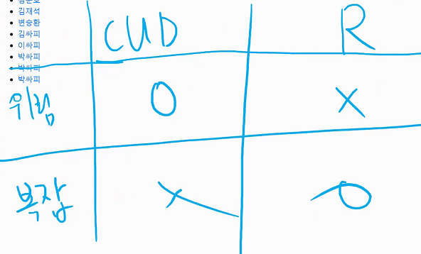

좀 더 나누어보면 CUD의 경우 2가지 view(주기, 받기)가 있었다.

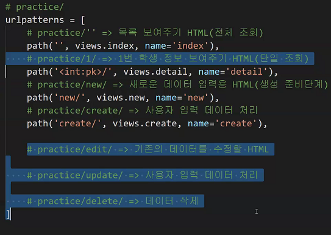

수정, 삭제할때 ''무엇을 수정, 삭제할 것이냐??'' 기존에 있는 데이터를 수정하고 삭제해야만 하기때문에 주어부분이 현재 비어있는 것임. 결국 특정 데이터에대한 정보를 url이 가지고 있어야만한다.

practice/ 기준으로 1. new : html 2. create : 저장	3. '' : 전체	4. id : 단일데이터	5. id/edit : 단일데이터 수정 6. id/update : 단일데이터 수정	7. id/delete : 단일데이터 삭제

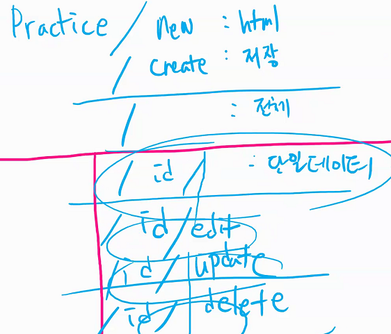

url이 곧 요청하는 법인데 이게 너무 다르면 사용자입장에서 혼돈을 야기할 수 있었음. 사람마다 다른 url양식을 해버렸는데 이게 혼란을 야기했던 것. 그래서 사람들이 url에 대한 괜찮은 패턴을 제시하기 시작함. '이런 패턴을 따르는게 어때?'라는 느낌으로 딱히 이상한 패턴을 고집하는 것이아니라 뚜렷한 standart마련을 하지 않았다면 Major, Minor, patch이런 방식을 따르자 하는 것이 전반적인 룰. 

x, y, z 을 따르는 방식 : `sem ver`

resource/new	/create	/	/id	/id/edit	/id/update	/id/delete 이러한 패턴을 따라가는 방식 : `RESTful 하게 짜여져 있는 url`

이건 웹에 한정된 것이 아니라 볼 수 밖에없는 이야기. "RESTful API를 본인이 편한 언어로 준비해서 오세요" 라는 말을 사용한다. 결국 이말은 CRUD를 해결할 수 있는 서버를 준비하라는 의미

결국 이렇게 convention을 따르게 된다.

수정하기 전 조회가 먼저

이제 수정을 해보려는데

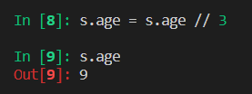

이러면 끝인가? ㄴㄴ 영구저장을 해줘야 한다. save()

마지막 애를 한번 잡아서 확인해보면

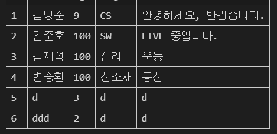

마지막애가 보이고 애를 죽어라 하면 죽인다. (이건 개인한테 사라지라는 명령)

save, delete는 python세상에 영향을 미친다기보다 db세상에 영향을 미치는 것. 근데 s는 여전히 남아있기 때문에 python세계에서는 아직 살아있는것처럼 조회는 된다.

이것이 마지막 흔적

근데 새롭게 변수를 지정해지면 비로소 마지막 흔적까지 사라지게 되버린다.

python은 메모리의 이야기인거고 db의 이야기

## 오후수업

- url의 요청은 원래 2가지

get : 내놔라

post : 받아라(CUD 마무리하고 데이터 보낼때)

뭘 줘? 데이터(html)를 줘. 줄수 있는게 data밖에없다.

이렇게 4가지는 get 요청 일 것이고

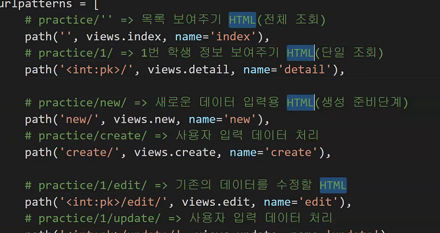

create, update는 post요청일 것이고 delete또한 삭제해달라는 post요청일 것이다.

결론. DB에 영향을 주는 모든 요청을 post처리를 하겠다.

사용자가 form태그를 통해서 요청을 보내는데 사용자가 서버에 POST요청을 하도록 만드는 것.

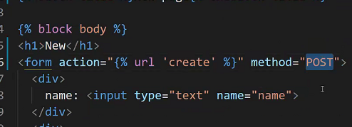

근데 사용자가 우리에게 보내는 요청은 절대로 믿으면 안된다. 예를 들어 전화번호 - 붙여서 보내랬는데 그냥 보내거나, 신주소쓰라는데 구주소 쓰거나 하는 등 이런 입력이 들어올수있다고? 싶은 입력이 들어오게된다. 따라서 1000만명중 악성사용자 한명 정도의 이상한 입력을 대비한 일을 해야만한다. 조건문을 추가해 주면서 POST의 경우에만 작동하도록 하는 것.

POST로 바꾸면

1. URL에 아무런 정보도 드러나지 않는다.

   GET의 경우에는 로그가 남으면서 브라우저에 url이 드러난다.

   

   POST의 경우에는 forbidden이 된다.(거부된다)

   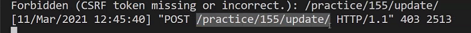

   싸이트간 요청공격에 대한 방어(CSRF)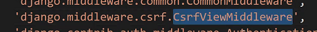이녀석이 방어한 것.

   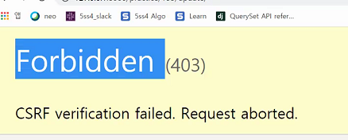

   요청이들어오면 MIDDLEWARE를 거쳐서 view로 들어가고 그리고 응답이 나가는 것

   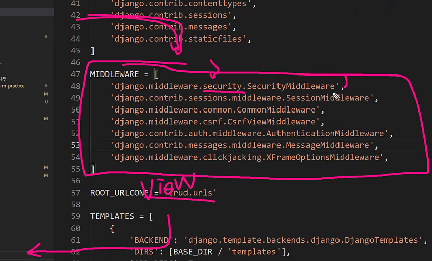

   

   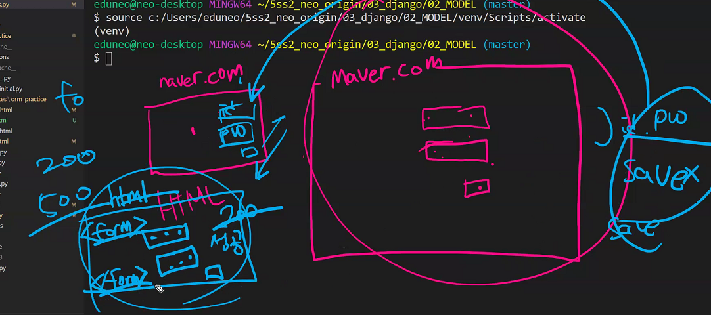

   내가 발급한 form양식이라는 인증을 찍어주게 되면 다른 사람이 내 정보를 가지고 요청을 하는 것을 방지할 수 있다. csrf(사이트간 위조 공격)를 방어하기 위해서 csrf_token이라는 것을 적어준다 .

   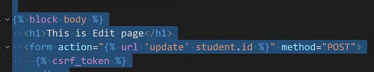

   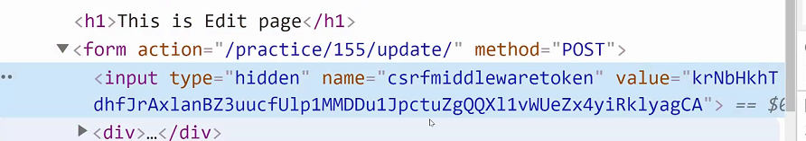

   input type중 하나인 hidden이 적용되어있고(값은 내가 넣는데 숨겨지게 됨) value는 뭐시깽이 새로운 토큰값들이 적혀져있다. 사용자 html보는 시점마다 다른 토큰이 적용되고, 요청마다 토큰을 확인하게 된다.

   결론. form 태그에 POST요청을 보낼때 csrf_token을 사용하게 된다.(모든 POST 요청은 csrf token이 필요하다.)

브라우저에서 작성하는 모든 url은 get. form태그에서 작성한 후에 url이 바뀌는 것은 POST요청임(form 태그의 method=POST인 경우만).

a태그도 무조건 get인데 이것을 POST로 하고 싶다면 form태그로 만들어줘야만한다.

현재상황으로서는 form태그의 경우만 POST.

## 알고리즘 특강

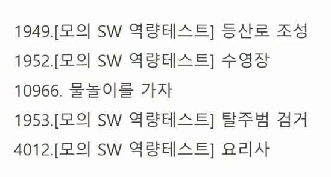

