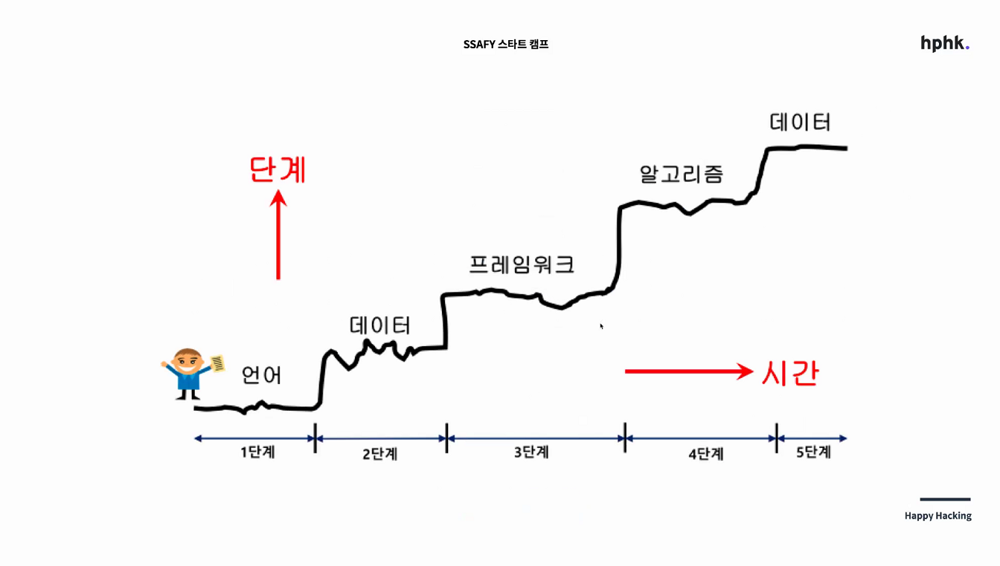
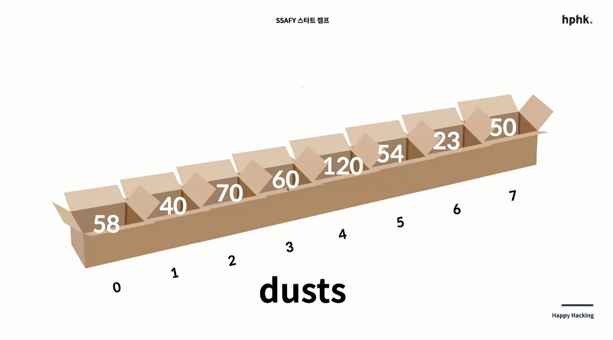
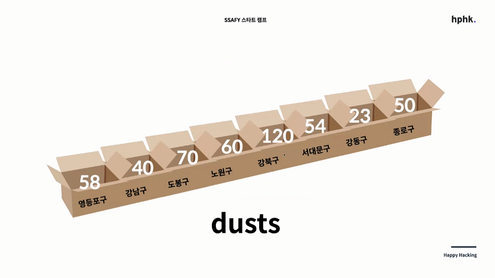

# Basic Python

## 개요

'Computational Thinking'이라는 용어를 흔하게 듣는 오늘날

Computer가 무엇인가? 계산, 저장

Programming ? 지시, 명령 = 시키는 것

Computer Programming ? 컴퓨터에게 시키는 것

이를 위해 필요한 컴퓨터 언어(Language)!



## 특징

- 쉽다
- 많이 쓴다

## 형식

> 영어에 5형식이 존재하듯 Python에도 형식이 존재한다

### 1. 저장

> 아주 작은 칸들이 모여서 만들어진 아주 큰 모눈종이를 상상해보라.
>
> 그 모눈종이의 칸마다 박스가 존재하는데 여기에 무언가를 올려놓는 상상.

이 박스를 지금부터 우리는 **변수(Variable)**라고한다.

#### 무엇을?

1. 숫자 : 연산이 가능
2. 문자 : "" or ''을 반드시 표시 해준다
3. True / False (Boolean)

#### 표현

- dust에 60을 저장한다

  ```python
  dust = 60
  # 예를들어
  # dust = 58
  # dust = 60
  # print(dust)
  # 이때 출력 값은 60
  ```

- dust와 60이 같다.(상동)

  ```python
  dust == 60
  ```

- 리스트(List)

  > 저장해야하는 숫자의 개수가 3개라면 변수를 3개 만들면 된다. 하지만 저장해야하는 것들의 개수가 100개 이상으로 늘어난다면? 작업량이 너무 많아진다. 이때 더 편한 방법이 없을까? 하는 생각에서 시작하여 비슷한 위상, 여러개를 저장하기위해 박스를 붙이자! 라는 접근
  >
  > '긴 박스'가 '하나의 박스'

  

  ```python
  dusts = [58, 40, 70]
  print(dust[1])
  # 여기서 ,는 박스의 칸막이라는 의미
  ```

  - 리스트는 반드시 복수형

- 딕셔너리(Dictionary)

  ```python
  locations = ["강남구", "서초구", ...	]
  values = [58, 40, ...]
  ```

  이렇게 주어진다면??

  > 아예 견출지를 붙여보자는 접근.
  >
  > 궁극의 박스 dictionary "견출지 붙인 박스들의 묶음"

  

  ```python
  dusts = {"영등포구": 58, "강남구": 40, ...}
  print(dusts["영등포구"])
  ```

- Summary

  |                     | 저장하는 법                              | 불러오는 법              | 출력값 |
  | ------------------- | ---------------------------------------- | ------------------------ | ------ |
  | 변수(박스 1개)      | dust = 40                                | print(dust)              | 40     |
  | 리스트(박스 여러개) | dusts = [40, 58, ...]                    | print(dusts[0])          | 40     |
  | 딕셔너리            | dusts={"강남구":40, "영등포구": 58, ...} | print(dusts["영등포구"]) | 58     |

### 2. 조건(if)

#### 표현

`if`, `elif`, `else`를 사용

```python
if dust > 60:
    print("50초과")
elif 50 < dust <= 60:
    print("나쁨")
else:
    print("50이하")
```

### 3. 반복(While)

## 유의사항

1. 대, 소문자 구분
2. 띄어쓰기, 들여쓰기(indent)
3. 스펠링

## 약속(Convention)

- 1줄 1문장(statement)

- 기본적으로 `;`는 표기할 순 있지만, 작성하지 않는다.

- 줄을 여러줄 사용시 역슬래시`\`를 사용

  ```python
  print('hello\
  world')
  
  print("""hello  # 이렇게 쓰는 것이 관례
  world""")
  ```

- `[]` `{}` `()`는 역슬래시`\ `없이도 가능하다

  ```python
  menus = [
      '짜장면',
      '짬뽕',
      '탕수육',
      '군만두',
      '물만두',
      '왕만두',
      '마파두부',
  ]
  # 리스트의 변수는 반드시 복수형
  # trailing comma라고해서 마지막 리스트(지금은 '마파두부')뒤에 ,를 찍어야 한다.
  # why? 추후에 리스트가 추가될 상황을 고려
  ```

- `''`또는`""` 둘 중 하나의 문장부호를 선택하여 유지한다.

- `,`뒤엔 띄어쓰기
- list는 무조건 복수형 변수로 이름 짓기
- 문장옆에 주석은 띄어쓰기  2번
- 들여쓰기(tab)은 띄어쓰기 4번
- 항상 저장(Ctrl + s)누른 뒤 실행