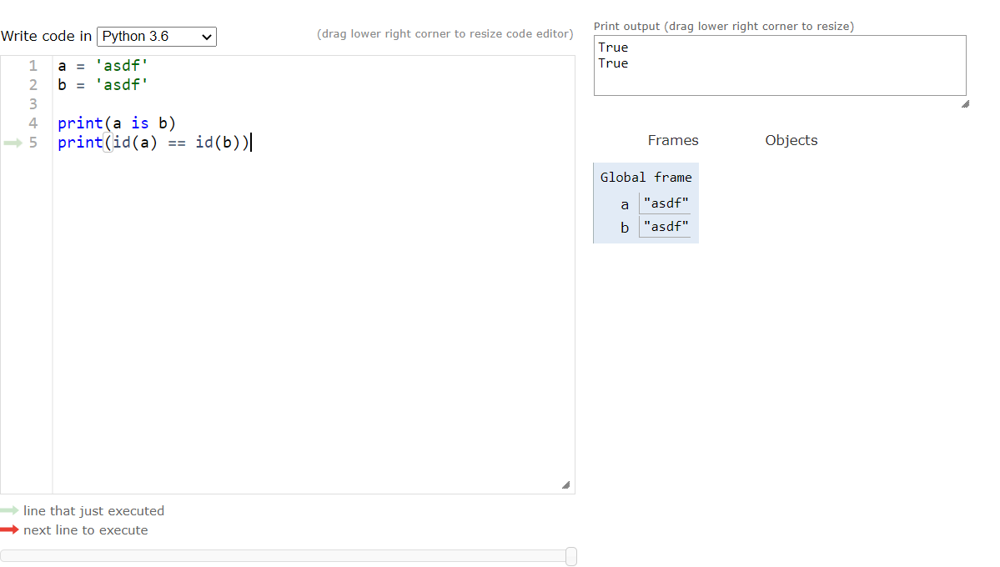
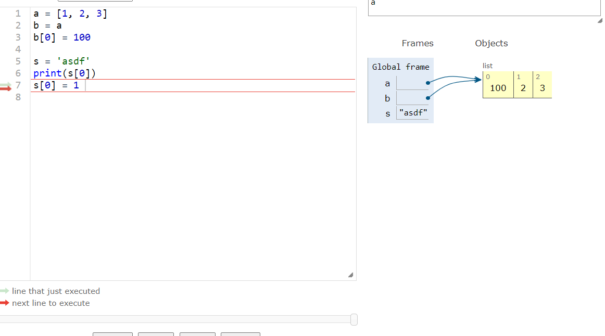

# Selfstudy

## 01_피보나치수열

### 1. 재귀적 호출

> 자기 자신을 다시 호출

```python
# F(1) = F(2) = 1
# F(n) = F(n-1) + F(n-2)

public static int fibonacci(int n) {
    if(n == 0 || n == 1) {
        return 1;
    }
    
    return fibonacci(n - 1) + fibonacci(n - 2)  # 중복연산을 계속함
}


```

### 2. 동적계획법(Memoization)

> 이미 계산한 값은 Memoization을 통해서 다시 계산하지 않고 바로 반환하도록.

```python
public class main {
    static long[] fibo;
    final static int idx = 50;
}

public static void main(string[] args){
    fibo = new long[idx + 1];
	system.out.printin(fibonacci(idx));
}

public static long fibonacci(int n) {
    if(n == 0 || n == 1) {
        return 1;
    }
    
    if(fibo[n] != 0) {
        return fibo[n];
    }
    
    fibo[n] = fibonacci(n - 1) + fibonacci(n - 2);
    return fibo[n]
}
```

### 3. 반복문

> Bottom-Up방식

```python
public class main {
    static long[] fibo;
    final static int idx = 50;
}

public static void main(string[] args){
    fibo = new long[idx+1];
	system.out.printin(fibonacci(idx));
}

public static long fibonacci(int n) {
    fibo[0] = 1;
    fibo[1] = 1;
    }
	
    for(int i = 2; i <= n; i++) {
        fibo[i] = fibo[i-1] + fibo[i-2]
    }

    return fibo[n];
    
}
```

## 02_조건문(Conditional Statements)

> 주어진 **조건**에 따라서 작동하게 하는 것
>
> 입력값, 주어진 조건에 따라서 행동을 정해주는 것
>
> 건물을 만든다고 따지면 '망치질'과 같다.

```python
if true:
    print('code1')  # 실행이 됨
    
if false:
    print('code1')  # 실행되지 않음

if true:
print('code1')
print('code2')
print('code3')  # 실행되지 않음

# if뒤의 true, false에 따라서 들여쓰기 공간을 출력
```

```python
# 조건에 비교연산자를 사용할 경우
if 11 == 11:  # true
    print('hello')  # hello출력
    
if 11 == 22:  # false
    print('hello')  # 출력되지 않음
```

```python
# 비교연산자에 변수를 사용한다면?
# if real = input의 경우
input = 11
real = 11
if real == input:  # true
    print('hello')
```

```python
# 한 조건문에 두개의 조건이 들어간다면?
# else의 사용
input = 11
real = 22
if real == input:
    print('hello')
else:
    print('who are you?')
    
# elif의 사용
input = 11
real_k01234 = 11
real_enfd = 'ab'
if real_k01234 == input:
    print('hello, k01234')
elif real_enfd == 'ab':
    print('hello, enfd')
else:
    print('who are you?')
```

## 03_반복문

```python
print('hello world 0')
print('hello world 9')
print('hello world 18')
print('hello world 27')
print('hello world 36')
print('hello world 45')
print('hello world 56')
print('hello world 63')
print('hello world 72')
print('hello world 81')
# 이 코드를 모두 반복하기에는 너무번거롭다.
# print('hello world')가 10번이나 반복됨
# 반복된다? => 개선의 여지가 있다.
```

```python
# while 조건: ~하는동안, 조건을 만족할 동안 반복
# 조건에는 boolean타입이 온다.
# 그만하라고 할때까지 쿠키를 계속 꺼낸다.
while False:
    print('hello world')  # 아무것도 출력되지 않는다.

while True:
    print('hello world')  # hello world가 계속 출력
# 무한히 반복되는 것이 무의미한것은 아니다.
# 방대한 양의 데이터 처리에서는 필요한 경우도 있다.
```

```python
i = 0  # i라는 변수에 0을 담는다.
i = i + 1  # i += 1과 같은말
print(i)  # 1이 출력된다. 이를 while에 이용

# 원하는 만큼 반복문을 실행하는 방법
i = 0  # 몇번 반복할 것인지 정해준다. 초기값을 0으로 정해줬다.
while i < 3:  # i >= 3 이 되면 False가 되므로 반복문이 멈춘다.
    print('hello world')
    i = i + 1  # 반복문이 실행될 때마다 i의 값을 1씩 증가시킨다.
```

```python
# 방법1
i = 0  # 초기값 0
while i < 9*10:
	print('print("Hello world %d")' % i)
    i = i + 9
# 방법2
i = 0
while i < 9*10:
    print('print("Hello world {i}")')
    i = i + 9
# 방법3
i = 0
while i < 10:
    print('print("Hello world "'+str(i*9)+')')
    i = i + 1
```

```python
# 반복문과 조건문의 합체
i = 0
while i < 10:
    if i == 4:
        print(i)
	i = i + 1

# break의 사용
i = 0  # 초기값이 0
while i < 10:  # i >= 10 이면 while문을 멈춘다.
    if i == 4:
        break
    print(i)
    i = i + 1
```

## 04_Container

### 데이터의 분류

#### 1. 변경 불가능한(immutable) 데이터

- id개념

  ```python
  # 문자(string)의 경우. immutable
  a = 'asdf'
  b = 'asdf'
  a is b  #=> True
  id(a) == id(b)  #=> True
  ```

  ```python
  # list의 경우. list는 mutable
  l1 = [1, 2, 3, 4]
  l2 = [1, 2, 3, 4]
  l1 is l2  #=> False
  id(l1) == id(l2)  #=> False
  ```

  ```python
  # tuple의 경우. tuple은 immutable
  t1 = (1, 2, 3)
  t2 = (1, 2, 3)
  t1 is t2  #=> False
  id(t1) == id(t2)  #=> False
  ```

- list는 mutable

  

- string은 immutable

  

  

- tuple 또한 immutable(함수 내부적으로 사용되기때문에 변경되면 안된다)

  

- 정리

  - 어떤건 데이터를 담고있고(숫자, 문자, 참/거짓), 어떤건 가리킨다.(list, tuple, dict, set, range)
  - 칸이 실선으로 되어있다? 순서보장

  


