# 하루노트

- 계정이 다른데도 이전 계정에 사용하던 프로그램이 돌아가는 것은 다운로드 경로가 Users에 다운로드 되는 것

```python
# print(f'내 이름은 {response['name']}, 나이는 {response['age']}') 이것은 오류가 난다
print(f"내 이름은 {response['name']}, 나이는 {response['age']}")
```

- 과제확인

```python
movie = {
    'movieInfo': {
        'movieNm': '광해, 왕이 된 남자',
        'movieNmEn': 'Masquerade',
        'showTm': '131',
        'prdtYear': '2012',
        'openDt': '20120913',
        'typeNm': '장편',
        'nations': [
            {
                'nationNm': '한국'
            }
        ],
        'genres': [
            {
                'genreNm': '사극'
            },
            {
                'genreNm': '드라마'
            }
        ],
        'directors': [
            {
                'peopleNm': '추창민',
                'peopleNmEn': 'CHOO Chang-min'
            }
        ],
        'actors': [
            {
                'peopleNm': '이병헌',
                'peopleNmEn': 'LEE Byung-hun',
                'cast': '광해/하선'
            },
            {
                'peopleNm': '류승룡',
                'peopleNmEn': 'RYU Seung-ryong',
                'cast': '허균'
            },
            {
                'peopleNm': '한효주',
                'peopleNmEn': 'HAN Hyo-joo',
                'cast': '중전'
            }
        ]
    }
}
자주 사용되는 movie_data = movie['movieInfo'] 라는 변수 지정해줄 수도 있다.

# 1. 영화의 제목을 출력하시오.(하)
print(movie['movieInfo']['movieNm'])

# 2. 영화 감독의 영어 이름을 출력하시오.(중)
print(movie['movieInfo']['directors'][0]['peopleNmEn'])

# 3. 영화 배우의 인원을 출력하시오. (상)
# print(len(movie['movieInfo']['actors']))
print(str(len(movie_data['actors']))+'명')
print(len(movie_data['actors'])
# len()이라는 내장함수(바로 쓸 수 있는 함수)를 사용
# 외장함수(외부해서 import해야하는 함수)또한 존재한다.
```

- `=` 사이는 한칸씩 띄어쓰기(컨벤션)
- https://www.metaweather.com/ 링크
- 모듈 : 코드로 이루어진 SW 덩어리
  - 그렇다면 우리도 모듈을 만들어서 다른 파일에 따로 두고 사용할 순 없을까?


- ```python
  # 예제답안
  # 1. (브라우저 대신)요청을 보낼 모듈을 가져온다.
  import requests
  
  # 2. 브라우저에서 먼저 원하는 데이터를 받아와 본다.
  # +a. location으로 woeid 를 가져온다.
  location = input('원하는 지역을 영어로 입력하세요 1)seoul, 2)busan : ')
  get_woeid_url = f"https://www.metaweather.com/api/location/search/?query={location}"
  response = requests.get(get_woeid_url).json()
  woeid = response[0]['woeid']
  
  # 3. 2에서 사용한 url을 변수로 저장한다
  # 가져온 woeid 로 url을 완성한다.
  get_weather_url = f'https://www.metaweather.com/api/location/{woeid}/'
  
  # 4. 가져온 모듈로 url에 요청을 보낸다.
  response = requests.get(get_weather_url).json()
  
  # 5. 응답으로 가져온 데이터를 잘 접근한다.
  weather_infos = response['consolidated_weather']
  weather_today = weather_infos[0]
  farenheit = weather_today['the_temp'] * 1.8 + 32
  print(f"{weather_today['the_temp']}℃ & {farenheit}℉")
  ```
  
- pip install

- `print`는 디버깅용. 중간 중간에 점검할 때 사용한다.
- 일반 변수, 함수는 소문자로 시작

```python
for ??? in weather_info
```

- Re-factoring
  - 결과는 같지만 과정이 변경됨으로써 내부적으로 긍정적인 효과를 본다

```python
# weather_infos의 6개 리스트 모두 가져오는 경우
import requests

location = input('원하는 지역을 영어로 입력하세요 1)seoul, 2)busan : ')
get_woeid_url = f"https://www.metaweather.com/api/location/search/?query={location}"
response = requests.get(get_woeid_url).json()
woeid = response[0]['woeid']

get_weather_url = f'https://www.metaweather.com/api/location/{woeid}/'

response = requests.get(get_weather_url).json()

weather_infos = response['consolidated_weather']

for weather_info in weather_infos:
    farenheit = weather_info['the_temp'] * 1.8 + 32
    print(f"{weather_info['the_temp']}℃ & {farenheit}℉")
```


```python
# 섭씨 in => 화씨 out
def farenheit(celsius) # farenheit 받을꺼 celsius 들어갈꺼
	return (celsius * 1.8) + 32 # farenheit에 리턴한다.
# farenheit = 함수와 같은 느낌

for weather_info in weather_	infos:
    min_farenheit = get_farenheit(weather_infos['min_temp'])
    max_farenheit = get_farenheit(weather_infos['max_temp'])
```

```python
# 1. (브라우저 대신)요청을 보낼 모듈을 가져온다.
import requests
# 2. 브라우저에서 먼저 원하는 데이터를 받아와 본다.

# +a. location 으로 woeid 를 가져온다.
location = input('도시명을 영어로 입력하세요 1)seoul, 2)busan: ')  # +b. location 을 사용자 입력으로 받아온다!
get_woeid_url = f'https://www.metaweather.com/api/location/search/?query={location}'
response = requests.get(get_woeid_url).json()
woeid = response[0]['woeid']

# 3. 2에서 사용한 URL 을 변수로 저장한다.
# +a. 가져온 woeid 로 URL을 완성한다.
get_weather_url = f'https://www.metaweather.com/api/location/{woeid}/'


# 4. 가져온 모듈로 URL에 요청을 보낸다.
response = requests.get(get_weather_url).json()

# 5. 응답으로 가져온 데이터를 잘 접근한다.
weather_infos = response['consolidated_weather']


# 섭씨 in => 화씨 out
def get_farenheit(celsius):
    return round((celsius * 1.8) + 32)

for weather_info in weather_infos:
    print(f"{get_farenheit(weather_info['min_temp'])} {get_farenheit(weather_info['max_temp'])}")
```

- `fetch` 를 이름에 사용하면 api 사용할 것이라는 암시

## 챗봇

### 모델링(Modeling)

> 실제로 현실에 있는 무언가를 단순화해서 가져오는 것

### 스텝

1. 봇 생성 -> 텔레그램 어딘가에 my_bot이 생김
   3. my_bot이 내게 메시지를 보내도록하기위해서(telegram일시키기위해서)

2. 요청을 보냄(파이썬에서 텔레그램한테)

- http와 web에 대한 이해 필요
- ***중요 : 요청은 url로 보냅니다 그럼 응답이 옵니다.(요청없는 응답없다.)**

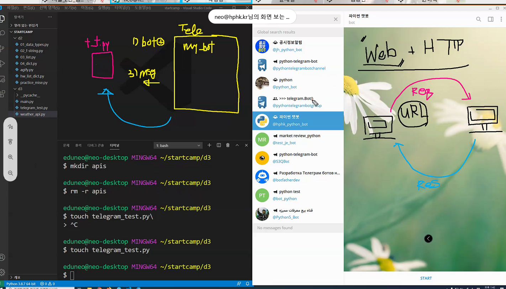

- 로또

  ```python
  
  import requests
  import random
  
  bot_token = '1589976345:AAE6DFnCA0Dc0WXkUG0Bb3sbOunuR3DuZ-o'
  me = '1508129982'
  ###############
  lucky_numbers = random.sample(range(1, 46), 6)
  
  ###############
  message = lucky_numbers
  
  message_url = f'https://api.telegram.org/bot{bot_token}/sendMessage?chat_id={me}&text={message}'
  
  response = requests.get(message_url).json()  # json지워도됨
  # print(response)
  ```

  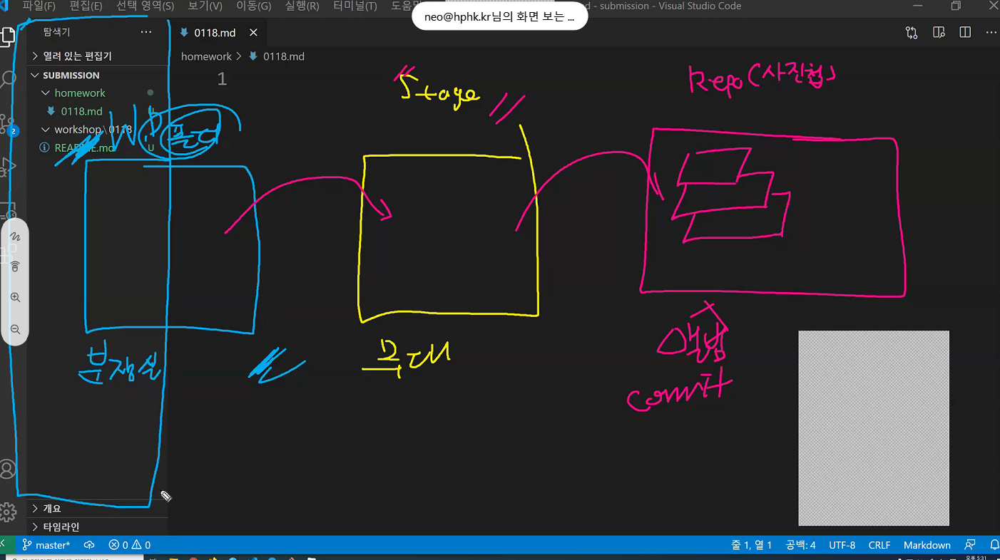

- 명령어

  - `add`로 stage에 올림

    ```python
    git add README.md
    ```

  - `commit`으로 Repo에 올림

    ```python
    git commit -m 'First Commit'
    ```

  - git log

    ```python
    git log
    commit 0a7baeb18dcc9e574fe88684cebf0717a1e3db0e (HEAD -> master)
    Author: edgar <edkim3275@gmail.com>
    Date:   Fri Jan 15 17:35:52 2021 +0900
    
        First Commit
    ```

  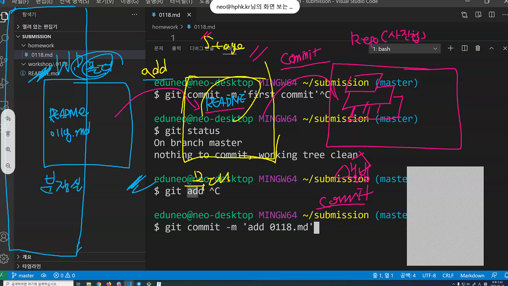

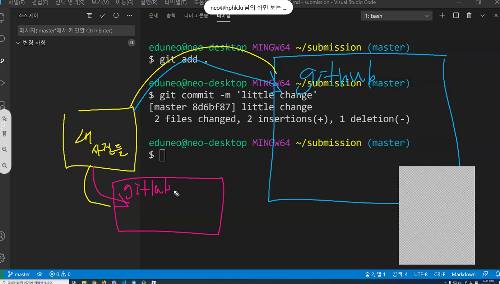

연결한다, 밀어서 보낸다

- API

  - 내 컴퓨터 밖에있는(네트워크세상)기능, 정보를 받아오는 일들을 위해서 API를 사용한다.

  - 예를들어 https://www.metaweather.com/api/ 여기에 location search

    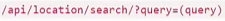

    location/searh/?query=(query)를 붙이면? 아무것도 나오지않는다.

    (query)자리에 원하는 위치(seoul, busan, pyongyang...)를 입력하면 원하는 위치의 정보가 나온다.

    woeid를 저장 후

    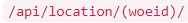

    를 추가하면? 원하는 위치의 날씨 정보확인이 가능하다.

- 사용링크
  - https://www.metaweather.com/
  - https://core.telegram.org/bots/api
- input() 안에 '도시명을 영어로 입력하세요:'
  - 핵심 로직은 그대로입니다. (도시명을 바탕으로 온도를 섭씨와 화씨로 가져온다는 로직)
  - 이렇게 요약되는 핵심에 해당하는것을 '핵심 비즈니스 로직'이라고한다.
  - '도시명을 영어로 입력하세요:'는 핵심 로직이라고 할 순 없지만, 정말 작은 변화로 아주 큰 UX(User Experience)를 변화시킨 사례
  - 이러한 작은 문장 하나로 sw를 쓰게 만들 수 있을지 없을지가 정해진다.
  - 기본적으로 '남(사용자 / 나와 일하는 사람)'을 생각해야한다.
  - 무엇보다도 내가 다음번에 이 코드를 보았을때 이해할 수있는지가 중요

- ```python
  for weather_info in weather_infos:
      weatehr_info['the_temp']
  ```

  - 결과가 바뀌지 않았지만 과정이 바뀌었다? '리팩토링'이라고한다.
  - 코드를 다 짜고 원하는 결과를 받아라. 그리고 리팩토링해라. (주석, 모듈화, 구조화, 간결하게)

- 쿼리(query)

  - 요청문(질의문)
  - 요청할 때 내가 넣는 데이터들
  - url에 내가 요청하고 싶어서 넣는 데이터들

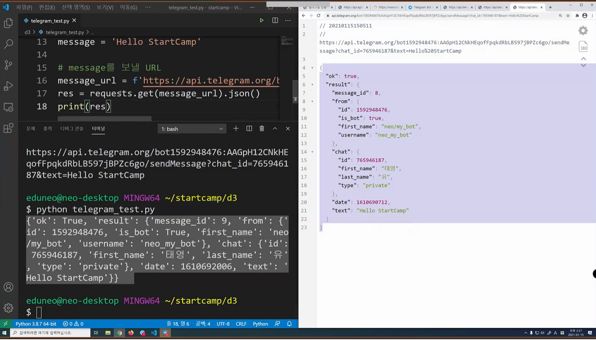

**클라이언트 프로그램 : requests결과(좌)와 브라우저 결과(우)**

- hw은 기본적으로 .md

- 폴더는 기본적으로 아무 기능이없다. 말그대로 파일철의 기능

- 깃은 폴더를 관리한다.

  ```python
  git init
  # 초기화 한것 => repositery(리포)가 된 것
  # 홈(~)에서는 git init하지않는다.
  ```

- **홈을 리포로 만들면 절대로 하면안된다.**

  ```python
  git config --global user.name
  git config --global user.name 'edgar'
  git config --global user.email
  git config --global user.email 'edkim3275@gmail.com'
  ```

- 폴더(분장실) - stage(무대) - Repo(사진첩,앨범)

- stage로 올리는 명령어 `add`

  ```python
  git add README.md
  # README.md파일이 스테이징된 변경 사항부분에 올라간다.
  git add homework/0118.md
  # homework폴더안의 0118.md파일을 add한다.
  ```

- stage에있는 것을 사진첩에 올리는 명령어 `commit`

  ```python
  git commit -m 'First Commit'
  # 스테이지 전체를 사진으로 찍는 행위임
  # 어디에서 언제 했는지 '메시지'를 적어야한다. 따라서 옵션 -m을 준다.
  git log
  # 확인 가능
  # 커밋들의 사진첩이라고 생각하면 됨
  git commit -m 'add 0118.md'
  ```

- 현재상황 확인 `status`

  ```python
  git status
  # 현재상황확인하는 명령어
  # nothing to commit나오면 ok
  ```

- 터미널이 망가진 것 같으면 `q`누르면 된다.

- 한번에 stage로 다 올릴때는?

  ```python
  git add README.md homework/0118.md
  # 이렇게 다 써야하나? 아니다
  git add .
  # submission기준으로 안에있는 것 전부를 스테이지로 올린다.
  # 커밋에서는 -a
  git commit -m 'little change'
  ```

- push란?
  - 내 사진첩을 멀리있는 github과 연결할건데 
  - step1. 연결한다.
  - step2. 밀어서 보낸다.
  
- 앞으로의 과정

  - python web web framework(django) database javascript vue.js
  - 개념에 대한 이해와 프로그래밍 노력

- `pip`란

  - python 패키지 관리하는 하나의 프로그램

- ```python
  jupyter notebook
  ```

- vs code에선 python 파일명.py는 실행되는 결과가 나오게됨
- 한줄한줄씩 실행결과를 보면서 진행할 수 있는것은 REPL이라는 환경인데 거기서 가장 대표적인것이 'Jupyter notebook'
- `b`는 below의 약자. 아래에 셀을 하나 추가
- `ctrl + enter` 실행
- `a`는 above의 약자 위에 셀을 하나 추가
- `m`누르면 마크다운 문법으로 사용가능
- `h`help 약자로 누르면 단축키 확인
- i의 대문자 I L의 소문자 l 파이프 | 구분어렵고, 숫자 0 알파벳 소문자 o 대문자 O 구분어렵다
  
  - 방법은? D2 coding -> 설정 - 모양 - 글꼴맞춤설정 - 고정폭글꼴에서 글꼴을 변경
- 스타일 가이드 PEP-8
  - 스타일 약속.
  - 참고 https://www.python.org/dev/peps/pep-0008/#introduction
- 활용 학습 처음이 동시시작하다보니 처음에 간극이 심하니 중간중간 잘 따라가자.

- 주석
  
- 어떠한 작업도 실행하지 않는다
  
- 코드라인

  - 1줄에 1문장

  - 한줄 한줄 코드를 작성한다.

  - 기본적으로` ;`를 작성하지 않는다.

    ```python
    lunch = [
        '짜장면', '짬뽕', '탕수육,'
        '먹을거', '먹을거'
    ]
    #이런식으로 리스트 작성
    ```

- swap(변수 값 바꾸기)

  - 밖에 변수를 하나 더 추가해서 거기에 값을 넣고 옮긴 후 다시 값을 옮긴다.

  ```python
  temp = x
  x = y
  y = temp
  print(x,y)
  
  또는
  
  x = 10
  y = 100
  x, y = y, x
  print(x, y)
  ```

- 식별자(이름)

  - 대문자,소문자,밑줄로 구성

  - 첫글자에 숫자 올 수 없다.

  - 길이에 제한 없다.

  - 대소문자를 구별한다.

  - 사용할 수 없는 키워드

    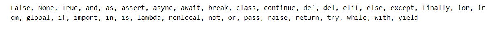

- 암시적 형변환

  - bool
  - numbers에서만 가능

- 명시적 형변환

  - 문자열이 특정, 숫자나 형식을 경우 그 형식으로 가능
  - 모든 내용은 문자열로 표현이 가능하다.
  - float도 명시적으로 int로 표현가능 ex) a = 3.5일때 int(a)는 3

- 단축평가

  - and의 경우 둘 다 true여야만 true
  - or의 경우 둘 중 하나만 true면 true

- 식별자

  - 이름판

- 메모리

  - 작업판

- `if`

  ```python
  if a > 0:
      print('')
  else:
      print('')
  ```

- while 그만할때까지 그만먹어
- for문 하나씩 꺼내서 다먹어. 쿠키 통안에있는 쿠키 다 꺼낸다 통이 list, dict일수도있고 다양한 형태일 수도있다.

- 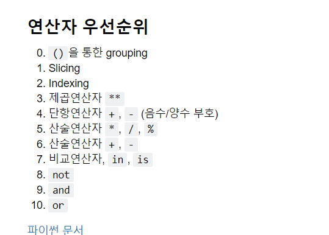

사칙연산 넘어가는 순서가 중요

- 레인지

  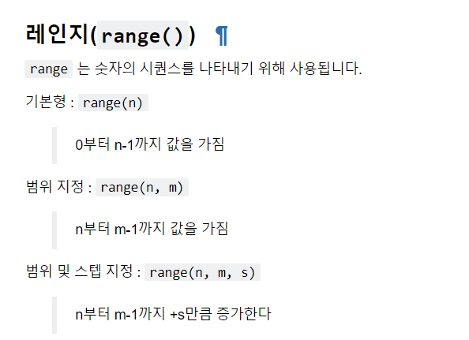

- 연산자

  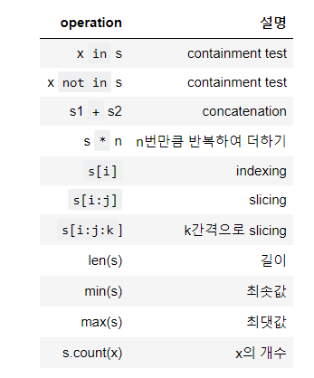
  - indexing이 가능하다? 순서가 가능하다 => sequence
  - slicing s[i:j] i 이상 j미만
  - len(s) min(s) max(s) 함수
  - s.count(x)는 메서드 callable

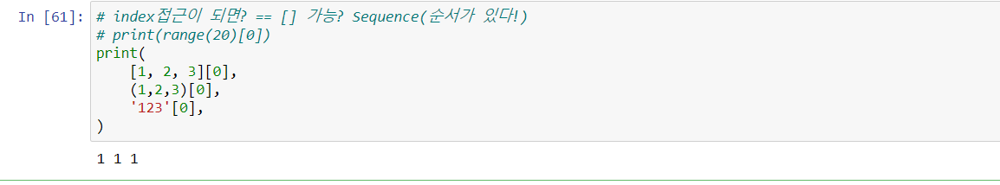

- 외우자
  - 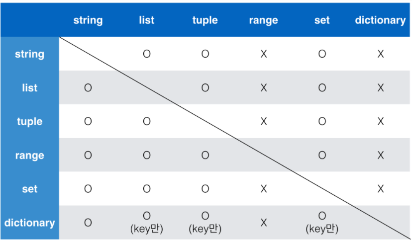
  - range list set 중요

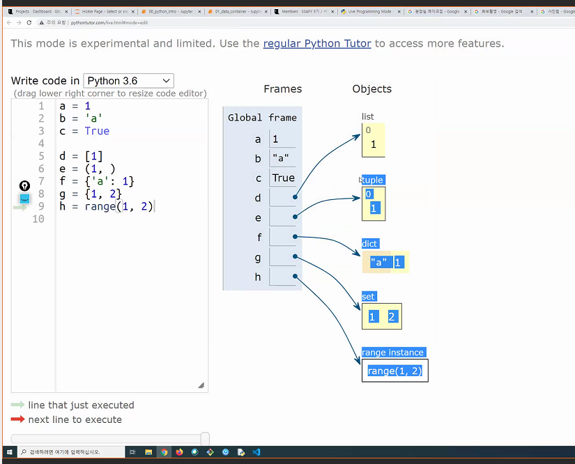

- global이 이름판. 숫자,문자,불리언은 담고있고. 나머지 명사는 '가리킨다'
- 실선박스는 순서보장.

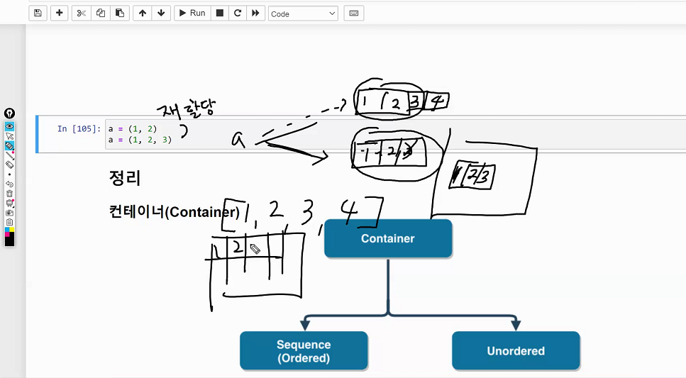

- 깃헙용
  - 저장소 안에서 `git init` 하지않는다.
    - 예를들어 ~/submission/homwork 내에서 하지않는다!
  - `git commit --amend` 커밋 수정, 바꾸는 방법. 굳이 메시지에 연연안해도 된다.
  - `git log` git에 저장된 기록 확인
  - `git add .` 스테이지 위에 올린다.
  - `git commit -m '메시지'` 스테이지 위에 올라간 파일 사진을 찍는다.
  - `git push origin master` 포인트에서 이제 저장을 하는 명령어
  - `git clone http://주소` 
- git bash에서 `$`의 의미. 프롬프트
  - CLI에서 명령을 입력하면 입력을 받을 준비가 되어있다는 의미
  - `$ pip install`이런식으로 써져있으면 터미널에서 `git install`을  적으라는 의미

## 21.01.18

### 주피터

#### 개념

- 파이썬 개발하는 환경(REPL : Read Eval Print Loop)
  - 파이썬 대화형 개발 환경 중 하나
- 셀 단위의 코드 실행으로 바로 결과를 알 수 있다.(즉시 실행이 가능)
- 마크다운 문법을 통해 풍부한 문서화 가능

*추후 알고리즘 수업 및 Django 수업에서 pycharm, vs code의 환경에서 스크립트 파일 단위로 실행 예정


## 알고

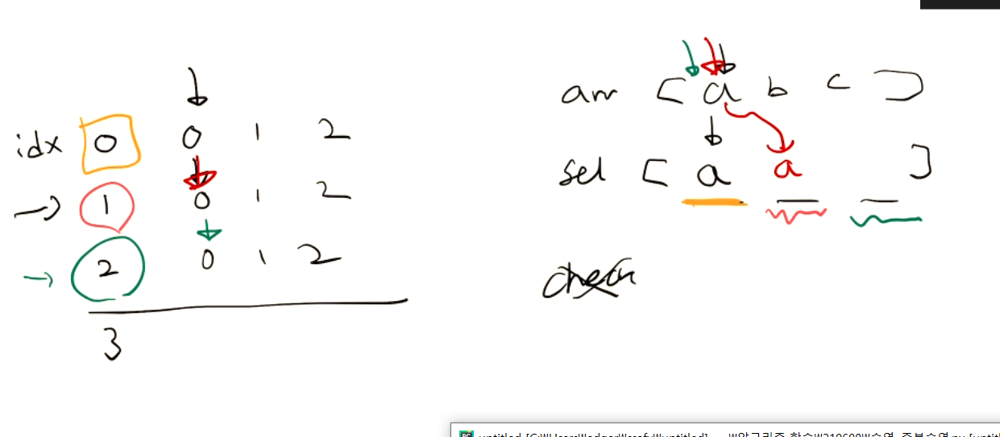