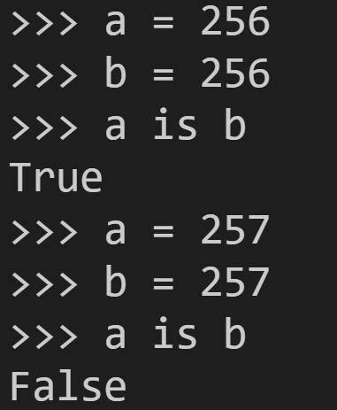

# Questions

1. ```python
   x, y = 1, 2
   type(x, y)
   # TypeError: type() takes 1 or 3 arguments
   ```

2. 

   ```python
   # 출력값이 왜 다른가?
   # -5 ~ 256까지는 같은 id 그 이후에는 다른 id
   # -5에서 256사이의 정수는 언제나 id가 같게나오고 그 범위 밖의 숫자는 같은 숫자라도 id 다르게 나옵니다.
   # 숫자는 문자랑 또 다르게 id 할당이 일어나는데, python 제작자들이 임의로 많이쓰는 숫자는 string처럼(사실 string보다 더 고정적으로) 완전 주소값 고정(메모리 아끼기), 그게 아닌 다른 숫자는 그때그때 메모리 할당으로 설계하였습니다. 그리고 많이쓰는 숫자는 자기들 판단으로 -5 ~ 256 으로 설정했습니다.
   ```

   