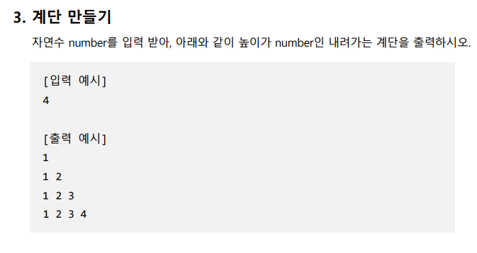

# Practice

1. ### [연습] 함수를 정의하고 값을 반환해봅시다.

   > 리스트 두개를 받아 각각 더한 결과를 비교하여 값이 큰 리스트를 반환하는 함수를 만들어주세요.

   ```python
   my_list_max([10, 3], [5, 9])
   ```

   ---

   ```
   예시 출력)
   [5, 9]
   ```

2. 다음중 오류가 나는 코드는 무엇인가

   ```python
   def func(*args, prof, cnt=5):
       print(prof, args, cnt)
   func('익주', '명준', prof='남호', 7)
   ```

   ```python
   def func(*args, prof, cnt=5):
       print(prof, args, cnt)
   func('익주', '명준', prof='남호')
   ```

   ```python
   def func(*args, prof, cnt=5):
       print(prof, args, cnt)
   func('익주', '명준', prof='남호', cnt=7)
   ```

3. 전체 정수 범위에서 최소값, 최대값 구하기

   ```python
   num_max(-1, -2, -4, 5, 7, 8, 516, 159, -65, -99, -74)
   num_min(-1, -2, -4, 5, 7, 8, 516, 159, -65, -99, -74)
   ```

   ```python
   출력예시
   516
   -99
   ```

4. 

