# Git 정리

## 1. 개념정리

- 폴더(분장실) - Stage(무대) - Repo(사진첩, 앨범)

## 2. 명령어

| 명령어                         | 의미                                     | 비고                      |
| ------------------------------ | ---------------------------------------- | ------------------------- |
| `git init`                     | `.git`폴더 생성. `REPO`로 만들어 준다.   | repositery의 준말         |
| `touch .gitignore`             | git에 업로드 하고싶지 않은 파일          | gitignore.io 참고         |
| `git add README.md`            | `add`로 파일을 stage 위에 올림           | add 시점의  파일만 업로드 |
| `git add .`                    | 수정된 모든 파일을 stage에 올림          | `.`은 모든 파일을 지칭    |
| `git restore --staged <file>`  | stage에 올린 내용 다시 내림              |                           |
| `git commit -m 'msg'`          | 스테이지 위에 올린파일을 **촬영**        | 커밋후 stage는 초기화     |
| `git remote add origin<email>` | 커밋하고 싶은 위치 **지정**(내 깃헙주소) | 최초 한번만 지정          |
| `git push origin master`       | 지정한 깃에 사진을 `push`!               | 비로소 업로드가 됨        |
|                                |                                          |                           |
| `git log`                      | 커밋 기록확인                            | 커밋들의 사진첩           |
| `git status`                   | 현재상황을 확인                          |                           |
| `git reset h`                  | 도움말이 나옴(?)                         | help 줄임말               |
| `git reset 8f259....`          | 사진 찍은것을 지우고 분장실로            |                           |
| `git reset --soft 8f259...`    | 사진을 지우고 stage로                    |                           |
| `git reset --hard 8f259...`    | 아예 과거로 돌아가는것(?)                | 이거 위험위험 조심        |
|                                |                                          |                           |
| `git branch <branch-name>`     | 가지치기                                 |                           |
| `git branch -d <branch-name>`  | 가지삭제                                 |                           |
| `git switch <branch-name>`     | branch된 곳에 점찍기                     |                           |
| `git switch -c <branch-name>`  | 가지치고 점찍기                          | 생성, 전환 한번에 가능    |
| `git merge <branch-name>`      | 커밋 병합                                | master에서만 할 것        |
| `git reflog`                   | 간단한 커밋 기록(?)                      |                           |

- 커밋 전의 `git status`  => 파일명이 붉은색으로 보입니다. 

  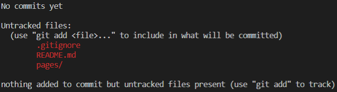

  커밋 후의 `git status` => 파일명이 초록색으로 보입니다.

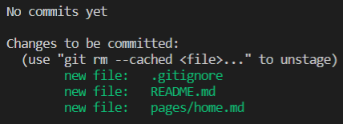

- `git log`를 하게되면

  ```python
  git log
  # 해당 커밋에 부여되는 주소(?)
  commit 0a7baeb18dcc9e574fe88684cebf0717a1e3db0e (HEAD -> master)
  # 커밋하는 사람이 누군지
  Author: edgar <edkim3275@gmail.com>
  # 커밋하는 날짜
  Date:   Fri Jan 15 17:35:52 2021 +0900
  	# git commit -m 'msg'에서 'msg'내용
      First Commit
  ```

- `git remote add origin`의 경우

  ```python
  # 이런식으로 주소를 작성해줍니다.
  # $ git remote add originhttps://lab.ssafy.com/aud1132/pjt01.git
  ```

- `git reset ...` 의 경우 요런느낌

  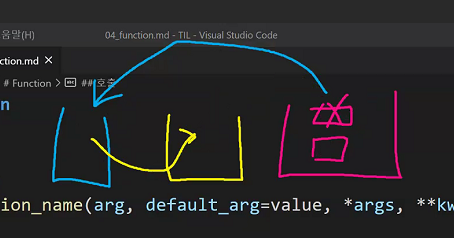

- `git reset --soft ...`의 경우 요런느낌

  

## 3. 주의, 참고사항

- 홈(~)을 `REPO`로 만들면 절대로 안됩니다!

- 터미널 망가진 것 같으면 `q`를 눌러주시면 됩니다. 

  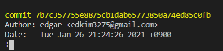

- `git merge <branch-name>` 커밋병합은 HEAD가 master인경우에만 해줍니다.

- merge는 양의 차이가 아니라 시간단위로 누가 마지막에 커밋을 했느냐에 따른다는 것을 유의해야합니다.

  - 예를들어, master에서 branch를 친 후 거기서 `rm *`, `rm -r *`를 쳐서 파일을 다 날려버린 후에 다시 master로 돌아와서 merge를 하게되면 가장 최근 커밋인 부분으로 병합되기때문에 파일이 다 날아갑니다.

## 4. Git 상황 시뮬레이션

> 프로젝트 진행하다가 망할 경우를 대비해서 master에서 branch를 뽑고 진행을 하다가 만약 망하면 가지를 잘라내고 하다가 잘되면 master와 합해준다.
>
> 명령을 따라가면서 상황을 봅시다.
>
> 전체적인 흐름은 **생성 - 전환 - 작업 - 전환 - 병합** 과정으로 생각하자.

### (1) Fast-forward

1. `git branch home-page` : 자 이제 내가 `home-page`라는 이름의 가지를 하나 만들겠습니다.

   `git branch`로 확인해보면

   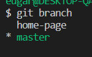

   이러한 상태가 됩니다.

   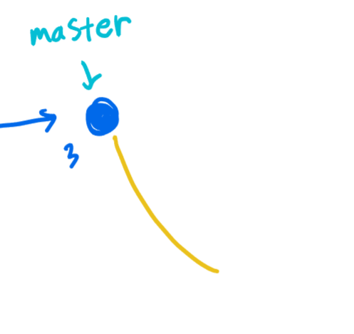

   이처럼 현재 커밋에서 가지를 쳐놓은 상태입니다. 하지만 **아직 점을 찍지는 않았음.**

2. `git switch home-page`: 이제 가지 치고 점을 찍은 것!

   *가치 치고 점찍기 한번에 하고 싶으면 `git switch -c home-page`이렇게 하면 된다.

3. `mkdir pages`, `touch pages/home.md` 등 여러 작업들을 진행하면 이러한 상태가 됩니다.

   

4. `git add .`: stage위에 올리고

5. `git commit -m 'msg'`: 사진을 찍습니다.(커밋) 붉은 체크 부분이 `HEAD`

   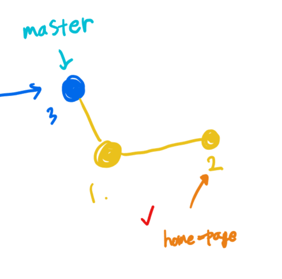

6. `git switch master`: 다시 master로 돌아가보자

   *위 명령어는 `git checkout master`와 동일한 의미입니다.

   

   한번 `git log`해보면

   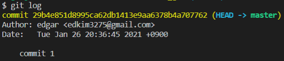

   `HEAD -> master`라는 것을 볼 수 있는데 이는 나의 현재 위치가 master라는 것. 

   앞으로 `HEAD`는 '나'라고 보면 됩니다.

7. `git merge home-page`:이제 이 모든 상황들을 병합해 봅시다. **병합은 반드시 master 상황으로 돌아가서 해야합니다.**

   이 경우, 병합을 했을 때 아래와 같이 병합이될까?? Nope

   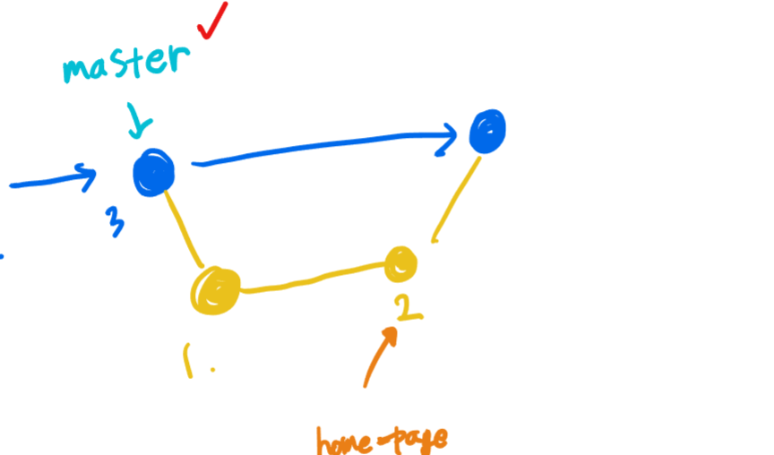

   이 때는 만들어진 branch를 그대로 따라서 갑니다.(aka 꽃길만 걷자)

   

   이처럼 기존 커밋에서 한 개의 branch가 나와서 master와 병합하는 경우를 `Fast-forward`라고 합니다.

   

8. `git branch -d home-page` : 끝난 branch는 삭제(merge되면서 내용이 master에 담겼기때문)

   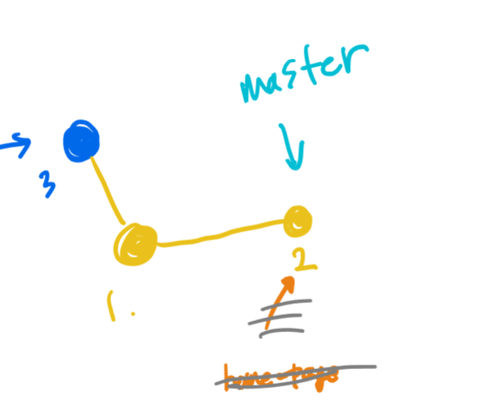

### (2) 'recursive' strategy

> 기존 커밋에서 가지를 치고 난뒤 커밋을하고, 기존 커밋에서도 커밋을 하고 난 뒤에 병합을 하게 된 경우

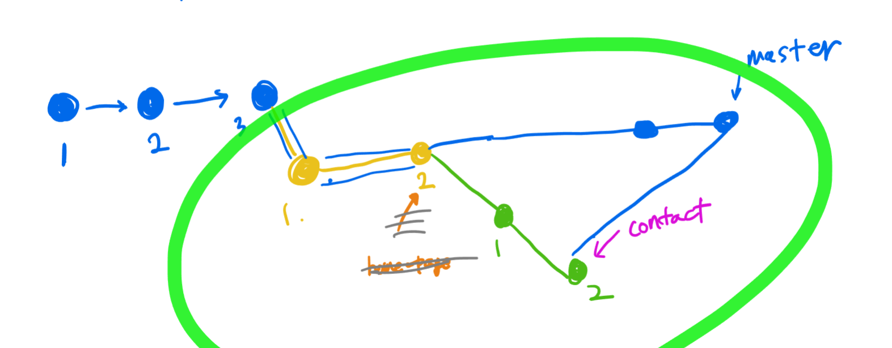

이 처럼 두 갈래 길이 된 경우 Fast-forward와는 다른 경과가 나옵니다.


이 경우는 아래 사진처럼 병합하려는 커밋이 서로 딱 알맞게 포개지기 때문에 auto merge가 일어납니다.

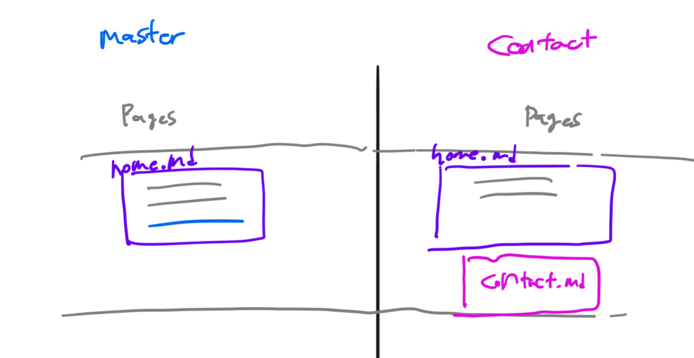

하지만 이런 상황이 아니라면?? 딱 들어맞지 않는다면??

### (3) 꼬이는 상황(Automatic Merge failed)

> auto merge가 되지 않는상황에서의 merge

1. `git branch -c about-page`: `about-page`라는 branch를 만들어 줍니다.

2. `touch pages/home.md` 등 작업을 하고나서 stage위에 올려야 하는데 이번에는 `git add .`이 아니라 각각의 파일을 `add`해봅니다.(그런 상황이 있을 수 있음)

3. `git add pages/home.md` , `git commit -m 'a-p fix h1`

   `git add pages/about.md`, `git commit -m 'a-p 1. add a.md'`로 각각 `add`와 `commit`을 해줍니다.

   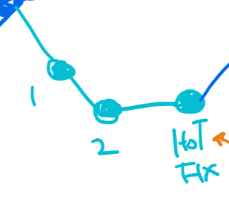

4. `git switch master` 다시 마스터로 돌아와서 일부 수정작업을 해줍니다.(about-page에서 수정한 내용과 충돌이 되도록 복잡하게)

5. `git merge about-page`병합을 해주면 auto merge하는 상황에서 충돌이 발생하여 고쳐서 결과를 커밋해야하는 문구가 나옵니다.

   master|MERGING은 잘못된 것이 아니고 조정을 해야하는것을 말해주는 것

   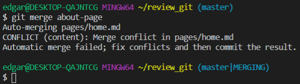

   탐색기를 살펴보면 초록색은 바로 커밋이 가능한 파일, 보라색은 Conflict가 발생하여 살펴봐야하는 파일을 알려줍니다

   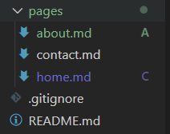

   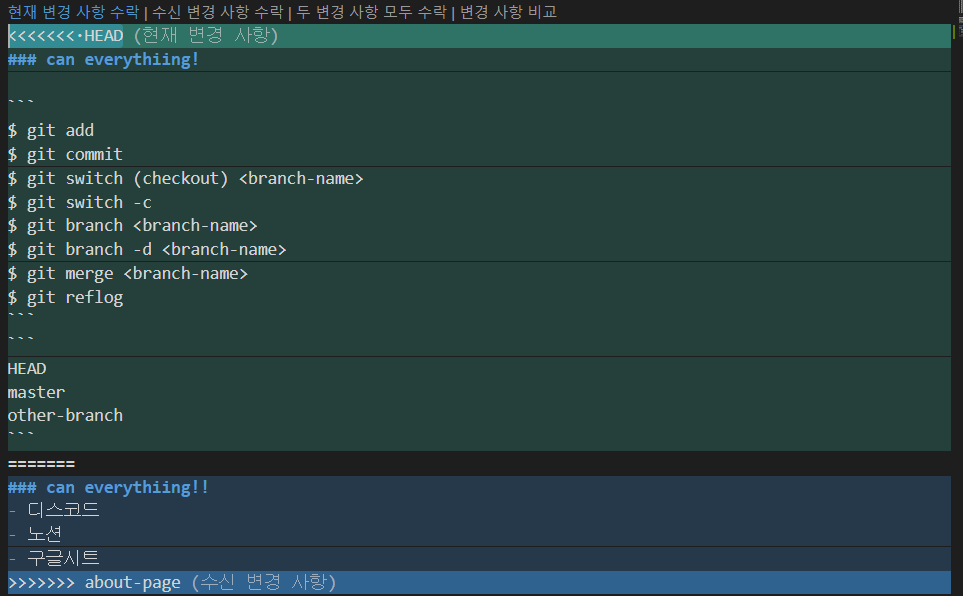

   `<<<<<<< HEAD` :  내가 있는 곳(master)

   `=======`: 구분선

   `>>>>>>>`: master로 들어오고있는 about-page에서 작성한 내용

   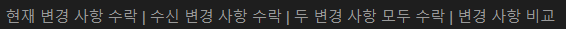

   `현재 변경 사항 수락` : HEAD 초록색 부분만 남는다.(master기준으로 정리) 

   `수신 변경 사항 수락` : master로 들어오는 파란색 부분만 남는다.

   `두 변경 사항 모두 수락` : 둘다 수락

   `변경 사항 비교` : conflict나는 사항 확인가능

6. `git add .`: 스테이지위에 올려줌. **아직 병합된 것은 아님**(커밋이 없으니까!) 약간 커밋 가즈아~~의 느낌

   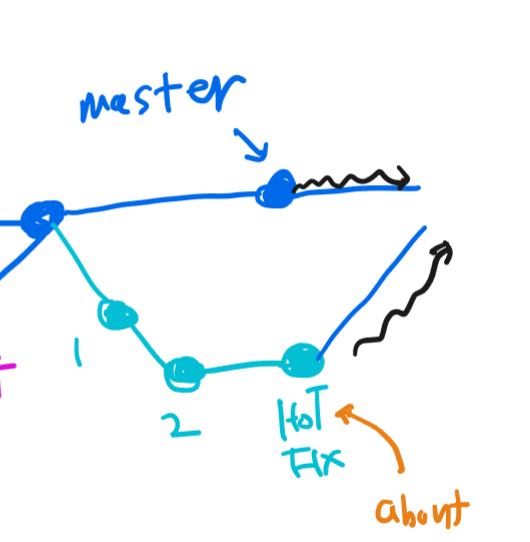

7. `git commit -m 'merge conflict'`:  'merge conflict가 나서 병합하는거야'라는 메시지를 남기고 커밋

### 정리

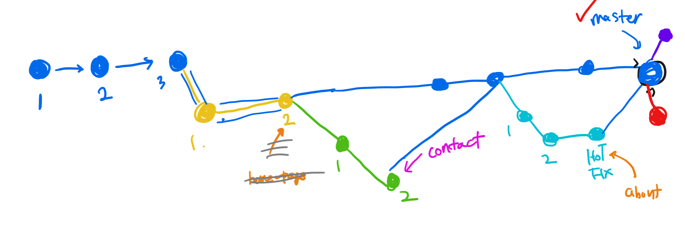

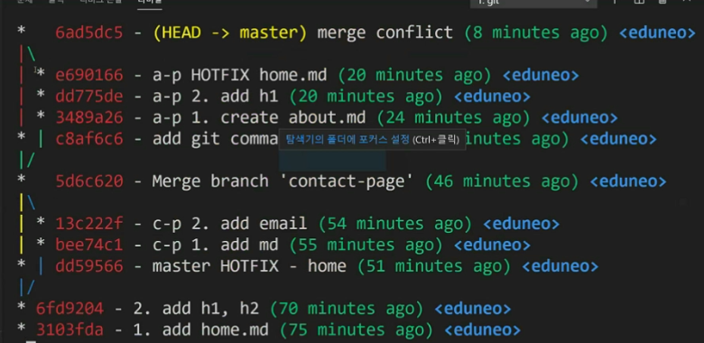

- 3가지 경우를 모두 알아야 하는가? Nope

- 오늘 본 것들은 merge했을때의 상황들

- add - commit - switch - merge

- `git push origin master` : 기타 branch빼고 master만 pusth

  - branch를 push하고 싶다면

    `git push origin home-page`, `git push origin about-page`와 같은 명령어를 쓰면됨

## 5. 오류해결

- `git push origin master`를 할때 다음과 같은 오류가 나왔을때

  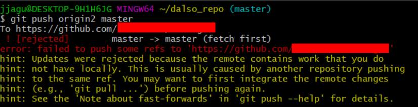

  원인은 깃의 원격 저장소와 현재 로컬 저장소가 동기화 되어있지 않기때문입니다.

  해결방법도 동기화 시켜주면 간단하게 해결됩니다.

  `git pull --rebase master`

  입력하고 난 뒤 다시 push를하면 해결됩니다.