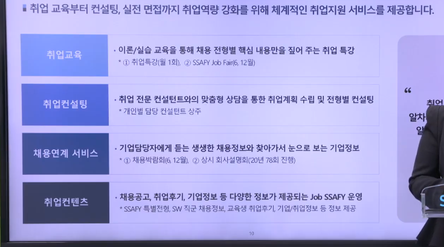
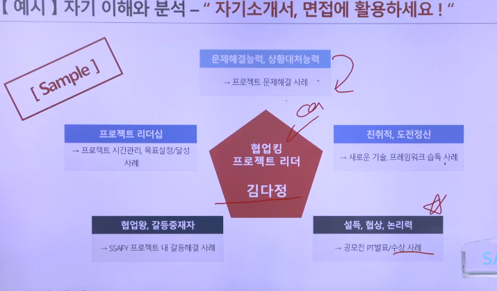
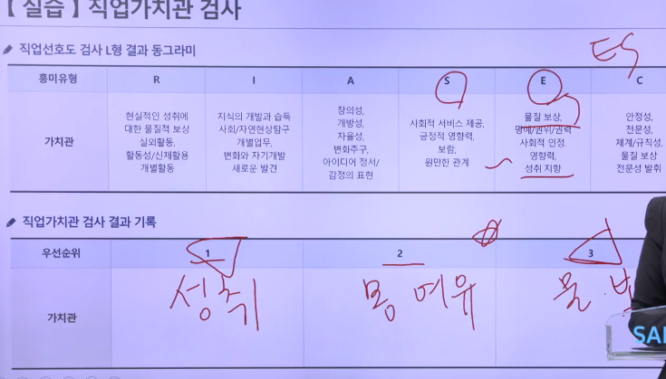
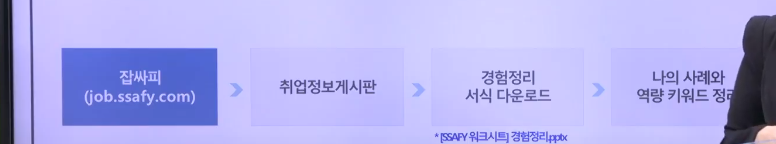

# 취업특강

### 취업교육

> 월별 취업특강 및 Job Fair 프로그램 진행을 통해 취업 경쟁력 강화를 위한 맞춤형 교육 프로그램을 제공

타겟기업 2/17

### 취업컨설팅

> SW진로 목표 수립, 자기소개서 클리닉, 모의면접까지 개인별 맞춤형 취업 상담/컨설팅을 제공합니다.

진로, 적성진단 / 구직활동 계획 / 개인 고충 ... 

### 채용연계 서비스

> 회사설명회, 채용박람회를 통한 현업 채용담당자와의 만남을 제공하여 우수SW기업과의 채용 연계를 지원합니다.

회사설명회 : 기업 현직 담당자에게 듣는 기업 정보

채용박람회 : 50여개 기업 현직자와의 채용면접 및 상담을 통해 취업 기회를 제공

### 취업 컨텐츠

> 채용공고

채용공고 : **SSAFY** 특별전형 ex) 신세계인터내셔날, 씨젠(제약 바이오회사)

알짜기업 정보

취업성공후기

## 직업검사

직업 선호도 검사(L형) / 직업 가치관 검사 / 구직 준비도 검사

### 직업선호도검사

- 주의사항 : 사람들은 각기 다른 흥미경향을 가지고 있음. 
- 잡싸피 취업정보게시판 코드조합결과를 올려놓은신걸 참고하면 됩니다!
- 캠핑여행 역할
  - 텐트설치 용품셋팅(R)
  - 여행지 정보 탐색(I)
  - 여행의 재미를 더하기 위한 (A)
  - 친구들과 약속, 갈등해결(S)
  - 계획수립, 실행력(E)
  - 여행 예산관리, 경비정리(C)
- 흥미코드 사례
- 

1. **흥미검사**
   - 크게 연연할 필요는 없습니다
   - A라는 흥미를 가지고있는 사람이 A라는 흥미를 필요로 하는 직군에서 일을하게 된다면?
   - 현실형(Realistic)
     - 활동적, 실물적인 일
     - 즐기는 일: 결과를 가시적으로 확인할 수 있는 일 / 분명하고, 구체적이며 신체적 활동을 수박하는 일
     - 어려운 일: 추상적 개념을 이해하는 일 / 애매한 문제를 해결하는 일 / 생각이나 감정을 말로 표현하는 일 / 친밀한 대인관계를 요구하는 일
     - 투박하고 진솔한 사람
   - 탐구형(Investigative)
     - 관찰하고 탐구하며 사고하는 일을 좋아함
     - 현상을 비판적이고 분석적으로 관찰
     - 즐기는 일: 새로운 지식이나 이론을 다루는 학문활동 / 독립적으로 수행 / 자료를 수집하고 조직화하는 일 / 자율적인 업무방식 또는 환경
     - 어려운 일: 단순하며, 반복적인 일 / 다양한 사람을 만나는 활동 / 다른 사람을 지휘하고 통솔하는 관리자 역할 / 규율이나 체계가 정해진 업무방식 또는 그런 환경
   - 예술형(Artistic)
     - 즐기는 일: 창의성을 발휘하는 일 / 자기자신을 새로운 방법으로 표현하는 일 / 자신의 개성을 새롭게 표현 / 심미적으로 가치있는 일(fornt end) / 비구조적인 상황에서 독립적으로 하는 일
     - 어려운 일: 구조화된 환경엥서 활동하는 일 / 자기표현의 자율성을 통제 받는 일 / 엄격한 규제와 규범이 있는 일
   - 사회형(Social)
     - 사람들과 교류하고 협력하는 일, 도와주고 공감하고 
     - 즐기는 일: 타인을 성장시키는데 도움을 주는 일, 무언가를 설명하고 가르치는 일, 사람들의 관심의 대상이 되는 일, 타인과 상호작용을 통해 문제를 해결하는 일, 협력적이고 친밀한 분위기의 업무환경
     - 어려운 일: 논리적이고 분석적인 활동, 사물만을 대상으로 하는 일, 기계를 작동시키는 일, 경쟁적인 분위기, 규율이나 체계가 쫙 짜인 업무환경
     - SE : 비영리적인 조건에서 일하는 것을 좋아함, 경쟁을 싫어하고 기부 활동을 선호, 사람들을 관리 감독하는 일보다 사람들을 돕는 활동을 선호
   - 진취형(Enterprising)
     - 도전, 성취
     - 즐기는 일: 조직의 목표달성, 경제적 성취 / 타인에게 영향력을 행상 / 판매, 경영, 설득 / 위험을 감수하고 기회에 도전하는 일
     - 어려운 일: 지적인 노력을 장시간 요구하는 일 / 사람들 간의 소통이 적은 일
   - 관습형(Conventional)
     - 조직적, 안정적, 체계적인 일을 좋아함
     - 즐기는 일: 정확성과 세밀함 / 숫자, 데이터 등의 정보를 다루는 일 / 기록, 분류, 보고, 보관하는 일
     - 어려운 일: 대인 접촉이 많고 정서적인 교류가 필요한 일 / 비구조화된 상황에서의 일 / 창의성이 요구되는 일
2. 성격검사
3. 생활사검사

- 정리해보면(다적기, 최대한 많은 키워드를 적기)
  - E :
  - S :
  - 개발직군에서의 강점 :
  - 보완계획 : 
  - 

