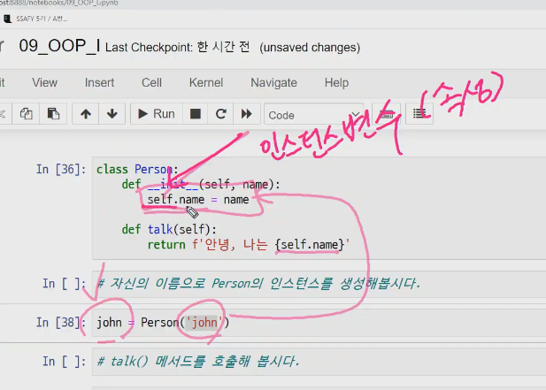

# OOP1

## 1. 객체(Object)

### 1.1 타입(Type)과 인스턴스(Instance)

| type(class) | instance                 |
| ----------- | ------------------------ |
| `int`       | `0`, `1`, `2`            |
| `str`       | `''`, `'hello'`, `'123'` |
| `list`      | `[]`, `['a', 'b']`       |
| `dict`      | `{}`, `{'key': 'value'}` |


#### 1.1.1 타입(Type)

>공통된 속성(attribute)과 조작법(method)을 가진 객체들의 분류

#### 1.1.2 인스턴스(instance)

> 특정 타입(type)의 실제 데이터 예시(instance)이다.
>
> 파이썬에서 모든 것은 객체이고, 모든 객체는 특정 타입의 인스턴스이다.

```python
a = 10  # a는 int type의 instance
type(a)  #=> int
print(type(a))  #=> <class 'int'>
```

- type을 검사하는 3가지 방법

  ```python
  type(a) is int
  type(a) == int
  isinstance(a, int)  # a라는 것이 int의 instance 입니까?
  ```

### 1.2 속성(attribute)과 메서드(Method)

> 객체의 **속성(상태, 데이터)**과 **메서드(함수) **구분하기

| type      | attributes       | methods                                |
| --------- | ---------------- | -------------------------------------- |
| `complex` | `.real`, `.imag` |                                        |
| `str`     | -                | `.capitalize()`, `.join()`, `.split()` |
| `list`    | -                | `.append()`, `.reverse()`, `.sort()`   |
| `dict`    | -                | `.keys()`, `.values()`, `.items()`     |

#### 1.2.1 속성(attribute)

- 속성은 객체의 **상태/데이터**를 뜻한다.

- 활용법

  ```python
  <객체>.<속성>
  ```

  ```python
  # 복소수 예시를보면
  complex_number = 3+4j
  type(complex_number)  #=> complex
  complex_number.real  #=> 3
  complex_number.imag  #=> 4
  ```

#### 1.2.2 메서드(Method)

- 특정 객체에 적용할 수 있는 **행위(behavior)**를 뜻한다.

- 활용법

  ```python
  <객체>.<조작법>()
  ```

  ```python
  a = [3, 2, 1]
  type(a)  #=> list
  a.sort()
  a  #=> [1, 2, 3] 원본 데이터 변형
  ```

## 2. 객체 지향 프로그래밍(Object Oriented Programming)

>Object가 중심(Oriented)이 되는 프로그래밍

### 2.1 절차 중심 vs. Object 중심

> 프로그래밍의 패러다임 어떻게 프로그램을 작성할 것인가?

```python
# 기존의 절차 지향 프로그래밍은 이런 느낌의 코딩이었다.
a = 1
def f():
    pass
f(1)
# 얘네들은 공공재의 느낌인데
# 보통 무언가는 무언가의 소유이기 마련이다. 이러한 코드들도 무언가의 소유로 만들자!
# 기존의 코딩의 '현실세계에 대한 반영'의 문제때문에 기저에 대한 고민
# 현실세계를 표현할 방법이없을까 때문에 나오게 됨
```

### 2.2 Object 중심의 장점

> 객체 지향 프로그래밍은 프로그램을 유연하고 변경이 용이하게 만들기 때문에 대규모 SW개발에 많이 사용된다. 또한 프로그래밍을 더 배우기 쉽게 하고 SW 개발과 보수를 간편하게 하며, 보다 직관적인 코드 분석을 가능하게 하는 장점을 갖고 있다.

- 코드의 직관성
- 활용의 용이성
- 변경의 유연성

## 3. 클래스(Class)와 객체(Object)

> `type` : 공통 속성을 가진 객체들의 분류(class)

> `class` : 객체들의 분류(class)를 정의할 때 쓰이는 키워드

### 3.1 클래스(Class) 생성

- 클래스의 생성은 `class ` 키워드와 정의하고자 하는 `<클래스의 이름>` 으로 가능하다.
- `<클래스의 이름>`은 `PascalCase`로 정의한다.
- 클래스 내부에는 데이터와 함수를 정의할 수 있고, 이때 **데이터는 속성(attribute)**, **정의된 함수는 메서드(method)**로 불린다.
- 클래스의 주 목적은 인스턴스의 생성

- 활용법

  ```python
  class <클래스 이름>:
      <statement>
      
  class ClassName:
      statement
  ```

  ```python
  # 클래스의 타입은 타입
  type(ClassName)  #=> type
  type(int)  #=> type
  type(str)  #=> type
  print(type(ClassName))  #=> <class 'type'>
  ```

### 3.2 인스턴스(Instance) 생성

- 정의된 클래스에 속하는 객체를 해당 클래스의 인스턴스(instance)라고 한다.
- `Person` 클래스의 인스턴스는 `Person()`을 호출함으로써 생성된다.

- 활용법

  ```python
  person1 = Person()
  #instance = class()
  ```

  `person1`은 사용자가 정의한 `Person`이라는 데이터 타임(data type)의 인스턴스이다.

  ```python
  type(person1)  #=> __main__.Person
  ```

### 3.3 메서드(Method) 정의

> 특정 데이터 타입(또는 클래스)의 객체에 공통적으로 적용 가능한 행위(behaviore)들을 의미한다.

- 클래스에게 어떠한 로직을 지시하기 위함

- 활용법

  ```python
  class Person:
      def talk(self):  # 절차 지향 프로그래밍과의 차이점은 이 함수 같은 경우에는 Person
          			 # 객체에 소속되어있는 객체들만 사용이 가능하다.
              		 # 그걸 가능하게 해주는 것이 바로 'self'
          print('안녕')
  ```

  `self` : 함수를 호출 할때(인스턴스의 메서드를 호출하면) 파이썬이 내부적으로 인스턴스 자신이 전달되도록 설계되어있다.

  

#### 3.3.1 `self`

> 인스턴스 자신(self)


- Python에서 인스턴스 메서드는 호출 시 첫번째 인자로 인스턴스 자신이 전달되계 설계되었다.

- 보통 매개변수명으로 `self`를 첫번째 인자로 설정

  ```python
  class Elf:
      def __init__(self, name):  # 처음 태어났을때 받는 특성
          self.ear = 'long'  # 공통의 특성
          self.name = name
          
      def bow(self):  # Elf에 소속되어있는 bow라는 class
          print('=arrow=>')
          
      def __del__(self):  # 죽음 __붙어있는 애들은 이름.del이 아니라 del 이름 방식으로
          				# 작동한다. 이들을 '매직메서드'라고 부른다.
          print('back to tree..')
          
  e1 = Elf('legolas')  # Elf에 소속되어있는 legolas라는 엘프가 만들어짐
  e1.bow()  # 객체의 행동
  e1.health = 'good'  # 각 개체들의 속성(인스턴스 속성)
  e1 = 1  # legolas가 죽음. el이 1이 된 순간 더이상 legolas에게 접근할 수 없다.
  ```

#### 3.3.2 생성자(constructor) 메서드

> 인스턴스 객체가 생성될 때 호출되는 함수

- 활용법

  ```python
  def __init__(self):
      print('생성될 때 자동으로 호출되는 메서드입니다.')
      # __init__()은 None을 return해야만 합니다.
  ```

  생성자를 사용하면 인스턴스가 생성될 때 인스턴스의 속성을 정의할 수 있다.
  
  인스턴스 변수를 정의 / 할당
  
  `self`가 인스턴스 자기 자신을 의미한다

#### 3.3.3 소멸자(destructor) 메서드

> 인스턴스 객체가 소멸(파괴)되기 직전에 호출되는 함수

- 활용법

  ```python
  def __del__(self):
      print('소멸될 때 자동으로 호출되는 메서드입니다.')
      
  del hong  #=> 소멸될 때 자동으로 호출되는 메서드입니다.
  ```

### 3.4 속성(attribute) 정의

> 특정 데이터 타입(또는 클래스)의 객체들이 가지게 될 상태/데이터를 의미한다.

- 속성은 어떠한 변수의 값이라고 생각하면 됩니다.

- 활용법

  ```python
  class Person:
      def __init__(self, name):
          self.name = name
          
      def talk(self):
          print(f'안녕, 나는 {self.name})
  ```

### 3.5 매직메서드

> 더블언더스코어(`__`)가 있는 메서드는 특별한 일을 하기 위해 만들어진 메서드이기 때문에 `스페셜 메서드` 혹은 `매직 메서드`라고 불립니다.

```python
class Person:
    def __init__(self, name):
        self.name = name
iu = Person('iu')
print(iu)  #=> <__main__.Person object at 0x00000272BF8DB700>

# 이와 비슷했던 경우
print(map(int, ['1']))  #=> <map object at 0x00000272BF904190>

print(['1'])  #=> ['1']
print(range(0, 5))  #=> range(0, 5)
# 이렇게 다른식으로 보이는 이유는 각각의 클래스에 정의된 매직 메서드가 하는 일입니다. 
```

