# Web

## 1 개요

### 1.1 개발환경설정

- text editor

- chrome 개발자 도구

  

  **`Ctrl + Shift + i` **또는 **`마우스 우측 + 검사`** 또는**`F12`** 로 확인 가능합니다.

- 확장프로그램

  

- 참고
  - 구글에 `mdn` 검색
  - 예를들어 html a  tag에 대해서 잘 모르겠다면?? 검색창에 html a tag mdn 이런식으로 검색하면 mdn문서가 가장 최상단에 위치

### 1.2 웹? 왜?

- **웹 어플리케이션 개발**을 통해 **SW개발 방법 및 학습** 과정을 익히기 위해서

- 지금은 찍먹하는 중입니다. 최종적으로 사용자가 받아볼 결과물을 미리 맛보는 것.

- 현재 웹 표준

  

  기존에는 W3C에서 승인해줬지만 오늘날의 웹 표준은 WHARWG!


## 2 HTML

> Hyper Text Markup Language
>
> 웹 페이지가 어떻게 구조화되어 있는지 알 수 있도록 하는 마크업 언어

### 2.1 HTML?

- Hyper Text라는 말이 사실 건방진 말입니다. '초'라는 말이 붙었다는것이 정말 굉장해 엄청나라는 것인데 그당시 뭐가 그렇게 대단했길래 이름이 이렇게 붙여진걸까

  

  이것때문에 Hyper라는 이름이 붙은 것

  우리가 옛날에 접했던 글, 문서는 모두 '책'이었습니다. 책은 무조건 다음페이지의 개념입니다. 이것이 강제되어있습니다. 그런데 이 **링크 한줄**로 인해서 책의 내용 내용 저책으로 이리저리 **점프**가 가능해진 것이 정말 혁명적이었던 것입니다. 이것이 바로 울트라 굉장해 캡숑 엄청나 text가 된 것입니다.

- Hyper Text란 기존의 선형적인 텍스트가 아닌 **비 선형적으로 이루어진 텍스트**를 의미하며, 이는 인터넷의 등장과 함께 대두되었다. 기본적으로 Hyper Link를 통해 텍스트를 이동한다.

- 우리가 아는 문서는 하나하나 넘겼어야만 했다. 하지만 Hyper Text는 한 문장에서 다른 문서, 문장으로 자유롭게 드나들 수 있게했습니다. 이 기능 중 중요한 것이 HTML http

  

- 단순 텍스트 구조에 구조와 의미를 더해주는 것이 마크업
  - 태그 등을 이용하여 문서나 데이터의 구조를 명시하는 언어
  - 프로그래밍 언어와는 다르게 단순하게 데이터를 표현하기만 한다.
  - 대표적인 예 : HTML, Markdown
  
- 웹 페이지를 작성하기 위한(구조를 잡기 위한)언어. 웹 컨텐츠의 의미와 구조를 정의하는데 이때 사용하는 언어가 바로 HTML

- 파일 확장자 명은 `.html`

- html은 문서입니다. 프로그래밍 언어는 아닙니다.(조건, 반복, 저장 불가)

### 2.2 HTML 기본구조

#### 2.2.1 기본구조


- **html요소** : 열리는 태그와 닫히는 태그로 가장 큰 범주를 형성(최상위 요소, root(근본)라고도 한다.)

- 내부는 **head요소**와, **body요소**로 나뉜다. 

- 태그는 대문자도 가능은하나 그렇게 하지 않습니다.

- head요소 : 브라우저에 나타나지 않는다.

  

- body요소 : 브라우저 화면에 나타나는 정보

  

```html
<!DOCTYPE html>  # html이라는 선언
<html lang="en">  # 한국어면 "ko", 웹페이지 읽어주는 기능이 필요(스크린리더가 음성표현에 사용할 언어를 선택하는데 도움을 주는 속성. 아무런 값도 지정하지 않으면 보통 기본적용된 값으로 되긴하나 지정해줍시다!)
    <head>  # head는 브라우저에 나타나지 않는다.
        <meta charset="UTF-8">  # 전체문서에 대한 문자 인코딩
        <title>Hello, HTML</title>  # 브라우저 탭에 보이는 제목
    </head>
    <body>
        <p>본문</p>
        <h1>첫번째 헤더</h1>
        <a href="https://www.naver.com">네이버로 이동</a> # 링크를 만들어주는<a>태그
    </body>
</html>
```

#### 2.2.2 DOM(Document Object Model) 트리

- 각각의 문서를 객체지향으로 구성을 한다고 생각합시다

- 부모, 자식태그의 연관성이 존재

  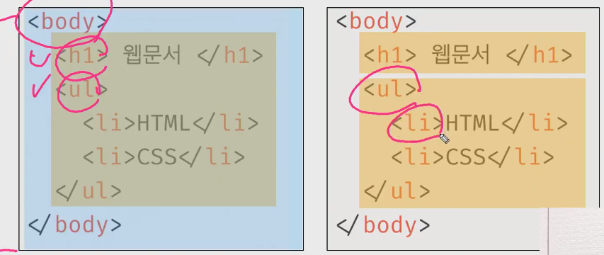

  `<ul>`태그는 `<body>`태그의 자식태그이지만 `<li>`태그의 부모태그이기도 하다!

#### 2.2.3 요소와 속성

- 요소(element) : 태그와 그에 담긴 내용. 단순한 텍스트에 의미를 부여하는 것이 바로 **태그**

  

| 태그                            | 기능                                                         | 비고                            |
| ------------------------------- | ------------------------------------------------------------ | ------------------------------- |
| > **그룹 컨텐츠**               |                                                              |                                 |
| `<p>`                           | paragraph                                                    |                                 |
| `<hr>`                          | horizontal                                                   |                                 |
| `<ol>`, `<ul>`                  | ordered/unordered lsit                                       |                                 |
| `<pre>`, `<blockquote>`         |                                                              |                                 |
| `<div>`                         |                                                              |                                 |
|                                 |                                                              |                                 |
| > **텍스트 관련 요소**          |                                                              |                                 |
| `<a>`                           | 링크                                                         |                                 |
| `<b>` vs `<strong>`             | `b` 단순 굵게, `strong`굵게 + 의미                           |                                 |
| `<i>` vs `<em>`                 | `i` 단순 기울기, `em` 기울기 + 의미                          |                                 |
| `<span>`, `<br>`, ``       | `span`인라인 요소, `br` 줄바뀜, `img` 이미지                 |                                 |
|                                 |                                                              |                                 |
| > **table**                     |                                                              |                                 |
| `<tr>`, `<td>`, `<th>'`         | `tr` 행, `td` 내용이 들어가는 셀, `th` 열의 제목이 들어가는 셀 |                                 |
| `<thead>`, `<tbody>`, `<tfoot>` | -                                                            |                                 |
| `<caption>`                     | -                                                            |                                 |
| `<colspan>`, `<rowspan>`        | 셀 병합 속성                                                 |                                 |
| `<col>`, `<colgroup>`           | scope 속성                                                   |                                 |
|                                 |                                                              |                                 |
| > **form**                      |                                                              |                                 |
| `<form>`                        | 서버에서 처리될 데이터를 제공                                | 우리가 가장 많이 사용할 태그    |
| `<input>`                       | 사용자 입력을 받는 태그                                      | `form`안에 여러 `input`이 존재. |
| `<label>`                       | 서식 입력 요소의 캡션                                        |                                 |

- 속성(attribute) : key(속성명)과 value(속성값)으로 구성되어있다.

  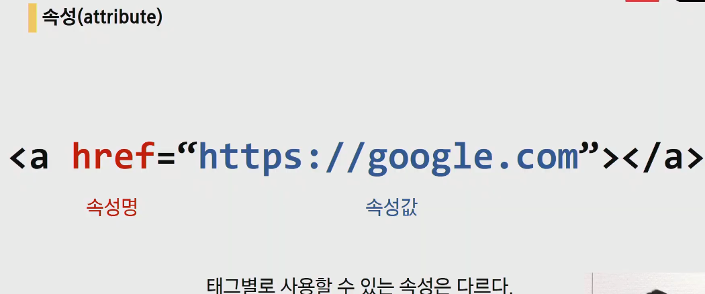

  - `href` : hyper text reference

  - 컨벤션

    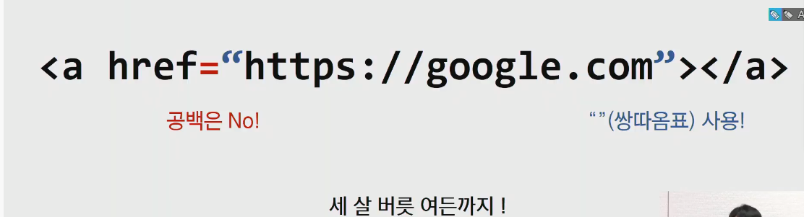

    html에서는 컨벤션 지키지않아도 동작은 합니다. 하지만 관습적으로 지키는 약속이 있습니다.(속성사이에서 공백은 없고, 쌍따옴표)

  - global attribute

    

#### 2.2.4 `div`태그와 시맨틱 태그

- `div`태그

  - 내용을 구분하기위한 `div`태그, div에 의미자체는 없습니다.

- 시맨틱 태그

  - HTML5에서 의미론적 요소를 담은 태그의 등장
  - HTML5에서 사용하는 시맨틱 태그는 13개입니다.(지금은 6개만 알면됩니다.)
  - 대표적인 태그
    - `header` : 문서 전체나 섹션의 헤더(머릿말 부분)
    - `nav` : 네비게이션
    - `aside` : 사이드에 위치한 공간, 메인 콘텐츠와 관련성이 적은 콘텐츠
    - `section` : 문서의 일반적인 구분, 컨텐츠의 그룹을 표현
    - `article` : 문서, 페이지, 사이트 안에서 독립적으로 구분되는 영역
    - `footer` : 문서 전체나 섹션의 푸터(마지막 부분) 페이지의 가장 최하단

  

  - `div`와 구조는 동일하나 문서가 어떤 구조로 구성되어 있는지 확인이 가능합니다

  - 문서의 의미가 조금 더 명확해짐 => 개발자가 읽기에도 수월해짐

  - 접근성 또한 좋아진다

    검색시 제목과 그 웹페이지에 대한 내용을 검색엔진이 분석해서 어느정도 정리를 한 후에 사용자에게 보여주는 것이 가능해집니다.

    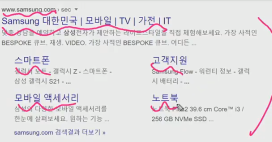

  - 정리
    - 개발자 및 사용자 뿐만 아니라 검색엔진 등에 의미 있는 정보의 그룹을 태그로 표현
    - 단순히 구역을 나누는 것 뿐만 아니라 '의미'를 가지는 태그들을 활용하기 위한 노력
    - Non semantic 요소는 div, span 등이 있으며 h1, table 태그들도 시맨틱 태그로 볼 수 있음
    - 검색엔진최적화(SEO)를 위해서 메타태크, 시맨틱 태그 등을 통한 마크업을 효과적으로 할 필요가 있다

- 시맨틱 웹

  - 웹 상에 존재하는 수많은 웹 페이지들에 메타데이터를 부여하여, 기존의 단순한 데이터의 집합이었던 웹페이지를 '의미'와 '관련성'을 가지는 거대한 데이터베이스로 구축하고자 하는 발상

#### 2.2.5 태그정리

- **블럭레벨**
  - `<!DOCTYPE html>` 문서의 양식이 html이야(선언과 마찬가지)
  - `<html></html>` 실제 태그의 시작
  - `<head></head>` 헤드
  - `<body></body>` 바디
  - `<p></p>` 본문
  - `<ol></ol>` ordered list
  - `<ul></ul>` unordered list
  - `<li></li>` 라인
    - `ul>li*3` `ul`태그 내에 `li`태그를 3개 만들어줍니다.
  - `<form action=""></form>` action 키 "" 밸류(**할당, 저장개념이 아님**)
  - `<input type="text"> <input type="submit">` 편지봉투(form)내에 input이러한 양식이 있다고 생각하면 됩니다. 여기서 `submit`은 제출을 확정하는 입력이라고 생각하면 됩니다. 
  - `<h1>h1</h1>` `<h2>h2</h2>` 이런식으로 해도 서로 블록요소이기 때문에 자연스럽게 줄변환이 된다.

- **인라인레벨**

  - 코드 블럭은 2차원 어치의 면적을 차지

  - **인라인**은 (해당 콘텐츠 만큼만 차지한다는 것)

  - 블럭요소, 인라인요소라고 불립니다.

  - 인라인 요소는 블록요소를 자식으로 가질수 없습니다.

  - 특정한 글들이 있는데 원하는 만큼만 잡아서 사용이 가능!!

    

  - 태그와 태그사이에 enter를 엄청 많이해도 실제로 브라우저에서 보이는 화면에 변화는 없습니다. 만약 엔터를 하고싶을겨우 `<br>`태그를 사용하는데 이 또한 잘 사용하지 않습니다.

  - `<div>`가 블록요소인 것을 활용하여 인라인 요소를 블록요소로 묶어서 블록효과를 낼 수가 있습니다.

    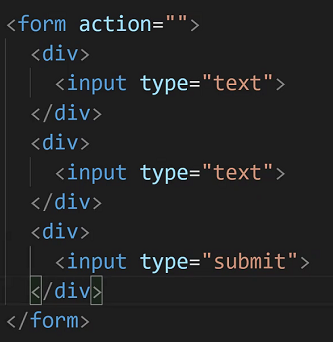

  - `<a></a>` 링크

    - 여기서 불편한 점은 새로운 창에서 열리지 않는다는 점. 이를 해결하는 방법은?

    - 

      `target="_blank"`를 추가해줍니다.

  - `<span></span>`은 CSS를 좀 봐야 이해가 갑니다.

  - `<b></b>` vs `<strong>` bold처리 여기서 `b`는 사실상 의미 없다고 보면 된다

    - 근데 왜있음?? 옛날에는 `b`밖에 없었는데 의미를 중시하면서 `strong`이 생겨난 것

  - `<i></i>` vs `<em></em>` 기울임처리. 마찬가지로 단순 기울임인` i `는 사실상 의미 없다고 보면된다(em은 emphasis의 줄임말)

  - `<button></button>` 버튼

    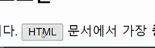

## 3 CSS

> Cascading Style Sheets
>
> 사용자에게 문서(HTML)를 표시하는 방법을 지정하는 언어

### 3.1 CSS?

- 스타일, 레이아웃을 통해서 사용자에게 html이 어떻게 보여질지를 정의하는 프로그램
- html과 css는 각각의 문법을 가지는 별개의 언어입니다.
  - html은 css없이 작성가능(반대는 불가능)

### 3.2 CSS 기본구조


`h1`태그의 콘텐츠 값을 색을 blue,  폰트 사이즈를 15px로 한다는 것.

- CSS 정의 방법

  - **인라인(Inline)** : 잘 사용하지 않습니다.

    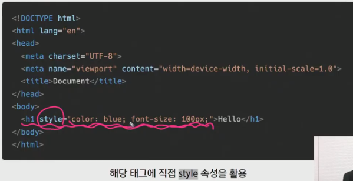

  - **내부 참조(embedding)** : `<style>`

    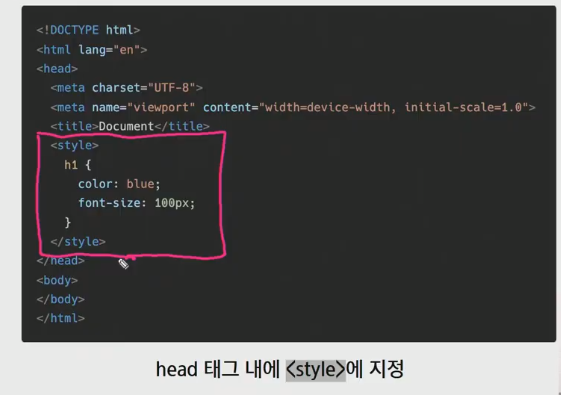

  - **외부 참조(link file)** : 분리된 CSS 파일을 사용

    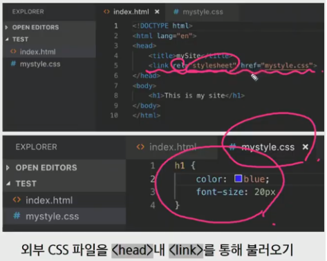

  - 보통 속성 재사용이 가능한 외부참조가 가장 많이 사용 됩니다.

### 3.3 CSS Selectors(선택자)

#### 3.3.1 종류

- HTML문서에서 특정한 요소를 선택하여 스타일링 하기 위해서는 반드시 선택자라는 개념이 필요하다.

  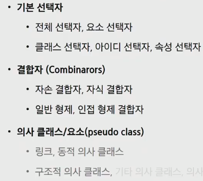

- 기본 선택자

  - **전체 선택자**(`*`로 표현), 요소 선택자(h1, p, a와 같은 것)
  - 클래스 선택자(`.`), 아이디 선택자(`#`), 속성 선택자

- 결합자(Combinators)

  - **자손 결합자, 자식 결합자(`>`**)

  - 지금 중요한 부분은 여기까지 !

- **클래스 선택자**(`.`)

  - 해당 클래스가 적용된 문서의 모든 항목을 선택

  - 스타일을 하나 만들어 놓고 재사용이 가능

  - **하나의 태그에 여러개의 클래스를 생성**할 수 있습니다.

    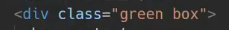

  - **공백을 기준**으로 클래스를 나눕니다.

  - box 클래스 내부의 자식요소인 `p`태그에 적용시킨다.

    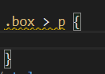

- **id 선택자**(`#`)

  - `#`문자로 시작하며 기본적으로 클래스 선택자와 같은 방식으로 사용
  - 그러나 id는 **문서당 한번만 사용**할 수 있으며 요소에는 단일 id값만 적용 할 수 있다. 
  - 하지만 id를 여러개 쓴다고 해서 error가 나지는 않습니다. 하지만 원칙적으로는 한개를 사용
  - id나 클래스나 기능은 똑같은것 아닌가욧?! 교수님 답변 :  **두개 이상의 요소의 조합으로 선택자를 특정한다고 해서 결합자라는 표현을 쓴 것일 뿐이며 기능적 차이는 없습니다.**

#### 3.3.2 우선순위

- 중요도(importance) *사용시 주의(Cascading의 흐름을 무시하는 것이기 때문에 디버깅이 안될 수 있습니다.)
  - `!important`
- 우선순위(Specificity)
  - `Inline style`, `id 선택자`, `class 선택자`, `요소 선택자(태그 선택자)`
  - `Inline` : 태그 안에 쓰는 스타일
- 소스순서(위에서 아래로)

###  3.4 CSS 상속


- text관련 요소는 부모의 요소를 그대로 상속 받습니다.

- box model관련요소(너비, 높이...)는 상속 되지 않습니다.

- position 관련 요소 또한 상속 되지 않습니다.

  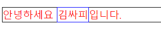

  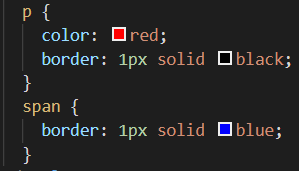

  `p`태그의 자식태그인 `span`태그의 경우 border는 상속되지 않기때문에 직접 명시해줘야한다.

### 3.5 CSS 단위


- 상대적 단위를 사용합니다.
- `px`: 같은 10px이라도 어떤 device냐에 따라서 달라집니다.
- `%`: 비율
- `em` : 배수단위, 요소에 지정된 사이즈에 상대적인 사이즈. 즉 **부모의 사이즈**에 영향을 받습니다.(상속을 받기때문에 고려할 부분이 생깁니다.)
- `rem` : **html사이즈(root)를 기준**으로 배수 단위를 가집니다.(**html의 기본 폰트 사이즈는 16px**입니다.)
- viewport기준단위 : viewport배율에 맞춰서


### 3.6 CSS Box model

#### 3.6.1 Box model 구성


1. `Margin` : 하나의 박스가 있다면 테두리 바깥의 외부 여백
2. `Border` : 테두리
3. `Padding` : 테두리와 안에 컨텐츠 사이의 여백
4. `Content` : 안에있는 내용

- box model은 항상 네방향입니다.

- margin

  

- padding

  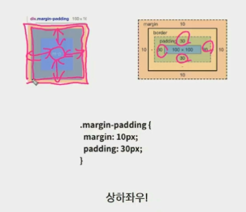

- border

  

  - width : 두께
  - style : 실선, 점선
  - color : 색깔

- shorthand를 통한 표현이 가능하다!

  

  위처럼 `margin`이렇게 표현하면 네방향 모두 적용가능

  - `margin : 10px` : 상하좌우 10

  - `margin: 10px 20px` : 상하 10 좌우 20

  - `margin: 10 20 30` : 상 10 좌우 20 하 30

  - `margin: 10 20 30 40` : 상 10 우 20 하 30 좌 40 

  

  - 순서는 상관없습니다.  `border: dashed 2px black;`또한 가능

- Quiz

  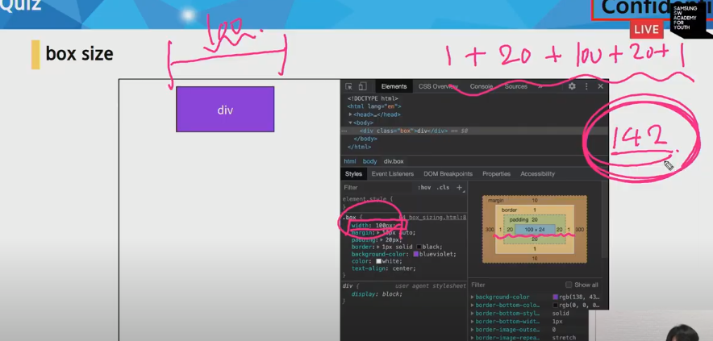

  박스 너비100만들고 싶은데 html보니 142가 됨

  기본적으로 CSS는 그 박스안의 content를 기준으로 100px을 잡습니다.

  **우리가 원하는 너비 100 box를 만들고 싶다면 border를 기준으로 맞추어야 합니다. **

  

  `border-box`로 설정시 1 +20 + 58 + 20 + 1 = 100이 됩니다.

- 마진상쇄

  

  위의 경우 생각하기에 박스사이의 마진이 60이라고 생각할 수 있지만 덮어씌워져서 50이 된다.(이것은 블럭요소일때, top-bottom의 경우만 적용됩니다.)

### 3.7 CSS Display


앞에서 배운 인라인과 블록 또한 Display의 요소였습니다.

- `display: block`
  - 줄 바꿈이 일어나는 요소
  - 화면 크기 전체의 가로 폭을 차지한다
  - 블록 레벨 요소 안에 인라인 레벨 요소가 들어갈 수 있음.
- `display: inline`
  - 줄 바꿈이 일어나지 않는 행의 일부 요소
  - content 너비만큼 가로 폭을 차지한다.
  - width, height, margin-top, margin-bottom을 지정할 수 없다.
  - 상하 여백은 line-height로 지정한다.
- 대표적인 블록 레벨 요소
  - `div / ul, ol li / p / hr / form` 등


- 대표적인 인라인 레벨 요소
  - `span / a / img / input, label / b, em, i, strong` 등


- 속성에 따른 수평 정렬
- 블록요소의 경우
  - `margin-right: auto;` : 좌측정렬
  - `margin-left: auto;` : 우측정렬
  - `margin-right: auto; margin-left: auto;` : 가운데 정렬
- 인라인요소의 경우
  - `text-align: left;` : 좌측정렬
  - `text-align: right;` : 우측정렬
  - `text-align: center;` : 가운데 정렬


- `display: inline-block`
  - blcok과 inline 레벨 요소의 특징을 모두 갖는다.
  - inline처럼 한 줄에 표시 가능하며,
  - block처럼 width, height, margin 속성을 모두 지정할 수 있다.
- `display: none`
  - 해당 요소를 화면에 표시하지 않는다. (공간조차 사라진다.)
  - 이와 비슷한 `visibility: hidden`은 해당 요소가 공간은 차지하나 화면에 표시만 하지 않는다.

### 3.8 CSS Position

- display는 보여지는 것을 결정합니다. position은 사용자에게 보이게 할 것인데 어디에 보이게 할 것이냐에대한 얘기입니다.
- Box model같은 경우는 contents 바깥의 이동(margin은 block속성만 가집니다.)이었는데 CSS Position은 진짜 contents의 이동입니다.

- 문서 상에서 요소를 배치하는 방법을 지정한다.
- `static` : 디폴트 값(기준위치)
  - 기본적인 요소의 배치 순서에 따름(**좌측 상단**)
  - 부모 요소 내에서 배치될 때는 부모 요소의 위치를 기준으로 배치 된다.
  - `static`속성을 가지면 기본적으로 안움직입니다.
- 아래는 좌표 프로퍼티(`top`, `bottom`, `left`, `right`)를 사용하여 이동이 가능하다. (음수 값도 가능)
  - `relative` : **static 위치를 기준**으로 이동(상대 위치)
  - `absolute` : **static이 아닌 가장 가까이 있는 부모/조상 요소를 기준**으로 이동(절대 위치)
  - `fixed` : 부모 요소와 관계 없이 **브라우저를 기준**으로 이동(고정 위치)

- `static` : 기본적으로 움직이지 않습니다.
- `relative` : **원래 `static`인 경우에 있어야만 하는 자리를 기준**으로 이동합니다.
  - `position: ralative;`를 해줌으로써 적용됩니다.
  - 해제하면 다시 `static`이 됨
  - 자신이 있어야 하는 자리를 양보하지 않습니다
- `absolute` : 이름부터 강력한 '절대적인'친구
  - 부모가 static이라면 말을 듣지 않습니다.
  - 특별한(`static`) 부모요소가 없으면 body기준으로 움직인다.
  - 자신이 있어야 하는 자리를 양보합니다
- `fixed` : 아무리 텍스트가 많아도 고정
  - `%`를 활용해서 조정

## 4 CSS layoout

> 웹 페이지에 포함되는 요소들을 **취합**하고, 그것들이 **어느 위치에 놓일 것인지를 제어**하는 기술

- Display
- Position : `static`, `relative`, `absolute`, `fixed`
- Float : 
- Flexbox : 1차원 레이아웃 모델(메인축과 교차축)
- Grid : 강력한, 모바일, 그리드 시스템(12col, 6tiers)
- ~~Table layout~~
- ~~Multiple-column layout~~

### 4.1 Float

- Float : `html`을 벗어나서 텍스트나 인라인 요소로 감싸는 기술.

  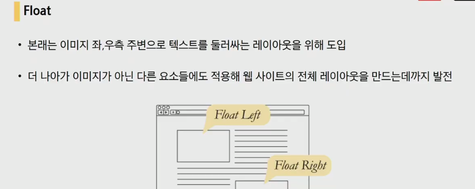

  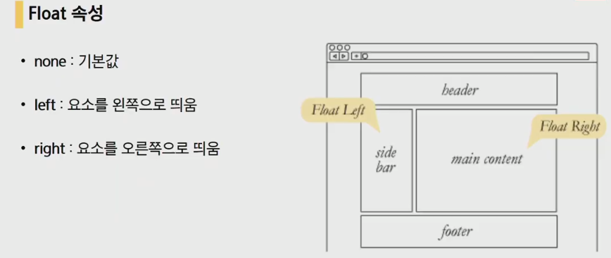

  시간이 지나면서 점점 발전하다보니 웹페이지 구조를 담당하는 역할까지 하게 됨

- 특징

  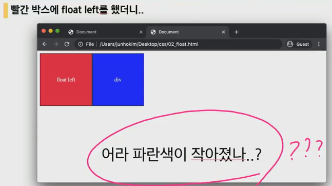

  float하게 된다면 그 아래 빈공간이 생겨서 float를 하지 않은 요소(div)가 그 자리를 채우게 됨(기존의 레이아웃이 깨지게 됨)

  float로 인해 방해 받는걸 막기위해 나머지 요소들이 float를 무시할 수 있어야 합니다.

  

  float로 설정 될 요소의 부모요소(가장의 요소)를 만듭니다. 그리고

  ```css
  /* CSS */
  .clearfix::after {
      content: "";
      display: block;
      clear: both;
  }
  ```

  ```html
  # html
  <header class="clearfix">
      <div class="box1 left">
          float left
      </div>
  </header>
  ```

  위와같이 내부속성을 정해주면 외부 요소들이 float를 무시하게 됩니다.

  보통 클래스 이름을 `clearfix`로 정해줍니다. (CSS에서 가상 선택자 `after`는 맞춰줘야하고, `clearfix`라는 이름은 바꿔도 되지만 관례적으로 해당 이름을 맞춰주시는게 좋습니다.)

  

  이런식으로 html에 추가가 됩니다.

### 4.2 Flexbox

> CSS Flexible Box Layout

- 요소 간 공간 배분과 정렬 기능을 위한 1차원(단방향) 레이아웃
- 크게 딱 2가지만 기억하자! **'요소'와 '축'!**
- 요소
  - Flex Container(부모요소)
  - Flex Item(자식요소)
- 축
  - main axis(메인축)
  - cross axis(교차축)

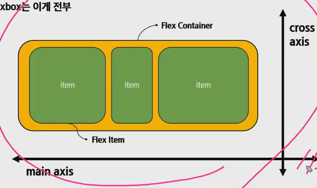

​		Flex Container를 통해서 이 안의 요소(각각의 Item)를 정렬합니다.

- Flexbox의 기본방향

  

- Flexbox의 시작

  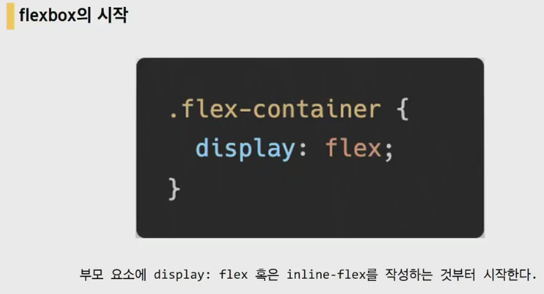

  부모요소에 `display: flex`값을 주면 그 안의 요소들이 flex요소들이 되는 것입니다.

  `display: flex`로 지정된 Flex Container는 Block요소와 같은 성향(수직 쌓임)을 가지며,

  `display: inlin-flex`로 지정된 Flex Container는 Inline(Inline Block)요소와 같은 성향(수평 쌓임을 가집니다.)

- Flex에 적용하는 속성
  - 배치 방향 설정
    - `flex-direction`
      - `row`: 요소들을 텍스트의 방향과 동일하게 정렬합니다.
      - `row-reverse`: 요소들을 텍스트의 반대 방향으로 정렬합니다.
      - `column`: 요소들을 위에서 아래로 정렬합니다.
      - `column-reverse`: 요소들을 아래에서 위로 정렬합니다.
  - 메인축 방향 정렬
    - `justify-content`
  - 교차축 방향 정렬
    - `align-items`, `align-self`, `align-content`
  - 기타
    - `flex-wrap`, `flex-flow`, `flex-grow`, `order`
    - `flex-grow` : 메인축에서 남는 여백의 비율을 나눠 줍니다.

- content & items & self

  - content : 여러 줄
  - items : 한 줄
  - self : flex item 개별 요소
  - 예시
    - justify-content : 메인축 기준 여러 줄 정렬
    - align-items : 교차죽 기준 한 줄 정렬
    - align-self : 교차축 기준 선택한 요소 하나 정렬

  - `justify-content`

    - `flex-start`, `flex-end`, `center`, `space-between`, `space-around`, `space-evenly`
    - `justify`는 `content`일 수 밖에 없는게 축안에 content가 다수 존재하기 때문.( WC3에 의하면 content말고는 ignore된다고 합니다. items나 self가 사용되는 것은 CSS grid라는 곳에서 사용됩니다.)
    - `flex-start`: 요소들을 컨테이너의 왼쪽으로 정렬합니다.
    - `flex-end`: 요소들을 컨테이너의 오른쪽으로 정렬합니다.
    - `center`: 요소들을 컨테이너의 가운데로 정렬합니다.
    - `space-between`: 요소들 사이에 동일한 간격을 둡니다.
    - `space-around`: 요소들 주위에 동일한 간격을 둡니다.

  - `align-items` : 교차축 덩어리로 묶어서 처리. 

    - `flex-start`, `flex-end`, `center`, `stretch`, `baseline`
    - `flex-start`: 요소들을 컨테이너의 꼭대기로 정렬합니다.
    - `flex-end`: 요소들을 컨테이너의 바닥으로 정렬합니다.
    - `center`: 요소들을 컨테이너의 세로선 상의 가운데로 정렬합니다.
    - `baseline`: 요소들을 컨테이너의 시작 위치에 정렬합니다.
    - `stretch`: 요소들을 컨테이너에 맞도록 늘립니다.

  - `align-content` : 교차축 하나하나

    - `flex-start`, `flex-end`, `center`, `stretch`, `space-between`, `space-around`

  - `align-self`

    - `auto`, `flex-start`, `flex-end`, `center`, `baseline`, `stretch`

  - 항목이 래핑되지 않은 경우에는 해당 영역이 항상 플렉스 박스 영역으로 확장되는 한 줄만 있고, `align-content`는 한 줄에 영향을 주지 않습니다. 따라서 래핑되지 않은 항목에는 영향을주지 않으며 모든 항목이 한 줄에 있을 때 항목 `align-items`만 항목 위치를 변경하거나 늘릴 수 있습니다.

    그러나 줄 바꿈(래핑)된 경우 각 줄안에 여러 줄과 항목이 있습니다. 그리고 각 라인의 모든 항목이 동일한 높이(행 방향)를 갖는 경우 해당 라인의 높이는 해당 항목 높이와 동일하며 `align-items`값을 변경해도 효과가 나타나지 않습니다.

- 때때로 컨테이너의 row나 column의 순서를 역으로 바꾸는 것만으로는 충분하지 않습니다. 이러한 경우에는 `order` 속성을 각 요소에 적용할 수 있습니다. order의 기본 값은 0이며, 양수나 음수로 바꿀 수 있습니다.

- `flex-wrap`

  - `nowrap`: 모든 요소들을 한 줄에 정렬합니다.
  - `wrap`: 요소들을 여러 줄에 걸쳐 정렬합니다.
  - `wrap-reverse`: 요소들을 여러 줄에 걸쳐 반대로 정렬합니다.

- `flex-direction`과 `flex-wrap`이 자주 같이 사용되기 때문에, `flex-flow`가 이를 대신할 수 있습니다. 이 속성은 공백문자를 이용하여 두 속성의 값들을 인자로 받습니다.

  예를 들어, 요소들을 가로선 상의 여러줄에 걸쳐 정렬하기 위해 `flex-flow: row wrap`을 사용할 수 있습니다.

- Flexbox(실제 이름은 Flexible Box Layout Module)를 사용할 수 있는 html을 확인해봐야합니다.**can i use**를 이용! 사이트 내의 검색창에 `flexible`,`float`등 검색해서 확인해보면 됩니다.

  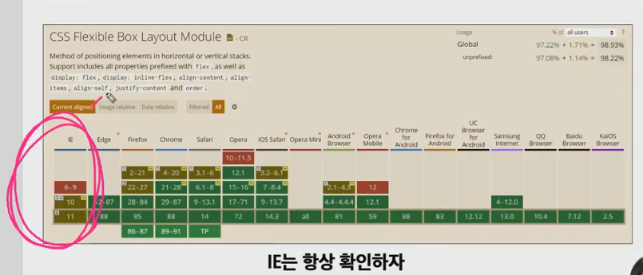