# django

김준호 교수님

4주간 장고를 배울겁니다!

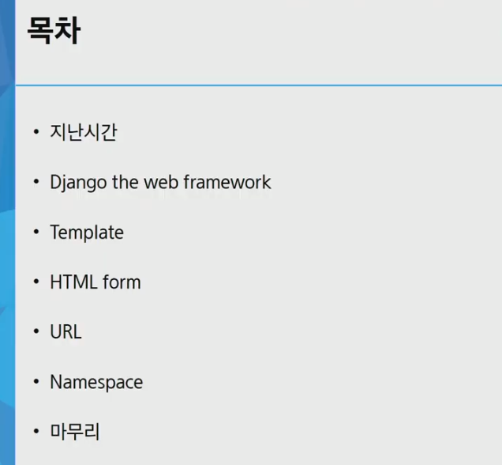

## 지난시간


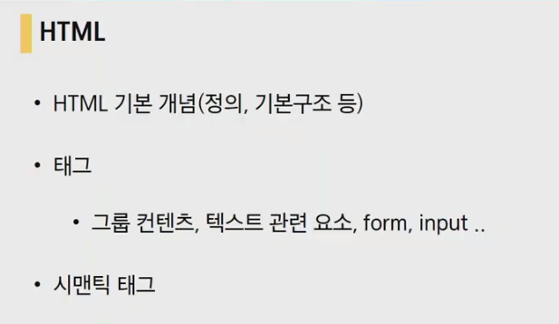


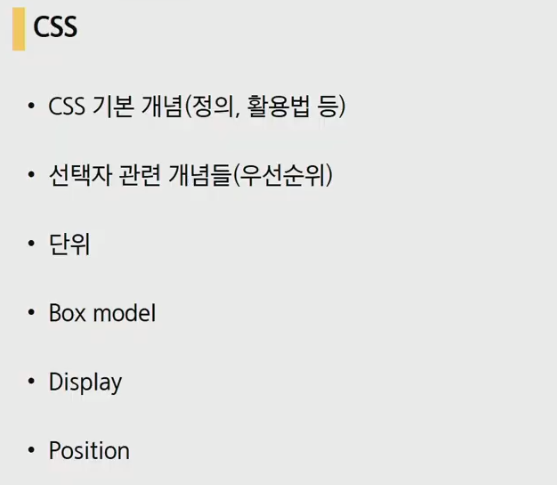

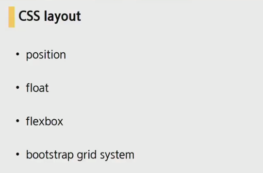


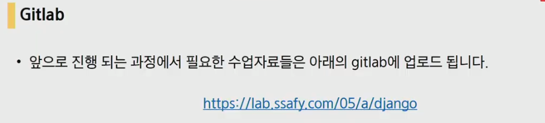

## 이번시간

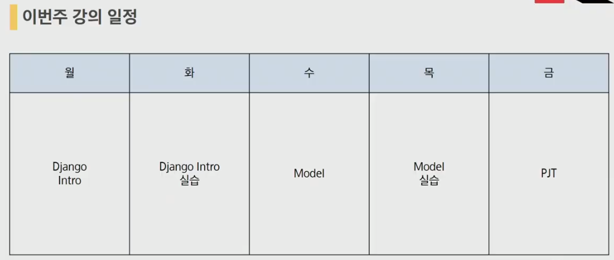

## django란..?


다이나믹을 알기전에 스태틱 웹을 한번 봅시다

### Static web

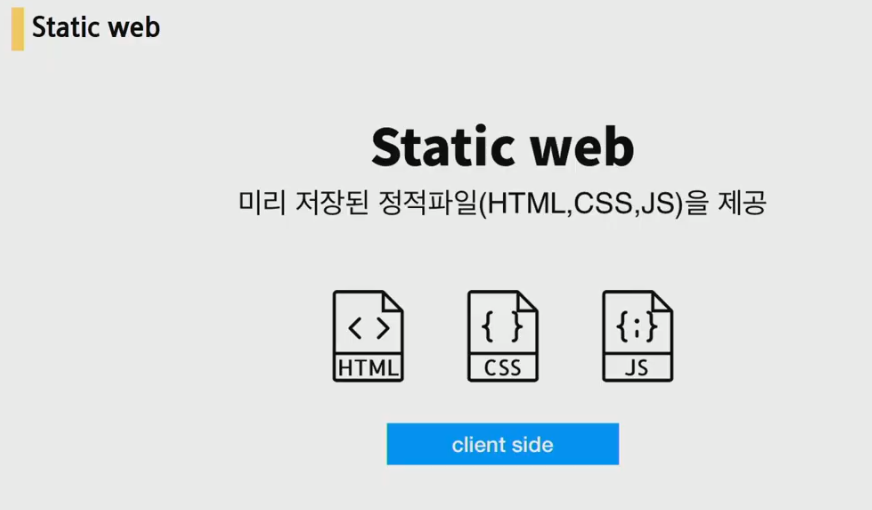

서버에 미리 사용자에게 보여질것들이 준비가 되어있고 사용자가 들오면 그것을 그대로 보여주는 웹.(어떠한 데이터처리가 이루어지지 않고 미리 준비 되어있는 것들을 보여주는 웹
)

### Dynamic web


사용자의 요청에 따라 서버에서 작업읍 한 뒤에 사용자에게 제공되는 웹

이들을 만들어주는 프레임워크 중 하나가 django라는 프레임워크입니다.

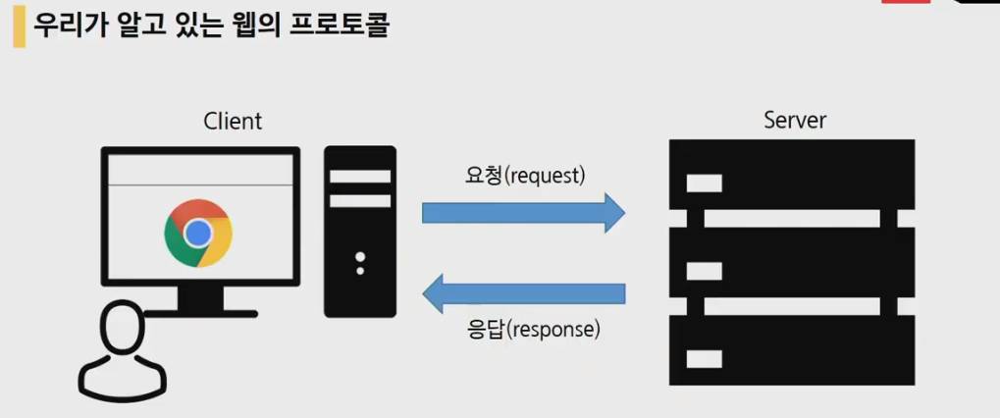

요청과 응답

서버 프레임워크를 django로 구축을할 것.

### What? Why? How?

> 파이썬으로 만들어진 웹 프레임워크 언어


#### What

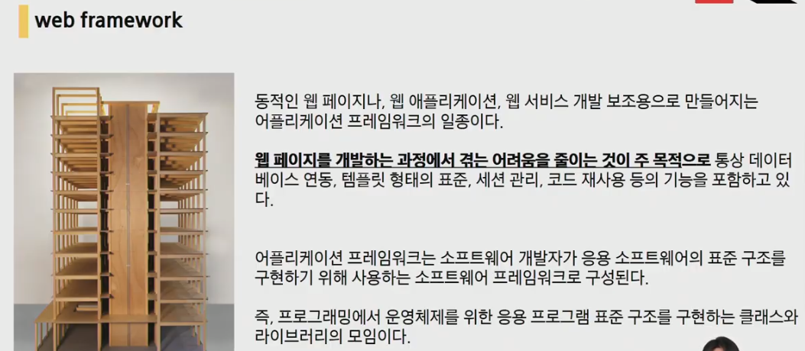


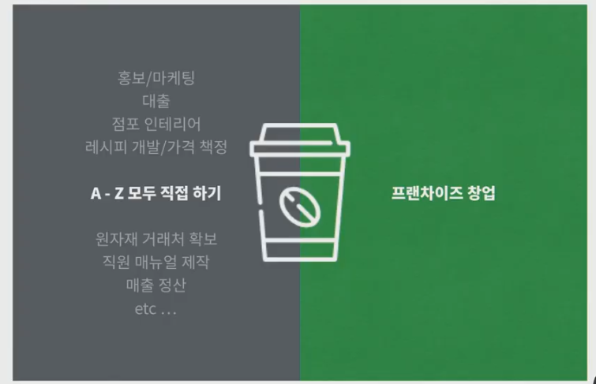

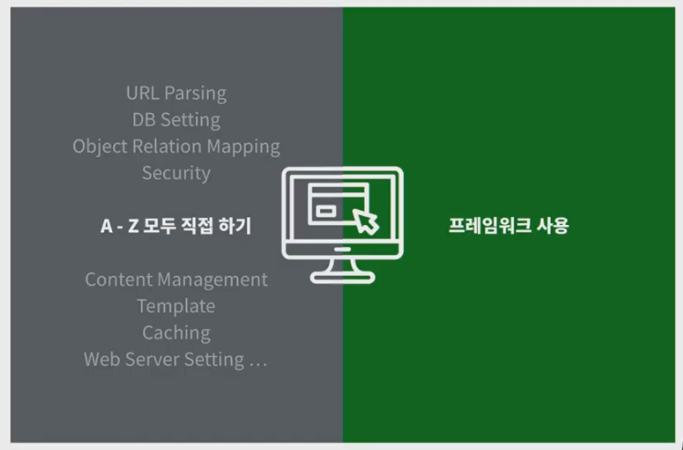

프레임워크 위에서 조금더 원활히 작업하도록 도와주는 프로그램


#### Why

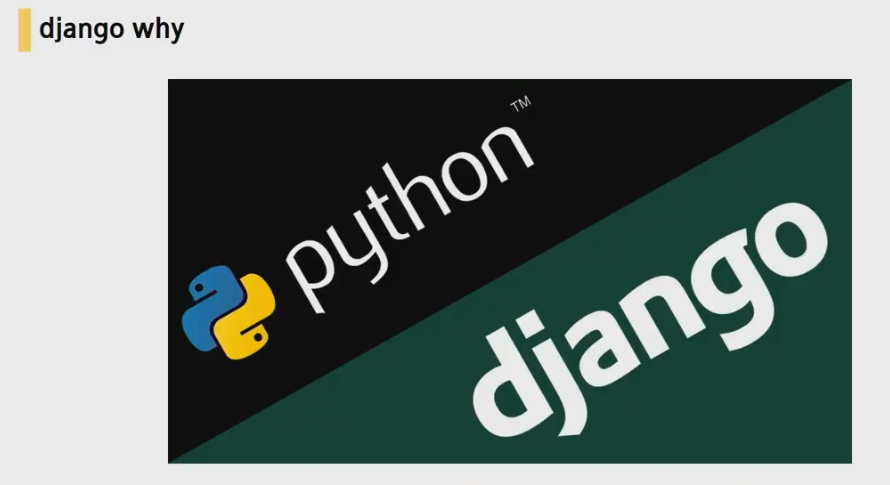


이름만 들어도 아는 세계적 기업들이 django를 사용한다 = django가 대규모 서비스에서도 충분히 잘 돌아가는 웹 프레임워크다!

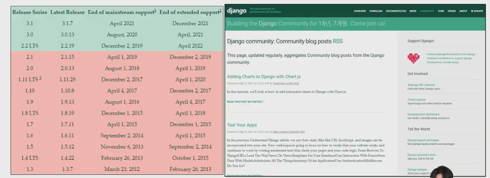

방대한 생태계! 또한 django를 사용하는 이유

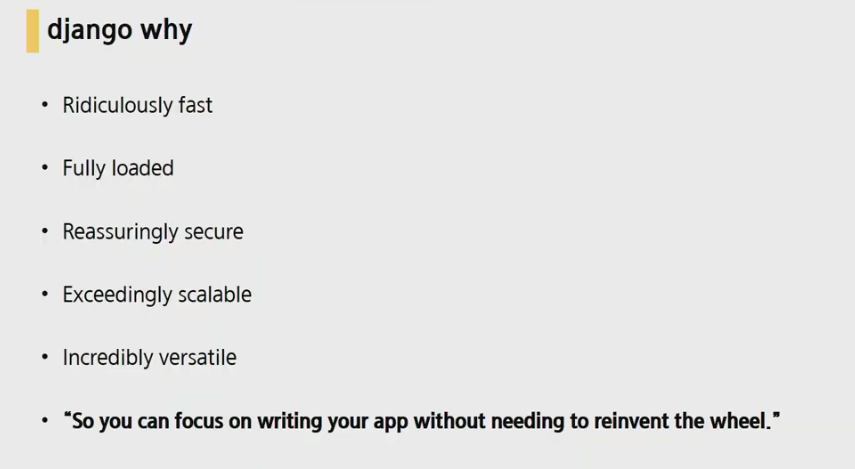

#### How

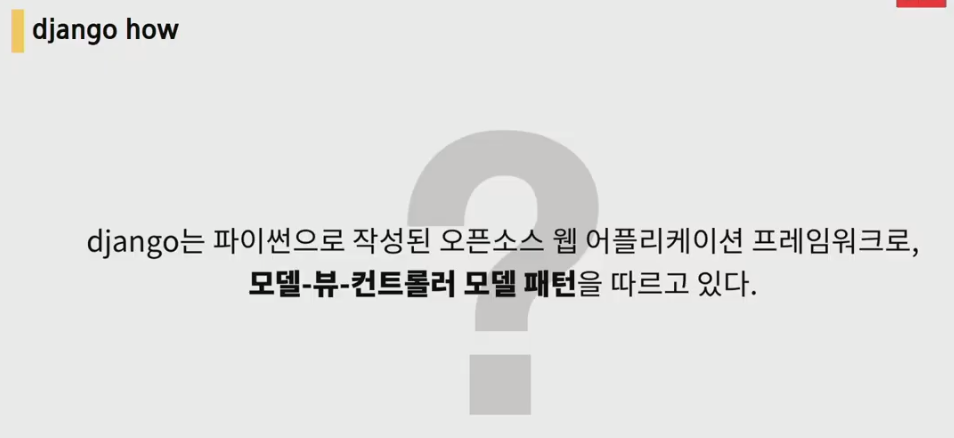

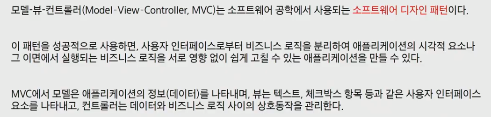

각각의 디자인패턴(MVC)


django는 MTV방식(Model, Template, View)

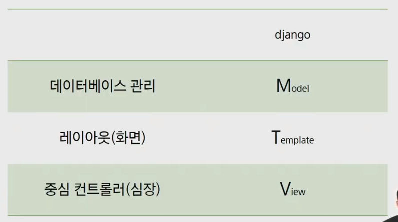

각각의 역할은

Model : 데이터베이스 관린

Template : 레이아웃(화면)

View : 중심 컨트롤러(심장)

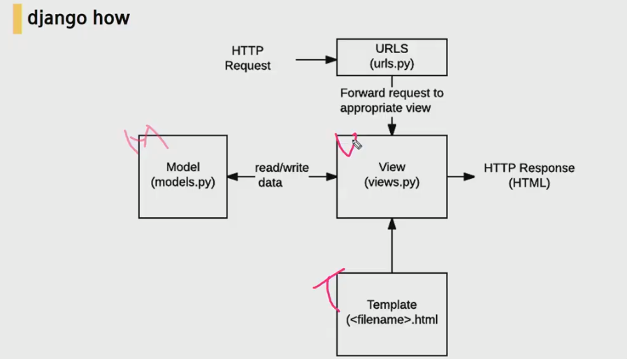

view가 model로부터 데이터를 받고 처리를해서 하나의 문서를 만들어서 http 응답을 보낸다

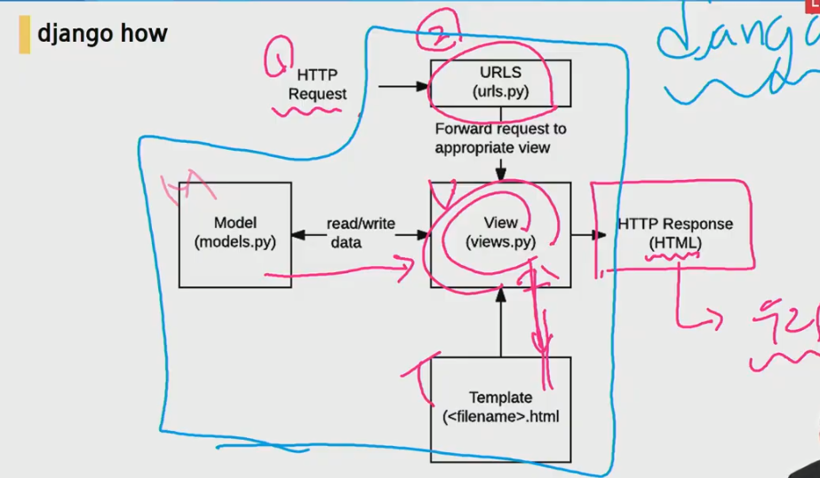

## hello django


- 수업에 앞서서 주소확인!

  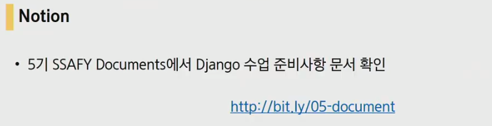

### 장고설치


환경확인(현재 환경에 다운받아져있는 패키지들 확인 가능)

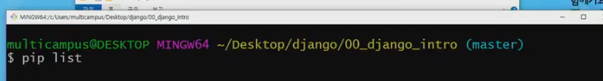

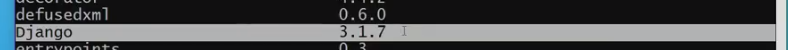

버전이 3.1 이상이면 ok!

### 장고규칙(앱생성, 등록)

> url -> view.py -> template 흐름으로 작성

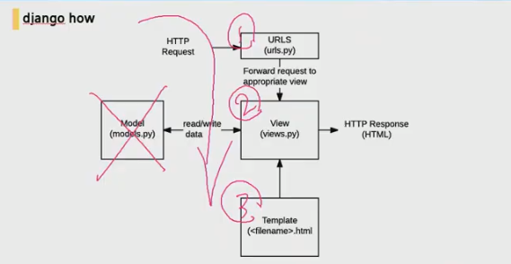

- `django-admin startproject 프로젝트이름`

  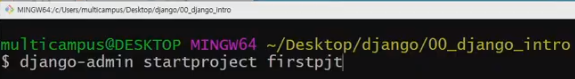

  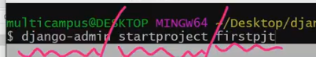

  아무것도 뜨는건 없다. 하지만 우리가 사용하는 폴더에 firstpjt라는 폴더가 만들어져 있을 것

  이 폴더 안으로 들어와보면 firstpjt랑 manage.py라는 파일이 있습니다. 지금 이 위치에서 다시한번 git bash를 켜보고 django서버를 on해봅시다.

- `python manage.py runserver`

  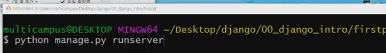

  python으로 manage.py라는 파일을 열건데 runserver라는 키워드가 붙어있다라는 의미

  - 만약 안된다면?????

    ctrl+c로 서버를 끈다음에 vscode로 열어주세요. 

    같은 명령어를 vscode에 작성해보면 됩니다.

  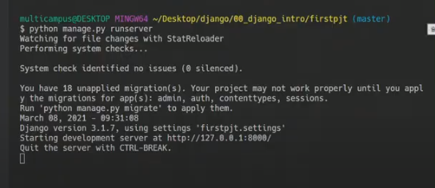

  이렇게 뜨면 ok!!

- 사용금지

  `` `, `_`, `내장함수이름` 등은 사용하면 안됩니다.

- `python manage.py startapp 앱의이름`

  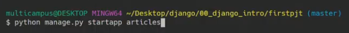

  아무것도 에러는 뜨지않고

  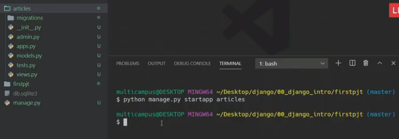

  이처럼 좌측에 article라는 폴더가 생성됨

- admin.py는 관리를 하는 정보를 담은 파이썬파일

- apps.py는 절대로 수정하지 않는다

- models.py MTV(디자인패턴)중 model을 담당하는 파일

- test.py는 django의 테스트코드를 작성하는 곳. 정규수업에는 사용x

- views.py 이자인 패턴 3대장중 하나. MTV중 View의 역할을 하는 파일.

  - 우리가 만질 파일은 3가지!

    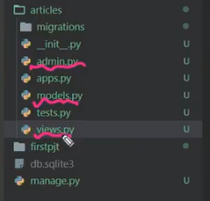

  - template은 조금 이따가 배울겁니다.

- 장고는 어플이 만들어져도 프로젝트입장에서는 어플리케이션이 만들어졌는지 알수 없습니다. 그렇기 때문에 어플리케이션을 만들었다는 '등록'과정을 거쳐야 합니다.

  firstpjt열고 settings.py 열어보면

  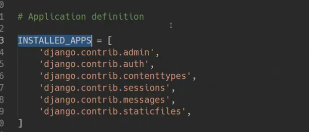

  django가 기본적으로 구동되는 데 필요한 기능을 하고있는 어플리케이션이 미리 등록이 되어있는 것

  우리가 만든것은 articles라는 앱이기 때문에 여기에 어플이름을 등로갷주면 됩니다.

  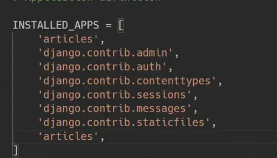

  articles를 밑에 두어도 상관은 없으나 일반적으로 위에 두게된다.

  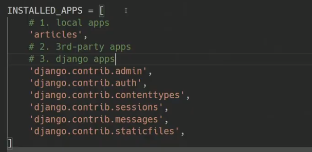

local apps -> 3rd-party apps -> django apps 이러한 순서로 installed apps를 작성해주는 편입니다. 

​	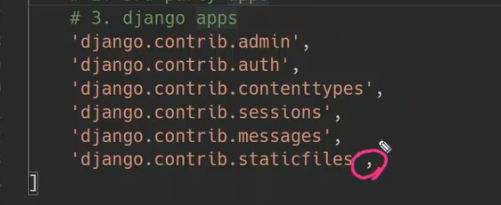

​	**trailing comma** 마지막 요소 뒤쪽에 콤마를 붙여준다.

- 하나의프로젝트에는 여러개의 작은 로컬프로젝트가 들어갈 수 있습니다. 

- setting.py에서..

  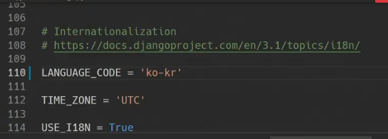

  이렇게 변경후 `python manage.py runserver` 명령어 입력을 해보면

  

  서버 언어가 한글로 변경이 됩니다.

  - 시간대도 변경해봅시다.

  검색해서 database time zones에서 국제적약속을 확인해보면.. 

  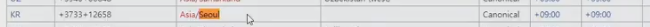

  이러한 형식으로 작성을한다

  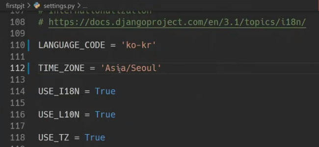

  작성을 하면 나중에 데이터베이스에 저장되어 출력되는 시간이 우리나라 시간기준에 맞춰집니다.

- .py 3대장 (중요하게 생각하면 됩니다.)

1. urls.py
2. views.py
3. models.py

### 요청-응답 사이클 경험해보기

요청을 가장 먼저 받는곳은 URLS(urls.py)입니다. 이러한 요청이 들어오면 어디로가야하는지 인식하고 적절한 함수를 찾아서 그 함수를 호출합니다. 이 역할을 urls.py에서 합니다.

`urls.py`는 `project`에 위치합니다. 

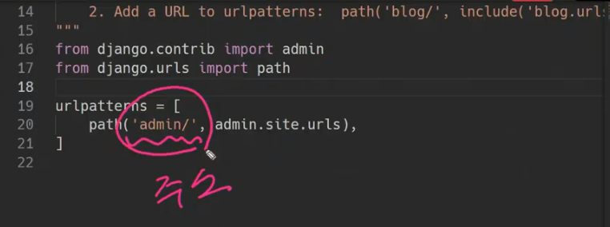

기본적으로 admin/ 라는 주소가 들어가있는데 주소창에 이렇게 쳐보면

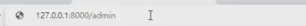

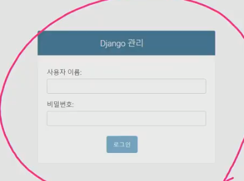

이미 admin이라는 주소가 생성되어있습니다. 기본적으로 django가 제공해주는 url

- 메인페이지로 들어오기위한 url을 작성

  `path('index/', )

  path함수의 2번째 인자는 어떤 View를 실행할지가 들어오게 됩니다.

  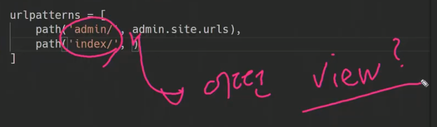

  

  articles앱에 `views.py`로가서 views함수들이 하나씩 작성이 되는 겁니다.

  **view함수의 첫번째인자는 반드시 `request`여야만 합니다. **

  request는 사용자로부터 받아온 요청

  ```python
  def index(request):  # 첫 번째 인자는 반드시 request
      return render(request, '템플릿경로')
  ```

  근데 템플릿은 일단 없습니다

  

  다시 urls.py로 돌아와서 articles 앱에 있는 views.py를 가져옵니다.

  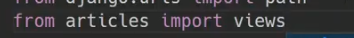

  그리고나서 views.py의 index 함수를 사용한 것

  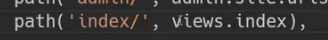

  그렇다면 views.py의 index함수가 실행되어 보여줄 템플릿이 보여지게되는것

  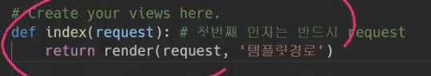

  이제 템플릿을 작성해봅시다. 템플릿은 앱에다가 작성을하는데 **약속이 하나 더 있습니다**. **템플릿은 반드시`templates`라는 폴더의 경로에서 만들어줘야합니다.**

  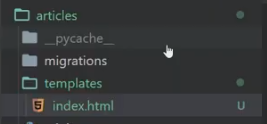

  articles 안에 `templates`라는 폴더를 만들고 그안에 `index.html`파일을 하나 만들어 놓습니다.(일반적으로 메인페이지는 index라는 이름을 사용합니다.)

  **django는 `templates`까지의 경로는 알고있다. 따라서 그 이후의 경로만 작성해주면 됩니다!!**

  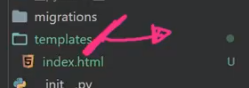

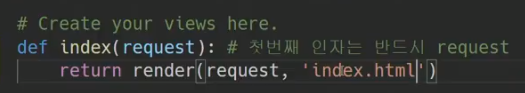


### Template

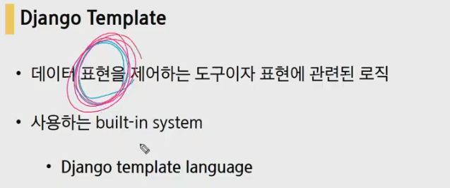

우리에게 보여지는 화면을 **표현하기위한 로직**을 작성하는 부분(데이터조작x 데이터조작은 view에서 합니다.)

DTL이라는 장고 템플릿에서 사용하는 언어가 따로 존재합니다.

#### DTL

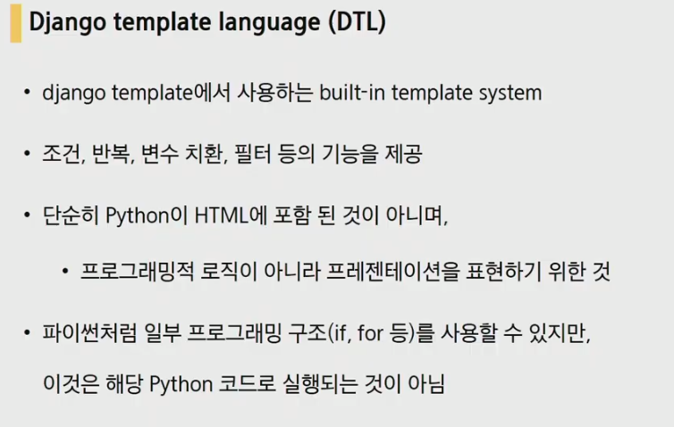

python이 html에 사용되는 것이아니라 python처럼 비슷한 구조라고 생각하면 됩니다. (파이썬이 실행되는 것은 아님)

#### DTL syntax

일단 작성순서는 url -> view.py -> template 흐름으로 작성

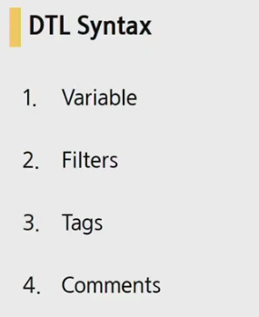

##### `Variable`


- `urls.py`에서 실행할 함수와 연결해주기

  

  이러면 에러가 뜨는데

  

  이것은 아직 함수를 만들어주지않았기 때문에 당연한것

  

  `views.py`로 돌아와서 함수를 만들어줍니다

  

  views.py에서 전달해야하는 그것은 세번째 인자로 들어가게됩니다. 딕셔너리 형태로.

  

  views함수가 하나의 템플릿을 만들건데 {}내의 데이터와 함께 들어가게 될 것

  

  `templates`폴더에 `greeting.html`을 만들어주면서 데이터에 접근하기위해 key값을 활용합니다

  

  

  좀 더 활용해봅시다. views.py에서

  

  웬만하면 key, value값은 맞춰서 보내는 것이 일반적입니다.

  왼쪽의 key값들은 greeting.html 라는 장고 템플릿에서 사용하게 됩니다.

  이제 greeting.html로 돌아가서

  

  

  

  이중 하나에 접근하고 싶다면?? 리스트의 경우에는 인덱스로 접근하게 됩니다.

  

##### Filter


앞에있는 변수를 수정해줄때 사용해줍니다. django built in filters에서 확인가능

서로 나열이 되는 필더라면 chain이 가능 30자 까지 제한을 걸어줄 수도 있다.


이번에는 저녁데이터를 받아와 봅시다

우선 url에서 요청을 받아와서 view를 불러옵니다.


templates폴더에 `dinner.html` 을 만들어줍니다.


이렇게 작성하면 아래와 같이 보여집니다. length와 같은 함수는 django built in filters에서 확인가능


##### tag


단독적으로 쓰는tag도 있지만 열린태그와 닫는태그가 존재하는 tag또한 있습니다.


```html

	<li>{{ food }}</li>

```

tag는 출력은 되지 않습니다.

##### Comments


```django
{# 이것은 주석입니다 #}

	<p>1</p>

```

### 정리

오후시간 : 탬플릿 상속

- app 이름은 ''**복수형**''으로 맞춰서 사용
- app은 **생성(startapp) 후 등록**

## 웹엑스시간

- 웹서버, 소프트웨어를 만드는 이유? 쓸려고, 편하려고! 다양한 사람이 사용하기 위해서 나혼자 쓰려고?? ㄴㄴ 다 같이 쓰려고
- 프로젝트구성 project route

웹서비스는? 남들이 쓰기 위해서. 다른방법은 없느냐? 있다! 앱스토어에서 받는 어플 같은것들 하지만 웹을 왜 쓰느냐?? 무엇보다 쉽다. 다른사람에게 효용을 주기 원활하다. 


우리가 지금 배우는건 *부분(특정, 다른 컴퓨터에서 data 받아오기(다운로드)) 즉, 내컴퓨터가 아닌 다른 컴퓨터에서 받아오기

수많은 주소들 중에서 127.0.0.1 이라는 것이 있는데 이것은 바로 '나' 를 의미한다.

우리 컴퓨터는 서버가 되본적이 없다(즉 남에게 줘본적이없다.) 지금부터 누구에게 주고싶다! 라고 한다면 남에게 주는 순간 서버가 된다.


내 컴퓨터가 남에게 주기위해서 안달이 난 상태인데 생태계는 반드시 요청을 받아야 응답을 보내줄 수가있다.

IP주소는 까여도 된다.(사실 클릭한번으로 보여지는것이 주소) 문제는 현관문이 열리질 않아야 한다. 즉, 다른 사람이 요청보내는것에 응답을 보내면 안된다


이 상황은 내가 클라이언트면서 내가 서버인 상황. 어쨌든 요청을 보낼때 필요한 것은 컴퓨터주소(IP.../.../..)인데 그러면 google.com....은 뭔가? 도메인으로 불리는 이것은 사람들에게 통용되는 주소. 즉, IP는 필수지만 도메인은 없을 수도없다.

즉, 서버에 접근하기위해서는 IP로 접근을해야하고 IP뒤에는 port라는 것이 숨어있습니다.

기본적으로 모든 IP뒤에는 port가 붙어있습니다. 

컴퓨터 하나에 요청을 보낼수있는 창구가 하나라면 너무 답답할 것. 다른 용도로 사용되는 창구들이 존재합니다. 이러한 모든 문들을 'port'라고 합니다.


IP는 주소 port는 창구 이 두가지가 있어야만 접근할 수 가 있습니다. 

접근 방법생각해보면


밖에 네트워크에 요청을 보내고 그 네트워크에서 다시 내컴에 요청을 보내는 경우. 이것은 다른 네트워크에서 내게 요청을 보낼때 block당함

두번쨰로


창구의 번호는 내가 지정하는 것. 

aws 에져 gcp가 부동산 임대업하는 곳인데


내 컴퓨터가 아닌 서버에서 원하는 작업을 하고싶은데 서버에서 내가 빌린 임대한 곳은 현재  텅 빈상태. 근데 또 내 컴퓨터에 존재하는것은 침대, 소파 등등.. 너무 많은 것들 중에서 그 중에서 카페에 필요한 물건들이 섞여져있다. 그렇다면 이중에 서버에서 필요한 것들은 뭔지 어떻게 고를 것인가.  너무 어렵다. 내 집에있는 모든 것들을 카페에 다 가져갈 수는 있지만 그러는 사람은 없을 것이다.


이중에서 어케 골라내 ㅎㄷㄷ;

그래서 필요한 프로젝트가 있을때마다 그 환경에서 필요한 것들만 뽑아내어서 사용한다. 이것을 파이썬에서 '가상환경venv(virtual environment)'이라고 한다.


핵심은 프로젝트마다 다른 가상의 파이썬pip을 구축해서 사용하겠다.

하나의 프로젝트는 하나의 가상환경(1pjt == 1venv == 1git repo)


### 해봅시다


프로젝트는 각각의 파이썬이 필요합니다.


파이썬아 venv(가상환경) venv(폴더명)를 만들어줘


아직 파이썬 위치를 물어보면??


그대로 나온다. 파이썬 위치를 물어보면 가상환경을 말하기로 아직 안정해줬기때문

`source venv/Scripts/activate` 를 하게 되면 활성화!


이제 이 터미널은 venv안의 파이썬을 보겠다는 명명이다! 맥의 경우 `source venv/bin/activate`


이제부터 글로벌의 파이썬이 아니라 가상환경의 파이썬을 가져오게 된다. pip list를 활용해보면 


깔끔해집니다.


위치확인해보는거고


반드시 ignore를 만들어서(venv와 같은 층에다가) 다시 한번 `source venv/Scripts/activate` 를 해줘야한다.


앞으로 뭔가 좀 이상하다 싶으면

1. venv가 있나요(가상환경이 활성화 되어있나요)

## Template 상속


가장 먼저 기본이 되는 `base template`을 만들어 볼 것입니다.  지금까지는 `articles`라는 앱에 작성을 했습니다. 하지만 이번에는 프로젝트에서도 사용되도록 project에 만들어 봅시다.

`firstpjt`폴더에 `templates`폴더를 만들고 그안에 `base.html`파일을 만들어 봅시다.

bootstrap CDN을 가지고 온 후 block을 만들어 줍니다.


BASE_DIR / 'firstpjt' / 'templates'로 새로운 경로를 만들어준 것. 여기서 base_dir란 articles, firstpjt를 포함한 하나의 프로젝트를 의미한다. 절대경로의 시작점으로 지정해준 것.


표현과 로직을 분리해라! 표현 : 탬플릿(Template), 로직 : 뷰(View)


## HTML form


서버의 입장에서는 데이터의 키에 접근해야하는데 이 키값의 역할을 하는 것이 인풋 태그의 name속성

네이버를 보면


## URL


django는 URL의 dispatcher역할을 한다

## 웹엑스 시간

django PJT == Σapp(앱들의 모임)

python manage.py startapp : 폴더가 하나 생기는 것

INTRO는 프로젝트 그 안에 관련된 모든 폴더들 articles앱 intro앱 venv.... 이들은 모두 앱으로 보자! 다만 intro는 조금 특별하다. `settings.py`를 들고있다. `settings.py`를 들고 있는 폴더, 모든 앱중에서 가장 쌘 앱인 `master app`이라고 부르겠습니다.


자 이제 `articles`라는 아기 앱을 만들었다. 해야할 것은??? 출생신고! 출생신고를 `settings.py` 33번째줄에 앱적기


이제 `urls.py`를 훑어봅시다


여기서 주목할 점은 `Function Views`, `Including another URLconf`부분


java - spring, python - django ... 이렇게 사용되는데 MVC

- design pattern이라는 것이 무엇이냐,.?

  SW공학에서 알고리즘이 개인 사격술이면 디자인패턴은 전략이라고 볼 수있다.  내가 총잘쏘고엄청 쌔면 그것이 알고리즘(개인능력)이라고한다면 디자인패턴은 전략(숲을보는개념, 설계적인 부분)

  그래서 design pattern이 무엇이냐

  

  태초에 완전 처음에 길을 개척했다면 점점 많은 사람들이 가는 길이 생겼을 것. 

  

  이렇게 많은 사람들이 겪어보니 가장 좋은 구조가 MTV(Model Template View), MVC 구조.

  해보니까 이건 이럴때 좋고, 저건 저럴때 좋더라~를 배우는 것

- 세상은 요청과 응답으로 이루어져있다. 

  

  처음 요청을한것은 받아주는 부분이 바로 `urls.py` 저기요 저 뭐 하고싶은데 라는 요청이 들어오면 아 그거? 그거 저리로 가시면 됩니다.(포워딩)라는 기능

  

  이렇게 되면 실제로 업무를 처리하는 곳에서 요청을 받게 되는데 그것이 `views.py` 야 뭐 하래라는 것이 들어오게되면 그 작업을 수행하고 일을 다 했으면 와 일 끝났다~ 가 아니라 '무조건' 응답을 해주는것(Response) 99%는 HTML로 응답한다.

  

  

  요청은 브라우저 주소창의 영역, 응답또한 브라우저의 영역
  우리가 할꺼는 urls.py와 views.py뿐

  


​	무조건 여기에 있는 패키지에서  view라는 파일을 가져온다. 그리고나서 test함수를 실행한다.

​	

​	함수의 인자로서 들어오는 함수.

## 보충

django : DB를 불러와서 다른 사람에게 서비스를 할 수 있는 것들을 배워볼 것

우리가 알고있는 웹 프로토콜은 요청과 응답으로 구성되어있다. django에 들어오면서 요청에 들어오면서 가장 중요한것 1 url 2 method 이 두가지의 조합으로 요청이 간다. 응답은 html양식의 template으로 응답이 간다.

framework는 훈수를 남이 나한테 두는건데 그 훈수를 착착 들으면 좀 더 수월하게 웹을 구성할 수 있게 된다. 그러기 위해서는 조금의 암기가 필요하다. 그 framework중 하나가 django

- how?

  - django에서는 MTV(Model-Template-View) 디자인 패턴을 따르고 있다. 통상적으로는 MVC 구성

  - 
  - views.py : 어떤작업(특정동작)을 할지를 정하고 그것을 template에게 넘겨줘서 
  - template : 사용자에게 보여줄 것을 구성(표현)

- django프로젝트 시작을 위해서 필요한것??

  시작은 django라는 프로그램 `python -m venv venv`를 통해 가상환경을 형성을 하고 가상환경을 적용시켜서 글로벌이 아니라 부분적으로 사용하는 방식 `source venv/script/activate` 라는 명령어를 통해서 (venv)를 만들게 된다. 그렇게 되면

  

  이런식으로 pip list가 비워진 상태가 된다. 이건 조만간 배울거임

  

  `python -m django startproject repeat_first_pjt`  또는 `django-admin startproject repeat_first_pjt`하면  이제 django를 만든것!

  vs code로 들어와서 `python manage.py runserver`를 하면 서버를 확인할 수 있게됨.

  

  vs code에 들어가서 좌측상단을 보면 이제 django의 기본틀을 확인 할 수 있다.

  

​	

​	프로젝트의 온갖 설정을 하는 `settings.py`

​	

​	

​	이런식으로 설정들을 변경할 수 있다. 위의 경우는 I18N(Internationaliztion국제화) L10N(Localization 현지화) USE_TZ(타임존을 사용할꺼냐 여부)

​	

에러페이지를 보기위한 DEBUG설정


이제 앱을 만들어봅시다

`python manage.py startapp articles` 명령어를 통해서 기능별로 여러가지 앱을 생성. 예를들어 유저관련정보, article, 영상, 판매광고 .. 이러한 기능별로 분류를 해서 작성을 하게된다.

이렇게 생성하면 까먹지말고 바로해야하는것은 등록! 장고관련한 파이썬 모듈들을 설치를 새로운 라이브러리를 등록하면 그것을 사용하는데 장고관련된 라이브러리를 3rd party app들로 구분해서 사용하게 됩니다 .

앱을 생성하고 들어가는것 


그 다음은 앱에 관련된 urls.py를 만들어주는 것

**요청이 오면 main의 urls.py로 이동하게된다.** `urls.py`의 목적은 url과 views함수를 연결하는 것!


request와 template_name은 반드시 넘겨줘야하는 대상

Articles Index

- 2단계

  main url과 sub url로 넘기는 과정

  sub url에서 view함수에서 연결해서 view함수에서 template으로 넘겨주는 단계

- url 분리를 할때 include를 사용한다.

- 

## Review


- `__ init __.py` : firstpjt디렉토리를 하나의 패키지로 인식할 수 있도록 해주는 것
- `asgi.py` : django3버전에서 새로 생긴 신생파일. 나중에 비동기적인 웹서버와 사용할때 사용하는데 우리는 안건들꺼임 
- `settings.py` : django 사이트 모든 설정을 포함하고 있는 파일. 우리가 만들 어플이 등록되거나, 파일들의 위치, DB세부사항, 보안관련 등 모두 여기에 저장되어있다.
- `urls.py` : 이것도 중요, requests 가장 먼저 만나는 친구. 사용자 요청을 가장 먼저 맞닿뜨리는 곳
- `wsgi.py` : asgi와 비슷한 역할. 배포할 때 도움을 주는 친구인데 지금은 사용 x

## CRUD system 관통 PJT(django project) 210312

CRUD로직이 이번주는 가장 중요한 부분이었습니다. 다만 이걸 외운다고 접근하면 안되고, 흐름을 익히는 것이 중요합니다. 한 달 내내 CRUD할 것이기 때문에(약간 개념이 바뀌긴 하지만) 이 흐름을 이해해야 다음 부분도 좋을 것입니다. 많이써보는 연습을 하면 좋을 겁니다 ㅎㅎ


지금까지는 각자 pjt를 했는데 이번부터는 pair programming으로 진행될 것.

### 가상환경(Virtual Environment)

먼저 '가상환경'에 대해 설명드리겠습니다.


우리의 프로그래밍 환경을 어떻게 다른사람과 공유를 할지.


지금까지 사용한 환경은 파이썬 프로그램이었습니다. 그래서 파이썬 실행하고 싶으면 `pyhon *.py`라는 명령어를 통해서 파이썬 파일을 실행 시켰습니다. 이 프로그램을 어디서 사용할 수 있게 설정을 한 것이냐면 터미널(쉘프로그램) 에서 사용할 수 있도록 환경을 맞춰준 상황이라서 `python manage.py ...`라고 명령을 주면서 사용중인 것.

파이썬 인터프리터를 설정함으로서 우리가 `python manage.py ... `  이러한 명령을 줄 때 명령을 받도록 설정을 해놓은거임. 


이러한 시스템환경변수에 저장을 해놓고 이렇게 사용을 하고있는 거임.


근데 이것이 다른 사람과 컴퓨터를 할 경우에 문제가 생길 수가있다. 다른 컴퓨터와 일을하게될 때(버전이 다르거나, 프로그램이 깔려있지 않거나 ...) 따라서 용도에 따라서 ''가상환경''이라는 복제본을 만들게 되고, 그 안에서 다시 파이썬을 다운로드 하게됨. 


'이 프로그램들은 이번 프로젝트에 필요한 파일이야'라는 파일들을 설치하고 그것들을 사용하게 되는 것.

우리는 venv를 앞으로 사용하게 될 것임. 파이썬 3.3부터 기본 모듈로 내장되어있기 때문에 기본적으로 venv를 가져올 수 있습니다.

`pip install ...`이게 가능 한 이유는 Scripts경로에 pip.exe 라는 파일이 있기 때문에 가능한 것.


이말은 즉슨 인터넷에 있는 django프로젝트를 우리 컴퓨터로 가져오겠다는 의미이고 path라는 것으로 관리를 하게 됨.


이제 폴더를 하나 만들고 그 폴더를 가상환경으로 만들어 볼 것입니다. `99_virtual` 만들고 python.exe를 실행해서(`python`) venv라는 모듈(`-m venv`)을 실행시키고 venv라는 이름의 가상환경을 만들어 달라(`venv`)는 `python -m venv venv`명령어를 실행. 그러면 venv라는 폴더가 하나 생기게 된다.


venv폴더를 열어보면 python이 설치된 경로가 있었는데 그안의 폴더들과 비슷한게 있다. 이 말은 저 좌측의 환경을 가져와서 우리가 만들어 주었던 폴더내에서 사용하는 환경을 만들어 준 것이됨


뭐가 깔렸나 pip를 통해서 받아진 모든 목록을 확인해보면


현재는 엄청 많이 나온다. 그러면 가상환경을 한번 실행해봅시다. venv폴더의 Scripts폴더의 activate라는 것을 실행한다고 생각하자.  `source venv/Scripts/activate` (source는 리눅스 시스템의 명령어인데 만들어주라는 명령어로 생각하면 됩니다 )


이제 pip list하는 순간 많이 달라져있다. 


이제 새롭게 라이브러리를 설치하면서 진행을 해야됨. 이렇게 되면 완전히 독립된 형태의 환경에서 프로젝트를 진행할 수 있게됨.

활성화 끄는 방법은 `deactivate` 명령어를 치면 venv가 사라진다.(가상환경 상황에서 나오는 것)


그러면 이제 여기서 장고프로젝트를 시작할겁니다. 


장고를 새롭게 받아주면 가상환경 내에 django가 다시 생기게 되는 겁니다.


pip list를 해보면 다른 라이브러리가 추가 된 것을 확인할 수 있습니다.


근데 GIT에 올릴때 venv는 관리를 하지 않는것이 보통의 룰이기 때문에 .gitignore라는 파일을 만들어준다.


가상환경에 대한 파일을 무시하기 위해서 venv라는 이름을 설정해주었습니다. gitignore에서 venv로 치면 바로 설정할 수 있도록. venv라는 폴더를 관리하지 말하주세요라는 설정을 해주는 겁니다.


bin Bin lib.. 이라는 폴더를 관리하지 말아달라는 표현


db.sqlite3도 관리하지말아주세요라는 설정

README.md까지 만들어주면 기본세팅은 끝나게 된 것

이제 프로젝트를 시작하기 위해서 `django-admin startproject crud .`명령어를 해준다. 여기서 . 을 빼면 crud라는 큰 폴더 안에 프로젝트가 생성 된다.


자 이제 패키지 관리를 한번 해볼겁니다. 현재 받아져 있는 pip list는


이 리스트를 그대로 가져와야하기 때문에 pip에 관련된 명령어를 실행해줍니다. `python -m pip freeze` 또는 `pip freeze`라는 명령어를 실행해봅니다. 내가 사용하는 라이브러리들의 이름과 버전들을 저장을 해줍니다 


그리고나서 이것들을 저장시켜주는 requirements.txt라는 파일에 내용들을 저장해줍니다. 근데 이 작업은 조금 번거롭다(항상 복붙을 해주어야하기 때문에) 여기서부터는 리눅스에서 사용하는 명령어 `pip freeze > requirments.txt`를 해보면 pip freeze해준 데이터를 requirements.txt에 저장해주세요를 의미. 그럼이제 사람들이 requirements.txt를 보면 '아 이프로젝트를 사용하기 위해서는 이러한 파일들이 필요하구나'라고 생각할 수있게됩니다. 우리 또한 이것을 바탕으로 필요한 파일을 다운 받아야한다.

새로 가상환경을 지웠다가 새로 만들고 확인하면 리스트가 비어있는데 여기에 이제 필요한 파일을 받기위한 명령어 `pip install -r requirements.txt`를 해준다.


pip가 궁금하다면?? pip공식문서를 확인하세요~


오늘 실습은 영화정보 생성, 읽어오기만 먼저 해볼겁니다. UD는 시간이 남으면 해보시길

자 오늘 프로젝트를 다른사람과 한다고 했습니다. 한명은 네비게이터, 한명은 드라이버로 불릴 것입니다. 운전석의 옆자가 조수석인데 이처럼 이번 프로젝트에서도 조수와 운전자로 역할을 나누어서. 조수는 길을 안내해주는, 운전자는 직접 프로그래밍을하는 업무를 분담해서 진행할 것. 조수:운전자 = 7:3 비율로 소통이 아마 이루어 질겁니다. 

협업과 분업의 차이인데 C까지 내가할께 너 R까지해는 분업 이번은 하나의 화면을 같이 개발을 하는 협업을 해볼 겁니다.

driver의 화면을 공유하고(driver는 큰 생각을하지않고 주도적으로 작업을 하지않을겁니다) navigator의 지시대로 움직일 겁니다. 

약간 추천드리는 방법중 하나는 현재 django이해도가 조금 다릅니다. 장고가 익숙한 분이 운전자로! 어색한 분을 조수자로! 한다면 서로 도움이 많이 될 것.


db.sqllite3는 아까 gitignore에서 관리를 안한다고 설정을 해놨음.


그러면 이 프로젝트를 올리면 이 프로젝트를 받은 사람이 DB를 확인을 하지 못해서 내가 한 작업을 다시 해버릴 수도 있습니다. 따라서 db.sqlite3는 깃으로 관리를 안하지만 직접적인 데이터를 movies.json파일로 관리를 할 것입니다.


## pair programming


A에 해당하는 사람이 CRUD시스템을 만들었다. 그럼 이제 이걸 B에게 보내주어야 합니다. 우리는 이 과정을 GIT을 사용할겁니다. 플젝 만들고


A사람이 이제 깃에 올리게 됩니다. `git add .` `git commit -m '올립니당~'` 


이제 B라는 사람이 A가 깃에올린 파일을 가지고 올 겁니다 GIT에서 페어를 추가

A가 페어를 추가해서(add to project) 코드를 올렸다고 가정


이제 B는 pjt04로 들와서 클로을 해서


배쉬로 들어와서 `git clone 주소`을 해줍니다.


`python manage.py runserver`를 B가 해보면 에러가 발생하게 된다.


따라서 이제 DB를 줄수는 없지만 fixture라는 개념을 사용하게 될겁니다. DB는 옮기지 않습니다. 가장 큰 이유는 DB를 옮기는 순간 어떤문제가 생기냐. A라는 사람이 test하기위해서 asdf라는 게시물 생성하고 B는 ㅁㄴㅇㄹ라는 게시물 생성하게되면 계속 겹치는 상황이 만들어질 것


따라서 DB에 대한 데이터의 구조를 가져와서 json파일을 이용하여 dump data툴을 사용하게 될겁니다. django fixture 검색해보면


우리가 만든 Db를 하나의 파일로 저장하고 그것을 사용하려고한다 .  그파일이 초기 데이터


django에서 사용하는 데이터를 다음과 같이 저장하게 될 겁니다.


근데 이 문서는 꼭 json이 아니어도 된다 YAM이란 것도 있는데 데이터를 보여주고자하는 목적은 동일하다(json을 좀 더 많이 사용하긴 함)


이런것을 fixture라고하는데 django가 사용하는 admin기능을 사용할 겁니다 검색에서 django admin dumpdata 검색해보면


덤프는 지금 저장되어있는 데이터를 상태를 저장하는 것을 의미합니다. 더미데이터의 느낌. 어떤 명령어를 사용하냐 앱의 라벨을 붙여주는 것을 '덤프를 떠준다'고합니다.


A라는 사람이 파이선에서 movies(앱이름)안의 models안 데이터(movie모델의 이름은 소문자로)를 덤프뜨면 `python manage.py dumdata movies.movie` 하나의 영화에 대한 정보가 나온다는 것을 알 수 있다.


**이걸 공유하면 DB는 공유하지 않지만 DB안의 데이터는 공유가 가능하게 될 것.**

`python manage.py dumpdata --indent 4 movies.movie` 인덴트를 4칸으로 맞춰주세요


이 결과물을 json 파일에 저장해줄 겁니다. DB의 모든 정보를 하나의 파일로 뽑은 것


movies라는 폴더에 새로운 폴더를 하나 추가합니다. fixtures라는 폴더를 추가(templates이름 지었던 이유와 동일) 여기에 movies.json을 넣고 푸쉬를 합니다.


makemigrations : 번역작업(models.py => migration파일로 번역작업)

migrate : 적용

db.sqlite3를 지우는 것은 저 DB를 지우는 적용된 표를 지우는 것과 마찬가지 


B라는 사람은 runserver를 해보면 현재 비어있다. 이상태는 표만 그려져있는 상태(정보가 없음)


따라서 json파일 내용은 db.sqlite3에 불러와야한다. fixtures안에있는 movies.index를 불러오게 할 거임


이러한 명령어 인데 templates와 마찬가지로 폴더를 맞춰준다. 그리고 movies폴더의 movies.json을 로드해줘라는 명령어를 실행한다


20개의 데이터를 불러와서 이제 db.sqlite3에 저장하게 되는 것.


비어있든 비어있지않든 만들어진 표에 json파일을 주입시키는것 (기존의 데이터에 덮어씌우기)


정리해보자면 

1. models.py에 선언(구조를 선언)을 하게 된다(나는 이러한 데이터베이스를 사용할거야라는 선언)

2. makemigrations를 통해 번역본(구조에 대한 번역본)을 만들게 된다.(migrations/의 0001, 002 파일들)

3. migrate를 통해서 번역본에 대해서 표를 그려준다. 여기에서는 db.sqlite3가 그려주게 되는것

   

파이썬 세상에서는 표를 표현할 수있는 방법이 존재하지 않는다. 따라서 이를 딕셔너리와 같은 형태로 잡아주는 것. 우측하단의 표를 통해서 딕셔너리로 만들어주는 것이 dumpdata라는 녀석이 하는 역할


비어있는 DB의 테이블에 딕셔너리형태의 파일 dumpdata를 토대로 표를 만들어주는것이 loaddata


db.sqlite3를 지웠다면 다시 migrate를 해줘야하는 상황인 것


이처럼 테이블이 없다? 그럼 그려주면됨 그려주기위해서? migrate하면 된다.


모델에서 하나의 칼럼(필드)을 추가할 경우 기존의 데이터를 들어가지를 못하게 된다. 그러면 다시 데이터를 수정해야하는데 이건 정말 번거로운 일입니다. 따라서 처음 모델링을 하는것이 정말 중요하게 됩니다 .  미리 구조를 잘 잡아놓고 진행하는 것이 중요합니다.


컬럼 추가하고 makemigrations를 해보면 에러가 뜬다(이미 테이블이 있고 정보가 담겨져있는데 컬럼추가했네? 그러면 어떻게 할거야?? default값을 줄 수도있고, 내가 바로 만들 수도있는 선택지를 준다)


A,B가 같은 상황에서 A에서 만약 계정을 하나 생성했다


똑같이 B에서도 계정을 하나 생성했다


그렇면 둘의 상황이 똑같을까?? sqlite explorers의 auth 파일을 확인해보면 서로의 pw가 다르다.


다른 시간대에 만들어 진것은 다른 파일을 서로가 만든게 된다 


그러면 둘중의 하나를 선택을 해야만 하는 상황이 벌어지게 된다.

실제로 합쳐보기위해서 A에서 푸시하고 B에서 풀하면 Conflict가 일어난것이 확인이 된다.


따라서 fixture를 사용하게 되는거


플젝


title, poster는 CharField overview는 TextField


오늘은 CR까지가 목표


이제 협업을 할건데 A가 플젝을 만들면 B는 이것을 받아서 추후에 자신의 플젝을 만들어서 업로드를 해줄 것

협업은 같이하지만 최종플젝 제출을 따로


## 웹엑스

pjt04 폴더 생성 > 폴더로 이동 > .gitignore README.md 생성 > vs code켜기 > ignore내용채우기 > README.md 내용채우기


`git init`으로 깃에 올리기


`python -m venv venv` 가상환경 만들기


`source venv/Scripts/activate` == ctrl shift p 해서 select interpreter하기

**venv환경에서**

`pip install django django_extensions ipython` 다운받아주기


`start README.md` 타이포라 켜기

A :`pip freeze > requirements.txt`로 깔아야할 파일들 적어주기`

B :그러면 페어가 클론뜨고나서 `pip install -r requirements.txt`하면 가상환경설정이 만들어짐. 디펜던시관리, 환경분리의 핵심

B :**페어가 해야할것**

```
$ git clone <remote-repo-url>
$ cd pjt04
$ python -m venv venv
$ source venv/Scripts/activate
(venv)
$ pip install -r requirements.txt
```

A : `django-admin projectstart pjt04 .`


A: 깃 사이트에서 name slog이름 pjt04로 하고 descriptions 쓰고 페어를 설정


B : 메일확인

A:


## SSAFY 모의 SW 역량테스트

수준을 알면 올바른 학습을 할 수가 있다.


:Intermediate : 초,중급 정도의 코딩을 해보았느냐. 취득을 못하면 SSAFY 2하기 수업을 수료하기 어렵다..

Advanced : 모든 테스트케이스에 대해서 에러없이 설계를 할 수 있느냐. 명세를 따라서 설계할 수 있는가(완전탐색형 문제)

Professional : 자료구조로 optimal solution을 해결할 수 있는가. 조합으로 해결할 수 있는가. => 구현, **최적화를 할 수 있는가**

Expert : 적어도 문제에 대해서는 최적의 솔루션을 제시할 수 있는가. 기존 expert들이 참여해서 같이봅니다. 그러니 그 기존의 expert분들의 코드보다 더 최적, 최고의 코드를 제시해야 딸 수있다.


가운데는 평균 점점 끝으로 가야만 프로의 경지로 갈수있다...

발전을 위해서 .. => 자료구조 알고리즘을 통한 문제 해결학습


B형은 SWEA D456 수준

파이썬보다는 C++를 추천합니다

먼저 풀고, 이론학습을 한 후에 도움을 받는 것


## 종례

- 다시보기

  

  


## 보충 210315

- 가상환경

```bash
$ python -m venv venv
$ source venv/Scripts/activate  # 활성화
$ pip list  # 확인
$ pip install django  # 장고설치
$ pip freeze  # 리스트 뽑아주기
$ pip freeze > requirements.txt  # txt파일로 export
$ pip install -r requirements.txt  # venv다시깔때 빠르게 필요한 파일 설치가능 -r(ruquirements옵션이라는 것)
```

- README.md와 .gitignore파일 생성

  - gitignore에는 venv django python vscode window

- git init(git status하면 확인가능)

  

- 장고

```bash
$ django-admin startproject repeat_crud .
$ python manage.py startapp articles
```

- DB설계

  - articles의 models.py

    ```python
    from django.db import models
    class Article(models.Model):
        title = models.CharField(max_length=20)
        content = models.TextField()
        created_at = models.DateTimeField(auto_now_add=True) # 추가 되었을때만
        updated_at = models.DateTimeField(auto_now=True)  # 계속해서 바뀌는 값
    ```

  - migration

    ```bash
    $ python manage.py makemigrations
    $ python manage.py migrate  # 실제 db에 적용
    ```

    우리가 추가한 모델과 그외 장고가 가지고있는 migrate파일들

    

- path

  - 마스터앱의 urls.py

    ```python
    from django.urls import path, include
    
    urlpatterns = [
        path('articles/', include('articles.urls')),
    ]
    ```

    

  - articles앱의 urls.py

    ```python
    form django.urls import path
    from . import views
    
    app_name = 'articles'
    urlpatterns = [
        # ~/articles/
        path('', views.index, name='index'),
        
        # ~/articles/new :
        path('new/', views.new, name='new')
    ]
    ```

- views.py

  ```python
  form django.shortcuts import render
  from .models import Article
  def index(request):
      # 모든 게시물을 보여주는 페이지를 렌더하는 함수
      # db정보를 실제 객체형태로 저장하는 과정
      articles = Article.objects.all()
      # 불러온것을 넘겨주기
      context = [
          'articles': articles
      ]
      return render(request, 'articles/index.html', context)
  ```

  

	- index.html

```html
{{ articles}}
```

게시물이 하나도 작성되지 않은 상태


navbar를 사용해보겠습니다.

그전에 settings.py에 기본경로 설정 BASE_DIR / 'repeat_crud' / 'templates'(templates찾게 될때 가장 먼저 찾게되는 경로)


bootstrap CDN가져오고 사용할 navbar 가져온다


이러면 이제 모든 템플릿에서 navbar를 사용하게 되는 것

이제 articles의 index.html로 돌아와서

```html



	{{ articles }}

```


- views.py 생성
  - 새글을 작성하는 템플릿릿을 상산하다는 것을

- news.html

```python
{% extend 'base.html'}
{% block con(tent)}ㅏ  안된네(삭제, 변경

```

~ 해줘 :POST(dnmhhh) 

](16_django.assets/image-20210315192211953.png)


csrf토큰이 반드시 필요

- urls.py

```python
path('create/', views.create, name='create')
```

- views.py

```python
def create(request):
    # 실제 DB에 게시물을 생성(CREATE)
    title = request.POST.get('title')
    content = request.POST.get('content')
    
    article = Article(title=title, content=content)
    article.save()
    
    return redirect('articles:index')
```


사용자들이 사용하기 좋게 꾸며주기(tables로 꾸며주기)


- views.py에서

- ```python
  def index(request):
      # 모든 게시물을 pk의 역숙은로 가져오기
      articles = Article.objects.order_by('-pk')
  ```

- id가 역순으로나오도록


.container tab하면 div만들어지고 테이블을 넣어주면 block 콘텐츠가 된다 . 

- urls.py

  ```python
  ~/articles/게시물번호/ : 상세 페이지를 랜더
   path('<int:pk>/ views.detail, 'detail')
  ```

- views.py
- pk에 해당하는 게시물 페이즐 렌더한다.
- article


```python
def detail(request, pk):
    Article.objects.get(pk=pk)
    context = [
        'article.= dance'
    ]
```

- detail.html

```html


```

- index.html


- 함수 합치기 create하나만으로 url을 합치기

  현대웹에서 url구성 자체를 url와 메서드 두가지 방식으로 조합하게된다. 이 두가지로 여러가지 동작에대한 조합을 만든다. 근데 new랑 create합치는 것이 가능하다.


## 210316 Tue

- POST와 GET

미들웨어 : 모든 요청들이 거쳐가야하는 관문? 같은느낌


이중에서 csrf는 '위조'에 관련된 문제를 다룬다. 숨겨놓은 인풋(input type='hidden' name='csrf_token' value='fbaeaebaefa')으로 보내준다.


폼 태그 사용자가 데이터를 제출할 수 있도록 html에 사용하는 것. 최종적으로 csrf 미들웨어를 거치고 난뒤에 views.py에 도착했고, 실제로 제출이 POST방식으로 왔는지 확인 후에 실제로 내용을 저장하는 것


POST는 요청. '달라', '보내라' 두가지중에 변화를 요청하는 것도 포함해서 요청을 보내자 라는 의미로 만들어 지는 것이 POST

- 모델


created_at(생성시간), updated_at(수정시간)

create는 DB에 실제로 생성, 저장된 시간이 들어가야만 한다.


위 처럼 일일이 django에서 datetime에서 시간을 저장해주면 DB에 저장될때 딜레이이후의 시간이 저장이 된다. 따라서 실제로 DB에 저장되는 직전의 시간이 저장되어야만 한다.

auto_now_add는 생성 => created_at

auto_now 아무때나 알아서 순간 순간 => updated_at


이상태는 아직 DB에 적용된 것은 아니다. 현재 우리가 한 것은 1번에서 작업을 한 것


파이썬 파일에서 만들어둔 것을 ORM을 통해서 DB에 저장하는 과정이 통상적인 과정이기 때문에 

```bash
$ python manage.py makemigrations orm_practice
```


기존의 데이터 양식에 맞추면 빈칸이 생기는데 어떡할래?? 1 같이할까 2 니가할래?	2를 누르고 엔터를 치면 니가 만들어와 라는식으로해서 끝나버린다.(기본적으로 빈값이 들어가는 것을 참지 못하기 때문에 물어봐주는 것)

따라서 직접 설정해줘야하는데 어떻게 할까


이렇게하고나서 makemigrations를 하면 주문서에 작성을 한 것이 된다.


이렇게하면 아.. 막 복잡하다. 다 날리고나서 처음부터 하면 안되나? 가능


db를 날려보자(치킨집이 부서짐) 파일삭제를 하는 개념.(파일로 돌아가는 db이기 때문. 이것은 프로그램이 아님.)

그리고 다시한번 makemigrations, migrate를 진행하면 다시한번 테이블을 DB에 저장하게된다.


---

- fat model skinny controller라는말이 있습니다. 사용자의 다음 행동을 유도하는 것이 정말 중요합니다. 서버를 돌릴때 사용자가 뭔갈 잘못 인풋했다면 어떤 점이 잘못했고 무엇을 하는 것이 좋겠다라고 제시해주는 경험을 만드는 것이 중요합니다


이렇게 된다면 사용자에게 500이라는 말 외로는 어떤 문제가 있는지 화면에 나타나지않는다. (불친절..)

- status code를 언제 받는 것인가??

클라이언트에 요청을 보낼때 url과 method의 조합으로 함께 보낸다. 그리고 서버에서 응답은 문서 한 장으로 이루어진 것을 보낸다.


http status code


100 무시해도 되는 것

200 요청이 성공적으로 되는 것

201 Created

300 성공했는데, redirect 즉, 어디로 되돌려보내는 응답을 준다.

**4와5는 둘다 실패지만 책임소재의 차이가 있다.**

4xx : 책임소재가 클라이언트에 존재

5xx : 책임소재가 Server에 존재(서버에 문제가 있다는 것)

예를들어보면


**form 으로 우리가 하고자 하는 것 : 데이터 유용성검사, html만들기**

---

전체세팅 -> models.py 모델만들기


- 전체세팅
  - 가상환경, startproject / app
- 모델만들기(주방) 냉장고에 식재로 넣어주러가기


둘이 비슷하지만 전혀 다르다.


form은 일단 기본적으로 하는 일이 1 Data Validation 2 HTML 쉽게 만들기


cd - 개꿀 경로 바로 나와버리기


---

같은 url을 써도 완전히 다른 두가지 역할을 할 수 있다는 것!


contact에 GET요청을 보내게되면 new역할을 하게되는것이고, POST를 보내게되면 create역할을 하게 됨


정리해보자면,

1. 사용자가 /crud/contact/ 로 접속(링크클릭 or url작성) => **GET /crud/contact/**
   1. urls.py에서 알맞은 경로로 이동
   2. views.py contact함수에서 메서드 확인후 알맞은 역할수행. GET요청이라서 contact.html랜더링
2. 사용자가 HTML > form 에서 데이터 제출 => **POST /crud/contact/**
   1. urls.py에서 알맞은 경로로 이동
3. views.py contact함수에서 메서드 확인후 알맞은 역할수행. POST요청이라서 어떤 내용을 작성했는지 출력후 다시 contact로 redirect => **GET /crud/contact/**


이제 남은 것은 데이터 검증. 올바른 데이터를 보냈는지 검증을 해야합니다.


유효한 정보를 보냈다면


True로 나오는 것이 아닌 error메시지가 나오게하려면


여기서 잠시 왜 pk를 article_pk로 주는걸까?


다른 주소랑 겹쳐지는 경우가 있을수 있기때문


- 모델폼의 효과

1. 모델과 연동해서 html 에 표현
2. 저장할 때 유효성 검사
3. 데이터 DB에 저장


---

## 정리본

C : html주기위한 new, 실제 저장을 위한 create

- new.html안의 form이 핵심(일반사용자가 서버에 정보를 요청하는 현재까지 배운 것중 유일한 방식).

- 받아가~(게시물 작성, 회원가입, 수정)요청의 경우 DB에 변화가 일어나게 된다. 아까까지 없던 데이터가 추가 되는 것이기 때문 이러한 요청들의 경우에 POST방식을 사용하게 된다. 

- 데이터베이스의 변화는 중요한 부분이기때문에 장고쪽에서 모든 요청이 거쳐지나가야만 하는 소프트웨이인 미들웨어가 존재한다.

  

  crops site requst furgery 조작관련 된 데이터가 날라오는 것을 방지하기 위한 미들웨어가 존재.

  

R : 여러개 조회, 단일 조회 ...(필요에 따라서 여러가지 종류를 만드는 것이 가능하다)

U : C와 굉장히 유사. 도우미 html주기위한 edit, 실제 저장을 위한 update

D : 유일하게 하나로만 이루어져있음. 


GET: 달라는 요청(받아보고싶은 사람들이 하고싶은 것)

POST: 받으라는 요청을 보낼때 (데이터를 보내는 사람들이 하는 말), DB에 변경을 주는 요청들은 전부 POST방식으로 들어오도록 설계를 해야만한다.

## 210317 Wed

- 이번주 일정

  

### 가벼운 복습

- Database
- ORM
- Migrations
- DB API
- QuerySet API
  - QuerySet 리턴해주는 것과 안해주는 것으로 나뉜다.
- CRUD
  - 우리가 구현하고자 하는 것

### 어제의 주제 : django Form


input태그 사용시 검증이 없었다.(예를들어 CharField의 max_length가 5임에도 불구하고 5이상의 정보를 받아들이는 경우) 이러한 경우를 방어하기 위해서 django Form이 나오게 된다.


Form위치가 굳이 forms.py일 필요는 없지만(다른곳에서도 동작한다) 일반적으로 forms.py에 작성한다.

models.CharField와 CharField라는 이름은 동일하지만 기능이 다르다. widger이라는 것을 추가해서 인풋 타입을 변경해줄 수 있다.


일반적으로 특별한 요구사항이 없다면 `as_p`를 사용하게 된다.


widgets(우리가 CharField사용했을때 input태그의 기본적인 type은 text였다. 그렇다면 태그나, type을 어떻게 바꿀것이냐?? 그 해결방법이 바로 `Widgets` 독자적으로 사용될 수 없고 반드시 form fields에 할당되어야 한다.)


유형성 검사 x 단순한 랜더링 처리만 가능하다.


모델을 기준으로 연결해주는 ModelForm

정식적으로는 'Helper'라고 한다.


Meta클래스(모델클래스에대한 정보를 등록하는 부분) : 필드를 재정의 하는대신 Form이 어떤 모델을 기반으로 만들어지는지를 명명하고 fields는 무엇을 사용할건지를 지정

주의: 함수를 호출하듯이 Article()이런식으로 사용할 수 없다.


Form과 ModelForm 무엇이다른가? 서로 목적이 다르다.

Form : 모델에 연관되지 않은 데이터 수신을 위해서 사용. 어떠한 레코드를 만들어야 할 지 알 수 없다.

ModelForm : 게시글 작성하는 것처럼 데이터를 받기위해서 모델을 기반으로 만들어진 모델폼을 사용. 어떤 레코드를 만들어야 할 지 알고있다. 데이터를 받은다음에 검증하고 바로 저장.(원래는 title, content .. 등에 넣어는 과정이 있어야만 했었다.)

### 오늘의 주제

- django_form git pull받고 가상환경 설정

  vs code에서 ctrl+shift+p -> interpreter검색-> venv설정해주기

- requirements.txt에 저장된 내용을 설치

  ```bash
  $pip install -r requirements.txt
  ```

- 중간질문


- froms.py

  Meta클래스에는 모델폼의 정보를 담아내는 것을 권장(* django coding style)

  

  들여쓰기, 닫는태그 위치 잘 확인할 것! form field에서 사용하고 있는 빌드인 키워드 인자(CharField같은것들) * django fields를 참고

  attrs(attributes)라는 딕셔너리가 존재 여기에 클래스값들을 작성

  django model form검색해보면 Model field와 Form Field 각각에서 사용하는 Field를 확인 가능하다.

  

- views.py

  new(작성할 문자를 줘!) : GET요청에 대한 처리

  create(데이터 작성해줘!) : new.html로 부터 받은 정보를 저장. POST요청에 대한 처리

  

  여기서 문제는 유효성 검사를 통과하지 못했을 때 return될 object가 없기때문에 valueerror가 출력. 따라서 형태가 변화한다(리팩토링)

  

  

### 복격적인 수업

detail에 좀 불편한게 있다


form.as_p에는 title, content가 있는데, 


index에서 하는 행동은 article에 있는 내용을 조회하는 명령어를 수행하는데 DB가 현재 비어있기때문에 생기는 오류. => `python manage.py migrate`만 해주면 된다.


네개의 내용이 한줄로나오기때문에 설정 주기가 어렵다.


이를 위해서 django에서 제공해주는 것이 있다. django forms를 검색


저 사이에 있는 것이 field명이라서 우리는 form.title, form.content이런 식으로 사용이 가능.


title만 따로 분할해서 활용이 가능해짐.


---

bootstrap에 form지원을 해준다. bootstrap검색해서 form확인해보면


현재 우리에게 필요한 핵심 클래스는 form-control

근데 현재 html에 할 수는 없다. 우리는 어디서 클래스를 적용시킬 수 있을까??? widgets의 attrs에 적용


---


이번에는 bootstrap alert를 확인해보면


노란색 적용을 위해서


---

django bootstrap library또한 존재. django bootstrap 5검색


3rd 파티 라이브러리라서 설치 필요


설치후 pip freeze > requirements.txt 해서 추가해주는게 좋다 


settings.py에 추가해주고


template상에서 bootstrap을 load해주어야 한다.


bootstrap_form 이라는 태그와 buttons라는 태그를 사용 해봤음.


이번에는 두번째 문서(라이브러리 자체)로 들어가보겠습니다.


base.html에 2줄 추가


여러가지 찾아보면서 적용해보세요


django template tag검색 load찾아보면  


load해서 새로운 템플릿을 사용하겠다라는 것. 그럴때 load를 사용.


---

태그 하나만 더 보겠습니다.

상속이라는 것은 지금 extends하나로 상속을 받고있다. 근데 상속이 부족한거 같다 여러가지 상속을 못 받으니까.


이런식으로 2개의 상속을 받을 수가 없다 그러면 확장성의 문제가 있는 것 아닌가?? 이 때문에 나온 태그가 또 있다. 바로 include라는 태그. 탬플릿에서 다른 탬플릿을 사용하는거 


예를들어 base.html에 navbar를 만들면 모든곳에서 navbar가 나올것


근데 navbar도 크기가 만만치 않고, 이런게 많아지면 base.html이 너무 커지게 되고 유지보수측면에서 너무 관리가 어려워진다.

따라서 navbar태그만 따로 만들어주는 것 project templates에 nav.html을 만들고 여기에 길게 만들어진 템플릿 내용을 옮긴다


그리고 나서 include태그로 경로를 적어준다.(settings.py에서 경로를 지정해주는 방식과 동일)


내부적으로 독자적인 템플릿을 만들어 놓으면 나중에 유지보수 측면에 편리해진다

나중에 base.html에서 모듈,컴포넌트 단위로 관리하는것이 가능해질 것 base.html이 정말 간략해진다.


include되는 html문서는 기본양식은 필요없고 필요한 부분만 적어두면 되는 것

### View decorators


django view decorators검색


views.py들어가보자

모듈 추가해주고(require_GET은 권장하지 않기때문에 require_safe)


데코레이터를 적어준다.


이번에는 Create를 보면(POST와 GET요청만 받는것이 이상적)


이번에는 Update를 보면


delete를 보면 POST로 받아오는데 그렇게 되면 밑줄쳐진 부분은 필요없어지게된다.


이렇게 한 후에 url로 삭제요청을 하게 된다면 405에러가 뜨게 된다.


405에러가 뭐지? http status code검색해서 확인해보면


403 Forbidden은 csrf token시 떴었던 메시지. from태그 처음으로 POST로 바꾸어서 보낼 때 봤던 에러메시지. 누구인지 알고있으나 접근할수없다는 메시지(토큰이 필요하다는 의미)

405 POST로 설정해두었지만 GET을 받게된다면 데코레이터가 자동적으로 거절하게된다. 405를 보면 '아 내가 메서드를 잘못 보냈구나'라고 유추가능

---

postman이라는 프로그램이 있습니다. API를 위한 개발 플랫폼


우리사이트가 이만큼 단단해졌다라는 것을 알 수있다. 


앞에 메서드 선택, 요청을 보낼 URL 

일단 GET으로 요청을 보내보면


html문서로 응답을 줍니다.


그러면 글 작성을 시도해보면

POST로 바꿔서 


body form data에서 key, value값으로 보내게 됩니다


404가 뜬다. 토큰을 같이 보내주지 못했기 때문에


토큰을 복붙해서 보내줘도 안된다


django MIDDLEWARE에서 요청이 들어오고, 나갈때 중간점검을 해주는 프로그램들

그렇다면 MIDDLEWARE에서 csrf부분을 지우고나서 다시해보면(토큰을 꺼버리면) 검사를 하지 않고 진해이 되기 때문에 응답이 200이 된다.


메서드가 만약 PUT이라면?? 데코레이터가 접근을 막아준다


### 마무리

데이터 유효성검사, 유지보수(input표현을 바꾸기위해서 widget을 사용)

Form과 ModelForm

View decorators : 허용되는 메서드들을 결정하여 좀 더 단단한 사이트가 되도록 도와주는 것들


## 210318 Thrs

### 실습중 부족했던 부분

---

- 


create는 더해주는것 => auto_now_add 해줄 것.

---

- 

pk이름 선정시 앱이름_pk를 했는데 그게 아니라 클래스이름__pk를 해주어야만 한다.

board_pk가 아니라 reservation_pk로 지정해준다.

---

- path에서의 variable routing변수이름과 views에서 함수인자의 이름이 같아야하는 이유

  path함수가  detail이라는함수를 실행하게 되는데

  

  이런식으로 들어온다고 한다면

  

  **view함수가 실행될때 path에서 지정해준 변수이름 그대로 이름을 받아야만 한다.**

---

- 

else부분을 elif requeset.method == 'GET'이라고 하는 경우가있고, 관리자의 의도대로 원하는 메서드만을 받기위한 경우가 있다.

def new자체를 GET, POST 요청에만 응답하겠다. 다른요청방식은 BAD REQUEST야라는 느낌으로 만들어 낼 수 있는데 이것이 decorator


외우기 팁 : dvd h GET, POST, http


---

- 데코레이터는 실제로 어떻게 구현이 되어있나요?

  이터레이터, 제너레이터, 데코레이터(3대장)

  데코레이터는 기본적으로 함수입니다. 데코레이터라는 함수를 쓰는 방법이

  

  이런 방식인 것

  

  

  require_GET은 결국 require_http_methods(['GET'])과 동일하다

  @require_GET으로 사용해도 괜찮고 @require_GET()으로 사용해도 괜찮다.

---

- 리팩토링
  1. 빈폼준다
  2. 아예 save해준다
  3. 잘못된거 넣었을때 폼안에 자기가 작성했던 흔적까지 남겨준다    => 이렇게 3가지 처리해준다고 생각하면 될까요 ?  new에서도 edit에서 value 줘서 돌려줬듯이..

-  new.html, edit.html 두개가 동일한 코드인데 굳이 두개를 사용해야하나??

  

  

  그냥 form.html로 하나 만들고 거기에 코드를 작성

---

- 

---

- 

meta와 form사이에 조건을 걸면 효과를 걸어준다.


그렇다면 oh, my를 추가해준다면


화면에 보이기는 하지만 생성을 눌러본면 DB에는 저장되지않는다. 즉, models.py에서 설정해둔 필드에만 DB가 저장된다.

그렇다면 Meta 클래스 존재이유가 얼추 만들어진다. Meta클래스 없이


이렇게 된다면 model이라는 필드에 적용하는 것처럼 ReservationForm 클래스에서 작동을하게된다

---

- 

  뒤에는 사람에게 보여지는 부분이라서 수정이 가능

  

- 

---

- html radio button

  

  


**위젯 동일한 폼의 필드들에 각각 타입과 특성을 주기위해서 존재.**

---


추가적으로 여기서 number의클래스를 바꾸고싶다면?? attrs로 써준다.


여기서 form-control은 완전히 CSS부분

---

DB라는 곳에 연결되어있는 Form

회원가입은 C User detail은 R 그렇다면 로그인은 무엇인가? 기록이 저장될 순 있어도 ID pw는 저장할 데이터는 아니다. (로그인할때마다 쌓이면 엄청많은게 쌓일건데) 그때 사용하는 것이 ModelForm이 아니라 Form을 사용하게 되는 것.

근데 이 Form을 우리가 만드는 것이아니라 django -> user authentication 부분이 자동적으로 해준다.

---

- static이라는 말 왜 등장?? settings에 있다

  

---

이미지파일(정적파일) 어디다 두는 것이 맞는가, 그리고 어떻게 불러올 수 있는가?


요청 => SERVER => 응답HTML


이미지 요청을 서버에 보내야합니다. 근데 ../../../dooly.png또한 url이긴 한데, url은 urls.py에서 판별을 합니다. 위의 url은 현재 듣도보도 못한 url이기 때문에 처리할 수가 없다.

이미지를 요청하는 url path를 따로 만들어야한다


근데 이미지는 단적인 애다. 좀 더 포괄적인 애는 뭐가있을까.....??? 하다가 나온것이 **static**


근데 이렇게 세팅을 안해도 된다. 세팅안해도 실행되게 해주는 것이 바로 settings 맨밑의


결국, 서버는 기본적으로 요청을 할 수 있고, 요청받는 곳은 urls밖에없다. 금고에서 가져오는 것이 아니라 창구를 통해서만 요청을 할 수 있고, 그 창구의 역할을 하는 것이 STATIC_URL = '/static/'부분인 것.

---


static안에 css, images 다 섞이면 너무 혼잡하니 다시 mkdir을 해서 분류를 해준다.


---

bootstrap위에 속성을 입히는 것(css)이 일반적

---


blank=True는 이미지 업로드 안해도 가능하다라는 의미


makemigrations, migrate하고나서 db.sqlite3살펴보면


이미지가 char형식으로 되어있다. 

어짜피 데이터는 01로 이루어져있는데 내가 읽고싶은 형식으로 읽을 수있는것. 이미지로 읽든,  글로읽든 어떠한 형식으로도 읽을 수 있다. img -> str 하는데 부하가 크다. 따라서 그냥 따로 저장을 한다.

---


media는 랜덤

static은 내가 사용할 것들

---


MEDIA_ROOT는 폴더명


**정리하자면 미디어 업로드를 한다?라고한다면 아래와같이 만들어준다.**


---


article.image는 파일의 이름을 말하는 것

article.image.url은 image콜럼이 이미지로 만들어져있는데 .url까지 해주면 


이거 뒤에다가 이미지파일의 이름을 붙여주는것이 article.image.url이다.


---


설치하고 models.py로 갑니다.


추가해주고


이미지 원본그대로가 아니라 프로세싱을 하려고(수정을 하려고, 예를들어 파일용량이 너무크거나 화질이 크거나하기때문에 바꿔서 받아보려고 하는것)

article에 저장할건데 비어있어도 괜찮고 사이즈는 200*300으로 JPEG형식으로 화질은 90%정도 화질로 만들어서 저장해준다.

---

AWS에서 Elastic Cloud Coumputing이 제일 기본적으로 빌리는 것인데

외장하드처럼 'S3'라는 것을 씁니다.

## Model 관통 PJT(django project) 210319

### Resize

- pinterest :사진들이 테트리스같이 정렬에 알맞게 화면에 채워지고 있다


​	현재우리는 높은 카드를 위주로 만들어지고있다.


​	인스타그램의 경우 정사각형으로 사진의 크기를 규격화 시켰다.


---

- 어떻게..? 이미지 파일을 넣어둔 곳에서


​	width="100%" (여기서 100%는 div의 영역중 100%를 차지하는 것)


- 여긴 약간의 단점이 존재한다. 

  1. 크기가 작은 사진은 늘리다가 사진이 깨지는 것처럼 보이고, 큰 사진은 작게하다가 잘 안보이게되는

  2. 고해상도 사진의 경우 용량이 너무 크다

     

  what? 개발자 도구를 열어서 확인해보면..


---

- 인스타그램은 이러한 문제를 어떻게 해결할까?

- 2가지 작업이 가능
  1. 정사각형이 구성되면서 원하는 부분만 사각형 형태로 만들기(크롭)


필요없는 공간은 자르고 이미지 자체를 1080x1080에 우겨넣어서 자신들의 틀에 맞춰서 사진을 넣게된다(잘라지는 부분이 생겨남)

​		2. 잘라내지 않고 미리 지정된 구성내에 비율에 맞춰서 사진을 넣게 하는 방법

---


현재 모델에서 image 사용하고있다면 pillow사용하는 것이니 위에부분의 1번은 생략


배쉬에 `pip install django-imagekit`을 받아주고 settings에 추가해준다 !


이 문서를 따라하면 썸네일을 만들 수 있는가보다 models.py에 적용해보자 무턱대고 복붙은 x


이 부분을 복붙해온다.

`source` 무엇을 기준으로 사진을 만들지에대한 원본 데이터.

`processors` 이미지를 처리하는 프로세서,  숫자는 내가 원하는 사진의 영역

`format` 확장자

`options` 사진의 퀄리티, 품질(100이된다면 원본과 같은 품질의 사진이 업로드된다.)


이제 다시 migrations를 해주고(`python manage.py makemigrations`) migrate하려고하는데 지금은 아무것도 migrate되지않는다.


원본데이터를 가지고 와서 조정하는 과정(DB에 저장되지 않는다.)

---

다시 돌아가서 card.html로 가본다(이미지가 위치한 곳)

공식문서를 읽어보니 섬네일에 url 붙여야 한다는ㄱ ㅓㅅ을 알 수 있다.


이렇게 하니 썸네일이 적용 된것을 확인할 수 있다.


posts에서는 thumbnail을, detail에서는 원본사진을 보여주도록 해주었다.

---

이번에는 원본데이터 자체를 수정하는 방식을 해봅시다.

애초에 이미지 처리를 하고난 뒤에 이미지를 업로드를 해주는 방식


이미지라는 변수를 지정해주고 복붙해온다


다시한 번 `python manage.py makemigrations`, `python manage.py migrate`를 해준다. 이 과정은 아예 처음부터 원본파일을 만지면서 업로드 하는 것이기 때문에 DB에 영향을 준기때문에 바로 makemigrations가 가능해진다.


비율을 변경해준다면(500*500으로)


upload_to 어디 폴더에다가 사진을 저장할지 경로를 지정해주는것


---


upload_to='images/%Y/%m/%d'이렇게 한 후에 이미지를 업로드해보면


폴더가 하나 만들어지고, 그 안에 파일이 새롭게 저장이 되는것이 확인된다.

---

사용자 개념을 배운다면 사용자별 폴더또한 만들 수 있을 것입니다.

---


도대체 저 processors에 뭐가 들어있을까

https://django-imagekit.readthedocs.io/en/latest/#processors

### Create,Update => forms


좌 create, 우 update화면


create의 html과 update의 html의 형식이 동일하다


"" : 내가 현재 위치해있는 주소를 의미한다. 값이 없다면 현재 위치에 있는 주소로 다시 요청을 보내게 된다.


다만 이번에는 POST방식으로 요청을 보내는 것


돌아와서 내용이 조금만 다르고 형식이 동일한 이 두 가지 html을 하나로 통합해보려고 한다.


forms.html을 만들고,


views.py에서 경로를 약간 수정해준다. create.html, update.html이 아니라 forms.html로 갈 수 있도록


둘다 같은 화면으로 form.html을 참조하지만 화면이 다르게 나온다


어떻게?? form.html에서 내가 어디로 요청을 보냈는지 정보를 담을 수 있다.


이 객체들이 무엇을 의미하는지 봅시다.

- request


<>사이에있다. 하나의 객체. 우리는 이것을 request객체라고 부르는데, 

**django request object**를 검색해보면 


우리가 하려고하는 것은 요청을 보내면 응답을 해주는것, 요청을 보내고 응답을 받는 것인데, 응답을 해줄때 respose objects라는 것으로 return을 해주는 것.


보면 많은 속성값들이 있다.


많이 쓰던게 보이네 request.method 방식


어제 배웠던 FILES라는 정보도 들어있다.


좀만 더 내리다 보면 request.resolver_match라는 것이 있다.


form.html에서 이것을 출력해보면


어떤 값이 엄청 많이 들어가 있는 것을 확인할 수있는데


이것은


이러한 URL을 만들기 위해서 어떠한 경로를 통해서 들어왔는지에대한 정보를 담고있다.


create라는 함수가 사용되었고, 


url_name과 app_name은 어떤것이 사용되었고,


결국, create.html과 update.html을 하나로 만들어 냈다.


ResolverMath한번 살펴보면 아래와 같은 속성값들이 적용되어있다.


---

### 단단한 함수


현재 여기에서는 오류가 하나 발생할 수 있습니다(detail, update, delete에서 현재 공통적부분이 뭘까요)

일단 특정한 pk를 받아온다는 공통점인데 만약 pk가 DB에 없는 pk값을 요청하게 된다면??

인덱스 에러가 발생하게 된다.


이러한 것은 http status로서 500 에러가 된다.


이제 이 부분에 대해서도 처리를 해줄 겁니다.

DB에 없는 variable routing변수를 사용자가 입력을 해도 404 error로 유도해줄수 있도록 해줄 것


이제 다시 서버를 실행시켜보면


이제 이런식으로 유도할 수 있다.

404 page를 렌더하는 방법은 뭐가 있을까


html을 404.html을 만들고 DEBUG를 False로 해놔야합니다


DEBUG상태가 True인 상태는 개발환경(dev단계) 에서는 Error를 보여줘야만 문제들을 고쳐가면서 서버를 만들 수있다.

False인 상태에서는 사용자에게 오류페이지를 보여주지않는 사용단계에서 사용된다.

### 중간 중요점

1. create, update를 form를 합친 것

2. get_object_or_404

### GIT UNDO(과거로 돌아가기)


GIT 활용법 살펴보면서 오류들을 살펴보겠습니다.


Working Directory / Staging Area / Repository

시작에 앞서, 중요한 부분은 처음 커밋할때 실수하지않고 잘 쌓아 나가는 것!


txt파일 2개를 만들고 git init

```bash
$git init
```

a.txt수정후 git add해보자


git status확인해보면


a.txt라는 파일을 staging area에 올린 것.


그렇다면 반대로 a.txt를 무대 아래로 내리고 싶다면 어떻게 해야할까??


```bash
$git rm --cached a.txt
```

이러면 스테이지 위에있던 a.txt가 다시 무대 아래로 내려오게 된다.


이번에는 a.txt를 커밋까지 해보겠습니다.

```bash
$git add a.txt
$git commit -m 'a.txt'
```

그리고 a.txt를 수정후 다시 add를 하고 git status해보면 이번에는 좀 보이는게 다르다.


이번에는 무대로 내리기 위한 명령어가 조금 달라진다.(reset으로 나오는사람은 이전버전사용자들)

```bash
$git restore --staged a.txt
```


- 중간정리


- 이번에는 commit을 살펴봅시다.

git add . => git commit -m 'newfnewfoiewfoewf' 이상하게 오타를 쳐서 커밋을 해버린 경우

git log살펴보면 


이것을 수정해보는 것을 해봅시다.

```bash
git commit --amend
```

그러면 화면이 변해있는게 보이는데 이것을 VIM이라고 합니다. (마우스가 없는상태에서 파일을 수정을 할 수 있도록 만들어진 프로그램)


VIM은 두 가지 모드가 있다.

1. 입력모드 : 데이터를 추가할 수 있는 모드

   i를 누르면 입력모드가 되고

   

   esc를 누르면 취소가 된다.

   끼워넣기 부분에서 수정이 가능

   

   수정 후 esc를 눌러서 입력모드를 나오고, 저장을 해주어야하는데

   `:`을 입력하고, `wq`를 눌러주면(`:wq`) 저장하고 나가겠습니다의 의미라서 commit 이름이 수정되고 수정된 commit이 적용됩니다.

1. 이동모드

** Open vim이라는 곳에서 VIM 활용법을 배울수 있습니다. / vim adventure라는 곳에서도 연습가능

**적어도 Insert normal에대한 개념은 가지고 있어야만 합니다.**


이번에는 c.txt d.txt를 만들어서 수정을 해서 c.txt만 add하고 커밋을하면


여기 커밋에다가 d.txt를 같이 커밋해주고 싶다면???

요약해보면


이런상황인데 d.txt도 이미 커밋되어있는 상태에 넣어주고싶다면 d.txt를 add해저서 스테이지위에 올려주고, amend를 해준다.

```bash
git commit --amend
```


여기서 메시지를 수정해줄 필요는 없으니 `:wq`를 통해 나와준다.


이번에는 commit들의 목록이 쌓일건데, Git을 사용하는 목적중 하나는 협업, 버전관리... 중 지금 볼 버전관리입니다. 

시나리오를 하나 생각해보면

```
# 영화보기

1. 영화를 보기 위해 영화관 도착!!
$git init
$git add .
$git commit -m '영화관 도착'
$git log

2. 명량 영화표 구매
$git add .
$git commit -m '영화표 구매'

3. 팝콘 구매
$git add .
$git commit -m '팝콘 구매'

4. 상영시간이 될때까지 웹서핑
$git add .
$git commit -m '웹서핑'

5. 댓글읽다가 주인공 사망 스포당함
$git add .
$git commit -m '스포당함'

6. 나도 스포해야지 댓글 작성
$git add .
$git commit -m '댓글작성'

7. 영화를 재미없게 보고 나옴
git add .
git commit -m '영화 보고 나옴'
```

이제 간단히 로그 기록을 살펴보면

```bash
$git log --oneline
```


세가지 예시를 들겁니다.


git.test라는 문서를 세개의 문서로 복사하고 hard, soft, mixed

과거로 돌아갈 겁니다.

- 처음엔 hard를 열어 코드를 열어보고. 다시 git log --oneline해보면


위의 노란색 부분의 글씨들을 사용할건데 이는 각각의 커밋들의 고유값을 의미합니다.

git reset --hard 가고싶은 커밋의 이름

```bash
$git reset --hard 
```

그냥 이렇게 하면 한단계 앞으로 이동하게 됨. 팝콘구매 부분으로 돌아가고 싶다면?

```bash
$git reset --hard 86c4d61
```

이렇게 작성하면 되고 log를 살펴보면


스포당하지 않은 상태(과거)로 완전히 돌아오면서 코드도 그 당시 상태로 돌아가게됩니다.


- 이번엔 soft로해봅시다.

```bash
$git log --oneline
```


soft로 팝콘구매 시점으로 이동해보자


commit의 시점은 변경되었으나, git status를 찍어보면


실제 파일안에는 우리가 적었던 파일의내용들이 남아있다


과거로 돌아가지만, 그 중간까지의 기록은 남겨둔 상황으로 돌아가는 것


- 이번엔 mixed


팝콘구매한 시점으로는 왔는데 status를 살펴보면


상황이 working directory로 돌아오게 된다.

- 정리
- git commit --amend

### 프로젝트 공지

CRUD로직은 **Model Form으로 만들기!**

Model Form이 익숙하다면 media file로 만드는 것

### 과목평가 공지

- Framework 4지선다 단답형 1시간정도 진행

- 프로젝트 만들고 앱만들고 등록하고 views.py urls.py 흐름을 잘 이해하면 됩니다.
  - 프로젝트 생성
  - 프로젝트 앱생성
  - -.gitignore README.md생성-
  - urls.py
  - models.py => field를 만들고, CharField...와같은 속성을 적용시켜줌
  - forms.py => 모델등록, fields등록
  - views.py => templates 랜더링 => 실제목적은 결국 CRUD
  - settings.py => INSTALLED_APP, BASE_DIR, TEMPLATES, STATIC_ROOT
  - 단단한 페이지 만들기 => decorator를 추가(@require_GET, require_POST, require_http_methods...), get_object_or_404

- 홈워크, 워크샵도 다시한번 보시길.. ㅎㅎ
  - import 문장