# Django_review

- 번외

윈도우 bash창에서 $ code .bashrc 누르고 시작

bashrc에는 git관련 설정들을 넣어줄수가 있다. 평소에 쓰던 명령어를 단축어로 만들어서 사용을 할 수 있다.

alias pyvenv='python -m venv venv' 하고나서 모두 끄고 다시 code를 열고 터미널에 pyvenv친다면??

venv 형성됨

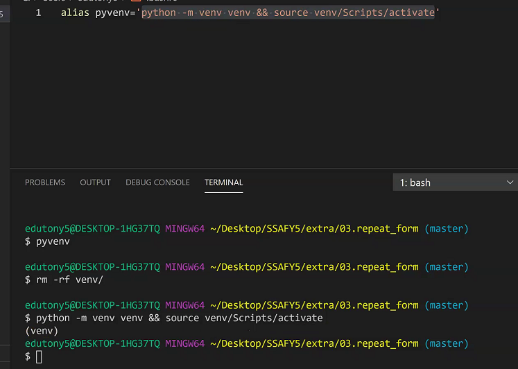

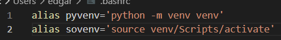

- 기본세팅

- 앱 -> 모델

  제일처음해야 할거는 모델생성

  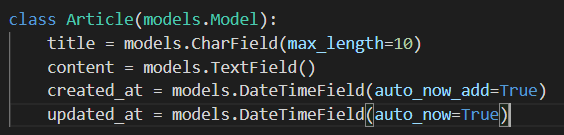

  urlpattern까지만 있으면 makemigrations가 가능해진다.

- .gitignore

  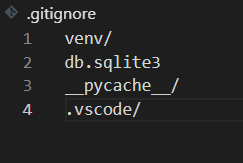

  /가있으면 일반적으로 디렉토리, 폴더로 명시하고 없다면 일반적으로 파일을 의미

- 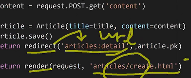

  render에 실제경로작성

  redirect name spacing이용하여 발생시킬 url의 님넥임을 작성

- 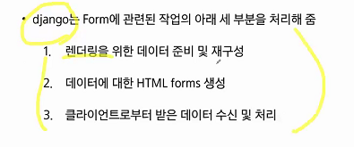

- 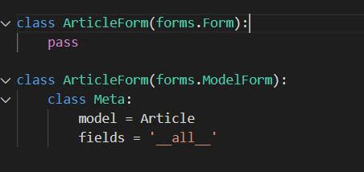

  위 두개의 차이. ModelForm은 Model과 연관이 있고, Form은 모델과 관련이 없다.

  중간에 BaseModel폼이 들어간다 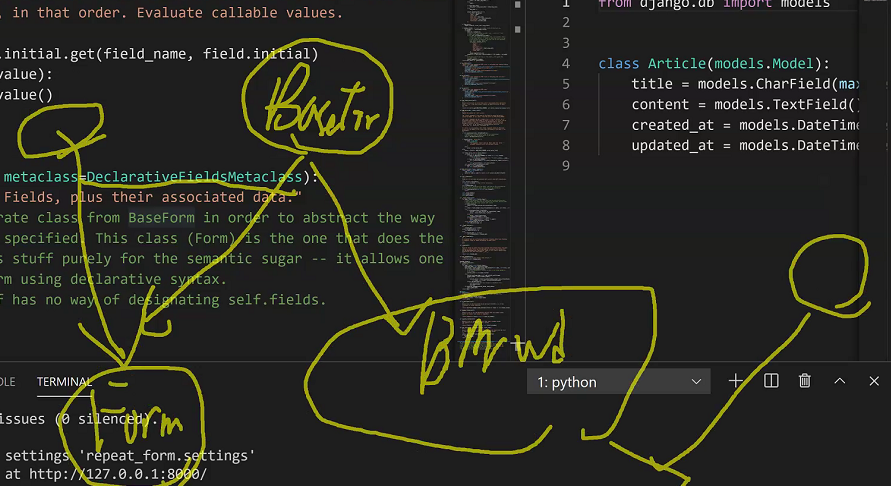

  


- create.html

  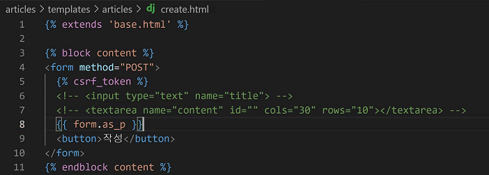

- views.py
  
  - created

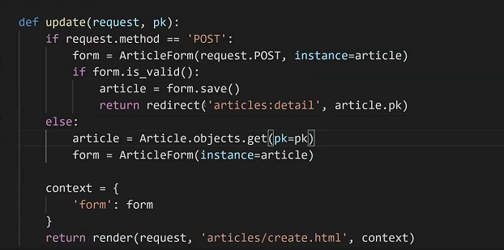

---

## 210319 review

### 1 admin.py

갈 때 우리가 만든 모델이 보여야하기때문에 models를 가져온다.

```python
from django.contrib import admin
from .models import Article

admin.site.register(Article) # admin site에 register해라

class ArticleAdmin(admin.ModelAdmin):
    list_display = ('pk','name') # 사이트에 보이고자하는 정보
```

하기전에 `auth`관련된 것들이 migrate된 상태여야만 한다.

```bash
$python manage.py migrate
```

```bash
$python manage.py createsuperuser
```

### 2 forms.py

```python
from django import forms
from .models import Article

class ArticleForm(forms.ModelForm):
    class Meta:
        model = Article
        fields = '__all__'
```

### 3 views.py

```python
from django.shortcuts import render, redirect, get_object_or_404
from .models import Article
from .forms import ArticleForm
from django.views.decorators.http import require_GET, require_POST, require_http_methods

# 전체조회
@require_GET
def index(request):
    articles = get_object_or_404(Article)
    context = [
        'articles': articles
    ]
    return render(request, 'articles/index.html', context)

# 단일조회
@require_GET
def detail(request, article_pk):
    article = get_object_or_404(Article, pk=article_pk)
    context = [
        'article': article
    ]
    return render(request, 'articles/detail.html', context)

# GET => new, POST => create
@require_http_methods(['GET', 'POST'])
def new(request):
    if request.method == 'POST':
        form = ArticleForm(request.POST) # 일단 틀리든 안틀리든 만들어진 폼
        if form.is_valid():
            article = form.save()
            return redirect('detail', article_pk=article.pk)
    else:
        form = ArticleForm()  # 빈 작성용 뼈대를 넘긴다
    context = {'form': form}
    return render(request, 'articles/new.html', context)

# Update
@require_http_methods(['GET', 'POST'])
def edit(request, article_pk):
    article = get_object_or_404(Article, pk=article_pk)
    if request.method == 'POST':
        form = ArticleForm(request.POST, instance=article)
        if form.is_valid():
            article = form.save()
        	return redirect('articles:index')
    else:
        form = ArticleForm(instance=article)
    context = {'form': form}
    return render(request, 'articles/new.html', context)

# Delete
@require_POST
def delete(request, article_pk):
    article = get_object_or_404(Article, pk=article_pk)
    # if request.method == 'POST':
    article.delete()
   	return redirect('articles:index')
    # return redirect('articles:detail', article_pk=article.pk)
```

### 4 index.html

```html



<h1>
    INDEX PAGE
</h1>
<a href="">NEW</a>

<hr>
{{ article.name }}
<hr>
{{ article.age }}
<hr>
{{ article.hobby}}
<hr>
<a href="">DETAIL</a>



```

###  5 new.html

```html



<form method="POST">
    
    {{ form.as_p }}
    <input type="submit" value="생성">
</form>


```

### 6 detail.html

```html



{{ article.pk }} : {{ article.name}}
<hr>
{{ article.age }}
<hr>
<a href="">EDIT</a>
<a href="">DELETE</a>
<a href="">BACK</a>

```

### 7 edit.html

```html



<form method="POST">
    
    {{ form.as_p }}
    <input type="submit" value="생성">
</form>


```

### 8 models.py

```python
from django.db import models

class Article(models.Model):
    title = models.CharField(max_length=10)
    age = models.IntegerField()
    
```

## 오류

- MultipleObjectsReturned

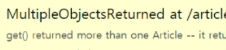

def index(request)에서

article = get_object_or_404(Article)로 할경우 Error발생

article = Article.objects.all()로 해줘야한다.

